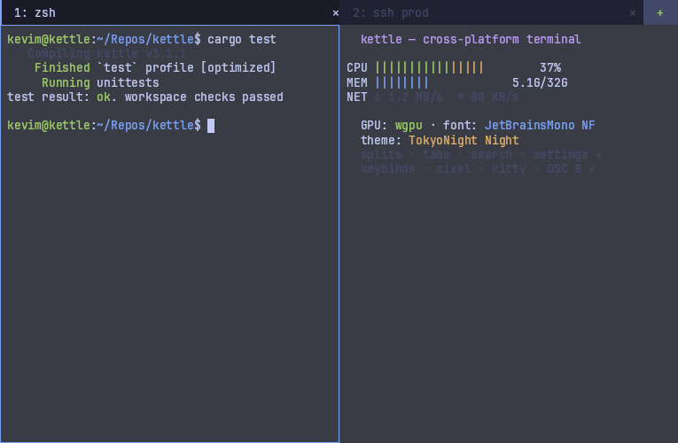

# kettle 🫖

[](https://github.com/Reddimus/kettle/actions/workflows/ci.yml)
[](https://github.com/Reddimus/kettle/actions/workflows/audit.yml)
[](https://github.com/Reddimus/kettle/actions/workflows/deny.yml)
[](https://github.com/Reddimus/kettle/actions/workflows/machete.yml)
[](https://github.com/Reddimus/kettle/releases/latest)
[](Cargo.toml)
[](LICENSE)

**Works out of the box** — bundled Nerd Font, 500+ themes, Terminator
keybinds, right-click Preferences. **GPU-accelerated** with `wgpu` so
splits and scrollback stay smooth on busy panes. **Cross-platform**:
one binary on Linux, macOS, and Windows 11.

A fast, GPU-accelerated terminal emulator written in Rust — combining
the best ideas of **Ghostty**, **Terminator**, **kitty**, **Alacritty**
and **WezTerm** into one tool.



<!-- Hero regenerated with the real renderer (no mockups), same offscreen path as
     the UX showcase:  kettle --screenshot docs/images/kettle-hero.png --cols 120 --rows 32
     The rendered version label tracks the crate version automatically (kettle-render
     SCREENSHOT_DEMO_VERSION = env!("CARGO_PKG_VERSION")), so it never re-stales. -->


> **Status: production-ready on Linux, macOS and Windows 11.**
> See [latest release](https://github.com/Reddimus/kettle/releases/latest)
> for prebuilt binaries (Linux tarball with installer + `.sha256`
> sidecar, macOS universal `.app`, Windows zip with embedded `.ico`).
> CI gates every push with these checks: build/test on all three OSes →
> `cargo doc -D warnings` → headless GPU smoke → `--screenshot-menu`
> visual regression → MSRV (Rust 1.89) verify → `cargo audit` →
> `cargo deny` (licenses + sources + bans) → `cargo machete` (unused
> deps) → `actionlint` (workflow YAML). See
> [docs/ROADMAP.md](docs/ROADMAP.md) for what is landing next and
> [docs/VERSION-HISTORY.md](docs/VERSION-HISTORY.md) for the release-history
> overview.

## Highlights

- **GPU rendering** — `wgpu` (Vulkan/Metal/DX12/GL) + a `cosmic-text` glyph
  atlas, with damage-aware draws.
- **Battle-tested VT core** — built on `alacritty_terminal` + `vte`, so
  vim/tmux/neovim/AstroNvim work out of the box (truecolor, undercurl,
  alt-screen, bracketed paste, mouse, kitty keyboard).
- **Terminator-style multiplexing** — tabs (clickable tab bar), splits,
  focus cycling, broadcast/group input (with a yellow active-tab and
  focused-pane accent so you always know broadcast is on) — with
  Terminator's default keybindings.
- **Multi-window with Chromium-grade tab tear-off** — one process hosts
  any number of OS windows (`Ctrl+Shift+I`). **Drag a tab past the tab
  bar and it tears off instantly into a live window that rides the
  pointer** in the OS's native move loop — Snap Layouts and FancyZones
  work mid-drag, and PTYs, scrollback and running programs move
  untouched. **Drop it onto another kettle window's tab bar to merge it
  back**: the dragged window turns translucent over the target strip, an
  accent line marks the insertion slot, and a lone-tab window can be
  re-docked the same way by dragging its tab. (`Esc` before the tear
  cancels; this is the live-window model Chrome uses — Windows Terminal
  only shows a ghost header and creates the window at drop.) Each window
  claims its own Peacock accent hue from the theme (on by default; pin
  one with `accent-color`/`--accent`, opt out with `accent-color =
  theme`) so windows are tellable apart at a glance.
- **New-tab dropdown** — the tab bar's `▾` lists every detected shell (on
  Windows, in Windows Terminal's order: PowerShell, Windows PowerShell,
  Command Prompt, WSL distros, the VS 2022 developer shells, Git Bash)
  plus Settings…, the command palette, and an **About kettle** panel
  (version + git hash, update status). `Ctrl+Shift+1..9` opens the Nth
  entry; menu rows show right-aligned hints from your live keybind map.
- **Every Ghostty theme bundled** (500+, from iTerm2-Color-Schemes), default
  **TokyoNight Night**. Ghostty-compatible `key = value` config with live
  reload.
- **Bundled JetBrains Mono Nerd Font** — AstroNvim icons render with zero
  setup.
- **Search overlay** — `Ctrl+Shift+F`, real regex with **smart-case**
  (case-insensitive until you type an uppercase), highlight + cycle.
- **Hyperlinks** — OSC 8, URL autodetection, and cwd-aware local file-path
  links for agent/editor output, underlined with hover and opened with
  `Ctrl`/`Cmd`+click.
- **Inline images** — Sixel, kitty graphics, and iTerm2 (OSC 1337) decoded
  and GPU-composited (`img2sixel`, `kitten icat`, `imgcat`).
- **Shell integration** — OSC 133 prompt marks; jump between prompts with
  `Ctrl+Up`/`Ctrl+Down` (see [docs/SHELL-INTEGRATION.md](docs/SHELL-INTEGRATION.md)).
- **Mouse reporting** — full passthrough so `vim`/`tmux`/`htop`/`fzf` mouse
  works (X10 + SGR 1006), including the side **Back/Forward** buttons;
  focus-event reporting (DEC ?1004) too.
- **Configurable bell** — visual flash and/or window-attention
  (taskbar/dock urgency); `bell = off|visual|attention|both`.
- **Polished input** — safe bracketed paste (newline-normalized,
  injection-guarded), confirmation for risky multi-line raw pastes,
  double-click word / triple-click line selection + **Alt-drag rectangular
  (block) selection**, auto-copy, middle-click paste, focus-aware hollow
  cursor, configurable blink, visual bell.
- **Drag-and-drop files** — drop any file onto the window and its
  shell-quoted path is inserted at the cursor (with a trailing space, so
  `cat ` + drop + Enter works). Honors broadcast mode.
- **Session restore (opt-in)** — new windows open fresh by default (like every
  mainstream terminal); enable `restore-session = true` (or pass `--restore`) to
  reopen **every window** from the previous session — tab/split trees, per-pane
  working directories, and each window's position and size (clamped to your
  current monitor layout) — on launch.
  New tabs/splits always inherit the focused pane's current directory (OSC 7).
  Splitting direct agent/editor panes opens a usable shell in that directory;
  duplicate actions preserve the exact launch command.
- **SSH multiplexing** — `Ctrl+Shift+S` opens an SSH launcher (configured
  `ssh-host` names with fuzzy tab-complete, or any `user@host`); SSH tabs
  persist across sessions.
- **Quick-select hints** — `Ctrl+Shift+H` labels every URL / path /
  git-hash / IP on screen; type a label to open it (URLs) or copy it.
- **Command palette** — `Ctrl+Shift+K` opens a fuzzy command palette;
  type to filter every action, `Tab`/`↑↓` to select, `Enter` to run.
- **Live theme switching** — cycle the 500+ bundled themes at runtime
  (palette: "Next/Previous theme", or `next_theme`/`prev_theme` binds).
- **Update check** — on by default, a quiet once-a-day check against GitHub
  releases shows a dismissable in-app banner when a newer version ships (it
  never auto-downloads anything). Run `kettle --check-update` to check on
  demand, or set `update-check = false` to turn it off. The check is compiled
  out entirely only when a build sets `KETTLE_PACKAGED` — intended for distros
  that build kettle from source and ship their own update channel. The official
  prebuilt binaries (and the Homebrew/AUR packages, which repackage those same
  binaries) are *not* built that way, so they do check by default; the runtime
  `update-check = false` opt-out applies to them.
- **Cross-platform** — one codebase for Windows 11, Linux (X11/Wayland) and
  macOS, via `winit` + `portable-pty` (ConPTY on Windows).

## Install

| OS | Versions | Recommended install |
|----|----------|---------------------|
| **Linux** | X11 + Wayland | one-line installer (below) |
| **macOS** | 11+ — Intel & Apple Silicon (universal `.app`) | drag-to-Applications (below) |
| **Windows** | Windows 11 | `install.ps1` from the release `.zip` (below) |

Every release ships prebuilt binaries on the
[releases page](https://github.com/Reddimus/kettle/releases/latest)
(Linux `.tar.gz` + `.sha256`, macOS universal `.app`, Windows `.zip`) — or
build from source.

### Linux — one-line installer (recommended)

Downloads the latest prebuilt binary + XDG launcher + icons and drops
everything into `~/.local/` (no `sudo`, no Rust toolchain):

```sh
curl -fsSL https://raw.githubusercontent.com/Reddimus/kettle/main/scripts/install-online.sh | sh
```

Then search **"kettle"** in GNOME Activities / KDE Krunner / Ubuntu's
Super-key, or run `kettle` from any shell on your `$PATH`.

Pin a specific version: `KETTLE_VERSION=v2.34.2 sh` instead of `sh`.
System-wide install: `KETTLE_PREFIX=/usr/local sh` (needs write access).
Uninstall later: `~/.local/share/kettle/install.sh --uninstall`.

### macOS

Grab `kettle-macos-universal.zip` from
[the latest release](https://github.com/Reddimus/kettle/releases/latest),
unzip, and drag `kettle.app` to `/Applications`. The binary is a true
arm64 + x86_64 universal — runs natively on every Mac.

### Windows 11

Grab `kettle-windows-x86_64.zip` from
[the latest release](https://github.com/Reddimus/kettle/releases/latest),
unzip it, and run the bundled installer from the extracted folder:

```powershell
.\install.ps1                        # per-user install: Start-menu entry + PATH (no admin)
.\install.ps1 -WithShellIntegration  # also wire OSC 133 prompt marks into your $PROFILE
.\install.ps1 -Uninstall             # remove it again later
```

Then press **Win** and type **"kettle"** to launch it from the Start menu.
(If PowerShell blocks the script, run
`powershell -ExecutionPolicy Bypass -File .\install.ps1`.) Prefer it
portable? Skip the installer — just `cd` into the folder and run
`kettle.exe`.

kettle opens **PowerShell 7+ (`pwsh`)** by default when it's installed —
the same default as Windows Terminal — falling back to Windows PowerShell
then `cmd.exe`. The new-tab `▾` dropdown lists the rest in Windows
Terminal's order: Windows PowerShell, Command Prompt, your WSL distros,
the Developer Command Prompt / Developer PowerShell for VS 2022 (when VS
is installed), and Git Bash — `Ctrl+Shift+1..9` opens the Nth entry.
Set `shell = cmd.exe` (or any program) in your config to
override. To use **WSL / Ubuntu**, set `command = wsl.exe -d Ubuntu` — see
[Launching WSL as your shell](docs/CONFIG.md#launching-wsl--ubuntu-as-your-shell-windows).

### Build from source

```sh
# Linux build deps (Debian/Ubuntu)
sudo apt-get install -y pkg-config libfontconfig1-dev libfreetype6-dev \
  libx11-dev libxkbcommon-dev libxkbcommon-x11-dev libwayland-dev libxcb1-dev

git clone https://github.com/Reddimus/kettle && cd kettle
cargo run --release                   # try it
./scripts/install.sh                  # XDG desktop install
./scripts/install.sh --uninstall      # undo later
```

Rust ≥ 1.89 (the workspace MSRV). See
[`docs/INSTALL.md`](docs/INSTALL.md) for packaging details across all
three platforms.

## First launch

1. **Run `kettle`** (or launch it from your app menu / Start menu). It
   opens with the **TokyoNight Night** theme and the bundled JetBrains
   Mono Nerd Font — zero setup. On Windows it starts **PowerShell 7+**.
2. **Right-click any pane → Preferences ▸** to toggle the scrollbar,
   cursor blink, bell, copy-on-select and font size — changes persist
   instantly to your config.
3. **Split** with `Ctrl+Shift+O` (top/bottom) or `Ctrl+Shift+E`
   (left/right), cycle panes with `Ctrl+Shift+N` / `P`, and open a new
   tab with `Ctrl+Shift+T`.
4. **Search** the screen with `Ctrl+Shift+F` (regex, smart-case), or open
   the **command palette** with `Ctrl+Shift+K` to fuzzy-find any action.
5. **Configure** it: run `kettle --write-default-config` to drop a fully
   commented starter config at the right path (it creates the folder for you
   and won't overwrite an existing config) — edits live-reload the moment you
   save. Run `kettle --config-path` to see where it landed.

## CLI quick reference

```sh
kettle --write-default-config                             # bootstrap a commented starter config (creates the dir, won't clobber)
kettle --print-default-config > ~/.config/kettle/config   # or print it to stdout to redirect yourself
kettle --shell-integration bash >> ~/.bashrc              # OSC 133 jump-to-prompt (zsh/fish also supported)
kettle --print-completions bash >> ~/.bashrc              # tab-complete every kettle flag
kettle --list-themes        # list every bundled theme (500+)
kettle --list-keybinds      # print the *effective* keymap (defaults + your overrides + unbinds)
kettle --list-actions       # list every action name accepted by `keybind = trigger=action`
kettle --list-ssh-hosts     # print configured `ssh-host = name=target` entries
kettle --config-path        # show where the config file is read from
kettle --check-config       # validate config: resolved settings + unknown-key / malformed-value diagnostics
kettle --gpu-info           # print the wgpu adapter / backend / driver / texture limits (for bug reports)
kettle --config FILE        # use a specific config file (live-reloaded; error if it doesn't exist)
kettle -d /path/to/dir      # open the first tab in this directory
kettle -e htop              # run a command instead of the shell
kettle -e ssh -t host       # (-e consumes the rest of the args)
kettle --screenshot OUT.png # render a representative frame offscreen and exit (no window)
```

Fatal GPU errors are recovered in process without restarting panes. Fault-only
JSONL diagnostics are retained under the per-user cache
(`%LOCALAPPDATA%\kettle\diagnostics\` on Windows); they contain adapter and
recovery metadata, never terminal contents.

## Default keybindings (Terminator-compatible)

| Action | Bind | Action | Bind |
|---|---|---|---|
| Split top/bottom | `Ctrl+Shift+O` | New tab | `Ctrl+Shift+T` |
| Split left/right | `Ctrl+Shift+E` | Close pane | `Ctrl+Shift+W` |
| Split (auto-pick) | `Ctrl+Shift+A` | New window | `Ctrl+Shift+I` |
| Focus next/prev pane | `Ctrl+Shift+N` / `P` | Close window | `Ctrl+Shift+Q` |
| Next/prev tab | `Ctrl+PgDn` / `PgUp` | Move tab left/right | `Ctrl+Shift+PgUp` / `PgDn` |
| Goto tab 1..9 | `Alt+1..9` | Zoom / unzoom pane | `Ctrl+Shift+X` |
| Copy / Paste | `Ctrl+Shift+C` / `V` | **Search** | **`Ctrl+Shift+F`** |
| **SSH launcher** | **`Ctrl+Shift+S`** | **Command palette** | **`Ctrl+Shift+K`** |
| **Quick-select hints** | **`Ctrl+Shift+H`** | Fullscreen | `F11` |
| Jump prev/next prompt | `Ctrl+Up` / `Down` | Resize split | `Shift+Arrows` |
| Directional focus | `Alt+Arrows` | Scroll to top/bottom | `Ctrl+Home` / `End` |
| Select to top/bottom | `Shift+Home` / `End` | Select all | command palette (`select_all`) |
| Scroll line / page | `Ctrl+Shift+Up/Down` / `Shift+PgUp/PgDn` | Reset font size | `Ctrl+0` |
| Font bigger / smaller | `Ctrl+` `+` / `-` | Broadcast on/off | `Super+G` / `Shift+Super+G` |
| Reload config | `Ctrl+Shift+M` | Reset terminal | `Ctrl+Shift+R` |
| New tab: Nth dropdown shell | `Ctrl+Shift+1..9` | Settings panel | `Ctrl+,` |

Full effective keymap with your `--config` applied: `kettle --list-keybinds`.
`Ctrl+Shift+I` opens the new window **in-process** (one kettle hosts them
all; the process exits when the last window closes). Dragging a tab past
the tab bar tears it off into a live window under the pointer; dropping
that window onto another kettle window's tab bar merges it there — the
`move_tab_to_new_window` action does the tear from the keyboard. (On
Wayland, where clients can't position windows, the tear happens at
release instead.) Set `detachable-tabs = false` to disable cross-window
tear-off while keeping tab switching and in-window reordering.

> **Tip — right-click anywhere in a pane** for the context menu: Copy /
> Paste / Split / Close, plus **Theme ▸** (cycle through 500+ bundled
> themes), **Profile ▸**, and the **Preferences ▸** submenu
> with one-click toggles for scrollbar mode, cursor blink, copy-on-select,
> bell mode, mouse-hide, and font size. Settings persist atomically to
> `~/.config/kettle/config` with a backup at `config.bak`. The menu
> supports keyboard mnemonics (single letter) and typeahead
> (multi-char prefix), and rows show right-aligned hints for their
> current keybinds (computed from the live keymap, so rebinds show
> your actual chord) — see [docs/CONFIG.md](docs/CONFIG.md)
> "Editing the config from inside kettle" for the full toggle map.

## Configuration

kettle reads `$XDG_CONFIG_HOME/kettle/config` (Ghostty syntax). Example:

```ini
theme = TokyoNight Night
font-family = JetBrainsMono Nerd Font
font-size = 13
background-opacity = 1.0
cursor-style = block
keybind = ctrl+shift+t=new_tab
```

See [docs/CONFIG.md](docs/CONFIG.md) and the sample at
[`docs/kettle.example.config`](docs/kettle.example.config). For backgrounds —
a zero-config **procedural starfield** (`background-type = starfield`), still
images, or animated (GIF/APNG/WebP) wallpapers, plus a GPU picker and curated,
clearly-licensed sources — see [docs/BACKGROUNDS.md](docs/BACKGROUNDS.md).

## AI agents

kettle is built to work with AI agents (Claude Code, Codex, …) **both ways** —
run an agent *inside* a pane like any terminal program (always worked, nothing
to configure), and let an agent *drive* kettle programmatically:

```sh
kettle exec -- echo ok           # headless one-shot: real PTY, output → stdout
kettle --agent-server full       # opt-in control server (off by default)
kettle ctl list_panes            # drive a running kettle: list/read/send/run
kettle ctl read_screen           # read the focused pane's visible text
kettle ctl send_keys --keys "escape,:,w,q,enter"   # press keys/chords (v2.20)
kettle ctl wait_for --text "INSERT"                # block until on screen (v2.20)
claude mcp add kettle -- kettle mcp   # register kettle as MCP tools for Claude Code
```

- **`kettle exec -- <cmd>`** runs a command headlessly under a real PTY (full
  VT emulation, no window) and streams its output to stdout, propagating the
  child's exit code (`--strip-ansi` / `--json` output modes).
- **`kettle --agent-server <mode>` + `kettle ctl <method>`** drives a *running*
  kettle — list panes, read the screen, send text, **press named keys/chords
  (`send_keys`) and wait for screen conditions (`wait_for`)**, run commands —
  enough to drive interactive TUIs (vim, htop, tmux) end-to-end. The server is
  **off by default**; `read-only` reads, `full` also sends/runs. Local IPC only
  (Unix socket / Windows named pipe, current-user).
- **`kettle mcp`** exposes all of the above as Model Context Protocol tools, so
  Claude Code / Codex get kettle as native tools.

See [docs/AGENT.md](docs/AGENT.md) for the full surface, methods, and security
model.

## Documentation

- [docs/GETTING-STARTED.md](docs/GETTING-STARTED.md) — friendly first-run walkthrough (no jargon)
- [docs/SETTINGS.md](docs/SETTINGS.md) — the in-app Settings panel (`Ctrl+,`)
- [docs/ARCHITECTURE.md](docs/ARCHITECTURE.md) — system design + diagrams
- [docs/RESEARCH.md](docs/RESEARCH.md) — analysis of other terminals & citations
- [docs/UX-COMPARISON.md](docs/UX-COMPARISON.md) — cited UI/UX matrix vs Ghostty/kitty/WezTerm/Terminator/Alacritty
- [docs/INSTALL.md](docs/INSTALL.md) — install per-OS / from source
- [docs/ROADMAP.md](docs/ROADMAP.md) — what's done / next
- [docs/TESTING.md](docs/TESTING.md) — test suite + CI
- [docs/AUDIT-2026-07.md](docs/AUDIT-2026-07.md) — Windows reliability investigation + tracked-tree audit
- [docs/PERFORMANCE.md](docs/PERFORMANCE.md) — measured startup / memory / render numbers
- [CHANGELOG.md](CHANGELOG.md) — release history
- [docs/CONFIG.md](docs/CONFIG.md) — every config key
- [docs/AGENT.md](docs/AGENT.md) — driving kettle from AI agents (`kettle exec` / `kettle ctl` / `kettle mcp`)
- [docs/SHELL-INTEGRATION.md](docs/SHELL-INTEGRATION.md) — OSC 133 prompt-mark hooks for bash / zsh / fish
- [CONTRIBUTING.md](CONTRIBUTING.md) — the audit-cycle pattern + how to land your first change

## License

MIT. Bundled assets, third-party crates kettle consumes (Alacritty's VT
core, WezTerm's `portable-pty`, cosmic-text), and the design-source
projects kettle cites (kitty's graphics protocol spec, Terminator's
splits-and-broadcast convention, Ghostty's config syntax) are all
credited in [NOTICE](NOTICE).
