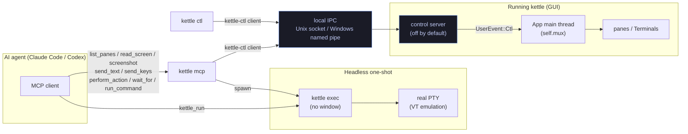

# Agent-first kettle

kettle is designed so AI agents (Claude Code, Codex, …) work great with it **both
ways**:

- **Interactively** — run the agent *inside* a kettle pane, like any terminal
  program. (Always worked; nothing to configure.)
- **Non-interactively / programmatically** — an agent *drives* kettle: run a
  command headlessly and read its output, or attach to a running kettle window
  to read the screen and type into panes.

This doc covers the programmatic surface: `kettle exec`, the control server +
`kettle ctl`, and the `kettle mcp` MCP server. It is OFF by default — the
control server only starts when you opt in.

## The three entry points

```
kettle exec  -- <argv…>     # headless one-shot: run a command, stream its output
kettle ctl   <method> …     # drive a RUNNING kettle (list panes, read, send, run)
kettle mcp                  # MCP server: expose all of the above as agent tools
```

## Control plane



The protocol, transport, discovery, and client live in the **`kettle-ctl`** crate
(UI-free). The GUI hosts the server side; `kettle ctl` and `kettle mcp` host the
client side. This split is deliberate: when the optional `kettle-muxd` session
daemon (see [MUX-SERVER-DESIGN.md](MUX-SERVER-DESIGN.md)) lands, it can re-host
the same server side without breaking any client — the discovery registry
already reserves a `kind` field (`"gui"` today, `"muxd"` later).

## `kettle exec` — headless one-shot

Run a command under a real PTY (full VT emulation) with no GPU and no window,
and stream its output to real stdout. Propagates the child's exit code (124 when
`--timeout` expires before a child status is collected, 74 when stdout delivery
fails, 125 on an internal error).

```sh
kettle exec -- python -c "print(2+2)"           # → 4
kettle exec --strip-ansi -- ls --color=always   # plain text, escapes stripped
kettle exec --json -- some-tui                   # NDJSON: start/output/title/exit
kettle exec --timeout 5 -- slow-thing            # kill + exit 124 after 5s
kettle exec --record run.cast -- make            # also save an asciicast trace
```

Output modes: raw (default, verbatim PTY bytes — includes a terminal's normal
control sequences), `--strip-ansi` (plain text, good for assertions), `--json`
(one JSON object per line).

The timeout also bounds trailing output after the child exits. If stdout is
still stalled at the deadline, Kettle abandons output the downstream consumer
cannot accept and returns an already-collected child status, or 124 when no
status was available. MCP cancellation takes precedence at every lifecycle
stage and returns 130.

A real stdout write or flush failure is different from deadline abandonment.
Kettle reports it on stderr, stops and reaps the child tree, and returns 74;
JSON mode cannot promise a final exit event after its output sink has failed.
`--cwd DIR` validates an explicit directory before PTY creation and never falls
back to HOME: a missing path or regular file returns 125 without spawning the
command. Omitting `--cwd` inherits Kettle's current directory.

On Windows, if a verified managed update is already staged but another Kettle
window still holds the installed image, every argument-bearing invocation exits
75 after stating that no requested work ran. Retry it after the windows close.
A bare GUI launch may exit zero after handing the update to the helper.

`--record PATH` is output-only and uses the same private asciicast writer as
the developer GUI recorder. Kettle acquires the file's exclusive lock and
rejects links/non-regular targets before it creates the PTY; failure exits 125
without running the command. Capture stops at a complete event boundary before
512 MiB. A later write failure stops recording but does not kill a child that
is already running.

### ConPTY caveats (Windows)

On Windows the child runs under a ConPTY (pseudoconsole). Two consequences:

- **Raw mode includes ConPTY's startup handshake** (`ESC[6n`, mode-set
  sequences) and is a *re-rendered* screen, not byte-verbatim. For assertions
  use `--strip-ansi` (or the MCP `kettle_run` tool, which strips by default).
- **A command that exits in well under ~50 ms** can have its output collapsed by
  ConPTY's screen-differ before kettle ever sees it. `kettle exec` adds a short
  settle-drain to mitigate this, but a near-instant command may still under-emit.

### Stdin forwarding

On Unix and WSL, when `kettle exec` is launched with piped or redirected stdin,
it forwards that input to the child PTY:

```sh
printf 'hello\n' | kettle exec --strip-ansi -- sh -c 'read x; echo "got:$x"'
```

Interactive terminal stdin is not stolen from the user, and `/dev/null` stays
closed rather than being treated as useful input. On pipe EOF, Kettle reads the
child PTY's live Unix `termios` state. In canonical mode it sends that PTY's
configured VEOF character once for empty or line-terminated input, or twice
when the forwarded stream ends with an unterminated record (the first completes
that record; the second returns zero from the next read), while retaining the
bidirectional master used for DA, DSR, Kitty, and other terminal replies.
Each VEOF byte is a separate nonblocking, lowest-priority writer step, so a
full canonical buffer cannot trap the arbiter ahead of a later terminal reply.
Boundary detection applies the live `IGNCR`, `ICRNL`, and `INLCR` mappings and
the enabled VEOL/VEOL2 characters rather than assuming default CR/LF settings.
It also models the host line discipline's VWERASE behavior: Linux N_TTY word
classes differ from BSD simple and `ALTWERASE` modes. `EXTPROC` bypasses normal
canonical editing, so Kettle never injects VEOF while it is active and treats
pending input across an `EXTPROC` transition as ambiguous.
The incremental canonical-record tracker retains at most 64 KiB. An oversized
unterminated record is conservatively treated as nonempty (two VEOF
characters), while an ambiguous live `termios` transition or trailing VLNEXT
fails explicitly instead of guessing.

A Unix PTY has no independently closable input half. If the child has selected
noncanonical/raw or `EXTPROC` input, or its VEOF is disabled or cannot be
inspected, Kettle
therefore keeps the PTY open and prints an explicit diagnostic instead of
closing the shared master or guessing an input byte. Raw-mode applications
must use their own protocol delimiter or `--timeout`.

Headless `kettle exec` has no clipboard sink, so its DA1 reply omits extension
`52` and OSC 52 writes are not advertised. OSC 52 reads receive an empty reply
rather than exposing the host clipboard. All protocol replies use a dedicated
writer arbiter with a bounded 64-message priority queue, even when stdin is not
forwarded. A child that floods queries without reading replies therefore fails
closed with exit 125 instead of blocking timeout or cancellation. The semantic
VT-event queue is independently bounded at 1024 events; overflow also fails the
command explicitly instead of dropping reply-bearing events. Reply admission
and each incremental Unix VEOF attempt are ordered by a short nonblocking gate,
so an admitted terminal reply cannot be overtaken by a stale EOF decision. A
query generated only after the kernel accepted a VEOF cannot retroactively
overtake that byte.

Native Windows ConPTY forwards piped bytes too, so delimiter-driven commands
(`read`, a line-oriented parser, a known byte count) work normally. ConPTY has
no safe portable input half-close, however: when the parent pipe reaches EOF,
Kettle keeps conin alive to preserve the child and terminal-reply channel
instead of forcing `STATUS_CONTROL_C_EXIT`. A Windows child that waits for EOF
must use its own delimiter or `--timeout`. WSL uses the Unix canonical-EOF path
above. The MCP `kettle_run` tool still gives the child no stdin by design; use
`kettle exec` directly for stdin-driven one-shot commands.

Kettle configures only its own ConPTY input-pipe writer for `PIPE_NOWAIT` and
advances it in at most 1 KiB steps. The separate synchronous handle passed to
`CreatePseudoConsole` remains unchanged. A child that stops reading input can
therefore return zero progress to the bounded priority writer instead of
parking it inside a kernel write; protocol replies, timeout, cancellation, and
pane shutdown remain observable under backpressure.

## Control server + `kettle ctl`

The control server lets another process inspect and drive a *running* kettle
window. It is **off by default**; enable it per launch or in config:

```sh
kettle --agent-server full        # this launch only
# or in ~/.config/kettle/config (or %APPDATA%\kettle\config on Windows):
#   agent-server = full
```

Modes: `off` (no server), `read-only` (read the screen / list panes / subscribe),
`full` (also send text + run commands).

The endpoint is local-only and user-private. Unix uses a `0600` domain socket;
both accepted servers and connecting clients compare peer credentials with the
effective uid. Windows rejects remote named-pipe clients, gives every pipe an
exact token-user owner plus a protected owner/SYSTEM/Administrators DACL, and
then compares the connecting process or pipe owner with the exact current
token-user SID. A client authenticates that server identity before sending any
request bytes. Discovery ignores links, unsafe permissions, mismatched pids,
and non-v1 records; registry and presence walks inspect at most 1,024 directory
entries.

This is intentionally a **same-OS-user trust boundary**, not per-client
authorization. Enabling `read-only` lets any process running as that user read
terminal contents, pane/process metadata, UI geometry, and subscribed events
across every window in the Kettle process. Enabling `full` additionally lets
any such process inject text, keys, and mouse input; invoke Kettle actions; run
commands; resize windows; and write screenshots. There is no per-client prompt,
pairing token, capability grant, or consent dialog after the server is enabled.
That is acceptable for the documented opt-in model because same-user processes
are trusted like the Kettle process itself. If that is too broad for a machine,
leave the server off, use `read-only`, or run untrusted programs under a
different OS account. A future threat model that distrusts same-user processes
would require per-client capabilities/consent rather than another pathname or
DACL check.

Then drive it with `kettle ctl`:

```sh
kettle ctl get_state                                   # version, theme, pid, mode
kettle ctl list_panes                                  # id / tab / cwd / size / focus
kettle ctl read_screen                                 # focused pane's visible text
kettle ctl read_screen --pane 3 --json '{"scrollback_lines":200}'
kettle ctl read_cells --raw                            # text cells + underline/strikeout attrs
kettle ctl ui_geometry --raw                           # window/tab geometry for UI diagnostics
kettle ctl send_text --text "ls -la"                   # type into the focused pane
kettle ctl send_keys --keys "enter"                    # …then press Enter
kettle ctl send_keys --keys "escape,:,w,q,enter"       # press keys/chords (v2.20)
kettle ctl send_mouse --json '{"event":"click","x":20,"y":10,"button":"left"}'
kettle ctl resize_window --json '{"width":900,"height":560}'
kettle ctl perform_action --text "start_search"        # dispatch app chrome actions
kettle ctl dispatch_ui_key --keys "n,e,e,d,l,e,enter"  # drive the open Search bar; never PTY input
kettle ctl wait_for --text "INSERT" --json '{"timeout_ms":5000}'   # block until on screen
kettle ctl run_command --text "cargo build"            # run + wait for the result
kettle ctl events                                       # stream the event feed (NDJSON)
kettle ctl get_state --pid 12345                        # target a specific kettle
```

Note: `--text` is literal — backslash escapes like `\n` are **not** decoded —
so press Enter with `send_keys`, not a trailing `\n`.

### Methods (protocol v1)

| Method | Mode | Result |
|---|---|---|
| `get_state` | read-only | version, pid, mode, theme, focused pane, `windows` (count), `focused_window` (seq), `window_title` |
| `list_tabs` | read-only | every window's tabs: `window` (seq), index, title, active, pane ids |
| `list_panes` | read-only | every window's panes: id, `window` (seq), tab, title, cwd, cols/rows, focused, argv, child_pid, agent_attached, read_only |
| `read_screen` | read-only | visible viewport text + cursor + `cursor_visible` (DEC ?25) + history metadata + selection presence/range; `include_selection: true` includes selected text only when its preflight is at most 128 KiB (otherwise it is omitted and `selection_truncated` is true); with `scrollback_lines`, returns requested history plus the active screen for command-output capture (params: `pane`, `scrollback_lines`, `include_selection`, and paging fields) |
| `read_cells` | read-only | visible cell grid plus selected attributes (`any_underline`, underline variants, strikeout, underline-color presence) for renderer diagnostics without OCR |
| `ui_geometry` | read-only | live window geometry: surface/content rects, renderer cell metrics, resize-overlay grid, tab-bar segment/new-tab rects, tab segment `path`/`fitted_title` diagnostics, pane titlebar rect/title/path/`fitted_title` diagnostics, open context-menu rect/rows, cursor, tab drag armed/visible state, and additive Search geometry/status/control metadata. The Search object deliberately omits its query and matched terminal text |
| `screenshot` | full | save a live PNG (`pane`, `full_window`, `path`); filesystem writes are never allowed through read-only mode |
| `subscribe` | read-only | switches the connection to the event stream |
| `wait_for` | read-only | v2.20: block until the screen matches (`text` substring / `regex` / `quiet_ms` settle — AND when combined; `timeout_ms` default 30 000). Returns `{matched, elapsed_ms, polls}`; a timeout is `matched: false`, not an error. Runs on the connection thread, polling ≥50 ms — the UI is never blocked. The screen-text regex runs against per-line right-trimmed, newline-joined text — use `(?m)` end-of-line anchors rather than end-of-string |
| `send_text` | full | type text into a pane (`pane`, `text`) |
| `send_keys` | full | v2.20: press 1–1,024 named keys / chords (`pane`, `keys: ["escape","ctrl+c","down","G",…]`), with 64-byte tokens and a 64 KiB encoded-byte budget. Tokens: key names (`escape`, `enter`, `tab`, `backspace`, `delete`, `insert`, `space`, arrows, `home`/`end`, `pageup`/`pagedown`, `f1`–`f12`), chords with `ctrl`/`alt`/`shift`/`super` (+ aliases), or single characters (case preserved). Encoded through the same path as GUI keystrokes against the pane's live modes (DECCKM- and negotiated Kitty CSI-u-aware); all tokens parse before any byte is sent |
| `dispatch_keybind` | full | diagnostic app-keybind dispatch (`logical`, `physical`, `mods`) using the same resolver as real window keyboard input. It does not write PTY bytes; it returns the candidate triggers, matched action, and whether a modal blocked dispatch |
| `dispatch_ui_key` | full | press 1–64 pre-parsed key tokens (each at most 64 bytes) in the currently open supported Kettle modal. Search consumes them through its real Unicode editor/navigation path; no token is encoded or written to the PTY. All tokens validate before the first state change, and a closed modal is an error |
| `send_mouse` | full | deterministic mouse input for diagnostics (`event`: `move`/`press`/`release`/`click`/`wheel`, window-relative `x`/`y`, `button`, `wheel_lines` **or** `wheel_delta`, optional event-local `mods`). A wheel event takes exactly one of `wheel_lines` (signed whole scroll lines, entering downstream of quantization) or `wheel_delta` (signed raw wheel detents, fractions allowed — runs the real sub-detent accumulator, so it can emulate a precision touchpad) |
| `resize_window` | full | request a live window client-area resize (`window`, `width`, `height`) and let the normal renderer/PTY resize path process it |
| `perform_action` | full | dispatch a named Kettle app action (`action`, for example `start_search`, `command_palette`, `open_ssh`, `hint_mode`, `edit_tab_title`). Use this for app chrome that is not pane input; `send_keys` intentionally writes terminal keystrokes to the focused pane |
| `run_command` | full | run `command` in a pane, reply with `{exit_code, duration_ms, output, output_truncated}`; output is capped at 512 KiB |

**Multi-window (v2.18)**: a kettle process can host several OS windows.
`list_tabs` / `list_panes` enumerate them all, ordered by window seq;
`index`, `tab`, `active`, and `focused` are *within-window* values — the
`window` field disambiguates. Pane ids are process-global and stable across
tab moves/tear-offs, and an explicit `pane` param targets a pane in **any**
window (without one, the focused window's focused pane is used).
When `pane` or `window` is supplied explicitly it must be an unsigned integer
that identifies a live target. A malformed or stale explicit target is an
error; Kettle never falls back to the focused pane/window for that request.

`list_tabs`, `list_panes`, `read_screen`, and `read_cells` are paged. Pass
`limit` (1–4096); when `truncated` is true, repeat the call with both the returned
`next_cursor` and `snapshot`. A `stale_snapshot` error means live terminal state
changed between pages and the read must restart. Small results remain one page.
`read_screen` additionally reports `text_truncated` if one pathological terminal
line alone exceeds its 256 KiB text budget. Its complete stable-pagination
snapshot is preflighted at 512 KiB before allocation; larger scrapes return
`response_too_large`. Live-state collection and visible-cell capture stop at
262,144 items before building JSON values.
Every control request is capped at 1 MiB and every response/event at 768 KiB;
protocol peers must send exactly `v: 1`.

The control server admits at most eight peers. A request connection must send a
non-empty frame within 30 seconds; after its first byte, the newline has an
absolute five-second assembly deadline that byte-by-byte drips do not extend.
Responses and events have five-second writes. UI-dispatched replies have a
610-second ceiling (the longest `run_command` is 600 seconds), and subscribers
receive a bounded keepalive every 20 seconds so an unread stream eventually
backpressures and is reclaimed. These are availability limits, not permission
boundaries.

`run_command` correlates the shell's OSC 133 command-end marker to learn the
exit code. **Without shell integration** there is no marker, so the call returns
`{timed_out: true, …}` after `timeout_s` (default 15) with a hint to run
`kettle --shell-integration <shell>`. Output is still captured either way.

A pane the user has toggled **Read only** (right-click menu /
`toggle_read_only`) rejects `send_text`, `send_keys` and `run_command` with
the `read_only` error code — the agent is input like any other, and the
user's lock wins.

### Driving an interactive app (v2.20)

`send_keys` + `wait_for` together make interactive TUIs scriptable without
sleep-and-pray. Editing a file in vim from an agent:

```sh
kettle ctl send_text  --text "vim notes.txt"
kettle ctl send_keys  --keys "enter"
kettle ctl wait_for   --json '{"quiet_ms":300,"timeout_ms":10000}'   # vim painted
kettle ctl send_keys  --keys "i"                                     # insert mode
kettle ctl wait_for   --text "-- INSERT --"
kettle ctl send_text  --text "hello from an agent"
kettle ctl send_keys  --keys "escape,:,w,q,enter"                    # save + quit
kettle ctl wait_for   --json '{"regex":"(?m)\\$$","quiet_ms":200,"timeout_ms":5000}'   # prompt is back
```

The same flow over MCP uses `kettle_send_keys` / `kettle_wait_for`. Read the
screen between steps with `read_screen` — its `cursor` + `cursor_visible`
(DEC ?25) tell you where input would land and whether the app is showing a
cursor at all (vim's command line, fzf and less hide it).

Events (after `subscribe`): `command_finished`, `pane_focus`, `title`,
`agent_attached`, `tab_moved` (`{from_window, to_window, tab}` — a tab was
torn off / moved to another window), and `lag` (when a slow subscriber's
queue overflowed).

### When an agent attaches a pane

A pane targeted by a control connection shows the `agent-badge` prefix (default
`"[agent] "`) in its per-pane titlebar, and an `agent_attached` event fires. Set
`agent-badge = ` (empty) to disable, or to any glyph you like (`agent-badge = 🤖 `).

## `kettle mcp` — MCP server

Expose all of the above as Model Context Protocol tools, so Claude Code/Codex get
kettle as native tools.

```sh
claude mcp add kettle -- kettle mcp
```

Or a project-scoped `.mcp.json`:

```json
{ "mcpServers": { "kettle": { "command": "kettle", "args": ["mcp"] } } }
```

Tools: `kettle_run` (headless one-shot — needs no running kettle),
`kettle_list_panes`, `kettle_read_screen`, `kettle_read_cells`,
`kettle_ui_geometry`, `kettle_screenshot`, `kettle_send_text`,
`kettle_send_keys`, `kettle_dispatch_ui_key`, `kettle_send_mouse`, `kettle_resize_window`,
`kettle_perform_action`, `kettle_wait_for`, `kettle_run_command` (these drive a
running kettle, so start it with `kettle --agent-server full`). When no server
is found, the control-backed tools return an actionable error pointing at
`--agent-server`.

For Search automation, call `kettle_perform_action` with `start_search`, then
send individual character/chord tokens through `kettle_dispatch_ui_key` and
observe `kettle_ui_geometry`. The diagnostic object reports the target pane,
bar/reserved-row geometry, each control rectangle and focus state, status,
match/truncation booleans, Wrap, Smart/Match/Ignore, and Invert. It intentionally
does **not** return the query or matched terminal text; screenshots and
`read_cells` are the evidence for highlight placement. A **Results limited**
status or `visible_truncated = true` is not a definitive
first/last/no-match verdict; an ordinary exact work-budget continuation remains
**Searching** instead. **Pattern too complex** is a distinct compile status for
a syntactically valid expression beyond the bounded engine budget. This
separation also lets a probe run while tmux,
AstroNvim, Codex CLI, or Claude Code CLI owns the pane without corrupting that
program's input stream.

The control surface also exposes `screenshot`, which saves a live PNG using the
same renderer readback path as the UI screenshot action. It requires
`agent-server=full` because it writes to the filesystem; by default it captures
the focused pane crop, and `--json '{"full_window":true}'` captures the whole
window.

`kettle mcp --self-test` runs an in-process handshake + `tools/list` + one
`kettle_run`, for CI.

The stdio server negotiates MCP `2025-11-25` and the compatible `2025-06-18`
revision. Clients must send `initialize`, wait for its response, then send the
exact `notifications/initialized` notification before calling tools. Tool calls
run on four workers behind a 16-request queue; `ping` remains available during
the initialization handshake. Unknown tools and malformed `tools/call`
envelopes return JSON-RPC `-32602`; execution/input failures from a known tool
remain MCP tool errors. `notifications/cancelled` marks queued or running
requests cancelled, promptly terminates a running `kettle_run` child or stops a
control-server wait, and emits no response for that cancelled request as
required by MCP.
JSON-RPC input is capped at 1 MiB per line, output at 768 KiB, and tool text at
512 KiB. Tool text is truncated further when JSON escaping would otherwise
exceed the encoded response cap. Stdout contains protocol messages only.

## Local Smoke Checks

Two optional scripts cover the agent workflows that depend on tools installed on
the developer's machine, so they are intentionally not CI gates:

```sh
scripts/check-agent-cli-smoke.sh
# Resolver/quoting regression fixtures only (no installed agents required):
scripts/check-agent-cli-smoke.sh --self-test
```

Always verifies Kettle's own non-interactive agent path first: `kettle exec`
PTY environment (`TERM=xterm-256color`, `COLORTERM=truecolor`), `kettle exec
--json` output events, and `kettle mcp --self-test`. Then it runs Codex CLI,
Claude Code CLI, clean Neovim, and configured Neovim/AstroNvim version, help,
or command-path probes through `kettle exec` when those commands are present on
`PATH`; missing optional tools are reported as skips. The Codex help probe also
pins the `--image <FILE>` initial-attachment option. This smoke does not drive
either client's interactive composer, populate a clipboard, inject a paste key,
or assert an attachment UI state. On Windows under Git Bash, extensionless npm
POSIX shims are never passed directly to `CreateProcessW`; the smoke resolves
the adjacent `.cmd` launcher through `cmd.exe /d /s /c`. Its self-test pins
that choice with deliberately unusable extensionless shadow files.

```sh
just live-render-smoke
```

Starts a real Kettle window with `text-renderer = grid`, captures several live
screenshots through `kettle ctl screenshot`, and fails if cursor blink changes a
broad region instead of a cursor-sized box. The script also draws a high-contrast
prompt-shaped `➜  ~ KETTLE_LIVE_RENDER_SMOKE` marker and rejects blank or
mostly-empty screenshot frames, so the rendered PNGs must prove that normal
prompt glyphs remain visible across blink phases. This needs a visible
X11/Wayland desktop session.

```sh
just agent-tui-smoke
```

Starts a real grid-renderer Kettle window in explicit `native` shell mode,
using PowerShell on Windows and deterministic non-rc Bash on Unix/macOS. The
recipe asks Cargo to build and report the current checkout's exact release
executable (including a custom `CARGO_TARGET_DIR` or configured target triple),
then drives a shell marker, optional Codex
CLI and Claude Code CLI `--version` probes plus `codex exec --help` /
`claude --print --help` output captures, a prompt-shaped `➜  ~` marker, a
deterministic Windows Codex active-placeholder and queued-input cursor fixtures,
tmux attach/send/capture
when `tmux` is installed, including a build-capability-gated SIXEL render on
tmux 3.4 or newer built with `--enable-sixel`, and clean/configured
Neovim/AstroNvim marker buffers plus clean and configured Neovim vertical-split
workflow states through `kettle ctl`. The awaited editor text is assembled from
separate halves inside Vimscript and never appears literally in the typed shell
command, so shell command echo cannot pass an editor-state probe. Set
`KETTLE_AGENT_AUTH_SMOKE=1` to also
run serialized real authenticated `codex exec` / `claude --print` marker prompts inside
the Kettle pane. A probe passes only when the child exits zero and emits the
exact response inside its generated output frame, so command echo and a stale
`$LASTEXITCODE` cannot create a false success. Use
`KETTLE_AGENT_AUTH_SMOKE=strict` when missing or expired external credentials
should fail the run. It saves PNG screenshots,
`read_screen`, `read_cells`, and
`analysis.json` under `target/diagnostics/agent-tui-*` on Unix. On Windows, the
default is an unpredictable protected-DACL directory at
`%LOCALAPPDATA%\kettle\kettle-live-ui-diagnostics-*\agent-tui-*`; explicit
`--out-dir` still overrides it. The harness fails if a captured state is blank
or lacks visible terminal cells. Missing optional CLIs/tools are reported as skips;
the shell and prompt-shaped states always run. The Codex/Claude legs remain
version/help captures or opt-in noninteractive authenticated prompts; they do
not test interactive image-paste shortcuts. When tmux is available, the run
also writes `tmux.png`, `tmux.screen.json`, and `tmux.cells.json`. A
compile-capable tmux with nonzero cell-pixel geometry additionally produces
`tmux-sixel.png` and pixel evidence. Zero geometry produces a captured
`tmux-sixel-fallback` state but remains an explicit render skip; an older,
disabled, or unverified tmux build is skipped before the fixture.

On Windows, use the separate cross-boundary mode to keep the shipped
`kettle.exe`/ConPTY/window path while running the shell and tools inside WSL:

```powershell
just agent-tui-wsl-smoke
# Optional non-default distro and AstroNvim config inside that distro:
$env:KETTLE_SMOKE_WSL_DISTRO = "Ubuntu"
$env:KETTLE_SMOKE_ASTRO_CONFIG = "/home/me/.config/nvim"
$env:KETTLE_SMOKE_NVIM_DATA = "/home/me/.local/share/nvim"
just agent-tui-wsl-smoke
```

This builds the exact current checkout Windows executable reported by Cargo,
launches `wsl.exe` with deterministic non-rc Bash, strips Windows
`/mnt/<drive>` entries from the target `PATH`, and rejects or reports any tool
whose canonical path still resolves to a Windows-host mount. tmux uses a
cryptographically random private socket, the Bash executable resolved inside
that distro (not a hard-coded `/bin/bash`), and checked cleanup registered
before the session starts. Before configured Neovim or AstroNvim runs, the
helper creates an unpredictable, owner-private directory inside the target
distro. It copies only regular files from the config plus existing
`lazy`/`site` plugin runtime while dereferencing symlinks; cycles, special
files, more than 100,000 entries or 64 levels, a file over 256 MiB, and an
aggregate over 2 GiB are rejected. It then redirects `HOME`,
`XDG_CONFIG_HOME`, `XDG_DATA_HOME`, `XDG_STATE_HOME`, and `XDG_CACHE_HOME` to
that snapshot; `XDG_RUNTIME_DIR` is isolated there as well. Clean Neovim uses
the same isolation; the directory is removed at the end.

This protects ordinary configuration and plugin writes that honor `HOME` or
Neovim's XDG paths. It is state isolation, not an OS security sandbox: code
that deliberately writes a hard-coded absolute path can still reach that path.
Authenticated agent probes remain opt-in and use the target shell's existing
credentials.

```sh
just interaction-smoke
```

Starts a real grid-renderer Kettle window and drives broader UI states through
`kettle ctl`: multiline text entry, scrollback wheel movement, tab-bar `+`
creation, local selection drag, an exact 141-line
Shift+Home/Shift+End/Shift+click selection and copy action, right-click
context-menu opening, and screenshot capture. It also clicks the `Split Right`
context-menu row and verifies a new
pane, resizes the split window and verifies the focused pane grid changes, then
emits OSC 777 from the live pane and verifies the subscribed `kettle ctl events`
stream receives a `protocol_notification` event with the expected title/body. It saves
PNG screenshots, `read_screen`, `read_cells`, `ui_geometry`, and `analysis.json`
plus `notification-events.jsonl` under `target/diagnostics/interaction-*`, and
fails if scrollback text does not follow the visible viewport, if captures are
blank, if the tab count does not increase, if selection drag does not visibly
change content pixels, if the context menu lacks a dispatchable `Split Right`
row, if that row does not create a split pane, if resize does not update the
surface/grid and resize-overlay geometry, or if the OSC notification is not
broadcast on the event stream.

```sh
just tabbar-click-smoke
```

Starts a real Kettle window, creates three tabs by clicking the `+` button via
`send_mouse`, presses a tab, and captures full-window PNGs plus `ui_geometry`
JSON under `target/diagnostics/tabbar-click-*`. The guard asserts a plain tab
click is only armed before movement and does not show the drag ghost/highlight.
It also diffs the tab-bar pixels and fails if the press changes pixels outside
the old/new active tab rectangles, catching the misaligned rectangle artifact
directly. The geometry uses `rect` as the single source for active fill,
hit-testing, drag targeting, and tab-title budget.

```sh
just tab-title-smoke
```

Starts a real Kettle window, emits OSC 7 plus an Oh My Zsh-style truncated tab
title such as `..PI-1/platform`, and asserts `list_panes`, `list_tabs`, and
`ui_geometry` agree: raw pane title remains observable, cwd metadata is surfaced,
and a wide tab's `fitted_title` recovers the full cwd path. Artifacts are saved
under `target/diagnostics/tab-title-*`.

```sh
just split-titlebar-smoke
```

Starts real Kettle windows with top- and bottom-positioned pane titlebars,
emits authoritative cwd metadata plus a truncated shell title, and creates a
split in each. The smoke checks `list_panes`/`ui_geometry.pane_titlebars`, the
title-position-aware PTY grid edge, full-path-or-leaf fitting, and exact
configured focused/transmit, receiving, and inactive colors in captured PNGs.
Sampling stays in the title label's leading blank cell and the adjacent
grid-side padding, avoiding text, icon, and border/accent pixels. Per-position
screenshots/geometry and aggregate `analysis.json` are saved under the private
Windows diagnostic root (or the selected platform diagnostic root) in a
`split-titlebar-*` directory.

```sh
just zoom-keybind-smoke
```

Starts a real Kettle window and uses `dispatch_keybind` to exercise the same
app-keybind resolver as real keyboard input for Ubuntu-style physical
plus/minus/reset key events. It asserts `ui_geometry.cell.font_size`
increments, decrements, and resets, and saves dispatch/geometry artifacts under
`target/diagnostics/zoom-keybind-*`.

```sh
just underline-scroll-smoke
```

Builds a temporary git fixture and, when `svn`/`svnadmin` are installed, a
temporary SVN fixture. It opens an underlined sentinel block, POSIX and
Windows-style path sentinels, plus `git diff --color=always |
delta --paging=never` and optional `svn diff | delta` output inside `less -R`,
drives repeated down/up `j`/`k` input, and saves PNG frames, `read_cells`
snapshots, per-frame `ui_geometry` with renderer cell metrics, and
`analysis.json` under `target/diagnostics/underline-scroll-*` for frame-by-frame
underline analysis. The smoke parses the PNGs with Python stdlib, records which
delta fixtures were active, and records per-row pixel hit counts for SGR
underlined rows, neighboring plain rows, and autodetected `/` and `\` path
overlay underlines, so a delayed underline draw fails as an alignment/leak
error, not just as a missing terminal attribute.
On native Windows, `just tabbar-click-smoke` and `just underline-scroll-smoke`
delegate to `scripts/check-live-ui-smoke.py`; on WSL they use the Unix shell
scripts above.

```sh
just linux-perf
```

Runs the Linux Hyperfine peer gate when `terminator` and `ghostty` are installed
(`alacritty` is included when present). It builds the release binary, launches
each terminal for a `/bin/true` startup probe and a ~4 MiB ASCII flood probe,
then fails if Kettle does not beat Terminator or stay within 10% of Ghostty.
This is also desktop-local because it opens real GUI terminal windows.

## Security & threat model

- **Off by default.** No server, no socket, no registry entry unless you opt in.
- **Local only and mutually authenticated to the documented boundary.** The
  transport is a Unix domain socket (mode `0600`) or a Windows named pipe with
  an exact token-user owner and protected DACL. Servers verify connecting
  process credentials; clients verify the peer uid/pipe owner before sending.
  There is **no TCP** at this layer. The protection boundary is the exact same
  local OS user — identical to the trust granted to that user's other
  processes.
- **Capability split.** `read-only` cannot send keystrokes, run commands, or
  write screenshot files; only `full` can. A single capability gate guards every
  mutating method (a drift-guard test pins this).
- **Terminal-wide, not per-client.** Once enabled, every same-user client gets
  the selected mode across all windows in the process without an additional
  prompt, pairing token, or per-client capability grant.
- **Auditable.** Every connection and every mutating method is logged. When the
  dev-record recorder is active, each agent action is annotated in the `.cast`
  trace as an `m` marker (`kettle:agent <method> conn=N`).

If you don't want any of this, do nothing — it stays off.

## Future work

- Re-hosting the server on the `kettle-muxd` session daemon
  ([MUX-SERVER-DESIGN.md](MUX-SERVER-DESIGN.md)) — clients are unaffected.
- An "agent waiting for input" surfacing (the command-notify plumbing already
  exists).
