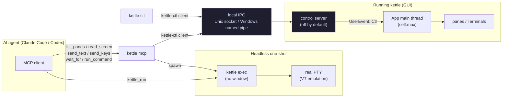

# Agent-first kettle

kettle is designed so AI agents (Claude Code, Codex, …) work great with it **both
ways**:

- **Interactively** — run the agent *inside* a kettle pane, like any terminal
  program. (Always worked; nothing to configure.)
- **Non-interactively / programmatically** — an agent *drives* kettle: run a
  command headlessly and read its output, or attach to a running kettle window
  to read the screen and type into panes.

This doc covers the programmatic surface: `kettle exec`, the control server +
`kettle ctl`, and the `kettle mcp` MCP server. It is OFF by default — the
control server only starts when you opt in.

## The three entry points

```
kettle exec  -- <argv…>     # headless one-shot: run a command, stream its output
kettle ctl   <method> …     # drive a RUNNING kettle (list panes, read, send, run)
kettle mcp                  # MCP server: expose all of the above as agent tools
```

## Control plane



The protocol, transport, discovery, and client live in the **`kettle-ctl`** crate
(UI-free). The GUI hosts the server side; `kettle ctl` and `kettle mcp` host the
client side. This split is deliberate: when the optional `kettle-muxd` session
daemon (see [MUX-SERVER-DESIGN.md](MUX-SERVER-DESIGN.md)) lands, it can re-host
the same server side without breaking any client — the discovery registry
already reserves a `kind` field (`"gui"` today, `"muxd"` later).

## `kettle exec` — headless one-shot

Run a command under a real PTY (full VT emulation) with no GPU and no window,
and stream its output to real stdout. Propagates the child's exit code (124 on
`--timeout`, 125 on an internal error).

```sh
kettle exec -- python -c "print(2+2)"           # → 4
kettle exec --strip-ansi -- ls --color=always   # plain text, escapes stripped
kettle exec --json -- some-tui                   # NDJSON: start/output/title/exit
kettle exec --timeout 5 -- slow-thing            # kill + exit 124 after 5s
kettle exec --record run.cast -- make            # also save an asciicast trace
```

Output modes: raw (default, verbatim PTY bytes — includes a terminal's normal
control sequences), `--strip-ansi` (plain text, good for assertions), `--json`
(one JSON object per line).

### ConPTY caveats (Windows)

On Windows the child runs under a ConPTY (pseudoconsole). Two consequences:

- **Raw mode includes ConPTY's startup handshake** (`ESC[6n`, mode-set
  sequences) and is a *re-rendered* screen, not byte-verbatim. For assertions
  use `--strip-ansi` (or the MCP `kettle_run` tool, which strips by default).
- **A command that exits in well under ~50 ms** can have its output collapsed by
  ConPTY's screen-differ before kettle ever sees it. `kettle exec` adds a short
  settle-drain to mitigate this, but a near-instant command may still under-emit.

### Limitations

- **stdin forwarding is not yet implemented.** `echo y | kettle exec -- prog`
  does not pipe stdin to the child today (the agent-critical paths — run a
  command, capture output, propagate the exit code — need no stdin). Tracked as
  a follow-up: the pump works on Unix PTYs but Windows `std::io::Stdin` console
  translation over a pipe handle drops bytes, and ConPTY does not turn a
  conin-pipe-close into EOF for `ReadConsole`-based readers (`sort`, `more`).

## Control server + `kettle ctl`

The control server lets another process inspect and drive a *running* kettle
window. It is **off by default**; enable it per launch or in config:

```sh
kettle --agent-server full        # this launch only
# or in ~/.config/kettle/config (or %APPDATA%\kettle\config on Windows):
#   agent-server = full
```

Modes: `off` (no server), `read-only` (read the screen / list panes / subscribe),
`full` (also send text + run commands).

Then drive it with `kettle ctl`:

```sh
kettle ctl get_state                                   # version, theme, pid, mode
kettle ctl list_panes                                  # id / tab / cwd / size / focus
kettle ctl read_screen                                 # focused pane's visible text
kettle ctl read_screen --pane 3 --json '{"scrollback_lines":200}'
kettle ctl send_text --text "ls -la"                   # type into the focused pane
kettle ctl send_keys --keys "enter"                    # …then press Enter
kettle ctl send_keys --keys "escape,:,w,q,enter"       # press keys/chords (v2.20)
kettle ctl wait_for --text "INSERT" --json '{"timeout_ms":5000}'   # block until on screen
kettle ctl run_command --text "cargo build"            # run + wait for the result
kettle ctl events                                       # stream the event feed (NDJSON)
kettle ctl get_state --pid 12345                        # target a specific kettle
```

Note: `--text` is literal — backslash escapes like `\n` are **not** decoded —
so press Enter with `send_keys`, not a trailing `\n`.

### Methods (protocol v1)

| Method | Mode | Result |
|---|---|---|
| `get_state` | read-only | version, pid, mode, theme, focused pane, `windows` (count), `focused_window` (seq) |
| `list_tabs` | read-only | every window's tabs: `window` (seq), index, title, active, pane ids |
| `list_panes` | read-only | every window's panes: id, `window` (seq), tab, title, cwd, cols/rows, focused, argv, child_pid, agent_attached, read_only |
| `read_screen` | read-only | text + cursor + `cursor_visible` (DEC ?25) + history (params: `pane`, `scrollback_lines`) |
| `subscribe` | read-only | switches the connection to the event stream |
| `wait_for` | read-only | v2.20: block until the screen matches (`text` substring / `regex` / `quiet_ms` settle — AND when combined; `timeout_ms` default 30 000). Returns `{matched, elapsed_ms, polls}`; a timeout is `matched: false`, not an error. Runs on the connection thread, polling ≥50 ms — the UI is never blocked. The screen-text regex runs against per-line right-trimmed, newline-joined text — use `(?m)` end-of-line anchors rather than end-of-string |
| `send_text` | full | type text into a pane (`pane`, `text`) |
| `send_keys` | full | v2.20: press named keys / chords (`pane`, `keys: ["escape","ctrl+c","down","G",…]`). Tokens: key names (`escape`, `enter`, `tab`, `backspace`, `delete`, `insert`, `space`, arrows, `home`/`end`, `pageup`/`pagedown`, `f1`–`f12`), chords with `ctrl`/`alt`/`shift`/`super` (+ aliases), or single characters (case preserved). Encoded through the same path as GUI keystrokes against the pane's live modes (DECCKM-aware); all tokens parse before any byte is sent |
| `run_command` | full | run `command` in a pane, reply with `{exit_code, duration_ms, output}` |

**Multi-window (v2.18)**: a kettle process can host several OS windows.
`list_tabs` / `list_panes` enumerate them all, ordered by window seq;
`index`, `tab`, `active`, and `focused` are *within-window* values — the
`window` field disambiguates. Pane ids are process-global and stable across
tab moves/tear-offs, and an explicit `pane` param targets a pane in **any**
window (without one, the focused window's focused pane is used).

`run_command` correlates the shell's OSC 133 command-end marker to learn the
exit code. **Without shell integration** there is no marker, so the call returns
`{timed_out: true, …}` after `timeout_s` (default 15) with a hint to run
`kettle --shell-integration <shell>`. Output is still captured either way.

A pane the user has toggled **Read only** (right-click menu /
`toggle_read_only`) rejects `send_text`, `send_keys` and `run_command` with
the `read_only` error code — the agent is input like any other, and the
user's lock wins.

### Driving an interactive app (v2.20)

`send_keys` + `wait_for` together make interactive TUIs scriptable without
sleep-and-pray. Editing a file in vim from an agent:

```sh
kettle ctl send_text  --text "vim notes.txt"
kettle ctl send_keys  --keys "enter"
kettle ctl wait_for   --json '{"quiet_ms":300,"timeout_ms":10000}'   # vim painted
kettle ctl send_keys  --keys "i"                                     # insert mode
kettle ctl wait_for   --text "-- INSERT --"
kettle ctl send_text  --text "hello from an agent"
kettle ctl send_keys  --keys "escape,:,w,q,enter"                    # save + quit
kettle ctl wait_for   --json '{"regex":"(?m)\\$$","quiet_ms":200,"timeout_ms":5000}'   # prompt is back
```

The same flow over MCP uses `kettle_send_keys` / `kettle_wait_for`. Read the
screen between steps with `read_screen` — its `cursor` + `cursor_visible`
(DEC ?25) tell you where input would land and whether the app is showing a
cursor at all (vim's command line, fzf and less hide it).

Events (after `subscribe`): `command_finished`, `pane_focus`, `title`,
`agent_attached`, `tab_moved` (`{from_window, to_window, tab}` — a tab was
torn off / moved to another window), and `lag` (when a slow subscriber's
queue overflowed).

### When an agent attaches a pane

A pane targeted by a control connection shows the `agent-badge` prefix (default
`"[agent] "`) in its per-pane titlebar, and an `agent_attached` event fires. Set
`agent-badge = ` (empty) to disable, or to any glyph you like (`agent-badge = 🤖 `).

## `kettle mcp` — MCP server

Expose all of the above as Model Context Protocol tools, so Claude Code/Codex get
kettle as native tools.

```sh
claude mcp add kettle -- kettle mcp
```

Or a project-scoped `.mcp.json`:

```json
{ "mcpServers": { "kettle": { "command": "kettle", "args": ["mcp"] } } }
```

Tools: `kettle_run` (headless one-shot — needs no running kettle),
`kettle_list_panes`, `kettle_read_screen`, `kettle_send_text`,
`kettle_send_keys`, `kettle_wait_for`, `kettle_run_command` (these drive a
running kettle, so start it with `kettle --agent-server full`). When no
server is found, the control-backed tools return an actionable error pointing
at `--agent-server`.

`kettle mcp --self-test` runs an in-process handshake + `tools/list` + one
`kettle_run`, for CI.

## Security & threat model

- **Off by default.** No server, no socket, no registry entry unless you opt in.
- **Local only.** The transport is a Unix domain socket (mode `0600`) or a
  Windows named pipe with the default DACL (creator/owner + admins). There is
  **no TCP** at this layer. The protection boundary is "the same local user (and
  elevated admins)" — identical to the kettle process itself.
- **Capability split.** `read-only` cannot send keystrokes or run commands; only
  `full` can. A single `require_full` gate guards every mutating method (a
  drift-guard test pins this).
- **Auditable.** Every connection and every mutating method is logged. When the
  dev-record recorder is active, each agent action is annotated in the `.cast`
  trace as an `m` marker (`kettle:agent <method> conn=N`).

If you don't want any of this, do nothing — it stays off.

## Future work

- stdin forwarding for `kettle exec` (see Limitations).
- A live-grid `screenshot` method (`send_keys` shipped in v2.20).
- Re-hosting the server on the `kettle-muxd` session daemon
  ([MUX-SERVER-DESIGN.md](MUX-SERVER-DESIGN.md)) — clients are unaffected.
- An "agent waiting for input" surfacing (the command-notify plumbing already
  exists).
