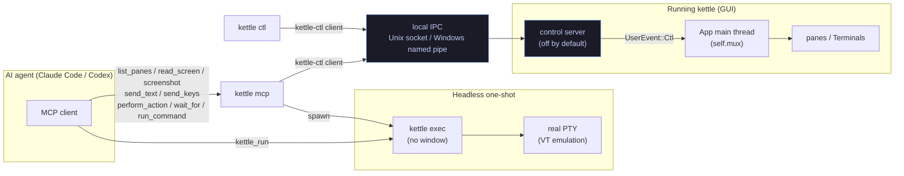

# Agent-first kettle

kettle is designed so AI agents (Claude Code, Codex, …) work great with it **both
ways**:

- **Interactively** — run the agent *inside* a kettle pane, like any terminal
  program. (Always worked; nothing to configure.)
- **Non-interactively / programmatically** — an agent *drives* kettle: run a
  command headlessly and read its output, or attach to a running kettle window
  to read the screen and type into panes.

This doc covers the programmatic surface: `kettle exec`, the control server +
`kettle ctl`, and the `kettle mcp` MCP server. It is OFF by default — the
control server only starts when you opt in.

Kettle 4.0 supports Linux and macOS. Windows and WSL details below describe the
final Windows-supported 3.3.0 line and retained conditional code; they are not a
current package or support commitment.

## The three entry points

```
kettle exec  -- <argv…>     # headless one-shot: run a command, stream its output
kettle ctl   <method> …     # drive a RUNNING kettle (list panes, read, send, run)
kettle mcp                  # MCP server: expose all of the above as agent tools
```

## Control plane


```mermaid
flowchart LR
    subgraph agent["AI agent (Claude Code / Codex)"]
        cc["MCP client"]
    end
    subgraph oneshot["Headless one-shot"]
        exec["kettle exec<br/>(no window)"]
        pty1["real PTY<br/>(VT emulation)"]
        exec --> pty1
    end
    subgraph gui["Running kettle (GUI)"]
        srv["control server<br/>(off by default)"]
        app["App main thread<br/>(self.mux)"]
        panes["panes / Terminals"]
        srv -->|UserEvent::Ctl| app
        app --> panes
    end
    cc -->|kettle_run| exec
    cc -->|"list_panes / read_screen / screenshot<br/>send_text / send_keys<br/>perform_action / wait_for / run_command"| mcp["kettle mcp"]
    mcp -->|spawn| exec
    mcp -->|"kettle-ctl client"| ipc["local IPC<br/>Unix socket / Windows named pipe"]
    ctl["kettle ctl"] -->|kettle-ctl client| ipc
    ipc --> srv
    classDef off fill:#1a1b26,stroke:#7aa2f7,color:#c0caf5;
    class srv,ipc off;
```

The protocol, transport, discovery, and client live in the **`kettle-ctl`** crate
(UI-free). The GUI hosts the server side; `kettle ctl` and `kettle mcp` host the
client side. This split is deliberate: when the optional `kettle-muxd` session
daemon (see [MUX-SERVER-DESIGN.md](MUX-SERVER-DESIGN.md)) lands, it can re-host
the same server side without breaking any client — the discovery registry
already reserves a `kind` field (`"gui"` today, `"muxd"` later).

## `kettle exec` — headless one-shot

Run a command under a real PTY (full VT emulation) with no GPU and no window,
and stream its output to real stdout. Propagates the child's exit code (124 when
the complete `--timeout` deadline expires and teardown of the owned process
scope is verified, 74 when stdout delivery fails, 125 on an internal error or
unverified teardown).

On Unix a child killed by a signal reports the shell's `128 + signal`, so
`143` is SIGTERM, `137` is SIGKILL and `130` is SIGINT. Automation can therefore
tell a terminated command from one that ran `exit 1`.

```sh
kettle exec -- python -c "print(2+2)"           # → 4
kettle exec --strip-ansi -- ls --color=always   # plain text, escapes stripped
kettle exec --json -- some-tui                   # NDJSON: start/output/title/exit
kettle exec --timeout 5 -- slow-thing            # bounded teardown + exit 124
kettle exec --record run.cast -- make            # also save an asciicast trace
```

Output modes: raw (default, verbatim PTY bytes — includes a terminal's normal
control sequences), `--strip-ansi` (plain text, good for assertions), `--json`
(one JSON object per line).

The timeout also bounds trailing output after the child exits. If stdout is
still stalled at the deadline, Kettle abandons output the downstream consumer
cannot accept and returns 124 once owned-process teardown is verified. It then
warns on stderr that stdout was not fully delivered. When the consumer is still
reading, Kettle waits up to 250 ms for its last write, so `--json` output ends
with the exit event and no warning. A collected child status cannot turn
incomplete lossless PTY delivery into success. MCP cancellation takes precedence at every lifecycle stage and returns
130 when teardown is verified; either path returns 125 when it is not.

Kettle owns the PTY-created process group on macOS and the PTY-created session
on Linux. A Unix descendant that deliberately calls `setsid()` leaves that
boundary; Kettle will not infer ownership from ancestry or an open PTY
descriptor and risk killing an unrelated same-user process. Fully containing
that case requires an OS-owned supervisor/cgroup. When Kettle cannot verify the
scope it did own was terminated, timeout/cancellation reports 125 rather than a
misleading 124/130.

A real stdout write or flush failure is different from deadline abandonment.
Kettle reports it on stderr, stops and reaps the owned process scope, and
returns 74 when that teardown is verified (125 otherwise); JSON mode cannot
promise a final exit event after its output sink has failed.
`--cwd DIR` validates an explicit directory before PTY creation and never falls
back to HOME: a missing path or regular file returns 125 without spawning the
command. Omitting `--cwd` runs the command in Kettle's current directory, and
MCP `kettle_run` without a `cwd` runs it in the MCP server's. If that directory
no longer exists, the run returns 125 without spawning the command rather than
falling back to HOME.

On Windows, if a verified managed update is already staged but another Kettle
window still holds the installed image, every argument-bearing invocation exits
75 after stating that no requested work ran. Retry it after the windows close.
A bare GUI launch may exit zero after handing the update to the helper.

`--record PATH` is output-only and uses the same private asciicast writer as
the developer GUI recorder. Kettle acquires the file's exclusive lock and
rejects links/non-regular targets before it creates the PTY; failure exits 125
without running the command. Capture stops at a complete event boundary before
512 MiB. Events cross a bounded persistence queue; overload or a later
write/flush failure stops capture, reports the incomplete trace on stderr, and
does not kill a child that is already running. Normal completion flushes and
joins the worker within a fixed bound. Timeout and cancellation retain their
own deadline and never wait in a blocking writer join.

### ConPTY caveats (Windows)

On Windows the child runs under a ConPTY (pseudoconsole). Four consequences:

- **Raw mode includes ConPTY's startup handshake** (`ESC[6n`, mode-set
  sequences) and is a *re-rendered* screen, not byte-verbatim. For assertions
  use `--strip-ansi` (or the MCP `kettle_run` tool, which strips by default).
- **A command that exits in well under ~50 ms** can have its output collapsed by
  ConPTY's screen-differ before kettle ever sees it. `kettle exec` adds a short
  settle-drain to mitigate this, but a near-instant command may still under-emit.
- **ConPTY can keep its output handle open after the child and final repaint are
  gone.** A bounded quiet window therefore starts an asynchronous pseudoconsole
  close while the reader remains live, but only after the command's Job Object
  has no live descendant. A same-console descendant may still emit after its
  direct parent exits, and closing ConPTY first would terminate it and truncate
  that tail. Quiet does not complete the command.
  Completion waits for the resulting real EOF and reader-channel disconnect.
  Source status, generation, and pending work are one atomic snapshot, so a
  read racing the quiet check either postpones the close or is drained before
  the disconnect. A stuck close fails explicitly after five seconds.
- **Timeout containment is established before user code runs.** The ConPTY
  backend creates the process suspended, assigns it to a kill-on-close Job
  Object, and only then resumes its primary thread. Immediate descendants
  therefore inherit the job instead of racing a later attachment. Process-handle
  signalling, not the ambiguous `STILL_ACTIVE` number, determines liveness, so
  exit code 259 propagates normally.

### Stdin forwarding

On Unix and WSL, when `kettle exec` is launched with piped or redirected stdin,
it forwards that input to the child PTY:

```sh
printf 'hello\n' | kettle exec --strip-ansi -- sh -c 'read x; echo "got:$x"'
```

Interactive terminal stdin is not stolen from the user, and `/dev/null` stays
closed rather than being treated as useful input. On pipe EOF, Kettle reads the
child PTY's live Unix `termios` state. In canonical mode it sends that PTY's
configured VEOF character once for empty or line-terminated input, or twice
when the forwarded stream ends with an unterminated record (the first completes
that record; the second returns zero from the next read), while retaining the
bidirectional master used for DA, DSR, Kitty, and other terminal replies.
Each VEOF byte is a separate nonblocking, lowest-priority writer step, so a
full canonical buffer cannot trap the arbiter ahead of a later terminal reply.
Boundary detection applies the live `IGNCR`, `ICRNL`, and `INLCR` mappings and
the enabled VEOL/VEOL2 characters rather than assuming default CR/LF settings.
It also models the host line discipline's VWERASE behavior: Linux N_TTY word
classes differ from BSD simple and `ALTWERASE` modes. `EXTPROC` bypasses normal
canonical editing, so Kettle never injects VEOF while it is active and treats
pending input across an `EXTPROC` transition as ambiguous.
The incremental canonical-record tracker retains at most 64 KiB. An oversized
unterminated record is conservatively treated as nonempty (two VEOF
characters), while an ambiguous live `termios` transition or trailing VLNEXT
fails explicitly instead of guessing.

A Unix PTY has no independently closable input half. If the child has selected
noncanonical/raw or `EXTPROC` input, or its VEOF is disabled or cannot be
inspected, Kettle
therefore keeps the PTY open and prints an explicit diagnostic instead of
closing the shared master or guessing an input byte. Raw-mode applications
must use their own protocol delimiter or `--timeout`.

Headless `kettle exec` has no clipboard sink, so its DA1 reply omits extension
`52` and OSC 52 writes are not advertised. OSC 52 reads receive an empty reply
rather than exposing the host clipboard. All protocol replies use a dedicated
writer arbiter with a bounded 64-message priority queue, even when stdin is not
forwarded. A child that floods queries without reading replies therefore fails
closed with exit 125 instead of blocking timeout or cancellation. The semantic
VT-event queue is independently bounded at 1024 events; overflow also fails the
command explicitly instead of dropping reply-bearing events. Reply admission
and each incremental Unix VEOF attempt are ordered by a short nonblocking gate,
so an admitted terminal reply cannot be overtaken by a stale EOF decision. A
query generated only after the kernel accepted a VEOF cannot retroactively
overtake that byte.

Native Windows ConPTY forwards piped bytes too, so delimiter-driven commands
(`read`, a line-oriented parser, a known byte count) work normally. ConPTY has
no safe portable input half-close, however: when the parent pipe reaches EOF,
Kettle keeps conin alive to preserve the child and terminal-reply channel
instead of forcing `STATUS_CONTROL_C_EXIT`. A Windows child that waits for EOF
must use its own delimiter or `--timeout`. WSL uses the Unix canonical-EOF path
above. The MCP `kettle_run` tool still gives the child no stdin by design; use
`kettle exec` directly for stdin-driven one-shot commands.

Kettle configures only its own ConPTY input-pipe writer for `PIPE_NOWAIT` and
advances it in at most 1 KiB steps. The separate synchronous handle passed to
`CreatePseudoConsole` remains unchanged. A child that stops reading input can
therefore return zero progress to the bounded priority writer instead of
parking it inside a kernel write; protocol replies, timeout, cancellation, and
pane shutdown remain observable under backpressure.

## Control server + `kettle ctl`

The read-only `ui_geometry` diagnostic includes `desktop.client_origin` and
`desktop.frame_origin` as `{x, y}` positions in winit's physical desktop pixels.
Each is `null` if the platform cannot report it (including compositor-owned
positioning). Client origin excludes native window decorations; frame origin
includes them. Negative coordinates are valid on monitors left of or above
the primary display. Use the reported scale factor when converting screenshot
or logical coordinates, and sample each target window independently.

The control server lets another process inspect and drive a *running* kettle
window. It is **off by default**; enable it per launch or in config:

```sh
kettle --agent-server full        # this launch only
# or in ~/.config/kettle/config (or %APPDATA%\kettle\config on Windows):
#   agent-server = full
```

Modes: `off` (no server), `read-only` (read the screen / list panes / subscribe),
`full` (also send text + run commands).

### Control and display policy

Two settings decide what a client may do. `agent-server` grants control;
`agent-display` (Settings → Agents → Agent previews) lets agents show media
without granting control. Every method declares one capability:

| Capability | Allowed when | Methods today |
|---|---|---|
| Read | `agent-server` is `read-only` or `full` | `get_state`, `list_tabs`, `list_panes`, `read_screen`, `read_cells`, `ui_geometry`, `subscribe`, `wait_for` |
| Mutate | `agent-server = full` | `screenshot`, `send_text`, `send_keys`, `dispatch_ui_key`, `dispatch_keybind`, `send_mouse`, `resize_window`, `perform_action`, `run_command` |
| Display | `agent-server = full`, or `agent-display` on | `show` |

The server runs when either setting allows something, so the six
combinations behave like this:

| `agent-server` | `agent-display` | Read | Mutate | Display | Server |
|---|---|---|---|---|---|
| `off` | off | no | no | no | none: no socket, no registry entry |
| `off` | on | no | no | yes | display only |
| `read-only` | off | yes | no | no | yes |
| `read-only` | on | yes | no | yes | yes |
| `full` | off | yes | yes | yes | yes |
| `full` | on | yes | yes | yes | yes |

Each connection thread admits a request before anything else happens for it:
it checks the method's capability first, then the parameter shape every method
shares, and only then routes the request to the App or to `wait_for`. A refused
request does no work, so a display-only client learns nothing from parameter
errors and cannot start a wait. `wait_for`'s screen probes carry only the wait's
own Read permission. A refused `subscribe` leaves the connection answering
requests. The refusals are fixed texts:

| Code | Message |
|---|---|
| `display_only` | This display-only connection cannot read terminal contents or geometry. |
| `read_only` | This connection cannot perform control mutations. |
| `display_disabled` | Kettle previews are off or Kettle is not running. The user can turn on Agent previews in Kettle Settings; display enables immediately. Claude integration needs a new pane/session. Do not change configuration or retry. |

`--agent-server MODE` and `--agent-display on|off` override the config for one
launch, in either order. `--agent-server off` alone also turns display off;
pair it with `--agent-display on` for a display-only launch. `agent-server`
applies at launch only. Turning display on, in Settings or the config file,
applies at once, including for connections already open, and starts the server
if none runs; a launch flag keeps its precedence over a reload. Turning display
off applies at the next launch. `get_state` reports the policy in force as
`policy: {server, display}`, beside the original `mode` field.

### Showing media

`show` sends an image, SVG, Mermaid diagram or Markdown diagram gallery (a
Markdown file's Mermaid diagrams, paged in the lane) to the media shelf of the
pane its caller runs in. It needs only Display, so `agent-display` is enough; it grants no reads
or mutations, and a display-only client learns nothing about the screen from
it. `kettle show PATH` and `kettle show` (or `kettle show -`, bytes on
stdin) send it from a shell; `--mermaid` renders either as a Mermaid diagram.
Stdin is refused, never cut short, past what one request carries once
encoded (about 768 KiB), or past 64 KiB of UTF-8 text with `--mermaid`; a
path longer than 4 KiB is refused before anything looks for it, and the
whole request, escapes and base64 included, is measured as a client frames
it before it is sent. It attests a file by opening it as the media worker
will (read-only, without waiting on a named pipe, never as a controlling
terminal) and sends the device and inode of what it opened, so Kettle shows
nothing the command could not read itself: a file it may look up but not
read is refused with `permission`.

Params take exactly one source, plus optional `title` (at most 4 KiB) and
`key` (1 to 256 bytes):

| Source | Rendered as |
|---|---|
| `svg`: SVG text, at most 2 MiB | SVG |
| `image_b64`: standard base64 bytes, at most 32 MiB decoded | whatever the media worker finds the bytes to be: raster, SVG, a Markdown gallery, or text that parses as a Mermaid diagram |
| `mermaid`: Mermaid text, at most 64 KiB | Mermaid |
| `path` + `dev` + `ino`: an absolute path (at most 4 KiB) and the device and inode the caller saw | whatever the worker finds in the file it opens, Mermaid with `kind: "mermaid"`, or with `markdown_index` that page of its Markdown gallery; another file at that path is refused |

The whole request still fits the 1 MiB request line, so larger media goes by
path. The file's name decides nothing; only the `mermaid` source, or
`kind: "mermaid"` on a path, has the media rendered as Mermaid rather than
as what its bytes turn out to be. `markdown_index`, from 0 to 31, opens a
file's Markdown gallery at that page rather than its first; a number past 31
is `index_out_of_range`, as is one past the file's last page, and only a
path, never one said to be Mermaid, takes it.
A `pane` param is honored only for full control, for a caller Kettle cannot
place. A malformed `show` is answered on its connection thread and never
reaches the App.

**Where it goes.** The pane whose own child process is the caller's nearest
ancestor, in any window: that item is verified. Otherwise full control's
`pane`, or the pane the caller's environment names when `KETTLE_PID` names
this Kettle; those items are unverified, and the shelf names their sender by
the executable and pid the kernel reports for it, never by anything the
sender says. For `kettle show` and `kettle mcp`, which only carry another
program's request, the sender named is the program that ran them. On macOS
the shelf also names who signed that program's code, once macOS validates
the running code as signed with a certificate Apple issued (`signed by
Anthropic PBC (Q6L2SF6YDW)`, or `Apple` for its own); otherwise it says the
signing identity is unavailable. Nothing else routes: not the focused pane, and never another
Kettle. `kettle show` finds its Kettle the same strict way: the one it runs
inside, else the one `KETTLE_PID` names (when that entry records its start
time), and never the newest running one.

**When it is answered.** After the item is on the shelf, never on
admission. One render runs at a time; up to three pushes wait behind it,
each sender (a verified pane, or else the sending process) with at most one:
a newer push takes the place of its sender's waiting one. What the user
asks to preview waits apart from them and goes first. A push has 15
seconds from admission, queueing included; `kettle show` waits 20. A push
that never started is `busy`; one that ran out of time is
`render_failed` / `timeout`. A client that disconnects cancels its pushes, and
so does closing their pane. A file's key defaults to its path, so showing a
file again replaces its item in place, keeping the item id.

The result is `{pane, verified, window, item, kind, width, height, warnings}`,
`kind` being what the media turned out to be. Failures carry the fixed code,
an optional fixed `reason` and wording that names no path, source or
identifier: `not_in_kettle_pane`, `busy`, `bad_params`, `too_large`,
`file_refused` (`not_found`, `permission`, `not_regular`, `too_large`),
`changed`, `unsupported_media`, `unsupported_platform`, `render_failed`
(`timeout`, `resource`, `parse`), `over_budget`, `restart_required` and
`worker_unavailable`. `kettle show` prints the same wording, by the code and
reason alone: it never repeats the words a reply carries, and says so in
its own words when a code or reason is one it does not know. It adds
`not_in_kettle` when no Kettle it runs in has agent previews on.

**The shelf.** Each pane keeps its last eight items, newest first; a full
shelf drops the item least recently viewed, never the one on screen. Pixels
are charged to one process-wide preview account (128 MiB), apart from
terminal images; when a new item does not fit, the pixels of the least
recently viewed item not on screen go, and its details stay. A push never
opens anything on screen: a pane titlebar marks unopened items as `▣N`, and
the window title starts with `[new media: N]` while the focused pane has
some. The user opens them with `open_media_shelf` (the palette's "Open media
shelf"): the pane's preview lane opens along its bottom, about 40% of the
pane, and the terminal shrinks to make room, so the program in it sees a
smaller window and nothing of its screen is covered; keys still go to it.
The lane shows one item fitted, never enlarged past its pixels, on white for
SVG and a checkerboard for raster, with its title, kind, size and sender,
and `‹ ›` to browse, `▾` to collapse the lane to a one-row strip and `×` to
close it. Where this platform permits an image viewer and the item still
holds its pixels, the header also has `↗`, which opens it there (Preview on
macOS, Eye of GNOME on Linux), the same hand-off as a card menu's row. The
terminal keeps at least 20 columns and 5 rows: with less room the lane is
the strip, along the pane's bottom whichever side it opened on; opening one
in a pane too small even for that shows a notice and leaves the item unseen,
and a lane that loses its room later waits as the titlebar's shelf badge. Each pane
has its own lane; `ui_geometry` reports them as `preview_lanes` (pane,
rectangle and `expanded`, `strip` or `badge`, and for a lane with an item
its `mode` (`rendered` or `source`), `canvas` (`theme`, `white` or
`checker`), `zoom` (relative to the item's fit), `content` and `image` (the
content area's rectangle and where the item is drawn in it, past it when
zoomed in), `sharp` (where sharper pixels for the part in view are drawn,
or null), `edge` (the strip a drag resizes an expanded lane by, or null),
`keyboard` (`preview` while the lane holds the keyboard, else `terminal`)
and `controls`, each shown control's rectangle by name; never a
title, source, path or pixel). An SVG's or a diagram's lane can show the
source it was rendered from (`≡`), put the picture on another background
(`◐`; a diagram is rendered again for it, from the same source), copy the
picture or the source (`⧉`), and read an item's file again (`↻`), which
replaces the item in place, keeping its key and title, as one the user
opened. A rendered item zooms (`−`, `+`, back to its fit with `⤢`, or a
pinch or Cmd/Ctrl+wheel at the pointer) and pans (the wheel or a drag);
`perform_action` takes `preview_zoom_in`, `preview_zoom_out` and
`preview_fit` for the focused pane's lane. While the user has given a lane
the keyboard (`focus_preview`; `preview_lanes` reports `keyboard` as
`preview`), `send_keys` and `send_text` to any pane in that window answer
`busy` and write nothing, and `dispatch_ui_key` drives the lane's keys
(modal `preview`). A zoomed item sharpens once its
view settles, but a view a control client changed last reads no file for
it. A control client may press these like any control, but no file is
read again while Kettle handles a control request.
The user can also preview a Mermaid diagram an agent printed:
`render_clipboard_as_diagram` after `/copy`, or `render_selection_as_diagram`
on the selected reply, with what the agent's UI added and wrapped taken back
off. A control client cannot trigger either: they read the clipboard or a
selection only on the user's own key press or click, and a menu a control
client opens does not look at them to offer its rows.
The user can also preview an image, SVG, Mermaid or Markdown file a pane
names without any agent (a Markdown file's Mermaid diagrams are a gallery,
paged in the lane with `‹` and `›`): `preview_link` (the palette's "Preview
a file in Kettle") labels such files in the focused pane as quick select does, and the
right-click menu offers "Preview in Kettle" on a link to one. The file
opens in that pane's lane once it renders, its sender reading "You opened
this from the pane", and the shelf report marks it `from_user`. A link from
a remote pane is refused and one from behind tmux or screen is asked about
first, as opening it would be; when a preview cannot be had, a notification
says why. Only the user's own key press or click starts such a read: a
control client may run `preview_link` or drive the menus, but a pick, a
menu row or a confirmation it sends previews nothing.
A Mermaid diagram an agent shows gets a card like an image, with its
rendered poster, whether it came as source or as a file; when the lane
draws it again on another background, the card shows that too.
Clicking an inline card opens its pane's lane on that card's item. A card
takes a primary press, and its release, before anything else in the window
except open dialogs and the lanes, so the program behind it sees neither.
The release opens the item when it lands on the same card and no dialog has
opened over it since the press; otherwise it goes nowhere. A Shift-click selects text
and the wheel scrolls or reaches the program, as they would without the
card. A press on a card that has been on screen where it is for less than
half a second is ordinary input, so one that scrolls under the pointer
cannot take a click meant for text. The pointer turns into a hand over a
card a click would open and the card is outlined in the accent, so it is
clear which press the card will take; a still pointer gets them as the card
settles. The first card a user ever sees with its image shown says "Click
to open" on a strip along its foot for ten seconds, or until a card is
opened; `ui-tips.json` beside the config file records that it showed, so it
never shows again, and of two Kettles running at once only one shows it. It
waits for a card whose image is on screen with no dialog or menu over it.
A right-press on a settled card opens the card's menu instead of the
terminal's: Open, as a click does, and, where this platform permits one
viewer, Open in Preview (macOS) or Open in Image Viewer (Linux, Eye of
GNOME at `/usr/bin/eog`). That row hands the viewer a fresh PNG of the pixels
Kettle shows, from a private store that keeps the newest 32 copies and
128 MiB and is deleted on exit; a row acts only while the card still shows
the item, at the generation, the menu named. Nothing a program prints opens
another app.
`kettle ctl send_mouse` clicks a card the same way. Quick select (`hint_mode`) labels each card on screen in the
focused pane, and picking its label opens it; text in a card's rows is its
marks, so it gets no label of its own. Screen readers see each card as a
button named for its item's title, kind, size and sender, as the lane
names it (never by its card id), and pressing it opens the lane. Neither
opens anything while a dialog or a menu is up. Only the user, or full control, opens
it, and `kettle ctl send_keys` still writes to the pane's terminal beneath. `list_panes` reports each pane's shelf as
`media_shelf`: item, generation, title, kind, size, warnings, `verified`,
`from_user` (the user previewed it from the pane), the
`sender` of an unverified item (`executable`, `pid` and `signer`, null when
unknown) and whether its pixels are `held` or
`released`.

### Which pane is calling

Every pane starts with `KETTLE_PANE_ID` (its pane id) and `KETTLE_PID` (the
Kettle process) in its environment, set after your `env` entries so config
cannot change them. They are hints: a program in the pane can still change
them.

What Kettle believes instead is the process tree. A client's first request
carries a claim about itself, `caller: {pid, start_token, pane_hint, pid_hint}`.
`start_token` is a decimal string: the platform's process start instant (clock
ticks since boot on Linux, microseconds since the epoch on macOS, a creation
`FILETIME` on Windows). Kettle reads the connecting process from the kernel the
moment it accepts the connection, and believes the claim only if its pid and
start match. It then walks the caller's parents, at most 64 links, on the
connection's own thread. Each parent must be alive, readable, and no younger
than its child, and the child must still name it after the parent is read. The
caller is *verified* in a pane when that pane's own child process, whose
identity Kettle read when it spawned it, is one of those ancestors. The nearest
such pane wins.

`get_state` reports the result:

```json
"caller": {
  "verified": true,
  "reason": null,
  "pane": 7,
  "window": 2,
  "peer": {"pid": 4201, "start_token": "1791486593096067"},
  "hint": {"pane": 7, "window": 2}
}
```

An unverified caller has `pane` and `window` null and one fixed `reason`:
`missing_claim` (no claim or no start token, as from older clients),
`invalid_claim` (the first frame was malformed), `claim_changed` (a later
request claimed another process), `peer_unavailable`, `claim_mismatch`,
`peer_exited`, `peer_started_after_accept`, `ancestor_unavailable`,
`parent_younger_than_child`, `chain_changed`, `cycle`, `depth_exceeded`,
`deadline_exceeded`, `no_pane` or `unsupported`. `hint` repeats the pane the
caller's environment names, only when it names this Kettle and one of its
panes; it never makes a caller verified.

The first nonblank frame fixes a connection's claim. A connection that starts
without one, or with a malformed one, stays unverified; a later request that
claims another process makes it unverified for good. `kettle ctl` and `kettle
mcp` send the claim automatically; a client inherited across `fork()` refuses
to speak. A parent the walk cannot read ends the chain, so a caller outside
Kettle reads `no_pane`, and a daemonized, reparented or `tmux`-hosted process,
whose chain no longer runs through a pane's child, is unverified. Verification
describes the process the kernel names when Kettle accepts the connection,
before reading any request, and the first request must claim that process.
Linux and Windows name the process that connected. macOS names the last process
to use the socket by then, so a descriptor handed on before Kettle accepts
binds to the process that received it; that process must then claim itself and
run in the pane, so an outside process reaches a pane only through the
cooperation of a process inside it. A descriptor handed on after acceptance
cannot match the claim, and no platform here names the writer of each later
frame. Only `get_state` checks its caller today, so other methods cost nothing
extra.

The endpoint is local-only and user-private. Unix uses a `0600` domain socket;
both accepted servers and connecting clients compare peer credentials with the
effective uid. Windows rejects remote named-pipe clients, gives every pipe an
exact token-user owner plus a protected owner/SYSTEM/Administrators DACL, and
then compares the connecting process or pipe owner with the exact current
token-user SID. A client authenticates that server identity before sending any
request bytes: the kernel must name the registry entry's pid at the other end,
and that process must still be the instance the entry recorded. A client picks
the server `--pid` names; else the Kettle it runs inside, by matching its own
ancestors' pids and start times against registry entries; else the one
`KETTLE_PID` names; else the newest. A server chosen by name or ancestry is
the only one tried, so a failure there never lands a request in another
Kettle. Because the registry directory comes from the environment, each
server also leaves a `<pid>.alias.json` pointer where the OS puts the registry
for this user (`/run/user/<uid>` or the account's home on Unix, the Local
AppData known folder on Windows), and clients read that location too, so one
started with a stripped environment still finds its Kettle. The pointer only
names the real entry, which is read and checked in its own registry. Discovery
ignores links, unsafe permissions, mismatched pids, and non-v1 records. A discovery reads at most 1,024 registry entries from a
walk of at most 8,192 directory entries, since each server's socket sits beside
its entry; presence walks inspect at most 1,024 entries. A server unlinks its
socket when it shuts down. Pruning a dead server's entry also removes that
server's socket, and a starting server removes `ctl-<pid>.sock` files left in
the registry directory. Those two removals happen only under the registry
lock, only when no entry names the socket's pid and that pid is not running,
and only after confirming the socket is still the file that was checked. Unix
cannot unlink by descriptor, so a socket replaced between that confirmation
and the unlink would still be removed. A starting
server holds the lock from before it binds until its entry is written; if it
cannot get the lock within 2 seconds it starts without sweeping. Sockets on
the long-path fallback endpoint are removed at shutdown or by pruning, but not
by the startup sweep.

This is intentionally a **same-OS-user trust boundary**, not per-client
authorization. Enabling `read-only` lets any process running as that user read
terminal contents, pane/process metadata, UI geometry, and subscribed events
across every window in the Kettle process. Enabling `full` additionally lets
any such process inject text, keys, and mouse input; invoke Kettle actions; run
commands; resize windows; and write screenshots. There is no per-client prompt,
pairing token, capability grant, or consent dialog after the server is enabled.
That is acceptable for the documented opt-in model because same-user processes
are trusted like the Kettle process itself. If that is too broad for a machine,
leave the server off, use `read-only`, or run untrusted programs under a
different OS account. A future threat model that distrusts same-user processes
would require per-client capabilities/consent rather than another pathname or
DACL check.

Then drive it with `kettle ctl`:

```sh
kettle ctl get_state                                   # version, theme, pid, mode
kettle ctl list_panes                                  # id / tab / cwd / size / focus
kettle ctl read_screen                                 # focused pane's visible text
kettle ctl read_screen --pane 3 --json '{"scrollback_lines":200}'
kettle ctl read_cells --raw                            # text cells + underline/strikeout attrs
kettle ctl ui_geometry --raw                           # window/tab geometry for UI diagnostics
kettle ctl send_text --text "ls -la"                   # type into the focused pane
kettle ctl send_keys --keys "enter"                    # …then press Enter
kettle ctl send_keys --keys "escape,:,w,q,enter"       # press keys/chords (v2.20)
kettle ctl send_mouse --json '{"event":"click","x":20,"y":10,"button":"left"}'
kettle ctl resize_window --json '{"width":900,"height":560}'
kettle ctl perform_action --text "start_search"        # dispatch app chrome actions
kettle ctl dispatch_ui_key --keys "n,e,e,d,l,e,enter"  # drive the open modal (Search here); never PTY input
kettle ctl wait_for --text "INSERT" --json '{"timeout_ms":5000}'   # block until on screen
kettle ctl run_command --text "cargo build"            # run + wait for the result
kettle ctl events                                       # stream the event feed (NDJSON)
kettle ctl get_state --pid 12345                        # target a specific kettle
```

Note: `--text` is literal — backslash escapes like `\n` are **not** decoded —
so press Enter with `send_keys`, not a trailing `\n`.

### Methods (protocol v1)

| Method | Mode | Result |
|---|---|---|
| `get_state` | read-only | version, pid, mode, `policy` (`{server: "off"\|"read-only"\|"full", display: bool}`, the policy in force), `caller` (whether the connecting process runs in one of this Kettle's panes; see [Which pane is calling](#which-pane-is-calling)), theme, focused pane, `windows` (count), `focused_window` (seq), `window_title`, `media` (`{availability: "checking"}` until the first check finishes, then `{availability: "available"}` or `{availability: "unavailable", reason}`; reasons: `worker_missing`, `unsafe_worker_file`, `unverified_worker`, `no_install_location`, `unsupported_platform`, `check_failed`, `not_configured`, `stuck_workers` (two killed workers would not exit; media is off until Kettle restarts)). Availability starts no worker; each render still requires the matching build handshake. Asking never waits on the check; each ask starts a fresh one in the background |
| `list_tabs` | read-only | every window's tabs: `window` (seq), index, title, active, pane ids |
| `list_panes` | read-only | every window's panes: id, `window` (seq), tab, title, cwd, cols/rows, focused, argv, child_pid, agent_attached, read_only, `media_shelf` (see [Showing media](#showing-media)) |
| `read_screen` | read-only | visible viewport text + cursor + `cursor_visible` (DEC ?25) + history metadata + selection presence/range; `include_selection: true` includes selected text only when its preflight is at most 128 KiB (otherwise it is omitted and `selection_truncated` is true); with `scrollback_lines`, returns requested history plus the active screen for command-output capture (params: `pane`, `scrollback_lines`, `include_selection`, and paging fields) |
| `read_cells` | read-only | visible cell grid plus selected attributes (`any_underline`, underline variants, strikeout, underline-color presence) for renderer diagnostics without OCR |
| `ui_geometry` | read-only | live window geometry and OS focus state: surface/content rects, renderer cell metrics, `text_presentation_face` (the monochrome face this system serves text-presentation codepoints from, or null when it has none and kettle leaves them on the platform cascade), resize-overlay grid, tab-bar segment/new-tab rects, tab segment `path`/`fitted_title` diagnostics, pane titlebar rect/title/path/`fitted_title` diagnostics, open context-menu rect/rows, cursor, tab drag armed/visible state, additive Search geometry/status/control metadata, the bounds/state of a visible pasted-media receipt, including whether its body is openable, the `inline_cards` on screen (`pane`, `instance`, `rect`, whether it has `settled` so a press is the card's, its shelf `item` and the `label` a screen reader hears; never a card id), `render_uploads` (the renderer's counts of frames presented, GPU buffer writes and bytes, texture writes, text prepares, main/menu prepares (`chrome_prepares`) and skipped writes, whether per-frame instances go through mapped buffers (`mapped_uploads`), and the mapped writes and bytes; a window that only blinks adds frames but no writes, and one printing on shared memory adds mapped writes but no buffer writes), and `cursor_blink` (who draws the blink, `gpu` or, on macOS, the window server's `layer`; the layer's device-pixel `layer_rect`; `phase_on` and `next_edge_ms` for the phase the screen shows; `handoffs`, `exits` (frames that ended a layer blink), `hides` (layer hidden without a frame on focus loss, occlusion, a size or scale change, or a renderer rebuild) and `exit_frame_us` (count, p50 and p95 of the last 64 exit frames, and the lifetime max; timing includes transaction begin, render, commit and flush); and `fallback`, why this window keeps the GPU blink, or null). Reading `ui_geometry` draws no frame, so it never ends a layer blink or forces a pending repaint. The resize performance probe must use its resize action to request the frame. Search omits its query and matched terminal text; receipts omit retained paths, extensions, and pixels; `render_uploads` and `cursor_blink` carry counts and geometry only |
| `screenshot` | full | save a live PNG (`pane`, `full_window`, `path`, or all four window-relative physical-pixel `crop_*` fields); filesystem writes are never allowed through read-only mode |
| `subscribe` | read-only | switches the connection to the event stream |
| `wait_for` | read-only | block until the screen matches (`text` substring / `regex` / `quiet_ms` settle — AND when combined; `timeout_ms` default 30 000; `poll_ms` default 100, clamped to 50–5000). Returns `{matched, elapsed_ms, polls}`; a timeout is `matched: false`, not an error. Runs on the connection thread — the UI is never blocked. The screen-text regex runs against per-line right-trimmed, newline-joined text — use `(?m)` end-of-line anchors rather than end-of-string |
| `send_text` | full | type text into a pane (`pane`, `text`) |
| `send_keys` | full | press 1–1,024 named keys / chords (`pane`, `keys: ["escape","ctrl+c","down","G",…]`), with 64-byte tokens and a 64 KiB encoded-byte budget. Tokens: key names (`escape`, `enter`, `tab`, `backspace`, `delete`, `insert`, `space`, arrows, `home`/`end`, `pageup`/`pagedown`, `f1`–`f12`), chords with `ctrl`/`alt`/`shift`/`super` (+ aliases), or single characters (case preserved). Encoded through the same path as GUI keystrokes against the pane's live modes (DECCKM- and negotiated Kitty CSI-u-aware); all tokens parse before any byte is sent |
| `dispatch_keybind` | full | diagnostic app-keybind dispatch (`logical`, `physical`, `mods`) using the same resolver as real window keyboard input. It does not write PTY bytes; it returns the candidate triggers, matched action, whether a modal blocked dispatch, and `terminal_fallthrough: true` when the real keyboard path would hand the chord to the program instead: a default `Alt+Arrow` focus chord you did not bind yourself with no visible pane in that direction (including every zoomed multi-pane tab), or, under `keybind-yield = auto`, a default chord the focused pane's program owns (see [Keys a program shares with Kettle](TERMINAL-CLIENT-COMPATIBILITY.md#keys-a-program-shares-with-kettle)) |
| `dispatch_ui_key` | full | press 1–64 pre-parsed key tokens (each at most 64 bytes) in the currently open supported Kettle modal — a confirmation, quick-select hint mode, the command palette, the theme picker, Settings and its path prompt, the layout picker, the SSH launcher, the title editors, or Search, resolved in that order. Each modal consumes them through its own real key handler. With Search open, a token the bar does not use runs the Kettle shortcut bound to it, as a key press would; shortcuts that type into the terminal do nothing. No token is ever encoded as terminal input or written to the PTY — but a modal's own Enter can dispatch its normal action, and some of those do reach a PTY or spawn a process (the palette runs the selected command, the SSH launcher opens a session, the layout picker spawns `kettle --layout`). Same privilege tier as `perform_action`, which is why both require full agent mode. The reply names the modal it typed into. All tokens validate before the first state change, the batch stops early if the modal closes mid-way, and no open modal is an error |
| `send_mouse` | full | deterministic mouse input for diagnostics (`event`: `move`/`press`/`release`/`click`/`wheel`, window-relative `x`/`y`, `button` (`left`, `middle`, `right`, `back` or `forward`; `back` and `forward` reach a mouse-tracking program as the physical buttons do, xterm buttons 8 and 9), `wheel_lines` **or** `wheel_delta`, optional event-local `mods`). Synthetic motion can expand a pasted-media receipt but does not retarget the OS cursor or unrelated tab hover. A wheel event takes exactly one of `wheel_lines` (signed whole scroll lines, entering downstream of quantization) or `wheel_delta` (signed raw wheel detents, fractions allowed — runs the real sub-detent accumulator, so it can emulate a precision touchpad) |
| `resize_window` | full | request a live window client-area resize (`window`, `width`, `height`) and let the normal renderer/PTY resize path process it |
| `perform_action` | full | dispatch a named Kettle app action (`action`, for example `start_search`, `command_palette`, `open_ssh`, `hint_mode`, `edit_tab_title`). The control-only `focus_window` action shows and focuses its target without toggling visibility. Use this for app chrome that is not pane input; `send_keys` intentionally writes terminal keystrokes to the focused pane |
| `run_command` | full | run `command` in a pane, reply with `{exit_code, duration_ms, output, output_truncated}`; capture is capped at the newest 10,000 retained lines and then 512 KiB, and `output_truncated` is true if either cap drops output |
| `show` | display | put an image, SVG, Mermaid diagram or Markdown diagram gallery on the shelf of the caller's pane, reply with `{pane, verified, window, item, kind, width, height, warnings}` once it is there (see [Showing media](#showing-media)) |

**Multi-window**: a kettle process can host several OS windows.
`list_tabs` / `list_panes` enumerate them all, ordered by window seq;
`index`, `tab`, `active`, and `focused` are *within-window* values — the
`window` field disambiguates. Pane ids are process-global and stable across
tab moves/tear-offs, and an explicit `pane` param targets a pane in **any**
window (without one, the focused window's focused pane is used).
When `pane` or `window` is supplied explicitly it must be an unsigned integer
that identifies a live target. A malformed or stale explicit target is an
error; Kettle never falls back to the focused pane/window for that request.

`list_tabs`, `list_panes`, `read_screen`, and `read_cells` are paged. Pass
`limit` (1–4096); when `truncated` is true, repeat the same fully parameterized
call with both the returned `next_cursor` and `snapshot`. The snapshot token
binds to parameters such as `pane` and `scrollback_lines`; dropping them changes
the result being paged. A `stale_snapshot` error means live terminal state
changed between pages and the read must restart. Small results remain one page.
`read_screen` additionally reports `text_truncated` if one pathological terminal
line alone exceeds its 256 KiB text budget. Its complete stable-pagination
snapshot is preflighted at 512 KiB before allocation; larger scrapes return
`response_too_large`. Live-state collection and visible-cell capture stop at
262,144 items before building JSON values.
Every control request is capped at 1 MiB and every response/event at 768 KiB;
protocol peers must send exactly `v: 1`.

The control server admits at most eight peers. A request connection must send a
non-empty frame within 30 seconds; after its first byte, the newline has an
absolute five-second assembly deadline that byte-by-byte drips do not extend.
Responses and events have five-second writes. UI-dispatched replies have a
610-second ceiling (the longest `run_command` is 600 seconds), and subscribers
receive a bounded keepalive every 20 seconds so an unread stream eventually
backpressures and is reclaimed. These are availability limits, not permission
boundaries.

On the client side, a request that ends without its response — a deadline, a
cancellation, a breach of the buffered-event bound, malformed data — retires
that connection, because the response still in flight would otherwise be read
as the next call's. Retiring closes the transport there and then, so the
server's connection slot is released without waiting for the client to be
dropped. A request whose deadline expired before any of it reached the wire is
not retired: the server never saw it. `kettle ctl` and the MCP bridge open a
connection per invocation; an embedder that keeps one open must reconnect. A
cancelled or timed-out mutation is of unknown fate — the server may already
have performed it — and the error text says so, because the agent reading it is
the one deciding whether to retry.

`run_command` correlates the shell's OSC 133 command-end marker to learn the
exit code. **Without shell integration** there is no marker, so the call returns
`{timed_out: true, …}` after `timeout_s` (default 15) with a hint to run
`kettle --shell-integration <shell>`. Output is still captured either way.

A pane the user has toggled **Read only** (right-click menu /
`toggle_read_only`) rejects `send_text`, `send_keys` and `run_command` with
the `read_only` error code — the agent is input like any other, and the
user's lock wins.

### Driving an interactive app (v2.20)

`send_keys` + `wait_for` together make interactive TUIs scriptable without
sleep-and-pray. Editing a file in vim from an agent:

```sh
kettle ctl send_text  --text "vim notes.txt"
kettle ctl send_keys  --keys "enter"
kettle ctl wait_for   --json '{"quiet_ms":300,"timeout_ms":10000}'   # vim painted
kettle ctl send_keys  --keys "i"                                     # insert mode
kettle ctl wait_for   --text "-- INSERT --"
kettle ctl send_text  --text "hello from an agent"
kettle ctl send_keys  --keys "escape,:,w,q,enter"                    # save + quit
kettle ctl wait_for   --json '{"regex":"(?m)\\$$","quiet_ms":200,"timeout_ms":5000}'   # prompt is back
```

The same flow over MCP uses `kettle_send_keys` / `kettle_wait_for`. Read the
screen between steps with `read_screen` — its `cursor` + `cursor_visible`
(DEC ?25) tell you where input would land and whether the app is showing a
cursor at all (vim's command line, fzf and less hide it).

Events (after `subscribe`): `command_finished`, `pane_focus`, `title`,
`agent_attached`, `protocol_notification` (`{title, body}` from a pane's OSC 9
or OSC 777 notification), `tab_moved` (`{from_window, to_window, tab}` — a tab
was torn off / moved to another window), `ping` (idle keepalive), and `lag`
(when a slow subscriber's queue overflowed).

### When an agent attaches a pane

A pane targeted by a control connection shows the `agent-badge` prefix (default
`"[agent] "`) in its per-pane titlebar, and an `agent_attached` event fires. Set
`agent-badge = ` (empty) to disable, or to any glyph you like (`agent-badge = 🤖 `).

On macOS, the private performance harness can set `KETTLE_CURSOR_EXIT_CONTEXT`
and select `RUST_LOG=warn,kettle::cursor_blink=info` to request bare
`cursor_exit_v1` records on stderr. The context is a bounded JSON object with
exactly `contract`, `launch_id`, `calibration_keys`, `warmup` and `keys`.
`contract` is `cursor_exit_v1`, `launch_id` has 32 hexadecimal characters,
`calibration_keys` is 6, `warmup` is an unsigned count and `keys` is positive.
The file must be a regular file owned by the effective user, with one link and
no group or other permissions. Final symlinks are refused. Read it once at
launch; later edits do not affect the stream. This protocol uses no control
polls. Without this opt-in, the existing duration log and
`ui_geometry.cursor_blink` retain their format and meaning.

## `kettle mcp` — MCP server

Expose all of the above as Model Context Protocol tools, so Claude Code/Codex get
kettle as native tools. For agent previews, the first-run route needs no
registration: Kettle's Claude Code plugin and the `codex` function `kettle
agent-setup --print` prints start `kettle mcp --display` for each session
(see [Kettle's Claude Code plugin](#kettles-claude-code-plugin) and
[Codex's launch function](#codexs-launch-function)).
Register it by hand only for another client, or for full control.

```sh
claude mcp add kettle -- kettle mcp
```

Or a project-scoped `.mcp.json`:

```json
{ "mcpServers": { "kettle": { "command": "kettle", "args": ["mcp"] } } }
```

### Display only: `kettle mcp --display`

`kettle mcp --display` offers one tool, `kettle_show`, and nothing that reads
the screen, types, runs commands or drives Kettle. It needs agent previews,
never full control. The full server (`kettle mcp`) offers the same
`kettle_show` among its tools; it needs only what the display server needs.
Its arguments are exactly one source, `mermaid` (Mermaid source, at most
64 KiB of UTF-8) or an absolute `path` (an image, SVG, Mermaid or Markdown
file, at most 4 KiB), and an optional `title` (at most 4 KiB) and `key` (at most 256
bytes), none of them empty; other media bytes go through `kettle show -`
instead. The schema says what is checked: `oneOf` the two sources, each
string's `minLength` of one, the path's absolute pattern, and each byte cap
as its `maxLength`, a bound no string within the cap exceeds, since JSON
Schema counts characters; text of wider characters can pass it and still be
over the byte cap, which `kettle_show` refuses as `too_large` before it
sends anything. It finds its Kettle the strict way `kettle show` does, the one the
server runs inside, and returns one plain line and status-only structured
content (`status`, `delivery: "shelf"`, `pane`, `window`, `item`, `verified`,
`kind`, `width`, `height`, `warnings`, `model_has_seen: false`), never the
media. Failures are `isError` results in the fixed wording of [Showing
media](#showing-media), with structured content of `status: "failed"`, the
fixed `code` and `reason` (Kettle's own, or the client's: `stdin_unreadable`,
`unknown_refusal`, `unknown_reply`) and `model_has_seen: false`, and nothing
else: no path, source or card. The instructions, in both modes, follow where the
server runs. Inside a Kettle pane (a Kettle that serves agent previews or
control and that it descends from or a live `KETTLE_PID` names, or
`TERM_PROGRAM=kettle`) they say when to show media: after writing or editing
a Mermaid file or making an image the user should see, by its absolute path;
a useful diagram in the reply by its source in `mermaid`, keeping the source
in the reply; not trivial diagrams. They also say to reuse `key`, that
showing is not seeing, to tell the user once and not retry, and never to
change configuration or install software. In tmux inside a Kettle pane,
known only by a live `KETTLE_PID` naming such a Kettle, they add that media
goes to the pane tmux was started from, marked unverified, or is refused.
Elsewhere, a Kettle that serves neither included, they say not to call it.
The full server says the same after its own tools.
These are guidance only: `kettle_show` still finds its Kettle the strict way.
How much of them a harness shows its model differs. Claude Code shows the
instructions and loads the deferred tool through its tool search when a
turn calls for it, so it shows files, images and reply diagrams unasked
(15 of 15 such prompts in the 2026-10-10 acceptance run, and none of 20
ordinary ones). Codex CLI 0.162 always defers MCP tools and shows its model
neither a server's instructions nor a tool's description, so it shows media
when asked: "show it in Kettle" (14 of 15) or naming `kettle_show` (15 of
15), never unasked (0 of 15). Neither model claimed to have seen what it
showed. Kettle sets no `anthropic/alwaysLoad`: Claude Code finds the tool
without it.
On the 2026-07-28 revision, `server/discover` marks them `cacheScope:
"private"` and `ttlMs: 0` in both modes, since they depend on where the
server runs; the legacy `initialize` carries the same words.

For a client the plugin and the function do not cover:

```sh
claude mcp add kettle-display -- kettle mcp --display
```

**Inline cards (Claude Code).** Launched by Kettle's own Claude Code plugin
(with the hidden `--claude-card-hook`), in an interactive session
(`CLAUDE_CODE_ENTRYPOINT=cli`), `kettle_show` also asks for a card under the
call, keyed by the call's `_meta["claudecode/toolUseId"]`, never by anything in
its arguments. Kettle gives one only to Claude Code as Anthropic signs it
(on macOS, its running code validated against Anthropic's team and
`com.anthropic.claude-code`), running in the very pane the item lands in, and
that ran this server; anyone else's push goes to the shelf alone. Kettle
builds the card: a block of placeholder cells, a quarter of the pane's lines
(three to eight) and as wide as the image's shape allows, then a caption of
the file's sanitized name and its kind and size (kind and size alone for media
sent as bytes; a title never reaches a card). A pane too narrow to print the
hook's label on one line, 61 columns, gets no card. The server keeps that text
for five seconds; the plugin's hook collects it once through the hidden
`kettle_card` tool (`{tool_use_id}`; a call carrying the model's own tool-use
id is refused) and prints it under the call, where Kettle paints the image
over the cells. The model's result says only that the media shows below the
call (`delivery: "card"`) and that it has not seen it; nothing of the card
reaches the model, and `kettle ctl`, whose output a model may read, refuses
to ask for a card. A pane holds at most 64 cards, a harness owns at most 32
and registers at most four a second; a card retires when its harness exits,
its pane closes, or its item leaves the shelf or is replaced. Its pixels stay
the shelf's: a card keeps none alive, and an item whose card is on screen is
not released, nor dropped from a full shelf while another item can go
instead. On other platforms, and without the plugin, the shelf has the
item and the result says so.

**Inline cards (Codex).** Launched by Kettle's Codex launch (with the hidden
`--codex-card-hook`), `kettle_show` asks for a card keyed by the call's
`_meta.callId`. Kettle gives one only to Codex as OpenAI signs it (on macOS,
its running code validated against OpenAI's team and the identifier `codex`),
under the same rules as Claude Code's: the same pane, the same limits, the
same card. Codex prints the hook's message under the call after a `↳ Hook ·`
line, its rows four columns in. The launch's own hook collects it once
through `kettle_card`, which the server never lists; the launch enables it
because Codex lets a hook call only an enabled tool. A call carrying the
model's `_meta.callId` is refused, as is one carrying Claude Code's id. The
model's result says only that the media shows below the call.

### Kettle's Claude Code plugin

`agent-display-claude-code` (Settings → Agents → Claude Code previews; off by
default, and it needs agent previews) gives Claude Code started in a new
Kettle pane Kettle's own plugin: the display server, run as this Kettle's
absolute path with `mcp --display --claude-card-hook`, and the `PostToolUse`
hook that prints its cards. The hook matches only
`mcp__plugin_kettle_kettle__kettle_show`, and the plugin approves nothing, so
Claude Code asks before the first `kettle_show` as it does for any tool.

Kettle changes none of Claude Code's settings and nothing in its plugin list.
It writes the plugin into its own data directory, in a directory named by the
plugin's contents (`~/Library/Application Support/kettle/agent-plugins/kettle-<hash>`
on macOS, `$XDG_DATA_HOME/kettle/agent-plugins/kettle-<hash>` or
`~/.local/share/…` elsewhere), and puts that directory first in the pane's
`CLAUDE_CODE_PLUGIN_DIRS` (Claude Code 2.1.280 and later). The pane keeps the
entries it would have had, from your `env` or from Kettle's own environment,
except Kettle plugin directories an outer Kettle or an older version left.
Those go even when the pane gets no plugin, since they would skip this
Kettle's checks. Kettles that share the plugins directory install one at a
time. An install removes this executable's plugins from the same or an
older version and plugins whose program is gone, but keeps another installed
Kettle's and a newer version's.

Before each new pane, Kettle checks the directory again without following
links. Each part must be owned by you or root, with nothing writable, modes
`0500` and `0400`, and no extra entries. Every file must be byte for byte what
this Kettle wrote. If any check fails, the pane gets no plugin, Settings says
why, and the next reload writes the plugin again.

Claude Code refuses to start when its managed policy sets
`disableSideloadFlags` and `CLAUDE_CODE_PLUGIN_DIRS` names a directory, so
Kettle reads that policy where Claude Code does:
- `managed-settings.json` and the drop-ins in `managed-settings.d`, merged in
  order as Claude Code merges them, so the last to set the rule decides;
- the remote policy cached in the pane's Claude Code configuration directory,
  which is its `CLAUDE_CONFIG_DIR` or else `.claude` in its `HOME`;
- on macOS, the managed preferences, through `plutil`.

While any of these forbids plugins, or can't be read whole, new panes get no
plugin. So does a pane whose configuration directory Kettle can't place: a
relative `CLAUDE_CONFIG_DIR`, which Claude Code takes from wherever it
starts, or no home. Claude Code may use only the highest of these sources,
so Kettle can withhold the plugin where Claude Code would allow it. Kettle
doesn't see policy that Claude Code gets from a helper command or a
`--managed-settings` flag; if that forbids plugins, Claude Code says so at
start, and turning the setting off clears it.

Panes already open keep what they started with. Turning off the setting, or
agent previews, stops new panes getting the plugin at once. A Kettle running
from a translocated copy (macOS runs a quarantined app that was never moved
from where it was downloaded from a temporary path) offers no plugin, since
its path does not last.

To check it, in a new pane `echo $CLAUDE_CODE_PLUGIN_DIRS` names Kettle's
directory, and Claude Code's `/plugin` and `/mcp` list `kettle`. To remove
it, turn the setting off. The directory stays in Kettle's data directory;
delete it with `chmod -R u+w` and then `rm -r`.

### `kettle` on a pane's `PATH`

`kettle show`, `kettle mcp` and `kettle agent-setup` run in a pane by name.
With `add-kettle-to-path = auto` (the default) on macOS and Linux, a new pane
whose `PATH`, after the configured `env`, has no executable `kettle` in any
absolute entry gets the running Kettle's folder appended, after every entry,
so a `kettle` you installed yourself always wins. A translocated copy's
folder is never added, since it does not last: run Kettle from
`/Applications` first. An empty `PATH`, which means the working directory,
is left as it is, and `off` leaves the `PATH` as configured. A shell startup
file that sets `PATH` outright still replaces it.

### Codex's launch function

Codex gets Kettle's display server one launch at a time, through a shell
function you add yourself. `kettle agent-setup --print` prints it for the
shell `SHELL` names, or for `--shell bash`, `zsh` or `fish`, on macOS and
Linux. PowerShell is not offered: it drops a bare `--` before a function sees
its arguments, so no function there could pass them on exactly.

```sh
codex() {
  command '/Applications/Kettle.app/Contents/MacOS/kettle' agent-setup --launch-codex -- "$@"
}
```

Review it, then add it to your shell's startup file. The palette's "Copy
agent setup commands" (`copy_agent_setup`) puts the same function, for the
shell new panes start, on the clipboard. Kettle edits no file and none of
Codex's configuration, and runs nothing to set it up. The function
hands its arguments to Kettle as they are; nothing in them is evaluated. In a
Kettle pane, with Codex CLI 0.159 or a later 0.x, an interactive session (a
fresh one, `codex resume` or `codex fork`) then starts with these, for that
launch only:
- `--no-daemon`, since a session on Codex's shared background server would
  not get this launch's server;
- `-c mcp_servers.kettle=…`: this Kettle's `mcp --display`, forwarding
  `KETTLE_PANE_ID` and `KETTLE_PID` (Codex passes a server only the
  variables it is told to) and enabling `kettle_show` alone, approved by its
  own name (`tools.kettle_show.approval_mode = "approve"`), never the server
  as a whole: it only puts media on the pane's shelf and returns no
  contents, and a Codex whose approval policy is `never` refuses every call
  that would ask, so without it nothing would show.

Kettle's options go right after `resume` or `fork`, or first, never after a
prompt or `--`, and `--no-daemon` is not added twice. Everything else runs
with its arguments unchanged:
- every other command (`exec`, `queue`, `mcp` and the rest);
- help and version;
- a `--remote` session and `--image`;
- any option Kettle doesn't know, an option's value given separately that
  looks like an option (`--cd -x`; an attached `--cd=-x` is unambiguous), and
  arguments that are not Unicode or more than the session takes, before `--`
  or after it;
- Codex outside a Kettle pane, or a version Kettle doesn't know, which it
  says.

Codex then sends media to the shelf of the pane it runs in. With Codex CLI
0.162, whose hook output Kettle's cards are placed for, the launch on macOS
also adds:
- `--codex-card-hook` to the server, and `kettle_card` to its enabled tools;
- a `PostToolUse` hook (`-c hooks.PostToolUse=…`) that, after each
  `kettle_show`, calls `kettle_card` with the call's `${tool_use_id}`, so the
  card prints under the call.

Codex adds that hook to your own hooks; it does not replace them. Codex runs
a new hook only after you trust it, so the first such launch opens Codex's
"Hooks need review" screen. "Review hooks" lets you trust Kettle's hook
alone; "Trust all and continue" trusts every hook waiting for review. Codex
saves that choice in its own configuration, and Kettle's hook stays the same
across launches and updates, so you are asked once. Kettle never trusts it
for you. Until it is trusted, or with another Codex version, media goes to the
shelf alone. So does a launch that sets hooks itself with `-c hooks…`, which
would replace Kettle's.

A session started this way does not show in `codex agents`. The function names the Kettle that
printed it, and a Kettle running from a translocated copy refuses to print
one. `kettle agent-setup --status` reports whether this shell reaches the
Kettle it runs in (found the strict way `kettle show` finds it) and whether
its agent previews are on, asked with an empty `show` that shows nothing;
what a Codex launch from it would get; whether Kettle defines the function
for you; and whether this pane started with Kettle's plugin for Claude Code,
or why not: Claude Code's managed policy on this machine forbids it (a
policy your organization manages remotely is not visible to Kettle), or
this Kettle cannot offer it, running from a translocated copy.
`--uninstall` prints how to remove the function. Both say that Codex and
Claude Code still write their usual history and session files, and that
Claude Code keeps data for a plugin it loads: Kettle writes none of their
settings or startup files, which is not the same as nothing written.

### Kettle defines it for you

With `agent-display-codex` (Settings → Agents → Codex previews; off by
default, and it needs agent previews), the zsh or fish a new pane starts
defines the same function itself, so there is nothing to add:
- zsh: Kettle writes a `.zshenv`, read-only, into its own data directory
  (`~/Library/Application Support/kettle/agent-shell/codex-shell-<hash>` on
  macOS, `$XDG_DATA_HOME/kettle/agent-shell/` or `~/.local/share/kettle/agent-shell/`
  elsewhere), checks it before every new pane as it does the Claude Code
  plugin, and points zsh at it by borrowing `ZDOTDIR`. The file puts
  `ZDOTDIR` back exactly as it was, set, empty or unset, then runs your
  `.zshenv` from where zsh would have found it, and zsh reads the rest of
  your startup files from there, as always. Just before the first prompt,
  after all of them, it defines `codex` unless you have one. One difference
  remains: while your `.zshenv` runs, `$0` is its path, as for any file zsh
  sources.
- fish: Kettle starts it with `-C` and code that runs after your
  configuration and defines `codex` unless you have one. Nothing is
  borrowed, so your configuration sees what it would without Kettle.

Your own startup files run once each, in their usual order, and a `codex` you
define, or can autoload, still wins. In zsh the definition waits in
`precmd_functions`, so a `.zshrc` that replaces that list outright gets no
`codex` from Kettle. A system `zshenv` (`/etc/zshenv`, `/etc/zsh/zshenv`, or
the `etc/zshenv` of the prefix zsh is installed under) runs before Kettle's
file. One that names `ZDOTDIR` would find Kettle's directory there, and one
that names the `RCS` option may stop zsh reading Kettle's file at all, so
Kettle leaves that zsh alone, and `kettle agent-setup --status` names the
file. Only the shell a pane starts gets it: your login shell, or a `zsh` or
`fish` command with no arguments of its own, found the way the pane finds
the shell it runs. Bash, a shell given arguments, and a shell started from the pane's
shell do not; add the printed function there. Kettle writes none of your startup files and none of Codex's
configuration. Turning it off applies to new panes: one already open keeps
its function until it closes, or until `unset -f codex` (`functions --erase
codex` in fish) removes it.

### Protocol revisions

The server is **dual-era**. MCP 2026-07-28 removed the `initialize` handshake
from the protocol *core* — not only from the HTTP transport — so a client on
that revision sends no handshake and carries its version, identity and
capabilities in every request's `_meta`. That revision's compatibility matrix
scores a modern client against a handshake-only server as **Fails**, so kettle
answers both eras on the same stdio process:

| the client opens with | kettle serves |
|---|---|
| `_meta["io.modelcontextprotocol/protocolVersion"]` | `2026-07-28`, statelessly — no handshake, results carry `resultType` and `serverInfo`, and `server/discover` and `tools/list` say how long a client may reuse them (`ttlMs`, `cacheScope`) |
| `initialize` | the negotiated legacy revision (`2025-11-25`, or `2025-06-18`) |
| `server/discover` | either — it is also the stdio probe a dual-era client uses to tell the two apart |

The two eras negotiate differently, and conflating them breaks one of them. A
**modern** request declaring a version kettle does not speak is refused with
`UnsupportedProtocolVersion` (`-32022`) naming the versions it does, so the
client can retry. A **legacy** `initialize` is not refused: 2025-11-25 requires
the server to "respond with another protocol version it supports", and the
client disconnects if it cannot speak that.

Tools: `kettle_run` (headless one-shot — needs no running kettle),
`kettle_list_panes`, `kettle_read_screen`, `kettle_read_cells`,
`kettle_ui_geometry`, `kettle_screenshot`, `kettle_send_text`,
`kettle_send_keys`, `kettle_dispatch_ui_key`, `kettle_send_mouse`, `kettle_resize_window`,
`kettle_perform_action`, `kettle_wait_for`, `kettle_run_command` (these drive a
running kettle, so start it with `kettle --agent-server full`). When no server
is found, the control-backed tools return an actionable error pointing at
`--agent-server`.

For Search automation, call `kettle_perform_action` with `start_search`, then
send individual character/chord tokens through `kettle_dispatch_ui_key` and
observe `kettle_ui_geometry`. The diagnostic object reports the target pane,
bar/reserved-row geometry, each control rectangle and focus state, status,
match/truncation booleans, active match pixel rectangles, Wrap,
Smart/Match/Ignore, and Invert. It intentionally
does **not** return the query or matched terminal text; screenshots and
`read_cells` are the evidence for highlight placement. A **Results limited**
status or `visible_truncated = true` is not a definitive
first/last/no-match verdict; an ordinary exact work-budget continuation remains
**Searching** instead. **Pattern too complex** is a distinct compile status for
a syntactically valid expression beyond the bounded engine budget. This
separation also lets a probe run while tmux,
AstroNvim, Codex CLI, or Claude Code CLI owns the pane without corrupting that
program's input stream.

The control surface also exposes `screenshot`, which saves a live PNG using the
same offscreen-scene readback path as the UI screenshot action, so capture does
not depend on the target window having a compositor drawable. A target the
window backend reports as minimized, explicitly hidden, or not-yet-shown is
rejected rather than leaving a request pending until restore. Wayland cannot
report visibility/minimization, so its bounded control timeout remains the
fallback. Timeout and final publication are one atomic race: cancellation wins
without a file, or Kettle reports the already-committed result. PNG bytes are
written to an owner-only sibling and atomically linked or no-replace-renamed
into the requested leaf only after commit, so readers never observe a partial
destination. A post-publication durability or cleanup failure explicitly says
the destination may exist and must be inspected before retry. It requires
`agent-server=full` because it writes to the filesystem; by default it captures
the focused pane crop, and `--json '{"full_window":true}'` captures the whole
window. Supplying `crop_x`, `crop_y`, `crop_width`, and `crop_height` together
captures only that window-relative physical-pixel region; it cannot be combined
with `pane` or `full_window=true`. The renderer crops the GPU readback before
any PNG bytes are persisted. An explicit `path` must name a new leaf beneath an already-existing
parent; Kettle creates it owner-only and never overwrites or follows an existing
leaf. Omitting `path` uses Kettle's private diagnostics location and its stricter
verified-ancestor policy.

`kettle mcp --self-test` runs an in-process handshake + `tools/list` + one
`kettle_run`, for CI.

A `2026-07-28` client sends no handshake. A legacy `2025-11-25` or compatible
`2025-06-18` client must send `initialize`, wait for its response, then send the
exact `notifications/initialized` notification before calling tools. Tool calls
run on four workers behind a 16-request queue; `ping` remains available during
the initialization handshake. Unknown tools and malformed `tools/call`
envelopes return JSON-RPC `-32602`; execution/input failures from a known tool
remain MCP tool errors. `notifications/cancelled` marks queued or running
requests cancelled, promptly terminates a running `kettle_run` child or stops a
control-server wait, and emits no response for that cancelled request as
required by MCP.
JSON-RPC input is capped at 1 MiB per line, output at 768 KiB, and tool text at
512 KiB. Tool text is truncated further when JSON escaping would otherwise
exceed the encoded response cap. Stdout contains protocol messages only.

## Local Smoke Checks

Two optional scripts cover the agent workflows that depend on tools installed on
the developer's machine, so they are intentionally not CI gates:

```sh
scripts/check-agent-cli-smoke.sh
# Resolver/quoting regression fixtures only (no installed agents required):
scripts/check-agent-cli-smoke.sh --self-test
```

Always verifies Kettle's own non-interactive agent path first: `kettle exec`
PTY environment (`TERM=xterm-256color`, `COLORTERM=truecolor`), `kettle exec
--json` output events, and `kettle mcp --self-test`. Then it runs Codex CLI,
Claude Code CLI, clean Neovim, and configured Neovim/AstroNvim version, help,
or command-path probes through `kettle exec` when those commands are present on
`PATH`; missing optional tools are reported as skips. The Codex help probe also
pins the `--image <FILE>` initial-attachment option. This smoke does not drive
either client's interactive composer, populate a clipboard, inject a paste key,
or assert an attachment UI state. On Windows under Git Bash, extensionless npm
POSIX shims are never passed directly to `CreateProcessW`; the smoke resolves
the adjacent `.cmd` launcher through `cmd.exe /d /s /c`. Its self-test pins
that choice with deliberately unusable extensionless shadow files.

```sh
just live-render-smoke
```

Starts a real Kettle window with `text-renderer = grid`, captures several live
screenshots through `kettle ctl screenshot`, and fails if cursor blink changes a
broad region instead of a cursor-sized box. The script also draws a high-contrast
prompt-shaped `➜  ~ KETTLE_LIVE_RENDER_SMOKE` marker and rejects blank or
mostly-empty screenshot frames, so the rendered PNGs must prove that normal
prompt glyphs remain visible across blink phases. This needs a visible
X11/Wayland desktop session or an unlocked macOS Aqua session. The shared
preflight fails nonzero when no usable GUI session exists; on macOS it also
wakes an unlocked display before Kettle starts.

```sh
just agent-tui-smoke
```

Starts a real grid-renderer Kettle window in explicit `native` shell mode with
deterministic non-rc Bash on Linux and macOS. The
recipe asks Cargo to build and report the current checkout's exact release
executable (including a custom `CARGO_TARGET_DIR` or configured target triple),
and fails nonzero instead of reporting success when the graphical session is
missing or locked. On macOS the preflight wakes an unlocked display before the
window starts. Through `kettle ctl` it then drives a shell marker, optional
Codex CLI and Claude Code CLI `--version` probes plus `codex exec --help` /
`claude --print --help` output captures, and a prompt-shaped `➜  ~` marker.
When `tmux` is installed it drives tmux attach/send/capture, including a
build-capability-gated SIXEL render on tmux 3.4 or newer built with
`--enable-sixel`. It also drives clean/configured Neovim/AstroNvim marker
buffers plus clean and configured Neovim vertical-split workflow states.
The awaited editor text is assembled from
separate halves inside Vimscript and never appears literally in the typed shell
command, so shell command echo cannot pass an editor-state probe. Set
`KETTLE_AGENT_AUTH_SMOKE=1` to also
run serialized real authenticated `codex exec` / `claude --print` marker prompts inside
the Kettle pane. A probe passes only when the child exits zero and emits the
exact response inside its generated output frame, so command echo and a stale
`$LASTEXITCODE` cannot create a false success. Use
`KETTLE_AGENT_AUTH_SMOKE=strict` when missing or expired external credentials
should fail the run. It saves PNG screenshots,
`read_screen`, `read_cells`, and
`analysis.json` under `target/diagnostics/agent-tui-*`. Explicit `--out-dir`
overrides that location. The harness fails if a captured state is blank
or lacks visible terminal cells. Missing optional CLIs/tools are reported as skips;
the shell and prompt-shaped states always run. The Codex/Claude legs remain
version/help captures or opt-in noninteractive authenticated prompts; they do
not test interactive image-paste shortcuts. When tmux is available, the run
also writes `tmux.png`, `tmux.screen.json`, and `tmux.cells.json`. A
compile-capable tmux with nonzero cell-pixel geometry additionally produces
`tmux-sixel.png` and pixel evidence. Zero geometry produces a captured
`tmux-sixel-fallback` state but remains an explicit render skip; an older,
disabled, or unverified tmux build is skipped before the fixture.

```sh
just interaction-smoke
```

Starts a real grid-renderer Kettle window and drives broader UI states through
`kettle ctl`: multiline text entry, scrollback wheel movement, tab-bar `+`
creation, local selection drag, an exact 141-line
Shift+Home/Shift+End/Shift+click selection and copy action, right-click
context-menu opening, and screenshot capture. It also clicks the `Split Right`
context-menu row and verifies a new
pane, resizes the split window and verifies the focused pane grid changes, then
emits OSC 777 from the live pane and verifies the subscribed `kettle ctl events`
stream receives a `protocol_notification` event with the expected title/body. It saves
PNG screenshots, `read_screen`, `read_cells`, `ui_geometry`, and `analysis.json`
plus `notification-events.jsonl` under `target/diagnostics/interaction-*`, and
fails if scrollback text does not follow the visible viewport, if captures are
blank, if the tab count does not increase, if selection drag does not visibly
change content pixels, if the context menu lacks a dispatchable `Split Right`
row, if that row does not create a split pane, if resize does not update the
surface/grid and resize-overlay geometry, or if the OSC notification is not
broadcast on the event stream.

```sh
just tabbar-click-smoke
```

Starts a real Kettle window, creates three tabs by clicking the `+` button via
`send_mouse`, presses a tab, and captures full-window PNGs plus `ui_geometry`
JSON under `target/diagnostics/tabbar-click-*`. The guard asserts a plain tab
click is only armed before movement and does not show the drag ghost/highlight.
It also diffs the tab-bar pixels and fails if the press changes pixels outside
the old/new active tab rectangles, catching the misaligned rectangle artifact
directly. The geometry uses `rect` as the single source for active fill,
hit-testing, drag targeting, and tab-title budget.

```sh
just tab-title-smoke
```

Starts a real Kettle window, emits OSC 7 plus an Oh My Zsh-style truncated tab
title such as `..PI-1/platform`, and asserts `list_panes`, `list_tabs`, and
`ui_geometry` agree: raw pane title remains observable, cwd metadata is surfaced,
and a wide tab's `fitted_title` recovers the full cwd path. Artifacts are saved
under `target/diagnostics/tab-title-*`.

```sh
just split-titlebar-smoke
```

Starts real Kettle windows with top- and bottom-positioned pane titlebars,
emits authoritative cwd metadata plus a truncated shell title, and creates a
split in each. The smoke checks `list_panes`/`ui_geometry.pane_titlebars`, the
title-position-aware PTY grid edge, full-path-or-leaf fitting, and exact
configured focused/transmit, receiving, and inactive colors in captured PNGs.
Sampling stays in the title label's leading blank cell and the adjacent
grid-side padding, avoiding text, icon, and border/accent pixels. Per-position
screenshots/geometry and aggregate `analysis.json` are saved under the private
Windows diagnostic root (or the selected platform diagnostic root) in a
`split-titlebar-*` directory.

```sh
just zoom-keybind-smoke
```

Starts a real Kettle window and uses `dispatch_keybind` to exercise the same
app-keybind resolver as real keyboard input for Ubuntu-style physical
plus/minus/reset key events. It asserts `ui_geometry.cell.font_size`
increments, decrements, and resets, and saves dispatch/geometry artifacts under
`target/diagnostics/zoom-keybind-*`.

```sh
just alt-arrow-zoom-smoke
```

Starts a real Kettle window and drives the adaptive `Alt+Arrow` decision through
`dispatch_keybind`: a single pane, the outer edge of a split, and a zoomed
split (`toggle_zoom` and `scaled_zoom`) must all answer
`terminal_fallthrough: true` without moving focus, while a visible neighbour
dispatches `FocusLeft`/`FocusRight`. On macOS it only proves Option+Arrow stays
unbound. Artifacts land under `target/diagnostics/alt-arrow-zoom-*`.

```sh
just color-scheme-smoke
```

Runs a recorder in a real Kettle window that turns on DEC mode 2031 and asks
for the colour scheme (`CSI ? 996 n`), which must answer dark for a dark theme.
Each `toggle_light_dark` must then reach it as `CSI ? 997 ; 2 n` or `; 1 n`,
once per flip. Artifacts land under `target/diagnostics/color-scheme-*`.

```sh
just program-keys-smoke
```

Splits a real Kettle window and runs a byte recorder in the new pane that
takes the keyboard the way Codex does (the alternate screen and kitty flags).
`dispatch_keybind` must answer `terminal_fallthrough: true` for `Shift+Left`,
and on macOS a real `Shift+Left` press must reach the recorder as `ESC [1;2D`
without moving the split. Once the recorder drops both modes, `Shift+Left`
must resize the split again and send it nothing. Artifacts, including the
recorded bytes, land under `target/diagnostics/program-keys-*`.

```sh
just underline-scroll-smoke
```

Builds a temporary git fixture and, when `svn`/`svnadmin` are installed, a
temporary SVN fixture. It opens an underlined sentinel block, POSIX and
Windows-style path sentinels, plus `git diff --color=always |
delta --paging=never` and optional `svn diff | delta` output inside `less -R`,
drives repeated down/up `j`/`k` input, and saves PNG frames, `read_cells`
snapshots, per-frame `ui_geometry` with renderer cell metrics, and
`analysis.json` under `target/diagnostics/underline-scroll-*` for frame-by-frame
underline analysis. The smoke parses the PNGs with Python stdlib, records which
delta fixtures were active, and records per-row pixel hit counts for SGR
underlined rows, neighboring plain rows, and autodetected `/` and `\` path
overlay underlines, so a delayed underline draw fails as an alignment/leak
error, not just as a missing terminal attribute.
`just tabbar-click-smoke` runs `scripts/check-tabbar-click-smoke.sh` and
`just underline-scroll-smoke` runs `scripts/check-live-ui-smoke.py`. Both
recipes are Unix-only, so WSL runs them and native Windows has neither.

```sh
just linux-perf
```

Runs the Linux Hyperfine peer gate when `terminator` and `ghostty` are installed
(`alacritty` is included when present). It builds the release binary, launches
each terminal for a `/bin/true` startup probe, a ~4 MiB ASCII flood probe, and a
35k-line SGR/underline flood probe, then fails if Kettle does not beat
Terminator or stay within 10% of Ghostty on each.
This is also desktop-local because it opens real GUI terminal windows.

## Security & threat model

- **Off by default.** No server, no socket, no registry entry unless you opt in
  with `agent-server` or `agent-display`.
- **Local only and mutually authenticated to the documented boundary.** The
  transport is a Unix domain socket (mode `0600`) or a Windows named pipe with
  an exact token-user owner and protected DACL. Servers verify connecting
  process credentials; clients verify the peer uid/pipe owner before sending.
  There is **no TCP** at this layer. The protection boundary is the exact same
  local OS user — identical to the trust granted to that user's other
  processes.
- **Capability split.** `read-only` cannot send keystrokes, run commands, or
  write screenshot files; only `full` can. Display-only cannot read the screen,
  geometry, state or events either. One admission gate on each connection
  thread checks every request's capability before any dispatch, parameter
  check or wait, and the App dispatches only admitted requests (drift-guard
  tests pin both).
- **Media lands only where its sender runs.** `show` routes by the caller's
  process ancestry, or for an unplaced caller by full control's pane or the
  caller's own environment, labeled unverified with the executable and pid
  the kernel names and, on macOS, the signer it validates. Never the focused pane, never another Kettle, and never
  anything opened on screen by a push.
- **Kettle's Claude Code plugin is opt-in and checked per pane.** It is
  offered only while `agent-display-claude-code` and agent previews are on,
  from a read-only directory Kettle checks before every new pane, and never
  while Claude Code's managed policy forbids plugins from the environment.
- **Terminal-wide, not per-client.** Once enabled, every same-user client gets
  the selected mode across all windows in the process without an additional
  prompt, pairing token, or per-client capability grant.
- **Auditable.** Every connection and every mutating method is logged. When the
  dev-record recorder is active, each agent action is annotated in the `.cast`
  trace as an `m` marker (`kettle:agent <method> conn=N`).

If you don't want any of this, do nothing — it stays off.

## Future work

- Re-hosting the server on the `kettle-muxd` session daemon
  ([MUX-SERVER-DESIGN.md](MUX-SERVER-DESIGN.md)) — clients are unaffected.
- An "agent waiting for input" surfacing (the command-notify plumbing already
  exists).
