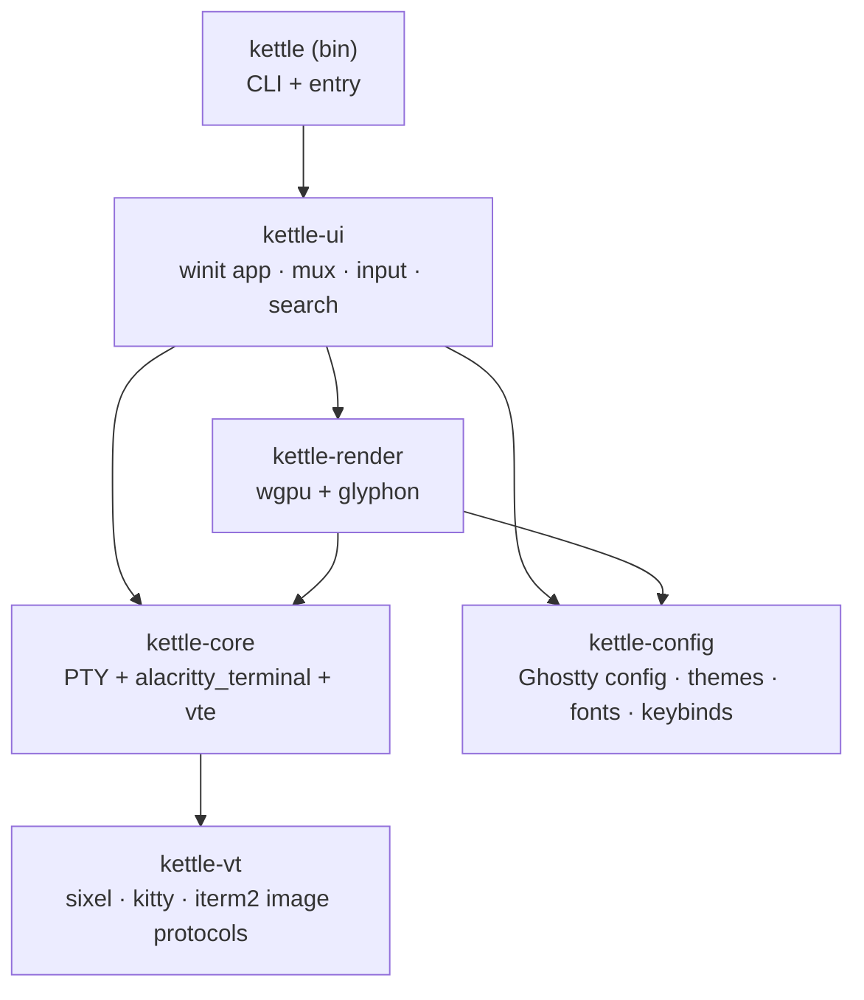
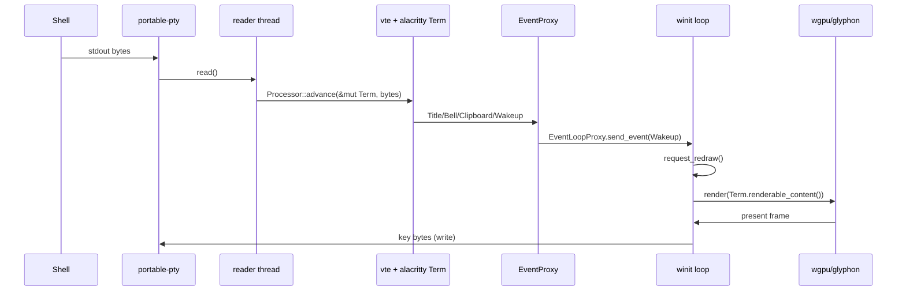

# kettle architecture

kettle is a Cargo workspace of focused crates. Data flows from the PTY through
the VT engine into a shared grid, which the GPU renderer reads damage-first.

## Crates

## Per-pane data flow

## Threading model

- **Main thread** — winit event loop, all GPU work, the tab/pane tree, input.
- **One reader thread per pane** — blocking `read()` on the PTY master, feeds
  the VT parser, then wakes the UI. The grid lives behind a `Mutex` shared
  between the reader and the renderer.
- Wakeups are coalesced by winit's `request_redraw`, so a flood of output
  produces at most one frame per vsync. Synchronized-output (mode 2026) is
  honored by the VT core.

## Key design choices

| Concern | Choice | Why |
|---|---|---|
| VT engine | `alacritty_terminal` + `vte` | Battle-tested vs vttest/vim/tmux; avoids re-deriving the xterm long tail. |
| Text | `glyphon` (cosmic-text) | Pure-Rust shaping + fallback + GPU atlas; ligatures + Nerd glyphs. |
| Window/GPU | `winit` + `wgpu` | One codebase for X11/Wayland/Win32/Cocoa. |
| PTY | `portable-pty` | Uniform Unix + Windows ConPTY. |
| Config | Ghostty `key = value` | Lets us ship the Ghostty theme set verbatim. |

See [RESEARCH.md](RESEARCH.md) for the comparative analysis these choices came
from.
