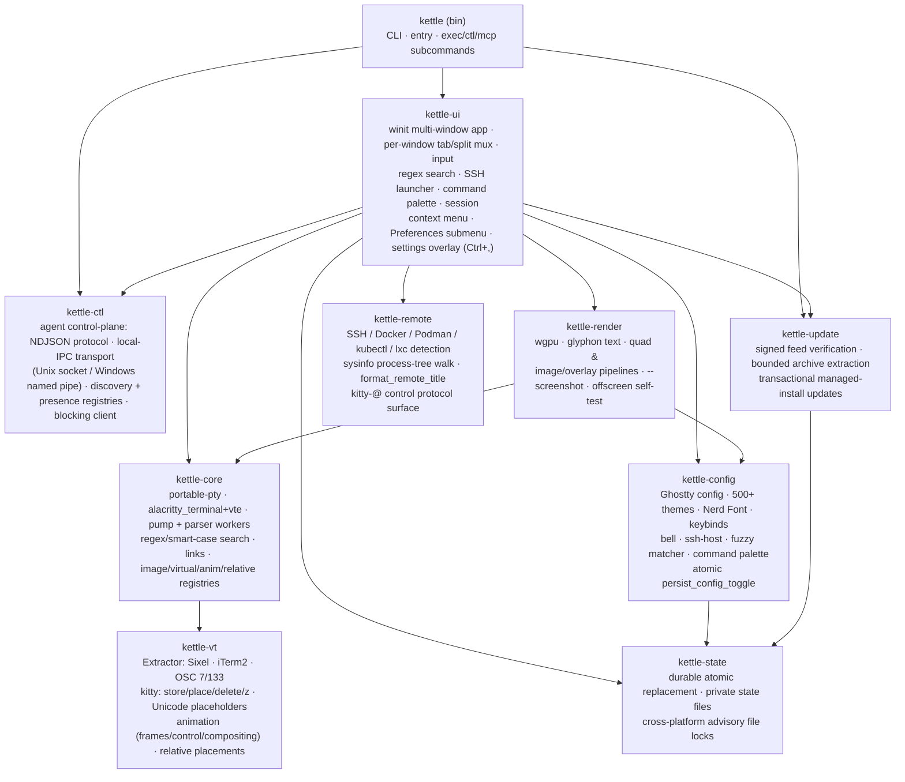
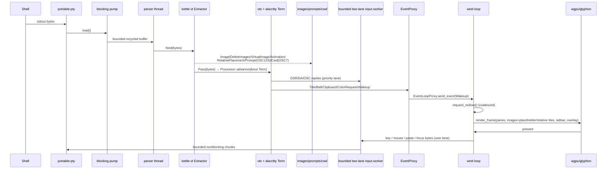
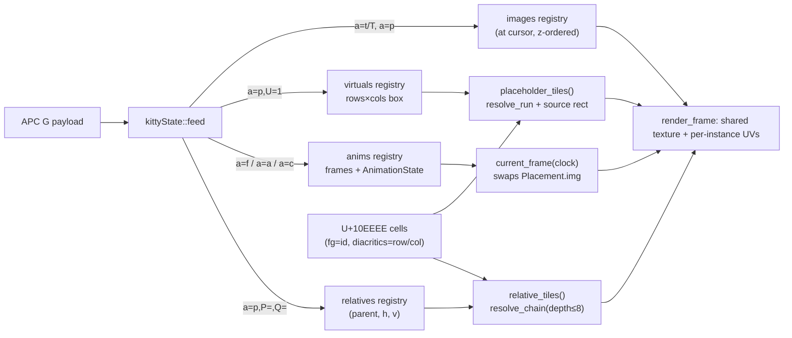
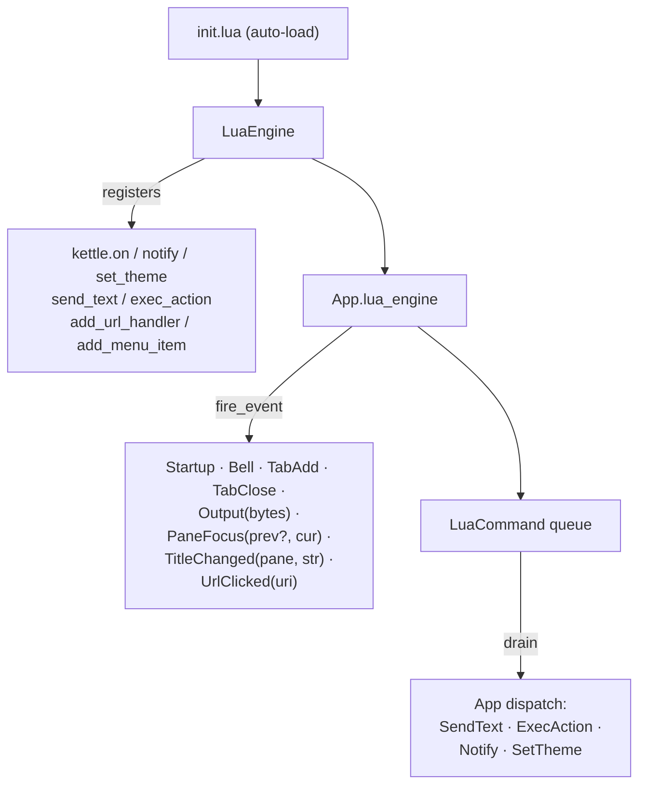
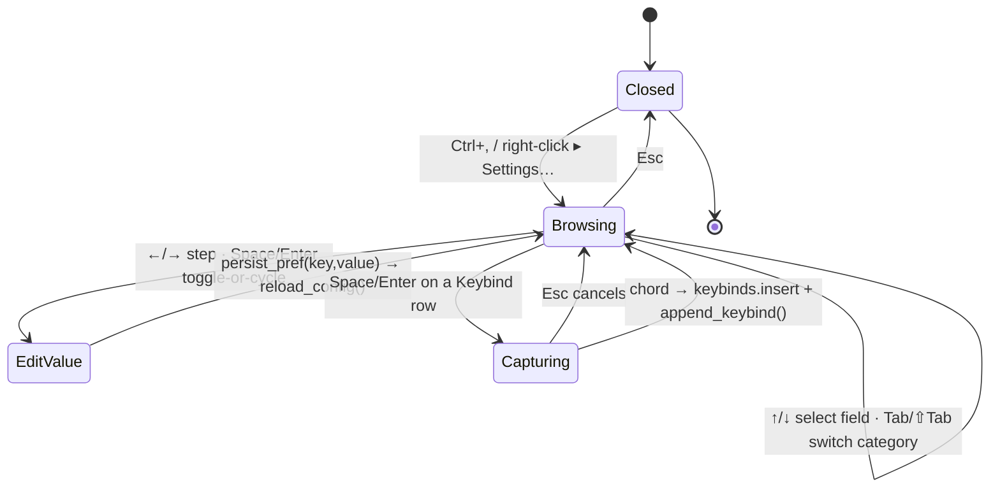
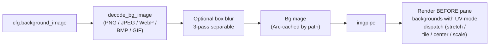
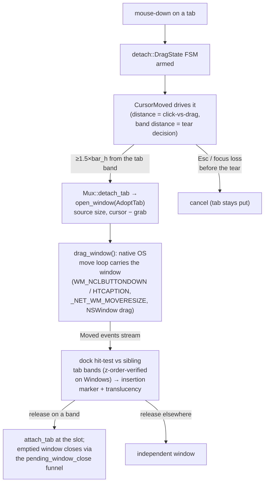
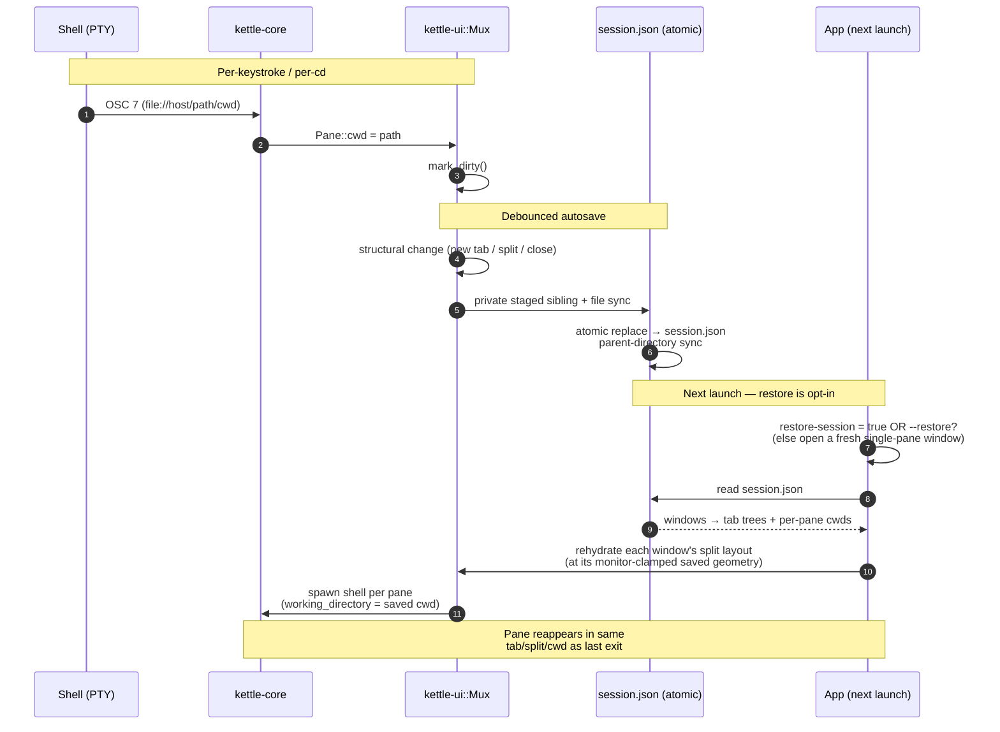
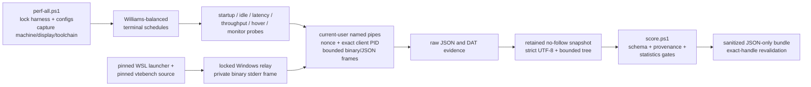

# kettle architecture

kettle is a Cargo workspace of focused crates. PTY bytes are split by an
**image-protocol extractor** before the VT engine sees them; the engine owns a
shared grid that the GPU renderer reads each frame; side-channels (prompts,
cwd, images, clipboard, title) flow back to the UI.

## Crates



`kettle-state` is the leaf persistence boundary shared by configuration,
sessions, and the updater. It stages with `create_new` beside the destination,
applies the final permissions/security descriptor to that open inode, syncs it
before publication, and syncs the parent directory on Unix. It preserves
existing permissions when asked and rejects symlink destinations by default.
Private files use mode `0600` on Unix. Before allocating a new staged name it
reclaims only exact same-destination temp names whose canonical creator PID is
definitively dead and whose opened object proves current-user ownership,
single-link regular-file identity, and no reparse/symlink substitution. Scan
and removal counts are bounded; live-PID, malformed, multi-link, and nonregular
lookalikes are untouched. Windows passes `CreateFileW` an explicit owner-and-DACL security
descriptor: the effective user owns the file and one protected ACE grants only
that user full access before any content is written. Existing leaves are
opened as reparse points and rejected; parent handles and file identities pin
the non-reparse parent across each open or publication. A failed creation is
discarded through its still-open handle, so cleanup cannot delete a path that
was swapped after the create.

Crash-remnant scans run through one process-wide best-effort reaper, not on the
caller that requested an atomic write. Its synchronous queue holds at most 32
destinations. The scheduler distinguishes in-flight work from completed work,
tracks at most 256 destinations in total, and expires completed keys after a
five-minute cooldown. Old completions are evicted before rejecting a new key;
spawn, queue, disconnect, and worker-guard failures cancel or complete the
reservation so a transient failure cannot suppress that destination forever.

Private Windows replacement moves that already-secured staged file into place,
so a permissive legacy destination DACL is never applied to new private bytes.
Permission-preserving replacement captures the old DACL while holding that
object against deletion, applies it to the staged handle, syncs that final
state, and then publishes that same object by handle. Hardening an existing
object requires effective-user ownership even when its DACL already looks
exact, because a different owner retains implicit authority to rewrite that
DACL. Elevated creation explicitly selects the user SID as owner instead of
trusting the token's possibly group-valued default owner. Win32 alias spellings
and alternate-data-stream leaves are rejected, and every child path is derived
from the already-held parent rather than resolved again through a mutable DOS
drive mapping. State and lock files, recordings, remote-command payloads,
terminal logs, screenshots, pasted images, and runtime/GPU/crash diagnostics
share these primitives. Advisory locks let callers serialize compound
operations; configuration persistence holds one across the complete read,
validate, backup, and replacement transaction.

Pasted clipboard bitmaps add a narrower ephemeral-file lifecycle on top of
those primitives. One process owns at most 64 PNG handles and 256 MiB of final
encoded PNG bytes; the streaming writer refuses a write that would cross the
remaining aggregate budget and removes a failed/partial object through its
creating handle. An empty bootstrap object establishes and identifies the
owner-private session directory before any clipboard content is written.
Every Unix PNG is then created with `openat` beneath that held descriptor, so a
rename/path replacement cannot redirect screenshot bytes; Windows pins the
directory name by denying delete-sharing before real PNG creation. A successful
object is reopened relative to the held session directory (`/proc/self/fd` or
`/dev/fd` on Unix) and must match the creator's kernel identity before that
creator is released; the retained handle and descriptor-relative path are the
authority used at shutdown. The session directory is never recursively
deleted: Windows transitions from the lifetime pin through an identity-matched
cooperative handle to a DELETE-capable handle, then marks that exact empty
directory for deletion; Unix compares the held
device/inode, owner, and `0700` mode immediately before removing the empty name
beneath the sticky or private scratch root. The remaining Unix check/remove
window is limited to the same effective UID; sticky/private parent policy
prevents a different principal from replacing the session name.

Crash cleanup recognizes only
`kettle-paste-<canonical-pid>-<canonical-u128-nonce>` directories and canonical
zero-padded `0001.png` through `0064.png` children. Cleanup runs on a background
thread so a damaged namespace cannot delay event-loop/window creation. It stops
after 250 ms, 8,192 root entries, 64 stale attempts, or 32 successful sessions;
each session is capped at 64 files. A candidate must be older than 24 hours,
its creator must be definitively dead (`ESRCH` on Unix; queryable
non-`STILL_ACTIVE`/invalid PID on Windows), and every child must open relative
to the held directory as a current-user/private, non-reparse, single-link
regular file. Handles for all children are acquired before deletion begins;
unknown, malformed, linked, nonregular, untrusted, live-PID, or
time-indeterminate candidates fail closed. PID reuse therefore delays
reclamation rather than risking a live sibling.

`kettle-update` composes those primitives into one managed-install
transaction. Windows names archive/helper/backup/quarantine state from one
exact decimal PID-and-epoch-nanoseconds id. Its schema-3 pending capsule carries
the exact signed release document and signature, selected asset digest, inner
package manifest, and retained archive/helper identities. The helper rechecks
that capsule against the compiled Ed25519 key and freshness window after taking
the update and running locks, reads the actually installed version from the
held PE version resource, and accepts only a strict upgrade.

Both platforms parse the digest-verified archive directly and materialize its
manifest-verified members into immutable byte buffers; transaction publication
never returns to an extracted pathname. The release grammar is capped at 128
entries and 512 MiB. Each schema-2 backup has an id-bound marker and must exactly
match the journal's `existed=true` paths, sizes, and hashes before rollback or
cleanup. Rollback also compares each live destination with the recorded
replacement fingerprint and preserves later writes on conflict. A committed
journal retains the last-known-good bytes until a process at the target version
reaches the managed startup checkpoint.

Linux retains the open descriptor-relative parent until each destination
snapshot leaf is opened; a `/proc/self/fd/...` capability can therefore never
be converted into a dangling path that misclassifies an existing file as new.
Linux installer layouts add a second, user-visible provenance layer at
`share/kettle/install-files.json`: it binds the normalized prefix and owner to
the sorted path/mode/size/SHA-256 identity of every managed file and records
only directories that Kettle created. Install, authenticated update, and
uninstall walk components without following links, validate owner/write modes,
and verify the complete prior record before mutation. Uninstall consequently
unlinks only recorded leaves and removes only recorded empty directories; it
does not recursively delete a shared XDG prefix or adopt a legacy tree.
The Windows lock order is update then running; the helper releases running then
update after durable commit and pending-record removal, before asking a fully
qualified system PowerShell to execute the exact archive-verified `install.ps1`
while a no-write/no-delete handle remains held. The PowerShell installer
implements the same byte-range and sharing contract while retaining non-reparse
directory handles from the drive root through the prefix, so validation and
leaf-only mutation cannot be redirected through an exchanged ancestor.
The Windows installer separately protects permanent state: every created root,
managed directory, coordination file, staged payload, and published file has an
explicit protected DACL for the initiating identity, SYSTEM, and Administrators.
It holds and validates the fixed-volume ancestor chain before root creation,
rejects untrusted replacement rights, and requires that exact ACL on an existing
root. An opt-in legacy migration from a trusted external installer accepts only
the bounded known tree before replacing inherited ACLs.
On Windows, a pending helper cannot replace the mapped `kettle.exe`/`kettle.com`
images until the old process releases its running-install guard and exits, so
that process cannot transparently re-exec the replacement and still propagate
its eventual status. A bare GUI handoff may exit zero, but any invocation with
arguments prints that no requested work ran and exits 75 (`EX_TEMPFAIL`). This
keeps help/version, configuration checks, CLI subcommands, and MCP launchers
truthful while the verified update waits for other windows to close.
After extraction, both supported updater paths verify any inner package
manifest that is present. Signed release archives from v2.36.0 onward must
contain that manifest; older archives may omit it for compatibility, but do
not bypass verification when one is present.

Managed-recording retention also deletes through these primitives. It keeps
the candidate locked while `kettle-state` proves the path still identifies the
open private object; Windows marks that kernel object for deletion through a
reopened handle, while Unix unlinks the verified leaf relative to its held
parent directory.

## Agent control plane

The agent-first control surface (see [AGENT.md](AGENT.md) for the full
reference) is owned by **kettle-ctl**, a UI-free crate that defines the
control-plane protocol (NDJSON request/response/event), the local-IPC transport
(a Unix domain socket or a Windows named pipe), the discovery registry, and a
blocking client. It is **off by default**: nothing binds a socket or writes a
registry entry unless the operator opts in (`agent-server = read-only|full`, or
`--agent-server <mode>`).

```mermaid
graph LR
    bin2["kettle (bin)"] --> exec["kettle exec<br/>headless one-shot<br/>(real PTY, no window)"]
    bin2 --> ctlcli["kettle ctl<br/>kettle-ctl client"]
    bin2 --> mcp["kettle mcp<br/>MCP bridge over stdio"]
    ctlcli --> ipc["local IPC<br/>(Unix socket /<br/>Windows named pipe)"]
    mcp --> ipc
    ipc --> srv["control SERVER<br/>(hosted in kettle-ui)"]
    srv -->|UserEvent::Ctl| app["App main thread<br/>(windows map)"]
    reg["discovery registry<br/>reserved kind field<br/>(\"gui\" today, \"muxd\" later)"] -.-> ipc
```

Two roles split cleanly across the bin and the GUI:

- The **GUI (kettle-ui)** hosts the control **server**. Requests arriving over
  the transport are dispatched on the App main thread via `UserEvent::Ctl`, so
  they observe and mutate the same per-window `Mux` trees the renderer reads —
  no separate lock on the pane tree.
- The **bin (kettle)** hosts the three opt-in entry points: `kettle exec` (a
  headless one-shot that runs a command under a real PTY and streams its output
  to stdout, no GUI), `kettle ctl` (the kettle-ctl client that drives a running
  kettle), and `kettle mcp` (the Model Context Protocol bridge that exposes both
  as native agent tools).

The surface is multi-window aware (v2.18.0): `get_state` reports
`{windows, focused_window}`; `list_tabs` / `list_panes` enumerate every
window and tag each entry with its `window`; `--pane N` resolves across
windows (pane ids are process-global); and a live tab tear-off emits a
`tab_moved` event (`{from_window, to_window, tab}`) on the subscription
feed.

Protocol v1 uses a typed method table as the authorization source of truth:
each method declares read/mutate capability and UI/connection execution. The
wire remains additive JSON, with exact `v: 1`, 1 MiB request and 768 KiB
response/event bounds, and snapshot paging for large live reads. Discovery
records are atomically replaced and private; accepted Unix connections also
verify peer uid. The MCP bridge negotiates `2025-11-25` or `2025-06-18` and
dispatches tool calls through a four-worker, 16-request bounded queue with
JSON-RPC cancellation tracking. The blocking control client reads frames
incrementally under method-aware deadlines, preserves events interleaved before
a response, and treats malformed frames or mismatched response ids as terminal
protocol errors. Unix connections enter nonblocking mode once, before cloning;
the transport restores ordinary blocking `Read`/`Write` semantics with
`poll(2)` and serializes complete deadline-aware writes through one
connection-wide gate. No operation toggles `O_NONBLOCK` on a shared open-file
description, while macOS retains the fd-level nonblocking behavior required to
make a full AF_UNIX send buffer deadline-aware.

The discovery registry reserves a `kind` field — `"gui"` today — as the
forward-compat seam for the optional `kettle-muxd` session daemon (see
[MUX-SERVER-DESIGN.md](MUX-SERVER-DESIGN.md)): when `kettle-muxd` lands it can
re-host the same server side as `kind = "muxd"` without breaking any client.

App-owned modal input stays distinct from pane input. `send_keys` encodes keys
through the active terminal modes and writes them to the PTY;
`dispatch_ui_key` accepts a bounded, pre-parsed batch only while a supported
Kettle modal is open and never enters the PTY path. `ui_geometry` exposes the
search bar's rectangles, focused control, modes, status, target pane, and
truncation flag; its Search object deliberately omits the query and matched
terminal text.

Pane-bound bytes never block the App thread. Each pane owns two bounded input
lanes: user input (keys, mouse, focus, paste, Lua, legacy remote commands, and
control requests) and higher-priority terminal protocol replies. Both lanes
have 64-message channels and independent byte budgets; the worker advances a
message in at most 8 KiB writes and checks the reply lane between user chunks.
The enqueue boundary returns `PaneInputResult::{Queued, ReadOnly,
Backpressured, Oversize, Failed}`. GUI callers provide throttled visible
feedback for transient/size failures, read-only remains visible in pane chrome,
and a failed worker is sticky and closes the pane. Control RPCs preserve the
distinction as `read_only`, `busy`, `bad_params`, and `internal` errors. A
local paste over 4 MiB is rejected before wrapping or fan-out; it is never
silently shortened.

## In-process multi-window

Since v2.18.0 every kettle window lives in one process. `App` holds
`windows: BTreeMap<u64, WindowState>`
(`crates/kettle-ui/src/window_state.rs`) — every per-window field (the
winit window, its renderer, its `Mux` tab/split tree, input + overlay
state) lives in `WindowState`, while `App` keeps the process globals
(config, event-loop proxy, ctl server, Lua VM).

A no-argument GUI launch first uses the private activation endpoint under the
per-user runtime/state directory. One advisory lock elects a primary; the
endpoint accepts only a versioned `open_window` request capped at 8 KiB and
verifies same-user peers. A capacity-32 handoff reaches the winit thread, and
the secondary exits only after that thread confirms OS-window creation. A busy,
incompatible, timed-out, or failed request falls back to a separate process so
a launcher click is never discarded. Any explicit argument bypasses activation;
`--new-process` provides a discoverable isolation escape hatch for an otherwise
default launch. Dev-record builds also compare a bounded path fingerprint and
raw-input policy before joining, preventing recording-policy drift without
putting a user path on the wire.

- **Take-out/put-back dispatch** — the `ApplicationHandler` entry points
  remove the addressed window from the map, run the inner handlers with
  disjoint `&mut App` + `&mut WindowState` borrows, then reinsert it.
  Window closes route through a single funnel (`pending_window_close` →
  `finish_window_dispatch`), which exits the event loop only when no
  windows remain.
- **One GPU context** — the wgpu `GpuContext { instance, adapter,
  device, queue }` is created with window 1 and shared; each subsequent
  window gets its own surface via `Renderer::new_with_gpu` (synchronous —
  no adapter request, no watchdog needed). Live windows, `--gpu-info`,
  screenshots, offscreen tests, detection, and recovery share one adapter
  policy. A config-pinned GPU (`gpu-vendor-id` /
  `-device-id` / `-name`, set via Settings → Graphics) wins; `gpu-backend`
  applies with or without that physical pin. Auto backend order is deterministic
  (DX12 first on Windows, Metal on macOS, Vulkan elsewhere), and unavailable
  explicit backends log an observable fallback to native order. The common
  unpinned Auto path enables and probes one backend at a time, so successful
  Windows DX12 startup does not initialize the Vulkan ICD. Pins and explicit
  low/high preference use one cross-backend enumeration; low/high ranks the
  physical GPU before backend and preserves the platform-preferred adapter for
  equal-class ties. Live instances retain winit's event-loop-owned
  `OwnedDisplayHandle` so the GLES fallback can present under Wayland without
  keeping window 1 alive. An absent pin
  (eGPU unplugged, driver swap) falls through to the power policy, so a stale
  portable config never prevents startup. Because the device/surface graph
  can't hot-swap and every window shares the one adapter, GPU changes apply on
  the next launch (the settings panel shows a "restart to apply" hint).
  A fatal wgpu error latches one bounded in-memory `GpuFault`; the event loop
  then rebuilds every renderer on a pure settle/backoff state machine
  (same physical GPU through an alternate backend → surface-preferred GPU →
  another physical hardware GPU → software) without dropping PTYs.
  Driver callbacks never perform filesystem I/O. The event-loop thread writes
  capped, rotated, terminal-content-free JSONL incident records under the
  per-user cache. Surface acquisition treats both `Success` and `Suboptimal`
  outcomes as renderable; a suboptimal frame is submitted and presented before
  the surface is reconfigured for the next acquisition. Rendering is a UI
  transaction: `Renderer::render_frame*` returns `Presented`, `RetryLater`,
  `Occluded`, or `SurfaceLost`, and the normal `kettle-ui` render path commits
  output-generation counters, the paint timestamp, and flood-pacing state only
  for `Presented`. Candidate output-generation maps are recycled and swapped on
  commit, so this correctness boundary adds no steady-state per-frame
  allocation. Visible startup windows are a lifecycle exception: they are
  revealed immediately after renderer initialization, before the first redraw.
  Genuine device loss is the other deliberate exception: the redraw guard
  snapshots output generations without presentation so a streaming PTY cannot
  spin while all renderers are being recovered. Paint scheduling uses the same
  occluded/minimized/explicitly-invisible predicate as animation and retry
  scheduling, retains terminal damage while hidden, and repaints on restore.
  Transport wakeups are a separate concern: an opt-in recorder or Lua output
  sidechannel keeps them enabled so its bounded queue can drain, but those
  event-loop wakes do not authorize a hidden-window paint.
  Before releasing a failed device, every window retains a CPU-only recovery
  snapshot of its live font family/size, cell scaling, resolved accent, and any
  queued screenshot completion. The snapshot survives failed adapter
  escalations; an all-or-nothing successful rebuild reapplies it at the
  window's current monitor scale and size, invalidates stale pane snapshots,
  and reflows every nonzero surface exactly once.
  Timeout and `Outdated` retain damage and enter a capped, deadline-driven
  per-window retry. Hidden, minimized, or compositor-occluded windows leave that
  repair armed without a wake deadline. wgpu 30 `Lost` recreates the affected
  surface/renderer through `Instance::create_surface` while keeping the healthy
  shared device; only the device-lost callback, out-of-memory, or internal GPU
  errors enter process-wide adapter/device recovery. Other render errors rebuild
  the affected renderer's retained resources on their own capped backoff.
- **Presentation and readback respect the window-system boundary** — every live
  frame calls winit's `pre_present_notify` after queue submission and
  immediately before `present`, which is required for correct compositor frame
  tracking. A live screenshot copies the surface in that same submission, then
  hands the staging buffer to one bounded worker for a finite GPU wait, mapping,
  conversion, crop, and PNG write. The event-loop thread never waits for a GPU
  readback, and a second capture receives an explicit busy result.
- **Runtime diagnostics are phase-only** — a watchdog observes fixed event-loop
  phase names (`resumed`, `gpu_init`, `window_event`, `redraw`, `user_event`,
  `about_to_wait`) and writes one private, rotated record after a bounded stall.
  An event-loop backend error writes the same record shape on exit. Records
  include only version, pid, display backend, phase, elapsed time, window count,
  and a sanitized bounded error; terminal bytes, commands, environment values,
  and paths never cross this boundary. The logging subscriber bridges both
  `log` and `tracing`, preserving winit's Wayland protocol error in stderr and
  the journal.
- **PTY wakeups fan out** to all windows, gated per window by a per-pane
  output-generation counter — plain output emits no `TermEvent`, so the
  counter is the only reliable "this pane has new bytes" signal. The reader
  publishes that counter with release ordering before requesting its per-pane
  gate for text, images, animation, progress, and notification side channels;
  parser callbacks never bypass this ordered path.
- **Filesystem notifications are hints, not commands** — the config and legacy
  remote-command watchers observe a containing directory so atomic replacement
  remains portable, then require the exact target path and a create, modify, or
  remove event. Non-mutating access events are rejected: on Linux, reading a
  watched file can itself emit `Access(Open)`, so treating access as a change
  creates a reload feedback loop. Each watcher also has a one-in-flight atomic
  latch. Config changes settle for 75 ms through winit's `WaitUntil` control
  flow, with no event-thread sleep, then load and compile process-wide state
  once before applying renderer changes to every window. The latch re-arms
  immediately before the read so a racing genuine edit is not lost. Remote
  commands share an advisory lock between sender append and receiver claim.
  Current `--remote-send` writers encode each exact argument as one
  `send-text-json <JSON_STRING>` line, preserving literal backslash escapes,
  LF, CR, NUL, and command-looking text without allowing payload lines to
  become operations. The receiver accepts the older lossy `send-text` form for
  direct-writer compatibility; malformed JSON contributes only to the
  coalesced unknown-line count, and diagnostics never include payload content.
  The spool is capped at 1 MiB and a claimed batch at 1,024 operations; an
  over-limit batch is rejected before any retained prefix is dispatched, and
  unknown-line diagnostics are coalesced. A busy lock or backpressured pane
  arms an event-loop deadline rather than sleeping. A claim reads and
  truncates one batch under the lock, then dispatches its parsed commands from
  an ordered in-memory FIFO before claiming another batch. This makes notification
  coalescing safe but the legacy file transport deliberately **at-most-once**:
  process failure after claim can lose the claimed suffix. `kettle ctl` is the
  acknowledged alternative and returns only after enqueue success or a typed
  input error.
- **Pane ids are process-global** (the `NEXT_PANE_ID` atomic), so the
  agent control plane and the session file address panes unambiguously
  across windows.
- **Per-window accents (Peacock), on by default** — `accent-color =
  auto` (the default) gives each window a distinct theme-pool hue;
  cross-process dedupe goes through a presence registry in kettle-ctl
  (`crates/kettle-ctl/src/presence.rs`: one `<pid>-w<seq>.json` per
  window under `<runtime base>/kettle/instances`, a sibling of the ctl
  discovery dir; RAII guard, dead-pid pruning, best-effort). The directory and
  leaves are current-user private on Unix; reads are no-follow and capped at
  4 KiB, and version, filename identity, PID, and `#rrggbb` fields are validated
  before a claim participates in color selection.
  `accent-color = theme|off|none` opts out; a hex value pins one color.

## Search architecture

Search crosses core, UI, and renderer boundaries without materializing the
whole scrollback buffer:

- **`kettle-core` owns matching.** `CompiledSearch` validates strict Rust
  regex syntax and the 4096-byte UTF-8 input cap, then runs
  `regex-automata`'s meta engine over a bounded terminal-grid adapter. The meta
  engine retains Rust leftmost-first behavior and Unicode assertions such as
  word boundaries. Compilation admits at most 512 KiB of Thompson NFA, 256 KiB
  of one-pass state, a 256 KiB hybrid cache, and 40 KiB of DFA state. It uses
  `WhichCaptures::Implicit`, so only the implicit whole-match capture is built;
  subgroup captures are unnecessary because the UI consumes grid spans, not
  capture values. A syntactically valid expression that exceeds an engine
  ceiling is **Pattern too complex**, distinct from Invalid pattern. Public
  `SearchPoint`/`SearchSpan` coordinates use signed lines so historical rows
  (negative in the engine's coordinate system) are not discarded. Bounds,
  direction, wrap outcome, layout snapshots, scan tokens, and truncation are
  explicit values rather than sentinel integers. Materialization maps soft
  wraps, wide cells, combining marks, variation selectors, and ZWJ sequences
  back to grid spans. Regex matches that consume no bytes are suppressed in
  the engine's single leftmost-first pass; consequently, a nullable alternative
  that wins with an empty match can shadow a later consuming alternative at
  the same position.
- **`kettle-ui` owns interaction and scheduling.** Each `WindowState` has one
  search state and an in-memory per-pane query map; moving between panes does
  not leak a query into another pane, and no search state is process-global.
  The Unicode editor moves, selects, and deletes by grapheme boundary. A scan
  token combines pane output generation, query revision, and terminal layout.
  Query changes and reflow restart work from a fresh viewport anchor. Plain PTY
  output preserves and advances an existing chunk cursor so a continuously
  writing process cannot starve deep-history search. Because rows can drift,
  only a non-navigation scan schedules fresh verification after 500 ms quiet.
  If output interrupts an explicit Previous/Next operation, its ordering cannot
  be reconstructed by the default-direction retry; it remains Results limited
  until the user explicitly retries navigation.
- **Work is hybrid and bounded.** Typing searches at most 1000 physical lines
  around the viewport immediately. When that finds nothing, a 500 ms idle
  deadline advances through nominal 1000-line history ranges, with at most one
  bounded core work slice per event-loop turn; explicit Next/Previous starts
  the same resumable traversal immediately. Nearby highlights cover the visible
  viewport plus 100 physical lines on each side.
  One synchronous regex invocation receives at most 64 KiB of UTF-8. One
  bounded core call has the same 64 KiB aggregate text ceiling plus limits of
  262,144 inspected terminal cells and 256 complete logical-line haystacks.
  Reaching an aggregate work ceiling returns an exact continuation at the first
  unscanned hard logical line; it never splits a complete logical line, never
  sets Results limited, and the UI resumes it on a later event-loop turn. The
  nearby phase, background traversal, and visible projection each run at most
  one such core work slice per turn; visible projection yields to foreground
  navigation and resumes on the next turn.

  A single soft-wrapped logical haystack is separately capped at 256 physical
  rows, 64 KiB of UTF-8, and 262,144 inspected cells (including spacer/context
  inspection). Reaching one of those capacities inside the logical line is an
  accuracy barrier: exact matches wholly before it may still be painted, but
  traversal stops immediately, returns no continuation past uninspected cells,
  and reports **Results limited** instead of a definitive first, last, wrap, or
  miss. One projection retains at most 65,536 spans. Retained search memory is
  therefore independent of total history size.
- **`kettle-render` owns layout and drawing.** One responsive bottom lane uses
  one row on wide windows and as many additional rows as needed on narrow
  windows, so every control remains present without painting over pane cells,
  the status bar, or update banner. Highlight
  projection consumes sorted signed spans in a single pass with the visible
  cells (`O(cells + spans)`). The active result uses the theme search colors;
  nearby results use the normal selection treatment. The bar intentionally
  renders statuses such as Searching, Match, Wrapped, Start, End, No match,
  Invalid pattern, Pattern too complex, Query too long, and Results limited
  rather than an eagerly computed global count.

Opening captures a viewport-relative anchor. Closing preserves the selected
match at the same screen row (or restores the pre-open offset when there was no
selection), which prevents the bar's reserved rows from making content jump.
Wrap, case mode (Smart/Match/Ignore), and invert are persisted through the same
config transaction as Settings. All editor and navigation input is handled
before pane encoding, so it is not forwarded to tmux, AstroNvim, Codex CLI,
Claude Code CLI, or other programs in the PTY. Native keyboard, IME,
accessibility, and renderer behavior still requires platform-specific evidence.

## Per-pane data flow



The blocking PTY `read()` runs on a small pump thread so the parser thread can
still wake at a DEC 2026 synchronized-update deadline while no bytes arrive.
Their handoff is a four-slot synchronous channel with recycled 64 KiB buffers:
output flood applies bounded backpressure instead of growing an unbounded
queue. Pump-thread creation failure is logged and closes the pane through its
normal exit event instead of leaving the parser parked on a senderless channel.
The parser force-ends an omitted synchronized update at its deadline before
returning any simultaneously ready chunk, so a sustained output queue cannot
starve the flush. EOF/disconnect flushes immediately because no terminator can
still arrive. The parser then bumps the output generation and wakes the UI for
the now-visible frame after releasing the terminal lock.

Graphics controls inside DEC 2026 use the same atomic commit boundary. While
an update is open, the extractor retains each complete Sixel, Kitty, or iTerm2
control string without decoding it and inserts a bounded, out-of-band VTE
marker at the current synchronized byte offset. PTY bytes cannot forge a
marker. When VTE commits the buffered text, marker callbacks first apply the
terminal engine's preceding screen/cursor journal events and then replay that
one graphics control against the exact buffer and cursor state at its wire
position. Image cursor movement therefore precedes later buffered text. The
reader suppresses its normal generation increment and redraw wake while an
update is pending; a close, deadline, or EOF publishes only after every marker
has replayed. The marker and deferred-control queues each cap at 256 entries.
Overflow or a journal/marker mismatch is sticky for that update and fails
closed by clearing both buffer-local graphics stores and resynchronizing the
extractor to the engine's active screen.

The optional raw-output tap has an explicit delivery policy. Lua output hooks
use a bounded best-effort sender and may drop under plugin backpressure;
recording and `kettle exec` use lossless delivery. `kettle exec` pairs that
policy with a four-slot queue, so a slow stdout pipe blocks the PTY reader before
it takes the terminal lock and bounds memory without creating a lock cycle.
Rendered stdout commands cross a second four-slot queue to a dedicated writer,
keeping blocking OS writes off the lifecycle thread. The lifecycle counts
admitted commands and polls their completion plus the final flush/join; timeout
and cancellation therefore remain observable after child exit, while ordinary
completion still drains losslessly.
Every stdout write and flush returns through a worker-outcome channel to the
lifecycle thread. A genuine write/flush failure is not an abandonment: Kettle
diagnoses it on stderr, terminates and reaps the command tree, finalizes any
recording, and returns 74 (`EX_IOERR`) instead of the child's status. A deadline
that finds a merely stalled consumer retains the separate bounded-abandonment
contract and its `stdout was not fully delivered` warning.
Its independent PTY writer arbiter gives the bounded 64-message terminal-reply
lane priority over forwarded stdin and incremental Unix VEOF injection. Reply
admission and the arbiter's final reply recheck plus one nonblocking VEOF
attempt share a short ordering gate. The producer holds it only for
`try_send`; the arbiter drops it before yielding or retrying. An admitted reply
therefore cannot be overtaken by an EOF attempt based on a stale empty-channel
observation, while PTY capacity can never extend the critical section. Reply
queue overflow, disconnect, and semantic-event overflow fail the command
explicitly instead of dropping terminal protocol state. The guarantee begins at
reply admission; a query generated after the kernel accepted a VEOF cannot
retroactively overtake that byte.
Unix permits exactly one live `PtyStdin` arbiter handle per terminal. Duplicated
PTY descriptors share one open-file description, so independently restoring
`O_NONBLOCK` from overlapping handles would let an older drop change a newer
handle's I/O mode. Lease setup rolls back on failure, successful drop restores
the captured flags before releasing the lease, and a restoration failure
latches the terminal closed to future stdin handles rather than treating the
still-nonblocking state as a new baseline.
Windows ConPTY also forwards piped input. Its caller-owned pipe writer alone is
put into `PIPE_NOWAIT` and advances in bounded 1 KiB steps; the synchronous
handle passed into `CreatePseudoConsole` is unchanged. Windows anonymous pipes
do not provide the Unix-style PTY EOF half-close used by canonical VEOF
planning, so an EOF-waiting child must use an explicit input delimiter or a
finite command timeout.
GUI development recording subscribes to the same fan-out used by normal redraw
and close drains, so consuming output for a recorder cannot steal it from Lua or
skip a pane's final bytes. The shared asciicast writer stops at a complete event
boundary before 512 MiB. Managed directories use private unique files, active
file locks, and namespace-scoped 50-file / 5-GiB retention; explicit paths are
locked before truncation.

The input worker is a separate per-pane boundary from the output pump/parser
pair. User messages are capped at 4 MiB plus the bracketed-paste envelope, with
a slightly larger aggregate reservation for interactive input already queued.
Protocol replies have a separate 2 MiB message/aggregate budget; rejecting one
is terminal because silently losing a reply corrupts the terminal protocol.
Broadcast fan-out returns the strongest result across its targets and scrolls
only panes that accepted the write. Paste fan-out builds at most one raw and
one bracketed immutable payload regardless of pane count.

## kitty graphics pipeline

The biggest VT extension. Decoding lives in `kettle-vt::kitty` (pure,
heavily unit-tested); per-terminal registries live on `kettle-core::Terminal`
and are populated by the parser worker; the renderer reads them each frame.

`kettle-vt::GraphicsLimits` is the single allocation envelope for this path.
Escape sequences are capped at 16 MiB; kitty transmissions at 96 MiB with at
most eight/128 MiB in flight; decoded images and individual textures at 64 MiB;
animation payloads at 128 frames/128 MiB; and placements at 256. RAII leases
charge Kettle-owned decoded buffers, image textures, custom glyph atlases, and
instance buffers to a 256 MiB terminal/window scope and 512 MiB process
accounts. Decoders reserve before allocation, image clones share one lease,
copy-on-write reserves a second image, and GPU caches release non-visible
textures before admitting replacements. An oversized, unterminated control
string is quarantined for at most one additional 64 KiB recovery window before
the extractor returns to ground state. The 256-placement limit applies to
inline terminal images; the independent wallpaper pipeline permits up to 4096
tile instances and batches consecutive tiles that share a texture.

Kitty placement intent stays attached to each placement rather than being
rounded into cells once. The core re-resolves source crop (`x/y/w/h`),
destination columns/rows (`c/r`), in-cell offsets (`X/Y`), one-axis
aspect-preserving sizing, and `C=1` cursor suppression against the current
cell/pixel geometry after a DPI change. Deletion covers every spatial/id
selector plus frame deletion, distinguishes lowercase retain-data from
uppercase free-data, and feeds the actual removed placement keys back into the
decoder before later APCs in the same PTY read are parsed.
Regular and placeholder placements use the grid's monotonic `history_origin`
plus their grid-relative row, not a reusable `history_size + line` coordinate.
Snapshots carry that origin to the renderer; the parser prunes a placement only
when its half-open row span is wholly older than retained history, including
after a synchronized-update timeout, and resize performs the same cleanup after
history-limit changes. Placeholder projection adds `display_iter`'s already
scrollback-relative line exactly once.

Before upload, each inline image draw instance is clipped on the CPU to the
intersection of the pane interior and exact terminal grid. The destination and
source UV rectangles move by the same normalized fractions, preserving pixel
scale while excluding padding, borders, top/bottom pane titlebars, sibling
panes, and window chrome. Fully outside, degenerate, non-finite, and zero-line
viewport placements produce zero-sized indexed slots so existing same-texture
batch offsets remain stable. The independent wallpaper pass has no pane clip.

The active graphics registries are buffer-local. Mode 47 switches to and from a
persistent alternate graphics store. Mode 1047 preserves that store on entry
and clears it on exit. Mode 1049 saves/restores the text cursor, clears
alternate graphics on entry, and preserves them on exit. Every mode parks and
restores the primary Sixel/Kitty/iTerm2 registries and switches the extractor
between independent Kitty image-id stores. ED 2 clears only the active
registries/store; RIS clears both and returns graphics extraction to primary.

The vendored terminal engine reports these committed mutations through an
authoritative journal in parser execution order, rather than making the image
extractor infer terminal state from bytes. Each terminal retains at most 256
events. Compatible adjacent scrolls coalesce while preserving the first and
last monotonic screen-top ids; overflow is sticky until the next drain. The
parser worker drains the journal after each text chunk; during DEC 2026 replay,
it also drains through the matching unforgeable marker before applying the
deferred graphics control at that exact ordering point. A natural close and
forced timeout/EOF use the same replay path. If either bounded journal
overflows, a marker does not match its deferred control, or the final
active-screen snapshot disagrees with the applied sequence, Kettle clears both
graphics buffers and resynchronizes extraction to the engine's active screen.

Scroll events carry direction, page margins, count, pre/post screen-top ids,
and screen height. A placement wholly inside the margins moves with the text;
if the move crosses a margin, its destination height and normalized source
range are permanently cropped by the same fraction. That range composes with
any existing Kitty source rectangle. The original Kitty placement parameters
remain attached to the fragment: a later monitor/DPI change re-resolves the
source rectangle and horizontal/natural geometry, reapplies the composed crop
to the new full destination height, and preserves the fragment's post-scroll
document anchor and fractional y offset. Removed pixels therefore stay removed
without freezing natural-size or one-axis-auto geometry at the old monitor's
cell dimensions. A placement already crossing a margin stays at its visual row.
Top-anchored scrolling uses the complete monotonic screen-top delta, so
coalescing more scrolls than the page height still preserves document anchors;
rows fixed outside the region are reanchored to keep their viewport position.

Column reflow clears regular/relative placements whose document rows cannot be
mapped exactly, but retains virtual prototypes and animations because the
Unicode placeholder cells themselves are reflowed by the grid.

This remains a deliberately partial Kitty implementation. Immediate
acknowledgement/query replies, replacement cleanup when new pixels reuse an
existing image id, and exact `Q=` parent-placement selection when an image has
multiple concrete placements are tracked in
[AUDIT-DEFERRED.md](AUDIT-DEFERRED.md).



## Render pass order

The renderer's per-pane text buffers, per-row shaping keys, style keys, and
titlebar caches are indexed by the process-global pane id carried in
`PaneView`. Visible pane order can change when a split is rotated, a tab moves
between windows, or a pane is re-tiled; the renderer swaps cache slots to keep
already-shaped rows attached to the same terminal pane instead of the same
screen index.

Font loading is also staged on the live renderer path. The bundled Regular face
is loaded during `Renderer::new` so the first visible frame can measure and draw
normal terminal text. Bundled Bold, Italic, and Bold Italic are loaded once the
snapshot contains styled text, then text cache keys are invalidated so future
shaping sees the complete family. Headless screenshot paths still load the full
family because they render a single static image and do not benefit from a later
warm-up frame.

Each frame the renderer issues nine passes (grid mode; eight in legacy) against
the same wgpu render-pass encoder, in this order. The order matters: a quad pass
paints over text drawn before it, and text drawn after a quad covers
that quad's pixels.

```mermaid
flowchart LR
    clear["Clear color<br/>(theme bg + opacity)"] --> bgimg["0. bg_imgs.draw<br/>background image<br/>(wallpaper, at the back)"]
    bgimg --> quads["1. quads.draw<br/>pane bg, tab bar,<br/>chrome quads + cursor block"]
    quads --> imgs["2. imgs.draw<br/>sixel · kitty · iTerm2<br/>inline image overlays"]
    imgs --> glyph["3. glyph_pipeline.draw<br/>pane text, CELL-LOCKED<br/>(grid mode; v2.25.0)"]
    glyph --> text["4. text_renderer.render<br/>tab / titlebar text<br/>(+ pane text in legacy)"]
    text --> overlay["5. overlay_quads.draw<br/>pane dimming · scrollbar<br/>(NOT menu chrome)"]
    overlay --> menuq["6. menu_quads.draw<br/>shadow · panel bg ·<br/>border · row highlight"]
    menuq --> menut["7. menu_text_renderer.render<br/>context menu + settings overlay<br/>row labels"]
    menut --> curg["8. cursor_glyph_renderer.render<br/>focused block cursor's<br/>inverted glyph (on top)"]
```



**Pass 3 (v2.25.0) — cell-locked pane text.** In the default `text-renderer =
grid` mode pane cell text is drawn by `glyph_pipeline`
(`crates/kettle-render/src/glyphpipe.rs`), an instanced glyph renderer that pins
every glyph to its grid cell (`pane_origin + col × cell_w`) — the
Alacritty / kitty / WezTerm / Ghostty model. `build_pane` still shapes each row
with cosmic-text (the per-line shaping cache is unchanged), but instead of handing
the whole `Buffer` to glyphon, `emit_pane_glyphs` walks the laid-out glyphs and
emits one pinned instance each, rasterized through cosmic-text's own `SwashCache`
into a private mask+color atlas. The fragment shader replicates glyphon's exactly
(mask = `sRGB→linear(fg) · coverage`, color = straight sample of an sRGB atlas), so
antialiasing, gamma and theme colors are identical — only the X position is
substituted. This fixes glyph drift: previously a glyph whose advance differed from
the cell width (fallback-font CJK / color emoji / some symbols, ligature clusters,
a mismatched-width bold/italic face) shifted every following glyph off the
`col × cell_w` grid that the selection highlight, cursor and mouse hit-testing all
use. Emission runs on the same `need_prepare` damage gate as the glyphon prepares
it replaces: a steady frame re-draws the retained instance buffer for free, and a
frame that re-prepares for any reason (a pane row changed, a chrome label changed,
or a cursor blink to a new glyph) re-emits the pane instances — the same cadence
the old glyphon pane prepare ran at, so it is at parity, not a regression.
`text-renderer = legacy` keeps the old continuous-glyphon pane path (pass 4) as a
rollback escape hatch; pass 3 is then an empty no-op. Since v2.25.1 the grid pass
has its own damage gate: pane text/style/geometry changes refresh glyph
instances, while cursor blink updates only cursor quads and the cursor-glyph
pass. A blink must never invalidate or stale-draw ordinary pane glyphs.

Pass 0 (v2.23.0) is the **background (wallpaper)** in its own pipeline, drawn at
the very back so the cell/chrome quads (pass 1) composite *opaquely on top* of it
— the standard kitty / WezTerm / Alacritty layering. The wallpaper lives in
`bg_imgs` (a decoded image texture), separate from the **inline** sixel/kitty/
iTerm2 images in `imgs` (pass 2, which sit over cell backgrounds). Before v2.23.0
the wallpaper shared `imgs` and drew *after* the quads, which (a) hid every cell
background under an opaque wallpaper and (b) bled the animation through the tab
bar / status bar. The chrome strips now resolve an opaque fill via
`chrome-background` (theme / auto-from-wallpaper / black / white).

**v2.24.0 — procedural starfield.** When `background-type = starfield`, pass 0
instead draws `starfield` (`crates/kettle-render/src/starfield.rs`): a fullscreen
triangle whose WGSL fragment shader *generates* a slow forward-flight star field
per-pixel from a tiny uniform `{resolution, time}`. It's a **fixed built-in
example** (v2.24.1) — the look (speed `0.009`, `NSTARS = 55`, glow, and the
fade-in: center stars fully invisible, cubic `prog³` proximity ramp) is baked
into the shader as WGSL constants, not config-driven. No decoded frames → ~zero memory, true-color (no GIF banding), a
perfect loop, and crisp at any resolution. It is mutually exclusive with `bg_imgs` and composites
identically (chrome opaque on top). The animation tick reuses the GIF machinery
via a **synthetic fps clock**: `bg_current_frame_index` / `bg_anim_interval_ms`
quantize the continuous drift to a ~10 fps cap (`STARFIELD_FPS`) so the existing
edge-trigger + wake-scheduling in `App::about_to_wait_inner` advance it at low
idle cost, while the shader's `time` uniform stays continuous so each repaint
shows the exact position. The animated background (starfield or image) now plays
by default even when unfocused, but the event loop **freezes the wake when the
window is minimized or occluded** (`window_occluded` + `is_minimized`), so a
hidden window costs zero idle.

The **settings overlay is mouse-driven** (v2.24.0): `kettle_render::settings_hit_test`
recomputes the panel geometry from the SAME `settings_display_lines` + panel math
the draw uses (single source of truth) and maps a cursor position to a category
tab / field row / outside; `App::settings_mouse` dispatches that into the existing
`settings_adjust` (left-click = cycle forward, right-click = back, wheel =
adjust). The Background settings page edits the image path through an inline text
prompt (`SettingsTextEdit`) and gates inapplicable rows (`settings::field_disabled`).

Steps 6–7 own the right-click context menu so its labels land **on
top of** the panel background. Splitting them out fixed the v1.3.0 /
v1.3.1 blank-menu bug — the menu's opaque panel quad used to live in
step 5 (`overlay_quads`), painting over the menu text that had
already been rendered.

Step 8 (v2.21.0) draws the inverted glyph **under a focused solid
block cursor** in its own 1-glyph renderer, on top of the block quad
(step 1). Decoupling it from the pane text buffer — rather than
recoloring the glyph in-place — means a cursor blink leaves the pane
buffer byte-identical, so the **damage gate** can skip the expensive
whole-viewport `text_renderer.prepare` (which re-encodes every visible
glyph's vertices) and its paired `atlas.trim`: `build_pane` reports
whether any row reshaped, and `prepare` runs only when a pane row
changed, a chrome label changed, or a text overlay is open. The 6–8
passes are cheap no-ops while idle (empty/unchanged buffers). The
`TextRenderer` instances share one `TextAtlas` and `Viewport` —
glyphon batches glyphs by atlas, not by renderer, so each pass reuses
already-cached glyphs (the cursor glyph is part of the visible pane
text, so its bitmap is already resident).

## Threading model

- **Main thread** — winit event loop, *all* GPU work, every window's
  tab/split tree (the `windows` map; dispatch is take-out/put-back, see
  above), input encoding, search/SSH overlays, session save/restore,
  cursor-blink and visual-bell timers (scheduled via
  `ControlFlow::WaitUntil` only while something animates, so an idle
  terminal does no work). Blink phase advances at the timer edge before the
  redraw request, so a delayed Wayland frame callback cannot enqueue the same
  phase repeatedly. Empty `Ime::Preedit` events normalize to absent state and
  do not reposition IME or request another frame unless visible preedit state
  actually changed.
- **Monitor-DPI transitions are one layout transaction per window.** winit
  delivers Windows `WM_DPICHANGED` as `ScaleFactorChanged` before the
  `SetWindowPos`-driven physical `Resized`. The renderer adopts the new glyph
  scale in the first event, while a per-window coalescer defers surface, grid,
  recorder, and PTY resizing until the usable physical size arrives. An
  `about_to_wait` fallback commits from the live inner size only if no resize
  arrived. Zero-sized/minimized windows and renderer or GPU recovery retain the
  pending transition, so Kettle never sends an intermediate grid or duplicate
  `SIGWINCH` merely because a window crossed mixed-DPI monitors.
- **PTY geometry is one versioned grid-and-pixel transaction.** The UI derives
  exact text-area pixels from fractional renderer metrics and computes each
  restored or newly split leaf before spawning its child, so the process sees
  the correct initial winsize. Grid reflow, image-cell conversion, and the
  published pixel extent use one `Term`-then-geometry lock order and cannot mix
  two resize generations. Desired geometry is tracked separately from the last
  native geometry that succeeded, which makes a failed native resize retryable
  on the next layout pass. Windows clamps ConPTY rows/columns to its signed
  16-bit boundary and skips synchronous `ResizePseudoConsole` calls when only
  the advisory pixel extent changed; Unix still publishes pixel-only winsize
  changes.
- **One parser thread plus one blocking pump thread per pane** — the pump reads
  the PTY master into a bounded recycled-buffer channel; the parser applies
  `Extractor::feed`, records image/side-channel chunks, drives text chunks into
  the `alacritty_terminal::Term` (behind a `Mutex` shared with the renderer),
  and wakes the UI. This split preserves parser deadlines without unbounded
  buffering. **Teardown invariant** (`Terminal::Drop`,
  `crates/kettle-core/src/term.rs`): it runs on the UI thread (a pane close drops the owned
  `Pane.term`), so it must **never `join()`** these workers. On Windows a
  ConPTY `read()` only unblocks once the pseudoconsole is *closed*, while
  `ClosePseudoConsole` itself can wait for conout to drain. Joining a worker or
  destroying that master on the UI thread can therefore make the window "not
  responding". Drop closes the writer when immediately available, moves child
  kill/reap and master destruction to a detached teardown worker, and
  **detaches** the parser handle. Before starting that worker, Drop switches
  the pump into direct discard/drain mode; an interruptible bounded handoff
  lets it bypass a full parser queue, so draining cannot depend on parser or UI
  progress. The pump remains live while the worker closes the master; only
  after that close returns does the worker publish the reader stop flag. This
  is required before Windows 11 24H2, where
  [`ClosePseudoConsole`](https://learn.microsoft.com/en-us/windows/console/closepseudoconsole)
  may wait indefinitely if the output pipe is not closed
  or continuously drained. Windows 11 24H2 returns from that API immediately,
  but uses the same safe ordering. The workers own only moved values or `Arc`
  clones (no borrow of `Terminal`) and exit on their own. If teardown thread
  creation fails, Kettle logs, stops the reader cooperatively, and intentionally
  retains the native handles rather than entering an unbounded platform close
  on the UI thread.
- Output floods use a per-pane atomic wake gate and a per-window paint state
  machine. A renderable pane publishes at most one pending event-loop wake.
  Hidden, minimized, occluded, or renderer-unavailable panes retain paint
  damage without a redraw deadline and publish one paint wake when
  renderability returns. If a pane has an opt-in recorder/Lua output
  sidechannel, transport wakes remain enabled while hidden so its bounded queue
  drains; the visibility/recovery guards still prevent those wakes from
  entering presentation. The paint pacer
  advances `deferred → queued → presenting → idle` only after a presented
  frame; a failed presentation returns to `deferred` without a busy deadline.
  The pane latch stays closed throughout a deferred interval and reopens only
  when a real frame is about to snapshot generations. A queued wake that was
  already covered by a presented frame is acknowledged and then resampled,
  closing the race between the stale check and rearm. Visibility, recovery,
  reap, and renderer guards run before the pacer can enter `presenting`, so an
  early return cannot strand the state machine or create a near-zero wake loop.
  Per-pane
  registries (`images`, `virtuals`, `anims`, `relatives`, `prompts`, `cwd`)
  are `Arc<Mutex<…>>` snapshotted cheaply for rendering; a running kitty
  animation schedules a ~30 fps redraw tick (otherwise idle, no CPU). The
  extractor caps in-flight sequences (16 MiB) so a hostile stream can't hang
  or OOM — the cap is security-relevant: an SSH session into a constrained
  container can otherwise OOM-kill kettle by emitting unbounded image data.
- **Context-menu redraws are terminal-lock-free when safe.** Pointer/keyboard
  highlight changes arm a one-shot snapshot-reuse hint. Before taking the fast
  path, the UI compares every visible pane's stable id, atomic output
  generation, columns, rows, and order with the pooled snapshot keys. Any
  intervening input/user event clears the hint, active pointer gestures disable
  reuse, and any key mismatch falls back to the full drain/snapshot path.
  Opening a menu also ends selection/scrollbar/split/tab gestures so
  `CursorMoved` cannot mutate terminal state behind it. A reused snapshot
  stages its exact visible-pane output generations into the presentation
  transaction while preserving the last committed generations for background
  panes, so racing output stays pending. It also carries the captured
  cursor-blink bit; both overlay construction and the event-loop blink
  scheduler use it instead of reacquiring the focused `Term`.
  Renderer text damage excludes the highlighted menu row but includes labels,
  enabled state, theme colors, anchor, and scroll window. The renderer still
  walks the cached snapshots and rebuilds its quad batches; the optimization
  avoids terminal capture and retained-text preparation, not all frame work.
  Menu measurement uses Unicode display columns with grapheme-safe ellipsis.
  The UI, renderer, and agent geometry endpoint consume the same clamped panel
  dimensions and expose or hit-test only rows that fit completely. Pointer
  hit-testing streams separator flags without a temporary collection, and the
  wheel clamp finds its final fitting suffix in one reverse pass; both are
  O(menu items).
- **Lua VM** is parked on the App struct (single-threaded
  `LuaEngine`) — `mlua`'s `send` feature makes the handle `Send + Sync`
  but kettle never clones it across threads. Event hooks
  (`LuaEvent::Startup` / `TabAdd` / `TabClose` / `Bell` / `Output` /
  `PaneClose` / `PaneFocus` / `TitleChanged` / `UrlClicked`) fire
  synchronously on the App thread. Lua side-effects (`SendText`,
  `ExecAction`, `Notify`, `SetTheme`) first enter the Lua engine's
  bounded queue, then move immediately into one process-wide App FIFO.
  Both boundaries cap the queue at 1,024 commands and pending `SendText` at
  8 MiB; each `send_text` call is capped at 1 MiB. Side-effect calls return a
  Lua boolean reporting admission to the first queue, not eventual delivery.
  The App runs at most 16
  commands and 1 MiB of sends per event-loop turn. A backpressured head is
  retained byte-for-byte and retried on a 10–250 ms exponential deadline, so
  later actions cannot overtake it. Its target pane is latched on first
  attempt and a closed target is dropped visibly rather than rerouted.
  Registries are closed and bounded: only the nine emitted event names are
  accepted, with 256 callbacks per event, 256 menu items, and 256 URL
  handlers; menu labels are capped at 1 KiB, URL handler names at 256 bytes,
  and URL patterns at 4 KiB before Rust allocation. Registration returns a
  Lua admission boolean and a rejected entry does not mutate the registry. A
  broken Lua plugin
  `log::warn`s and is skipped — it never aborts the terminal
  ("broken plugin can't take down kettle" contract).
- **Broadcast fan-out** (via the `BroadcastScope` enum) is App-side
  target selection: on every keystroke the App
  walks `compute_broadcast_targets(scope, focus, in_tab, all)` and
  queues the encoded bytes to each target pane's input worker. The reader
  threads of the receiving panes pick up the echo through their
  normal byte-stream path.
- **Allocation hot-paths**: `App::drain_events`
  has 5 `.clone()`/`format!()` operations; `App::redraw` has 7.
  Each is load-bearing — `LuaEvent::Output(id, bytes)` copies the
  byte slice into a fresh `Vec<u8>` for the Lua callback (no
  shared ownership because mlua's `IntoLuaMulti` consumes the
  argument); `ContextMenuRow.label` clones the visible row text
  each frame the menu is open (~512 clones/frame in the worst
  case — Theme submenu drilled-in). The menu allocation is bounded
  by user interaction (only allocates while the menu is OPEN) so
  the steady-state allocator pressure is zero. A `Cow<'static, str>`
  refactor of `ContextMenuRow.label` is the natural next step if
  this ever shows up in a profile; today it's not measurable
  against winit's per-frame work.
- **Synchronization and unsafe-code audit**: unsafe code is confined to narrow
  OS FFI/handle ownership boundaries (Windows named pipes/window APIs, libc
  `sendmsg`/`recvmsg`/SCM_RIGHTS, signal setup, `pre_exec`, and raw-fd
  adoption) plus UTF-8 conversion after an explicit valid-prefix check. Each
  site documents its ownership or validity contract. There is no `transmute`
  and no custom `Send`/`Sync` implementation. Per-pane `Arc<Mutex<...>>` are contended only on PTY
  read or App snapshot; lock-hold times are O(bytes) — designed to
  stay well under one frame's budget per drain even on fast scrolling.

## Why the extractor sits *in front of* the VT engine

`alacritty_terminal` has no image/graphics support and ignores OSC 7/133. The
`Extractor` is a small state machine that pulls Sixel (DCS), kitty (APC `G`)
and iTerm2 (`OSC 1337`) image sequences, plus OSC 7 (cwd) and OSC 133 (shell
integration), out of the byte stream and forwards everything else
**byte-for-byte** (terminator preserved: BEL vs ST) so the engine still sees a
correct, untouched VT stream. This keeps us on a battle-tested engine while
adding modern features it lacks.

OSC 133 prompt marks are not raw grid line numbers. The small vendored grid
patch maintains a monotonic `history_origin` whenever retained history is
evicted or cleared; Kettle combines it with the current history size and row to
form a stable document-row id. Prompt navigation converts retained ids back to
display offsets, prunes only ids older than the current origin, clears marks on
reset/reflow where identity cannot be preserved, and leaves normal-screen
marks untouched while the alternate screen is active.

Vi mode deliberately stays inside `alacritty_terminal`: Kettle toggles
`TermMode::VI`, dispatches native `ViMotion`, uses the engine's vi cursor and
selection, and renders the captured native state. The UI's `ViState` stores
only the owning pane and whether visual selection is active. This single-owner
model keeps viewport following, reflow, scrollback rotation, and selection
invalidation consistent with the grid.

## Key design choices

| Concern | Choice | Why |
|---|---|---|
| VT engine | `alacritty_terminal` + `vte` | Battle-tested vs vttest/vim/tmux; avoids re-deriving the xterm long tail. |
| Images/OSC | in-house `Extractor` ahead of the engine | Adds Sixel/kitty/iTerm2 + OSC 7/133 without forking the engine. |
| Text | `glyphon` (cosmic-text) + a cell-locked instanced glyph pass | Pure-Rust shaping + fallback + GPU atlas; ligatures + Nerd glyphs. Pane text (v2.25.0) is pinned to the cell grid via `glyphpipe.rs` using cosmic-text's `SwashCache`; glyphon still draws chrome / menus / the cursor glyph. |
| Window/GPU | `winit` + `wgpu` | One codebase for X11/Wayland/Win32/Cocoa; offscreen self-test in CI. |
| PTY | `portable-pty` | Uniform Unix + Windows ConPTY. |
| Config | Ghostty `key = value` | Ships the Ghostty theme set verbatim; familiar to users. |

Correctness is guarded by an extensive workspace test suite —
end-to-end VT-conformance driving this exact `vte`+`alacritty_terminal`
path, plus pure-unit coverage of the kitty decoder / placeholder /
animation / relative logic, the fuzzy matcher and command palette.
See [TESTING.md](TESTING.md) for the per-crate breakdown
(run `cargo test --workspace` for today's count — it grows ~1/cycle).
Comparative analysis behind these choices (with citations) is in
[RESEARCH.md](RESEARCH.md) and [UX-COMPARISON.md](UX-COMPARISON.md).

## Terminator-parity subsystems

Four major subsystems modeled after GNOME Terminator. Each has its own
design doc under `docs/TERMINATOR-*.md`; the architectural integration is
summarized here. Subsequent v1.32+ releases hardened the plugin contract,
extended drift guards, surfaced opt-in keys via `--check-config` echo
lines, scrubbed internal cycle refs from every user-facing doc surface
(including binary stdout), added an opt-in pre-commit hook
(`.githooks/pre-commit`) that catches clippy / fmt / test / shellcheck /
rustdoc regressions at commit time, and shipped the per-pane right-click
context menu polish (hover-to-highlight, disabled-row hiding, scrollable
submenus, mnemonics + typeahead, atomic config write-back via
`persist_config_toggle`, and the **Preferences ▸** submenu wiring 13
runtime toggles).

The most recent additions:

- **kettle-remote crate** (SSH / Docker / Podman / kubectl / lxc
  detection) — drives per-pane title prefixes and the right-click "Clone
  session" entry. Windows and macOS retain the cross-platform `sysinfo`
  snapshot. One coalescing worker owns process enumeration for all windows and
  wakes the event loop only after publishing a complete latest snapshot.
  Linux starts from known PTY child PIDs and follows bounded
  `/proc/<pid>/task/*/children` trees, including children created by non-leader
  threads. Each scan is capped by 1 MiB per file, 4 MiB aggregate content,
  4096 nodes, 1024 task-file reads, bounded argv count/decoded bytes, and a
  25 ms deadline; an incomplete scan never replaces the last applied state.
  Cwd is read on demand only for each pane's selected local foreground pid,
  while detected remotes, direct nonlocal clients, and nested WSL sessions
  suppress the misleading host cwd. Per-pane detection reuses scanner-owned
  BFS scratch, idle windows receive explicit redraw/title events, and
  Split/Duplicate consumes the cached foreground-shell result rather than
  walking processes on the input path. The public full-snapshot API remains
  available for one-shot callers.
- **named-broadcast-groups subsystem** (`BroadcastScope` enum with
  per-tab / per-window / cross-tab named scopes).
- **right-click drill-in submenu UX** (Theme + Profile + Preferences).
- **vertical tab strips** and a **wgpu surface-readback screenshot path**.
- **in-app Settings overlay** (`Ctrl+,`) with a full **interactive keybind
  editor** — a keyboard-navigable preferences panel with live persist + reload
  (see the dedicated subsection below).

See [`docs/TERMINATOR-AUDIT.md`](TERMINATOR-AUDIT.md) for the full
Terminator parity inventory; see [CHANGELOG.md](../CHANGELOG.md) for the
change-by-change history.

### Plugin system



`lua-sandbox = safe` (default) nils unsafe stdlib APIs (os.execute,
io.open, etc); `trusted` mode opt-in. See
[`docs/TERMINATOR-PLUGIN-DESIGN.md`](TERMINATOR-PLUGIN-DESIGN.md).

### Settings overlay + interactive keybind editor

A keyboard-navigable, non-technical-friendly preferences panel — the overlay
evolution of the right-click **Preferences ▸** submenu. Opens via **Ctrl+,** or
right-click ▸ **Settings…**. `crates/kettle-ui/src/settings.rs` is the *pure*
catalogue (categories → fields, free functions over `&Config`, unit-tested
without a window); `app.rs` owns the live `SettingsNav` state + input routing +
persistence; `kettle-render` draws it through the **same menu pipeline**
(render-pass steps 5–6 above). Every value edit writes straight to the user's
config via the atomic `persist_pref` → `persist_config_toggle` path and
live-reloads, so changes take effect without hand-editing the file. The
**Keybinds** category is a full interactive rebinder: activating a row captures
the next chord and appends a `keybind = <chord>=<action>` line via
`kettle_config::append_keybind`.



Categories are **Appearance · Behavior · Keybinds**; field kinds are **Toggle ·
Choice · Number · Keybind**. Field values are always read fresh from `Config`,
so an external edit / live-reload is reflected immediately, and an unknown
catalogue key degrades to "—" rather than panicking (`settings::read`,
guarded by the `catalogue_keys_are_all_readable` drift test). See
[`docs/SETTINGS.md`](SETTINGS.md) for the per-field reference.

### Per-pane titlebar

Renders ONLY when a tab has >1 pane (single-pane tab uses the OS
window title). Layout:

```
┌─────────────────────────────────────────────────┐  ← per-pane bar
│  [group] pane title   80x24   🔔                │     (top OR bottom
├─────────────────────────────────────────────────┤      per cfg)
│                                                 │
│              cell content                       │  ← cell-grid render
│              (shifted by bar height)            │
│                                                 │
└─────────────────────────────────────────────────┘
```

Three color variants based on broadcast state: transmit (focused
source), receive (group member), inactive (idle). Click on the bar
focuses the pane; click again opens `EditPaneTitle`. `EditPaneGroup`
action edits the broadcast-group label. See
[`docs/TERMINATOR-PANE-TITLEBAR-DESIGN.md`](TERMINATOR-PANE-TITLEBAR-DESIGN.md).

### Background image



Decoded at config-load (one-shot), kept in a path-keyed cache, rendered
via the cell-image pipeline. UV-modes + align-horiz/vert configurable.
See [`docs/TERMINATOR-BG-IMAGE-DESIGN.md`](TERMINATOR-BG-IMAGE-DESIGN.md).

### Detachable tabs (Chromium-style live tear-off + re-dock)

Tab tear-off is a live, in-process move: the tab's panes — PTYs,
scrollback, running programs — transfer untouched into a new window in
the same process. Since v2.19.0 the tear is the Chromium model: it
happens **mid-drag at a distance threshold**, the torn window appears
instantly under the pointer, and the OS's native move loop carries it
from there.



Mechanics worth knowing (all verified against the vendored winit 0.30.13
source and live):

- **Tear threshold** is pure Euclidean distance from the tab *band*
  (`tear_threshold_crossed`), so the hysteresis is uniform in every
  direction and dragging along the strip still reorders.
- The torn window is positioned `cursor − grab` (grab = pointer offset
  into the dragged segment, frame-relative) and **re-anchored from the
  live `GetCursorPos` right before the handoff** — the pointer keeps
  sliding during the ~100ms window creation, and the Windows modal loop
  anchors at the *current* cursor.
- **Drop detection**: winit synthesizes a `WM_LBUTTONUP` to the torn
  window when the Windows modal loop exits (`WM_EXITSIZEMOVE`); on
  X11/macOS the first client pointer event after the WM's grab ends
  serves the same role (clients receive no pointer events during the
  move). A 120s `about_to_wait` failsafe abandons orphaned tracking.
- **Re-dock hit-testing** runs on the torn window's `Moved` stream
  (`WM_WINDOWPOSCHANGED` keeps firing inside the modal loop), preferring
  the live cursor over the frame+grab approximation everywhere a query
  source exists — `GetCursorPos` on Windows and, since v2.40.0, x11rb
  `QueryPointer` on X11. The approximation alone misses: the WM anchors
  its move grab at the *press* position while `grab` is computed at
  *tear* time, a drift a session recording measured at 55-86px under
  Mutter — more than the whole band. The latched target's strip paints a
  cross-platform accent **wash + pane-edge border + capped insertion
  marker** (`kettle_render::tab_drag`); on Windows the dragged window
  additionally goes translucent (`WS_EX_LAYERED` + `LWA_ALPHA`, verified
  compatible with the wgpu flip-model swapchain); a hidden single-tab
  `auto` bar **materializes** while hovered so the drop target is
  visible.
- **Frozen-drag rescue (v2.40.0, X11)**: a native handoff the WM accepts
  but never acts on (e.g. `_NET_WM_MOVERESIZE` racing a just-created,
  unmapped window) used to leave the torn window frozen mid-air once the
  pointer left the capture-holding source window's bounds. An
  `about_to_wait` tick (`torn_drag_pointer_tick`, 16ms while active) now
  polls the real pointer, demotes a stalled handoff on
  travel-without-`Moved` evidence (a single incidental placement `Moved`
  is not proof of health), carries the torn window itself, and keeps the
  dock hit-test live. Commit-time revalidation distinguishes an
  Esc-cancel from a real drop by PHYSICAL button state — the X11
  `QueryPointer` button mask, the same tell the Windows release path
  reads via `GetAsyncKeyState` — because position heuristics cannot: Esc
  moves the frame, never the pointer, and the WM's restore `Moved`
  re-syncs any frame-anchor estimate before the commit event arrives.
- **Cursor + pre-tear affordance (v2.40.0)**: the OS cursor shows
  `Grab`/`Grabbing` for the whole armed/dragging gesture (first in the
  `sync_cursor_icon` priority chain so it cannot flicker mid-drag), and
  the reorder ghost's shadow/opacity escalate with `TabBar::tear_lift`
  (0→1 over the band-to-threshold distance) so the tear point is
  telegraphed instead of springing a new window unannounced.
- A **lone-tab** window's tab drags the whole window (`drag_window()`
  with dock tracking, no detach) — Chromium semantics, and the way a
  torn-off window merges back.
- **Wayland** can't position windows client-side and validates move
  serials, so it keeps the v2.18.0 tear-at-release path (the FSM's
  `DraggingOutside` + release). `xdg_toplevel_drag_v1` — the proper
  Wayland tab-drag protocol (KWin 6+/Mutter 48+) — is not exposed by
  winit 0.30; tracked as a follow-up.

The keyboard `move_tab_to_new_window` action (alias `detach_tab`)
performs the same live in-process move. The old cross-process handoff
*senders* (Unix SCM_RIGHTS socketpair + the JSON-file fallback) are
deleted — they respawned shells rather than moving live PTYs; the
`--tab-handoff` receive parsing stays for one release, deprecated. See
[`docs/TERMINATOR-DETACHABLE-TABS-DESIGN.md`](TERMINATOR-DETACHABLE-TABS-DESIGN.md)
for the historical multi-process design this replaced.

### Session restore

Per-pane working directory + tab/split tree are captured live as the
user works and atomically written to `session.json`. Since v2.18.0 the
session is **multi-window**: `Session` carries `windows: Vec<SWindow {
tabs, active, geometry }>` and restore reopens *every* window at its
(monitor-clamped) saved position. Replay on the next
launch is **opt-in**: by default a new window opens fresh (a single pane
in the default cwd, like every mainstream terminal), and the
session is *saved* only in restore mode so a fresh window never clobbers
a saved layout. Set `restore-session = true` (or pass `--restore` for a
one-shot) to "continue where you left off":

Before creating any native window, renderer, or PTY, restore validates the
entire normalized session: at most 16 non-empty windows and 256 pane leaves,
with no surface above 32 Mi pixels and no more than 64 Mi pixels
across all restored windows. Every saved rectangle is clamped to the current
monitor layout. The first approved geometry is applied before native creation,
and restored windows remain hidden until a frame is presented, avoiding a
default-size flash and attacker-controlled partial restore.



Four notable invariants preserved by this flow:

- **Durable private write** — `session.json` is staged beside its destination,
  synced, atomically replaced, and followed by a parent-directory sync. It is
  mode `0600` on Unix (including when replacing a permissive legacy file), and
  a symbolic-link destination is refused. A power loss cannot expose a
  truncated/partial JSON snapshot.
- **OSC 7 catchup** — kettle parses the shell's OSC 7 stream
  continuously, not just at startup; pane cwd updates the moment
  the user `cd`s.
- **No replay of failed spawns** — if a saved cwd is gone (deleted /
  unmounted), the pane spawns in `$HOME` and logs a warning instead
  of aborting the whole restore.
- **Two on-disk vintages** — `windows_normalized()` reads both the
  v2.18.0 `windows` array and the legacy single-window top-level
  fields, and save dual-writes window 1 into those legacy fields, so
  an older kettle can still read a new `session.json`. (v2.18.0 also
  repaired a latent gate bug: the `--layout` / `--restore` /
  `--tab-handoff` loads were dead because `resumed()` `mem::take`'d
  the whole CLI-options struct before the gates read it.)

See [`docs/ROADMAP.md`](ROADMAP.md) for the full ledger of
session-restore hardening.

## Performance evidence boundary

The Windows comparison suite in `scripts/perf/` is a release-evidence system,
not a collection of ad-hoc timers. The orchestrator creates a new result
directory, resolves and read-locks every production harness script and
generated comparator configuration, records their SHA-256 identities, and
holds those locks until the live run finishes. Release evidence compares a
clean current checkout with an exact executable from a verified prior release;
both candidates carry full source-commit and binary identities.



Several boundaries are deliberate:

- Live result transfer never trusts a predictable temporary pathname.
  Throughput and vtebench relays use current-user-only named pipes, random
  capabilities, exact client-process ancestry, bounded frames, strict UTF-8
  where the payload is textual, and finite connect/read/process deadlines.
- WSL vtebench inherits terminal output so the emulator receives the real
  workload, while a separate binary control frame carries only the exit status
  and bounded DAT evidence back to the locked Windows relay. The Windows WSL
  launcher, relay, Linux source revision, built binary, and workload runner are
  part of the recorded toolchain rather than ambient command-name lookups.
- Scoring opens a bounded, no-follow snapshot of every authoritative input and
  retains identity locks for the full evaluation. Duplicate or
  case-equivalent JSON keys, byte-order marks, invalid UTF-8, oversized files,
  reparse points, and post-open identity changes are fatal.
- Publication copies only the allowlisted JSON result set into a newly created
  staging tree. The sanitizer retains exact handles, revalidates the complete
  tree after the move, and rolls back if a path, stream, child set, or content
  identity changed. Raw evidence remains private and is never modified in
  place.
- Physical-display identity accepts WMI only as a same-instance
  monitor/connection pair with an explicitly physical Windows output
  technology. Miracast and indirect display paths are excluded. If that
  connection is absent, the fallback binds one desktop source to one active
  physical CCD monitor/connection pair, requires its exact
  `GUID_DEVINTERFACE_MONITOR` class, derives a single registry location from
  that strict path, and validates the complete EDID and CCD identifiers. It
  never mixes WMI monitor identity with a CCD connection or scans registry
  instances by model. The scorer distrusts the serialized acquisition,
  reconstructs unique monitor/connection/screen mappings, and re-applies the
  physical allowlist; missing, ambiguous, synthetic, or inconsistent evidence
  remains unidentified.
- Display topology is part of the run identity. Only the dedicated transition
  probe may move Kettle between the two pinned EDID-backed screens; any other
  topology change invalidates release evidence. Virtual or fallback displays
  can exercise the manifest and synthetic protocol paths but cannot support a
  comparative release claim.

`docs/TESTING.md` defines the validation gates and
`docs/PERFORMANCE.md` defines the claims that may be made from a passing run.
