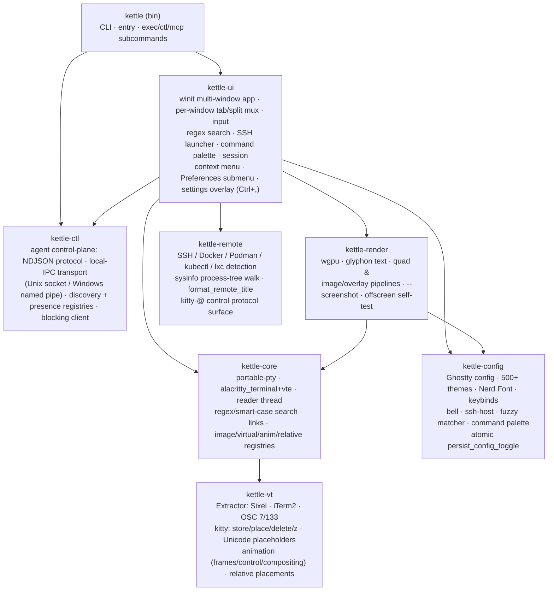
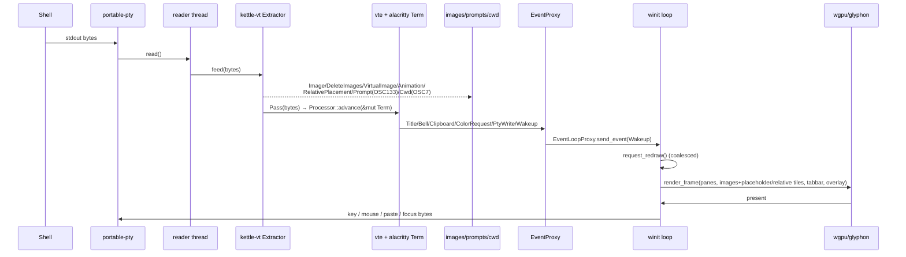
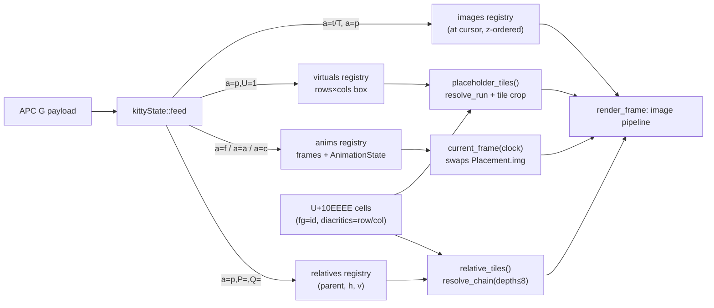
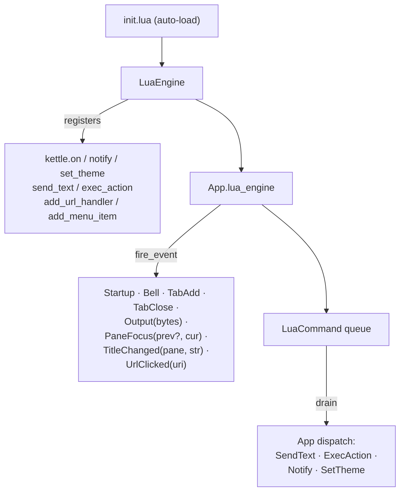
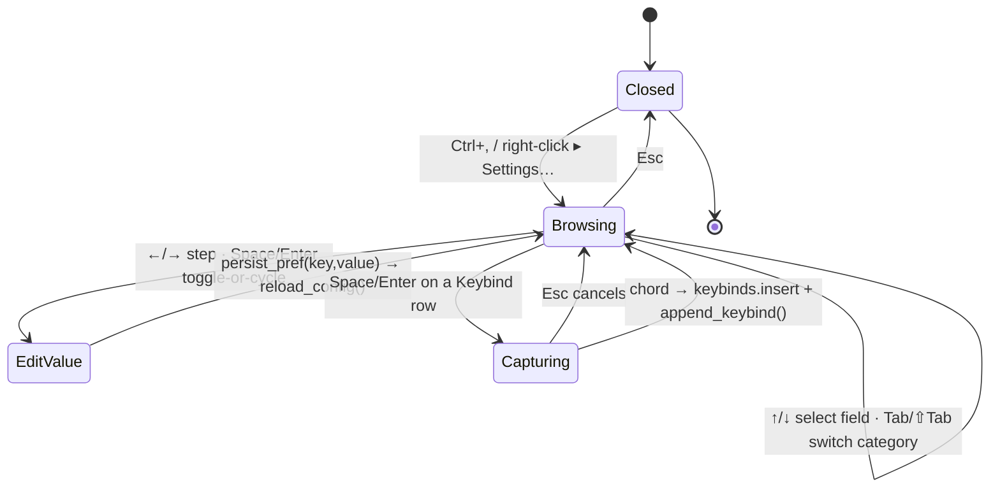
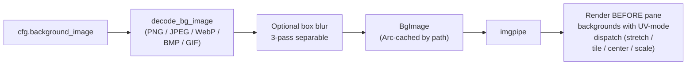
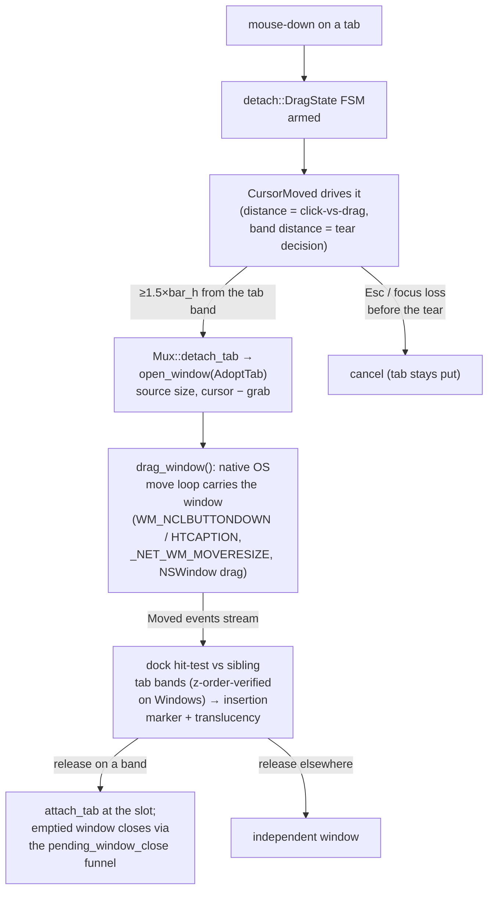

# kettle architecture

kettle is a Cargo workspace of focused crates. PTY bytes are split by an
**image-protocol extractor** before the VT engine sees them; the engine owns a
shared grid that the GPU renderer reads each frame; side-channels (prompts,
cwd, images, clipboard, title) flow back to the UI.

## Crates



## Agent control plane

The agent-first surface (see [AGENT.md](AGENT.md) for the full reference) is
the eighth workspace member, **kettle-ctl** — a UI-free crate that owns the
control-plane protocol (NDJSON request/response/event), the local-IPC transport
(a Unix domain socket or a Windows named pipe), the discovery registry, and a
blocking client. It is **off by default**: nothing binds a socket or writes a
registry entry unless the operator opts in (`agent-server = read-only|full`, or
`--agent-server <mode>`).

```mermaid
graph LR
    bin2["kettle (bin)"] --> exec["kettle exec<br/>headless one-shot<br/>(real PTY, no window)"]
    bin2 --> ctlcli["kettle ctl<br/>kettle-ctl client"]
    bin2 --> mcp["kettle mcp<br/>MCP bridge over stdio"]
    ctlcli --> ipc["local IPC<br/>(Unix socket /<br/>Windows named pipe)"]
    mcp --> ipc
    ipc --> srv["control SERVER<br/>(hosted in kettle-ui)"]
    srv -->|UserEvent::Ctl| app["App main thread<br/>(windows map)"]
    reg["discovery registry<br/>reserved kind field<br/>(\"gui\" today, \"muxd\" later)"] -.-> ipc
```

Two roles split cleanly across the bin and the GUI:

- The **GUI (kettle-ui)** hosts the control **server**. Requests arriving over
  the transport are dispatched on the App main thread via `UserEvent::Ctl`, so
  they observe and mutate the same per-window `Mux` trees the renderer reads —
  no separate lock on the pane tree.
- The **bin (kettle)** hosts the three opt-in entry points: `kettle exec` (a
  headless one-shot that runs a command under a real PTY and streams its output
  to stdout, no GUI), `kettle ctl` (the kettle-ctl client that drives a running
  kettle), and `kettle mcp` (the Model Context Protocol bridge that exposes both
  as native agent tools).

The surface is multi-window aware (v2.18.0): `get_state` reports
`{windows, focused_window}`; `list_tabs` / `list_panes` enumerate every
window and tag each entry with its `window`; `--pane N` resolves across
windows (pane ids are process-global); and a live tab tear-off emits a
`tab_moved` event (`{from_window, to_window, tab}`) on the subscription
feed.

The discovery registry reserves a `kind` field — `"gui"` today — as the
forward-compat seam for the optional `kettle-muxd` session daemon (see
[MUX-SERVER-DESIGN.md](MUX-SERVER-DESIGN.md)): when `kettle-muxd` lands it can
re-host the same server side as `kind = "muxd"` without breaking any client.

## In-process multi-window

Since v2.18.0 every kettle window lives in one process. `App` holds
`windows: BTreeMap<u64, WindowState>`
(`crates/kettle-ui/src/window_state.rs`) — every per-window field (the
winit window, its renderer, its `Mux` tab/split tree, input + overlay
state) lives in `WindowState`, while `App` keeps the process globals
(config, event-loop proxy, ctl server, Lua VM).

- **Take-out/put-back dispatch** — the `ApplicationHandler` entry points
  remove the addressed window from the map, run the inner handlers with
  disjoint `&mut App` + `&mut WindowState` borrows, then reinsert it.
  Window closes route through a single funnel (`pending_window_close` →
  `finish_window_dispatch`), which exits the event loop only when no
  windows remain.
- **One GPU context** — the wgpu `GpuContext { instance, adapter,
  device, queue }` is created with window 1 and shared; each subsequent
  window gets its own surface via `Renderer::new_with_gpu` (synchronous —
  no adapter request, no watchdog needed). The adapter is chosen by
  `resolve_adapter` (v2.23.0): a config-pinned GPU (`gpu-vendor-id` /
  `-device-id` / `-name`, set via Settings → Graphics) wins, matched among the
  *surface-capable* adapters by `(vendor,device,backend) → (vendor,device) →
  name`; otherwise the `gpu-power-preference` policy applies — now defaulting to
  `high` (the **discrete/dedicated** adapter), with a software fallback last.
  An absent pin (eGPU unplugged, driver swap) silently falls through to the
  policy, so a stale pin never fails startup. Because the device/surface graph
  can't hot-swap and every window shares the one adapter, GPU changes apply on
  the next launch (the settings panel shows a "restart to apply" hint).
- **PTY wakeups fan out** to all windows, gated per window by a per-pane
  output-generation counter — plain output emits no `TermEvent`, so the
  counter is the only reliable "this pane has new bytes" signal.
- **Pane ids are process-global** (the `NEXT_PANE_ID` atomic), so the
  agent control plane and the session file address panes unambiguously
  across windows.
- **Per-window accents (Peacock), on by default** — `accent-color =
  auto` (the default) gives each window a distinct theme-pool hue;
  cross-process dedupe goes through a presence registry in kettle-ctl
  (`crates/kettle-ctl/src/presence.rs`: one `<pid>-w<seq>.json` per
  window under `<runtime base>/kettle/instances`, a sibling of the ctl
  discovery dir; RAII guard, dead-pid pruning, best-effort).
  `accent-color = theme|off|none` opts out; a hex value pins one color.

## Per-pane data flow



## kitty graphics pipeline

The biggest VT extension. Decoding lives in `kettle-vt::kitty` (pure,
heavily unit-tested); per-terminal registries live on `kettle-core::Terminal`
and are populated by the reader thread; the renderer reads them each frame.



## Render pass order

The renderer's per-pane text buffers, per-row shaping keys, style keys, and
titlebar caches are indexed by the process-global pane id carried in
`PaneView`. Visible pane order can change when a split is rotated, a tab moves
between windows, or a pane is re-tiled; the renderer swaps cache slots to keep
already-shaped rows attached to the same terminal pane instead of the same
screen index.

Font loading is also staged on the live renderer path. The bundled Regular face
is loaded during `Renderer::new` so the first visible frame can measure and draw
normal terminal text. Bundled Bold, Italic, and Bold Italic are loaded once the
snapshot contains styled text, then text cache keys are invalidated so future
shaping sees the complete family. Headless screenshot paths still load the full
family because they render a single static image and do not benefit from a later
warm-up frame.

Each frame the renderer issues eight passes against the same wgpu
render-pass encoder, in this order. The order matters: a quad pass
paints over text drawn before it, and text drawn after a quad covers
that quad's pixels.

```mermaid
flowchart LR
    clear["Clear color<br/>(theme bg + opacity)"] --> bgimg["0. bg_imgs.draw<br/>background image<br/>(wallpaper, at the back)"]
    bgimg --> quads["1. quads.draw<br/>pane bg, tab bar,<br/>chrome quads + cursor block"]
    quads --> imgs["2. imgs.draw<br/>sixel · kitty · iTerm2<br/>inline image overlays"]
    imgs --> text["3. text_renderer.render<br/>pane text + tab text<br/>(NOT menu rows)"]
    text --> overlay["4. overlay_quads.draw<br/>pane dimming · scrollbar<br/>(NOT menu chrome)"]
    overlay --> menuq["5. menu_quads.draw<br/>shadow · panel bg ·<br/>border · row highlight"]
    menuq --> menut["6. menu_text_renderer.render<br/>context menu + settings overlay<br/>row labels"]
    menut --> curg["7. cursor_glyph_renderer.render<br/>focused block cursor's<br/>inverted glyph (on top)"]
```



Pass 0 (v2.23.0) is the **background image (wallpaper)** in its own pipeline,
drawn at the very back so the cell/chrome quads (pass 1) composite *opaquely on
top* of it — the standard kitty / WezTerm / Alacritty layering. The wallpaper
lives in `bg_imgs`, separate from the **inline** sixel/kitty/iTerm2 images in
`imgs` (pass 2, which sit over cell backgrounds). Before v2.23.0 the wallpaper
shared `imgs` and drew *after* the quads, which (a) hid every cell background
under an opaque wallpaper and (b) bled the animation through the tab bar /
status bar. The chrome strips now resolve an opaque fill via `chrome-background`
(theme / auto-from-wallpaper / black / white).

Steps 5–6 own the right-click context menu so its labels land **on
top of** the panel background. Splitting them out fixed the v1.3.0 /
v1.3.1 blank-menu bug — the menu's opaque panel quad used to live in
step 4 (`overlay_quads`), painting over the menu text that had
already been rendered in step 3.

Step 7 (v2.21.0) draws the inverted glyph **under a focused solid
block cursor** in its own 1-glyph renderer, on top of the block quad
(step 1). Decoupling it from the pane text buffer — rather than
recoloring the glyph in-place — means a cursor blink leaves the pane
buffer byte-identical, so the **damage gate** can skip the expensive
whole-viewport `text_renderer.prepare` (which re-encodes every visible
glyph's vertices) and its paired `atlas.trim`: `build_pane` reports
whether any row reshaped, and `prepare` runs only when a pane row
changed, a chrome label changed, or a text overlay is open. The 5–7
passes are cheap no-ops while idle (empty/unchanged buffers). The
`TextRenderer` instances share one `TextAtlas` and `Viewport` —
glyphon batches glyphs by atlas, not by renderer, so each pass reuses
already-cached glyphs (the cursor glyph is part of the visible pane
text, so its bitmap is already resident).

## Threading model

- **Main thread** — winit event loop, *all* GPU work, every window's
  tab/split tree (the `windows` map; dispatch is take-out/put-back, see
  above), input encoding, search/SSH overlays, session save/restore,
  cursor-blink and visual-bell timers (scheduled via
  `ControlFlow::WaitUntil` only while something animates, so an idle
  terminal does no work).
- **One reader thread per pane** — blocking `read()` on the PTY master →
  `Extractor::feed` → image/side-channel chunks recorded, text chunks driven
  into the `alacritty_terminal::Term` (behind a `Mutex` shared with the
  renderer) → wakes the UI. **Teardown invariant** (`Terminal::Drop`,
  `crates/kettle-core/src/term.rs`): it runs on the UI thread (a pane close drops the owned
  `Pane.term`), so it must **never `join()`** this reader. On Windows a
  ConPTY `read()` only unblocks once the pseudoconsole is *closed*, so
  joining the reader before dropping the master deadlocks the UI thread and
  the window goes "not responding". Drop instead sets a stop flag, kills the
  child, closes the writer (conin) and the master (conout / pseudoconsole)
  so the reader hits EOF, then **detaches** the thread — it owns only `Arc`
  clones (no borrow of `Terminal`) and exits on its own.
- Output floods are coalesced by `request_redraw` (≤1 frame/vsync). Per-pane
  registries (`images`, `virtuals`, `anims`, `relatives`, `prompts`, `cwd`)
  are `Arc<Mutex<…>>` snapshotted cheaply for rendering; a running kitty
  animation schedules a ~30 fps redraw tick (otherwise idle, no CPU). The
  extractor caps in-flight sequences (64 MiB) so a hostile stream can't hang
  or OOM — the cap is security-relevant: an SSH session into a 256 MiB
  container can otherwise OOM-kill kettle by emitting unbounded image data.
- **Lua VM** is parked on the App struct (single-threaded
  `LuaEngine`) — `mlua`'s `send` feature makes the handle `Send + Sync`
  but kettle never clones it across threads. Event hooks
  (`LuaEvent::Startup` / `TabAdd` / `TabClose` / `Bell` / `Output` /
  `PaneFocus` / `TitleChanged` / `UrlClicked`) fire
  synchronously on the App thread; Lua side-effects (`SendText`,
  `ExecAction`, `Notify`, `SetTheme`) queue onto
  `LuaEngine.pending: Arc<Mutex<Vec<LuaCommand>>>` and are drained
  back to the App's dispatcher each tick. A broken Lua plugin
  `log::warn`s and is skipped — it never aborts the terminal
  ("broken plugin can't take down kettle" contract).
- **Broadcast fan-out** (via the `BroadcastScope` enum) is App-side
  input dispatch, not a separate thread: on every keystroke the App
  walks `compute_broadcast_targets(scope, focus, in_tab, all)` and
  writes the encoded bytes to each target pane's PTY. The reader
  threads of the receiving panes pick up the echo through their
  normal byte-stream path.
- **Allocation hot-paths**: `App::drain_events`
  has 5 `.clone()`/`format!()` operations; `App::redraw` has 7.
  Each is load-bearing — `LuaEvent::Output(id, bytes)` copies the
  byte slice into a fresh `Vec<u8>` for the Lua callback (no
  shared ownership because mlua's `IntoLuaMulti` consumes the
  argument); `ContextMenuRow.label` clones the visible row text
  each frame the menu is open (~512 clones/frame in the worst
  case — Theme submenu drilled-in). The menu allocation is bounded
  by user interaction (only allocates while the menu is OPEN) so
  the steady-state allocator pressure is zero. A `Cow<'static, str>`
  refactor of `ContextMenuRow.label` is the natural next step if
  this ever shows up in a profile; today it's not measurable
  against winit's per-frame work.
- **Synchronization primitives audit**: ~13 `unsafe`
  blocks total, all FFI (libc `sendmsg/recvmsg/SCM_RIGHTS`, signal
  setup, `pre_exec` for fd-3 plumbing, `UnixStream::from_raw_fd`
  adoption). Each is ≤10 lines, narrowly scoped, with a doc comment
  citing the ownership contract. No `transmute`, no raw-pointer
  abstractions, no `Send`/`Sync` impls outside the foreign-fd
  protocols. Per-pane `Arc<Mutex<...>>` are contended only on PTY
  read or App snapshot; lock-hold times are O(bytes) — designed to
  stay well under one frame's budget per drain even on fast scrolling.

## Why the extractor sits *in front of* the VT engine

`alacritty_terminal` has no image/graphics support and ignores OSC 7/133. The
`Extractor` is a small state machine that pulls Sixel (DCS), kitty (APC `G`)
and iTerm2 (`OSC 1337`) image sequences, plus OSC 7 (cwd) and OSC 133 (shell
integration), out of the byte stream and forwards everything else
**byte-for-byte** (terminator preserved: BEL vs ST) so the engine still sees a
correct, untouched VT stream. This keeps us on a battle-tested engine while
adding modern features it lacks.

## Key design choices

| Concern | Choice | Why |
|---|---|---|
| VT engine | `alacritty_terminal` + `vte` | Battle-tested vs vttest/vim/tmux; avoids re-deriving the xterm long tail. |
| Images/OSC | in-house `Extractor` ahead of the engine | Adds Sixel/kitty/iTerm2 + OSC 7/133 without forking the engine. |
| Text | `glyphon` (cosmic-text) | Pure-Rust shaping + fallback + GPU atlas; ligatures + Nerd glyphs. |
| Window/GPU | `winit` + `wgpu` | One codebase for X11/Wayland/Win32/Cocoa; offscreen self-test in CI. |
| PTY | `portable-pty` | Uniform Unix + Windows ConPTY. |
| Config | Ghostty `key = value` | Ships the Ghostty theme set verbatim; familiar to users. |

Correctness is guarded by an extensive workspace test suite —
end-to-end VT-conformance driving this exact `vte`+`alacritty_terminal`
path, plus pure-unit coverage of the kitty decoder / placeholder /
animation / relative logic, the fuzzy matcher and command palette.
See [TESTING.md](TESTING.md) for the per-crate breakdown
(run `cargo test --workspace` for today's count — it grows ~1/cycle).
Comparative analysis behind these choices (with citations) is in
[RESEARCH.md](RESEARCH.md) and [UX-COMPARISON.md](UX-COMPARISON.md).

## Terminator-parity subsystems

Four major subsystems modeled after GNOME Terminator. Each has its own
design doc under `docs/TERMINATOR-*.md`; the architectural integration is
summarized here. Subsequent v1.32+ releases hardened the plugin contract,
extended drift guards, surfaced opt-in keys via `--check-config` echo
lines, scrubbed internal cycle refs from every user-facing doc surface
(including binary stdout), added an opt-in pre-commit hook
(`.githooks/pre-commit`) that catches clippy / fmt / test / shellcheck /
rustdoc regressions at commit time, and shipped the per-pane right-click
context menu polish (hover-to-highlight, disabled-row hiding, scrollable
submenus, mnemonics + typeahead, atomic config write-back via
`persist_config_toggle`, and the **Preferences ▸** submenu wiring 13
runtime toggles).

The most recent additions:

- **kettle-remote crate** (SSH / Docker / Podman / kubectl / lxc
  detection via sysinfo process-tree walk) — drives per-pane title
  prefixes and the right-click "Clone session" entry.
- **named-broadcast-groups subsystem** (`BroadcastScope` enum with
  per-tab / per-window / cross-tab named scopes).
- **right-click drill-in submenu UX** (Theme + Profile + Preferences).
- **vertical tab strips** and a **wgpu surface-readback screenshot path**.
- **in-app Settings overlay** (`Ctrl+,`) with a full **interactive keybind
  editor** — a keyboard-navigable preferences panel with live persist + reload
  (see the dedicated subsection below).

See [`docs/TERMINATOR-AUDIT.md`](TERMINATOR-AUDIT.md) for the full
Terminator parity inventory; see [CHANGELOG.md](../CHANGELOG.md) for the
per-cycle history.

### Plugin system (cycles 324, 365-378)



`lua-sandbox = safe` (default) nils unsafe stdlib APIs (os.execute,
io.open, etc); `trusted` mode opt-in. See
[`docs/TERMINATOR-PLUGIN-DESIGN.md`](TERMINATOR-PLUGIN-DESIGN.md).

### Settings overlay + interactive keybind editor (cycles 756, 766)

A keyboard-navigable, non-technical-friendly preferences panel — the overlay
evolution of the right-click **Preferences ▸** submenu. Opens via **Ctrl+,** or
right-click ▸ **Settings…**. `crates/kettle-ui/src/settings.rs` is the *pure*
catalogue (categories → fields, free functions over `&Config`, unit-tested
without a window); `app.rs` owns the live `SettingsNav` state + input routing +
persistence; `kettle-render` draws it through the **same menu pipeline**
(render-pass steps 5–6 above). Every value edit writes straight to the user's
config via the atomic `persist_pref` → `persist_config_toggle` path and
live-reloads, so changes take effect without hand-editing the file. The
**Keybinds** category is a full interactive rebinder: activating a row captures
the next chord and appends a `keybind = <chord>=<action>` line via
`kettle_config::append_keybind`.



Categories are **Appearance · Behavior · Keybinds**; field kinds are **Toggle ·
Choice · Number · Keybind**. Field values are always read fresh from `Config`,
so an external edit / live-reload is reflected immediately, and an unknown
catalogue key degrades to "—" rather than panicking (`settings::read`,
guarded by the `catalogue_keys_are_all_readable` drift test). See
[`docs/SETTINGS.md`](SETTINGS.md) for the per-field reference.

### Per-pane titlebar (cycles 379-407)

Renders ONLY when a tab has >1 pane (single-pane tab uses the OS
window title). Layout:

```
┌─────────────────────────────────────────────────┐  ← per-pane bar
│  [group] pane title   80x24   🔔                │     (top OR bottom
├─────────────────────────────────────────────────┤      per cfg)
│                                                 │
│              cell content                       │  ← cell-grid render
│              (shifted by bar height)            │
│                                                 │
└─────────────────────────────────────────────────┘
```

Three color variants based on broadcast state: transmit (focused
source), receive (group member), inactive (idle). Click on the bar
focuses the pane; click again opens `EditPaneTitle`. `EditPaneGroup`
action edits the broadcast-group label. See
[`docs/TERMINATOR-PANE-TITLEBAR-DESIGN.md`](TERMINATOR-PANE-TITLEBAR-DESIGN.md).

### Background image (cycles 380-396)



Decoded at config-load (one-shot), kept in a path-keyed cache, rendered
via the cell-image pipeline. UV-modes + align-horiz/vert configurable.
See [`docs/TERMINATOR-BG-IMAGE-DESIGN.md`](TERMINATOR-BG-IMAGE-DESIGN.md).

### Detachable tabs (Chromium-style live tear-off + re-dock)

Tab tear-off is a live, in-process move: the tab's panes — PTYs,
scrollback, running programs — transfer untouched into a new window in
the same process. Since v2.19.0 the tear is the Chromium model: it
happens **mid-drag at a distance threshold**, the torn window appears
instantly under the pointer, and the OS's native move loop carries it
from there.



Mechanics worth knowing (all verified against the vendored winit 0.30.13
source and live):

- **Tear threshold** is pure Euclidean distance from the tab *band*
  (`tear_threshold_crossed`), so the hysteresis is uniform in every
  direction and dragging along the strip still reorders.
- The torn window is positioned `cursor − grab` (grab = pointer offset
  into the dragged segment, frame-relative) and **re-anchored from the
  live `GetCursorPos` right before the handoff** — the pointer keeps
  sliding during the ~100ms window creation, and the Windows modal loop
  anchors at the *current* cursor.
- **Drop detection**: winit synthesizes a `WM_LBUTTONUP` to the torn
  window when the Windows modal loop exits (`WM_EXITSIZEMOVE`); on
  X11/macOS the first client pointer event after the WM's grab ends
  serves the same role (clients receive no pointer events during the
  move). A 30s `about_to_wait` failsafe abandons orphaned tracking.
- **Re-dock hit-testing** runs on the torn window's `Moved` stream
  (`WM_WINDOWPOSCHANGED` keeps firing inside the modal loop), preferring
  the live cursor over the frame+grab approximation on Windows. The
  dragged window goes translucent (`WS_EX_LAYERED` + `LWA_ALPHA`,
  verified compatible with the wgpu flip-model swapchain) so the target
  strip and its accent insertion marker stay readable beneath it; a
  hidden single-tab `auto` bar **materializes** while hovered so the
  drop target is visible.
- A **lone-tab** window's tab drags the whole window (`drag_window()`
  with dock tracking, no detach) — Chromium semantics, and the way a
  torn-off window merges back.
- **Wayland** can't position windows client-side and validates move
  serials, so it keeps the v2.18.0 tear-at-release path (the FSM's
  `DraggingOutside` + release). `xdg_toplevel_drag_v1` — the proper
  Wayland tab-drag protocol (KWin 6+/Mutter 48+) — is not exposed by
  winit 0.30; tracked as a follow-up.

The keyboard `move_tab_to_new_window` action (alias `detach_tab`)
performs the same live in-process move. The old cross-process handoff
*senders* (Unix SCM_RIGHTS socketpair + the JSON-file fallback) are
deleted — they respawned shells rather than moving live PTYs; the
`--tab-handoff` receive parsing stays for one release, deprecated. See
[`docs/TERMINATOR-DETACHABLE-TABS-DESIGN.md`](TERMINATOR-DETACHABLE-TABS-DESIGN.md)
for the historical multi-process design this replaced.

### Session restore

Per-pane working directory + tab/split tree are captured live as the
user works and atomically written to `session.json`. Since v2.18.0 the
session is **multi-window**: `Session` carries `windows: Vec<SWindow {
tabs, active, geometry }>` and restore reopens *every* window at its
(monitor-clamped) saved position. Replay on the next
launch is **opt-in**: by default a new window opens fresh (a single pane
in the default cwd, like every mainstream terminal), and the
session is *saved* only in restore mode so a fresh window never clobbers
a saved layout. Set `restore-session = true` (or pass `--restore` for a
one-shot) to "continue where you left off":

```mermaid
sequenceDiagram
    autonumber
    participant Shell as Shell (PTY)
    participant Core as kettle-core
    participant Mux as kettle-ui::Mux
    participant FS as session.json (atomic)
    participant App as App (next launch)

    Note over Shell,Mux: Per-keystroke / per-cd
    Shell->>Core: OSC 7 (file://host/path/cwd)
    Core->>Mux: Pane::cwd = path
    Mux->>Mux: mark_dirty()

    Note over Mux,FS: Debounced autosave
    Mux->>Mux: structural change (new tab / split / close)
    Mux->>FS: tempfile write
    FS->>FS: rename → session.json (atomic;<br/>notify-watcher ignores temp)

    Note over App,FS: Next launch — restore is opt-in
    App->>App: restore-session = true OR --restore?<br/>(else open a fresh single-pane window)
    App->>FS: read session.json
    FS-->>App: windows → tab trees + per-pane cwds
    App->>Mux: rehydrate each window's split layout<br/>(at its monitor-clamped saved geometry)
    Mux->>Core: spawn shell per pane<br/>(working_directory = saved cwd)
    Note over Core,App: Pane reappears in same<br/>tab/split/cwd as last exit
```

Four notable invariants preserved by this flow:

- **Atomic write** — `session.json` is written tempfile + rename, so a
  power-loss between writes leaves the previous valid snapshot intact
  (no truncated/partial JSON). This was added after a corrupted
  save on shutdown.
- **OSC 7 catchup** — kettle parses the shell's OSC 7 stream
  continuously, not just at startup; pane cwd updates the moment
  the user `cd`s.
- **No replay of failed spawns** — if a saved cwd is gone (deleted /
  unmounted), the pane spawns in `$HOME` and logs a warning instead
  of aborting the whole restore.
- **Two on-disk vintages** — `windows_normalized()` reads both the
  v2.18.0 `windows` array and the legacy single-window top-level
  fields, and save dual-writes window 1 into those legacy fields, so
  an older kettle can still read a new `session.json`. (v2.18.0 also
  repaired a latent gate bug: the `--layout` / `--restore` /
  `--tab-handoff` loads were dead because `resumed()` `mem::take`'d
  the whole CLI-options struct before the gates read it.)

See [`docs/ROADMAP.md`](ROADMAP.md) for the cycle-by-cycle ledger of
session-restore hardening (cycles 411-420).
