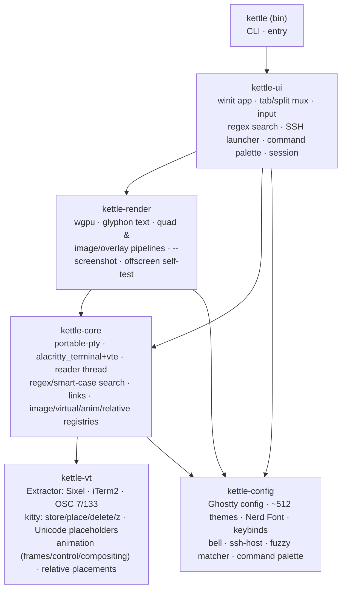
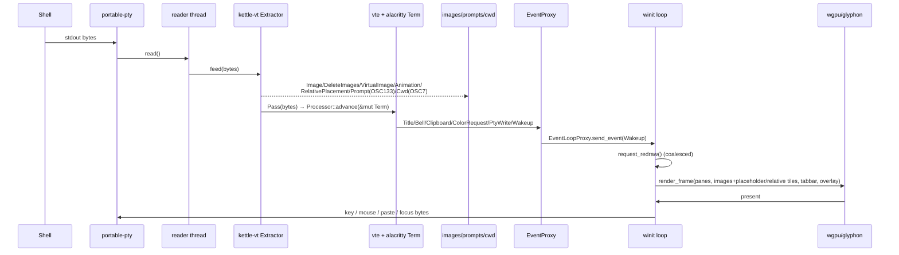
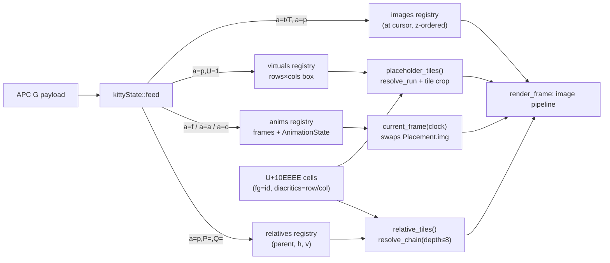

# kettle architecture

kettle is a Cargo workspace of focused crates. PTY bytes are split by an
**image-protocol extractor** before the VT engine sees them; the engine owns a
shared grid that the GPU renderer reads each frame; side-channels (prompts,
cwd, images, clipboard, title) flow back to the UI.

## Crates

## Per-pane data flow

## kitty graphics pipeline

The biggest VT extension. Decoding lives in `kettle-vt::kitty` (pure,
heavily unit-tested); per-terminal registries live on `kettle-core::Terminal`
and are populated by the reader thread; the renderer reads them each frame.

## Threading model

- **Main thread** — winit event loop, *all* GPU work, the tab/split tree,
  input encoding, search/SSH overlays, session save/restore, cursor-blink and
  visual-bell timers (scheduled via `ControlFlow::WaitUntil` only while
  something animates, so an idle terminal does no work).
- **One reader thread per pane** — blocking `read()` on the PTY master →
  `Extractor::feed` → image/side-channel chunks recorded, text chunks driven
  into the `alacritty_terminal::Term` (behind a `Mutex` shared with the
  renderer) → wakes the UI.
- Output floods are coalesced by `request_redraw` (≤1 frame/vsync). Per-pane
  registries (`images`, `virtuals`, `anims`, `relatives`, `prompts`, `cwd`)
  are `Arc<Mutex<…>>` snapshotted cheaply for rendering; a running kitty
  animation schedules a ~30 fps redraw tick (otherwise idle). The extractor
  caps in-flight sequences (64 MiB) so a hostile stream can't hang or OOM.

## Why the extractor sits *in front of* the VT engine

`alacritty_terminal` has no image/graphics support and ignores OSC 7/133. The
`Extractor` is a small state machine that pulls Sixel (DCS), kitty (APC `G`)
and iTerm2 (`OSC 1337`) image sequences, plus OSC 7 (cwd) and OSC 133 (shell
integration), out of the byte stream and forwards everything else
**byte-for-byte** (terminator preserved: BEL vs ST) so the engine still sees a
correct, untouched VT stream. This keeps us on a battle-tested engine while
adding modern features it lacks.

## Key design choices

| Concern | Choice | Why |
|---|---|---|
| VT engine | `alacritty_terminal` + `vte` | Battle-tested vs vttest/vim/tmux; avoids re-deriving the xterm long tail. |
| Images/OSC | in-house `Extractor` ahead of the engine | Adds Sixel/kitty/iTerm2 + OSC 7/133 without forking the engine. |
| Text | `glyphon` (cosmic-text) | Pure-Rust shaping + fallback + GPU atlas; ligatures + Nerd glyphs. |
| Window/GPU | `winit` + `wgpu` | One codebase for X11/Wayland/Win32/Cocoa; offscreen self-test in CI. |
| PTY | `portable-pty` | Uniform Unix + Windows ConPTY. |
| Config | Ghostty `key = value` | Ships the Ghostty theme set verbatim; familiar to users. |

Correctness is guarded by 117 workspace tests — end-to-end VT-conformance
driving this exact `vte`+`alacritty_terminal` path, plus pure-unit coverage
of the kitty decoder/placeholder/animation/relative logic, the fuzzy matcher
and command palette — see [TESTING.md](TESTING.md). Comparative analysis
behind these choices (with citations) is in [RESEARCH.md](RESEARCH.md) and
[UX-COMPARISON.md](UX-COMPARISON.md).
