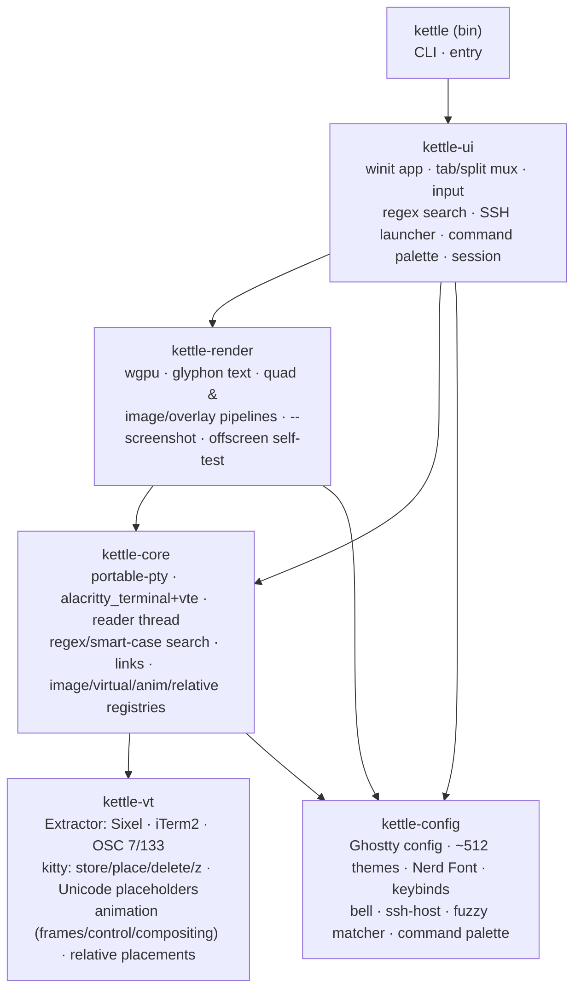
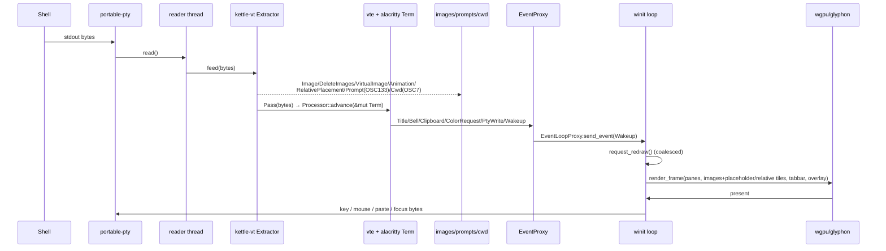
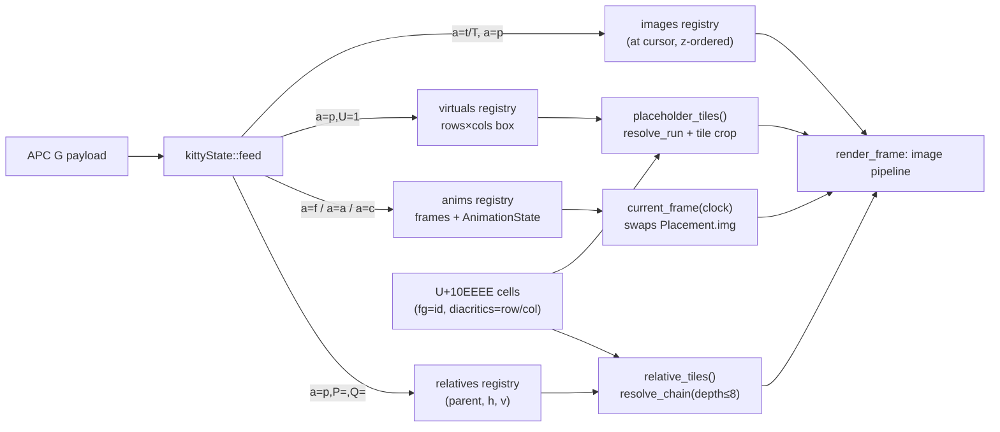
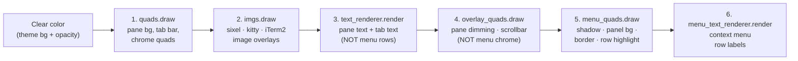
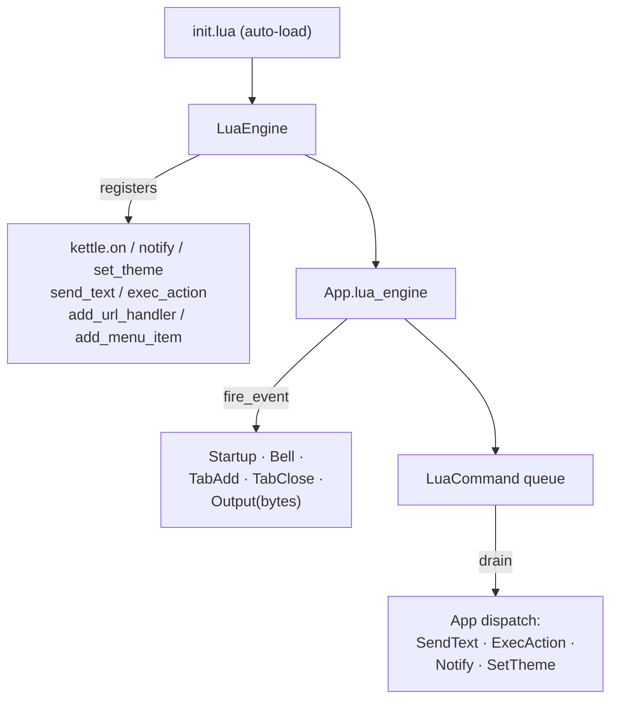
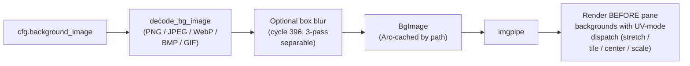
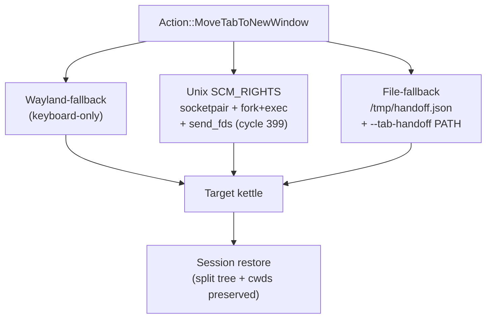

# kettle architecture

kettle is a Cargo workspace of focused crates. PTY bytes are split by an
**image-protocol extractor** before the VT engine sees them; the engine owns a
shared grid that the GPU renderer reads each frame; side-channels (prompts,
cwd, images, clipboard, title) flow back to the UI.

## Crates



## Per-pane data flow



## kitty graphics pipeline

The biggest VT extension. Decoding lives in `kettle-vt::kitty` (pure,
heavily unit-tested); per-terminal registries live on `kettle-core::Terminal`
and are populated by the reader thread; the renderer reads them each frame.



## Render pass order

Each frame the renderer issues six passes against the same wgpu
render-pass encoder, in this order. The order matters: a quad pass
paints over text drawn before it, and text drawn after a quad covers
that quad's pixels.



Steps 5–6 own the right-click context menu so its labels land **on
top of** the panel background. Splitting them out fixed the v1.3.0 /
v1.3.1 blank-menu bug — the menu's opaque panel quad used to live in
step 4 (`overlay_quads`), painting over the menu text that had
already been rendered in step 3.

The 5–6 passes are cheap no-ops while the menu is closed (empty
buffer uploads). The two `TextRenderer` instances share the same
`TextAtlas` and `Viewport` — glyphon batches glyphs by atlas, not by
renderer, so the menu pass reuses already-cached glyphs.

## Threading model

- **Main thread** — winit event loop, *all* GPU work, the tab/split tree,
  input encoding, search/SSH overlays, session save/restore, cursor-blink and
  visual-bell timers (scheduled via `ControlFlow::WaitUntil` only while
  something animates, so an idle terminal does no work).
- **One reader thread per pane** — blocking `read()` on the PTY master →
  `Extractor::feed` → image/side-channel chunks recorded, text chunks driven
  into the `alacritty_terminal::Term` (behind a `Mutex` shared with the
  renderer) → wakes the UI.
- Output floods are coalesced by `request_redraw` (≤1 frame/vsync). Per-pane
  registries (`images`, `virtuals`, `anims`, `relatives`, `prompts`, `cwd`)
  are `Arc<Mutex<…>>` snapshotted cheaply for rendering; a running kitty
  animation schedules a ~30 fps redraw tick (otherwise idle). The extractor
  caps in-flight sequences (64 MiB) so a hostile stream can't hang or OOM.

## Why the extractor sits *in front of* the VT engine

`alacritty_terminal` has no image/graphics support and ignores OSC 7/133. The
`Extractor` is a small state machine that pulls Sixel (DCS), kitty (APC `G`)
and iTerm2 (`OSC 1337`) image sequences, plus OSC 7 (cwd) and OSC 133 (shell
integration), out of the byte stream and forwards everything else
**byte-for-byte** (terminator preserved: BEL vs ST) so the engine still sees a
correct, untouched VT stream. This keeps us on a battle-tested engine while
adding modern features it lacks.

## Key design choices

| Concern | Choice | Why |
|---|---|---|
| VT engine | `alacritty_terminal` + `vte` | Battle-tested vs vttest/vim/tmux; avoids re-deriving the xterm long tail. |
| Images/OSC | in-house `Extractor` ahead of the engine | Adds Sixel/kitty/iTerm2 + OSC 7/133 without forking the engine. |
| Text | `glyphon` (cosmic-text) | Pure-Rust shaping + fallback + GPU atlas; ligatures + Nerd glyphs. |
| Window/GPU | `winit` + `wgpu` | One codebase for X11/Wayland/Win32/Cocoa; offscreen self-test in CI. |
| PTY | `portable-pty` | Uniform Unix + Windows ConPTY. |
| Config | Ghostty `key = value` | Ships the Ghostty theme set verbatim; familiar to users. |

Correctness is guarded by an extensive workspace test suite —
end-to-end VT-conformance driving this exact `vte`+`alacritty_terminal`
path, plus pure-unit coverage of the kitty decoder / placeholder /
animation / relative logic, the fuzzy matcher and command palette.
See [TESTING.md](TESTING.md) for the per-crate breakdown
(run `cargo test --workspace` for today's count — it grows ~1/cycle).
Comparative analysis behind these choices (with citations) is in
[RESEARCH.md](RESEARCH.md) and [UX-COMPARISON.md](UX-COMPARISON.md).

## Terminator-parity subsystems (cycles 330-410)

The v1.8.0 → v1.31.0 sweep added four major subsystems. Each has its
own design doc; the architectural integration is summarized here.
Cycles 411-497 (v1.32.0 → v1.40.0) hardened the plugin contract,
extended drift guards, surfaced opt-in keys via `--check-config`
echo lines, scrubbed internal cycle refs from every user-facing
doc surface, corrected 3 stale field doc-comments in
`crates/kettle-ui/src/app.rs` (pending_pane_restarts,
lua_engine 5-emission-site enumeration, fire-helper count), and
added an opt-in pre-commit hook that catches clippy / fmt / test
regressions at commit time (`.githooks/pre-commit`) — see
[`docs/TERMINATOR-AUDIT.md`](TERMINATOR-AUDIT.md)'s post-sweep section
for that polish run.

### Plugin system (cycles 324, 365-378)



`lua-sandbox = safe` (default) nils unsafe stdlib APIs (os.execute,
io.open, etc); `trusted` mode opt-in. See
[`docs/TERMINATOR-PLUGIN-DESIGN.md`](TERMINATOR-PLUGIN-DESIGN.md).

### Per-pane titlebar (cycles 379-407)

Renders ONLY when a tab has >1 pane (single-pane tab uses the OS
window title). Layout:

```
┌─────────────────────────────────────────────────┐  ← per-pane bar
│  [group] pane title   80x24   🔔                │     (top OR bottom
├─────────────────────────────────────────────────┤      per cfg)
│                                                 │
│              cell content                       │  ← cell-grid render
│              (shifted by bar height)            │
│                                                 │
└─────────────────────────────────────────────────┘
```

Three color variants based on broadcast state: transmit (focused
source), receive (group member), inactive (idle). Click on the bar
focuses the pane; click again opens `EditPaneTitle`. `EditPaneGroup`
action edits the broadcast-group label. See
[`docs/TERMINATOR-PANE-TITLEBAR-DESIGN.md`](TERMINATOR-PANE-TITLEBAR-DESIGN.md).

### Background image (cycles 380-396)



Decoded at config-load (one-shot), kept in a path-keyed cache, rendered
via the cell-image pipeline. UV-modes + align-horiz/vert configurable.
See [`docs/TERMINATOR-BG-IMAGE-DESIGN.md`](TERMINATOR-BG-IMAGE-DESIGN.md).

### Detachable tabs (cycles 397-410)

Three paths, all end-to-end:



In-process foundation: `Mux::serialize_tab` (cycle 397) +
`extract_tab`/`insert_tab` (cycle 398); IPC primitive:
`fd_transport::send_fds`/`recv_fds` (cycle 399); drag FSM:
`detach::DragState` (cycle 400). See
[`docs/TERMINATOR-DETACHABLE-TABS-DESIGN.md`](TERMINATOR-DETACHABLE-TABS-DESIGN.md).
