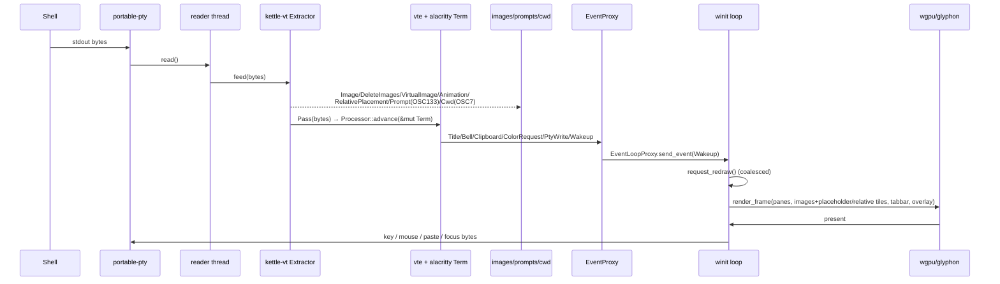
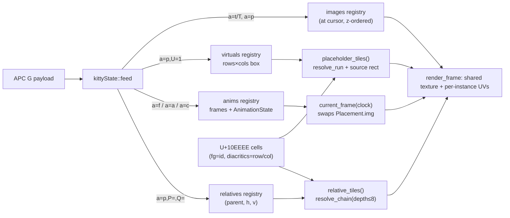
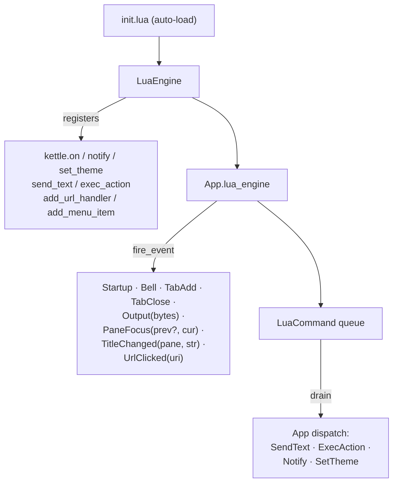
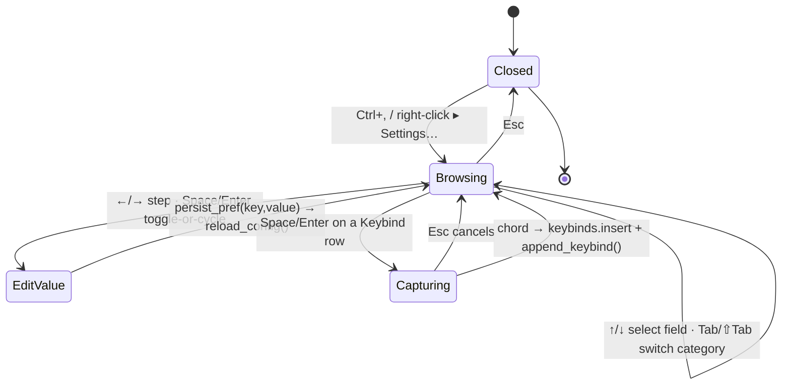
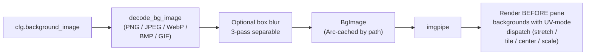
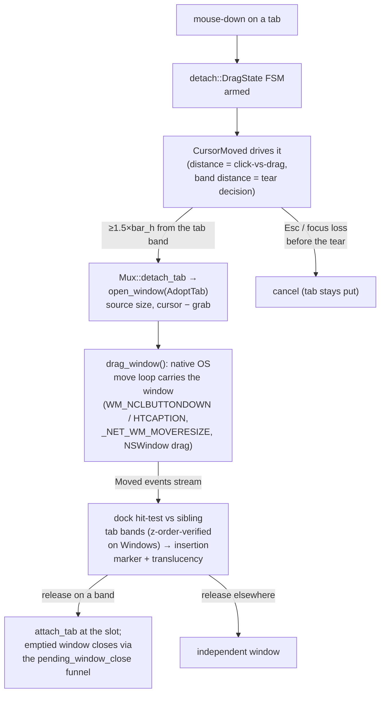
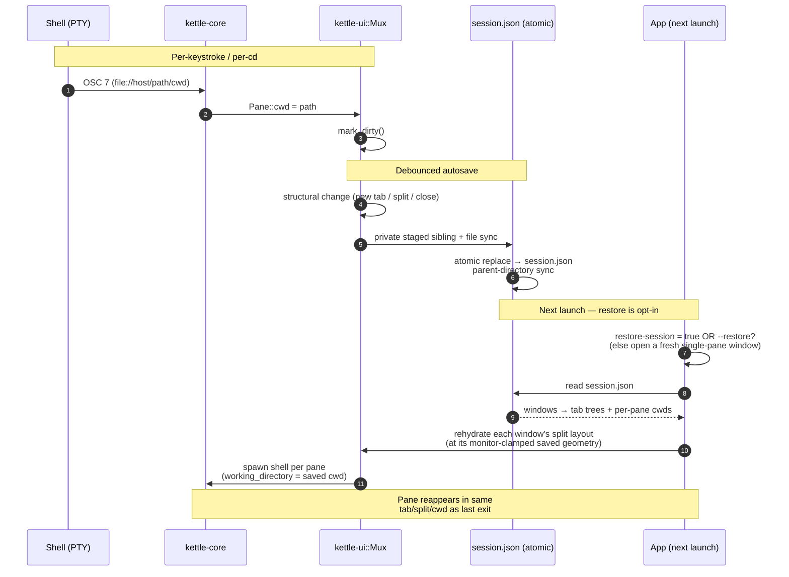

# kettle architecture

kettle is a Cargo workspace of focused crates. PTY bytes are split by an
**image-protocol extractor** before the VT engine sees them; the engine owns a
shared grid that the GPU renderer reads each frame; side-channels (prompts,
cwd, images, clipboard, title) flow back to the UI.

## Crates

```mermaid
graph TD
    bin["kettle (bin)<br/>CLI · entry · exec/ctl/mcp subcommands"] --> ui
    bin --> ctl
    bin --> update
    ui["kettle-ui<br/>winit multi-window app · per-window tab/split mux · input<br/>regex search · SSH launcher · command palette · session<br/>context menu · Preferences submenu · settings overlay (Ctrl+,)"] --> render
    ui --> core
    ui --> cfg
    ui --> remote
    ui --> ctl
    ui --> state
    ui --> update
    ctl["kettle-ctl<br/>agent control-plane: NDJSON protocol · local-IPC transport<br/>(Unix socket / Windows named pipe) · discovery + presence registries · blocking client"]
    render["kettle-render<br/>wgpu · glyphon text · quad &<br/>image/overlay pipelines · --screenshot · offscreen self-test"] --> core
    render --> cfg
    core["kettle-core<br/>portable-pty · alacritty_terminal+vte · reader thread<br/>regex/smart-case search · links · image/virtual/anim/relative registries"] --> vt
    cfg["kettle-config<br/>Ghostty config · 500+ themes · Nerd Font · keybinds<br/>bell · ssh-host · fuzzy matcher · command palette<br/>atomic persist_config_toggle"] --> state
    vt["kettle-vt<br/>Extractor: Sixel · iTerm2 · OSC 7/133<br/>kitty: store/place/delete/z · Unicode placeholders<br/>animation (frames/control/compositing) · relative placements"]
    remote["kettle-remote<br/>SSH / Docker / Podman / kubectl / lxc detection<br/>sysinfo process-tree walk · format_remote_title<br/>kitty-@ control protocol surface"]
    update["kettle-update<br/>signed feed verification · bounded archive extraction<br/>transactional managed-install updates"] --> state
    state["kettle-state<br/>durable atomic replacement · private state files<br/>cross-platform advisory file locks"]
```



`kettle-state` is the leaf persistence boundary shared by configuration,
sessions, and the updater. It stages with `create_new` beside the destination,
syncs file data before replacement, uses write-through replacement on Windows,
syncs the parent directory on Unix, preserves existing permissions when asked,
and rejects symlink destinations by default. Its advisory lock lets callers
serialize compound operations; configuration persistence holds it across the
complete read, validate, backup, and replacement transaction.

## Agent control plane

The agent-first control surface (see [AGENT.md](AGENT.md) for the full
reference) is owned by **kettle-ctl**, a UI-free crate that defines the
control-plane protocol (NDJSON request/response/event), the local-IPC transport
(a Unix domain socket or a Windows named pipe), the discovery registry, and a
blocking client. It is **off by default**: nothing binds a socket or writes a
registry entry unless the operator opts in (`agent-server = read-only|full`, or
`--agent-server <mode>`).

```mermaid
graph LR
    bin2["kettle (bin)"] --> exec["kettle exec<br/>headless one-shot<br/>(real PTY, no window)"]
    bin2 --> ctlcli["kettle ctl<br/>kettle-ctl client"]
    bin2 --> mcp["kettle mcp<br/>MCP bridge over stdio"]
    ctlcli --> ipc["local IPC<br/>(Unix socket /<br/>Windows named pipe)"]
    mcp --> ipc
    ipc --> srv["control SERVER<br/>(hosted in kettle-ui)"]
    srv -->|UserEvent::Ctl| app["App main thread<br/>(windows map)"]
    reg["discovery registry<br/>reserved kind field<br/>(\"gui\" today, \"muxd\" later)"] -.-> ipc
```

Two roles split cleanly across the bin and the GUI:

- The **GUI (kettle-ui)** hosts the control **server**. Requests arriving over
  the transport are dispatched on the App main thread via `UserEvent::Ctl`, so
  they observe and mutate the same per-window `Mux` trees the renderer reads —
  no separate lock on the pane tree.
- The **bin (kettle)** hosts the three opt-in entry points: `kettle exec` (a
  headless one-shot that runs a command under a real PTY and streams its output
  to stdout, no GUI), `kettle ctl` (the kettle-ctl client that drives a running
  kettle), and `kettle mcp` (the Model Context Protocol bridge that exposes both
  as native agent tools).

The surface is multi-window aware (v2.18.0): `get_state` reports
`{windows, focused_window}`; `list_tabs` / `list_panes` enumerate every
window and tag each entry with its `window`; `--pane N` resolves across
windows (pane ids are process-global); and a live tab tear-off emits a
`tab_moved` event (`{from_window, to_window, tab}`) on the subscription
feed.

Protocol v1 uses a typed method table as the authorization source of truth:
each method declares read/mutate capability and UI/connection execution. The
wire remains additive JSON, with exact `v: 1`, 1 MiB request and 768 KiB
response/event bounds, and snapshot paging for large live reads. Discovery
records are atomically replaced and private; accepted Unix connections also
verify peer uid. The MCP bridge negotiates `2025-11-25` or `2025-06-18` and
dispatches tool calls through a four-worker, 16-request bounded queue with
JSON-RPC cancellation tracking. The blocking control client reads frames
incrementally under method-aware deadlines, preserves events interleaved before
a response, and treats malformed frames or mismatched response ids as terminal
protocol errors.

The discovery registry reserves a `kind` field — `"gui"` today — as the
forward-compat seam for the optional `kettle-muxd` session daemon (see
[MUX-SERVER-DESIGN.md](MUX-SERVER-DESIGN.md)): when `kettle-muxd` lands it can
re-host the same server side as `kind = "muxd"` without breaking any client.

App-owned modal input stays distinct from pane input. `send_keys` encodes keys
through the active terminal modes and writes them to the PTY;
`dispatch_ui_key` accepts a bounded, pre-parsed batch only while a supported
Kettle modal is open and never enters the PTY path. `ui_geometry` exposes the
search bar's rectangles, focused control, modes, status, target pane, and
truncation flag; its Search object deliberately omits the query and matched
terminal text.

## In-process multi-window

Since v2.18.0 every kettle window lives in one process. `App` holds
`windows: BTreeMap<u64, WindowState>`
(`crates/kettle-ui/src/window_state.rs`) — every per-window field (the
winit window, its renderer, its `Mux` tab/split tree, input + overlay
state) lives in `WindowState`, while `App` keeps the process globals
(config, event-loop proxy, ctl server, Lua VM).

A no-argument GUI launch first uses the private activation endpoint under the
per-user runtime/state directory. One advisory lock elects a primary; the
endpoint accepts only a versioned `open_window` request capped at 8 KiB and
verifies same-user peers. A capacity-32 handoff reaches the winit thread, and
the secondary exits only after that thread confirms OS-window creation. A busy,
incompatible, timed-out, or failed request falls back to a separate process so
a launcher click is never discarded. Any explicit argument bypasses activation;
`--new-process` provides a discoverable isolation escape hatch for an otherwise
default launch. Dev-record builds also compare a bounded path fingerprint and
raw-input policy before joining, preventing recording-policy drift without
putting a user path on the wire.

- **Take-out/put-back dispatch** — the `ApplicationHandler` entry points
  remove the addressed window from the map, run the inner handlers with
  disjoint `&mut App` + `&mut WindowState` borrows, then reinsert it.
  Window closes route through a single funnel (`pending_window_close` →
  `finish_window_dispatch`), which exits the event loop only when no
  windows remain.
- **One GPU context** — the wgpu `GpuContext { instance, adapter,
  device, queue }` is created with window 1 and shared; each subsequent
  window gets its own surface via `Renderer::new_with_gpu` (synchronous —
  no adapter request, no watchdog needed). The adapter is chosen by
  `resolve_adapter` (v2.23.0): a config-pinned GPU (`gpu-vendor-id` /
  `-device-id` / `-name`, set via Settings → Graphics) wins, matched among the
  *surface-capable* adapters by `(vendor,device,backend) → (vendor,device) →
  name`; otherwise the `gpu-power-preference` policy applies — defaulting to
  `auto` so wgpu / the platform chooses, with a software fallback last.
  An absent pin (eGPU unplugged, driver swap) silently falls through to the
  policy, so a stale pin never fails startup. Because the device/surface graph
  can't hot-swap and every window shares the one adapter, GPU changes apply on
  the next launch (the settings panel shows a "restart to apply" hint).
  A fatal wgpu error latches one bounded in-memory `GpuFault`; the event loop
  then rebuilds every renderer on a pure settle/backoff state machine
  (configured adapter → other hardware → software) without dropping PTYs.
  Driver callbacks never perform filesystem I/O. The event-loop thread writes
  capped, rotated, terminal-content-free JSONL incident records under the
  per-user cache. Surface acquisition treats both `Success` and `Suboptimal`
  outcomes as renderable; a suboptimal frame is submitted and presented before
  the surface is reconfigured for the next acquisition. Rendering is a UI
  transaction: `Renderer::render_frame*` returns `Presented`, `RetryLater`,
  `Occluded`, or `SurfaceLost`, and the normal `kettle-ui` render path commits
  output-generation counters, the paint timestamp, and flood-pacing state only
  for `Presented`. Candidate output-generation maps are recycled and swapped on
  commit, so this correctness boundary adds no steady-state per-frame
  allocation. Visible startup windows are a lifecycle exception: they are
  revealed immediately after renderer initialization, before the first redraw.
  Genuine device loss is the other deliberate exception: the redraw guard
  snapshots output generations without presentation so a streaming PTY cannot
  spin while all renderers are being recovered; recovery then forces redraws.
  Timeout and `Outdated` retain damage and enter a capped, deadline-driven
  per-window retry. Hidden, minimized, or compositor-occluded windows leave that
  repair armed without a wake deadline. wgpu 30 `Lost` recreates the affected
  surface/renderer through `Instance::create_surface` while keeping the healthy
  shared device; only the device-lost callback, out-of-memory, or internal GPU
  errors enter process-wide adapter/device recovery. Other render errors rebuild
  the affected renderer's retained resources on their own capped backoff.
- **Presentation and readback respect the window-system boundary** — every live
  frame calls winit's `pre_present_notify` after queue submission and
  immediately before `present`, which is required for correct compositor frame
  tracking. A live screenshot copies the surface in that same submission, then
  hands the staging buffer to one bounded worker for a finite GPU wait, mapping,
  conversion, crop, and PNG write. The event-loop thread never waits for a GPU
  readback, and a second capture receives an explicit busy result.
- **Runtime diagnostics are phase-only** — a watchdog observes fixed event-loop
  phase names (`resumed`, `gpu_init`, `window_event`, `redraw`, `user_event`,
  `about_to_wait`) and writes one private, rotated record after a bounded stall.
  An event-loop backend error writes the same record shape on exit. Records
  include only version, pid, display backend, phase, elapsed time, window count,
  and a sanitized bounded error; terminal bytes, commands, environment values,
  and paths never cross this boundary. The logging subscriber bridges both
  `log` and `tracing`, preserving winit's Wayland protocol error in stderr and
  the journal.
- **PTY wakeups fan out** to all windows, gated per window by a per-pane
  output-generation counter — plain output emits no `TermEvent`, so the
  counter is the only reliable "this pane has new bytes" signal.
- **Filesystem notifications are hints, not commands** — the config and legacy
  remote-command watchers observe a containing directory so atomic replacement
  remains portable, then require the exact target path and a create, modify, or
  remove event. Non-mutating access events are rejected: on Linux, reading a
  watched file can itself emit `Access(Open)`, so treating access as a change
  creates a reload feedback loop. Each watcher also has a one-in-flight atomic
  latch. Config changes settle for 75 ms through winit's `WaitUntil` control
  flow, with no event-thread sleep, then load and compile process-wide state
  once before applying renderer changes to every window. The latch re-arms
  immediately before the read so a racing genuine edit is not lost. Remote
  commands re-arm immediately before their bounded file drain; accumulated
  lines make notification coalescing lossless.
- **Pane ids are process-global** (the `NEXT_PANE_ID` atomic), so the
  agent control plane and the session file address panes unambiguously
  across windows.
- **Per-window accents (Peacock), on by default** — `accent-color =
  auto` (the default) gives each window a distinct theme-pool hue;
  cross-process dedupe goes through a presence registry in kettle-ctl
  (`crates/kettle-ctl/src/presence.rs`: one `<pid>-w<seq>.json` per
  window under `<runtime base>/kettle/instances`, a sibling of the ctl
  discovery dir; RAII guard, dead-pid pruning, best-effort). The directory and
  leaves are current-user private on Unix; reads are no-follow and capped at
  4 KiB, and version, filename identity, PID, and `#rrggbb` fields are validated
  before a claim participates in color selection.
  `accent-color = theme|off|none` opts out; a hex value pins one color.

## Search architecture

Search crosses core, UI, and renderer boundaries without materializing the
whole scrollback buffer:

- **`kettle-core` owns matching.** `CompiledSearch` validates strict Rust
  regex syntax and the 4096-byte UTF-8 input cap, then runs
  `regex-automata`'s meta engine over a bounded terminal-grid adapter. The meta
  engine retains Rust leftmost-first behavior and Unicode assertions such as
  word boundaries. Compilation admits at most 512 KiB of Thompson NFA, 256 KiB
  of one-pass state, a 256 KiB hybrid cache, and 40 KiB of DFA state. It uses
  `WhichCaptures::Implicit`, so only the implicit whole-match capture is built;
  subgroup captures are unnecessary because the UI consumes grid spans, not
  capture values. A syntactically valid expression that exceeds an engine
  ceiling is **Pattern too complex**, distinct from Invalid pattern. Public
  `SearchPoint`/`SearchSpan` coordinates use signed lines so historical rows
  (negative in the engine's coordinate system) are not discarded. Bounds,
  direction, wrap outcome, layout snapshots, scan tokens, and truncation are
  explicit values rather than sentinel integers. Materialization maps soft
  wraps, wide cells, combining marks, variation selectors, and ZWJ sequences
  back to grid spans. Regex matches that consume no bytes are suppressed in
  the engine's single leftmost-first pass; consequently, a nullable alternative
  that wins with an empty match can shadow a later consuming alternative at
  the same position.
- **`kettle-ui` owns interaction and scheduling.** Each `WindowState` has one
  search state and an in-memory per-pane query map; moving between panes does
  not leak a query into another pane, and no search state is process-global.
  The Unicode editor moves, selects, and deletes by grapheme boundary. A scan
  token combines pane output generation, query revision, and terminal layout.
  Query changes and reflow restart work from a fresh viewport anchor. Plain PTY
  output preserves and advances an existing chunk cursor so a continuously
  writing process cannot starve deep-history search. Because rows can drift,
  only a non-navigation scan schedules fresh verification after 500 ms quiet.
  If output interrupts an explicit Previous/Next operation, its ordering cannot
  be reconstructed by the default-direction retry; it remains Results limited
  until the user explicitly retries navigation.
- **Work is hybrid and bounded.** Typing searches at most 1000 physical lines
  around the viewport immediately. When that finds nothing, a 500 ms idle
  deadline advances through nominal 1000-line history ranges, with at most one
  bounded core work slice per event-loop turn; explicit Next/Previous starts
  the same resumable traversal immediately. Nearby highlights cover the visible
  viewport plus 100 physical lines on each side.
  One synchronous regex invocation receives at most 64 KiB of UTF-8. One
  bounded core call has the same 64 KiB aggregate text ceiling plus limits of
  262,144 inspected terminal cells and 256 complete logical-line haystacks.
  Reaching an aggregate work ceiling returns an exact continuation at the first
  unscanned hard logical line; it never splits a complete logical line, never
  sets Results limited, and the UI resumes it on a later event-loop turn. The
  nearby phase, background traversal, and visible projection each run at most
  one such core work slice per turn; visible projection yields to foreground
  navigation and resumes on the next turn.

  A single soft-wrapped logical haystack is separately capped at 256 physical
  rows, 64 KiB of UTF-8, and 262,144 inspected cells (including spacer/context
  inspection). Reaching one of those capacities inside the logical line is an
  accuracy barrier: exact matches wholly before it may still be painted, but
  traversal stops immediately, returns no continuation past uninspected cells,
  and reports **Results limited** instead of a definitive first, last, wrap, or
  miss. One projection retains at most 65,536 spans. Retained search memory is
  therefore independent of total history size.
- **`kettle-render` owns layout and drawing.** One responsive bottom lane uses
  one row on wide windows and as many additional rows as needed on narrow
  windows, so every control remains present without painting over pane cells,
  the status bar, or update banner. Highlight
  projection consumes sorted signed spans in a single pass with the visible
  cells (`O(cells + spans)`). The active result uses the theme search colors;
  nearby results use the normal selection treatment. The bar intentionally
  renders statuses such as Searching, Match, Wrapped, Start, End, No match,
  Invalid pattern, Pattern too complex, Query too long, and Results limited
  rather than an eagerly computed global count.

Opening captures a viewport-relative anchor. Closing preserves the selected
match at the same screen row (or restores the pre-open offset when there was no
selection), which prevents the bar's reserved rows from making content jump.
Wrap, case mode (Smart/Match/Ignore), and invert are persisted through the same
config transaction as Settings. All editor and navigation input is handled
before pane encoding, so it is not forwarded to tmux, AstroNvim, Codex CLI,
Claude Code CLI, or other programs in the PTY. Native keyboard, IME,
accessibility, and renderer behavior still requires platform-specific evidence.

## Per-pane data flow



The blocking PTY `read()` runs on a small pump thread so the parser can still
wake at a DEC 2026 synchronized-update deadline while no bytes arrive. Its
handoff is a four-slot synchronous channel with recycled 64 KiB buffers: output
flood applies bounded backpressure instead of growing an unbounded queue. The
reader force-ends an omitted synchronized update at the parser deadline before
returning any simultaneously ready chunk, so a sustained output queue cannot
starve the flush. EOF/disconnect flushes immediately because no terminator can
still arrive. The reader then bumps the output generation and wakes the UI for
the now-visible frame after releasing the terminal lock.

The optional raw-output tap has an explicit delivery policy. Lua output hooks
use a bounded best-effort sender and may drop under plugin backpressure;
recording and `kettle exec` use lossless delivery. `kettle exec` pairs that
policy with a four-slot queue, so a slow stdout pipe blocks the PTY reader before
it takes the terminal lock and bounds memory without creating a lock cycle.
GUI development recording subscribes to the same fan-out used by normal redraw
and close drains, so consuming output for a recorder cannot steal it from Lua or
skip a pane's final bytes. The shared asciicast writer stops at a complete event
boundary before 512 MiB. Managed directories use private unique files, active
file locks, and namespace-scoped 50-file / 5-GiB retention; explicit paths are
locked before truncation.

## kitty graphics pipeline

The biggest VT extension. Decoding lives in `kettle-vt::kitty` (pure,
heavily unit-tested); per-terminal registries live on `kettle-core::Terminal`
and are populated by the reader thread; the renderer reads them each frame.

`kettle-vt::GraphicsLimits` is the single allocation envelope for this path.
Escape sequences are capped at 16 MiB; kitty transmissions at 96 MiB with at
most eight/128 MiB in flight; decoded images and individual textures at 64 MiB;
animation payloads at 128 frames/128 MiB; and placements at 256. RAII leases
charge Kettle-owned decoded buffers, image textures, custom glyph atlases, and
instance buffers to a 256 MiB terminal/window scope and 512 MiB process
accounts. Decoders reserve before allocation, image clones share one lease,
copy-on-write reserves a second image, and GPU caches release non-visible
textures before admitting replacements. An oversized, unterminated control
string is quarantined for at most one additional 64 KiB recovery window before
the extractor returns to ground state. The 256-placement limit applies to
inline terminal images; the independent wallpaper pipeline permits up to 4096
tile instances and batches consecutive tiles that share a texture.



## Render pass order

The renderer's per-pane text buffers, per-row shaping keys, style keys, and
titlebar caches are indexed by the process-global pane id carried in
`PaneView`. Visible pane order can change when a split is rotated, a tab moves
between windows, or a pane is re-tiled; the renderer swaps cache slots to keep
already-shaped rows attached to the same terminal pane instead of the same
screen index.

Font loading is also staged on the live renderer path. The bundled Regular face
is loaded during `Renderer::new` so the first visible frame can measure and draw
normal terminal text. Bundled Bold, Italic, and Bold Italic are loaded once the
snapshot contains styled text, then text cache keys are invalidated so future
shaping sees the complete family. Headless screenshot paths still load the full
family because they render a single static image and do not benefit from a later
warm-up frame.

Each frame the renderer issues nine passes (grid mode; eight in legacy) against
the same wgpu render-pass encoder, in this order. The order matters: a quad pass
paints over text drawn before it, and text drawn after a quad covers
that quad's pixels.

```mermaid
flowchart LR
    clear["Clear color<br/>(theme bg + opacity)"] --> bgimg["0. bg_imgs.draw<br/>background image<br/>(wallpaper, at the back)"]
    bgimg --> quads["1. quads.draw<br/>pane bg, tab bar,<br/>chrome quads + cursor block"]
    quads --> imgs["2. imgs.draw<br/>sixel · kitty · iTerm2<br/>inline image overlays"]
    imgs --> glyph["3. glyph_pipeline.draw<br/>pane text, CELL-LOCKED<br/>(grid mode; v2.25.0)"]
    glyph --> text["4. text_renderer.render<br/>tab / titlebar text<br/>(+ pane text in legacy)"]
    text --> overlay["5. overlay_quads.draw<br/>pane dimming · scrollbar<br/>(NOT menu chrome)"]
    overlay --> menuq["6. menu_quads.draw<br/>shadow · panel bg ·<br/>border · row highlight"]
    menuq --> menut["7. menu_text_renderer.render<br/>context menu + settings overlay<br/>row labels"]
    menut --> curg["8. cursor_glyph_renderer.render<br/>focused block cursor's<br/>inverted glyph (on top)"]
```



**Pass 3 (v2.25.0) — cell-locked pane text.** In the default `text-renderer =
grid` mode pane cell text is drawn by `glyph_pipeline`
(`crates/kettle-render/src/glyphpipe.rs`), an instanced glyph renderer that pins
every glyph to its grid cell (`pane_origin + col × cell_w`) — the
Alacritty / kitty / WezTerm / Ghostty model. `build_pane` still shapes each row
with cosmic-text (the per-line shaping cache is unchanged), but instead of handing
the whole `Buffer` to glyphon, `emit_pane_glyphs` walks the laid-out glyphs and
emits one pinned instance each, rasterized through cosmic-text's own `SwashCache`
into a private mask+color atlas. The fragment shader replicates glyphon's exactly
(mask = `sRGB→linear(fg) · coverage`, color = straight sample of an sRGB atlas), so
antialiasing, gamma and theme colors are identical — only the X position is
substituted. This fixes glyph drift: previously a glyph whose advance differed from
the cell width (fallback-font CJK / color emoji / some symbols, ligature clusters,
a mismatched-width bold/italic face) shifted every following glyph off the
`col × cell_w` grid that the selection highlight, cursor and mouse hit-testing all
use. Emission runs on the same `need_prepare` damage gate as the glyphon prepares
it replaces: a steady frame re-draws the retained instance buffer for free, and a
frame that re-prepares for any reason (a pane row changed, a chrome label changed,
or a cursor blink to a new glyph) re-emits the pane instances — the same cadence
the old glyphon pane prepare ran at, so it is at parity, not a regression.
`text-renderer = legacy` keeps the old continuous-glyphon pane path (pass 4) as a
rollback escape hatch; pass 3 is then an empty no-op. Since v2.25.1 the grid pass
has its own damage gate: pane text/style/geometry changes refresh glyph
instances, while cursor blink updates only cursor quads and the cursor-glyph
pass. A blink must never invalidate or stale-draw ordinary pane glyphs.

Pass 0 (v2.23.0) is the **background (wallpaper)** in its own pipeline, drawn at
the very back so the cell/chrome quads (pass 1) composite *opaquely on top* of it
— the standard kitty / WezTerm / Alacritty layering. The wallpaper lives in
`bg_imgs` (a decoded image texture), separate from the **inline** sixel/kitty/
iTerm2 images in `imgs` (pass 2, which sit over cell backgrounds). Before v2.23.0
the wallpaper shared `imgs` and drew *after* the quads, which (a) hid every cell
background under an opaque wallpaper and (b) bled the animation through the tab
bar / status bar. The chrome strips now resolve an opaque fill via
`chrome-background` (theme / auto-from-wallpaper / black / white).

**v2.24.0 — procedural starfield.** When `background-type = starfield`, pass 0
instead draws `starfield` (`crates/kettle-render/src/starfield.rs`): a fullscreen
triangle whose WGSL fragment shader *generates* a slow forward-flight star field
per-pixel from a tiny uniform `{resolution, time}`. It's a **fixed built-in
example** (v2.24.1) — the look (speed `0.009`, `NSTARS = 55`, glow, and the
fade-in: center stars fully invisible, cubic `prog³` proximity ramp) is baked
into the shader as WGSL constants, not config-driven. No decoded frames → ~zero memory, true-color (no GIF banding), a
perfect loop, and crisp at any resolution. It is mutually exclusive with `bg_imgs` and composites
identically (chrome opaque on top). The animation tick reuses the GIF machinery
via a **synthetic fps clock**: `bg_current_frame_index` / `bg_anim_interval_ms`
quantize the continuous drift to a ~10 fps cap (`STARFIELD_FPS`) so the existing
edge-trigger + wake-scheduling in `App::about_to_wait_inner` advance it at low
idle cost, while the shader's `time` uniform stays continuous so each repaint
shows the exact position. The animated background (starfield or image) now plays
by default even when unfocused, but the event loop **freezes the wake when the
window is minimized or occluded** (`window_occluded` + `is_minimized`), so a
hidden window costs zero idle.

The **settings overlay is mouse-driven** (v2.24.0): `kettle_render::settings_hit_test`
recomputes the panel geometry from the SAME `settings_display_lines` + panel math
the draw uses (single source of truth) and maps a cursor position to a category
tab / field row / outside; `App::settings_mouse` dispatches that into the existing
`settings_adjust` (left-click = cycle forward, right-click = back, wheel =
adjust). The Background settings page edits the image path through an inline text
prompt (`SettingsTextEdit`) and gates inapplicable rows (`settings::field_disabled`).

Steps 6–7 own the right-click context menu so its labels land **on
top of** the panel background. Splitting them out fixed the v1.3.0 /
v1.3.1 blank-menu bug — the menu's opaque panel quad used to live in
step 5 (`overlay_quads`), painting over the menu text that had
already been rendered.

Step 8 (v2.21.0) draws the inverted glyph **under a focused solid
block cursor** in its own 1-glyph renderer, on top of the block quad
(step 1). Decoupling it from the pane text buffer — rather than
recoloring the glyph in-place — means a cursor blink leaves the pane
buffer byte-identical, so the **damage gate** can skip the expensive
whole-viewport `text_renderer.prepare` (which re-encodes every visible
glyph's vertices) and its paired `atlas.trim`: `build_pane` reports
whether any row reshaped, and `prepare` runs only when a pane row
changed, a chrome label changed, or a text overlay is open. The 6–8
passes are cheap no-ops while idle (empty/unchanged buffers). The
`TextRenderer` instances share one `TextAtlas` and `Viewport` —
glyphon batches glyphs by atlas, not by renderer, so each pass reuses
already-cached glyphs (the cursor glyph is part of the visible pane
text, so its bitmap is already resident).

## Threading model

- **Main thread** — winit event loop, *all* GPU work, every window's
  tab/split tree (the `windows` map; dispatch is take-out/put-back, see
  above), input encoding, search/SSH overlays, session save/restore,
  cursor-blink and visual-bell timers (scheduled via
  `ControlFlow::WaitUntil` only while something animates, so an idle
  terminal does no work). Blink phase advances at the timer edge before the
  redraw request, so a delayed Wayland frame callback cannot enqueue the same
  phase repeatedly. Empty `Ime::Preedit` events normalize to absent state and
  do not reposition IME or request another frame unless visible preedit state
  actually changed.
- **One reader thread per pane** — blocking `read()` on the PTY master →
  `Extractor::feed` → image/side-channel chunks recorded, text chunks driven
  into the `alacritty_terminal::Term` (behind a `Mutex` shared with the
  renderer) → wakes the UI. **Teardown invariant** (`Terminal::Drop`,
  `crates/kettle-core/src/term.rs`): it runs on the UI thread (a pane close drops the owned
  `Pane.term`), so it must **never `join()`** this reader. On Windows a
  ConPTY `read()` only unblocks once the pseudoconsole is *closed*, so
  joining the reader before dropping the master deadlocks the UI thread and
  the window goes "not responding". Drop instead sets a stop flag, kills the
  child, closes the writer (conin) and the master (conout / pseudoconsole)
  so the reader hits EOF, then **detaches** the thread — it owns only `Arc`
  clones (no borrow of `Terminal`) and exits on its own.
- Output floods are coalesced by `request_redraw` (≤1 frame/vsync). Per-pane
  registries (`images`, `virtuals`, `anims`, `relatives`, `prompts`, `cwd`)
  are `Arc<Mutex<…>>` snapshotted cheaply for rendering; a running kitty
  animation schedules a ~30 fps redraw tick (otherwise idle, no CPU). The
  extractor caps in-flight sequences (16 MiB) so a hostile stream can't hang
  or OOM — the cap is security-relevant: an SSH session into a constrained
  container can otherwise OOM-kill kettle by emitting unbounded image data.
- **Context-menu redraws are terminal-lock-free when safe.** Pointer/keyboard
  highlight changes arm a one-shot snapshot-reuse hint. Before taking the fast
  path, the UI compares every visible pane's stable id, atomic output
  generation, columns, rows, and order with the pooled snapshot keys. Any
  intervening input/user event clears the hint, and any key mismatch falls back
  to the full drain/snapshot path. A reused snapshot also carries the captured
  cursor-blink bit, so building the overlay does not reacquire the focused
  `Term`. Renderer text damage excludes the highlighted menu row (a quad-only
  change) but includes labels, enabled colors, anchor, and scroll window.
- **Lua VM** is parked on the App struct (single-threaded
  `LuaEngine`) — `mlua`'s `send` feature makes the handle `Send + Sync`
  but kettle never clones it across threads. Event hooks
  (`LuaEvent::Startup` / `TabAdd` / `TabClose` / `Bell` / `Output` /
  `PaneFocus` / `TitleChanged` / `UrlClicked`) fire
  synchronously on the App thread; Lua side-effects (`SendText`,
  `ExecAction`, `Notify`, `SetTheme`) queue onto
  `LuaEngine.pending: Arc<Mutex<Vec<LuaCommand>>>` and are drained
  back to the App's dispatcher each tick. A broken Lua plugin
  `log::warn`s and is skipped — it never aborts the terminal
  ("broken plugin can't take down kettle" contract).
- **Broadcast fan-out** (via the `BroadcastScope` enum) is App-side
  input dispatch, not a separate thread: on every keystroke the App
  walks `compute_broadcast_targets(scope, focus, in_tab, all)` and
  writes the encoded bytes to each target pane's PTY. The reader
  threads of the receiving panes pick up the echo through their
  normal byte-stream path.
- **Allocation hot-paths**: `App::drain_events`
  has 5 `.clone()`/`format!()` operations; `App::redraw` has 7.
  Each is load-bearing — `LuaEvent::Output(id, bytes)` copies the
  byte slice into a fresh `Vec<u8>` for the Lua callback (no
  shared ownership because mlua's `IntoLuaMulti` consumes the
  argument); `ContextMenuRow.label` clones the visible row text
  each frame the menu is open (~512 clones/frame in the worst
  case — Theme submenu drilled-in). The menu allocation is bounded
  by user interaction (only allocates while the menu is OPEN) so
  the steady-state allocator pressure is zero. A `Cow<'static, str>`
  refactor of `ContextMenuRow.label` is the natural next step if
  this ever shows up in a profile; today it's not measurable
  against winit's per-frame work.
- **Synchronization and unsafe-code audit**: unsafe code is confined to narrow
  OS FFI/handle ownership boundaries (Windows named pipes/window APIs, libc
  `sendmsg`/`recvmsg`/SCM_RIGHTS, signal setup, `pre_exec`, and raw-fd
  adoption) plus UTF-8 conversion after an explicit valid-prefix check. Each
  site documents its ownership or validity contract. There is no `transmute`
  and no custom `Send`/`Sync` implementation. Per-pane `Arc<Mutex<...>>` are contended only on PTY
  read or App snapshot; lock-hold times are O(bytes) — designed to
  stay well under one frame's budget per drain even on fast scrolling.

## Why the extractor sits *in front of* the VT engine

`alacritty_terminal` has no image/graphics support and ignores OSC 7/133. The
`Extractor` is a small state machine that pulls Sixel (DCS), kitty (APC `G`)
and iTerm2 (`OSC 1337`) image sequences, plus OSC 7 (cwd) and OSC 133 (shell
integration), out of the byte stream and forwards everything else
**byte-for-byte** (terminator preserved: BEL vs ST) so the engine still sees a
correct, untouched VT stream. This keeps us on a battle-tested engine while
adding modern features it lacks.

## Key design choices

| Concern | Choice | Why |
|---|---|---|
| VT engine | `alacritty_terminal` + `vte` | Battle-tested vs vttest/vim/tmux; avoids re-deriving the xterm long tail. |
| Images/OSC | in-house `Extractor` ahead of the engine | Adds Sixel/kitty/iTerm2 + OSC 7/133 without forking the engine. |
| Text | `glyphon` (cosmic-text) + a cell-locked instanced glyph pass | Pure-Rust shaping + fallback + GPU atlas; ligatures + Nerd glyphs. Pane text (v2.25.0) is pinned to the cell grid via `glyphpipe.rs` using cosmic-text's `SwashCache`; glyphon still draws chrome / menus / the cursor glyph. |
| Window/GPU | `winit` + `wgpu` | One codebase for X11/Wayland/Win32/Cocoa; offscreen self-test in CI. |
| PTY | `portable-pty` | Uniform Unix + Windows ConPTY. |
| Config | Ghostty `key = value` | Ships the Ghostty theme set verbatim; familiar to users. |

Correctness is guarded by an extensive workspace test suite —
end-to-end VT-conformance driving this exact `vte`+`alacritty_terminal`
path, plus pure-unit coverage of the kitty decoder / placeholder /
animation / relative logic, the fuzzy matcher and command palette.
See [TESTING.md](TESTING.md) for the per-crate breakdown
(run `cargo test --workspace` for today's count — it grows ~1/cycle).
Comparative analysis behind these choices (with citations) is in
[RESEARCH.md](RESEARCH.md) and [UX-COMPARISON.md](UX-COMPARISON.md).

## Terminator-parity subsystems

Four major subsystems modeled after GNOME Terminator. Each has its own
design doc under `docs/TERMINATOR-*.md`; the architectural integration is
summarized here. Subsequent v1.32+ releases hardened the plugin contract,
extended drift guards, surfaced opt-in keys via `--check-config` echo
lines, scrubbed internal cycle refs from every user-facing doc surface
(including binary stdout), added an opt-in pre-commit hook
(`.githooks/pre-commit`) that catches clippy / fmt / test / shellcheck /
rustdoc regressions at commit time, and shipped the per-pane right-click
context menu polish (hover-to-highlight, disabled-row hiding, scrollable
submenus, mnemonics + typeahead, atomic config write-back via
`persist_config_toggle`, and the **Preferences ▸** submenu wiring 13
runtime toggles).

The most recent additions:

- **kettle-remote crate** (SSH / Docker / Podman / kubectl / lxc
  detection) — drives per-pane title prefixes and the right-click "Clone
  session" entry. Windows and macOS retain the cross-platform `sysinfo`
  snapshot. Linux's app-loop scanner starts from the known PTY child PIDs and
  follows only bounded `/proc/<pid>/task/<pid>/children` trees, reading at most
  1 MiB per proc file and 4096 nodes per refresh; the public full-snapshot API
  remains available for one-shot callers.
- **named-broadcast-groups subsystem** (`BroadcastScope` enum with
  per-tab / per-window / cross-tab named scopes).
- **right-click drill-in submenu UX** (Theme + Profile + Preferences).
- **vertical tab strips** and a **wgpu surface-readback screenshot path**.
- **in-app Settings overlay** (`Ctrl+,`) with a full **interactive keybind
  editor** — a keyboard-navigable preferences panel with live persist + reload
  (see the dedicated subsection below).

See [`docs/TERMINATOR-AUDIT.md`](TERMINATOR-AUDIT.md) for the full
Terminator parity inventory; see [CHANGELOG.md](../CHANGELOG.md) for the
change-by-change history.

### Plugin system



`lua-sandbox = safe` (default) nils unsafe stdlib APIs (os.execute,
io.open, etc); `trusted` mode opt-in. See
[`docs/TERMINATOR-PLUGIN-DESIGN.md`](TERMINATOR-PLUGIN-DESIGN.md).

### Settings overlay + interactive keybind editor

A keyboard-navigable, non-technical-friendly preferences panel — the overlay
evolution of the right-click **Preferences ▸** submenu. Opens via **Ctrl+,** or
right-click ▸ **Settings…**. `crates/kettle-ui/src/settings.rs` is the *pure*
catalogue (categories → fields, free functions over `&Config`, unit-tested
without a window); `app.rs` owns the live `SettingsNav` state + input routing +
persistence; `kettle-render` draws it through the **same menu pipeline**
(render-pass steps 5–6 above). Every value edit writes straight to the user's
config via the atomic `persist_pref` → `persist_config_toggle` path and
live-reloads, so changes take effect without hand-editing the file. The
**Keybinds** category is a full interactive rebinder: activating a row captures
the next chord and appends a `keybind = <chord>=<action>` line via
`kettle_config::append_keybind`.



Categories are **Appearance · Behavior · Keybinds**; field kinds are **Toggle ·
Choice · Number · Keybind**. Field values are always read fresh from `Config`,
so an external edit / live-reload is reflected immediately, and an unknown
catalogue key degrades to "—" rather than panicking (`settings::read`,
guarded by the `catalogue_keys_are_all_readable` drift test). See
[`docs/SETTINGS.md`](SETTINGS.md) for the per-field reference.

### Per-pane titlebar

Renders ONLY when a tab has >1 pane (single-pane tab uses the OS
window title). Layout:

```
┌─────────────────────────────────────────────────┐  ← per-pane bar
│  [group] pane title   80x24   🔔                │     (top OR bottom
├─────────────────────────────────────────────────┤      per cfg)
│                                                 │
│              cell content                       │  ← cell-grid render
│              (shifted by bar height)            │
│                                                 │
└─────────────────────────────────────────────────┘
```

Three color variants based on broadcast state: transmit (focused
source), receive (group member), inactive (idle). Click on the bar
focuses the pane; click again opens `EditPaneTitle`. `EditPaneGroup`
action edits the broadcast-group label. See
[`docs/TERMINATOR-PANE-TITLEBAR-DESIGN.md`](TERMINATOR-PANE-TITLEBAR-DESIGN.md).

### Background image



Decoded at config-load (one-shot), kept in a path-keyed cache, rendered
via the cell-image pipeline. UV-modes + align-horiz/vert configurable.
See [`docs/TERMINATOR-BG-IMAGE-DESIGN.md`](TERMINATOR-BG-IMAGE-DESIGN.md).

### Detachable tabs (Chromium-style live tear-off + re-dock)

Tab tear-off is a live, in-process move: the tab's panes — PTYs,
scrollback, running programs — transfer untouched into a new window in
the same process. Since v2.19.0 the tear is the Chromium model: it
happens **mid-drag at a distance threshold**, the torn window appears
instantly under the pointer, and the OS's native move loop carries it
from there.



Mechanics worth knowing (all verified against the vendored winit 0.30.13
source and live):

- **Tear threshold** is pure Euclidean distance from the tab *band*
  (`tear_threshold_crossed`), so the hysteresis is uniform in every
  direction and dragging along the strip still reorders.
- The torn window is positioned `cursor − grab` (grab = pointer offset
  into the dragged segment, frame-relative) and **re-anchored from the
  live `GetCursorPos` right before the handoff** — the pointer keeps
  sliding during the ~100ms window creation, and the Windows modal loop
  anchors at the *current* cursor.
- **Drop detection**: winit synthesizes a `WM_LBUTTONUP` to the torn
  window when the Windows modal loop exits (`WM_EXITSIZEMOVE`); on
  X11/macOS the first client pointer event after the WM's grab ends
  serves the same role (clients receive no pointer events during the
  move). A 120s `about_to_wait` failsafe abandons orphaned tracking.
- **Re-dock hit-testing** runs on the torn window's `Moved` stream
  (`WM_WINDOWPOSCHANGED` keeps firing inside the modal loop), preferring
  the live cursor over the frame+grab approximation everywhere a query
  source exists — `GetCursorPos` on Windows and, since v2.40.0, x11rb
  `QueryPointer` on X11. The approximation alone misses: the WM anchors
  its move grab at the *press* position while `grab` is computed at
  *tear* time, a drift a session recording measured at 55-86px under
  Mutter — more than the whole band. The latched target's strip paints a
  cross-platform accent **wash + pane-edge border + capped insertion
  marker** (`kettle_render::tab_drag`); on Windows the dragged window
  additionally goes translucent (`WS_EX_LAYERED` + `LWA_ALPHA`, verified
  compatible with the wgpu flip-model swapchain); a hidden single-tab
  `auto` bar **materializes** while hovered so the drop target is
  visible.
- **Frozen-drag rescue (v2.40.0, X11)**: a native handoff the WM accepts
  but never acts on (e.g. `_NET_WM_MOVERESIZE` racing a just-created,
  unmapped window) used to leave the torn window frozen mid-air once the
  pointer left the capture-holding source window's bounds. An
  `about_to_wait` tick (`torn_drag_pointer_tick`, 16ms while active) now
  polls the real pointer, demotes a stalled handoff on
  travel-without-`Moved` evidence (a single incidental placement `Moved`
  is not proof of health), carries the torn window itself, and keeps the
  dock hit-test live. Commit-time revalidation distinguishes an
  Esc-cancel from a real drop by PHYSICAL button state — the X11
  `QueryPointer` button mask, the same tell the Windows release path
  reads via `GetAsyncKeyState` — because position heuristics cannot: Esc
  moves the frame, never the pointer, and the WM's restore `Moved`
  re-syncs any frame-anchor estimate before the commit event arrives.
- **Cursor + pre-tear affordance (v2.40.0)**: the OS cursor shows
  `Grab`/`Grabbing` for the whole armed/dragging gesture (first in the
  `sync_cursor_icon` priority chain so it cannot flicker mid-drag), and
  the reorder ghost's shadow/opacity escalate with `TabBar::tear_lift`
  (0→1 over the band-to-threshold distance) so the tear point is
  telegraphed instead of springing a new window unannounced.
- A **lone-tab** window's tab drags the whole window (`drag_window()`
  with dock tracking, no detach) — Chromium semantics, and the way a
  torn-off window merges back.
- **Wayland** can't position windows client-side and validates move
  serials, so it keeps the v2.18.0 tear-at-release path (the FSM's
  `DraggingOutside` + release). `xdg_toplevel_drag_v1` — the proper
  Wayland tab-drag protocol (KWin 6+/Mutter 48+) — is not exposed by
  winit 0.30; tracked as a follow-up.

The keyboard `move_tab_to_new_window` action (alias `detach_tab`)
performs the same live in-process move. The old cross-process handoff
*senders* (Unix SCM_RIGHTS socketpair + the JSON-file fallback) are
deleted — they respawned shells rather than moving live PTYs; the
`--tab-handoff` receive parsing stays for one release, deprecated. See
[`docs/TERMINATOR-DETACHABLE-TABS-DESIGN.md`](TERMINATOR-DETACHABLE-TABS-DESIGN.md)
for the historical multi-process design this replaced.

### Session restore

Per-pane working directory + tab/split tree are captured live as the
user works and atomically written to `session.json`. Since v2.18.0 the
session is **multi-window**: `Session` carries `windows: Vec<SWindow {
tabs, active, geometry }>` and restore reopens *every* window at its
(monitor-clamped) saved position. Replay on the next
launch is **opt-in**: by default a new window opens fresh (a single pane
in the default cwd, like every mainstream terminal), and the
session is *saved* only in restore mode so a fresh window never clobbers
a saved layout. Set `restore-session = true` (or pass `--restore` for a
one-shot) to "continue where you left off":



Four notable invariants preserved by this flow:

- **Durable private write** — `session.json` is staged beside its destination,
  synced, atomically replaced, and followed by a parent-directory sync. It is
  mode `0600` on Unix (including when replacing a permissive legacy file), and
  a symbolic-link destination is refused. A power loss cannot expose a
  truncated/partial JSON snapshot.
- **OSC 7 catchup** — kettle parses the shell's OSC 7 stream
  continuously, not just at startup; pane cwd updates the moment
  the user `cd`s.
- **No replay of failed spawns** — if a saved cwd is gone (deleted /
  unmounted), the pane spawns in `$HOME` and logs a warning instead
  of aborting the whole restore.
- **Two on-disk vintages** — `windows_normalized()` reads both the
  v2.18.0 `windows` array and the legacy single-window top-level
  fields, and save dual-writes window 1 into those legacy fields, so
  an older kettle can still read a new `session.json`. (v2.18.0 also
  repaired a latent gate bug: the `--layout` / `--restore` /
  `--tab-handoff` loads were dead because `resumed()` `mem::take`'d
  the whole CLI-options struct before the gates read it.)

See [`docs/ROADMAP.md`](ROADMAP.md) for the full ledger of
session-restore hardening.
