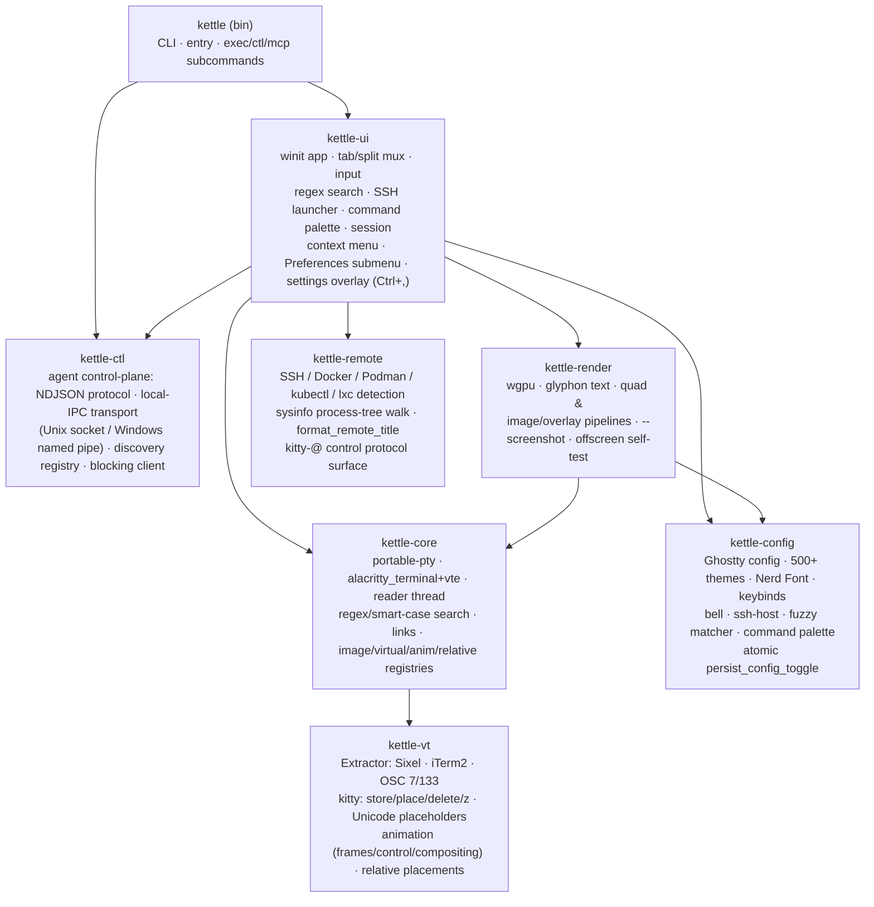
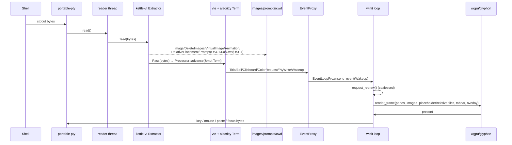
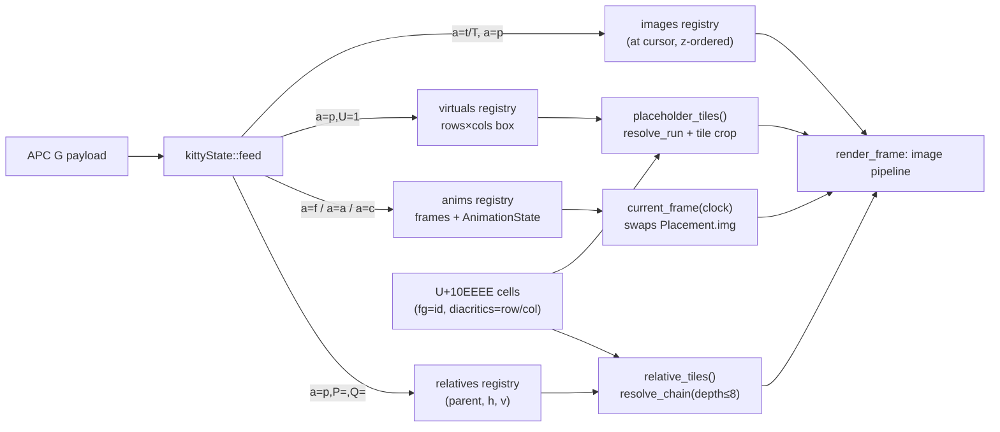
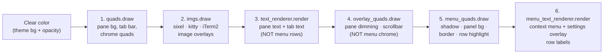
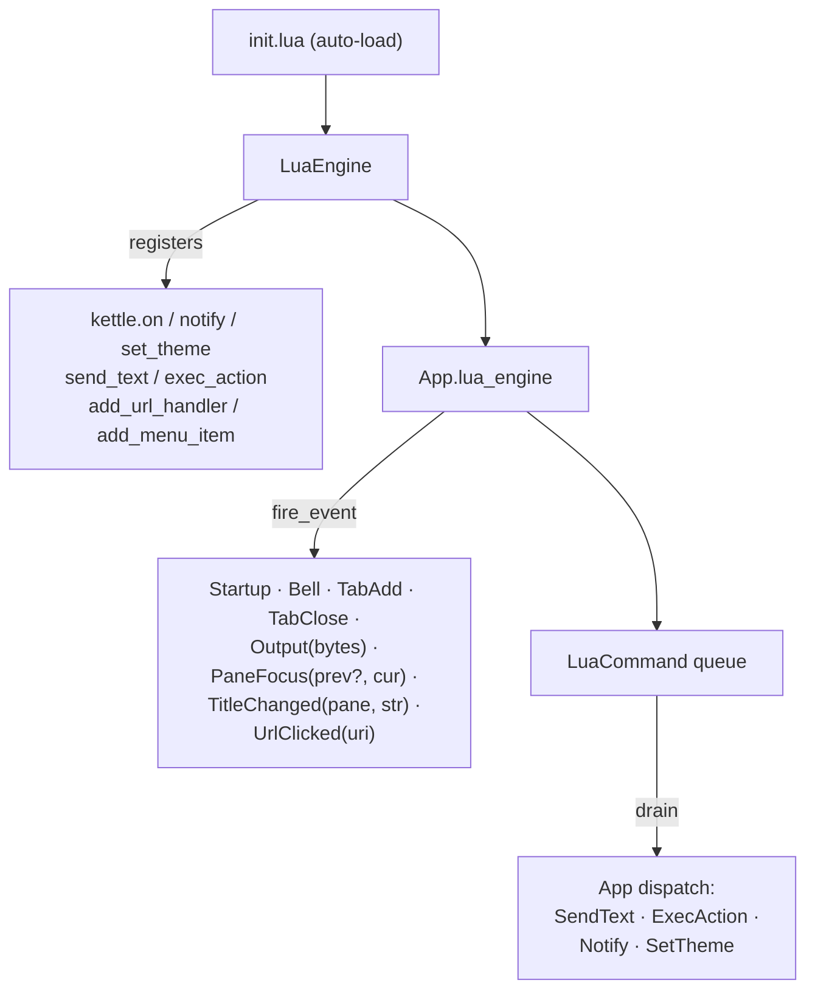
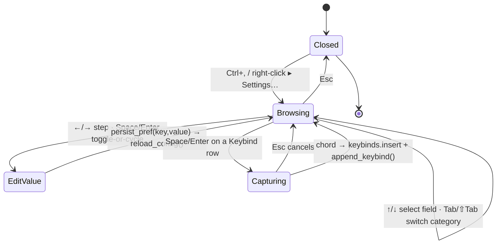
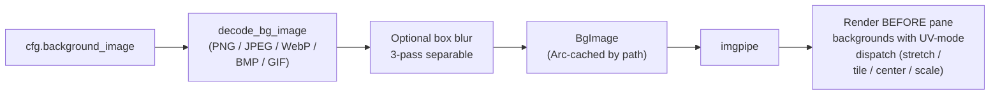
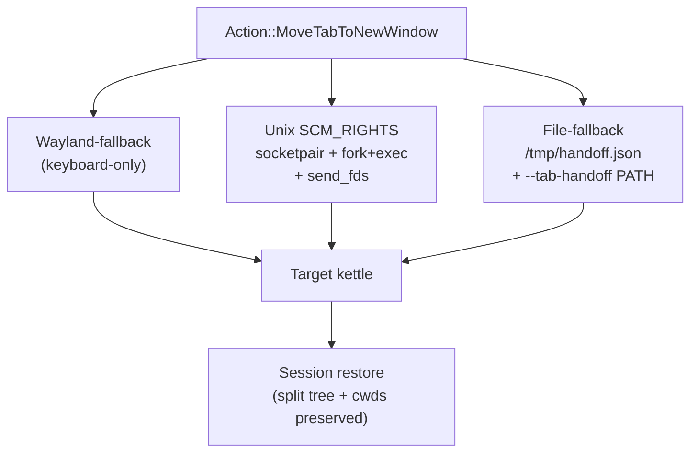

# kettle architecture

kettle is a Cargo workspace of focused crates. PTY bytes are split by an
**image-protocol extractor** before the VT engine sees them; the engine owns a
shared grid that the GPU renderer reads each frame; side-channels (prompts,
cwd, images, clipboard, title) flow back to the UI.

## Crates



## Agent control plane

The agent-first surface (see [AGENT.md](AGENT.md) for the full reference) is
the eighth workspace member, **kettle-ctl** — a UI-free crate that owns the
control-plane protocol (NDJSON request/response/event), the local-IPC transport
(a Unix domain socket or a Windows named pipe), the discovery registry, and a
blocking client. It is **off by default**: nothing binds a socket or writes a
registry entry unless the operator opts in (`agent-server = read-only|full`, or
`--agent-server <mode>`).

```mermaid
graph LR
    bin2["kettle (bin)"] --> exec["kettle exec<br/>headless one-shot<br/>(real PTY, no window)"]
    bin2 --> ctlcli["kettle ctl<br/>kettle-ctl client"]
    bin2 --> mcp["kettle mcp<br/>MCP bridge over stdio"]
    ctlcli --> ipc["local IPC<br/>(Unix socket /<br/>Windows named pipe)"]
    mcp --> ipc
    ipc --> srv["control SERVER<br/>(hosted in kettle-ui)"]
    srv -->|UserEvent::Ctl| app["App main thread<br/>(self.mux)"]
    reg["discovery registry<br/>reserved kind field<br/>(\"gui\" today, \"muxd\" later)"] -.-> ipc
```

Two roles split cleanly across the bin and the GUI:

- The **GUI (kettle-ui)** hosts the control **server**. Requests arriving over
  the transport are dispatched on the App main thread via `UserEvent::Ctl`, so
  they observe and mutate the same `self.mux` the renderer reads — no separate
  lock on the pane tree.
- The **bin (kettle)** hosts the three opt-in entry points: `kettle exec` (a
  headless one-shot that runs a command under a real PTY and streams its output
  to stdout, no GUI), `kettle ctl` (the kettle-ctl client that drives a running
  kettle), and `kettle mcp` (the Model Context Protocol bridge that exposes both
  as native agent tools).

The discovery registry reserves a `kind` field — `"gui"` today — as the
forward-compat seam for the optional `kettle-muxd` session daemon (see
[MUX-SERVER-DESIGN.md](MUX-SERVER-DESIGN.md)): when `kettle-muxd` lands it can
re-host the same server side as `kind = "muxd"` without breaking any client.

## Per-pane data flow



## kitty graphics pipeline

The biggest VT extension. Decoding lives in `kettle-vt::kitty` (pure,
heavily unit-tested); per-terminal registries live on `kettle-core::Terminal`
and are populated by the reader thread; the renderer reads them each frame.



## Render pass order

Each frame the renderer issues six passes against the same wgpu
render-pass encoder, in this order. The order matters: a quad pass
paints over text drawn before it, and text drawn after a quad covers
that quad's pixels.



Steps 5–6 own the right-click context menu so its labels land **on
top of** the panel background. Splitting them out fixed the v1.3.0 /
v1.3.1 blank-menu bug — the menu's opaque panel quad used to live in
step 4 (`overlay_quads`), painting over the menu text that had
already been rendered in step 3.

The 5–6 passes are cheap no-ops while the menu is closed (empty
buffer uploads). The two `TextRenderer` instances share the same
`TextAtlas` and `Viewport` — glyphon batches glyphs by atlas, not by
renderer, so the menu pass reuses already-cached glyphs.

## Threading model

- **Main thread** — winit event loop, *all* GPU work, the tab/split tree,
  input encoding, search/SSH overlays, session save/restore, cursor-blink and
  visual-bell timers (scheduled via `ControlFlow::WaitUntil` only while
  something animates, so an idle terminal does no work).
- **One reader thread per pane** — blocking `read()` on the PTY master →
  `Extractor::feed` → image/side-channel chunks recorded, text chunks driven
  into the `alacritty_terminal::Term` (behind a `Mutex` shared with the
  renderer) → wakes the UI. **Teardown invariant** (`Terminal::Drop`,
  `crates/kettle-core/src/term.rs`): it runs on the UI thread (a pane close drops the owned
  `Pane.term`), so it must **never `join()`** this reader. On Windows a
  ConPTY `read()` only unblocks once the pseudoconsole is *closed*, so
  joining the reader before dropping the master deadlocks the UI thread and
  the window goes "not responding". Drop instead sets a stop flag, kills the
  child, closes the writer (conin) and the master (conout / pseudoconsole)
  so the reader hits EOF, then **detaches** the thread — it owns only `Arc`
  clones (no borrow of `Terminal`) and exits on its own.
- Output floods are coalesced by `request_redraw` (≤1 frame/vsync). Per-pane
  registries (`images`, `virtuals`, `anims`, `relatives`, `prompts`, `cwd`)
  are `Arc<Mutex<…>>` snapshotted cheaply for rendering; a running kitty
  animation schedules a ~30 fps redraw tick (otherwise idle, no CPU). The
  extractor caps in-flight sequences (64 MiB) so a hostile stream can't hang
  or OOM — the cap is security-relevant: an SSH session into a 256 MiB
  container can otherwise OOM-kill kettle by emitting unbounded image data.
- **Lua VM** is parked on the App struct (single-threaded
  `LuaEngine`) — `mlua`'s `send` feature makes the handle `Send + Sync`
  but kettle never clones it across threads. Event hooks
  (`LuaEvent::Startup` / `TabAdd` / `TabClose` / `Bell` / `Output` /
  `PaneFocus` / `TitleChanged` / `UrlClicked`) fire
  synchronously on the App thread; Lua side-effects (`SendText`,
  `ExecAction`, `Notify`, `SetTheme`) queue onto
  `LuaEngine.pending: Arc<Mutex<Vec<LuaCommand>>>` and are drained
  back to the App's dispatcher each tick. A broken Lua plugin
  `log::warn`s and is skipped — it never aborts the terminal
  ("broken plugin can't take down kettle" contract).
- **Broadcast fan-out** (via the `BroadcastScope` enum) is App-side
  input dispatch, not a separate thread: on every keystroke the App
  walks `compute_broadcast_targets(scope, focus, in_tab, all)` and
  writes the encoded bytes to each target pane's PTY. The reader
  threads of the receiving panes pick up the echo through their
  normal byte-stream path.
- **Allocation hot-paths**: `App::drain_events`
  has 5 `.clone()`/`format!()` operations; `App::redraw` has 7.
  Each is load-bearing — `LuaEvent::Output(id, bytes)` copies the
  byte slice into a fresh `Vec<u8>` for the Lua callback (no
  shared ownership because mlua's `IntoLuaMulti` consumes the
  argument); `ContextMenuRow.label` clones the visible row text
  each frame the menu is open (~512 clones/frame in the worst
  case — Theme submenu drilled-in). The menu allocation is bounded
  by user interaction (only allocates while the menu is OPEN) so
  the steady-state allocator pressure is zero. A `Cow<'static, str>`
  refactor of `ContextMenuRow.label` is the natural next step if
  this ever shows up in a profile; today it's not measurable
  against winit's per-frame work.
- **Synchronization primitives audit**: ~13 `unsafe`
  blocks total, all FFI (libc `sendmsg/recvmsg/SCM_RIGHTS`, signal
  setup, `pre_exec` for fd-3 plumbing, `UnixStream::from_raw_fd`
  adoption). Each is ≤10 lines, narrowly scoped, with a doc comment
  citing the ownership contract. No `transmute`, no raw-pointer
  abstractions, no `Send`/`Sync` impls outside the foreign-fd
  protocols. Per-pane `Arc<Mutex<...>>` are contended only on PTY
  read or App snapshot; lock-hold times are O(bytes) — designed to
  stay well under one frame's budget per drain even on fast scrolling.

## Why the extractor sits *in front of* the VT engine

`alacritty_terminal` has no image/graphics support and ignores OSC 7/133. The
`Extractor` is a small state machine that pulls Sixel (DCS), kitty (APC `G`)
and iTerm2 (`OSC 1337`) image sequences, plus OSC 7 (cwd) and OSC 133 (shell
integration), out of the byte stream and forwards everything else
**byte-for-byte** (terminator preserved: BEL vs ST) so the engine still sees a
correct, untouched VT stream. This keeps us on a battle-tested engine while
adding modern features it lacks.

## Key design choices

| Concern | Choice | Why |
|---|---|---|
| VT engine | `alacritty_terminal` + `vte` | Battle-tested vs vttest/vim/tmux; avoids re-deriving the xterm long tail. |
| Images/OSC | in-house `Extractor` ahead of the engine | Adds Sixel/kitty/iTerm2 + OSC 7/133 without forking the engine. |
| Text | `glyphon` (cosmic-text) | Pure-Rust shaping + fallback + GPU atlas; ligatures + Nerd glyphs. |
| Window/GPU | `winit` + `wgpu` | One codebase for X11/Wayland/Win32/Cocoa; offscreen self-test in CI. |
| PTY | `portable-pty` | Uniform Unix + Windows ConPTY. |
| Config | Ghostty `key = value` | Ships the Ghostty theme set verbatim; familiar to users. |

Correctness is guarded by an extensive workspace test suite —
end-to-end VT-conformance driving this exact `vte`+`alacritty_terminal`
path, plus pure-unit coverage of the kitty decoder / placeholder /
animation / relative logic, the fuzzy matcher and command palette.
See [TESTING.md](TESTING.md) for the per-crate breakdown
(run `cargo test --workspace` for today's count — it grows ~1/cycle).
Comparative analysis behind these choices (with citations) is in
[RESEARCH.md](RESEARCH.md) and [UX-COMPARISON.md](UX-COMPARISON.md).

## Terminator-parity subsystems

Four major subsystems modeled after GNOME Terminator. Each has its own
design doc under `docs/TERMINATOR-*.md`; the architectural integration is
summarized here. Subsequent v1.32+ releases hardened the plugin contract,
extended drift guards, surfaced opt-in keys via `--check-config` echo
lines, scrubbed internal cycle refs from every user-facing doc surface
(including binary stdout), added an opt-in pre-commit hook
(`.githooks/pre-commit`) that catches clippy / fmt / test / shellcheck /
rustdoc regressions at commit time, and shipped the per-pane right-click
context menu polish (hover-to-highlight, disabled-row hiding, scrollable
submenus, mnemonics + typeahead, atomic config write-back via
`persist_config_toggle`, and the **Preferences ▸** submenu wiring 13
runtime toggles).

The most recent additions:

- **kettle-remote crate** (SSH / Docker / Podman / kubectl / lxc
  detection via sysinfo process-tree walk) — drives per-pane title
  prefixes and the right-click "Clone session" entry.
- **named-broadcast-groups subsystem** (`BroadcastScope` enum with
  per-tab / per-window / cross-tab named scopes).
- **right-click drill-in submenu UX** (Theme + Profile + Preferences).
- **vertical tab strips** and a **wgpu surface-readback screenshot path**.
- **in-app Settings overlay** (`Ctrl+,`) with a full **interactive keybind
  editor** — a keyboard-navigable preferences panel with live persist + reload
  (see the dedicated subsection below).

See [`docs/TERMINATOR-AUDIT.md`](TERMINATOR-AUDIT.md) for the full
Terminator parity inventory; see [CHANGELOG.md](../CHANGELOG.md) for the
per-cycle history.

### Plugin system (cycles 324, 365-378)



`lua-sandbox = safe` (default) nils unsafe stdlib APIs (os.execute,
io.open, etc); `trusted` mode opt-in. See
[`docs/TERMINATOR-PLUGIN-DESIGN.md`](TERMINATOR-PLUGIN-DESIGN.md).

### Settings overlay + interactive keybind editor (cycles 756, 766)

A keyboard-navigable, non-technical-friendly preferences panel — the overlay
evolution of the right-click **Preferences ▸** submenu. Opens via **Ctrl+,** or
right-click ▸ **Settings…**. `crates/kettle-ui/src/settings.rs` is the *pure*
catalogue (categories → fields, free functions over `&Config`, unit-tested
without a window); `app.rs` owns the live `SettingsNav` state + input routing +
persistence; `kettle-render` draws it through the **same menu pipeline**
(render-pass steps 5–6 above). Every value edit writes straight to the user's
config via the atomic `persist_pref` → `persist_config_toggle` path and
live-reloads, so changes take effect without hand-editing the file. The
**Keybinds** category is a full interactive rebinder: activating a row captures
the next chord and appends a `keybind = <chord>=<action>` line via
`kettle_config::append_keybind`.



Categories are **Appearance · Behavior · Keybinds**; field kinds are **Toggle ·
Choice · Number · Keybind**. Field values are always read fresh from `Config`,
so an external edit / live-reload is reflected immediately, and an unknown
catalogue key degrades to "—" rather than panicking (`settings::read`,
guarded by the `catalogue_keys_are_all_readable` drift test). See
[`docs/SETTINGS.md`](SETTINGS.md) for the per-field reference.

### Per-pane titlebar (cycles 379-407)

Renders ONLY when a tab has >1 pane (single-pane tab uses the OS
window title). Layout:

```
┌─────────────────────────────────────────────────┐  ← per-pane bar
│  [group] pane title   80x24   🔔                │     (top OR bottom
├─────────────────────────────────────────────────┤      per cfg)
│                                                 │
│              cell content                       │  ← cell-grid render
│              (shifted by bar height)            │
│                                                 │
└─────────────────────────────────────────────────┘
```

Three color variants based on broadcast state: transmit (focused
source), receive (group member), inactive (idle). Click on the bar
focuses the pane; click again opens `EditPaneTitle`. `EditPaneGroup`
action edits the broadcast-group label. See
[`docs/TERMINATOR-PANE-TITLEBAR-DESIGN.md`](TERMINATOR-PANE-TITLEBAR-DESIGN.md).

### Background image (cycles 380-396)



Decoded at config-load (one-shot), kept in a path-keyed cache, rendered
via the cell-image pipeline. UV-modes + align-horiz/vert configurable.
See [`docs/TERMINATOR-BG-IMAGE-DESIGN.md`](TERMINATOR-BG-IMAGE-DESIGN.md).

### Detachable tabs (cycles 397-410)

Three paths, all end-to-end:



In-process foundation: `Mux::serialize_tab` +
`extract_tab`/`insert_tab`; IPC primitive:
`fd_transport::send_fds`/`recv_fds`; drag FSM:
`detach::DragState`. See
[`docs/TERMINATOR-DETACHABLE-TABS-DESIGN.md`](TERMINATOR-DETACHABLE-TABS-DESIGN.md).

### Session restore

Per-pane working directory + tab/split tree are captured live as the
user works and atomically written to `session.json`. Replay on the next
launch is **opt-in**: by default a new window opens fresh (a single pane
in the default cwd, like every mainstream terminal), and the
session is *saved* only in restore mode so a fresh window never clobbers
a saved layout. Set `restore-session = true` (or pass `--restore` for a
one-shot) to "continue where you left off":

```mermaid
sequenceDiagram
    autonumber
    participant Shell as Shell (PTY)
    participant Core as kettle-core
    participant Mux as kettle-ui::Mux
    participant FS as session.json (atomic)
    participant App as App (next launch)

    Note over Shell,Mux: Per-keystroke / per-cd
    Shell->>Core: OSC 7 (file://host/path/cwd)
    Core->>Mux: Pane::cwd = path
    Mux->>Mux: mark_dirty()

    Note over Mux,FS: Debounced autosave
    Mux->>Mux: structural change (new tab / split / close)
    Mux->>FS: tempfile write
    FS->>FS: rename → session.json (atomic;<br/>notify-watcher ignores temp)

    Note over App,FS: Next launch — restore is opt-in
    App->>App: restore-session = true OR --restore?<br/>(else open a fresh single-pane window)
    App->>FS: read session.json
    FS-->>App: tab tree + per-pane cwd
    App->>Mux: rehydrate split layout
    Mux->>Core: spawn shell per pane<br/>(working_directory = saved cwd)
    Note over Core,App: Pane reappears in same<br/>tab/split/cwd as last exit
```

Three notable invariants preserved by this flow:

- **Atomic write** — `session.json` is written tempfile + rename, so a
  power-loss between writes leaves the previous valid snapshot intact
  (no truncated/partial JSON). This was added after a corrupted
  save on shutdown.
- **OSC 7 catchup** — kettle parses the shell's OSC 7 stream
  continuously, not just at startup; pane cwd updates the moment
  the user `cd`s.
- **No replay of failed spawns** — if a saved cwd is gone (deleted /
  unmounted), the pane spawns in `$HOME` and logs a warning instead
  of aborting the whole restore.

See [`docs/ROADMAP.md`](ROADMAP.md) for the cycle-by-cycle ledger of
session-restore hardening (cycles 411-420).
