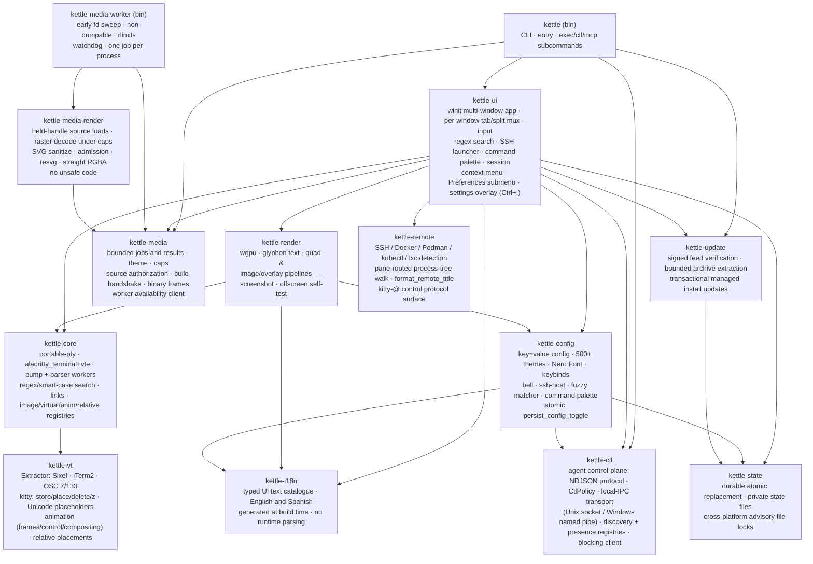
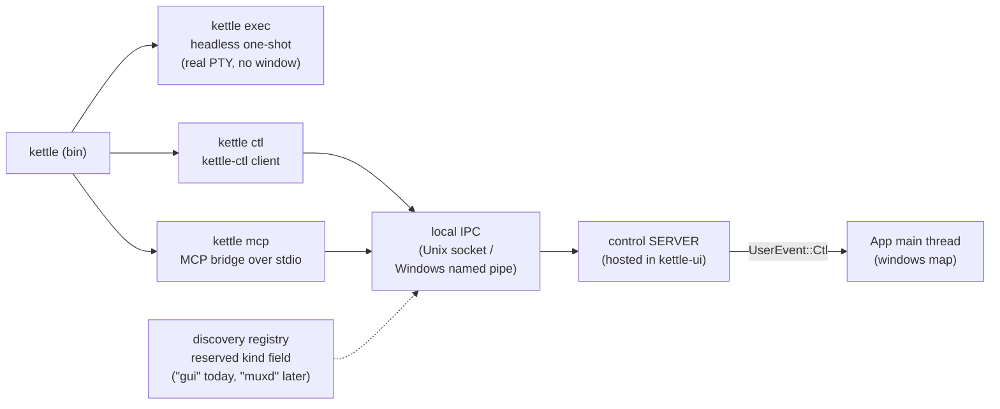
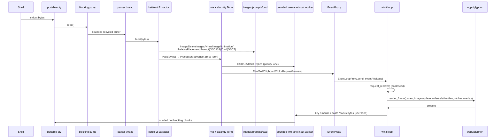
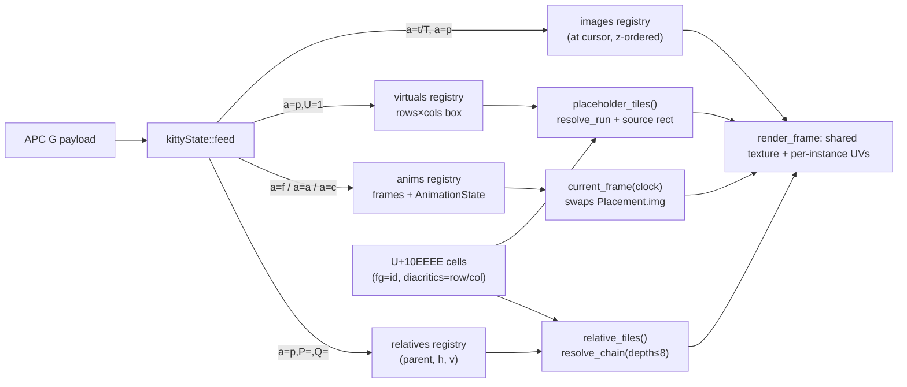
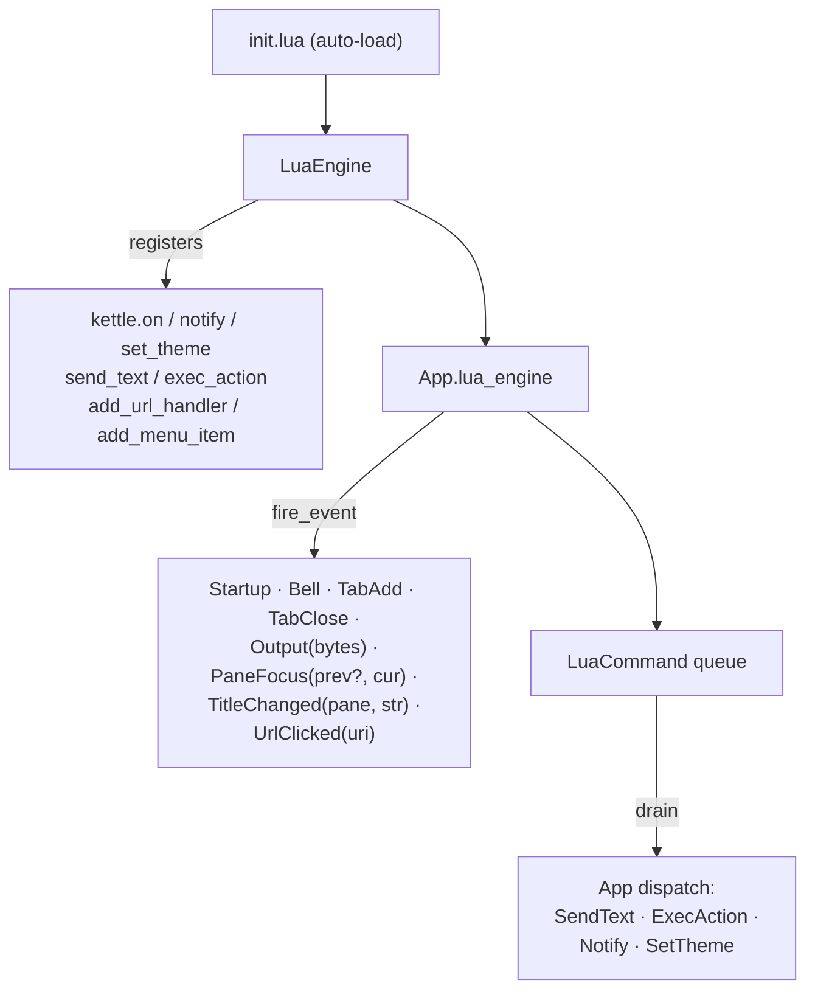
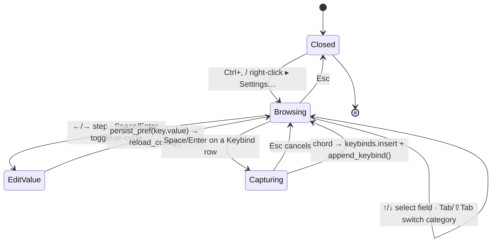
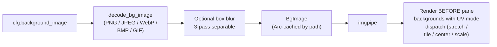
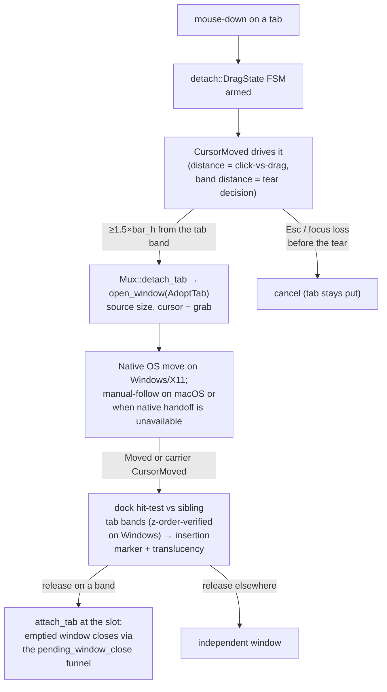
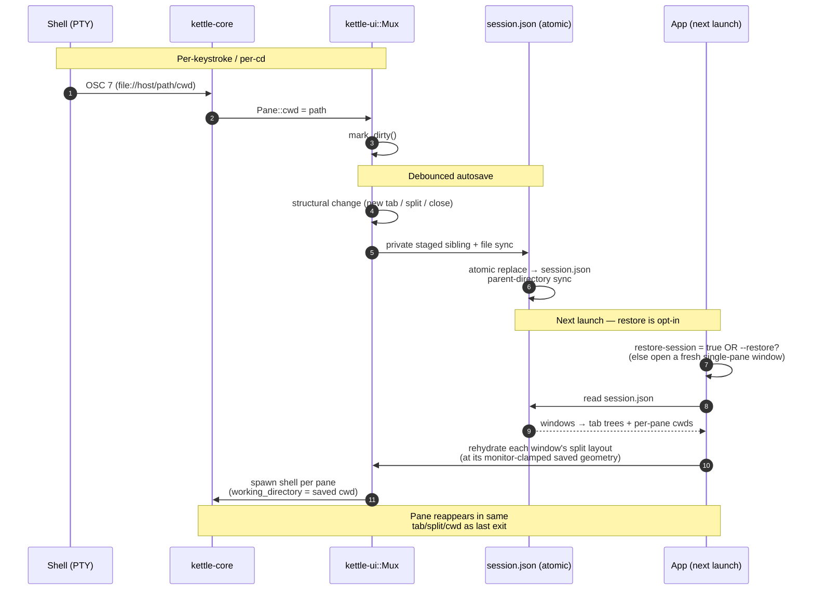
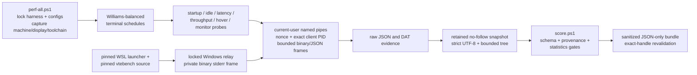

# kettle architecture

kettle is a Cargo workspace of focused crates. PTY bytes are split by an
**image-protocol extractor** before the VT engine sees them; the engine owns a
shared grid that the GPU renderer reads each frame; side-channels (prompts,
cwd, images, clipboard, title) flow back to the UI.

## Crates


```mermaid
graph TD
    bin["kettle (bin)<br/>CLI · entry · exec/ctl/mcp subcommands"] --> ui
    bin --> ctl
    bin --> update
    bin --> media
    ui["kettle-ui<br/>winit multi-window app · per-window tab/split mux · input<br/>regex search · SSH launcher · command palette · session<br/>context menu · Preferences submenu · settings overlay (Ctrl+,)"] --> render
    ui --> core
    ui --> cfg
    ui --> remote
    ui --> ctl
    ui --> state
    ui --> update
    ui --> i18n
    ui --> media
    i18n["kettle-i18n<br/>typed UI text catalogue · English and Spanish<br/>generated at build time · no runtime parsing"]
    ctl["kettle-ctl<br/>agent control-plane: NDJSON protocol · CtlPolicy · local-IPC transport<br/>(Unix socket / Windows named pipe) · discovery + presence registries · blocking client"]
    render["kettle-render<br/>wgpu · glyphon text · quad &<br/>image/overlay pipelines · --screenshot · offscreen self-test"] --> core
    render --> cfg
    render --> i18n
    core["kettle-core<br/>portable-pty · alacritty_terminal+vte · pump + parser workers<br/>regex/smart-case search · links · image/virtual/anim/relative registries"] --> vt
    cfg --> i18n
    cfg --> ctl
    cfg["kettle-config<br/>key=value config · 500+ themes · Nerd Font · keybinds<br/>bell · ssh-host · fuzzy matcher · command palette<br/>atomic persist_config_toggle"] --> state
    vt["kettle-vt<br/>Extractor: Sixel · iTerm2 · OSC 7/133<br/>kitty: store/place/delete/z · Unicode placeholders<br/>animation (frames/control/compositing) · relative placements"]
    remote["kettle-remote<br/>SSH / Docker / Podman / kubectl / lxc detection<br/>pane-rooted process-tree walk · format_remote_title<br/>kitty-@ control protocol surface"]
    update["kettle-update<br/>signed feed verification · bounded archive extraction<br/>transactional managed-install updates"] --> state
    state["kettle-state<br/>durable atomic replacement · private state files<br/>cross-platform advisory file locks"]
    media["kettle-media<br/>bounded jobs and results · theme · caps<br/>source authorization · build handshake · binary frames<br/>worker availability client"]
    worker["kettle-media-worker (bin)<br/>early fd sweep · non-dumpable · rlimits<br/>watchdog · one job per process"] --> media
    worker --> mrender
    mrender["kettle-media-render<br/>held-handle source loads · raster decode under caps<br/>SVG sanitize · admission · resvg · straight RGBA<br/>no unsafe code"] --> media
```

`kettle-media` defines the media protocol for agent visuals: bounded jobs and
results, the effective theme, caps, source authorization (an external request
can only carry an attested path; a GUI user pull needs an explicit action
witness), the build handshake and the binary frames between the GUI and a
media worker. It opens no files and starts no process itself. Its `client`
answers whether media previews are available, from a background check that
never blocks the caller; the filesystem, signature and process work comes from
a `WorkerPlatform` its caller supplies, so the crate keeps its unsafe-code ban.
The `kettle` binary supplies one (`media_platform`): the worker beside the
running executable, recorded at startup, never from `PATH` or the working
directory, with its file checked and, on macOS, its code signature checked
against Kettle's own requirement. `kettle-ui` receives the configured client
and reports it in `get_state`. A worker that passes these checks reads as
available; each render still requires the matching build handshake. Kettle and every worker share one
build identity, the source hash its build script computes
(`crates/kettle/build_support/source_id.rs`). `kettle-media-worker` is that
worker, a separate executable shipped beside the terminal on Unix that serves
one job per process. It renders through `kettle-media-render`: the source is read once
through one held descriptor, the format comes from the content, the decoded
size is checked before any pixel is decoded, and the image is fitted into the
job's target box as straight RGBA. An SVG is parsed with no DTD, rewritten so
it refers to nothing outside itself, admitted on its expanded size and on
every layer resvg would allocate, and only then rendered. A per-job font
database combines the bundled face with held-read snapshots of explicitly
named regular files; only the requested collection face is inserted, with its
index preserved and bounded metadata. The worker does no host font discovery
and refuses embedded SVG/color/bitmap glyph formats. Actual shaped glyphs
produce fallback and missing-script warnings; databases are isolated across
jobs. Raster images, SVG and Mermaid diagrams are rendered, and so is an
Auto job: one held snapshot of a file, classified by its bytes as raster,
SVG or Mermaid and rendered as that, with a typed reply that says which.
Mermaid goes through merman 0.8.0, pinned exactly with its layout and
painting family, under a resource-constrained policy and a two-second
`OperationControl` deadline that starts before its fonts load. Kettle
measures every label itself (`svg::text_host`, with `text_metrics`,
`text_wrap`, `text_rows` and a bounded `text_cache`) from the job's own font
database, which adds bundled Fira Sans for proportional labels, so layout and
painting use the same faces; a measurement merman made any other way refuses
the diagram. Its colors follow the job's canvas: the pane's own palette
on the pane's background, a light palette on white, or the pane's palette
on no background at all for a checkerboard, which merman's root background,
otherwise always white, is set to (`RootBackgroundPostprocessor`). The SVG
it produces takes the outside-SVG path in a generated
mode: its style sheets are lowered by `svg::generated_css`, with simplecss as
usvg reads them; a declaration the checker cannot read, an element whose
attributes fail the checks (such as a gantt's today line far off the chart)
is left out rather than refusing the diagram; the first element with each id
owns it, written or not, so a later one loses the id and a reference never
moves to it; and relative font sizes, from attributes and style sheets alike,
are resolved against the inherited size to absolute pixels within the number
bound, or left out; and admission, the layer checks and
resvg follow unchanged. The rendered item keeps the Mermaid source as its
source text and digest. Every other kind is refused as unsupported until its
renderer lands. The client's `render` runs one job in a
fresh worker under startup and job deadlines, with the worker in its own
process group, killed before it is reaped; `render_with_control` adds
cancellation and one absolute deadline its caller owns. Nothing in the GUI
calls them yet. The byte layouts, digest
framing, availability codes and decisions are in
[MEDIA-PROTOCOL.md](MEDIA-PROTOCOL.md).
The campaign's ownership, distribution decisions and remaining acceptance
boundaries are recorded in [AGENT-VISUALS-DESIGN.md](AGENT-VISUALS-DESIGN.md).

`kettle-i18n` holds Kettle-owned UI text. Its build script reads
`locales/schema.toml`, `en.toml` and `es.toml`, validates them, and generates
Rust: a `Text` enum for fixed messages and one typed method per message with
named arguments. A missing key, a placeholder mismatch, or a wrong argument
fails the build; nothing is parsed at run time. Each process picks one language
at startup from the `language` key (`auto` reads the OS locale once) and passes
an immutable `Translator` to the code that shows text, so there is no global
locale; a config reload keeps it, and Settings says a change needs a restart. Terminal content, user and shell names, config values and
protocol text never pass through it. Settings, the command palette, the theme,
layout and SSH pickers, the right-click menu with its Preferences submenu, the new-tab
dropdown, the About panel, the close, paste and key-rebind confirmations, the
title editors, the search bar, the completion card, the paste receipts, the
update banner, the screen-reader names and Kettle's desktop notifications are
on it so far; the other surfaces move in the 5.0 localization track. Crates below the UI keep returning data: the
reconnect row for a detected remote session is worded in `kettle-ui` from
`kettle-remote`'s typed context. The palette ranks a query against the label shown and,
outside English, against the English label too, so a command name from the
docs still finds its command. The search bar sizes each control from its
longest label in the UI's language, never narrower than in English, and paint
and hit testing share that geometry. Control-protocol JSON (`ui_geometry`)
keeps English labels in every language, and so do logs: where a notification
repeats a log line, the log keeps English and only the notification is
translated. Notifications from Lua plugins and terminal programs are shown as
they arrive.

`kettle-state` is the leaf persistence boundary shared by configuration,
sessions, and the updater. It stages with `create_new` beside the destination,
applies the final permissions/security descriptor to that open inode, syncs it
before publication, and syncs the parent directory on Unix. It preserves
existing permissions when asked and rejects symlink destinations by default.
Private files use mode `0600` on Unix. Before allocating a new staged name it
reclaims only exact same-destination temp names whose canonical creator PID is
definitively dead and whose opened object proves current-user ownership,
single-link regular-file identity, and no reparse/symlink substitution. Scan
and removal counts are bounded; live-PID, malformed, multi-link, and nonregular
lookalikes are untouched. Windows passes `CreateFileW` an explicit owner-and-DACL security
descriptor: the effective user owns the file and one protected ACE grants only
that user full access before any content is written. Existing leaves are
opened as reparse points and rejected; parent handles and file identities pin
the non-reparse parent across each open or publication. A failed creation is
discarded through its still-open handle, so cleanup cannot delete a path that
was swapped after the create.

Crash-remnant scans run through one process-wide best-effort reaper, not on the
caller that requested an atomic write. Its synchronous queue holds at most 32
destinations. The scheduler distinguishes in-flight work from completed work,
tracks at most 256 destinations in total, and expires completed keys after a
five-minute cooldown. Old completions are evicted before rejecting a new key;
spawn, queue, disconnect, and worker-guard failures cancel or complete the
reservation so a transient failure cannot suppress that destination forever.

Private Windows replacement moves that already-secured staged file into place,
so a permissive legacy destination DACL is never applied to new private bytes.
Permission-preserving replacement captures the old DACL while holding that
object against deletion, applies it to the staged handle, syncs that final
state, and then publishes that same object by handle. Hardening an existing
object requires effective-user ownership even when its DACL already looks
exact, because a different owner retains implicit authority to rewrite that
DACL. Elevated creation explicitly selects the user SID as owner instead of
trusting the token's possibly group-valued default owner. Win32 alias spellings
and alternate-data-stream leaves are rejected, and every child path is derived
from the already-held parent rather than resolved again through a mutable DOS
drive mapping. State and lock files, recordings, remote-command payloads,
terminal logs, screenshots, pasted images, and runtime/GPU/crash diagnostics
share these primitives. Advisory locks let callers serialize compound
operations; configuration persistence holds one across the complete read,
validate, backup, and replacement transaction.

Screenshot persistence has two deliberately separate policies. UI/default
screenshots are private state and therefore require Kettle-owned, verified
ancestors. An explicit ctl/MCP `path` is a user-selected export: its parent must
already exist, but it may be an ordinary user directory. Both policies stream
into a randomly named owner-only sibling; the requested leaf remains absent
until a complete, durably flushed inode is atomically linked without
replacement. Filesystems without hard-link support use the platform's atomic
no-replace rename operation instead.
Creation and publication pin the selected parent, derive both children from the
held object, and verify file identity. Unix uses `openat`/`linkat` and
`renameat2`/`renameatx_np` fallback plus identity-matched descriptor-relative
cleanup. Because Darwin ACLs can grant
read access independently of mode bits, macOS first creates an empty owner-only,
ACL-free staging directory in the selected parent and secures the sibling there;
the requested name is never visible with an inherited ACL or partial content.
Windows denies parent deletion through publication, creates the sibling under a
protected current-user DACL, and rejects NUL, alternate-stream, and trailing
dot/space aliases before Win32 normalization can erase them. Neither policy
overwrites or follows an existing leaf. A writable export parent can still
rename or remove the staging name or published pathname; the open file object
remains the one Kettle created, publication then fails closed, and cleanup
removes only that object when it still occupies the staging sibling. Cleanup
failure is reported and a replacement is never removed, but the pathname is not
a durable capability. This policy is not a substitute for private-state storage
and is never used implicitly.

Configuration reads carry provenance across the CLI/UI boundary. Default and
named-profile paths open through `kettle-state` while their verified parent
handles remain live; Unix rejects writable or untrusted directory edges,
writable or multiply-linked leaves, and symlink substitution. Dotfile-manager
leaf links remain supported, but the link object is owner/link-count checked
and resolved relative to the held parent before the target receives the same
full-chain verification. macOS also
inspects each held object's extended ACL for mutation grants to untrusted
identities; Windows applies the equivalent owner, reparse-point, hard-link, and
mutation-DACL checks, including generic access masks. The config watcher uses
the same read-only directory verifier after a best-effort repair, so a safe
read-only mount can still reload and an unsafe directory cannot turn an edit
into a `RunCommand` trigger. An explicit `--config FILE` is represented as a
separate provenance value and intentionally retains bounded regular-file
loading for project/shared configs. A failed live read leaves the last
known-good configuration installed rather than replacing it with defaults.
Each filesystem guard retains only the immediate-parent capability used for
relative operations; ancestor identities are recorded and the complete chain
is reopened and revalidated around publication. This keeps steady descriptor
use O(1) per guard rather than O(path depth) without weakening path-swap checks.

### Private clipboard images and video receipts

Pasted clipboard bitmaps add a narrower ephemeral-file lifecycle on top of
those primitives. One process owns at most 64 PNG handles and 256 MiB of final
encoded PNG bytes; the streaming writer refuses a write that would cross the
remaining aggregate budget and removes a failed/partial object through its
creating handle. An empty bootstrap object establishes and identifies the
owner-private session directory before any clipboard content is written.
Every Unix PNG is then created with `openat` beneath that held descriptor, so a
rename/path replacement cannot redirect screenshot bytes; Windows pins the
directory name by denying delete-sharing before real PNG creation. A successful
object is reopened relative to the held session directory (`/proc/self/fd` or
`/dev/fd` on Unix) and must match the creator's kernel identity before that
creator is released; the retained handle and descriptor-relative path are the
authority used at shutdown. The session directory is never recursively
deleted: Windows transitions from the lifetime pin through an identity-matched
cooperative handle to a DELETE-capable handle, then marks that exact empty
directory for deletion; Unix compares the held
device/inode, owner, and `0700` mode immediately before removing the empty name
beneath the sticky or private scratch root. The remaining Unix check/remove
window is limited to the same effective UID; sticky/private parent policy
prevents a different principal from replacing the session name.

The UI keeps a separate, bounded renderer copy beside each retained PNG: at
most 256 by 160 RGBA pixels, scaled once when the paste file is created. A
receipt can be constructed only by resolving the exact path back through that
retained-image table, and it is shown only after the initiating pane accepts
its own path bytes. A broadcast accepted only by another pane cannot put
success chrome over an initiating pane that rejected the paste. File-list
paste, ordinary drag and drop, terminal output, and arbitrary path text never
enter that one-shot lookup. Cancelling or rejecting the bitmap paste discards
its preview, so reusing the managed path later cannot resurrect a thumbnail.
Receipt state is window-local and pane-pinned; moving focus never projects it
over another split. Paint, pointer blocking, and accessibility all use the same
geometry result, while the image has its own single-instance GPU pipeline so
terminal glyphs cannot cover the thumbnail and the thumbnail cannot cover its
labels. Before handing the private path to the OS launcher, Kettle reopens the
PNG through the held session directory and requires it to match the retained
kernel identity. The owner-only session directory prevents another principal
from replacing the name between that check and the path-based launch.

Explicit video file lists use the same receipt geometry without sharing the
managed-image trust root. The event loop only classifies absolute path syntax
and pastes it normally. Once the initiating pane accepts the paste, one of two
background threads sends the first video path through a bounded eight-job queue
to the current executable's hidden worker. The child requires a non-link regular
file whose file and parent chain reject mutation by an untrusted principal. It
holds the file open and compares kernel identity, timestamps, size, and a bounded
first/middle/last SHA-256 sample before and after extraction. Each child has a
two-second deadline and can return at most 256 by 160 RGBA pixels. A deadline
failure gets one fresh-child retry, so a job can spend at most four seconds in
worker deadlines. Other failures remain final. If a child cannot be reaped, its
queue thread sends a failure for the current receipt and retires instead of
risking another job beside an unbounded child. A changed, missing, or untrusted
source gets no receipt. The video card has no open action, so the parent never
reopens the path after validation. A primary press on its body or dismiss target
consumes the hidden terminal click and removes the card. Pending window state
has a 38-second deadline, long enough for one surviving thread to drain the full
queue at the bounded retry limit, with finite slack for dispatch. An unusually
loaded host drops the optional receipt rather than retaining pending state
indefinitely. The hidden worker dispatches before update recovery and
application startup, so poster work never takes install locks or launches an
update helper.

The worker must be the same build as the GUI that starts it, and an update can
replace Kettle's executable while it runs. On Linux the GUI starts
`/proc/self/exe`, which names the running image even after its file was
renamed or deleted. Elsewhere it starts the path it was launched from, so
every request carries the GUI's source identity in a versioned frame
(`KTLVPIN2`), which `main` records before the worker dispatch: the version and
a hash of the Rust sources (every file under `crates/`, the workspace
`Cargo.toml` and `Cargo.lock`), computed by kettle's build script without git
(`KETTLE_SOURCE_ID`), so builds of different sources differ while a rebuild or
reinstall of the same source, in a checkout, a tarball or a Nix sandbox, does
not. A worker of another
build, or one that sees an older frame, exits with its own skew code; the GUI
does not retry it, logs once that previews wait for a restart, and shows no
video card.

Before delegating thumbnail extraction to a platform provider, the child
reads at most 64 KiB from its retained file and
uses `kettle_media::video::sniff_video_container`. This pure, allocation-free
classifier recognizes ISO-BMFF/QuickTime, Matroska/WebM by their EBML DocType,
RIFF AVI, FLV, MPEG program/elementary/transport streams, Ogg and ASF. Work is
linear in the bounded prefix with constant auxiliary storage. Complete inspected
header fields and declared file extents identify a family; they do not prove
that the file has a video track or that a platform supports its codec. The
background caller owns the prefix buffer and file I/O. Filename extensions
still schedule receipt candidates cheaply on the event loop, but text or
still-image containers with video suffixes receive no card. Movie content with
another supported video suffix can receive a card.

The child uses
[Quick Look Thumbnailing](https://developer.apple.com/documentation/quicklookthumbnailing)
on macOS, [IShellItemImageFactory](https://learn.microsoft.com/en-us/windows/win32/api/shobjidl_core/nn-shobjidl_core-ishellitemimagefactory)
in a fresh Windows STA, and the
[Freedesktop thumbnail cache](https://specifications.freedesktop.org/thumbnail-spec/latest/)
on Linux. Linux opens one PNG through a held, trusted parent chain, verifies its
owner, mode, `Thumb::URI`, and `Thumb::MTime`, then decodes that same descriptor.
A missing or untrusted cache entry leaves the generic poster visible. No
platform path runs a video codec inside the Kettle process.

The same store, as a second `PastedImages` of kind `paste_image::OPENED`,
holds the PNG copies a card menu hands to the image viewer: prefix
`kettle-open-`, 32 files and 128 MiB, and, since the viewer reads its copy
when it opens it, it drops its oldest copies to make room (`drop_oldest`, for
as much as the new PNG can take) instead of refusing, numbering on past its
file count. A copy stays at least a minute (`StoreKind::min_age`) so its
viewer can read it; a store full of newer copies refuses another, which the
user hears as busy. A copy it cannot delete stays counted against the bounds
(`StuckImage`) and cleanup tries it again. At exit the App closes the store
(`PastedImages::close`), so an open still on its way cannot leave a copy
behind. The App holds it behind a mutex so `media::external` can write
off the window thread; `hand_over` checks the viewer, writes the copy, marks
it downloaded through the held handle (`mark_downloaded`), checks it is still
the file Kettle wrote (`path_still_matches`) and starts the viewer, all under
that lock, and at most two opens are prepared at once.

Crash cleanup recognizes only
`kettle-paste-<canonical-pid>-<canonical-u128-nonce>` and
`kettle-open-<canonical-pid>-<canonical-u128-nonce>` directories, with
canonical zero-padded children from `0001.png` through `0064.png` for pasted
images or `999999.png` for viewer copies. Cleanup runs on a background
thread so a damaged namespace cannot delay event-loop/window creation. It stops
after 250 ms, 8,192 root entries, 64 stale attempts, or 32 successful sessions
per kind; each session is capped at its kind's file count (64 or 32). A candidate must be older than 24 hours,
its creator must be definitively dead (`ESRCH` on Unix; queryable
non-`STILL_ACTIVE`/invalid PID on Windows), and every child must open relative
to the held directory as a current-user/private, non-reparse, single-link
regular file. Handles for all children are acquired before deletion begins;
unknown, malformed, linked, nonregular, untrusted, live-PID, or
time-indeterminate candidates fail closed. PID reuse therefore delays
reclamation rather than risking a live sibling.

`kettle-update` composes those primitives into one managed-install
transaction. Kettle 4.0 uses that transaction for supported Linux installs.
Windows distribution ended after 3.3.0; the Windows updater description below
records the final supported design rather than current install architecture.
Its complete source, including `scripts/install.ps1`, is archived at the
`v3.3.0` tag.

The archived Windows path named archive/helper/backup/quarantine state from one
exact decimal PID-and-epoch-nanoseconds id. Its schema-3 pending capsule carried
the exact signed release document and signature, selected asset digest, inner
package manifest, and retained archive/helper identities. The helper rechecked
that capsule against the compiled Ed25519 key and freshness window after taking
the update and running locks, read the actually installed version from the held
PE version resource, and accepted only a strict upgrade.

The Linux path and archived Windows path parse the digest-verified archive
directly and materialize its manifest-verified members into immutable byte
buffers; transaction publication
never returns to an extracted pathname. The release grammar is capped at 128
entries and 512 MiB. Before a backup pathname can appear, the schema-2 journal
durably records a transaction-bound `backing_up` intent with the destination's
prior size and hash. Recovery accepts an absent or partial backup only for that
one intent and only while the live destination still matches the recorded prior
bytes; established backups must exactly match the journal's paths, sizes, and
hashes before rollback or cleanup. Rollback also compares each live destination
with the recorded replacement fingerprint and preserves later writes on
conflict. A committed journal retains the last-known-good bytes until a process
at the target version reaches the managed startup checkpoint.

The Linux install plan keeps fixed payload files in one explicit map. It adds
changelog archives only from manifest-verified files named exactly
`docs/changelog/CHANGELOG-<major>.x.md`, where `<major>` is `0` or a decimal
without a leading zero. It sorts those entries and installs them with mode
`0644`. Other files or nested directories below `docs/changelog/` make the
package unsafe instead of creating a new install destination.

Linux retains the open descriptor-relative parent until each destination
snapshot leaf is opened; a `/proc/self/fd/...` capability can therefore never
be converted into a dangling path that misclassifies an existing file as new.
Linux installer layouts add a second, user-visible provenance layer at
`share/kettle/install-files.json`: it binds the normalized prefix and owner to
the sorted path/mode/size/SHA-256 identity of every managed file and records
only directories that Kettle created. Install, authenticated update, and
uninstall walk components without following links, validate owner/write modes,
and verify the complete prior record before mutation. Uninstall consequently
unlinks only recorded leaves and removes only recorded empty directories; it
does not recursively delete a shared XDG prefix or adopt a legacy tree. Startup
and explicit update first authenticate the marker, layout, prefix ownership, and
update journal under the update lock; they recover an incomplete transaction
before checking file-content provenance, so the old record cannot strand the
recovery data after a crash between publication and provenance replacement.
Linux updates preflight both binaries and publish the worker before the GUI
inside that transaction. A running old GUI rejects a new worker at the build
handshake. The 4.9 updater carries inert worker bytes and metadata as
shell-integration data; the first new process recovers its update journal,
then promotes the recorded matching capsule into the sibling binary path in
a second transaction under the same lock. A prepared migration rolls back
before retry. Missing or unusable migration data leaves text startup usable.
Once the worker exists, steady startup skips capsule and provenance hashing.
The archived Windows lock order was update then running; the helper released
running then update after durable commit and pending-record removal, before
asking a fully qualified system PowerShell to execute the exact
archive-verified `install.ps1` while a no-write/no-delete handle remained held.
The PowerShell installer implemented the same byte-range and sharing contract
while retaining non-reparse directory handles from the drive root through the
prefix, so validation and
leaf-only mutation cannot be redirected through an exchanged ancestor.
The archived Windows installer separately protected permanent state: every
created root, managed directory, coordination file, staged payload, and
published file had an explicit protected DACL for the initiating identity,
SYSTEM, and Administrators.
It held and validated the fixed-volume ancestor chain before root creation,
rejected untrusted replacement rights, and required that exact ACL on an
existing root. An opt-in legacy migration from a trusted external installer
accepted only the bounded known tree before replacing inherited ACLs.
On archived Windows installs, a pending helper could not replace the mapped
`kettle.exe`/`kettle.com` images until the old process released its
running-install guard and exited, so that process could not transparently
re-exec the replacement and still propagate its eventual status. A bare GUI
handoff could exit zero, but any invocation with arguments printed that no
requested work ran and exited 75 (`EX_TEMPFAIL`). This kept help/version,
configuration checks, CLI subcommands, and MCP launchers truthful while the
verified update waited for other windows to close.
After extraction, the supported Linux updater and archived Windows updater
verify any inner package manifest that is present. Signed release archives from
v2.36.0 onward must contain that manifest; older archives may omit it for
compatibility, but do not bypass verification when one is present.

Managed-recording retention also deletes through these primitives. It keeps
the candidate locked while `kettle-state` proves the path still identifies the
open private object; Windows marks that kernel object for deletion through a
reopened handle, while Unix unlinks the verified leaf relative to its held
parent directory.

## Agent control plane

The agent-first control surface (see [AGENT.md](AGENT.md) for the full
reference) is owned by **kettle-ctl**, a UI-free crate that defines the
control-plane protocol (NDJSON request/response/event), the local-IPC transport
(a Unix domain socket or a Windows named pipe), the discovery registry, and a
blocking client. It is **off by default**: nothing binds a socket or writes a
registry entry unless the operator opts in (`agent-server = read-only|full`,
`agent-display = true`, or their `--agent-server`/`--agent-display` launch
flags).

kettle-ctl also owns who may do what: `AgentServer` (kettle-config re-exports
it for the `agent-server` key), the `CtlPolicy` built from it and
`agent-display`, and the three method capabilities (Read, Mutate, Display).
`CtlPolicy::check` is the one authorization rule. In kettle-ui, each
connection thread admits a request with it before any other work, so only an
`AdmittedRequest` (private constructors, read-only accessors) can reach the App
or `wait_for`; `wait_for`'s screen probes are fixed `read_screen` requests made
from an admitted wait. The server and every connection share one
`SharedCtlPolicy`: the server mode is fixed for the process and display is one
atomic bit that can only turn on, so a live enable reaches open connections
without any of them re-reading config.

kettle-ctl also answers who is calling. `process` reads a process's pid,
parent, start instant and exit state from the OS (bounded `/proc/<pid>/stat`
on Linux, `proc_bsdinfo` on macOS, the process handle and a run-time
`NtQueryInformationProcess` on Windows). `identity` captures a connection's
peer from the kernel at accept, checks the client's first-request claim
against it, and walks at most 64 parent links on the connection thread. In
kettle-ui each pane records its child's identity right after spawning it,
before anything on the UI thread can reap that child, and the App matches a
checked chain against those identities across all windows. Only the
connection thread builds the evidence an `AdmittedRequest` carries.

`show` (kettle-ctl's `show` module) is parsed on that connection thread too,
after admission, into an owned `ShowRequest`; with it the request carries its
admission instant and the sender the kernel names, with the executable that
process runs (`process::executable`, rechecked against the pid's start), and
the program that asked: the sender, or for Kettle's own command line its
checked parent, with the code signature `kettle_ctl::signing` validates on
macOS. Every step is bound to the process's audit token, read again at the
end, whose pid version changes when the process runs another program: the
kernel's status for the running code (`CS_VALID`, kept only while every
loaded page matched its code directory) and the code directory hash it runs,
both from `csops_audittoken`; the file's signature and certificate chain
checked against a requirement without hashing the file again and with no
network lookup, before any signing information is read; and that file's code
directory hash equal to the kernel's. The program's path shown is the one read
inside that check. Requirements are Kettle's own constants, since one that
fails to parse makes the Security framework throw past its C interface. In
kettle-ui the `media` module routes it (`route`: the nearest live pane whose
child is an ancestor, else full control's pane or a hint naming this
Kettle, unverified), queues it (`queue`: one render, three waiting, one per
sender, a deadline from admission, and apart from those a slot for the
user's own request, which goes first), and renders it on the lane, one thread
started on first use that drives `WorkerClient::render_media_with_control`.
Each `Pane` owns its `Shelf`, so a shelf travels with its tab; completions
come back through `UserEvent::MediaRendered`, the item's pixels are charged
to the process preview account (releasing the least recently viewed off-screen
pixels when it is full), and only then is the push answered.

A push that asks for an inline card (`ShowRequest::inline`, sent only by
`kettle mcp --display` with `--claude-card-hook` or `--codex-card-hook`)
gets one only when its connection thread (`card_harness`) found the program
that asked to be the harness it asked as, under its maker's signature
(`Requirement::CLAUDE_CODE` or `Requirement::CODEX`, macOS only), and the
route is verified. After the item is published, `register_card` admits the
harness against the `media::CardLedger` (32 live cards per harness, four a
second), mints a nonce from the OS random source with unbiased digits and no
live collision, sizes the card for its harness's column and label
(`card_size`), builds its rows and caption (`card_message`, `card_caption`,
whose file name drops control,
format, private-use and zero-width characters), and registers it in the
pane's `kettle_render::InlineCards` (64 per pane) with a `CardPoster`: a weak
reference to the shelf item's pixels, so a card never holds the preview
account. The message rides back to the adapter in `ShowResult::inline`; the
MCP server keeps it in its `DisplaySession` for the hook's one-time
`kettle_card`, which is answered outside the tool queue. The renderer reports
each frame's accepted cards (`Renderer::painted_cards`), and their items count
as visible when pixels are released. The tick retires cards whose harness
exited, whose pane closed, or whose item left the shelf or was replaced.

Codex has no plugin route. `kettle`'s `agent_setup` module prints a shell
function that hands each launch to `agent-setup --launch-codex`, which
classifies the arguments without a shell and execs `codex`, adding
per-launch `-c` server options to interactive sessions only. On macOS, for
the Codex release whose hook output Kettle has measured, it also adds a
`PostToolUse` `mcp_tool` hook (elsewhere no card could be admitted); the display server then keys cards by Codex's call id, and
`kettle_card` hands each to that hook once, as for Claude Code.

Both the plugin and Codex's startup files are kept by `kettle-ui`'s
`owned_dir`: a set of files (`OwnedFiles`) written once, under a lock shared
by every Kettle using the root, into a directory named by an FNV hash of the
contents, read-only at every level of its nested layout, and checked again
before each use (`verify`: no links, read-only modes, trusted owner, no entry
it did not write, every file exactly as written); stale directories go by the
executable and version an identity reader finds in them.

Codex's startup is `kettle-ui`'s `codex_shell` module, which also renders
the `codex` function `kettle agent-setup --print` prints
(`codex_function`). With `agent-display-codex` and live agent previews, the
App's `reconcile_codex_shell`, run before the first pane and after each
reload, `prepare`s it, a manifest and a zsh `.zshenv` written under
`agent-shell` beside the plugins plus the fish code, and offers it; a
refusal (translocated, unavailable, unsupported) is what the Settings row
says. `Mux` hands the offered startup, its files checked again, to the spawn
as a `kettle_core::shell_startup::ShellStartup`. `kettle-core` owns the
mechanism, as it does PowerShell's: once the pane's environment is set, it
finds the shell the PTY will run the way the PTY does (`SHELL` when it can
run, otherwise the passwd shell) and, for zsh or fish with no arguments of
its own, adds `additions`. zsh gets `ZDOTDIR` pointing at the `.zshenv` plus
its original value, any bytes, and whether it was set, which the file
(`shell_startup::zshenv`) restores before anything else, unless a system
`zshenv` names `ZDOTDIR` or the `RCS` option; a bare `zsh` command is found
on the pane's `PATH` for that check. fish gets `-C` and the code, which the vendored
portable-pty passes to the default shell after its login `argv[0]`
(`shell_arg`).

Kettle's Claude Code plugin is `kettle-ui`'s `agent_plugin` module. With
`agent-display-claude-code` and live agent previews, the App's
`reconcile_claude_plugin`, run before the first pane and after each reload,
builds the plugin's three files for this executable (`PluginFiles`). Under
a lock shared by every Kettle using the directory, it writes them once into
a contents-named directory under Kettle's data directory through a private
staging directory and a rename, removes stale plugins, then offers it and
checks it at once so Settings is current. `pane_environment` asks
`for_new_pane` before each spawn, with the pane's own `CLAUDE_CONFIG_DIR` and
`HOME`. That call checks Claude Code's managed policy (`PolicySources`,
cached until a source changes on disk, and never beside a source whose
metadata cannot be read) and verifies the directory without following links,
so a pane gets the plugin only after both pass. `CLAUDE_CODE_PLUGIN_DIRS`
then gets the directory first and keeps the pane's other entries, less any
Kettle plugin, which goes even when the pane gets none. The last refusal is
what the Settings footer reports.

`media::CardSightings` keeps the cards of the last presented frame by
spot, each with the time it appeared there and an instance number that is
never reused. AccessKit names a card by that instance, as a `Button` child of
its pane's `Terminal` node, so no node id carries a nonce, and an action for
an instance no longer on screen does nothing. On screen means in a pane the
active tab's layout shows now (`App::accessible_cards`), not merely in the
last frame, so an action queued before a tab switch or a zoom cannot reach a
card that has left view. Focusing a card focuses its pane and closes Search,
which would otherwise keep the keys (its query is remembered). A press of
any button, a key press, input-method text or a pane focus change moves
focus off a card. Quick select places cards with
`InlineCards::placements` on a snapshot taken under the same lock as the
text it scans, not from the last frame, and draws its labels with the
menus, above every card. A click, a quick-select label
and an accessibility action all open a card through `App::open_card`, which
refuses while a dialog or a menu owns the pointer and checks the
card's item is still on its pane's shelf. The renderer records each card it draws (`PaintedCard`: pane, nonce, the
part inside its pane) in `drawn_cards`, whose items eviction spares, and
copies them to `painted_cards` only once that frame is presented; `card_at`
finds the card on screen under a press. After each presented frame the App
notes when each card on screen first appeared at its spot (pane, nonce and
rect, so two printed copies settle apart) with `CardSightings::note`, and a
primary press on one settled for `CARD_SETTLE` is taken by `press_card`
before anything but dialogs and the preview lanes. `release_card` then opens that
card's item. Anything that takes the pointer while the button is held (a
dialog through `close_all_modals` or `install_confirm_dialog`, the context
menu, search) ends the card's press, as do focus loss and a new primary
press after a release that never came, and `release_card` also opens
nothing while a dialog is up. `note_card_hover` names the card
a press at the physical pointer would take (`native_pointer`, which a control
client's moves never set), for the hand cursor and the overlay's accent
outline (`Overlay::card_hover`, the whole `PaintedCard`, drawn only where that
frame drew that same card in that pane). The cursor icon as a whole, with the
hover state its hit tests set, and every native press, release and wheel step,
works from `native_pointer` too (`WindowState::resume_native_pointer`), so a
control client's moves change neither; with the physical pointer outside the
window, `sync_cursor_icon` sets nothing at all. A card that has not settled leaves
`card_settle_wake`, which `about_to_wait` folds into its deadline so a still
pointer gets the hand when the card settles, and a presented frame whose
cards changed marks the hover stale for the same recheck. The user opens a shelf with `open_media_shelf`, on `Shelf::latest()`, the item
published last (a replacement by key keeps its place in the list).
`media::CardsTip` puts the one-time tip on the first card a presented frame
showed with its image (`Renderer::shown_cards`: the card's poster reached
the GPU, which `CardScene::apply_upload_results` records beside each drawn
card) while no dialog, menu or viewer covers the cards. `InlineCards::set_tip`
names the card and `CardScene` draws the tip on a strip along its foot. At
that moment it creates `ui-tips.json` with `kettle_state::atomic_create_new`,
which writes the whole record to a staged file and publishes it by an
exclusive link, so of two Kettles running at once only the first to create
it shows the tip and neither ever sees it half written. Any entry already
there, a record or not, means no tip and is left alone. At start a record it
can read (through `kettle_state::open_trusted_file_read`: a regular file
only, no link followed, no blocking open) marks the tip done. It ends when
`open_card` runs or `TIP_TIME` passes, a deadline `about_to_wait` folds in.

A pane's geometry comes from one place: `kettle-ui`'s `pane_partition`
divides each split leaf `Mux::layout` hands out into a `PanePartition`, its
titlebar (on a tab showing more than one pane), its terminal with the
padding inside, and its preview lane, by a `LayoutStyle` of the window's
cells, padding and titlebar. Everything about a terminal (PTY sizes in
`resize_all`, split and restore prediction, pointer and IME mapping, the
scrollbar, selection autoscroll, overlays placed at the grid, the renderer's
`PaneView::terminal`, accessibility bounds and ctl `ui_geometry`) reads the
partition's `terminal`; structural questions (which pane is where, which
way is up, a drag's target, a screenshot's crop) read `Mux::leaves`. A
lane request (`Tab::lanes`, by pane: side, share and whether expanded) is
transient: never saved, cleared from a torn-off tab, and pruned with its
pane. `partition_leaf` carves the lane in whole terminal cells and keeps
the terminal at 20 columns and 5 rows at least; a lane without room to
expand (a right one needs 16 columns for its header) is a one-row strip
along the body's bottom whichever its side, and one without room for that a
badge that changes nothing. Opening a lane into a badge is refused with a
notice. What a lane shows is `WindowState::preview_panels` (by
pane, the shelf item); `prune_previews`, on every pass of the event loop,
closes a lane whose pane closed or left the window or whose item left the
shelf. The App projects each visible lane into a
`kettle_render::MediaLanePanel` (display text and pixels, never a path).
A lane takes every press, plain pointer motion and the wheel over it, ahead
of inline cards and the receipt (a drag a press in the terminal began still
reaches the program); keys still go to the terminal, and modals open over it
without closing it, out of the pointer's and assistive technology's reach. kettle-render's `media_lane` lays it out (`media_lane_geometry`,
shared with the App's hit testing and accessibility: header controls close
and collapse, then, while the title keeps four columns, open outside,
previous and next, and the counter; the rows below only when expanded with
room), and the renderer draws lanes in their own layer (quads,
a lazily made image layer charged to the preview account, and a text
renderer) after the terminal's text and cursor and before its dimming,
scrollbar and every overlay, so a menu covers a lane whole. Each lane's
shaped text is kept by pane, enters the retained chrome damage key and is
reshaped when the font changes. Every quad a pane's cells add is clipped to
its terminal (`clip_quads`), so a snapshot still taller than a terminal that
has just shrunk paints nothing in its lane.

Every shelf item keeps what it was rendered from (`media::ItemSource`): the
job as a `JobSpec` (kind, theme, canvas, target, fonts, and its input), the
source's digest, and, for an SVG or a diagram read from a file, its text as
the worker read it (protocol 3's `exact_source`). Bytes a request carried
are kept once, charged to the process preview account through
`GraphicsBudget::reserve_retained_cpu`, and shared by the queue, the render
lane and the shelf; a push whose bytes do not fit is refused as over
budget, and a file's text that does not fit is simply not kept. A file is
kept as its path and the authorization it was read under. Evicting an
item's pixels releases its charged bytes too. The render lane builds each
`Job` from its spec, copying the bytes under a transient charge, off the UI
thread. A shelf key is a `ShelfKey`: the key a `show` named, or a file's
native path, so two paths that print alike never replace each other.

A lane's header can switch to the item's source (`MediaLaneMode::Source`),
whose visible rows `media::display_rows` takes out of the text for the
room the lane has, with tabs expanded and characters that act shown as
U+FFFD; the wheel over a lane (its own `WindowState::lane_wheel`
accumulator) scrolls them. A raster's or an SVG's canvas is painted behind
its pixels; a diagram's colors follow its canvas, so `◐` renders it again
as a `Requester::Lane` push, a sender of its own (`Sender::Lane`), whose
result `finish_lane_render` takes only for the same item and generation
read from a source with the same digest (`lane_render_verdict`), keeping
the item's id, generation and place; a changed file is said in the lane
instead. Such a render never reads a file while a control request is
handled. `↻` (`reload_preview`) reads an item's file again as the user's
own pull (`pull_preview` with a `ReloadOf`): a fresh read with a new action
witness, under the item's key and title and on the canvas chosen for its
lane (`reload_of`), so the result replaces the item in place as
`Provenance::User`, and a file that now holds a diagram is drawn for the
background the lane showed; showing it again clears what the lane last
said. The worker read that path on this computer before, so the
pane's gate for files its output names adds nothing; the read is still
refused while a control request is handled. Copying goes to
`media::CopyService`, one thread with its own
clipboard handle for the life of the process, one copy running and one
waiting; a source copy shares the item's charged text rather than copying
it, and the lane says what came of it. A wheel over a lane scrolls it only
while no menu or dialog is open (`lane_takes_wheel`), from a wheel account
of the window's own that is emptied when a gesture ends, the wheel moves to
the terminal, or a lane closes; a source replaced under its key by a
shorter one shows from a row it has (`lane_source`), and source rows are
bounded in bytes as well as columns, so marks that take no column cannot
make one long.

The user can pull a file into a lane too: `preview_link` runs quick select
with `hint_previews` keeping only the image, SVG and Mermaid files a pane
names (a whole path, off Windows, or a local `file://` link), and the
right-click menu adds a "Preview in Kettle" row (`UrlHow::Preview`) on a
link to one. Both reach `preview_pane_link`, which passes the pane's
`link_gate` as opening the link would: a remote pane, or one that has gone,
is refused, and one behind a multiplexer is asked about
(`ConfirmAction::PreviewLocalFile`), its origin read again on confirm
(`confirmed_preview_path`). `pull_preview` sends a `Source::user_pull`
carrying a `GuiActionWitness`, which only a user's gesture in the GUI makes,
as a `media::Push` whose `Requester::User` answers no client: it waits in
the queue's user slot (`Sender::User`), and a newer request takes its place
without a word. A failure before rendering (busy, out of time, no worker)
is kept in `MediaService::user_failures` (eight at most) until the App
tells it; one the render returns, `finish_show` tells at once. Both are
notifications. `pull_preview` refuses outright while a control client's
request is being handled (`App::ctl_driving`): a client may drive the UI
(`perform_action`, `dispatch_ui_key`, `send_mouse`), but its input never
stands for the user's gesture, which is what the witness asserts.
A finished pull lands on the shelf as `Provenance::User` and waits in
`App::previews_ready` (eight at most) for its window's next pass of the
event loop, which opens it in the pane's lane if the pane is still open.
`preview_clipboard_path` reaches the same two calls from the clipboard
(`copied_preview`): a file list a file manager copied goes straight to
`pull_preview` as this computer's, after a round trip through a file URL
that refuses a relative path, a share or `..`; one copied path or
`file://` link goes through `preview_pane_link` and the focused pane's
gate. Shift+right-click reads the clipboard to offer it as a menu row; a
plain right-click never does.


```mermaid
graph LR
    bin2["kettle (bin)"] --> exec["kettle exec<br/>headless one-shot<br/>(real PTY, no window)"]
    bin2 --> ctlcli["kettle ctl<br/>kettle-ctl client"]
    bin2 --> mcp["kettle mcp<br/>MCP bridge over stdio"]
    ctlcli --> ipc["local IPC<br/>(Unix socket /<br/>Windows named pipe)"]
    mcp --> ipc
    ipc --> srv["control SERVER<br/>(hosted in kettle-ui)"]
    srv -->|UserEvent::Ctl| app["App main thread<br/>(windows map)"]
    reg["discovery registry<br/>reserved kind field<br/>(&quot;gui&quot; today, &quot;muxd&quot; later)"] -.-> ipc
```

Two roles split cleanly across the bin and the GUI:

- The **GUI (kettle-ui)** hosts the control **server**. Requests arriving over
  the transport are dispatched on the App main thread via `UserEvent::Ctl`, so
  they observe and mutate the same per-window `Mux` trees the renderer reads —
  no separate lock on the pane tree.
- The **bin (kettle)** hosts the three opt-in entry points: `kettle exec` (a
  headless one-shot that runs a command under a real PTY and streams its output
  to stdout, no GUI), `kettle ctl` (the kettle-ctl client that drives a running
  kettle), and `kettle mcp` (the Model Context Protocol bridge that exposes both
  as native agent tools).

The surface is multi-window aware: `get_state` reports
`{windows, focused_window}`; `list_tabs` / `list_panes` enumerate every
window and tag each entry with its `window`; `--pane N` resolves across
windows (pane ids are process-global); and a live tab tear-off emits a
`tab_moved` event (`{from_window, to_window, tab}`) on the subscription
feed.

Protocol v1 uses a typed method table as the authorization source of truth:
each method declares read/mutate capability and UI/connection execution. The
wire remains additive JSON, with exact `v: 1`, 1 MiB request and 768 KiB
response/event bounds, and snapshot paging for large live reads. Discovery
records are atomically replaced and private. Both sides authenticate the
documented same-user boundary before protocol bytes flow: Unix compares peer
credentials with the effective uid; Windows servers compare the client process
token-user SID and clients compare the pipe object's exact owner with their own
token-user SID. Windows pipes are created with exact token-user ownership and a
protected owner/SYSTEM/Administrators DACL; another administrator's connection
still fails the exact SID check. This is not a per-client consent boundary:
every same-user process receives the selected `read-only` or terminal-wide
`full` authority once the operator enables the server. The MCP bridge
negotiates `2025-11-25` or `2025-06-18` and
dispatches tool calls through a four-worker, 16-request bounded queue with
JSON-RPC cancellation tracking. The blocking control client reads frames
incrementally under method-aware deadlines, preserves events interleaved before
a response, and treats malformed frames or mismatched response ids as terminal
protocol errors. A request that ends before its response is read (a deadline,
a cancellation, an event bound, malformed data, a partly written request)
retires the connection, because the in-flight response would otherwise be
correlated to the next call. Retiring closes the transport and frees what the
abandoned exchange had buffered, so the server's connection slot is released
at once rather than when the caller drops the client. A request that never put
a byte on the wire leaves the connection usable, since the server never saw
it. Callers reconnect; a cancelled mutation may still have executed, and that
connection cannot report whether it did. Unix connections enter nonblocking mode
once, before cloning;
the transport restores ordinary blocking `Read`/`Write` semantics with
`poll(2)` and serializes complete deadline-aware writes through one
connection-wide gate. No operation toggles `O_NONBLOCK` on a shared open-file
description, while macOS retains the fd-level nonblocking behavior required to
make a full AF_UNIX send buffer deadline-aware. Windows client and accepted
server handles both use overlapped I/O; deadline/cancellation paths issue
`CancelIoEx` for the exact operation and drain its completion before releasing
the `OVERLAPPED`. Named-pipe `flush` is deliberately a no-op because
`FlushFileBuffers` on the server end waits for the client to drain buffered
bytes and would bypass the write deadline.

The UI server caps admission at eight peers. Request inactivity is 30 seconds;
once a frame starts, its newline has an absolute five-second deadline that
slow-drip bytes cannot reset. Every response/event write has five seconds,
UI-dispatched replies have 610 seconds to accommodate the 600-second
`run_command` maximum, and subscribers get a bounded keepalive every 20
seconds. Registry/presence walks stop after 1,024 directory entries, JSON is
bounded during serialization, NDJSON readers preserve a scan offset, and UI
collection/grid/screen/key limits are checked before duplicate allocation or
enumeration.

Registry and presence records name their owner by pid *and* by that process's
OS-reported start time, so a pid the system later hands to an unrelated program
cannot keep a dead server advertised or a dead window's accent claimed. A
record without that token (an older build, an OS that cannot report one) keeps
the historical bare-pid answer rather than being pruned on suspicion. Records
are named on disk by their owner's pid, so pruning re-reads a file before
deleting it and does nothing unless it is still the record that was judged.
Otherwise the recycled pid's *new* owner, already registered at that path,
would lose an entry it can never rewrite, since a server registers once at
startup and never heartbeats. On Linux the
token is boot-relative while the fallback base directory can outlive a reboot;
that mismatch can only keep a leftover record, never delete a live one.

The discovery registry reserves a `kind` field — `"gui"` today — as the
forward-compat seam for the optional `kettle-muxd` session daemon (see
[MUX-SERVER-DESIGN.md](MUX-SERVER-DESIGN.md)): when `kettle-muxd` lands it can
re-host the same server side as `kind = "muxd"` without breaking any client.

App-owned modal input stays distinct from pane input. `send_keys` encodes keys
through the active terminal modes and writes them to the PTY;
`dispatch_ui_key` accepts a bounded, pre-parsed batch only while a supported
Kettle modal is open and never enters the PTY path. `ui_geometry` exposes the
search bar's rectangles, focused control, modes, status, target pane, and
truncation flag; its Search object deliberately omits the query and matched
terminal text.

The search bar owns the keyboard but not the pointer. It is a reserved lane
below the grid, so `App::any_modal_open` (keyboard, file drops,
focus-follows-mouse) includes it while `App::pointer_modal_open` (the mouse
arms and the cursor icon) does not; both derive from one
`non_search_modal_open` list so they cannot drift on anything else. The pure
`search_pointer_route` decides each pointer event by geometry: a press inside
the lane goes to the bar's controls, a press above it is ordinary grid input,
and motion or release follow whichever gesture is live (an editor drag keeps
the bar). The native winit arms and the `send_mouse` control arms consult the
same helper. Because the grid is clickable, an open bar follows pane focus.
`note_focus_change` calls `retarget_search_to_focus`, which moves the query and
its toggles to the newly focused pane and scans that pane afresh without
toggling the lane. The old pane gets its remembered query and, with no result
focused, its pre-search viewport back. The right-click menu is the one modal
allowed to coexist with the bar; keys go to the menu while it is up because
its arm precedes search in the key handler.

Pane-bound bytes never block the App thread. Each pane owns two bounded input
lanes: user input (keys, mouse, focus, paste, Lua, legacy remote commands, and
control requests) and higher-priority terminal protocol replies. Both lanes
have 64-message channels and independent byte budgets; the worker advances a
message in at most 8 KiB writes and checks the reply lane between user chunks.
The enqueue boundary returns `PaneInputResult::{Queued, ReadOnly,
Backpressured, Oversize, Failed}`. GUI callers provide throttled visible
feedback for transient/size failures, read-only remains visible in pane chrome,
and a failed worker is sticky and closes the pane. Control RPCs preserve the
distinction as `read_only`, `busy`, `bad_params`, and `internal` errors. A
local paste over 4 MiB is rejected before wrapping or fan-out; it is never
silently shortened.

## In-process multi-window

On macOS, decorated windows keep AppKit's title, traffic lights, drag region,
shadow, and rounded window mask. Native blur is a sibling behind Winit's Metal
view and is constrained to the content rect below the caption. AppKit owns the
opaque titlebar and follows Kettle's selected light or dark appearance. Kettle's
background color backs the content during resize. The effect is shown only when
the renderer's creation-time surface is translucent. Reduce Transparency makes
the window opaque again. Borderless macOS
windows do not install the effect: without AppKit's decorated frame, the
sibling material composites over Winit's Metal layer. They keep ordinary alpha
transparency so terminal content remains visible.

Windows applies the same raised surface and a contrast-checked text color
through DWM while requesting its system backdrop. Linux probes the live
Wayland registry before enabling Winit's KWin blur path. X11 and Wayland
compositors without that protocol get a 99% opacity floor on the live underlay
and replacing pane-base pass. That floor is applied only to the swapchain
render, so offscreen screenshots retain the configured alpha and config files
are never rewritten.

The content view is deliberately *not* full-size: tabs, terminal cells, pointer
hit-testing, and ctl geometry all stay below the traffic lights without a
platform-specific synthetic inset. Extending the renderer under the titlebar
would require compensating every one of those coordinate systems for AppKit's
content layout rect; no such hidden geometry shift is introduced for a cosmetic
fix.

The generated application icon uses the historical, font-independent `>_`
mark on every platform. Dark appearance uses a TokyoNight blue system-masked
field, an inset dark face, and a blue mark; light appearance swaps those two
colors exactly. The inset is 24 px in the 256 px macOS rendition and its 24 px
radius follows the system mask instead of competing with it. Icon Composer
owns the adaptive outer mask and lighting. Linux and Windows retain compatible
pre-rounded assets; their live Windows/X11 icon switches with the active theme.
macOS never decodes that icon: an AppKit window has no icon of its own, and
winit's macOS backend drops whatever it is given.
The 16 px raster uses a thicker optical-size version of the same two strokes.
Xcode's asset compiler emits `Assets.car`, the `CFBundleIconName`
metadata, and a loose previous-release `.icns` for the macOS 11 deployment
target. Finder, the closed and running Dock item, and the app switcher therefore
resolve the same adaptive asset.
The native visual result remains a release gate rather than something inferred
from SVG source or a Linux generator test.

Every kettle window lives in one process. `App` holds
`windows: BTreeMap<u64, WindowState>`
(`crates/kettle-ui/src/window_state.rs`) — every per-window field (the
winit window, its renderer, its `Mux` tab/split tree, input + overlay
state) lives in `WindowState`, while `App` keeps the process globals
(config, event-loop proxy, ctl server, Lua VM).

Both window constructors measure the font before creating the window
(`StartupFonts` in `kettle-render`) and size a fresh window through one rule
(`startup_surface` in `app.rs`). An explicit `window-width`/`window-height`
opens at exactly that grid. An unset axis keeps the 160×45 default grid's pixel
size, converted with an 8×16 px baseline in **logical** pixels
(`startup_inner_size`) so HiDPI gets the same grid; with neither set, the
default grid is fitted to the
primary monitor, or the largest one on Wayland, at 90 % × 85 %
(`default_startup_inner_size`), so a fresh window clears the ~144 columns agent
TUIs want without becoming a screen-wide canvas on an ultrawide. The restore
planner's fallback surface for a saved window without geometry is the same rule
in physical pixels. Restored geometry and explicit new-window geometry are
applied after these attributes and still win.

The first window's fonts load while the event loop starts. `run_with` starts
the `kettle-font-preload` thread (`font_preload.rs`) before it builds the event
loop. The thread enumerates the system fonts, loads the bundled face and
resolves the text-presentation face (`PreparedFonts` in `kettle-render`), none
of which needs a display. While it waits for the config, it shapes the cell
probe in the compiled-in family, so cosmic-text's matches and faces for it are
loaded; once the config arrives, it does the same for the configured family if
that differs. Bold is not warmed: the first styled cell loads the bundled bold
faces, which clears cosmic-text's match cache. On macOS the thread raises
itself to the user-initiated QoS class: a thread spawned from the main thread
starts at a lower class, and joining it does not raise it. The first window
joins the thread and only measures the cell at the monitor's scale. If the thread could
not start, the first window loads the fonts itself, as every later window does.
A renderer given fonts measured for another scale or size measures them again
(`StartupFonts::remeasure`) instead of enumerating the system fonts a second
time.

On macOS, an eligible first pane starts after `App` construction and before
`run_app`, while AppKit finishes launching. The order is font preload,
event-loop build, application setup, display read and font measurement,
first pane, AppKit launch completion, window, then GPU. A pure `startup_plan`
decides whether the launch may restore and preserves the command/directory
override before spawning consumes it. An override suppresses restoration,
including named-layout writes. Without an override, session restore, layouts
and tab handoffs use the resumed path. Pre-launch also requires Normal or
Hidden state, no configured position, a surface that fits the monitor, and
agreement between the primary NSScreen scale and `mainScreen`'s scale.
Linux keeps the resumed path. Later windows keep their existing construction
path. A rejected monitor fit retains the font system for measurement at the
resumed monitor's scale. Window or renderer creation failures hang up the
children through their owned handles.

PTY output before `run_app` parses into the existing grid. The waker sends
through winit's proxy, which queues the wake until after `Resumed`; the bounded
terminal event queue and existing recorder backpressure still apply. The
pre-launch pane supplies the window's exact surface and measured fonts.
`resumed_inner` skips its session load, font measurement and spawn, compares
the startup monitor, and warns if it changed. `display_read`, `path=pre_launch`,
optional `monitor_match`, and `fonts_wait_ms` extend the startup diagnostics.

A separate opt-in `kettle::pty_geometry=info` diagnostic observes the first
Unix PTY immediately after creation, before child spawn or any correction.
The recording clock starts before openpty; the creation timestamp and initial
read follow openpty before command setup. It retains at most 64 resize attempts, including no-ops and failures, and
reads final native geometry after a three-second recording deadline. The UI
merges that deadline into its existing wait schedule, including for hidden
windows; it starts no observer thread. Early teardown emits an incomplete
record. One provisional `native_pty_v1` JSON line after `native_pty=` contains
version, clock, process/pane
linkage, timestamps, geometries, fixed outcomes/reasons and numeric errors.
It contains no command, directory, environment, title or terminal data.
The harness joins decimal-string application PID and focused pane ID, then
checks the wrapper session ID against the native child PID. The child
observation belongs to the harness. A no-call no-op has signal_sent=false; a
native call has unknown signal delivery. Strict startup checks join this data and
verify coverage through its two-second interval; complete recording alone
is not evidence of correct geometry. This diagnostic remains off in ordinary
launches and performance measurements until observer cost is checked.

Startup marks its phases in `startup_trace` (`kettle-ui`): `main`, `run_with`,
the built event loop, the loaded config, the built `App`, the font thread's
enumerated and ready fonts, `Resumed`, the start and end of the first window's
wait for the font thread and cell measurement, including its own full font load
without a thread, the first pane's spawn, the created window, the ready GPU,
the reveal and the first frame.
The two font-thread phases print `thread=fonts`. Each mark is one atomic
store of the raw monotonic clock, the first time only: `CLOCK_UPTIME_RAW` on
macOS, the clock the macOS standing harness uses, and `CLOCK_MONOTONIC` on
Linux. The first frame is the first one the window startup created presents,
not one that timed out or found the window occluded, and not a restored
secondary window's. The stamps print once, in the order they happened, under
the `kettle::startup` log target, so `RUST_LOG=warn,kettle::startup=info` shows
them without turning on anything else. They print at that first frame; a window
that starts hidden prints them at the end of its startup, without a first
frame, and a startup that exits before any frame prints how far it got.

A no-argument GUI launch first uses the private activation endpoint under the
per-user runtime/state directory. One advisory lock elects a primary; the
endpoint accepts only a versioned `open_window` request capped at 8 KiB and
verifies same-user peers, while the connecting secondary authenticates the
primary before sending its launch identity. Accepted clients run in independent
workers (at most 16), and every frame read/write has a five-second deadline, so
one incomplete or unread connection cannot serialize later launches. A
capacity-32 handoff reaches the winit thread, and
the secondary exits only after that thread confirms OS-window creation. Because
the window opens before the response is written, delivery is at-least-once and
every request carries a per-launch idempotency key: the primary remembers what
it did for that key (bounded, expiring) and answers a retry from the record, so
a response lost to a slow cold start cannot open a second window for one click.
A retry that arrives while the first attempt is still in the handler waits for
its outcome instead of racing it. The wait is shorter than one frame deadline,
because the requester's read deadline started earlier and an answer after that
deadline would be written to nobody. A busy,
incompatible, timed-out, or failed request falls back to a separate process so
a launcher click is never discarded. Any explicit argument bypasses activation;
`--new-process` provides a discoverable isolation escape hatch for an otherwise
default launch. Dev-record builds also compare a bounded path fingerprint and
raw-input policy before joining, preventing recording-policy drift without
putting a user path on the wire.

- **Take-out/put-back dispatch** — the `ApplicationHandler` entry points
  remove the addressed window from the map, run the inner handlers with
  disjoint `&mut App` + `&mut WindowState` borrows, then reinsert it.
  Window closes route through a single funnel
  (`pending_window_closes: BTreeSet<window id>` →
  `finish_window_dispatch`). A request can be consumed only by the window id
  that produced it, including when ctl dispatch temporarily checks out a
  mapped sibling. The funnel exits the event loop only when no windows remain.
- **One GPU context** — the wgpu `GpuContext { instance, adapter,
  device, queue }` is created with window 1 and shared; each subsequent
  window gets its own surface via `Renderer::new_with_gpu` (synchronous —
  no adapter request, no watchdog needed). Live windows, `--gpu-info`,
  screenshots, offscreen tests, detection, and recovery share one adapter
  policy. A config-pinned GPU (`gpu-vendor-id` /
  `-device-id` / `-name`, set via Settings → Graphics) wins; `gpu-backend`
  applies with or without that physical pin. Auto backend order is deterministic
  (DX12 first on Windows, Metal on macOS, Vulkan elsewhere), and unavailable
  explicit backends log an observable fallback to native order. The common
  unpinned Auto path enables and probes one backend at a time, so successful
  Windows DX12 startup does not initialize the Vulkan ICD. Pins and explicit
  low/high preference use one cross-backend enumeration; low/high ranks the
  physical GPU before backend and preserves the platform-preferred adapter for
  equal-class ties. Live instances retain winit's event-loop-owned
  `OwnedDisplayHandle` so the GLES fallback can present under Wayland without
  keeping window 1 alive. An absent pin
  (eGPU unplugged, driver swap) falls through to the power policy, so a stale
  portable config never prevents startup. Because the device/surface graph
  can't hot-swap and every window shares the one adapter, GPU changes apply on
  the next launch (the settings panel shows a "restart to apply" hint).
  Device creation retains the adapter's full 2D texture dimension for large
  high-DPI surfaces but clamps every other WebGPU default to the adapter's
  advertised limit. That common policy covers live windows, screenshots,
  offscreen checks, and renderer tests. It permits graphics-only virtual GLES
  adapters that advertise zero compute workgroups without inflating Kettle's
  resource envelope to every hardware maximum; Kettle has no compute pipeline.
  A fatal wgpu error latches one bounded in-memory `GpuFault`; the event loop
  then rebuilds every renderer on a pure settle/backoff state machine
  (same physical GPU through an alternate backend → surface-preferred GPU →
  another physical hardware GPU → software) without dropping PTYs.
  Driver callbacks never perform filesystem I/O. The event-loop thread writes
  capped, rotated, terminal-content-free JSONL incident records under the
  per-user cache. Surface acquisition treats both `Success` and `Suboptimal`
  outcomes as renderable; a suboptimal frame is submitted and presented before
  the surface is reconfigured for the next acquisition. Rendering is a UI
  transaction: `Renderer::render_frame*` returns `Presented`, `RetryLater`,
  `Occluded`, or `SurfaceLost`, and the normal `kettle-ui` render path commits
  output-generation counters, the paint timestamp, and flood-pacing state only
  for `Presented`. Candidate output-generation maps are recycled and swapped on
  commit, so this correctness boundary adds no steady-state per-frame
  allocation. Visible startup windows are a lifecycle exception: they are
  revealed immediately after renderer initialization, before the first redraw.
  Genuine device loss is the other deliberate exception: the redraw guard
  snapshots output generations without presentation so a streaming PTY cannot
  spin while all renderers are being recovered. Paint scheduling uses the same
  occluded/minimized/explicitly-invisible predicate as animation and retry
  scheduling, retains terminal damage while hidden, and repaints on restore.
  Transport wakeups are a separate concern: an opt-in recorder or Lua output
  sidechannel keeps them enabled so its bounded queue can drain, but those
  event-loop wakes do not authorize a hidden-window paint.
  Before releasing a failed device, every window retains a CPU-only recovery
  snapshot of its live font family/size, cell scaling, and any queued
  screenshot completion. The snapshot survives failed adapter escalations; an
  all-or-nothing successful rebuild reapplies it at the window's current
  monitor scale and size, invalidates stale pane snapshots, and reflows every
  nonzero surface exactly once. The window accent is not in the snapshot: the
  App's accent claim is its only source, can change while a window has no
  renderer, and is applied to every replacement renderer.
  Timeout and `Outdated` retain damage and enter a capped, deadline-driven
  per-window retry. Hidden, minimized, or compositor-occluded windows leave that
  repair armed without a wake deadline. wgpu 30 `Lost` recreates the affected
  surface/renderer through `Instance::create_surface` while keeping the healthy
  shared device; only the device-lost callback, out-of-memory, or internal GPU
  errors enter process-wide adapter/device recovery. Other render errors rebuild
  the affected renderer's retained resources on their own capped backoff.
- **Presentation and readback respect the window-system boundary** — every live
  frame calls winit's `pre_present_notify` after queue submission and
  immediately before `present`, which is required for correct compositor frame
  tracking. A live screenshot renders one scene into a process-budgeted,
  transient offscreen target before swapchain acquisition, copies that texture
  in the same submission when a drawable exists (or in its own submission when
  it does not), then hands the staging buffer to one bounded worker for finite
  GPU-wait intervals, mapping, and conversion. The target,
  staging buffer, and their separate process-budget reservations are admitted
  before encoding and travel with that job until submission completion or
  device loss; one wait timeout retains rather than undercounts them, while two
  consecutive timeouts classify the shared device as wedged and enter ordinary
  device recovery. Once readback reaches bounded CPU memory, those GPU objects
  and reservations drop immediately; crop, PNG encoding, inode sync, and atomic
  publication run in one process-wide fixed two-worker persistence pool shared
  by every window and replacement renderer. Thus one cancelled
  save stuck in the filesystem cannot retain capture admission indefinitely,
  while the pool bounds stranded CPU buffers. This makes
  capture independent of Metal occlusion and surface `COPY_SRC` without
  weakening the retained terminal-image limit. The event-loop thread never
  waits for a GPU readback; targets known hidden/minimized fail promptly, while
  a backend that cannot report those states falls back to the bounded control
  timeout. Encoding and the staged-inode durability flush remain cancellable;
  cancellation and publication use one atomic final transition immediately
  before the no-replace link/rename, so the destination is never a partial
  file. A finite post-commit grace period reports an uncertain destination
  instead of blocking a control thread indefinitely if publication itself
  stalls. Publication errors distinguish "not published" from
  "destination may exist" after durability, verification, or staging-cleanup
  failure. A wedged worker explicitly wakes the event loop after destroying the
  device, and genuine wgpu loss callbacks use the same process-wide wake, so an
  occluded application enters recovery. A concurrent GPU capture receives an
  explicit busy result; persistence accepts at most two jobs.
- **Runtime diagnostics are phase-only** — a watchdog observes fixed event-loop
  phase names (`resumed`, `gpu_init`, `window_event`, `redraw`, `user_event`,
  `about_to_wait`) and writes one private, rotated record after a bounded stall.
  An event-loop backend error writes the same record shape on exit. Records
  include only version, pid, display backend, phase, elapsed time, window count,
  and a sanitized bounded error; terminal bytes, commands, environment values,
  and paths never cross this boundary. The logging subscriber bridges both
  `log` and `tracing`, preserving winit's Wayland protocol error in stderr and
  the journal.
- **PTY wakeups fan out** to all windows, gated per window by a per-pane
  output-generation counter — plain output emits no `TermEvent`, so the
  counter is the only reliable "this pane has new bytes" signal. The reader
  publishes that counter with release ordering before requesting its per-pane
  gate for text, images, animation, progress, and notification side channels;
  parser callbacks never bypass this ordered path.
- **Filesystem notifications are hints, not commands** — the config and legacy
  remote-command watchers observe a containing directory so atomic replacement
  remains portable, then require the exact target path and a create, modify, or
  remove event. Non-mutating access events are rejected: on Linux, reading a
  watched file can itself emit `Access(Open)`, so treating access as a change
  creates a reload feedback loop. Each watcher also has a one-in-flight atomic
  latch. Config changes settle for 75 ms through winit's `WaitUntil` control
  flow, with no event-thread sleep, then load and compile process-wide state
  once before applying renderer changes to every window. The latch re-arms
  immediately before the read so a racing genuine edit is not lost. Remote
  commands share an advisory lock between sender append and receiver claim.
  Current `--remote-send` writers encode each exact argument as one
  `send-text-json <JSON_STRING>` line, preserving literal backslash escapes,
  LF, CR, NUL, and command-looking text without allowing payload lines to
  become operations. The receiver accepts the older lossy `send-text` form for
  direct-writer compatibility; malformed JSON contributes only to the
  coalesced unknown-line count, and diagnostics never include payload content.
  The spool is capped at 1 MiB and a claimed batch at 1,024 operations; an
  over-limit batch is rejected before any retained prefix is dispatched, and
  unknown-line diagnostics are coalesced. A busy lock or backpressured pane
  arms an event-loop deadline rather than sleeping. A claim reads and
  truncates one batch under the lock, then dispatches its parsed commands from
  an ordered in-memory FIFO before claiming another batch. This makes notification
  coalescing safe but the legacy file transport deliberately **at-most-once**:
  process failure after claim can lose the claimed suffix. `kettle ctl` is the
  acknowledged alternative and returns only after enqueue success or a typed
  input error.
- **Pane ids are process-global** (the `NEXT_PANE_ID` atomic), so the
  agent control plane and the session file address panes unambiguously
  across windows.
- **Per-window accents (Peacock), on by default** — `accent-color =
  auto` (the default) gives each new window a theme-pool hue that no live
  window holds, while one remains. A theme switch, or a palette edit that keeps
  the theme name, keeps every window's pool slot and maps it onto the new pool,
  so windows shift together; a smaller pool can map two slots to one hue until
  a window is reopened. Each window records the pool's eight input colors, a
  fixed array compared every frame without allocating, and a tab leaving a
  window brings the source's accent up to date before the torn window avoids
  it.
  Process-local claims are authoritative: each
  `WindowAccent` owns a live color handle, and `App` keeps weak references
  to those handles. A checked-out window retains its reservation; closing
  it or switching to a pinned accent releases it. Allocation prunes expired
  handles and theme changes update the live color. The pool has at most eight
  entries, so selection takes linear time in the tracked claim slots and
  external entries. The claim vector reuses its peak capacity; temporary
  selection storage is linear in the surviving claims and external entries.
  A full pool reuses the least-used hue, with the project's seed breaking ties.
  A torn window excludes its opener's actual RGB when the pool has another
  distinct color, even at saturation. The source color travels with the live
  tab and is claimed before the new window is revealed or first painted.
  Best-effort
  cross-process dedupe goes through a presence registry in kettle-ctl
  (`crates/kettle-ctl/src/presence.rs`: one `<pid>-w<seq>.json` per
  window under `<runtime base>/kettle/instances`, a sibling of the ctl
  discovery dir; RAII guard, dead-owner pruning, best-effort). The directory and
  leaves are current-user private on Unix; reads are no-follow and capped at
  4 KiB, and version, filename identity, PID, owner start-time token, and
  `#rrggbb` fields are validated before a claim participates in color
  selection.
  `accent-color = theme|off|none` opts out; a hex value pins one color.

## Search architecture

Search crosses core, UI, and renderer boundaries without materializing the
whole scrollback buffer:

- **`kettle-core` owns matching.** `CompiledSearch` validates strict Rust
  regex syntax and the 4096-byte UTF-8 input cap, then runs
  `regex-automata`'s meta engine over a bounded terminal-grid adapter. The meta
  engine retains Rust leftmost-first behavior and Unicode assertions such as
  word boundaries. Compilation admits at most 512 KiB of Thompson NFA, 256 KiB
  of one-pass state, a 256 KiB hybrid cache, and 40 KiB of DFA state. It uses
  `WhichCaptures::Implicit`, so only the implicit whole-match capture is built;
  subgroup captures are unnecessary because the UI consumes grid spans, not
  capture values. A syntactically valid expression that exceeds an engine
  ceiling is **Pattern too complex**, distinct from Invalid pattern. Public
  `SearchPoint`/`SearchSpan` coordinates use signed lines so historical rows
  (negative in the engine's coordinate system) are not discarded. Bounds,
  direction, wrap outcome, layout snapshots, scan tokens, and truncation are
  explicit values rather than sentinel integers. Materialization maps soft
  wraps, wide cells, combining marks, variation selectors, and ZWJ sequences
  back to grid spans. Regex matches that consume no bytes are suppressed in
  the engine's single leftmost-first pass; consequently, a nullable alternative
  that wins with an empty match can shadow a later consuming alternative at
  the same position.
- **`kettle-ui` owns interaction and scheduling.** Each `WindowState` has one
  search state and an in-memory per-pane query map; moving between panes does
  not leak a query into another pane, and no search state is process-global.
  The Unicode editor moves, selects, and deletes by grapheme boundary. A scan
  token combines pane output generation, query revision, and terminal layout.
  Query changes and reflow restart work from a fresh viewport anchor. Plain PTY
  output preserves and advances an existing chunk cursor so a continuously
  writing process cannot starve deep-history search. Because rows can drift,
  only a non-navigation scan schedules fresh verification after 500 ms quiet.
  If output interrupts an explicit Previous/Next operation, its ordering cannot
  be reconstructed by the default-direction retry; it remains Results limited
  until the user explicitly retries navigation.
- **Work is hybrid and bounded.** Typing searches at most 1000 physical lines
  around the viewport immediately. When that finds nothing, a 500 ms idle
  deadline advances through nominal 1000-line history ranges, with at most one
  bounded core work slice per event-loop turn; explicit Next/Previous starts
  the same resumable traversal immediately. Nearby highlights cover the visible
  viewport plus 100 physical lines on each side.
  One synchronous regex invocation receives at most 64 KiB of UTF-8. One
  bounded core call has the same 64 KiB aggregate text ceiling plus limits of
  262,144 inspected terminal cells and 256 complete logical-line haystacks.
  Reaching an aggregate work ceiling returns an exact continuation at the first
  unscanned hard logical line; it never splits a complete logical line, never
  sets Results limited, and the UI resumes it on a later event-loop turn. The
  nearby phase, background traversal, and visible projection each run at most
  one such core work slice per turn; visible projection yields to foreground
  navigation and resumes on the next turn.

  A single soft-wrapped logical haystack is separately capped at 256 physical
  rows, 64 KiB of UTF-8, and 262,144 inspected cells (including spacer/context
  inspection). Reaching one of those capacities inside the logical line is an
  accuracy barrier: exact matches wholly before it may still be painted, but
  traversal stops immediately, returns no continuation past uninspected cells,
  and reports **Results limited** instead of a definitive first, last, wrap, or
  miss. One projection retains at most 65,536 spans. Retained search memory is
  therefore independent of total history size.
- **`kettle-render` owns layout and drawing.** One responsive bottom lane uses
  one row on wide windows and as many additional rows as needed on narrow
  windows, so every control remains present without painting over pane cells,
  the status bar, or update banner. Highlight
  projection consumes sorted signed spans in a single pass with the visible
  cells (`O(cells + spans)`). The active result uses the theme search colors;
  nearby results use the normal selection treatment. The bar intentionally
  renders statuses such as Searching, Match, Wrapped, Start, End, No match,
  Invalid pattern, Pattern too complex, Query too long, and Results limited
  rather than an eagerly computed global count.

Opening captures a viewport-relative anchor. Closing preserves the selected
match at the same screen row (or restores the pre-open offset when there was no
selection), which prevents the bar's reserved rows from making content jump.
Wrap, case mode (Smart/Match/Ignore), and invert are persisted through the same
config transaction as Settings. All editor and navigation input is handled
before pane encoding, so it is not forwarded to tmux, AstroNvim, Codex CLI,
Claude Code CLI, or other programs in the PTY. Native keyboard, IME,
accessibility, and renderer behavior still requires platform-specific evidence.

## Per-pane data flow


```mermaid
sequenceDiagram
    participant Shell
    participant PTY as portable-pty
    participant Pump as blocking pump
    participant Reader as parser thread
    participant Ext as kettle-vt Extractor
    participant VT as vte + alacritty Term
    participant Side as images/prompts/cwd
    participant Input as bounded two-lane input worker
    participant Proxy as EventProxy
    participant UI as winit loop
    participant GPU as wgpu/glyphon

    Shell->>PTY: stdout bytes
    PTY->>Pump: read()
    Pump->>Reader: bounded recycled buffer
    Reader->>Ext: feed(bytes)
    Ext-->>Side: Image/DeleteImages/VirtualImage/Animation/<br/>RelativePlacement/Prompt(OSC133)/Cwd(OSC7)
    Ext->>VT: Pass(bytes) → Processor::advance(&mut Term)
    VT->>Input: DSR/DA/OSC replies (priority lane)
    VT->>Proxy: Title/Bell/Clipboard/ColorRequest/Wakeup
    Proxy->>UI: EventLoopProxy.send_event(Wakeup)
    UI->>UI: request_redraw() (coalesced)
    UI->>GPU: render_frame(panes, images+placeholder/relative tiles, tabbar, overlay)
    GPU->>UI: present
    UI->>Input: key / mouse / paste / focus bytes (user lane)
    Input->>PTY: bounded nonblocking chunks
```

The blocking PTY `read()` runs on a small pump thread so the parser thread can
still wake at a DEC 2026 synchronized-update deadline while no bytes arrive.
Their handoff is a four-slot synchronous channel with recycled 64 KiB buffers:
output flood applies bounded backpressure instead of growing an unbounded
queue. Pump-thread creation failure is logged and closes the pane through its
normal exit event instead of leaving the parser parked on a senderless channel.
The parser force-ends an omitted synchronized update at its deadline before
returning any simultaneously ready chunk, so a sustained output queue cannot
starve the flush. EOF/disconnect flushes immediately because no terminator can
still arrive. The parser then bumps the output generation and wakes the UI for
the now-visible frame after releasing the terminal lock.

Graphics controls inside DEC 2026 use the same atomic commit boundary. While
an update is open, the extractor retains each complete Sixel, Kitty, or iTerm2
display control string without decoding it. Kitty capability queries and their
continuations answer immediately through the PTY reply channel. Each deferred
display control inserts a bounded, out-of-band VTE marker at the current
synchronized byte offset. PTY bytes cannot forge a
marker. When VTE commits the buffered text, marker callbacks first apply the
terminal engine's preceding screen/cursor journal events and then replay that
one graphics control against the exact buffer and cursor state at its wire
position. Image cursor movement therefore precedes later buffered text. The
reader suppresses its normal generation increment and redraw wake while an
update is pending; a close, deadline, or EOF publishes only after every marker
has replayed. The marker and deferred-control queues each cap at 256 entries.
Overflow or a journal/marker mismatch is sticky for that update and fails
closed by clearing both buffer-local graphics stores and resynchronizing the
extractor to the engine's active screen.

The optional raw-output tap has an explicit delivery policy. Lua output hooks
use a bounded best-effort sender and may drop under plugin backpressure;
recording and `kettle exec` use lossless delivery. `kettle exec` pairs that
policy with a four-slot queue, so a slow stdout pipe blocks the PTY reader before
it takes the terminal lock and bounds memory without creating a lock cycle.
Terminal construction starts that reader first and waits for the pump before
spawning the child. A thread can still be descheduled between announcing
readiness and entering `read`, so Unix hands Kettle's parent-side slave
descriptor to the pump after spawn. The pump retains it until it reads the first
bytes, or a non-reaping child-status probe proves the command exited silently.
This makes short-command capture an ownership guarantee rather than relying on
the scheduler or the OS to retain output written before a read is pending.
The spawned child marks every descriptor it inherited above stderr
close-on-exec before `exec`. macOS asks the kernel which descriptors are open
instead of trying each number up to the soft limit, so a pane opens just as
fast when Kettle inherits a 1,048,576-descriptor limit from its launcher.
Rendered stdout commands cross a second four-slot queue to a dedicated writer,
keeping blocking OS writes off the lifecycle thread. The writer hands each
rendered command to the sink in one `write_all`. The Unix sink is an unbuffered
descriptor, so a `--json` event costs one syscall rather than the roughly 30
that `writeln!` of a `serde_json::Value` issues (one per formatter piece), and a
stop has one write to interrupt. It can still cut a line whose write is blocked
in the OS when `process::exit` runs. Events serialize from borrowed structs into
a reused line buffer, and a chunk that is already valid UTF-8 is borrowed rather
than copied. The structs declare their fields alphabetically, so each line keeps
the sorted keys and exact bytes the `serde_json::Value` maps they replaced
produced, now that Kettle's JSON maps keep insertion order instead. The lifecycle counts
admitted commands and polls their completion plus the final flush/join; timeout
and cancellation therefore remain observable after child exit, while ordinary
completion still drains losslessly. Between turns the lifecycle waits on the
raw-output and event channels, or on the writer queue when that is full,
rather than sleeping a fixed 8 ms: each macOS PTY read is at most 1 KiB, so a
fixed sleep per drain capped output near 0.35 MiB/s. The wait still returns
within 8 ms to keep timeout and cancellation checks on schedule.
Every stdout write and flush returns through a worker-outcome channel to the
lifecycle thread. A genuine write/flush failure is not an abandonment: Kettle
diagnoses it on stderr, terminates and reaps the owned process scope, finalizes
any recording, and returns 74 (`EX_IOERR`) when teardown is verified (125
otherwise) instead of the child's status. A deadline
that finds a merely stalled consumer retains the separate bounded-abandonment
contract and its `stdout was not fully delivered` warning, and returns 124 when
teardown is verified even if the direct child already reported success: the
deadline covers the complete lossless-delivery operation. On a stop the
lifecycle queues the final Finish command when nothing is held back ahead of
it and waits at most `FINAL_WRITE_GRACE` (250 ms) for the worker to confirm
it. The worker confirms only after writing and flushing Finish, which follows
every earlier command, so confirmation proves the consumer took all output,
including the JSON exit event, before `process::exit`. The warning fires
exactly when that confirmation does not arrive.

PTY completion is a separate platform contract. The core reader publishes
`Reading`, orderly `Eof`, sticky `Failed`, or `EofTimeout` before its sole
raw-output sender drops, so a disconnected channel cannot relabel an
unexpected read error as success. Failure does not discard earlier admitted
chunks: completion waits for the parser handoff, raw channel, and stdout worker
to drain, then returns 125.
If the parser itself disappears while its source counter still names work only
that parser could retire, the disconnected transport fails immediately rather
than preserving an impossible pending count forever.
Unix construction closes a separate race before this completion policy begins.
The pump is running before the child is spawned, then retains Kettle's slave
descriptor through the first successful master read. A child-only exit releases
it before waiting for EOF; when macOS reports output and `NOTE_EXIT` together,
the exit timestamp is recorded but the descriptor is released only after the
read, because closing it first discards the tail. Linux waits on the master and
a pidfd in one `poll`; macOS registers
master readability and `NOTE_EXIT` in one kqueue. Other Unix targets use a
bounded exponential `poll` plus non-reaping `waitid(WNOWAIT)` fallback. The
primary paths are event-driven, so a quiet long-running pane does not incur a
timer wake. In the windowed UI, pane reaping is similarly ordered: the event
drain latches the reader's exit event and applies `exit-action` before
`Mux::reap` may remove the pane. A direct `try_wait` in `reap` would consume the
status too early, while the upstream `ChildExit(status)` notification can
precede the final PTY drain; neither is a lifecycle boundary. Only the ordered
`Exit` event can drop the pane after preceding bytes have been parsed and
drained. They need not have been presented in a frame first. A held pane whose
status was not ready at that boundary is polled once per second until it is
collected; the grid remains visible, but no zombie is retained indefinitely.
Unix has no elapsed-time success fallback: it requires that orderly EOF, with a
five-second no-EOF bound that fails status 125. The pump retains its child
observer after startup and drains every readable master chunk until that bound,
so a `setsid()` descendant retaining the slave cannot park GUI exit policy or
the headless lifecycle forever. Direct-child exit is observed without reaping
through `waitid(WNOWAIT)`; the retained zombie remains a Linux identity anchor
until ordinary output/recording completion. ConPTY may retain its output handle
after the final repaint, so a bounded quiet interval starts an asynchronous
pseudoconsole close while the reader remains live, after a Job Object accounting
query proves that no same-console descendant remains able to write. Windows
still requires the resulting EOF and reader-channel disconnect before headless
success; a stuck close fails after five seconds. The windowed path independently
waits on a duplicated child-process handle only for interactive panes. The
single process edge is a semantic wake, independent of output generation and
window visibility; the event loop owns both deadlines instead of keeping the
observer thread asleep. It begins ConPTY close after five seconds and starts a
second five-second bound only after the close worker was created. A failed
worker start is an explicit retry state, never a false "close in progress" that
could apply Hold while the master remained live. If the lifecycle exits while
that close is still blocked, the
close worker—not `Terminal::drop`—publishes reader stop after
`ClosePseudoConsole` really returns. Reader status, source generation, and
pending work occupy one atomic state word, so the quiet check cannot combine
fields from different moments. A stdout command already accepted by the writer
remains non-idle until its OS-facing write returns. The final source-progress
sample is therefore taken behind an authoritative disconnect, when no new pump
read can race it. Linux process teardown uses the session created for the PTY
as its ownership boundary. Session membership survives reparenting and cannot be
joined by an unrelated process. Before any numeric group signal or session scan,
teardown stops the original leader through its pidfd and revalidates its PID plus
start time; that unreaped anchor prevents the kernel from recycling the
session/group ids. If the anchor cannot be proven, numeric targeting is refused.
Each discovered member is then opened and revalidated through its own pidfd, so
PID reuse cannot redirect a signal. Scanning all session members also covers
children created by non-leader threads and workers which closed their PTY
descriptor. The complete procfs
inspection has explicit time and process bounds and reports when it exhausts
them. SIGSTOP delivery is acknowledged through each retained identity before a
scan is called stable, so a still-running member cannot fork after the final
scan. If procfs or pidfds are unavailable, teardown says that the complete
session could not be proven, refuses unauthenticated numeric targeting, and
returns an unverified outcome that the exec lifecycle surfaces as status 125
rather than a successful timeout/cancellation. On
Windows, the vendored ConPTY backend
creates an opted-in headless command suspended, assigns a kill-on-close Job
Object, and resumes only after assignment succeeds; timeout containment exists
before arbitrary child code can create a descendant. The Job handle is shared
infallibly by cloned killers, Job termination errors are never normalized as an
already-exited direct process, and spawn rollback waits for the suspended child
to terminate before returning an assignment/resume error. Process completion is
determined by a zero-time handle wait before reading the exit status, because
the Win32 `STILL_ACTIVE` value is also a valid process exit code (259).
Its independent PTY writer arbiter gives the bounded 64-message terminal-reply
lane priority over forwarded stdin and incremental Unix VEOF injection. Reply
admission and the arbiter's final reply recheck plus one nonblocking VEOF
attempt share a short ordering gate. The producer holds it only for
`try_send`; the arbiter drops it before yielding or retrying. An admitted reply
therefore cannot be overtaken by an EOF attempt based on a stale empty-channel
observation, while PTY capacity can never extend the critical section. Reply
queue overflow, disconnect, and semantic-event overflow fail the command
explicitly instead of dropping terminal protocol state. The guarantee begins at
reply admission; a query generated after the kernel accepted a VEOF cannot
retroactively overtake that byte.
Unix permits exactly one live `PtyStdin` arbiter handle per terminal. Duplicated
PTY descriptors share one open-file description, so independently restoring
`O_NONBLOCK` from overlapping handles would let an older drop change a newer
handle's I/O mode. Lease setup rolls back on failure, successful drop restores
the captured flags before releasing the lease, and a restoration failure
latches the terminal closed to future stdin handles rather than treating the
still-nonblocking state as a new baseline.
Windows ConPTY also forwards piped input. Its caller-owned pipe writer alone is
put into `PIPE_NOWAIT` and advances in bounded 1 KiB steps; the synchronous
handle passed into `CreatePseudoConsole` is unchanged. Windows anonymous pipes
do not provide the Unix-style PTY EOF half-close used by canonical VEOF
planning, so an EOF-waiting child must use an explicit input delimiter or a
finite command timeout.
GUI development recording subscribes to the same fan-out used by normal redraw
and close drains, so consuming output for a recorder cannot steal it from Lua or
skip a pane's final bytes. The shared asciicast writer stops at a complete event
boundary before `record-max-bytes` (512 MiB by default). Managed directories use
private unique files, active file locks, and namespace-scoped retention bounded
by `record-max-files` / `record-max-directory-bytes` (50 files / 5 GiB by
default); explicit paths are locked before truncation. The three budgets are
process-wide and republished on config reload, because the writer is shared and
its call sites hold no `Config`.

Asciicast events and per-pane session-log chunks use the same bounded
persistence transport: 128 messages, a 4 MiB aggregate reservation, and 128 KiB
per item. Producers use only nonblocking admission. A full queue closes that
capture explicitly, drains writes already accepted, and publishes an overload
state to the CLI or GUI; worker-side write/flush failure publishes the parallel
I/O state. Saturation deliberately does not attempt an in-band marker: the full
queue cannot guarantee that marker admission, so pretending otherwise would
reintroduce a silent loss. The GUI instead displays `[REC INCOMPLETE]` plus a
desktop notification, the CLI writes an explicit incomplete-trace diagnostic,
and pane logging emits its own stop notification. The worker owns secure
recording/session-log open, timed flush, and file
destruction, so neither the GUI event loop, the exec lifecycle, nor the parser
can enter filesystem I/O. Complete cast records are buffered as a batch and a
short write is truncated back to its prior file boundary, preserving a valid
NDJSON prefix. `flush_deadline` compatibility now returns no caller wake because
the worker waits on that precise deadline itself.

Ordinary `kettle exec` completion starts recorder finalization and polls it from
normal lifecycle turns alongside stdout completion, retaining timeout and
cancellation checks. It joins only after the worker reports finished and marks
an over-bound finalization as I/O failure. An imposed stop performs only a
zero-duration completion probe, reports an unfinished trace as failed, and
detaches the worker; it never waits in a join.

The input worker is a separate per-pane boundary from the output pump/parser
pair. User messages are capped at 4 MiB plus the bracketed-paste envelope, with
a slightly larger aggregate reservation for interactive input already queued.
Protocol replies have a separate 2 MiB message/aggregate budget; rejecting one
is terminal because silently losing a reply corrupts the terminal protocol.
Broadcast fan-out returns the strongest result across its targets and scrolls
only panes that accepted the write. Paste fan-out builds at most one raw and
one bracketed immutable payload regardless of pane count.

## kitty graphics pipeline

The biggest VT extension. Decoding lives in `kettle-vt::kitty` (pure,
heavily unit-tested); per-terminal registries live on `kettle-core::Terminal`
and are populated by the parser worker; the renderer reads them each frame.

`kettle-vt::GraphicsLimits` is the single allocation envelope for this path.
Escape sequences are capped at 16 MiB; kitty transmissions at 96 MiB with at
most eight/128 MiB in flight; decoded images and individual textures at 64 MiB;
animation payloads at 128 frames/128 MiB; and placements at 256. RAII leases
charge Kettle-owned decoded buffers, image textures, custom glyph atlases, and
instance buffers to a 256 MiB terminal/window scope and 512 MiB process
accounts. Decoders reserve before allocation. Pixels and their CPU lease share
one `Arc<PixelBuffer>`; retaining a pixel handle keeps its allocation charged
even after its last `ImageData` wrapper is dropped. Read-only access cannot
detach the lease or resize the buffer. Copy-on-write reserves a second image
while retaining the original snapshot's charge. Encoded images parse their headers once
with the decoder's existing dimension and working-allocation limits, then
reserve the actual RGBA output size before decoding pixels. The separate
conservative scratch reservation remains bounded by the per-image ceiling;
unused output capacity does not consume the retained-image quota. Consuming an
already-RGBA8 decoded buffer avoids an extra full-image copy. Partial animation
frames compose onto a full base-sized canvas. If neither a background/edit frame
nor that canvas can be obtained, the request leaves the stored image and frames
unchanged; the decoded patch cannot substitute for the canvas. Before uploads,
each image layer derives its live set from the complete drawable frame,
including images drawn later. Root-frame edits refresh the active screen's physical,
virtual, and relative placement bases through one shared core helper, including
synchronized replay. Placement geometry, appended frames, frame selection, and
the playback clock survive the refresh. Frame composition uses uppercase `X`/`Y`
for the source and lowercase `x`/`y` for the destination. Appended frames default
to 40 ms when `z` is omitted or zero; root frames retain their zero default.
Edits without a nonzero `z` preserve existing frame timing, and negative gaps
remain gapless. Matching numeric ids in the inactive
screen remain independent. The update walks each active registry once and
clones pixel handles without copying image payloads, taking O(placements +
animation frames) time and O(1) extra metadata beyond the animation snapshot.
Relative parent resolution preserves `(image id, placement id)` keys in both
concrete origins and relative-chain edges. One metadata-only resolver serves
render-time tiles and live/synchronized spatial deletion. Nonzero `Q=` selects
only the named placement. Omitted/zero `Q=` selects the smallest concrete
placement id, or the smallest relative id when there is no concrete parent.
A virtual prototype without visible cells has no concrete origin and cannot
shadow a physical parent in this default selection.
Virtual placeholder cells resolve their omitted placement id using the existing
smallest-prototype rule; only registered prototypes contribute origins, and
minimum coordinates are accumulated separately for each prototype. Physical
anonymous placements retain the first actual origin rather than combining two
placements' coordinates. Registry locks are acquired separately after the grid/
geometry snapshot; origin preparation adds no pixel owners. Empty relative
registries return immediately. Preparation takes expected O(placements + cells)
time and O(placements) metadata, and each chain retains the eight-hop bound.
The image-only public `resolve_chain` helper remains available for compatibility;
terminal callers use the keyed resolver.

Image-id retransmission separates parsed command metadata from interpretation.
The first accepted chunk retires decoder state and emits a deletion callback
before allocating replacement pixels. Core releases physical, virtual, relative,
and animation owners through the existing deletion cascade; unrelated partial
uploads survive. A stale partial frame of the same image is cancelled and its
slot can serve the new upload. Synchronized replay applies each chunk immediately,
rather than retaining a vector of decoded image owners until parsing completes.
A checked extractor epoch invalidates pending work when callbacks reset graphics,
switch screens, or feed a newer graphics command. Raw output is emitted once with
its original terminator before the callback. Encoded payload headers still parse
once in the existing decoder; command preparation borrows the payload. Retirement
uses existing placement/relative metadata and never copies pixel buffers. Strong
external snapshots retain their real leases and can still cause refusal. Once a
header has been accepted and retirement occurs, a later decode failure leaves the
old image retired. Self-composition drops its source handle after copying the
rectangle, so it does not force an otherwise unnecessary canvas copy.

Retired textures with exactly the dimensions of a new image transfer their
texture, sampler bind groups and existing GPU lease to that image; incompatible
and excess textures are released before new allocations. An unused transfer is
released on every upload exit, including instance-buffer admission failure.
Frame preparation takes expected O(placements + cached textures) time and
O(placements + retired textures) temporary metadata, with no texture sorting.
Cache identities use weak pixel-allocation pins: their control blocks cannot
be reused while cached, but CPU pixels and their leases can be released. A
composition with only weak cache pins transfers the pixel buffer and lease to
a fresh allocation key without copying pixels or reserving extra quota. A
racing strong upgrade takes the fallible copy-on-write path; refusal preserves
the destination's pixels and key. Composition takes O(clipped patch pixels)
time with exclusive pixel ownership, or O(canvas bytes + clipped patch pixels)
with a retained strong snapshot, and uses at most one extra canvas allocation.
An oversized, unterminated control
string is quarantined for at most one additional 64 KiB recovery window before
the extractor returns to ground state. The 256-placement limit applies to
inline terminal images; the independent wallpaper pipeline permits up to 4096
tile instances and batches consecutive tiles that share a texture.

Kitty placement intent stays attached to each placement rather than being
rounded into cells once. The core re-resolves source crop (`x/y/w/h`),
destination columns/rows (`c/r`), in-cell offsets (`X/Y`), one-axis
aspect-preserving sizing, and `C=1` cursor suppression against the current
cell/pixel geometry after a DPI change. Deletion covers every spatial/id
selector plus frame deletion, distinguishes lowercase retain-data from
uppercase free-data, and feeds the actual removed placement keys back into the
decoder before later APCs in the same PTY read are parsed.
Regular and placeholder placements use the grid's monotonic `history_origin`
plus their grid-relative row, not a reusable `history_size + line` coordinate.
Snapshots carry that origin to the renderer; the parser prunes a placement only
when its half-open row span is wholly older than retained history, including
after a synchronized-update timeout, and resize performs the same cleanup after
history-limit changes. Placeholder projection adds `display_iter`'s already
scrollback-relative line exactly once.

Before upload, each inline image draw instance is clipped on the CPU to the
intersection of the pane interior and exact terminal grid. The destination and
source UV rectangles move by the same normalized fractions, preserving pixel
scale while excluding padding, borders, top/bottom pane titlebars, sibling
panes, and window chrome. Fully outside, degenerate, non-finite, and zero-line
viewport placements produce zero-sized indexed slots so existing same-texture
batch offsets remain stable. The independent wallpaper pass has no pane clip.

The active graphics registries are buffer-local. Mode 47 switches to and from a
persistent alternate graphics store. Mode 1047 preserves that store on entry
and clears it on exit. Mode 1049 saves/restores the text cursor, clears
alternate graphics on entry, and preserves them on exit. Every mode parks and
restores the primary Sixel/Kitty/iTerm2 registries and switches the extractor
between independent Kitty image-id stores. ED 2 clears only the active
registries/store; RIS clears both and returns graphics extraction to primary.

The vendored terminal engine reports these committed mutations through an
authoritative journal in parser execution order, rather than making the image
extractor infer terminal state from bytes. Each terminal retains at most 256
events. Compatible adjacent scrolls coalesce while preserving the first and
last monotonic screen-top ids; overflow is sticky until the next drain. The
parser worker drains the journal after each text chunk; during DEC 2026 replay,
it also drains through the matching unforgeable marker before applying the
deferred graphics control at that exact ordering point. A natural close and
forced timeout/EOF use the same replay path. If either bounded journal
overflows, a marker does not match its deferred control, or the final
active-screen snapshot disagrees with the applied sequence, Kettle clears both
graphics buffers and resynchronizes extraction to the engine's active screen.

Scroll events carry direction, page margins, count, pre/post screen-top ids,
and screen height. A placement wholly inside the margins moves with the text;
if the move crosses a margin, its destination height and normalized source
range are permanently cropped by the same fraction. That range composes with
any existing Kitty source rectangle. The original Kitty placement parameters
remain attached to the fragment: a later monitor/DPI change re-resolves the
source rectangle and horizontal/natural geometry, reapplies the composed crop
to the new full destination height, and preserves the fragment's post-scroll
document anchor and fractional y offset. Removed pixels therefore stay removed
without freezing natural-size or one-axis-auto geometry at the old monitor's
cell dimensions. A placement already crossing a margin stays at its visual row.
Top-anchored scrolling uses the complete monotonic screen-top delta, so
coalescing more scrolls than the page height still preserves document anchors;
rows fixed outside the region are reanchored to keep their viewport position.

Column reflow clears regular/relative placements whose document rows cannot be
mapped exactly, but retains virtual prototypes and animations because the
Unicode placeholder cells themselves are reflowed by the grid.

Kitty capability queries (`a=q,i=`) decode direct RGB/RGBA, compressed data,
and supported encoded images without retaining or replacing an image. Their
separate partial accumulator shares the existing transmission ceilings;
temporary decoded pixels use a fresh scope under the same process account,
so a full terminal retained quota does not prevent a capability probe. All
temporary leases are released before the reply. Typed query results become
`Chunk::GraphicsReply` and use the existing `EventProxy` PTY-write channel in
wire order. Queries and their continuations bypass DEC 2026 graphics deferral;
they answer immediately even when later device attributes wait for the
synchronized update to end. `q=1` suppresses success and `q=2` all replies.
File, temporary-file, and shared-memory queries return unsupported; queries
require a nonzero image id. Retransmission retires the old
image and its placement/animation owners before decoding replacement pixels.
Relative rendering and spatial deletion resolve the exact `(P, Q)` parent key.

Ordinary transmit/placement commands use a typed result separating partial
uploads, stored images, refusals, and placements awaiting Core admission. Numeric
reply identity and effective quiet mode travel with the command accumulator and
pending placement, never with retained pixels or renderer snapshots. First-chunk
identity survives completion; only nonzero continuation quiet settings replace
the previous setting. `GraphicsReply` shares the existing PTY reply transport
with capability queries. Anonymous commands have no reply obligation.

Physical placement exposes `Result<Option<GraphicsEventBatch>, ...>` so accepted
`C=1` placement remains successful without a cursor-generated batch. Virtual and
relative placement reply only after Core inserts the corresponding registry
entry. A refused replacement restores the prior decoder definition only when
the original screen/epoch and attempted definition still match; it cannot
restore definitions cleared by reflow. Successful admission retains the new
relative definition if reflow cleared it between decoding and admission, while
preserving any newer definition. Explicit parent keys use direct map
lookups, while an unspecified parent placement searches the existing bounded
registries. Completion metadata is consumed before retaining the placement.

Synchronized replay receives the required PTY reply sink and sends ordinary
replies after actual admission. The existing synchronized-output timeout flushes
a pending upload when a child waits for a reply before closing the update;
capability queries still bypass deferral. Frame uploads (`f`) and composition
(`c`) use the same typed completion transport. The extractor emits the animation
refresh before its reply, so Core refreshes its registries before a waiting child
receives completion, including synchronized replay. A successful frame upload
reports its actual one-based frame number; composition replies omit that field.

Frame uploads require an existing root. Edits address existing one-based frames;
zero, omitted, or beyond-last upload selectors append a frame. An appended patch
uses a transparent canvas unless `Y` supplies a color or `c` selects an existing
background frame.
Decoding and background copies use a temporary retained scope under the same
process account, then transfer the completed frame into the terminal scope only
after admission. Frame composition validates both rectangles before mutation;
zero or omitted dimensions select the complete source canvas. A transient crop
charges process memory without competing with retained pixels. In-place edits
reuse an unshared allocation, while existing renderer snapshots trigger the
shared copy-on-write path. Missing frames, overlapping self-copies, invalid
rectangles, and unavailable storage return typed errors without changing pixels.
Animation controls cannot create playback state before a root exists, and invalid
current-frame selectors leave playback selection unchanged.

Kitty transmission decodes once into a temporary scope under the existing process
account. At retained-byte or active image-count pressure, extraction requests an
admission plan before publishing the new image. The Core handler adds metadata
for physical, virtual, relative, animation, and inactive-screen owners without
cloning pixels. Weak allocation witnesses allow planning to read current strong
owner counts without retaining pixels; current scope usage also reflects snapshots
released after request creation. Core holds its registry guards in the existing
images -> virtuals -> animations -> relatives -> inactive order through planning
and removal, without acquiring Term. Candidates are ordered by unplaced status,
then creation order; a count slot must come from the active screen. Allocation
aliases count once, and external render snapshots keep their pixel charge. If
eligible owners cannot release enough bytes and a slot, existing images remain
intact. A successful plan
removes the selected registries and relative descendants before transferring the
staged reservation atomically into the shared terminal scope, without copying
pixels. The process account must also have room for the staged decode; exhaustion
there can refuse a transmission before any eviction.
Synchronous `Extractor::feed_with` feedback releases the chosen owners before
admission completes. The collecting `feed` API omits quota requests because they
cannot be acted on after it returns; an upload that still lacks space is refused.

For N image roots, A pixel allocations, P placement/frame owners, and E relative
edges, metadata collection and batch removal take O(N + A + P + E) expected time,
with O(N log N) candidate ordering and O(N + A + P + E) temporary space. This is an
algorithmic bound, not a measured renderer or quiet-window performance result.


```mermaid
graph LR
    apc["APC G payload"] --> kit["kittyState::feed"]
    kit -->|"a=t/T, a=p"| place["images registry<br/>(at cursor, z-ordered)"]
    kit -->|"a=p,U=1"| virt["virtuals registry<br/>rows×cols box"]
    kit -->|"a=f / a=a / a=c"| anim["anims registry<br/>frames + AnimationState"]
    kit -->|"a=p,P=,Q="| rel["relatives registry<br/>(parent, h, v)"]
    grid["U+10EEEE cells<br/>(fg=id, diacritics=row/col)"] --> ph["placeholder_tiles()<br/>resolve_run + source rect"]
    virt --> ph
    anim --> clk["current_frame(clock)<br/>swaps Placement.img"]
    rel --> rt["relative_tiles()<br/>resolve_chain(depth≤8)"]
    grid --> rt
    place & ph & rt & clk --> draw["render_frame: shared texture + per-instance UVs"]
```

## Registered inline media cards

The inline-card renderer is a foundation for later display callers. Registration
is currently available only to tests; ordinary tool output cannot create a
registration. A pane owns its `InlineCards` registry, so moving a tab preserves
its terminal, registrations and poster pixels together. No media worker starts
while opening an ordinary terminal window.

`kettle-vt` owns the shared marker codec and Kitty combining-mark table.
`kettle-core` projects long placeholder clusters to spaces in text reads,
search and terminal copy paths. Four-mark Kitty placeholders retain their
existing meaning. `kettle-render` collects complete marks separately from the
four-mark terminal cell copy, recognizes a registered footprint and paints its
geometry. Unregistered clusters use an owned fallback glyph and background;
a registered cluster with incomplete context uses a neutral glyph. Accepted
cells suppress raw placeholder ink, terminal decoration and cursor ink.

Capture copies the viewport first and, only for a pane with registrations,
at most 13 retained terminal rows above and below it. This band covers a
12-row card and its label and caption without scanning scrollback. Offscreen
label, caption, gutter and marker cells still participate in recognition when
a card intersects the viewport. An overwrite invalidates the footprint in the
same captured frame. Only viewport cells are suppressed or painted. The
context vector and mark vectors retain their capacity between captures.

The additional context cost is O(columns) with a fixed 26-row bound,
independent of scrollback depth. Viewport collection takes priority under the
shared 4,096-cell and 32,768-mark caps. Registries are capped at 64 entries;
recognition groups collected marks once, rather than walking terminal history
for every registration. Adjacent fallback cells with the same background
share a quad, clipped to their pane and terminal grid.

Preview pixels use independent process-wide 128 MiB CPU and GPU accounts;
ordinary terminal image accounts retain their existing limits. The renderer
admits a preview image layer when the first poster needs it. A refused preview
allocation leaves terminal drawing available and paints a typed unavailable
status; a later frame can retry after capacity returns. It never retains a
stale poster in place of the current card state. Per-frame card scene buffers,
label buffers and shaping keys are pooled. Pending cards use static skeleton
bars and a localized loading label, without animation deadlines.

Cards have an opaque base, a letterboxed poster, selection tint, a frame and
owned Kettle and caller labels. The Kettle badge follows the first visible
gutter row; a secondary caller label appears when another complete row fits.
Pending and unavailable status labels stay within the visible card body,
including a one-row intersection. Their rectangles are recomputed from the
current grid snapshot and clipped to the pane. Terminal selection and scrolling
remain terminal operations; card interaction and production registration are
later slices.

## Render pass order

The renderer's per-pane text buffers, per-row shaping keys, style keys, and
titlebar caches are indexed by the process-global pane id carried in
`PaneView`. Visible pane order can change when a split is rotated, a tab moves
between windows, or a pane is re-tiled; the renderer swaps cache slots to keep
already-shaped rows attached to the same terminal pane instead of the same
screen index.

Font loading is also staged on the live renderer path. The bundled Regular face
is loaded during `Renderer::new` so the first visible frame can measure and draw
normal terminal text. Bundled Bold, Italic, and Bold Italic are loaded once the
snapshot contains styled text, then text cache keys are invalidated so future
shaping sees the complete family. Headless screenshot paths still load the full
family because they render a single static image and do not benefit from a later
warm-up frame.

Each frame uses the same wgpu render-pass encoder. Quads cover earlier
text; later text covers their pixels. Card layers therefore precede terminal
text, with owned card labels and fallback cursors afterward:


```mermaid
flowchart LR
    clear["Clear color"] --> wallpaper["Wallpaper"]
    wallpaper --> base["Pane bases and terminal/chrome quads"]
    base --> outlines["Pane outlines"]
    outlines --> images["PTY images: sixel, Kitty, iTerm2"]
    images --> cards["Card bases and letterboxed posters"]
    cards --> glyphs["Cell-locked pane glyphs in Grid mode"]
    glyphs --> text["Chrome text and Legacy pane text"]
    text --> owned["Card decoration, fallback cursors and labels"]
    owned --> cursor["Focused block cursor's inverted glyph"]
    cursor --> overlay["Pane dimming and scrollbar"]
    overlay --> menu["Menu chrome and receipt image"]
    menu --> labels["Menu and settings text"]
```

**Cell-locked pane text.** In the default `text-renderer = grid` mode,
pane cell text is drawn by `glyph_pipeline`
(`crates/kettle-render/src/glyphpipe.rs`), an instanced glyph renderer that pins
every glyph to its grid cell (`pane_origin + col × cell_w`), the
Alacritty / kitty / WezTerm / Ghostty model. `build_pane` still shapes each row
with cosmic-text and reuses the per-line shaping cache, but instead of handing
the whole `Buffer` to glyphon, `emit_pane_glyphs` walks the laid-out glyphs and
emits one pinned instance each, rasterized through cosmic-text's own `SwashCache`
into a private mask+color atlas. The fragment shader replicates glyphon's exactly
(mask = `sRGB→linear(fg) · coverage`, color = straight sample of an sRGB atlas),
so antialiasing, gamma and theme colors are identical. Only the X position
differs. This prevents glyph drift. Without pinning, a glyph whose advance
differs from the cell width (fallback-font CJK / color emoji / some symbols,
ligature clusters, a mismatched-width bold/italic face) shifts every following
glyph off the `col × cell_w` grid that the selection highlight, cursor and mouse
hit-testing all use. `ShapedRow` cuts trailing U+0020 cells from the
shaping input. Interior spaces, spaces carrying combining marks, and other
space characters stay. An inked row gets one pad blank in each distinct
bold/italic face used by the cut cells, with attributes from `run_attrs` and
a fixed colour. These blanks preserve the maximum ascent and descent used
for the baseline, including when font variant families have different metrics.
A completely blank row shapes empty text. The row key hashes the retained
text and attributes plus the pad face mask, so recolouring only the cut
blanks leaves it unchanged. Background and decoration quads still cover
every cell. The grid pass has its own damage gate. Pane
text/style/geometry changes refresh glyph instances. A cursor blink changes
only what is drawn: the cursor's quads are built and uploaded in both phases,
and the off phase skips their instance range and the cursor-glyph pass at draw
time. A steady frame re-draws the retained instance buffer. A blink must never
invalidate or stale-draw ordinary pane glyphs.

Every GPU upload goes through `upload.rs`, which holds the renderer's only
`write_buffer` and `write_texture` calls. Each pipeline keeps an exact CPU copy
of what its buffers hold and writes only the bytes that changed, so a frame
whose content did not change, a blink edge included, writes nothing to the GPU.
The grid's glyph instances keep no copy, since they are uploaded only behind
the grid's own damage gate. This matters for memory on macOS: every buffer
write copies through a staging buffer with a blit, and the Apple GPU driver
keeps its blit pool (about 112 MiB, counted in the process's footprint)
resident while frames keep blitting; one 16-byte write per frame is enough to
hold it. The render pool (about 168 MiB) stays while any frame draws.
`ui_geometry.render_uploads` counts what a window has written, and a source
guard fails on any upload outside `upload.rs`.

Where the CPU and GPU share memory, instances that did change skip the queue
too. The renderer asks wgpu for `MAPPABLE_PRIMARY_BUFFERS` only on a Metal or
Vulkan adapter that is integrated or software, and never on Windows, where
the path is untested: on a discrete GPU a mapped vertex buffer sits in system
memory and every draw reads it across the bus, and GL cannot map one. On such a device the quad and glyph pipelines write
their instances through a `MappedRing` of up to three vertex buffers. The CPU
copies a frame's instances into a mapped spare, unmaps it and draws from it,
and maps the buffer it replaced again; wgpu completes that map only once the
frames that drew from it have finished. The renderer polls after the main
and menu glyphon prepares, immediately before instance uploads. Metal can
have three drawables outstanding at that point. The ring's three-buffer cap
bounds memory; callbacks, rather than frame-count assumptions, control reuse.
When every spare is still in flight or a new spare's GPU budget reservation
is refused, data that fits goes through the queue into the unmapped current
buffer. This keeps text drawing under budget pressure. A missing or smaller
current buffer still fails the upload without exceeding the budget. In grid mode, pane text no
longer forces the glyphon prepare, since it is not a glyphon area there and
the prepare rewrites the chrome's vertices through the queue. So a pane that
keeps printing cached glyphs on Apple silicon can draw each line without a
blit when a mapped spare is available. Queue fallback can retain the blit
pool; its release while output continues must be established by measurement. A glyph drawn for the first
time, a changed chrome label, and the cursor over a visible glyph still write
through the queue. `render_uploads` reports `mapped_uploads`, `mapped_writes`
and `mapped_bytes`, plus `chrome_prepares` for main/menu prepares, excluding
the cursor renderer. Buffers retain their high-water capacities. A dense 6K
window with about 39,000 glyphs can retain three 4 MiB buffers, compared with
about 3.6 MiB for the previous single glyph buffer. The 120x36 gate grid does
not measure this large-window cost. `text-renderer = legacy` keeps the continuous-glyphon pane path
(pass 4) as a rollback escape hatch; pass 3 is then an empty no-op.

The five quad layers (`pane_bases`, `live_pane_bases`, `quads`,
`overlay_quads` and `menu_quads`) differ only in blending, and the three image
layers (`bg_imgs`, `imgs` and `media_receipt_img`) not at all. A renderer
therefore compiles one replacing and one blending quad pipeline and one image
pipeline (`SharedPipelines`), and each layer keeps only its own uniform, bind
group, instance buffer and, for images, texture cache and budget
reservations. That is 3 quad and image pipelines per window instead of 8. The
offscreen self-test and `--screenshot`, which draw one frame, keep the
standalone constructors. glyphon already shares one pipeline between the
three text renderers through its `Cache`.

Pass 0 is the **background (wallpaper)** in its own pipeline, drawn at the very
back so the cell/chrome quads (pass 1) composite *opaquely on top* of it, the
standard kitty / WezTerm / Alacritty layering. The wallpaper lives in `bg_imgs`
(a decoded image texture), separate from the **inline** sixel/kitty/iTerm2
images in `imgs` (pass 2, which sit over cell backgrounds). Drawing the
wallpaper after the quads would hide every cell background under an opaque
wallpaper. The chrome strips resolve an opaque fill via `chrome-background`
(theme / auto-from-wallpaper / black / white), so the animation cannot bleed
through the tab bar / status bar.

**Procedural starfield.** When `background-type = starfield`, pass 0 instead
draws `starfield` (`crates/kettle-render/src/starfield.rs`), a fullscreen
triangle showing a slow forward-flight star field. Once per frame the CPU
resolves each star's position, size, and brightness from a continuous clock and
uploads them with the resolution in one uniform. The WGSL fragment shader only
computes each pixel's distance and glow falloff. It is a **fixed built-in
example**. The look (speed `0.009`, `NSTARS = 55`, glow, and the fade-in: center
stars fully invisible, cubic `prog³` proximity ramp) is baked into constants in
`starfield.rs`, not config-driven. With no decoded frames it needs ~zero memory,
stays true-color (no GIF banding), loops perfectly, and is crisp at any
resolution. It is mutually exclusive with `bg_imgs` and composites identically
(chrome opaque on top). The animation tick reuses the GIF machinery via a
**synthetic fps clock**: `bg_current_frame_index` / `bg_anim_interval_ms`
quantize the continuous drift to a ~10 fps cap (`STARFIELD_FPS`), so the
existing edge-trigger + wake-scheduling in `App::about_to_wait_inner` advance it
at low idle cost. The clock that places the stars stays continuous, so each
repaint shows the exact position. The animated background (starfield or image)
plays by default even when unfocused, but the event loop **freezes the wake
when the window is minimized or occluded** (`window_occluded` +
`is_minimized`), so a hidden window costs zero idle.

The **settings overlay is mouse-driven**: `kettle_render::settings_hit_test`
recomputes the panel geometry from the SAME `settings_display_lines` + panel math
the draw uses (single source of truth) and maps a cursor position to a category
tab / field row / outside; `App::settings_mouse` dispatches that into the existing
`settings_adjust` (left-click = cycle forward, right-click = back, wheel =
adjust). The Background settings page edits the image path through an inline text
prompt (`SettingsTextEdit`) and gates inapplicable rows (`settings::field_disabled`).

The menu chrome and menu text passes own the right-click context menu so its
labels land **on top of** the panel background. If the menu's opaque panel
quad drew in the dimming pass (`overlay_quads`) after its labels were
rendered, it would paint over them and leave the menu blank.

The cursor pass draws the inverted glyph **under a focused solid
block cursor** in its own 1-glyph renderer, on top of the block quad and the
pane text and card layers, and below dimming, menus and the paste receipt, so
an opaque overlay hides the whole terminal cursor. Decoupling it from the pane text buffer — rather than
recoloring the glyph in-place — means a cursor blink leaves the pane
buffer byte-identical, and because the cursor glyph is prepared in both blink
phases too, a blink edge prepares no text at all. The **damage gate** can skip
the expensive
whole-viewport `text_renderer.prepare` (which re-encodes every visible
glyph's vertices) and its paired `atlas.trim`: `build_pane` reports
whether any row reshaped, and `prepare` runs only when a pane row
changed, a chrome label changed, or a text overlay is open. The 6–9
passes are cheap no-ops while idle (empty/unchanged buffers). The
`TextRenderer` instances share one `TextAtlas` and `Viewport` —
glyphon batches glyphs by atlas, not by renderer, so each pass reuses
already-cached glyphs (the cursor glyph is part of the visible pane
text, so its bitmap is already resident).

### Cursor patch

`Renderer::present_cursor_patch` (`crates/kettle-render/src/cursor_patch.rs`)
renders the pixels a blinking cursor changes, so a Core Animation layer on
macOS can blink them while Kettle submits no GPU work. It runs right after an
off-phase frame is on screen and never changes what the window shows. It
encodes the same scene twice more into small targets that hold only the patch
rect, cursor on and cursor off. Both are `encode_scene_pass` with a window:
the viewport maps the whole scene 1:1 with the window's top-left at the
target's origin, so every pipeline keeps its full-size screen uniform, the
glyph pipeline's pane scissors move with it, and nothing is uploaded. A combine
pass writes the on pixel at alpha 1 where the two differ and transparent black
elsewhere, into a drawable of the layer's `CAMetalLayer`
(`attach_cursor_layer`, a second wgpu surface in the main surface's format).

Composited over the off frame, the patch is the on frame: an opaque pixel is
the on frame's, and a clear one shows the off frame, which equals the on frame
wherever the cursor changed nothing. So the mask needs no prediction of what
the cursor rasterizes to. The patch rect is the cursor quad's pixel bounds
united with the inverted glyph's ink (placed as glyphon places it), at most
four cells a side. Only Apple Metal adapters may present a patch;
Intel/AMD Macs return `Ineligible(UnmeasuredGpu)` until their rasterization
has been measured. The result is exact under three conditions, and a frame
that may break one reports a `CursorPatchIneligible` reason and keeps GPU
blink:

- Every changed pixel is opaque in the on frame. On a translucent window, one
  whose surface is `PreMultiplied` or `PostMultiplied` and whose scene is not
  proven opaque, an inverted glyph whose ink leaves the block breaks this.
  An `Opaque` surface shows the scene's colour and ignores its alpha, so the
  patch's on colour at alpha 1 is exact there. Where every changed pixel has
  alpha 1, premultiplied and straight colour agree, which is why the one
  combine serves all three conventions; `Auto` and `Inherit`, which leave the
  convention to the platform, are ineligible.
- The small targets hold exact crops of the full frame. On an Apple M5 Max
  flat quads and nearest-sampled glyphs on whole pixels crop exactly, except a
  quad edge within 1/256 px of a pixel centre: the rasterizer snaps vertices to
  1/256 px, and the offset viewport rounds them differently before the snap.
  Linearly filtered images, the outlines' SDF antialiasing and the starfield's
  fragment position do not crop exactly, so an image or outline over the patch,
  a wallpaper and the starfield make a frame ineligible.
- The combine's sRGB decode and re-encode returns every byte, measured for all
  256 values in RGBA and BGRA.

The patch targets are cached by size (two textures of the patch rect, a few
tens of KiB at most for a normal font) and freed with the layer. The first
hand-off and every patch-size change configure the layer surface. wgpu waits
for the shared device to become idle during configure, so another window's
GPU work can delay the UI thread. C2's latency gate must cover a hand-off
after a cursor shape or ink-size change.

Validation scopes cover configure and patch resource creation, encoding and
submission. A validation failure clears the cached configuration; rejected
submissions also drop the patch pipeline and targets. The acquired drawable
is discarded before present. Core Animation keeps the last presented patch
after a failed hand-off or detach. The UI must hide the layer unless the
latest call returned `Presented`; detach does not clear its contents.

C2 calls `present_cursor_patch` after an off-phase `Presented` frame, with
the same config. Renderer geometry and compositing setters invalidate that
frame record. Headless tests substitute an offscreen capture for a present.
The UI owns layer visibility, geometry, animations and synchronized exits.

## macOS cursor blink layer

A blinking cursor draws a frame every half-period, keeping the GPU driver's
render pool active. On macOS an eligible idle cursor can instead blink in a
Core Animation layer, with `macos-cursor-blink-layer` on by default.

- **Hand-off.** `about_to_wait_inner` marks an edge that hides the cursor as a
  hand-off when the half-period before it drew nothing but its own blink frame,
  and nothing else will draw soon: no bell, program or background animation,
  autoscroll, resize chip, media receipt or completion timer, no IME preedit,
  no modal holding the cursor steady, and no deferred output, screenshot,
  resize, frame recovery or accessibility update
  (`cursor_blink::handoff_allowed`). That edge's frame is the hand-off frame:
  the renderer first presents the off phase as usual. The app then calls
  `present_cursor_patch` with that frame's config to render the cursor patch,
  the pixels that differ between the on and off phases, into a small
  `CAMetalLayer` directly above wgpu's Metal layer (`macos_cursor_layer`,
  installed at the first hand-off). Only `CursorPatchOutcome::Presented(PatchRect)` permits showing the layer.
  Ineligible and failed results keep it hidden; a lost surface retires the
  layer so a later attempt can attach it again. After a successful patch, the layer moves
  over the cursor and a discrete opacity `CAKeyframeAnimation` blinks it:
  hidden for the first half-period, then alternating, for exactly the
  half-periods the GPU scheduler would still have blinked before
  `cursor-blink-timeout` (`cursor_blink::layer_plan`). The animation ends on a
  hidden half-period and the layer's model opacity is 1, so the cursor then
  rests visible with no wake, as the GPU blink stops on its visible phase.
  Kettle presents nothing and does not wake for the blink. The driver can
  then release its render pool.
- **Entry needs no synchronization.** The animation starts hidden, so the
  patch first shows at the next edge. A frame arriving more than half a
  half-period after its edge keeps GPU blink, leaving time for the drawable.
- **Exit.** While the layer blinks, the scheduler neither flips the phase nor
  wakes for it, and any frame ends the blink. `redraw` first materializes the
  phase the animation shows (`cursor_blink::materialize`, which replays the
  scheduler's edges with on-time wakes), unless a writer changed `last_blink`
  since the hand-off (`reset_blink_phase`, a DEC mode 12 change), whose phase
  wins. The exit frame then presents with `presentsWithTransaction` inside one
  explicit `CATransaction` that also hides the layer, so new content never
  shows under a stale cursor and the old frame never shows with no cursor.
  `reset_blink_phase` requests that frame while the layer blinks, so a layer
  blink never outlives new activity. Turning the key off retires the layer
  after a presented exit frame.
  Focus loss, occlusion, a size or scale change and a renderer rebuild hide
  it immediately. A resize stretches the Metal layer's last frame until the
  resize's own frame presents, which may retry, and a scale change makes the
  patch the wrong size. Either can leave the cursor absent until the next
  frame, since a patch that no longer matches the frame beneath would show
  misplaced.
- **Transactions.** `redraw` runs from winit's before-waiting run-loop
  observer, which fires after Core Animation's own commit observer, so a change
  left to an implicit transaction would wait for the next wake. Every layer
  change therefore runs in an explicit transaction with implicit actions off,
  then flushes. The layer has no delegate and the animation no completion
  block, so nothing calls back into the app.
- **Exactness.** The patch holds opaque pixels only where the two phases
  differ, so compositing it over the off frame reproduces the on frame byte
  for byte, and over the on frame changes nothing. The layer shares the Metal
  layer's pixel format, colorspace and scale, and sits on device-pixel edges.
  An inverted glyph that overhangs a block cursor in a translucent window has
  no opaque on-phase pixel to show, so the renderer reports the patch
  ineligible and GPU blink continues. A refused hand-off waits for a frame
  other than a blink frame before retrying. Hidden, offscreen and vi cursors
  do not request patches.
- **Fallback.** A layer or surface that cannot be set up logs once under
  `kettle::cursor_blink` and keeps the GPU blink for that window. Linux and
  Windows keep the GPU blink.
- **Diagnostics.** `ui_geometry.cursor_blink` reports who draws the blink, the
  patch rect, the phase the screen shows and the layer's counters. Reading it
  draws no frame, so it can watch a layer blink without ending it.

The private `cursor_exit_log` observer binds the launch's initial pane to its
native NSWindow number before the first frame. It emits one capability line,
then counts accepted nonmodifier native key-downs in that window from one.
Calibration consumes sequences 1 through 6. Input routing retains the actual
pane and sequence when that key requests an active-layer exit. Coalesced keys
keep the first requester's identity; later keys still consume sequences.
Other windows, key-up, PTY bytes, control requests and redraws never increment
this counter. Every counted key gets exactly one record. A key that cannot
end a layer blink (calibration, an inactive layer, an unknown pane) gets an
`input` record at once. So does a key coalesced into another key's frame, a
pending key whose layer is hidden without a frame, and a key whose frame
presents untimed. An eligible key that asks for no frame is recorded at the
next key or before the event loop waits. Extra input therefore stays visible
to the harness even when it ends no blink.

A successful joined exit records `CLOCK_UPTIME_RAW` at `redraw` entry, before
phase materialization and scene preparation, and after `end_exit_frame` has
restored synchronized presentation, committed and flushed the transaction.
Formatting and the single stderr write follow that endpoint. Failed frames
emit nothing and retain the requesting key for a retry. Exits no key caused
emit no wire record. The observer does not change scheduling or layer ownership.
Records retain duplicate submissions and extra keys for the harness to reject.
`total_frame_us` rounds the complete frame duration up to microseconds; the
existing aggregate still measures its original render/transaction region.
The wire is inert off macOS. Disabled hooks check a cached boolean and perform
no context reads, clock queries, formatting or writes.

## Threading model

- **Main thread** — winit event loop, *all* GPU work, every window's
  tab/split tree (the `windows` map; dispatch is take-out/put-back, see
  above), input encoding, search/SSH overlays, session save/restore,
  cursor-blink and visual-bell timers (scheduled via
  `ControlFlow::WaitUntil` only while something animates, so an idle
  terminal does no work). The blink itself counts as animation, so it stops
  `cursor-blink-timeout` after the last keystroke, paste, focus change, or
  settings change, always on its visible phase. Output does not restart it,
  as in kitty and Alacritty. Blink phase advances at the timer edge before the
  redraw request, so a delayed Wayland frame callback cannot enqueue the same
  phase repeatedly. On macOS an idle window hands the blink to the window
  server after one quiet half-period and stops waking for it (see "macOS cursor
  blink layer"). Empty `Ime::Preedit` events normalize to absent state and
  do not reposition IME or request another frame unless visible preedit state
  actually changed. The visual bell is per pane: `drain_events` stamps each
  ringing pane in `WindowState::bell_flashes`, the frame builder turns each
  stamp into a `PaneView::bell_flash` ramp (`bell_flash_ramp`: instant on,
  quadratic ease-out over `BELL_FLASH_DURATION`), the idle loop keeps the
  ~30 fps wake alive while any stamp is younger than that and drops expired
  stamps with one erasing repaint, and `kettle-render` washes only that
  pane's rect under its text at `bell_flash_alpha`, which converts the
  configured CIE L* step (`bell-flash-intensity`, scaled by the ramp) into a
  linear-light alpha via `perceptual_wash_alpha` so every theme moves by the
  same visible amount.
- **One process-wide desktop-notification worker** — every OSC 9/777, Lua,
  command-completion, and internal diagnostic toast enters a 64-message
  `try_send` queue. The worker preserves order while calling the OS backend.
  Notification services are allowed to block or fail without holding winit's
  event loop; saturation drops later notifications and logs once per saturated
  interval instead of freezing terminal rendering, input, or control replies.
  Backend panics are caught per message so one platform failure cannot silently
  disconnect the dispatcher. The worker handle remains process-owned, and a
  normal GUI exit gives admitted messages a bounded 250 ms flush. If the OS
  service remains hung, Kettle favors a prompt exit over guaranteed desktop
  notification delivery.
- **Monitor-DPI transitions are one layout transaction per window.** winit
  delivers Windows `WM_DPICHANGED` as `ScaleFactorChanged` before the
  `SetWindowPos`-driven physical `Resized`. The renderer adopts the new glyph
  scale in the first event, while a per-window coalescer defers surface, grid,
  recorder, and PTY resizing until the usable physical size arrives. An
  `about_to_wait` fallback commits from the live inner size only if no resize
  arrived. Zero-sized/minimized windows and renderer or GPU recovery retain the
  pending transition, so Kettle never sends an intermediate grid or duplicate
  `SIGWINCH` merely because a window crossed mixed-DPI monitors.
- **PTY geometry is one versioned grid-and-pixel transaction.** The UI derives
  exact text-area pixels from fractional renderer metrics and computes each
  restored or newly split leaf before spawning its child, so the process sees
  the correct initial winsize. Removal is the same transaction in reverse:
  reaping a pane whose child exited promotes its sibling into the whole
  rectangle, so the reap marks a resize and requests the frame that flushes it.
  Without that the survivor is painted at its new size from a live layout while
  its PTY keeps the geometry it had inside the split, and the child is never
  signalled. Grid reflow, image-cell conversion, and the
  published pixel extent use one `Term`-then-geometry lock order and cannot mix
  two resize generations. Desired geometry is tracked separately from the last
  native geometry that succeeded, which makes a failed native resize retryable
  on the next layout pass. Windows clamps ConPTY rows/columns to its signed
  16-bit boundary and skips synchronous `ResizePseudoConsole` calls when only
  the advisory pixel extent changed; Unix still publishes pixel-only winsize
  changes.
- **A codepoint Unicode renders as text is asked for a text face.** Nothing in
  the shaping stack consults `Emoji_Presentation`: cosmic-text takes the first
  family in its cascade whose cmap has the codepoint, and on macOS that is Apple
  Color Emoji for anything the text faces lack. So `⏺` U+23FA, which is one cell
  wide and text by default, would draw a square colour bitmap over a one-cell
  slot and cover the next column. The row builder therefore adds a per-cell span
  requesting a monochrome symbol face for those codepoints. Which codepoints
  those are is read out of the width table rather than a vendored list: every
  `Emoji_Presentation=Yes` codepoint is East Asian Wide, and `unicode-width`
  also widens an emoji-capable codepoint when U+FE0F follows, so one column
  alone and two with U+FE0F means exactly `Emoji=Yes, Emoji_Presentation=No`.
  The face is resolved once at renderer init from a short per-platform list, and
  a system with none of them keeps the platform cascade it had.
- **One parser thread plus one blocking pump thread per pane** — the pump reads
  the PTY master into a bounded recycled-buffer channel; the parser applies
  `Extractor::feed`, records image/side-channel chunks, drives text chunks into
  the `alacritty_terminal::Term` (behind a `Mutex` shared with the renderer),
  and wakes the UI. This split preserves parser deadlines without unbounded
  buffering. **Teardown invariant** (`Terminal::Drop`,
  `crates/kettle-core/src/term.rs`): it runs on the UI thread (a pane close drops the owned
  `Pane.term`), so it must **never `join()`** these workers. On Windows a
  ConPTY `read()` only unblocks once the pseudoconsole is *closed*, while
  `ClosePseudoConsole` itself can wait for conout to drain. Joining a worker or
  destroying that master on the UI thread can therefore make the window "not
  responding". Drop closes the writer when immediately available, moves child
  kill/reap and master destruction to a detached teardown worker, and
  **detaches** the parser handle. Before starting that worker, Drop switches
  the pump into direct discard/drain mode; an interruptible bounded handoff
  lets it bypass a full parser queue, so draining cannot depend on parser or UI
  progress. The pump remains live while the worker closes the master; only
  after that close returns does the worker publish the reader stop flag. This
  is required before Windows 11 24H2, where
  [`ClosePseudoConsole`](https://learn.microsoft.com/en-us/windows/console/closepseudoconsole)
  may wait indefinitely if the output pipe is not closed
  or continuously drained. Windows 11 24H2 returns from that API immediately,
  but uses the same safe ordering. The workers own only moved values or `Arc`
  clones (no borrow of `Terminal`) and exit on their own. If teardown thread
  creation fails, Kettle logs, stops the reader cooperatively, and intentionally
  retains the native handles rather than entering an unbounded platform close
  on the UI thread.
- Output floods use a per-pane atomic wake gate and a per-window paint state
  machine. A renderable pane publishes at most one pending event-loop wake.
  Hidden, minimized, occluded, or renderer-unavailable panes retain paint
  damage without a redraw deadline and publish one paint wake when
  renderability returns. If a pane has an opt-in recorder/Lua output
  sidechannel, transport wakes remain enabled while hidden so its bounded queue
  drains; the visibility/recovery guards still prevent those wakes from
  entering presentation. The paint pacer
  advances `deferred → queued → presenting → idle` only after a presented
  frame; a failed presentation returns to `deferred` without a busy deadline.
  The pane latch stays closed throughout a deferred interval and reopens only
  when a real frame is about to snapshot generations. A queued wake that was
  already covered by a presented frame is acknowledged and then resampled,
  closing the race between the stale check and rearm. Visibility, recovery,
  reap, and renderer guards run before the pacer can enter `presenting`, so an
  early return cannot strand the state machine or create a near-zero wake loop.
  Per-pane
  registries (`images`, `virtuals`, `anims`, `relatives`, `prompts`, `cwd`)
  are `Arc<Mutex<…>>` snapshotted cheaply for rendering; a running kitty
  animation schedules a ~30 fps redraw tick (otherwise idle, no CPU). The
  extractor caps in-flight sequences (16 MiB) so a hostile stream can't hang
  or OOM — the cap is security-relevant: an SSH session into a constrained
  container can otherwise OOM-kill kettle by emitting unbounded image data.
- **Context-menu redraws are terminal-lock-free when safe.** Pointer/keyboard
  highlight changes arm a one-shot snapshot-reuse hint. Before taking the fast
  path, the UI compares every visible pane's stable id, atomic output
  generation, columns, rows, order and required card-mark collection with the
  pooled snapshot keys. Any
  intervening input/user event clears the hint, active pointer gestures disable
  reuse, and any key mismatch falls back to the full drain/snapshot path.
  Opening a menu also ends selection/scrollbar/split/tab gestures so
  `CursorMoved` cannot mutate terminal state behind it. A reused snapshot
  stages its exact visible-pane output generations into the presentation
  transaction while preserving the last committed generations for background
  panes, so racing output stays pending. It also carries the captured
  cursor-blink bit; both overlay construction and the event-loop blink
  scheduler use it instead of reacquiring the focused `Term`.
  Renderer text damage excludes the highlighted menu row but includes labels,
  enabled state, theme colors, anchor, and scroll window. The renderer still
  walks the cached snapshots and rebuilds its quad batches; the optimization
  avoids terminal capture and retained-text preparation, not all frame work.
  Menu measurement uses Unicode display columns with grapheme-safe ellipsis.
  The UI, renderer, and agent geometry endpoint consume the same clamped panel
  dimensions and expose or hit-test only rows that fit completely. Pointer
  hit-testing streams separator flags without a temporary collection, and the
  wheel clamp finds its final fitting suffix in one reverse pass; both are
  O(menu items).
- **Lua VM** is parked on the App struct (single-threaded
  `LuaEngine`) — `mlua`'s `send` feature makes the handle `Send + Sync`
  but kettle never clones it across threads. Event hooks
  (`LuaEvent::Startup` / `TabAdd` / `TabClose` / `Bell` / `Output` /
  `PaneClose` / `PaneFocus` / `TitleChanged` / `UrlClicked`) fire
  synchronously on the App thread. Lua side-effects (`SendText`,
  `ExecAction`, `Notify`, `SetTheme`) first enter the Lua engine's
  bounded queue, then move immediately into one process-wide App FIFO.
  Both boundaries cap the queue at 1,024 commands and pending `SendText` at
  8 MiB; each `send_text` call is capped at 1 MiB. Side-effect calls return a
  Lua boolean reporting admission to the first queue, not eventual delivery.
  The App runs at most 16
  commands and 1 MiB of sends per event-loop turn. A backpressured head is
  retained byte-for-byte and retried on a 10–250 ms exponential deadline, so
  later actions cannot overtake it. Its target pane is latched on first
  attempt and a closed target is dropped visibly rather than rerouted.
  Registries are closed and bounded: only the nine emitted event names are
  accepted, with 256 callbacks per event, 256 menu items, and 256 URL
  handlers; menu labels are capped at 1 KiB, URL handler names at 256 bytes,
  and URL patterns at 4 KiB before Rust allocation. Registration returns a
  Lua admission boolean and a rejected entry does not mutate the registry. A
  broken Lua plugin
  `log::warn`s and is skipped — it never aborts the terminal
  ("broken plugin can't take down kettle" contract).
- **Broadcast fan-out** (via the `BroadcastScope` enum) is App-side
  target selection: on every keystroke the App
  walks `compute_broadcast_targets(scope, focus, in_tab, all)` and
  computes each target's effective keyboard mode independently before encoding.
  In particular, the pre-negotiation modified-Enter policy samples that pane's
  live Unix PTY line discipline plus foreground process group, or Windows OSC
  133 command state, and pairs it with the bounded background process snapshot.
  Only a narrow allowlist of known agent composers receives the unnegotiated
  fallback; nested shells, readline clients, unknown process trees, and stale
  Unix snapshots fail closed to plain Enter. A composer and the shell's own line
  editor in the same broadcast group therefore receive the safe encoding for
  their own context rather than the focused pane's encoding. The App then queues
  the encoded bytes to each target pane's input worker. The reader threads of
  the receiving panes pick up the echo through their
  normal byte-stream path.
- **Adaptive directional focus** is decided only for a physical non-macOS
  `Alt+Arrow` keybind. The App asks `Mux::pane_in_direction`, the same
  edge-overlap geometry used by `focus_dir`: a real neighbour consumes the
  chord and receives focus, while an outside-edge press stays unconsumed and is
  encoded for the PTY. Only visible panes count: zoom collapses `Mux::layout`
  to the focused pane, so `pane_in_direction` answers `None` in every
  direction and a zoomed tab passes the chord through exactly like a one-leaf
  tab (with or without a stale persisted zoom bit). The routing decision is one
  App helper shared with the `dispatch_keybind` control route, which reports
  `terminal_fallthrough` instead of dispatching and never writes PTY bytes. A
  two-set press/release ledger ensures that
  once any repeated press reaches the PTY, terminal ownership stays sticky
  through its release; otherwise the UI-owned press suppresses that release.
  Menu, automation and customized-action dispatch remain explicit application
  actions; a trigger the config binds itself never falls through. The macOS
  `Cmd+Opt+Arrow` / `Ctrl+Cmd+Arrow` defaults take the program-owned route
  below instead.
- **Program-owned keys** (`keybind-yield = auto`) extend the same routing
  helper. A handful of default (trigger, action) pairs carry a rule
  (`program_key_rule`): `Shift+Arrow` resize is program-first, and prompt
  jumps, scrolling, `Shift+Home/End` and tab switching go to the program only
  when Kettle's action would do nothing and the view is at the bottom. Pane
  focus (`Ctrl+Shift+N/P`, and `Cmd+Opt+Arrow` / `Ctrl+Cmd+Arrow` on macOS)
  does the same when the visible layout offers no pane to move to, and only
  while the pane's keyboard mode encodes the chord as itself: the key encoder
  must produce bytes that differ from the same key with any one modifier
  released (`chord_reaches_program_distinctly`), which plain legacy mode
  cannot do for `Ctrl+Shift+N` or for any Command chord. A
  trigger the config binds itself (`Config::keybinds_declared`) never yields,
  and nothing yields while broadcast input is on or the pane cannot take
  input. The decision reads one `KeyboardClaims` snapshot from the focused
  pane's terminal, and only after a pair matched: the keyboard protocol
  (kitty flags or `modifyOtherKeys`), mouse reporting, the alternate screen,
  scrollback position, whether a prompt jump would move the view, and whether
  shell integration shows the shell at its prompt (`shell_at_prompt`: a prompt
  mark and no command started since). A program owns the keyboard on the
  alternate screen or with mouse reporting, or with a keyboard protocol away
  from the prompt, so a fish prompt that pushes its own kitty flags keeps
  Kettle's chords, while a program reached over ssh is recognised by the modes
  it sets. Process names are never consulted. The search bar keeps only the
  adaptive focus rule, since the program cannot receive a key while the bar
  has the keyboard.
- **Allocation hot-paths**: the copies on the `App::drain_events` and
  `App::redraw` paths are load-bearing. `LuaEvent::Output(id, bytes)` copies the
  byte slice into a fresh `Vec<u8>` for the Lua callback (no
  shared ownership because mlua's `IntoLuaMulti` consumes the
  argument); `ContextMenuRow.label` clones the visible row text
  each frame the menu is open (~533 clones/frame in the worst
  case — the theme picker with nothing typed). The menu allocation is bounded
  by user interaction (only allocates while a menu or picker is OPEN) so
  the steady-state allocator pressure is zero. A `Cow<'static, str>`
  refactor of `ContextMenuRow.label` is the natural next step if
  this ever shows up in a profile; today it's not measurable
  against winit's per-frame work.
- **Synchronization and unsafe-code audit**: unsafe code is confined to narrow
  OS FFI/handle ownership boundaries (Windows named pipes/window APIs, libc
  `sendmsg`/`recvmsg`/SCM_RIGHTS, signal setup, `pre_exec`, raw-fd
  adoption, and the macOS libproc/`sysctl` process walk in
  `kettle-remote/src/macos.rs`, the only module that crate allows unsafe code
  in) plus UTF-8 conversion after an explicit valid-prefix check. Each
  site documents its ownership or validity contract. There is no `transmute`,
  and the only custom `Send`/`Sync` implementation is `Send` for the Windows
  `CtlListener` in `kettle-ctl`, which solely owns its pipe `HANDLE`. Per-pane
  `Arc<Mutex<...>>` are contended only on PTY read or App snapshot; lock-hold
  times are O(bytes), designed to stay well under one frame's budget per drain
  even on fast scrolling.

## Why the extractor sits *in front of* the VT engine

The vendored VT engine has no image/graphics support and ignores OSC 7/133. The
`Extractor` is a small state machine that pulls Sixel (DCS), APC `G`, and OSC
1337 image sequences, plus OSC 7 (cwd) and OSC 133 (shell
integration), out of the byte stream. It also consumes Kettle's bounded private
OSC 777 completion metadata before the VT engine can see it. A separate bounded
filter removes only that private sequence from logs and output hooks once per
PTY read; parser chunking can therefore never flood their bounded queues.
Everything else is forwarded
**byte-for-byte** (terminator preserved: BEL vs ST) so the engine still sees a
correct, untouched VT stream. This keeps us on a battle-tested engine while
adding modern features it lacks.

Completion protocol v4 adds two bounded presentation hints to the v3 sequenced
envelope. Fish and PowerShell capture the replacement token and current-line
input prefix before their first replacement, then retain both while cycling.
The VT parser bounds token hints at 128 bytes and prefix hints at 1024 bytes.
Unsafe, malformed, or oversized presentation hints degrade to no emphasis or
alignment instead of hiding safe candidates. The renderer may emphasize the
first ASCII case-insensitive label occurrence (or exact non-ASCII occurrence)
and derive the command's start column, but
neither hint can filter, rank, quote, insert, or execute a candidate. Versions
1 through 3 keep their existing wire shape and render without emphasis from the
grid edge.
Unsafe candidate labels are omitted. An unsafe optional description is reduced
to an empty string instead of removing its safe label, so the shell's selected
candidate stays the selected row in Kettle's card.

The completion card uses one geometry function for paint, pointer blocking, and
AccessKit. It prefers to grow upward from the editable command column with its
bottom edge a half cell above the first prompt row. When the upper lane cannot
fit the requested page and the lower lane can show more, it flips below the
final wrapped command row without leaving the terminal grid. The terminal pairs
a request's captured cursor with that reply's input prefix. Ordinary cycling
keeps the pair stable. UI-only dismissal across Ctrl-L, focus changes, shell clears, pointer
dismissal, or a grace timeout hides the card without discarding that pair, so a
same-prefix reply cannot jump to a cursor moved by candidate insertion. A real
editor mutation or command boundary retires both halves. A shell that
re-captures completion after a singleton replacement updates both halves
together. Geometry clamps the card back inside the grid near the right edge.
The header is part of the list container, not an option.
Candidate bounds begin below it, the selected row retains one row of lookahead,
and a prompt without enough space suppresses the card rather than covering
terminal input. A text-and-Tab remote batch discards its stale pre-typing cursor
anchor and uses the safe grid-edge fallback.

Only the 7-bit introducers (`ESC P` / `ESC _` / `ESC ]`) open a control string.
The 8-bit C1 equivalents `0x90` / `0x9f` / `0x9d` are passed through as text,
which is a deliberate refusal rather than an omission — an implementation was
built, reviewed twice, and rejected.

In a UTF-8 stream a raw C1 byte is not distinguishable from mojibake, and the
cost of guessing wrong is the rest of the line. `0x9d` is `¥` in CP437, so a
Windows console program in a legacy codepage printing `¥100 units` hands the
extractor the exact bytes an OSC introducer would produce; the implementation
measured 32 bytes of that line reaching the grid as 7. Narrowing the guess by
requiring a plausible next byte does not help, because a digit is precisely
what follows a currency sign. Recognising the values also means a second scan
pass over every byte of every PTY read, which measured ~1.9× on plain ASCII —
paid by everyone, for a form nothing emits: every terminal library in ordinary
use writes the 7-bit sequences.

The audited gap this leaves is real and small: an application that emits a
Sixel, a kitty image, or an OSC 7 cwd report with a raw C1 introducer gets no
image and no cwd update. None is known to. If one appears, the honest fix is
a mode the host opts into (S8C1T, `ESC SP G`), not a heuristic applied to
every byte of untrusted output.

OSC 133 prompt marks are not raw grid line numbers. The small vendored grid
patch maintains a monotonic `history_origin` whenever retained history is
evicted or cleared; Kettle combines it with the current history size and row to
form a stable document-row id. Prompt navigation converts retained ids back to
display offsets, prunes only ids older than the current origin, clears marks on
reset/reflow where identity cannot be preserved, and leaves normal-screen
marks untouched while the alternate screen is active. A resize may rebase the
latest active prompt when it is provably a single row: widening is safe, while
narrowing is safe only if the cursor remains on the same row. Other reflows
still clear the ring rather than guessing which history row survived.

Vi mode deliberately stays inside `alacritty_terminal`: Kettle toggles
`TermMode::VI`, dispatches native `ViMotion`, uses the engine's vi cursor and
selection, and renders the captured native state. The UI's `ViState` stores
only the owning pane and whether visual selection is active. This single-owner
model keeps viewport following, reflow, scrollback rotation, and selection
invalidation consistent with the grid.

## Key design choices

| Concern | Choice | Why |
|---|---|---|
| VT engine | `alacritty_terminal` + `vte` | Battle-tested vs vttest/vim/tmux; avoids re-deriving the xterm long tail. |
| Images/OSC | in-house `Extractor` ahead of the engine | Adds Sixel/kitty/iTerm2 + OSC 7/133 without forking the engine. |
| Text | `glyphon` (cosmic-text) + a cell-locked instanced glyph pass | Pure-Rust shaping + fallback + GPU atlas; ligatures + Nerd glyphs. Pane text is pinned to the cell grid via `glyphpipe.rs` using cosmic-text's `SwashCache`; glyphon still draws chrome / menus / the cursor glyph. |
| Window/GPU | `winit` + `wgpu` | One codebase for X11/Wayland/Win32/Cocoa; offscreen self-test in CI. |
| PTY | `portable-pty` | Uniform Unix + Windows ConPTY. |
| Config | Ghostty `key = value` | Ships the Ghostty theme set verbatim; familiar to users. |

Correctness is guarded by an extensive workspace test suite —
end-to-end VT-conformance driving this exact `vte`+`alacritty_terminal`
path, plus pure-unit coverage of the kitty decoder / placeholder /
animation / relative logic, the fuzzy matcher and command palette.
See [TESTING.md](TESTING.md) for the per-crate breakdown
(run `cargo test --workspace` for today's count — it grows ~1/cycle).
Comparative analysis behind these choices (with citations) is in
[RESEARCH.md](RESEARCH.md) and [UX-COMPARISON.md](UX-COMPARISON.md).

The main solid-quad instance remains deliberately minimal because terminal
cell backgrounds dominate it. Pane outlines that meet a decorated macOS
window's rounded bottom corners use the separate instanced pipeline in
`crates/kettle-render/src/outline.rs`: one outline per affected pane, a per-corner
mask so internal split corners stay square, and derivative-based antialiasing.
This avoids adding radius/mask fields to every cell quad and keeps other
platforms on their exact existing four-strip path. The UI supplies only the
native decoration/fullscreen policy; the renderer owns pane geometry and is
therefore responsible for selecting which pane corners touch the surface.

## Terminator-parity subsystems

Four major subsystems modeled after GNOME Terminator. Each has its own
design doc under `docs/TERMINATOR-*.md`; the architectural integration is
summarized here. The per-pane right-click context menu supports
hover-to-highlight, disabled-row hiding, scrollable submenus, mnemonics +
typeahead, and atomic config write-back via `persist_config_toggle`; its
**Preferences ▸** submenu wires 13 runtime toggles. `--check-config` echoes
opt-in keys, and an opt-in pre-commit hook (`.githooks/pre-commit`) catches
clippy / fmt / test / shellcheck / rustdoc regressions at commit time.

Other additions:

- **kettle-remote crate** (SSH / Docker / Podman / kubectl / lxc
  detection) — drives per-pane title prefixes and the right-click "Clone
  session" entry. A detected context carries the options that select the
  endpoint (ssh port / ProxyJump / identity / config file; container client
  context, daemon address, namespace, config file, in-pod container) so the
  reconnect command reproduces the original session rather than whatever the
  client's defaults reach; an option that cannot be reproduced faithfully
  suppresses the menu entry instead. Windows retains the cross-platform
  `sysinfo` snapshot. One coalescing worker owns process enumeration for all
  windows and wakes the event loop only after publishing a complete latest
  snapshot. The app polls on redraw, at most every 200 ms, so a blinking
  cursor keeps the scan running while a window sits idle; Linux and macOS
  therefore walk only the pane trees. Linux starts from known PTY child PIDs
  and follows bounded `/proc/<pid>/task/*/children` trees, including children
  created by non-leader threads. macOS follows `proc_listchildpids` from the
  same PIDs and reads argv from `KERN_PROCARGS2`. A buffer smaller than that
  argument area silently receives its tail, the environment, so the walk asks
  for the exact size first and treats a read that still fills the buffer as
  incomplete. Each scan is capped by 1 MiB per file or argument area, 4 MiB
  aggregate argv and child-list content, 4096 nodes, 1024 Linux task-file
  reads, bounded argv count/decoded bytes, and a 25 ms deadline; an
  incomplete scan never replaces the last applied state. An argv past the
  per-process caps holds back only its own pane, which keeps its previous
  state while every other pane still updates.
  Cwd is read on demand only for each pane's selected local foreground pid,
  while detected remotes, direct nonlocal clients, and nested WSL sessions
  suppress the misleading host cwd. Per-pane detection reuses scanner-owned
  BFS scratch, idle windows receive explicit redraw/title events, and
  Split/Duplicate consumes the cached foreground-shell result rather than
  walking processes on the input path. The public full-snapshot API remains
  available for one-shot callers.
- **named-broadcast-groups subsystem** (`BroadcastScope` enum with
  per-tab / per-window / cross-tab named scopes).
- **right-click drill-in submenu UX** (Theme + Profile + Preferences).
- **vertical tab strips** and a **wgpu offscreen-scene screenshot path**.
- **in-app Settings overlay** (`Ctrl+,`) with a full **interactive keybind
  editor** — a keyboard-navigable preferences panel with live persist + reload
  (see the dedicated subsection below).

See [`docs/TERMINATOR-AUDIT.md`](TERMINATOR-AUDIT.md) for the full
Terminator parity inventory; see [CHANGELOG.md](../CHANGELOG.md) for the
change-by-change history.

### Plugin system


```mermaid
flowchart TD
    A["init.lua (auto-load)"]
    A --> B["LuaEngine"]
    B -->|registers| C["kettle.on / notify / set_theme<br/>send_text / exec_action<br/>add_url_handler / add_menu_item"]
    B --> D["App.lua_engine"]
    D -->|fire_event| E["Startup · Bell · TabAdd · TabClose ·<br/>Output(bytes) ·<br/>PaneFocus(prev?, cur) ·<br/>TitleChanged(pane, str) ·<br/>UrlClicked(uri)"]
    D --> F["LuaCommand queue"]
    F -->|drain| G["App dispatch:<br/>SendText · ExecAction ·<br/>Notify · SetTheme"]
```

`lua-sandbox = safe` (default) nils unsafe stdlib APIs (os.execute,
io.open, etc); `trusted` mode opt-in. Neither of those is a containment
boundary — `kettle.send_text` types into the shell and a newline runs the
line — so `restricted` is the level for a plugin you have not read: it
refuses `send_text` and `exec_action` and leaves the rest working. See
[`docs/TERMINATOR-PLUGIN-DESIGN.md`](TERMINATOR-PLUGIN-DESIGN.md).
The auto-loaded `init.lua` therefore shares the implicit-config trust policy:
its requested and resolved directories and opened leaf must reject untrusted
mutation. `--lua-script FILE` is explicit provenance and may intentionally run
a project-local or shared script. Both paths read once through a held handle
with a 4 MiB cap, so a path replacement cannot bypass the size decision.

### Settings overlay + interactive keybind editor

A keyboard-navigable, non-technical-friendly preferences panel — the overlay
evolution of the right-click **Preferences ▸** submenu. Opens via **Ctrl+,** or
right-click ▸ **Settings…**. `crates/kettle-ui/src/settings.rs` is the *pure*
catalogue (categories → fields, free functions over `&Config`, unit-tested
without a window); `app.rs` owns the live `SettingsNav` state + input routing +
persistence; `kettle-render` draws it through the **same menu pipeline**
(the menu chrome and menu text passes above). Every value edit writes straight to the
user's config via the atomic `persist_pref` → `persist_config_toggle` path and
live-reloads, so changes take effect without hand-editing the file. The
**Keybinds** category is a full interactive rebinder: activating a row captures
the next chord and appends a `keybind = <chord>=<action>` line via
`kettle_config::append_keybind`.


```mermaid
stateDiagram-v2
    [*] --> Closed
    Closed --> Browsing: Ctrl+, / right-click ▸ Settings…
    Browsing --> Browsing: ↑/↓ select field · Tab/⇧Tab switch category
    Browsing --> EditValue: ←/→ step · Space/Enter toggle-or-cycle
    EditValue --> Browsing: persist_pref(key,value) → reload_config()
    Browsing --> Capturing: Space/Enter on a Keybind row
    Capturing --> Browsing: Esc cancels
    Capturing --> Browsing: chord → keybinds.insert + append_keybind()
    Browsing --> Closed: Esc
    Closed --> [*]
```

Categories are **Appearance · Background · Behavior · Search · Tabs · Graphics ·
Keybinds**; field kinds are **Toggle · Choice · Number · Keybind · Text**. Field
values are always read fresh from `Config`, so an external edit / live-reload is
reflected immediately, and an unknown catalogue key degrades to "—" rather than
panicking (`settings::read`, guarded by the `catalogue_keys_are_all_readable`
drift test). See [`docs/SETTINGS.md`](SETTINGS.md) for the per-field reference.

### Per-pane titlebar

Renders ONLY when a tab has >1 pane (single-pane tab uses the OS
window title). Layout:

```
┌─────────────────────────────────────────────────┐  ← per-pane bar
│  [group] pane title   80x24   🔔                │     (top OR bottom
├─────────────────────────────────────────────────┤      per cfg)
│                                                 │
│              cell content                       │  ← cell-grid render
│              (shifted by bar height)            │
│                                                 │
└─────────────────────────────────────────────────┘
```

Three color variants based on broadcast state: transmit (focused
source), receive (group member), inactive (idle). Click on the bar
focuses the pane; click again opens `EditPaneTitle`. `EditPaneGroup`
action edits the broadcast-group label. See
[`docs/TERMINATOR-PANE-TITLEBAR-DESIGN.md`](TERMINATOR-PANE-TITLEBAR-DESIGN.md).

### Background image


```mermaid
flowchart LR
    A["cfg.background_image"] --> B["decode_bg_image<br/>(PNG / JPEG / WebP /<br/>BMP / GIF)"]
    B --> C["Optional box blur<br/>3-pass separable"]
    C --> D["BgImage<br/>(Arc-cached by path)"]
    D --> E["imgpipe"]
    E --> F["Render BEFORE pane<br/>backgrounds with UV-mode<br/>dispatch (stretch /<br/>tile / center / scale)"]
```

Decoded at config-load (one-shot), kept in a path-keyed cache, rendered
via the cell-image pipeline. UV-modes + align-horiz/vert configurable.
See [`docs/TERMINATOR-BG-IMAGE-DESIGN.md`](TERMINATOR-BG-IMAGE-DESIGN.md).

### Detachable tabs (Chromium-style live tear-off + re-dock)

Tab tear-off is a live, in-process move: the tab's panes — PTYs,
scrollback, running programs — transfer untouched into a new window in
the same process. The tear follows the Chromium model: it
happens **mid-drag at a distance threshold**, the torn window appears
instantly under the pointer, and a native move loop or manual-follow
carries it from there.


```mermaid
flowchart TD
    A["mouse-down on a tab"] --> B["detach::DragState FSM<br/>armed"]
    B --> C["CursorMoved drives it<br/>(distance = click-vs-drag,<br/>band distance = tear decision)"]
    C -->|"≥1.5×bar_h from the tab band"| D["Mux::detach_tab →<br/>open_window(AdoptTab)<br/>source size, cursor − grab"]
    D --> E["Native OS move on Windows/X11;<br/>manual-follow on macOS or<br/>when native handoff is unavailable"]
    E -->|"Moved or carrier CursorMoved"| G["dock hit-test vs sibling<br/>tab bands (z-order-verified<br/>on Windows) → insertion<br/>marker + translucency"]
    G -->|"release on a band"| H["attach_tab at the slot;<br/>emptied window closes via<br/>the pending_window_close funnel"]
    G -->|"release elsewhere"| I["independent window"]
    C -->|"Esc / focus loss<br/>before the tear"| F["cancel (tab stays put)"]
```

The dispatch paths use winit 0.30.13; platform acceptance includes a live
drag walkthrough in addition to portable geometry and ownership tests:

- **Tear threshold** is pure Euclidean distance from the tab *band*
  (`tear_threshold_crossed`), so the hysteresis is uniform in every
  direction and dragging along the strip still reorders.
- The torn window is positioned `cursor − grab` (grab = pointer offset
  into the dragged segment, frame-relative) and **re-anchored from the
  live `GetCursorPos` right before the handoff** — the pointer keeps
  sliding during the ~100ms window creation, and the Windows modal loop
  anchors at the *current* cursor.
- **Drop detection**: winit synthesizes a `WM_LBUTTONUP` to the torn
  window when the Windows modal loop exits (`WM_EXITSIZEMOVE`); on
  X11 the first client pointer event after the WM's grab ends serves
  the same role. Manual-follow commits on the carrier's real left release.
  A 120s `about_to_wait` failsafe abandons orphaned tracking.
- **Re-dock hit-testing** runs on the torn window's `Moved` stream
  (`WM_WINDOWPOSCHANGED` keeps firing inside the modal loop), preferring
  the live cursor over the frame+grab approximation everywhere a query
  source exists — `GetCursorPos` on Windows and x11rb
  `QueryPointer` on X11. The approximation alone misses: the WM anchors
  its move grab at the *press* position while `grab` is computed at
  *tear* time, a drift a session recording measured at 55-86px under
  Mutter — more than the whole band. The latched target's strip paints a
  cross-platform accent **wash + pane-edge border + capped insertion
  marker** (`kettle_render::tab_drag`); on Windows the dragged window
  additionally goes translucent (`WS_EX_LAYERED` + `LWA_ALPHA`, verified
  compatible with the wgpu flip-model swapchain); a hidden single-tab
  `auto` bar **materializes** while hovered so the drop target is
  visible.
- **Frozen-drag rescue (X11)**: a native handoff the WM accepts but never
  acts on (e.g. `_NET_WM_MOVERESIZE` racing a just-created, unmapped
  window) would leave the torn window frozen mid-air once the pointer
  leaves the capture-holding source window's bounds. An `about_to_wait`
  tick (`torn_drag_pointer_tick`, 16ms while active) therefore polls the
  real pointer, demotes a stalled handoff on
  travel-without-`Moved` evidence (a single incidental placement `Moved`
  is not proof of health), carries the torn window itself, and keeps the
  dock hit-test live. Commit-time revalidation distinguishes an
  Esc-cancel from a real drop by PHYSICAL button state — the X11
  `QueryPointer` button mask, the same tell the Windows release path
  reads via `GetAsyncKeyState` — because position heuristics cannot: Esc
  moves the frame, never the pointer, and the WM's restore `Moved`
  re-syncs any frame-anchor estimate before the commit event arrives.
- **Cursor + pre-tear affordance**: the OS cursor shows
  `Grab`/`Grabbing` for the whole armed/dragging gesture (first in the
  `sync_cursor_icon` priority chain so it cannot flicker mid-drag), and
  the reorder ghost's shadow/opacity escalate with `TabBar::tear_lift`
  (0→1 over the band-to-threshold distance) so the tear point is
  telegraphed instead of springing a new window unannounced.
- A **lone-tab** window's tab drags the whole window with dock tracking,
  without recreating its window or PTYs. On macOS both new tears and
  subsequent lone-tab gestures use manual-follow. AppKit's
  [`performDrag(with:)`](https://developer.apple.com/documentation/appkit/nswindow/performdrag%28with%3A%29)
  requires the original mouse-down event; winit's handoff receives the
  current mouseDragged event at Kettle's tear threshold. The lone-tab
  manual anchor is computed from the original press, and the threshold-crossing
  motion immediately moves the window and updates the insertion target.
  A coalesced first motion followed directly by release therefore needs no
  additional move event to complete docking. Windows/X11 retain native
  whole-window movement when available and the diagnostic manual-follow
  override is unset; an unavailable handoff falls back to manual-follow.
- Native macOS **caption drags** of a lone-tab window join the same dock
  tracking, including when `tab-bar = auto` hides its strip. Window-scoped
  AppKit observers qualify the original pointer event before a `Moved` event
  arms tracking; programmatic moves do not arm it. AppKit continues moving
  the window. A bounded pointer tick observes release or cancellation and
  closes an emptied donor through the normal window-dispatch funnel. These
  gestures never enter the failed-handoff manual rescue. Multi-tab captions,
  disabled detaching, `tab-bar = off`, and pointer-owning modals retain ordinary
  native movement. Both the client-release and polling paths revalidate a
  caption's final latch and cancellation before transferring its tab.
  Drag coordinates use one logical desktop on macOS, then convert into each
  target's physical client coordinates for the existing band hit-test.
  Windows and X11 keep their physical desktop coordinates.
- **Wayland** can't position windows client-side and validates move
  serials, so it keeps the tear-at-release path (the FSM's
  `DraggingOutside` + release). `xdg_toplevel_drag_v1` — the proper
  Wayland tab-drag protocol (KWin 6+/Mutter 48+) — is not exposed by
  winit 0.30; tracked as a follow-up.

The keyboard `move_tab_to_new_window` action (alias `detach_tab`)
performs the same live in-process move. Kettle no longer sends cross-process
handoffs (Unix SCM_RIGHTS socketpair + the JSON-file fallback), which
respawned shells rather than moving live PTYs. The deprecated `--tab-handoff`
and `--tab-handoff-fd` flags remain only to receive a handoff from an older
Kettle. See
[`docs/TERMINATOR-DETACHABLE-TABS-DESIGN.md`](TERMINATOR-DETACHABLE-TABS-DESIGN.md)
for the historical multi-process design this replaced.

### Session restore

Per-pane working directory + tab/split tree are captured live as the
user works and atomically written to `session.json`. A pane's working
directory is the shell's last OSC 7 report, else the OS's read of the shell
process. Labels, splits, new tabs, and ctl all use that one value. The
session is **multi-window**: `Session` carries `windows: Vec<SWindow {
tabs, active, geometry }>` and restore reopens *every* window at its
(monitor-clamped) saved position. Replay on the next
launch is **opt-in**: by default a new window opens fresh (a single pane
in the default cwd, like every mainstream terminal), and the
session is *saved* only in restore mode so a fresh window never clobbers
a saved layout. Set `restore-session = true` (or pass `--restore` for a
one-shot) to "continue where you left off":

Before creating any native window, renderer, or PTY, restore validates the
entire normalized session: at most 16 non-empty windows and 256 pane leaves,
with no surface above 32 Mi pixels and no more than 64 Mi pixels
across all restored windows. Every saved rectangle is clamped to the current
monitor layout. The first approved geometry is applied before native creation,
and restored windows remain hidden until a frame is presented, avoiding a
default-size flash and attacker-controlled partial restore.


```mermaid
sequenceDiagram
    autonumber
    participant Shell as Shell (PTY)
    participant Core as kettle-core
    participant Mux as kettle-ui::Mux
    participant FS as session.json (atomic)
    participant App as App (next launch)

    Note over Shell,Mux: Per-keystroke / per-cd
    Shell->>Core: OSC 7 (file://host/path/cwd)
    Core->>Mux: Pane::cwd = path
    Mux->>Mux: mark_dirty()

    Note over Mux,FS: Debounced autosave
    Mux->>Mux: structural change (new tab / split / close)
    Mux->>FS: private staged sibling + file sync
    FS->>FS: atomic replace → session.json<br/>parent-directory sync

    Note over App,FS: Next launch — restore is opt-in
    App->>App: restore-session = true OR --restore?<br/>(else open a fresh single-pane window)
    App->>FS: read session.json
    FS-->>App: windows → tab trees + per-pane cwds
    App->>Mux: rehydrate each window's split layout<br/>(at its monitor-clamped saved geometry)
    Mux->>Core: spawn shell per pane<br/>(working_directory = saved cwd)
    Note over Core,App: Pane reappears in same<br/>tab/split/cwd as last exit
```

Four notable invariants preserved by this flow:

- **Durable private write** — `session.json` is staged beside its destination,
  synced, atomically replaced, and followed by a parent-directory sync. It is
  mode `0600` on Unix (including when replacing a permissive legacy file), and
  a symbolic-link destination is refused. A power loss cannot expose a
  truncated/partial JSON snapshot.
- **OSC 7 catchup** — kettle parses the shell's OSC 7 stream
  continuously, not just at startup; pane cwd updates the moment
  the user `cd`s.
- **No replay of failed spawns** — if a saved cwd is gone (deleted /
  unmounted), the pane spawns in `$HOME` and logs a warning instead
  of aborting the whole restore.
- **Two on-disk vintages** — `validated_restore_windows()` reads both the
  `windows` array and the legacy single-window top-level fields, and
  save dual-writes window 1 into those legacy fields, so an older
  kettle can still read a new `session.json`. (`resumed_inner` takes only
  the consumed-once CLI fields; a wholesale `mem::take` of the
  CLI-options struct would silently disable the `--layout` /
  `--restore` / `--tab-handoff` loads.)

See the [version history](VERSION-HISTORY.md) for the shipped session-restore
hardening ledger.

## Archived Windows performance evidence boundary

Kettle 4.0 removed the Windows PowerShell comparison suite from `scripts/perf/`.
The complete final harness is archived at the `v3.3.0` tag. This section keeps
its implementation history; none of the paths or commands below are part of the
current test or release architecture.

The archived suite was a release-evidence system, not a collection of ad-hoc
timers. Its orchestrator created a new result directory, resolved and read-locked
every production harness script and generated comparator configuration,
recorded their SHA-256 identities, and held those locks until the live run
finished. Release evidence compared a clean current checkout with an exact
executable from a verified prior release; both candidates carried full
source-commit and binary identities.


```mermaid
flowchart LR
    O["perf-all.ps1<br/>lock harness + configs<br/>capture machine/display/toolchain"] --> S["Williams-balanced<br/>terminal schedules"]
    S --> P["startup / idle / latency /<br/>throughput / hover / monitor probes"]
    P --> C["current-user named pipes<br/>nonce + exact client PID<br/>bounded binary/JSON frames"]
    W["pinned WSL launcher +<br/>pinned vtebench source"] --> R["locked Windows relay<br/>private binary stderr frame"]
    R --> C
    C --> E["raw JSON and DAT evidence"]
    E --> V["retained no-follow snapshot<br/>strict UTF-8 + bounded tree"]
    V --> G["score.ps1<br/>schema + provenance +<br/>statistics gates"]
    G --> U["sanitized JSON-only bundle<br/>exact-handle revalidation"]
```

Several archived boundaries were deliberate:

- Live result transfer never trusted a predictable temporary pathname.
  Throughput and vtebench relays used current-user-only named pipes, random
  capabilities, exact client-process ancestry, bounded frames, strict UTF-8
  where the payload is textual, and finite connect/read/process deadlines.
- WSL vtebench inherited terminal output so the emulator received the real
  workload, while a separate binary control frame carried only the exit status
  and bounded DAT evidence back to the locked Windows relay. The Windows WSL
  launcher, relay, Linux source revision, built binary, and workload runner were
  part of the recorded toolchain rather than ambient command-name lookups.
- Scoring opened a bounded, no-follow snapshot of every authoritative input and
  retained identity locks for the full evaluation. Duplicate or
  case-equivalent JSON keys, byte-order marks, invalid UTF-8, oversized files,
  reparse points, and post-open identity changes were fatal.
- Publication copied only the allowlisted JSON result set into a newly created
  staging tree. The sanitizer retained exact handles, revalidated the complete
  tree after the move, and rolled back if a path, stream, child set, or content
  identity changed. Raw evidence remained private and was never modified in
  place.
- Physical-display identity accepted WMI only as a same-instance
  monitor/connection pair with an explicitly physical Windows output
  technology. Miracast and indirect display paths were excluded. If that
  connection was absent, the fallback bound one desktop source to one active
  physical CCD monitor/connection pair, required its exact
  `GUID_DEVINTERFACE_MONITOR` class, derived a single registry location from
  that strict path, and validated the complete EDID and CCD identifiers. It
  never mixed WMI monitor identity with a CCD connection or scanned registry
  instances by model. The scorer distrusted the serialized acquisition,
  reconstructed unique monitor/connection/screen mappings, and re-applied the
  physical allowlist; missing, ambiguous, synthetic, or inconsistent evidence
  remained unidentified.
- Display topology was part of the run identity. Only the dedicated transition
  probe could move Kettle between the two pinned EDID-backed screens; any other
  topology change invalidated release evidence. Virtual or fallback displays
  could exercise the manifest and synthetic protocol paths but could not
  support a comparative release claim.

At `v3.3.0`, `docs/TESTING.md` defines the suite's validation gates and
`docs/PERFORMANCE.md` defines the claims that could be made from a passing run.
