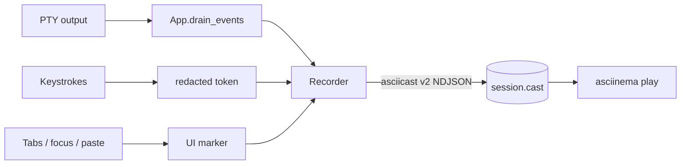

# Developer session recorder (`dev-record`)

A maintainer-only diagnostics recorder, **compiled out of every released /
packaged build**. It writes an [asciicast v2](https://docs.asciinema.org/manual/asciicast/v2/)
trace of a kettle session that replays with `asciinema play`.

## Enabling

The recorder only exists in builds made with the `dev-record` Cargo feature:

```sh
cargo run --features dev-record -- --record /tmp/session.cast
# or:
KETTLE_RECORD=/tmp/session.cast cargo run --features dev-record
```

Released binaries (and anything built without the feature) contain **none** of
the recorder code — no flag, no overhead, no attack surface. Recording is never
on by default and never starts on first launch.

> **Shared recorder.** The trace writer now lives in `kettle-core` behind the
> `asciicast` feature, so it backs two front-ends: the GUI's `--record` (full
> trace — output, input tokens, and `m` markers) and the new headless
> `kettle exec --record run.cast` (output-only — no window, no keystroke or
> marker channel). See [AGENT.md](AGENT.md) for `kettle exec`.

## What it captures

| asciicast code | kettle records |
|---|---|
| `o` | terminal output (verbatim) |
| `r` | grid resize (`COLSxROWS`) |
| `i` | keystroke **tokens** — named keys / chords (`Enter`, `Ctrl+c`), printables redacted |
| `m` | kettle UI/UX markers (`kettle:tab_add`, `kettle:focus_out`, `kettle:paste len=N`, …) |

The `m` markers capture state the PTY output stream can't — kettle's own tab
bar, overlays, and focus — across both **interactive** (tab add/close) and
**non-interactive** (window focus) transitions. Agent control actions are
annotated here too: while recording, each method an agent runs over the control
server lands as a `kettle:agent <method> conn=N` marker (see
[AGENT.md](AGENT.md)).

## Privacy

A terminal can't reliably detect a typed password (the PTY *master* never sees
the child's `ECHO` flag), so the recorder is conservative by default:

- **Output is captured verbatim and cannot be redacted.** The `o` channel
  records everything the terminal displays — a terminal can't tell a secret from
  normal output — so anything printed or echoed on screen during recording
  (`cat ~/.ssh/id_rsa`, `env` showing `AWS_SECRET_ACCESS_KEY`, a token echoed by
  a CLI, or a password at a prompt that left echo on) lands in the trace in
  cleartext. This is the largest exposure surface — **review/scrub a `.cast`
  before sharing it.**
- **Keystrokes are redacted to tokens.** A typed password is recorded as its
  length + timing (`······`), never the characters. `--record-raw-input`
  (or `KETTLE_RECORD_RAW_INPUT=1`) opts into literal capture — ⚠ the trace can
  then contain typed secrets; leave it off unless you need byte-exact input.
- **Pasted content is never recorded** — only a `kettle:paste len=N` marker.
- An always-visible **`● REC`** indicator sits in the title bar.
- The trace file is local-only (`0600` on Unix); kettle never uploads it. Writes
  are best-effort — a full disk disables the recorder, it never crashes kettle.

## Data flow


