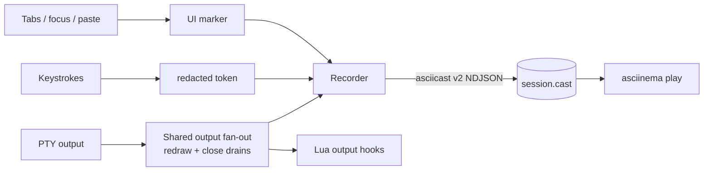

# Developer session recorder (`dev-record`)

A maintainer-only GUI diagnostics recorder, **compiled out of every released /
packaged GUI build**. It writes an [asciicast v2](https://docs.asciinema.org/manual/asciicast/v2/)
trace of a Kettle session that replays with `asciinema play`. The shared,
output-only writer remains available to the released `kettle exec --record`
command; automatic GUI recording does not.

## Enabling

The recorder only exists in builds made with the `dev-record` Cargo feature:

```sh
cargo run --features dev-record -- --record /tmp/session.cast
# or:
KETTLE_RECORD=/tmp/session.cast cargo run --features dev-record
# create the directory if missing and allocate a unique cast:
cargo run --features dev-record -- --record-dir /tmp/kettle-records
KETTLE_RECORD_DIR=/tmp/kettle-records cargo run --features dev-record
```

On Linux maintainer machines, the user-local launcher can be synced to a
dev-record build so Ubuntu/GNOME Super-key launches record automatically:

```sh
just install-local-dev-record
```

By default this writes traces under `~/.cache/kettle/records`; pass
the directory as the recipe argument to use a different local location:

```sh
just install-local-dev-record /path/to/records
```

Target precedence is fixed: `--record`, `--record-dir`, legacy
`KETTLE_RECORD`, then `KETTLE_RECORD_DIR`. `--record PATH` and
`KETTLE_RECORD=PATH` preserve their historical behavior: an existing directory
gets managed-directory behavior, while any other path is an explicit file.
`--record-dir` and `KETTLE_RECORD_DIR` always mean a directory, including when
it does not exist yet. Empty environment variables are ignored.

Released binaries (and anything built without the feature) contain **none** of
the GUI recording flag, hooks, or automatic launcher behavior. Recording is
never on by default and never starts on first launch.

## Storage bounds and ownership

Managed recording directories are created with mode `0700` on Unix. Each cast
uses a collision-safe `kettle-session-<time>-<pid>-<counter>.cast` name,
`create_new`, an exclusive active-file lock, and mode `0600`. Two launches in
the same second therefore cannot truncate or interleave one another. An
explicit file retains the established overwrite behavior, but Kettle obtains
its exclusive lock before truncating it; a second active writer is refused.

Each session stops at a complete NDJSON event boundary before 512 MiB. When
space permits, its last event is a `kettle:record_limit` marker. The native
title changes from `[REC]` to `[REC LIMIT]`. A startup, write, or flush failure
uses `[REC ERROR]` and emits one desktop notification in the same event-loop
turn. Neither condition terminates the terminal session.

Starting a managed recording prunes the new `kettle-session-*.cast` namespace
toward budgets of 50 files and 5 GiB. Kettle removes the oldest unlocked files
first and never removes an active file. Pre-existing `session-*.cast` files,
unrelated files, symlinks, and unrecognized names are not managed or deleted.
If active/unreadable files keep the managed namespace above its budget,
recording continues and the condition is logged rather than deleting uncertain
data.
Kettle refuses a symbolic-link recording file or directory. The Linux
installer also rejects a symbolic-link directory and verifies that
`--skip-build --record-dir` points to a binary that actually contains the
`dev-record` feature before marking the install `local-dev-record`.

Source installs are marked `local-dev` or `local-dev-record`; only release
tarball/online installs are marked `stable`. The signed self-updater refuses a
local development marker so it cannot replace a feature build with a public
binary and silently disable recording. Re-run `just install-local-dev-record`
from the checkout to update the installed development build.

Bare Super-key/desktop launches join the existing primary Kettle process and
open another window in its shared recording. The activation handshake compares
a bounded fingerprint of the file/directory target plus the raw-input policy;
it never transmits the recording path. A mismatch opens a separate process
instead of silently recording to the wrong destination or changing redaction.
Use `kettle --new-process` when an intentionally isolated default session is
needed.

> **Shared recorder.** The trace writer now lives in `kettle-core` behind the
> `asciicast` feature, so it backs two front-ends: the GUI's `--record` (full
> trace — output, input tokens, and `m` markers) and the new headless
> `kettle exec --record run.cast` (output-only — no window, no keystroke or
> marker channel). Both use the same 512 MiB event boundary, no-link checks,
> and private-file writer. `kettle exec` fails closed with status 125 if the
> requested file cannot be secured before the child is started; a later
> disk/write failure stops capture without killing an already running child.
> See [AGENT.md](AGENT.md) for `kettle exec`.

## What it captures

| asciicast code | kettle records |
|---|---|
| `o` | terminal output (verbatim) |
| `r` | grid resize (`COLSxROWS`) |
| `i` | keystroke **tokens** — named keys / chords (`Enter`, `Ctrl+c`), printables redacted |
| `m` | kettle UI/UX markers (`kettle:tab_add`, `kettle:focus_out`, `kettle:paste len=N`, …) |

The `m` markers capture state the PTY output stream can't — kettle's own tab
bar, overlays, and focus — across both **interactive** (tab add/close) and
**non-interactive** (window focus) transitions. Agent control actions are
annotated here too: while recording, each method an agent runs over the control
server lands as a `kettle:agent <method> conn=N` marker (see
[AGENT.md](AGENT.md)).

## Privacy

A terminal can't reliably detect a typed password (the PTY *master* never sees
the child's `ECHO` flag), so the recorder is conservative by default:

- **Output is captured verbatim and cannot be redacted.** The `o` channel
  records everything the terminal displays — a terminal can't tell a secret from
  normal output — so anything printed or echoed on screen during recording
  (`cat ~/.ssh/id_rsa`, `env` showing `AWS_SECRET_ACCESS_KEY`, a token echoed by
  a CLI, or a password at a prompt that left echo on) lands in the trace in
  cleartext. This is the largest exposure surface — **review/scrub a `.cast`
  before sharing it.**
- **Keystrokes are redacted to tokens.** A typed password is recorded as its
  length + timing (`······`), never the characters. `--record-raw-input`
  (or `KETTLE_RECORD_RAW_INPUT=1`) opts into literal capture — ⚠ the trace can
  then contain typed secrets; leave it off unless you need byte-exact input.
- **Pasted content is never recorded** — only a `kettle:paste len=N` marker.
- The native window title carries **`[REC]`** while capture is active and
  retains the limit/I/O stop states described above. Borderless and fullscreen
  modes can hide OS title decorations, so recording errors also emit a desktop
  notification when the platform notification service is available.
- The trace file is local-only (`0600` on Unix); kettle never uploads it. Writes
  are best-effort — a full disk disables the recorder, it never crashes kettle.

## Data flow


