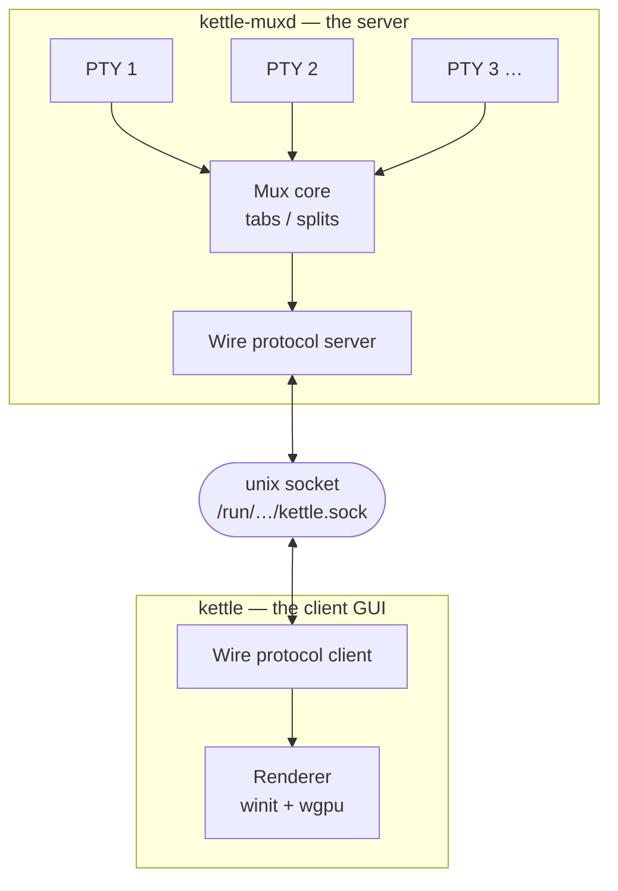

# Detachable mux server — design

> Status: the standalone **`kettle-muxd` daemon is unimplemented**. The
> protocol / transport / discovery / client **seam** it depends on, however,
> has already shipped in the **kettle-ctl** crate (the agent control plane —
> see [AGENT.md](AGENT.md)). What remains is the daemon itself: the binary that
> re-hosts the server side and owns PTYs cross-process. That is a genuine
> multi-week thread; this doc is the architecture + phased roadmap so the
> work can land as a series of small, testable steps instead of one heroic
> push.

## What it is

A standalone `kettle-muxd` process owns long-running PTYs (shells, ssh
sessions, build watchers) so the user can disconnect their kettle GUI
and reconnect later — possibly from a different machine — without
killing the underlying processes. Same shape as `tmux` and WezTerm's
remote-attach mode.

End-state UX:

```bash
# Machine A:
kettle --serve /run/user/$(id -u)/kettle.sock &
kettle --attach /run/user/$(id -u)/kettle.sock
# kettle GUI opens, spawns a shell, user runs a long build.
# User closes the GUI window. The build keeps running.

# Later (same or different machine via ssh tunnel):
kettle --attach /run/user/$(id -u)/kettle.sock
# kettle GUI reopens. The previous tabs/panes are restored,
# including the build's accumulated scrollback.
```

## Why it's a multi-week thread

Three independent hard problems:

1. **Server runtime.** A long-lived process that owns PTYs, services
   clients over a socket, handles auth, survives client disconnects,
   and shuts down cleanly on signal. Not a kettle thing today —
   today's kettle assumes a one-process-per-window model.

2. **Wire protocol.** Bidirectional, framed binary protocol that
   carries: pane creation, PTY input, PTY output (high-bandwidth),
   resize, focus, tab/split tree state, scrollback replay.
   Versioned for forward-compat as kettle evolves.

3. **Client reattach UX.** When a client attaches, it needs to:
   - Authenticate (token? SSH-forwarded socket? both?).
   - Receive the current tab/split tree as a snapshot.
   - Receive recent scrollback per pane (how much? configurable cap).
   - Start streaming live PTY output.
   - Send user input.
   - Cleanly disconnect without killing the server.

Each is multi-day. Combined: multi-week.

## Architecture



### Where today's code lives vs the split

| Today | After mux server |
|------|------|
| `kettle-core::Terminal` (owns PTY + alacritty_terminal) | Stays in the server |
| `kettle-ui::Mux` (tab/split tree) | Stays in the server |
| `kettle-ui::App` (winit event loop + renderer integration) | Stays in the client |
| `kettle-render` (wgpu + glyphon) | Stays in the client |
| `kettle-ctl` (control-plane protocol / transport / discovery / client) | Already factored out — UI-free; the daemon would re-host its server side |

The split is roughly along the "what knows about PTYs" line.

## Wire protocol sketch

Length-prefixed framed messages. Each frame:

```
[4 bytes BE u32 length][1 byte version][1 byte type][payload]
```

Message types (server → client):

- `1` **Hello**: server version, supported feature flags, current
  session id.
- `2` **TabAdd / TabClose / TabFocus**: tab tree mutations.
- `3` **PaneAdd / PaneClose / PaneResize / PaneFocus**: pane tree
  mutations.
- `4` **PaneOutput**: chunk of PTY output for a named pane. The
  high-bandwidth message; expect 100s/sec under load.
- `5` **Scrollback**: replay of recent scrollback for a pane,
  sent on attach.
- `6` **Bye**: server is shutting down (signal received).

Client → server:

- `1` **Hello**: client version, supported feature flags, auth token.
- `2` **PaneInput**: bytes the user typed into a pane.
- `3` **PaneResize**: pane resized to (cols, rows) — server resizes
  the PTY.
- `4` **NewTab / NewWindow / Split**: user-action requests.
- `5` **Bye**: client detaching cleanly.

Same line-prefixed framing as kettle-ctl's NDJSON remote-control
protocol, just binary + bidirectional. Use `bincode` or hand-rolled
serde for the payloads.

### Why not gRPC / protobuf

- Adds 5+ MB to the binary.
- Generated code is hard to read.
- We control both ends; a hand-rolled protocol is 200 lines + 20 tests.
- Versioning via the 1-byte version field is sufficient for forward-
  compat (add new message types; client negotiates feature flags in
  Hello).

## Phased roadmap

| # | When | Scope |
|---|------|------|
| 1 | this doc | Design + roadmap. No code. |
| 2 | next | Hand-roll the wire protocol as a pure module: `kettle-mux-proto` crate with `Message` enum, `Encoder` + `Decoder`, 30+ unit tests covering every message type, partial-frame handling, version mismatch. |
| 3 | next+1 | Server skeleton: `kettle-muxd` binary that opens a Unix socket, accepts connections, runs the Hello handshake. No PTYs yet. |
| 4 | next+2 | Move `kettle_core::Terminal` ownership into the server. PTYs spawn there; their output streams to connected clients via `PaneOutput`. |
| 5 | next+3 | Move `kettle_ui::Mux` into the server. Tab/split tree mutations originate from client requests + flow back to all attached clients. |
| 6 | next+4 | Client: `kettle --attach SOCKET`. New `kettle_ui::App` mode that consumes wire-protocol messages instead of local PTYs. Renderer code stays untouched. |
| 7 | next+5 | Scrollback replay on attach. Server caches the last N MB per pane (configurable; default 1 MB); sends a `Scrollback` message right after Hello. |
| 8 | next+6 | Auth: per-session token written to a file alongside the socket on first launch; client reads + sends in Hello. Same shape as how Jupyter notebooks auth their HTTP server. |
| 9 | next+7 | Graceful detach: client sends `Bye`; server closes the connection without killing PTYs. PTYs survive until `--shutdown` is sent. |
| 10 | next+8 | Multi-client support: two `kettle --attach` simultaneously see the same panes + see each others' input (the same fan-out as kettle's existing per-tab broadcast). |
| 11 | next+9 | Cross-machine: SSH-tunnel the Unix socket. Document the `ssh -L` recipe. |
| 12 | next+10 | systemd user-unit for the server. `systemctl --user enable kettle-muxd` brings it up on login. |
| 13 | next+11 | End-to-end acceptance test: server up, attach, type, detach, reattach, verify scrollback continuity. |

## Architecture choices to make explicit

### Why a separate binary, not a kettle subcommand

`kettle --serve` is tempting but conflates two distinct lifecycles:

- The client GUI exits when the user closes the window.
- The server should outlive any client.

Conflating them means the server's lifecycle is tangled with whether
the GUI happens to be open. A separate `kettle-muxd` binary cleanly
splits the two — same model as `sshd`, `tmux server`, `wezterm-mux-server`.

The kettle GUI binary can still LAUNCH the server transparently
(`kettle --attach AUTO_START` spawns kettle-muxd if the socket
doesn't exist) but the lifecycles stay separated.

### Why Unix socket, not TCP

- Unix sockets carry filesystem permissions (mode 0600 = single-user).
  TCP needs auth-token-only.
- localhost-only by default. Remote attach via `ssh -L`.
- Already cross-platform (Unix sockets work on Windows 10+, macOS, Linux).

### Why not just use tmux as the mux

A `kettle + tmux` combo gives most of this for free: tmux owns the
PTYs + the mux state; kettle's tmux-cc integration lets
kettle render tmux's state. Many users won't need a separate kettle
mux server.

The reason kettle ships its own anyway:

- Native scrollback + image protocol passthrough on reattach.
  tmux does not pass the Kitty graphics protocol through. SIXEL is available
  only with tmux 3.4 or newer built using `--enable-sixel`, after declaring
  Kettle's outer `xterm-256color:sixel` terminal feature; older and
  non-SIXEL builds need a text fallback or the image command run outside tmux.
  tmux also needs nonzero outer-terminal pixel geometry; tmux 3.5a or newer is
  preferred across WSL/ConPTY because it can query when the tty ioctl omits it.
  See [terminal client compatibility](TERMINAL-CLIENT-COMPATIBILITY.md#tmux-and-full-screen-clients).
- Native config sharing: a `--profile dev` config applies to both the
  server's panes + the client's chrome without a tmux-config detour.
- Native key-binding semantics: keystrokes go to the server with
  their full xterm-modifier-table encoding, not the lossy
  tmux `send-keys` form.

These each matter for users invested in kettle's specific features.

## What ships now

- This document.
- The **kettle-ctl** crate — the agent control plane (see
  [AGENT.md](AGENT.md)). It already provides the protocol + transport +
  discovery + client **seam** this design reserves, including the discovery
  registry's reserved `kind` field (`"gui"` today, `"muxd"` later) that a
  future `kettle-muxd` daemon would re-host. Its NDJSON request / response /
  event protocol is the natural client / control layer for the daemon; the
  binary length-prefixed `PaneOutput` frame sketched below would remain a
  muxd-internal high-bandwidth stream where the NDJSON line protocol is the
  wrong fit. This partially satisfies the "hand-roll the wire protocol"
  phase in the roadmap table below — the request / response / event shape
  exists; the high-rate binary framing does not.
- The standalone `kettle-muxd` daemon — **not yet**. The implementation is
  real multi-week work and shipping a non-functional `--serve` flag would
  mislead users.

The tmux-cc parser is the closest existing parser piece (it already does the
"parse a control protocol from a byte stream" shape this design needs) and can
serve as a template for the high-bandwidth `PaneOutput` framing.

## See also

- WezTerm's mux protocol: <https://wezterm.org/multiplexing.html>
- tmux's control mode: <https://github.com/tmux/tmux/blob/master/control.c>
- Zellij's session-resurrection model:
  <https://zellij.dev/documentation/session-resurrection>
