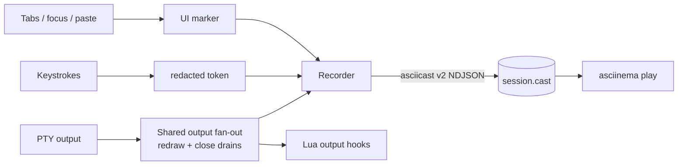

# Session recording

Kettle can record a session to an [asciicast v2](https://docs.asciinema.org/manual/asciicast/v2/)
trace that replays with `asciinema play`. Recording is a **runtime toggle
present in every build** — off by default, enabled per-launch with a flag or
persistently with a config key. (The same asciicast writer also backs the
headless `kettle exec --record` command.)

> **Recording captures on-screen output verbatim.** A terminal cannot tell a
> secret from normal output, so review a `.cast` before sharing it. See
> [Privacy](#privacy) below.

## Enabling

Per-launch (one-shot, wins over the config keys):

```sh
kettle --record /tmp/session.cast
# or via the environment:
KETTLE_RECORD=/tmp/session.cast kettle
# create the directory if missing and allocate a unique cast per launch:
kettle --record-dir /tmp/kettle-records
KETTLE_RECORD_DIR=/tmp/kettle-records kettle
```

Persistently, in your config file (`<config-dir>/kettle/config`):

```ini
record = on
# where traces are written (default <config-dir>/recordings):
record-dir = ~/.cache/kettle/records
```

Target precedence is fixed: `--record`, `--record-dir`, `KETTLE_RECORD`,
`KETTLE_RECORD_DIR`, then the `record`/`record-dir` config keys. `--record PATH`
and `KETTLE_RECORD=PATH` preserve historical behavior: an existing directory
gets managed-directory behavior, while any other path is an explicit file.
`--record-dir` / `KETTLE_RECORD_DIR` / `record-dir` always mean a directory,
including when it does not exist yet. Empty environment variables are ignored.
`record = on` with no explicit path records into `<config-dir>/recordings`.

On Linux, a **source install** can wire a recording directory into the Super-key
launcher so desktop launches record automatically:

```sh
just install-recording                 # ~/.cache/kettle/records
just install-recording /path/to/records
# equivalently: ./scripts/install.sh --record-dir=/path/to/records
```

This sets `KETTLE_RECORD_DIR` in the generated `.desktop` entry. It is refused on
a self-updating **release** install because the `.desktop` `Exec=` line is
regenerated from the template on every update, which would silently drop the
wiring — use the config key `record = on` there instead (it lives in the config
file and survives updates, the same effect).

## Storage bounds and ownership

Managed recording directories are created with mode `0700` on Unix. Each cast
uses a collision-safe `kettle-session-<time>-<pid>-<counter>.cast` name,
`create_new`, an exclusive active-file lock, and owner-only permissions:
`0600` on Unix or a protected current-user DACL on Windows. Two launches in the
same second therefore cannot truncate or interleave one another. An explicit
file retains the established overwrite behavior, but Kettle secures and locks
it before truncating it; a second active writer is refused. Unix symbolic links
and Windows reparse-point files or parent directories are refused before an
explicit or managed recording file is opened.

Each session stops at a complete NDJSON event boundary before 512 MiB. When
space permits, its last event is a `kettle:record_limit` marker. The native
title changes from `[REC]` to `[REC LIMIT]`. A startup, write, or flush failure
uses `[REC ERROR]` and emits one desktop notification in the same event-loop
turn. Neither condition terminates the terminal session.

Starting a managed recording prunes the new `kettle-session-*.cast` namespace
toward budgets of 50 files and 5 GiB. Kettle removes the oldest unlocked files
first and never removes an active file. Pre-existing `session-*.cast` files,
unrelated files, symlinks, and unrecognized names are not managed or deleted.
If active/unreadable files keep the managed namespace above its budget,
recording continues and the condition is logged rather than deleting uncertain
data. Kettle refuses a symbolic-link recording file or directory, and the Linux
installer refuses a symbolic-link `--record-dir`.

Bare Super-key/desktop launches join the existing primary Kettle process and
open another window in its shared recording. The activation handshake compares
a bounded fingerprint of the file/directory target plus the raw-input policy;
it never transmits the recording path. A mismatch opens a separate process
instead of silently recording to the wrong destination or changing redaction.
Use `kettle --new-process` when an intentionally isolated default session is
needed.

> **Shared recorder.** The trace writer lives in `kettle-core` (the `asciicast`
> feature, compiled into every build), so it backs two front-ends: the GUI's
> `--record` / `record = on` (full trace — output, input tokens, and `m`
> markers) and the headless `kettle exec --record run.cast` (output-only — no
> window, no keystroke or marker channel). Both use the same 512 MiB event
> boundary, no-link checks, and private-file writer. `kettle exec` fails closed
> with status 125 if the requested file cannot be secured before the child is
> started; a later disk/write failure stops capture without killing an already
> running child. See [AGENT.md](AGENT.md) for `kettle exec`.

## What it captures

| asciicast code | kettle records |
|---|---|
| `o` | terminal output (verbatim) |
| `r` | grid resize (`COLSxROWS`) |
| `i` | keystroke **tokens** — named keys / chords (`Enter`, `Ctrl+c`), printables redacted |
| `m` | kettle UI/UX markers (`kettle:tab_add`, `kettle:focus_out`, `kettle:paste len=N`, …) |

The `m` markers capture state the PTY output stream can't — kettle's own tab
bar, overlays, and focus — across both **interactive** (tab add/close) and
**non-interactive** (window focus) transitions. Agent control actions are
annotated here too: while recording, each method an agent runs over the control
server lands as a `kettle:agent <method> conn=N` marker (see
[AGENT.md](AGENT.md)).

## Privacy

A terminal can't reliably detect a typed password (the PTY *master* never sees
the child's `ECHO` flag), so the recorder is conservative by default:

- **Output is captured verbatim and cannot be redacted.** The `o` channel
  records everything the terminal displays — a terminal can't tell a secret from
  normal output — so anything printed or echoed on screen during recording
  (`cat ~/.ssh/id_rsa`, `env` showing `AWS_SECRET_ACCESS_KEY`, a token echoed by
  a CLI, or a password at a prompt that left echo on) lands in the trace in
  cleartext. This is the largest exposure surface — **review/scrub a `.cast`
  before sharing it.**
- **Keystrokes are redacted to tokens.** A typed password is recorded as its
  length + timing (`······`), never the characters. `--record-raw-input`
  (`KETTLE_RECORD_RAW_INPUT=1`, or `record-raw-input = on`) opts into literal
  capture — ⚠ the trace can then contain typed secrets; leave it off unless you
  need byte-exact input. The window title shows **`[REC RAW]`** while raw
  capture is active so it is never silent.
- **Pasted content is never recorded** — only a `kettle:paste len=N` marker.
- The native window title carries **`[REC]`** while capture is active and
  retains the limit/I/O stop states described above. Borderless and fullscreen
  modes can hide OS title decorations, so recording errors also emit a desktop
  notification when the platform notification service is available.
- The trace file is local-only (`0600` on Unix; protected current-user DACL on
  Windows); kettle never uploads it. Writes are best-effort — a full disk
  disables the recorder, it never crashes kettle.

## Data flow


