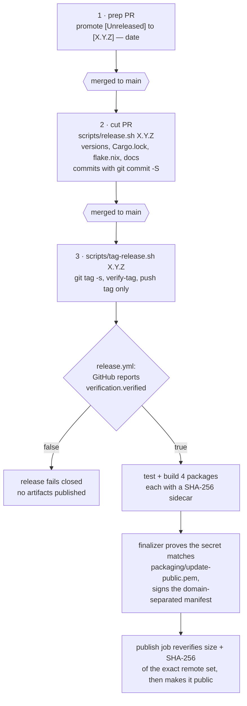

# Releasing

The maintained release procedure is **two pull requests and one signed,
annotated tag**, in that order. The two-PR split is project policy;
`scripts/release.sh` validates repository state but does not query GitHub to
prove that a separate prep pull request was merged.



The gate after the tag is the one that catches a mistake late: a tag signed
with a key GitHub does not know is *locally* valid and still fails the
release. See [Signing prerequisites](#signing-prerequisites).

The macOS package additionally uses the protected `macos-signing` environment.
Its Developer ID and App Store Connect API-key contract is documented in
[`packaging/macos/README.md`](../packaging/macos/README.md); the workflow signs,
notarizes, staples, and Gatekeeper-assesses the app before creating its ZIP.

### macOS appearance gate

Before merging the release-cut pull request, run its universal `.app` on a
native macOS 26 or later desktop and record screenshots containing a decorated
Kettle window plus the running and closed-but-pinned Dock icon. Check the window
treatment and icon details that unit and image tests cannot establish:

- with the default 86% background opacity and native blur enabled, one material
  reaches both rounded top corners without a clear strip or seam; resize the
  window and round-trip full screen, then confirm the traffic lights, drag
  region, first terminal row, and pointer targets remain in their native
  positions;
- repeat the full-screen round trip with `borderless = true`; the terminal must
  remain visible through the documented sharp-alpha fallback instead of being
  covered by a material view;
- with alpha transparency still enabled, disable native blur and confirm AppKit
  draws its standard titlebar backdrop instead of exposing a fully clear desktop
  strip; return to an opaque surface, leave blur enabled once to confirm it does
  not create a titlebar-only material seam, and switch between a light and dark
  theme to prove the NSWindow background follows palette changes;
- **start** a window on a light theme rather than toggling into one, with the
  system in dark mode, and confirm the title sits beside the traffic lights
  rather than across them. Startup and the runtime toggle apply the appearance
  at different points and only one of them can lose AppKit's titlebar caption;
  the toggle passing says nothing about startup, which is how
  [#251](https://github.com/Reddimus/kettle/issues/251) reached a release;
- toggle Reduce Transparency while the blurred window is open; the material
  must disappear immediately, the theme background must become opaque, and both
  must return when the setting is restored;
- set `background-opacity = 1.0` and `window-blur = false`, then confirm the
  active theme reaches both rounded top corners without a clear or mismatched
  strip;
- the running, closed, Finder and app-switcher icons agree; both 256 px
  appearances keep the system mask and inset face parallel with clear rim
  space; and the `>_` mark remains centered and legible at normal and magnified
  Dock sizes.

Record each run in [`APPEARANCE-GATE.md`](APPEARANCE-GATE.md), including the
checks that did not run and why.

The package compiles `packaging/macos/AppIcon.icon` through Xcode's asset
pipeline with a macOS 11 deployment target. The emitted asset catalog and loose
fallback must be present before the app is signed. Record an unavailable macOS
26 host as a skipped release check; do not infer this appearance from source
alpha, `actool` success, or a Linux CI run.

The package job runs on `macos-26` and
`scripts/compile-macos-app-icon.sh` selects the newest installed Xcode 26.x
toolchain explicitly. Do not move icon compilation back to `macos-15`: its
default Xcode 16.4 emits no Icon Composer artifacts, while its installed Xcode
26.3 Asset Catalog agent crashes against the older host frameworks. A focused
pull-request job runs the exact `macos-26` release-host path in addition to the
normal current-macOS CI leg. The major-version pin also prevents a future Xcode
27 preview from silently changing release assets.

### macOS update gate

Also before merging the release-cut pull request, run:

```sh
just macos-update-smoke
```

This downloads the current published `kettle-macos-universal.zip`, checks it
against its sidecar, and drives the real bundle updater over it with the real
`codesign` and `spctl`. Unit tests cover staging, refusal, and the swap with a
stub verifier, because nothing in CI can notarize a synthesized bundle. Only
this check proves the assumption underneath the design: that a published archive
still satisfies Gatekeeper after plain zip extraction and an atomic swap.

It runs against the *previous* release, which is the point. It tells you the
archive shape the updater expects has not drifted before you publish another one
built the same way. Record an unavailable network or `gh` login as a skipped
release check.

## 1. Merge the changelog prep pull request

Create `release/prep-vX.Y.Z` from synchronized `main`. Promote
`## [Unreleased]` to `## [X.Y.Z] — YYYY-MM-DD` (with an em dash), restore an
empty `## [Unreleased]` placeholder, and change only `CHANGELOG.md`. Merge that
pull request before preparing the release commit.

This ordering closes the tag-before-changelog race recorded in
`scripts/release.sh`: the release workflow once reached its platform jobs before
one job rejected the missing version heading.

## 2. Merge the signed release-cut pull request

Create `release/vX.Y.Z-cut` from the now-synchronized `main`, then run from the
repository root:

```bash
scripts/release.sh X.Y.Z
```

The script requires a clean topic branch, the dated changelog heading, and no
local or remote `vX.Y.Z` tag. It updates the workspace and inter-crate versions,
`Cargo.lock`, the release version in `flake.nix`, and the maintained version
references in `README.md`, `docs/INSTALL.md`, and `docs/VERSION-HISTORY.md`. It
runs `cargo build --workspace --quiet`, stages its files, and unconditionally
creates the release commit with `git commit -S`. A missing or unusable signing
identity therefore aborts the script; release commits cannot be unsigned when
created by this path.

The script neither pushes the branch nor creates a tag. Review the signed
commit, push the topic branch, and merge its pull request only after required CI
passes.

## 3. Create the signed release tag

After synchronizing local `main`, run:

```bash
scripts/tag-release.sh X.Y.Z
```

The script fetches `origin/main` and tags, then requires a clean `main` exactly
equal to `origin/main`, matching versions in `Cargo.toml` and `CHANGELOG.md`, and
no remote tag with that name. It creates an annotated tag with `git tag -s`,
runs `git verify-tag`, and pushes only that tag.

If an earlier attempt created the local tag but failed before pushing, rerun the
same command after fixing the cause. `tag-release.sh` reuses the tag only after
checking that it is annotated, points to the current `HEAD`, and passes
`git verify-tag`. Delete the local tag only when one of those checks shows that
it is the wrong tag.

If a pushed tag fails before any release record is created and the fix changes
the tagged commit, a workflow rerun cannot contain that fix. First verify that
the releases API contains no public **or draft** release for the tag. After the
fix merges to `main`, delete only that failed tag locally and remotely, then run
`tag-release.sh` again so it creates a new signed tag at synchronized `main`.
The script deliberately refuses to overwrite a remote tag. If any release
record exists, do not move the tag; ship the correction as a patch release.

### Signing prerequisites

Both the release commit and tag need a Git signing identity. Release CI adds a
separate requirement for the tag: GitHub's tag-object API must report
`verification.verified: true`. GitHub can verify registered GPG keys as well as
SSH keys registered with key type **Signing Key**. The workflow checks the tag's
GitHub verdict; it does not check the release commit's GitHub verification
status.

Inspect the configured format, identity, and key before starting:

```bash
git config --get gpg.format || printf '%s\n' openpgp
git config --get user.email
git config --get user.signingkey
```

For SSH signing, confirm the public key and local verifier configuration:

```bash
ssh-keygen -lf "$(git config --get user.signingkey)"
allowed_signers=$(git config --path --get gpg.ssh.allowedSignersFile)
test -n "$allowed_signers" && test -r "$allowed_signers"
```

`gpg.ssh.allowedSignersFile` is required by Git's **SSH** signature verifier; it
is not a GPG-signing requirement. For GPG signing, confirm that the configured
secret key is available instead:

```bash
gpg --list-secret-keys "$(git config --get user.signingkey)"
```

In either format, exercise local tag verification and inspect GitHub's verdict
for a previous tag signed with the key you intend to reuse:

```bash
previous=v2.54.0
git verify-tag "$previous"
tag_object=$(git rev-parse "$previous")
gh api "repos/{owner}/{repo}/git/tags/${tag_object}" \
  --jq '.verification | {verified, reason}'
```

The expected API result is `verified: true` with `reason: valid`. A successful
local verification alone does not prove GitHub knows the key. Register the GPG
key, or add the SSH public key under GitHub Settings -> SSH and GPG keys as a
signing key, before pushing the new tag.

## What the tag triggers

For a `v*` tag, `.github/workflows/release.yml` first requires a GitHub-verified
annotated tag pointing at `origin/main` and checks the tag, `Cargo.toml`,
`flake.nix`, and `CHANGELOG.md` versions. It then tests and builds four packages:
Linux x86_64, Linux aarch64, macOS universal, and Windows x86_64. Each package
gets a canonical SHA-256 sidecar. All four are named in the signed update
manifest; macOS appears as `universal-apple-darwin`, since one archive covers
both Apple architectures.

The `release-signing` environment supplies `KETTLE_UPDATE_SIGNING_KEY_PEM`. The
finalizer proves that secret matches `packaging/update-public.pem`, signs the
domain-separated update manifest, and stages the exact release set. The publish
job reverifies those files, creates or resumes a draft release, uploads and
checks the exact remote size/SHA-256 set, and only then makes the release public.

## Verify the published artifacts

Run this from a trusted source checkout so the public key comes from the
repository, not from the release being verified:

```bash
tag=vX.Y.Z
repo_root=$(git rev-parse --show-toplevel)
public_key="$repo_root/packaging/update-public.pem"
verify_dir=$(mktemp -d "${TMPDIR:-/tmp}/kettle-verify.XXXXXX")

gh release download "$tag" --repo Reddimus/kettle --dir "$verify_dir"
(
  cd "$verify_dir"
  for sidecar in *.sha256; do
    shasum -a 256 -c "$sidecar"
  done

  payload=$(mktemp)
  signature=$(mktemp)
  trap 'rm -f "$payload" "$signature"' EXIT
  printf 'kettle-update-manifest-v1\0' > "$payload"
  cat kettle-update-manifest.json >> "$payload"
  openssl base64 -d -A \
    -in kettle-update-manifest.json.sig -out "$signature"
  test "$(wc -c < "$signature" | tr -d '[:space:]')" -eq 64
  openssl pkeyutl -verify -rawin -pubin -inkey "$public_key" \
    -in "$payload" -sigfile "$signature"
)
```

`packaging/update-public.pem` is deliberately not a release asset: downloading
a replacement key from the same channel as the files would not provide an
independent trust root. The `kettle-update-manifest-v1\0` prefix is the domain
separator covered by the Ed25519 signature; verifying the bare JSON instead is
expected to fail.

## Known gaps

- The protected `macos-signing` environment is provisioned, and a native arm64
  rehearsal using its Developer ID certificate and App Store Connect API key
  was accepted by Apple's notary service. Its stapled ticket survived the final
  `ditto` archive/extract round trip, Gatekeeper accepted the extracted app, and
  the executable launched. That proves the credentials and signing order, but
  it is not a substitute for the release workflow's universal artifact. Before
  calling the first signed release ready, run the native appearance and
  Gatekeeper checks above against that official-tag archive.
- `scripts/verify-release-assets.py` intentionally accepts only draft-release
  API responses. It protects the publish transition in `release.yml`; after
  publication, use the sidecars and signed-manifest procedure above.
