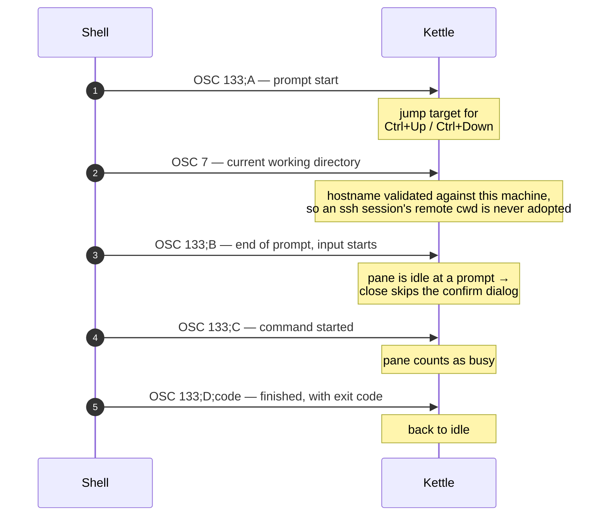

# Shell integration (OSC 133)

Kettle understands **OSC 133** prompt marks. When your shell emits them, Kettle
records where each prompt started so you can jump
between commands:

| Action | Default bind |
|---|---|
| Jump to previous prompt | `Ctrl+Up` |
| Jump to next prompt | `Ctrl+Down` |

(Rebind with `keybind = ctrl+up=prev_prompt` / `next_prompt`.)

Marks are parsed out of the PTY stream ahead of the VT engine, so they never
corrupt the screen even on terminals/apps that don't understand them.

## Automatic integration: default PowerShell only

Since v2.30.0, `shell-integration = on` is the default. Automatic injection is
currently implemented only when Windows Kettle selects `pwsh` or
`powershell` as its default shell:

- **OSC 7** (current working directory) — so the tab/title tracks `cd` and new
  tabs / splits inherit the directory.
- **OSC 133** prompt marks (and **OSC 9;9**) — so prompt-jump (`Ctrl+Up` /
  `Ctrl+Down`) and prompt-aware close-confirmation work.

Kettle launches that shell with an encoded copy of `kettle.ps1`. The user's
PowerShell profile loads first; Kettle then wraps the resulting prompt, so
Starship, oh-my-posh, and posh-git remain in place. No `$PROFILE` edit is
required. `cmd.exe` is not injected because Kettle can read its changing
process working directory directly.

Automatic injection does **not** currently cover:

- native Linux or macOS bash, zsh, or fish;
- a Linux shell launched through `command = wsl.exe ...`;
- any explicit `command = ...`, including explicit PowerShell; or
- any shell when `shell-integration = off`.

Those cases need the one-line install below. In particular, install the snippet
inside the WSL distribution whose shell will emit the marks; changing the
Windows PowerShell profile does not configure a Linux shell in WSL.

See the **`shell-integration`** key in [CONFIG.md](CONFIG.md) (bool, default
`on`) to toggle it.

## Enabling it manually in your shell

Use this section for Unix shells, WSL shells, an explicit `command =`, or a
deliberately disabled automatic hook. Default PowerShell users can normally
skip it.

### One-liner (recommended)

Kettle embeds the canonical snippets in the binary. Install one with the
command for your shell:

```sh
kettle --shell-integration bash       >> ~/.bashrc
kettle --shell-integration zsh        >> ~/.zshrc
kettle --shell-integration fish       >> ~/.config/fish/config.fish
kettle --shell-integration powershell >> $PROFILE       # PowerShell 5+ / 7+
```

The same snippets live at `shell-integration/kettle.{bash,zsh,fish,ps1}` and
ship in the release archives. Use the generated form instead of copying a
second implementation from this guide; updates then stay in one place.

## Completion list

`completion-overlay = auto` lets the bundled integration present the shell's
own candidates in an IDE style card detached from the active command. Kettle
prefers the lane immediately above the command. When that lane cannot show the
requested page and the lane below can show more, the whole card flips below the
final wrapped command row. It remains inside the active pane's terminal grid,
never crosses into pane or tab chrome, and never covers the command itself. The
card aligns with the first editable column after the prompt, even when a custom
prompt or wide Unicode changes that column. A wrapped command falls back to the
grid's first column because the terminal cursor no longer carries the logical
line's starting column. The header identifies the source and position, the
selected row keeps one result in view below it, and long result sets show a
small scroll indicator. If neither lane fits or the pane is narrower than 20
columns, Kettle hides the list. Kettle never invents matches: the active shell
supplies candidates and quoting rules, and still owns execution. The bundled
Fish and PowerShell
adapters preserve their shells' quoting and insertion rules while the detached
card is active. Fish inserts a captured singleton directly rather than querying
the provider a second time, so a changing provider cannot reopen the stock
pager beside the command line. The escaped result returned by Fish supplies the
exact editor spelling, including expandable `~user` and variable completions.
Kettle restores the ordinary unique-result space and leaves Fish's native
no-space continuations open. Fish's stock Ctrl-L remains untouched; when its
redraw moves the prompt without starting a command, Kettle preserves the
current managed completion session while still accepting a fresh sync from a
shell that publishes one.

The list appears only for the focused pane at an ordinary shell prompt with a
safe lane above or below the command. It stays hidden in alternate-screen programs,
scrollback, input-method composition, short splits, and while Kettle has a
modal open. Clicking the card dismisses it without acting on terminal content
hidden underneath. Tab still works when the list is hidden. Prompt and command-line
changes discard stale replies. Losing window focus clears pending requests in
every in-process pane, including panes armed by broadcast input, while scrolling
away from the live command hides the card until the viewport returns. Fish and
PowerShell identify every prompt session and completion keypress, including
clear replies. Kettle advances that request only after the key enters the PTY
queue and preserves individual keys in remote batches, so delayed output or
backpressure cannot desynchronize the shell and terminal. Each prompt also
advertises which Tab directions Kettle owns; Fish updates that mask when its Vi
keymap changes, so a custom binding never consumes an adapter request. Counter
exhaustion disables the side channel instead of reusing an identity. A legacy
cooperative publisher without these identities stays hidden until the next
prompt after focus loss.

The automatic Fish and PowerShell adapters use protocol v4. They retain the
original replacement token and current-line input prefix while cycling. Both
are bounded presentation hints: the token emphasizes the first ASCII
case-insensitive occurrence or exact non-ASCII occurrence, while the prefix
places the card at the command's stable start column. Neither affects
filtering, ordering, quoting, insertion, or execution. That stable prefix and
its captured cursor survive UI-only dismissal, including Ctrl-L and focus
changes, so reopening the same cycle cannot shift the card to the edited
candidate's cursor. Real input or a command boundary clears the pair. Older v1
through v3 publishers remain compatible, use plain labels, and align to the
grid edge.

Fish and PowerShell install the list automatically only when Tab still has the
shell's stock completion binding. A custom user or plugin binding is never
replaced and does not publish a detached list, because Kettle cannot safely
sequence requests for a handler it does not own. Fish supports its default and
Vi insert key maps. PowerShell queries
`TabExpansion2` once per cycle, then uses that same cached result for both the
PSReadLine edit and the visible row. Tab and Shift Tab cycle the same list. The
list is cleared when the command line is accepted or a new prompt starts. Both
automatic adapters retain a bounded prefix: at most 2048 candidates, 16 KiB per
source row, and 256 KiB in aggregate. They publish only the 64-row page around
the current selection. Larger or oversized results stop at that bounded prefix
instead of invoking an inline shell pager. For a multi-candidate Fish result,
the first Tab opens only the detached list and leaves the command line unchanged;
later Tab or Shift Tab presses select from that retained result.

On Windows, automatic injection covers both Kettle's selected default
PowerShell and a bare explicit `command = pwsh[.exe]` or
`command = powershell[.exe]`. Adding arguments or a launcher keeps the command
literal, so use the one-line install above in that case. If the initial managed
sync crosses a focus change, the next Tab is reconciled against the sync's key
map; an older pre-focus reply remains rejected while the new request may open
the card without requiring Ctrl-C or a new tab.

Automatic bindings stay off inside tmux and screen because those multiplexers
can consume the private metadata while still passing the capability variable
to a nested shell. Existing shells keep the mode negotiated when they started;
changing `completion-overlay` applies to newly opened shells.

Bash and Zsh integrations expose a cooperative bridge instead of claiming
their many completion-widget variants. A widget can call:

```sh
kettle_completion_show completion source selected \
  label-1 description-1 label-2 description-2
kettle_completion_clear
```

`selected` is empty or a zero-based row. The bridge is bounded to 64 rows and
percent-encodes text before it enters the terminal stream. Set
`completion-overlay = off` to advertise no capability to new shells and retain
their ordinary Tab behavior.

The snippets also report the working directory at each prompt. This keeps tab
titles current and lets new tabs and splits inherit the right directory.

### Windows installer

If you installed via the bundled `install.ps1`, you can let the
installer wire up `$PROFILE` for you in one go (no manual
`>> $PROFILE` step needed):

```powershell
# From the extracted release .zip folder:
.\install.ps1 -WithShellIntegration
```

The flag appends the installed `kettle.ps1` to `$PROFILE` inside managed
markers. Reinstalling is a no-op, and uninstalling removes only that block.
The snippet also guards against duplicate prompt wrappers when a profile is
reloaded.

When PSReadLine still owns the stock Enter and Tab bindings, the snippet adds
command marks and the detached completion list. Customized bindings remain
untouched.

## Marks

The four `OSC 133` marks bracket one command. What kettle gets from them is a
prompt boundary it can jump to, and — because `C` without a matching `D` means
a command is still running — a reliable answer to "is this pane busy?".



A shell with no integration never sends `C` or `D`, so it always counts as
busy and its close behaviour is unchanged.

- `OSC 133;A` — prompt start (used for jump targets)
- `OSC 133;B` — end of prompt / input start
- `OSC 133;C` — command started executing
- `OSC 133;D;<code>` — command finished (exit code)
- `OSC 7` — current working directory, reported every prompt.
  Both `file://host/percent-encoded` and
  `kitty-shell-cwd://host/raw` schemes are accepted; the hostname is
  validated against this machine, so an **ssh session's remote cwd is
  never adopted locally**. Windows paths travel URL-form
  (`file://HOST/C:/Users/...`) and normalize back to drive-letter form.

The OSC 133 marks also make close-confirmation prompt-aware: a pane idle at an
integrated-shell prompt — marks seen, no command running — skips the
`ask-before-closing` dialog; a shell without integration always counts
as busy, so its behavior is unchanged.
