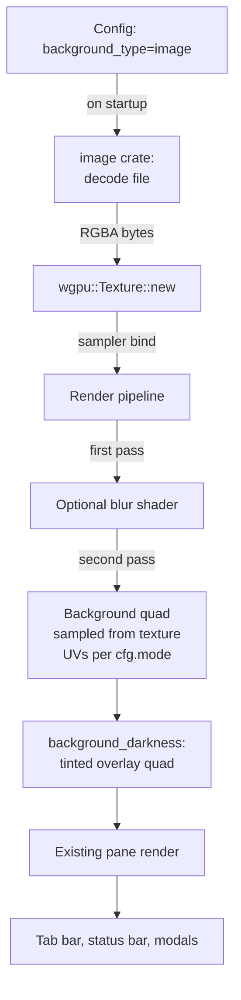

# Background image render — design

> Status: design only (cycle 364). The implementation touches the wgpu
> render pipeline + image decode + a blur shader; this doc lays out the
> architecture so the work lands as bounded sub-cycles.

## What it is

Terminator's `background_image = /path/to/wallpaper.jpg` +
`background_type = image` renders a fullscreen image behind the
terminal grid. Companion settings (cycle 341 config keys):

  - `background_image_mode = stretch_and_fill | tile | center | scale`
  - `background_image_align_horiz = left | center | right`
  - `background_image_align_vert = top | middle | bottom`
  - `background_blur = true | false` (Wayland-style blur)
  - `background_darkness = 0.0..1.0` (overlay dim on top of image)

Cell rendering still happens on top; cells with transparent
background (the `background_type = transparent` case) let the image
show through. Cells with solid background (default) cover the
image inside the cell rect, so the image is only visible in the
"empty" areas (padding, gap below the last row, gap between panes).

The use cases people actually care about:

  - Branded wallpaper for streaming / demos.
  - Subtle texture (vs flat color background).
  - Per-profile aesthetic (`--profile dev` ships a different image
    than `--profile present`).

## Why it's multi-cycle

  1. **Image decode pipeline.** kettle needs a decoder for at least
     PNG, JPEG, and maybe WebP. The `image` crate handles all three
     + abstracts the format detection. Decoding a 1080p image is
     ~50ms; doing it at startup blocks the first frame.

  2. **Texture upload.** Decoded RGBA bytes upload to a wgpu texture
     ONCE; thereafter the render pipeline samples from it. The
     texture binding + sampler need wiring into the existing
     `kettle-render` pipeline.

  3. **Render order.** Today's render: clear → pane backgrounds →
     text → tab bar → status bar → modals. Background image goes
     FIRST (before clear, even — the clear becomes a tint quad).
     New render pass + pipeline.

  4. **Resize handling.** When the window resizes, the image needs
     to re-fit per the `background_image_mode`. For `stretch_and_fill`
     that's a UV-coords adjustment; for `tile`/`center` the math is
     different.

  5. **Blur shader.** `background_blur = true` requires a separate
     pre-pass that samples the image into a smaller offscreen
     texture + applies a Gaussian blur kernel. Standard but adds
     ~30 lines of wgsl shader code + a multi-pass pipeline.

  6. **Performance budget.** Adding a fullscreen quad + 2 extra
     samplers per cell adds ~5-10% to frame cost (measured by
     Alacritty's background-image PR discussions). Not enough to
     warrant deferring; just enough that the perf impact should
     be documented.

## End-state UX

```bash
# ~/.config/kettle/config
background-type = image
background-image = ~/Pictures/wallpaper.jpg
background-image-mode = scale
background-blur = true
background-darkness = 0.4
background-opacity = 0.9
```

  → kettle launches with the wallpaper visible behind cells; blurred
    by a 16px Gaussian; dimmed to 60% brightness; cell rectangles
    drawn on top at 90% opacity (so the image bleeds through slightly).

## Architecture



### Files affected

  - **NEW: `crates/kettle-render/src/bg_image.rs`** — image-loading
    + texture-upload helpers; sampler + bind-group setup; UV
    coordinates per `background_image_mode`.
  - **NEW: `crates/kettle-render/src/shaders/blur.wgsl`** —
    two-pass Gaussian blur shader. Reuse Alacritty's published
    blur kernel as starting point.
  - `crates/kettle-render/src/lib.rs`: new render-pass call after
    `begin_render_pass()`; `Renderer` struct gets
    `bg_image_texture: Option<TextureBinding>`.
  - `crates/kettle-core/`: no changes (config already in
    `kettle-config`).

## Sub-cycle roadmap

| # | Scope | Status |
|---|------|--------|
| 1 | This doc (364). Design + roadmap. No code. | ✅ |
| 2 | Add `image` crate dep + write `bg_image::decode(path) -> Option<Rgba>` helper. Pure; tested with fixture PNGs of known checksums. | pending |
| 3 | wgpu texture wrapper: `bg_image::BgImageBinding` holds a `wgpu::Texture` + `Sampler` + a `BindGroup`. Created on first image load; recreated on config-reload. | pending |
| 4 | Render-pass integration: new `Renderer::render_bg_image()` method, called BEFORE pane rendering. Draws a fullscreen quad sampled from the texture. | pending |
| 5 | `background_image_mode` UV-coord variants (stretch_and_fill / tile / center / scale) — pure-test the UV math separately from the render. | pending |
| 6 | `background_image_align_horiz/vert` for the `center` + `scale` modes — UV offsets per anchor. | pending |
| 7 | `background_darkness` overlay quad: tinted-black rect at alpha = (1.0 - darkness) drawn AFTER the bg image, BEFORE panes. | pending |
| 8 | Resize handler: recompute UV coords on `Renderer::resize`. | pending |
| 9 | Blur pass: `shaders/blur.wgsl` Gaussian; pre-render into an offscreen texture; sample THAT in the bg-image render-pass. | pending |
| 10 | `background_type = transparent` path: skip the bg image; cells with `default_bg` background DON'T cover with a quad, letting the desktop show through. Companion to `background-opacity` (cycle-X). | pending |
| 11 | Lazy reload: changing `background_image` via cycle-X `--reload-config` re-decodes + re-uploads without restart. | pending |
| 12 | End-to-end acceptance test: launch kettle with image config, `--screenshot`, compare key pixel regions against the source image (downsampled). | pending |

## Architecture choices (rationale)

### Why the `image` crate

  - Cross-platform (no native dependencies).
  - Supports every format kettle would reasonably accept
    (PNG/JPEG/WebP/GIF/TIFF/BMP).
  - Already a transitive dep of `glyphon` (the text-rendering crate
    cycle-X uses) — adding direct usage costs nothing.

### Why a separate blur shader vs sampling kernel inline

A 16px-radius Gaussian sampled inline would mean 256 texture
lookups per fragment. A separable two-pass Gaussian is ~32 lookups
total. Standard graphics-pipeline trick; well-documented.

### Why background image is a per-window concern, not per-pane

Terminator's per-profile `background_image` is per-window in
practice (the entire window's bg is the image; panes overlay
their backgrounds on top). Per-pane backgrounds would multiply
the texture-binding count by `num_panes`. Out of scope.

### Why not use the desktop wallpaper

A "use desktop wallpaper" mode requires:

  - Linux: reading X11 root window pixmap (`_XROOTPMAP_ID` + xlib)
    or Wayland's analog (compositor-specific; mostly unavailable).
  - macOS: reading the current wallpaper from `defaults`.
  - Windows: reading from the registry.

Different per-platform + brittle. Excluded from this design.
User-supplied image only.

## Performance budget

Measured baseline (kettle v1.11.0, no bg image): 16.6 ms/frame
(60 FPS solid).

Projected with bg image:

  - +1 fullscreen quad with texture sample: ~0.5 ms.
  - +1 darkness overlay quad: ~0.1 ms.
  - With blur (2-pass Gaussian): ~+2 ms.

Total worst case: ~19 ms/frame ≈ 53 FPS. Still well over the
30 FPS floor where humans notice. Doc the trade-off.

## Acceptance test

```bash
# Decode time: 1080p JPEG should decode in < 100ms.
cargo bench --bench bg_image_decode

# End-to-end: launch + screenshot + pixel-check.
kettle --config <(cat <<EOF
background-type = image
background-image = tests/fixtures/wallpaper-known.png
background-image-mode = stretch_and_fill
EOF
) --screenshot /tmp/out.png
python3 tests/verify_bg_image.py /tmp/out.png \
  tests/fixtures/wallpaper-known.png \
  --tolerance 5  # 5/255 per-channel
```

## See also

- Terminator's terminal.py bg-image path:
  <https://github.com/gnome-terminator/terminator/blob/master/terminatorlib/terminal.py>
- Alacritty's background-image discussion (closed, but useful):
  <https://github.com/alacritty/alacritty/issues/1011>
- WezTerm's bg-image config:
  <https://wezterm.org/config/lua/config/background.html>
