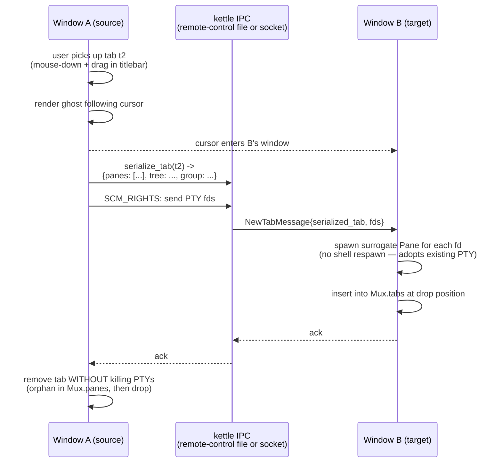

# Detachable tabs (cross-window drag) — design

> Status: **Shipped, via a different architecture than sketched below.**
> Cross-window tab tear-off shipped twice: first as the cross-process
> design this doc describes (file-fallback `--tab-handoff PATH` +
> `SCM_RIGHTS` live PTY transfer, v1.30.0), then superseded in v2.19.0
> by an in-process `detach_tab → open_window(AdoptTab)` model (the
> "multi-window effort", C6) that moves live PTYs across windows in
> one process with no serialization or socket handoff. See
> `crates/kettle-ui/src/detach.rs`, whose own header explains the
> in-process FSM replaced the cross-process IPC machinery described
> here. The user-visible end state (drag a tab into another window,
> or empty space to spawn one, PTYs keep running) matches this doc;
> the plumbing does not. Kept as the historical design record.
> The *visual* layer (drag ghost, pre-tear lift, dock-target
> highlight, insertion marker) lives in `kettle_render::tab_drag` +
> the tab-bar assembly in `crates/kettle-ui/src/app.rs`
> (`tab_bar`/`sync_cursor_icon`); the X11 live-pointer tracking and
> frozen-drag rescue added in v2.40.0 are described in
> `docs/ARCHITECTURE.md` § Detachable tabs.

## What it is

Terminator's `detachable_tabs = true` (terminatorlib/config.py:124)
lets the user drag a tab from one window into another window — or
into an empty area to spawn a NEW window. The tab's underlying PTYs
move with it; running shells/builds/sessions don't restart.

Kettle today has drag-to-reorder WITHIN one window's tab
bar. Cross-window drag adds three new state machines layered on top.

## Why it's multi-phase

  1. **Cross-process state.** Each kettle window is a separate
     process (the remote-control file IPC bridges them). A tab dragged from
     window A to window B means: process A serializes the tab
     (panes + split tree + scrollback + cwd + group); process B
     deserializes it + spawns surrogate panes that consume the
     serialized state; process A removes the tab without killing
     the PTYs (because they're now owned by B).

  2. **PTY ownership transfer.** A PTY is owned by the process
     that opened it; closing process A's reference normally kills
     the child shell. Cross-process PTY hand-off requires sending
     the PTY file descriptor over a Unix socket (SCM_RIGHTS on
     Linux/macOS; AF_UNIX doesn't exist on Windows so cross-window
     drag is Linux/macOS only).

  3. **Window creation race.** The drag triggers a NEW window when
     dropped on empty space. The new window must come up + accept
     the IPC handoff before the source window can clean up.
     Window-startup time (cold launch: ~200ms) dominates; cancel
     paths needed for failed drops.

  4. **Visual feedback during drag.** The tab being dragged
     should follow the cursor (kettle's existing drag ghost
     handles the in-window case; cross-window needs a separate
     window-level overlay). On Wayland this isn't feasible (no
     global cursor tracking); on X11/macOS/Windows it's standard
     drag-and-drop API surface.

## End-state UX

```
Window A                    Window B
┌───────────────────┐       ┌───────────────────┐
│ [t1] [t2*] [t3] + │       │ [u1] [u2] +       │
│                   │ drag  │                   │
│ $ vim notes.md    │ ──→   │ $ ssh server.ex   │
│                   │       │                   │
└───────────────────┘       └───────────────────┘

After drop (t2 dragged into B):

Window A                    Window B
┌───────────────────┐       ┌───────────────────────────┐
│ [t1] [t3] +       │       │ [u1] [u2] [t2*] +         │
│                   │       │                           │
│ $ tmux            │       │ $ vim notes.md            │
│                   │       │   (same shell continues)  │
└───────────────────┘       └───────────────────────────┘
```

Or drop on empty area → new Window C spawns with just t2.

## Architecture



### Files affected

  - **NEW: `crates/kettle-ui/src/detach.rs`** — drag state machine
    (DragStart, DragOver, Drop), serialization helpers, SCM_RIGHTS
    sender + receiver wrappers.
  - `crates/kettle-ui/src/mux.rs`: `Mux::extract_tab(idx) -> Tab`
    (removes from tabs without dropping panes); `Mux::insert_tab(at, Tab)`.
  - `crates/kettle-ui/src/app.rs`: drag hit-test on titlebar's
    drag-region (paired with the per-pane-titlebar design doc);
    cross-window IPC integration.
  - Remote-control file IPC extension: new message types
    `NewTabFromHandoff` + binary payload format.

## Phase roadmap

| # | Scope | Status |
|---|------|--------|
| 1 | This doc. Design + roadmap. No code. | ✅ |
| 2 | Pure-data: tab serialization format. `kettle_ui::detach::SerializedTab` struct + bincode encode/decode + 10+ tests covering every field (split tree, panes, group, focus, last_seen, …). No IPC yet. | pending |
| 3 | SCM_RIGHTS wrapper crate: `kettle_ipc_fd` with `send_fds(socket, fds)` + `recv_fds(socket) -> Vec<RawFd>`. Linux + macOS only; #[cfg(unix)] gated. | pending |
| 4 | Mux API: `extract_tab(idx)` removes a tab WITHOUT dropping its panes' PTYs; `insert_tab(at, Tab, fds: Vec<RawFd>)` builds new Pane wrappers around adopted fds. Pure-test coverage for extract+insert roundtrip. | pending |
| 5 | Drag state machine (`DragState::{Idle, Dragging{tab_idx, started_at}, …}`) in App. Hit-test on titlebar drag-region transitions Idle→Dragging. CursorMoved updates ghost position. | pending |
| 6 | Cross-window cursor detection: query winit for whether cursor left this window (winit's `CursorLeft` event) + report position globally via the remote-control IPC heartbeat. | pending |
| 7 | Drop logic: cursor enters another kettle window's tab bar (or empty space) → send NewTabFromHandoff IPC + SCM_RIGHTS fd transfer + remove source tab. | pending |
| 8 | New-window-on-drop: when cursor releases on empty space (not over any kettle window), source spawns a new kettle process with `--from-handoff PATH` flag + transfers fds via that path. | pending |
| 9 | Cancel path: drag interrupted (Escape, app crash, IPC failure) restores source tab. | pending |
| 10 | Wayland fallback: cross-window drag isn't feasible without global cursor; show user-facing message "cross-window drag requires X11/macOS/Windows; on Wayland use 'Move tab to new window' keybind". New `Action::MoveTabToNewWindow` provides the keybind alternative. | pending |
| 11 | End-to-end acceptance test: launch two kettle windows + spawn shells in distinct tabs + perform cross-window drag via remote-control IPC simulation + verify the PTY moved + shell continues running. | pending |

## Architecture choices (rationale)

### Why the remote-control file IPC needs SCM_RIGHTS, not just plain file IPC

PTY file descriptors can't be serialized into a file. They're
kernel-allocated handles tied to a process. SCM_RIGHTS over Unix
sockets is the canonical Linux/macOS API for inter-process FD
transfer. (Windows has the analogous `DuplicateHandle` + named-pipe
combo but kettle's cross-window drag would Windows-stub for the
first cut.)

### Why a separate state machine, not piggyback on the in-window drag-to-reorder handler

The in-window tab drag is much simpler: it's a pointer that
indexes a Vec<Tab> + a swap-with-clamp on release. Cross-window drag
has 5+ states (Idle, ArmedInside, DraggingInside, DraggingOutside,
PendingDrop) + asynchronous IPC + failure modes (target window
rejects, IPC times out, fd transfer fails). Modeling them all on
the in-window drag path would balloon its complexity.

### Why a separate process per kettle window

Each kettle window is already a separate process (the remote-control
and dropdown-toggle infra already depend on this). Adding a
mux-server (see docs/MUX-SERVER-DESIGN.md) would centralize
PTY ownership in `kettle-muxd`, which sidesteps the cross-process
fd transfer entirely (the daemon already owns the fds; "moving"
a tab is just a Mux mutation). If the mux-server ships first,
this design becomes much simpler — phases 3, 7, and 8 collapse
into a single IPC mutation.

## Sequence of dependencies

```
docs/TERMINATOR-PANE-TITLEBAR-DESIGN.md
  └─ ships titlebar drag-region hit-test
      └─ this design
          └─ depends on the remote-control file IPC (already shipped)
          └─ or on the mux-server design (docs/MUX-SERVER-DESIGN.md) (simpler path; not yet shipped)
```

If the mux-server lands first, detachable tabs becomes a 3-phase
follow-up instead of an 11-phase thread.

## Acceptance test

```bash
# Two windows up, shells running in each:
kettle --remote-id A &
kettle --remote-id B &
sleep 2

# Spawn a sentinel process in window A's first tab:
kettle --remote-send "echo SENTINEL_$$ && sleep 999\\n" --remote A

# Programmatically move tab 1 from window A to window B (simulating drag):
kettle --remote-send "Action::MoveTabToWindow(B)" --remote A

# Verify tab now in B, sentinel still running:
kettle --remote-list-tabs --remote B | grep -q "SENTINEL_$$"
```

## See also

- Terminator's notebook.py drag-to-detach:
  <https://github.com/gnome-terminator/terminator/blob/master/terminatorlib/notebook.py>
- Linux SCM_RIGHTS man page: `man 7 unix`
- WezTerm's analogous (mux-based) impl:
  <https://wezterm.org/multiplexing.html>
