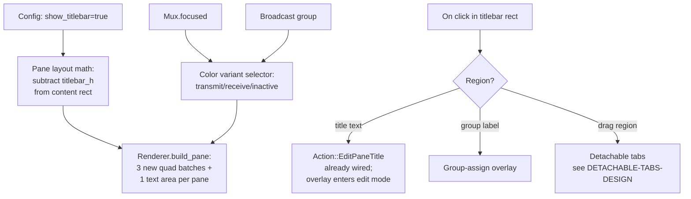

# Per-pane titlebar — design

> Status: **Shipped in v1.30.0**, with later refinements
> (theme-accent focus color, cwd-aware title fitting, emoji/tofu-box
> glyph fixes, and position-aware render/input geometry). Functional
> phases 2-10 are complete. The live split-titlebar smoke launches
> independent top- and bottom-title windows, validates semantic/grid
> geometry, and checks exact focused, receiving, and inactive colors in
> captured PNGs. See `show_titlebar` /
> `title_hide_sizetext` in `crates/kettle-config/src/lib.rs` and
> `pane_titlebar_buffers` / `fit_pane_titlebar_title` in
> `crates/kettle-render/src/lib.rs`. This doc is kept as the
> historical design record; the phase roadmap below describes what
> was built.

## What it is

Terminator's `terminatorlib/titlebar.py` shows a thin per-pane bar above
each terminal containing:

  - The pane title (OSC 0/2 from the shell, or user-set via Edit Title).
  - The current size (`WxH` cells), optionally hidden via `title_hide_sizetext`.
  - An activity/bell icon (per-pane, vs kettle's per-tab).
  - The broadcast-group label (editable inline; click to assign).
  - Custom colors (transmit/receive/inactive variants).

Before this work, Kettle showed ONE title bar — the global window title
(`window-title-format`) — plus the tab-bar with per-tab activity dots.
Per-pane titlebars surface the same info AT THE PANE level.

## Why it's multi-phase

  1. **Layout math change.** Today, each pane's content area is the
     full rectangle minus padding. Adding a titlebar above each pane
     means subtracting `titlebar_height` from every pane's content
     area + propagating that to the alacritty_terminal grid sizing.
     The split-tree layout has to know about titlebar height to
     compute correct child rects.

  2. **Render order.** Today: tab-bar (top) → panes → status-bar
     (bottom) → modals. With per-pane titlebars: each pane gets a
     mini-bar drawn on its configured edge. Three new quad
     batches per pane (background, accent, icon) + one text area
     for the title. Multiplies the per-frame render cost by
     `num_panes_per_tab`.

  3. **Hit-testing.** Clicks on the titlebar should NOT pass through
     to the pane's content (cursor positioning would land in
     row 0). The titlebar's clickable regions (group label, close
     ✕ if shown, drag region for tab detach) need their own
     hit-tests in `App::on_mouse_input`.

  4. **Focus + group indicators.** Three color variants
     (`title_transmit_*_color`, `title_receive_*_color`,
     `title_inactive_*_color`) require knowing which panes are in
     which broadcast group + whether they're "transmitting" (focused)
     or "receiving" (group member, focused elsewhere). This is the
     first place broadcast_group identity actually matters in
     the render layer.

  5. **Edit-title overlay.** `Action::EditPaneTitle` ships placeholder
     direct writes today; the interactive overlay (text input + cursor
     + Enter to apply) lives here. The titlebar becomes its own input
     widget when the user is editing.

## End-state UX

```
┌────────────────────────────────────────────────────────────────┐
│  [tab1] [tab2 ●] [tab3 *]                                    + │  ← tab bar
├────────────────────────────────────────────────────────────────┤
│ vim notes.md             80×24       [g1]              ●       │  ← per-pane titlebar
│                                                                │     (top-left: title;
│  # My notes                                                    │      center: size text;
│                                                                │      right of center:
│                                                                │      group label;
│                                                                │      right: activity dot)
├────────────────────────────────────────────────────────────────┤
│ ssh server.example       80×24       [g1]              *       │  ← second pane's titlebar
│                                                                │     bell icon shown,
│  $ tail -f /var/log...                                         │     bg-color = "receive"
│                                                                │     (group member,
│                                                                │      receiving broadcast)
└────────────────────────────────────────────────────────────────┘
```

## Architecture



### Files affected

  - `crates/kettle-render/src/lib.rs`: new `build_pane_titlebar(...)`
    method; `build_pane` reduces content rect by `titlebar_h`.
  - `crates/kettle-ui/src/mux.rs`: `Pane.broadcast_group: Option<String>`
    field (set by `Action::CreateGroup`; Terminator-parity Bucket-C item
    already promoted to D scope because of this dependency).
  - `crates/kettle-ui/src/app.rs`: `on_mouse_input` adds hit-test for
    the per-pane titlebar region; `handle_action` for `Action::Edit*Title`
    flips a new `editing_title: Option<TitleEditState>` field.
  - `crates/kettle-config/src/lib.rs`: existing title-* config fields
    get consumed by the render layer.

## Phase roadmap

| # | Scope | Status |
|---|------|--------|
| 1 | This doc. Design + roadmap. No code. | ✅ |
| 2 | Derive the shared titlebar inset from live renderer cell metrics, subtract it from per-pane grid sizing, and verify the PTY and rendered grid agree. | complete |
| 3 | Renderer: build the titlebar chrome and shaped title text for every split pane, honoring `title_hide_sizetext`. | complete |
| 4 | Color variants: select fg/bg from `cfg.title_{transmit,receive,inactive}_{fg,bg}_color` based on focused + broadcast-group membership. | complete |
| 5 | Hit-testing: intercept clicks in the top/bottom titlebar band before terminal mouse reporting and route title editing/focus behavior. | complete |
| 6 | Render per-pane activity, bell, silence, read-only, and agent state in the titlebar. | complete |
| 7 | Edit-title overlay: keyboard input is routed to `TitleEditState`; Enter applies and Esc cancels. | complete |
| 8 | Inline group-label editing and bulk group actions update each pane's group name. | complete |
| 9 | `title_at_bottom` config wired: render the titlebar below the pane content. Renderer cell, cursor, selection, search, hint, IME, and image projection plus UI pointer/IME geometry share the title-position-aware grid origin. | complete |
| 10 | Live acceptance: `split-titlebar-smoke` launches real top- and bottom-title windows, validates pane/title/cwd/grid-edge geometry, and checks exact focused/receiving/inactive colors in captured PNGs. | complete |

## Architecture choices (rationale)

### Why a per-pane field, not a renderer-only concept

Pane titlebar visibility might want to be per-pane in the future
(some panes show, some hide). Modeling `Pane.show_titlebar: Option<bool>`
that overrides `cfg.show_titlebar` keeps the door open. For now,
config is the single source.

### Why icon_bell renders ONLY in the titlebar

Terminator's `icon_bell` toggles whether the bell triggers a titlebar
icon. kettle today maps bell → tab-bar dot (per-tab). With per-pane
titlebars, the bell can render per-pane (the existing per-pane
bell-state tracking generalizes).

### Why bottom rendering is a config knob, not a separate code path

`title_at_bottom = true` swaps the titlebar's y-offset from "above
content rect" to "below content rect". `pane_grid_origin` is the shared
renderer/UI coordinate invariant: only a top title contributes to the grid's
top inset, while either position reserves the same total height. This keeps
paint, clipping, selection/mouse hit testing, links, and native IME projection
aligned without a second layout path.

### Why drag-to-detach isn't here

Cross-window drag-and-drop (Terminator's `detachable_tabs`) needs
this titlebar's drag-region as the trigger, but the cross-window
state machine + IPC lives in its own Bucket-D thread (see
`docs/TERMINATOR-DETACHABLE-TABS-DESIGN.md`). Phase 5's
hit-testing reserves the drag region; the actual detach implementation
follows separately.

## Acceptance test

End-to-end ship-criteria:

```sh
just split-titlebar-smoke
```

The smoke launches two real Kettle windows, one with `title-at-bottom = false`
and one with it enabled. Each window reports an authoritative cwd plus a
truncated shell title, creates a split, and captures an inactive frame before
enabling tab broadcast and capturing a receiving frame. `list_panes` and
`ui_geometry.pane_titlebars` must agree on focus, cwd, pane rectangles, the
`cell_height + 6` titlebar height, the configured edge, and the PTY grid origin
and row budget. A full cwd is required whenever it fits; constrained windows
must retain the cwd leaf rather than falling back to the shell's truncated
title.

The PNG oracle checks a 3x3 patch in the first of the title label's two leading
blank cells, which excludes title glyphs, group/bell icons, and the one-pixel
focus accent by construction. It also checks the adjacent grid-side padding
against the configured terminal background. Explicit colors and disabled
unfocused dimming make the focused/transmit, receiving, and inactive samples
exact and deterministic. Screenshots, per-state geometry, the broadcast action,
and aggregate `analysis.json` evidence are saved beneath the diagnostic root's
`split-titlebar-*/{top,bottom}/` directories (the default Windows root is
owner-private). The helper self-test
exercises both positions and both broadcast states and rejects wrong-edge and
wrong-color fixtures; it does not replace running the live recipe on the target
desktop.

## See also

- Terminator's titlebar.py: <https://github.com/gnome-terminator/terminator/blob/master/terminatorlib/titlebar.py>
- iTerm2 per-pane title bar:
  <https://iterm2.com/documentation-preferences-profiles-general.html>
