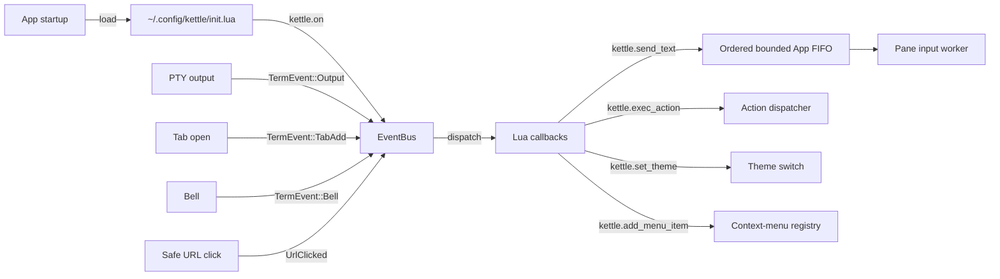

# Terminator plugin system — design

> Status: historical design with the core Lua plugin surface implemented.
> The phase table preserves the original decomposition and records remaining
> gaps; current queueing and delivery semantics are documented below.

## What it is

Terminator's `terminatorlib/plugin.py` ships a capability-based plugin
registry. Plugins discover themselves at startup from two paths:

  - `terminatorlib/plugins/*.py` (built-in)
  - `~/.config/terminator/plugins/*.py` (user)

Each plugin subclasses one of three abstract bases:

  - `Plugin`        — general lifecycle hooks (load, unload, settings).
  - `MenuItem`      — adds an entry to the right-click context menu.
  - `URLHandler`    — claims a regex + an open-action for URL matches.

Bundled plugins kettle should replicate:

| Terminator plugin            | Capability        | kettle equivalent |
|------------------------------|-------------------|-------------------|
| `activitywatch.py`           | MenuItem + watch  | ✅ tab-bar activity dot |
| `inactivitywatch.py`         | MenuItem + watch  | ✅ silence-watcher dot |
| `command_notify.py`          | watch             | partial via output triggers |
| `save_last_session_layout.py`| Plugin            | ✅ session.json |
| `save_user_session_layout.py`| MenuItem          | ✅ `--layout NAME` |
| `url_handlers.py` (Launchpad)| URLHandler        | partial via hint mode |
| `mousefree_url_handler.py`   | Plugin            | ✅ hint mode |
| `run_cmd_on_match.py`        | URLHandler        | partial via output triggers |
| `custom_commands.py`         | MenuItem          | NEW — needs plugin system |
| `remote.py`                  | watch             | NEW — needs plugin system |
| `logger.py`                  | MenuItem          | NEW — needs plugin system |
| `terminalshot.py`            | MenuItem          | ✅ `--screenshot --annotate` |
| `dir_open.py`                | MenuItem          | NEW — needs plugin system |
| `insert_term_name.py`        | MenuItem          | partial via `InsertPaneNumber` |
| `auto_theme.py`              | MenuItem          | NEW — needs plugin system |
| `maven.py`                   | URLHandler        | E (domain-specific; user-supplied) |

## Why kettle uses Lua instead of Python

Terminator plugins are Python modules; kettle's runtime is Rust + a
vendored Lua 5.4. Reasons:

  - **No Python dependency.** Shipping a Python interpreter to every
    kettle user (~30 MB on Linux, more on macOS/Windows) doubles the
    install footprint. Lua adds ~250 KB vendored.
  - **Single-threaded ergonomics.** Lua's coroutines + mlua's `Send`
    feature handle the kettle event loop's threading model cleanly.
    Python's GIL + asyncio would be a constant friction.
  - **kettle already has Lua.** An earlier change vendored mlua + a
    `kettle.*` namespace; a follow-up added `send_text` + `exec_action`.
    Extending that surface is incremental.

## Current UX

```lua
-- ~/.config/kettle/init.lua

-- Replicate Terminator's activitywatch plugin: notify on burst output
kettle.on('output', function(pane_id, bytes)
  if #bytes > 4096 then
    kettle.notify('Busy pane',
      string.format('Pane %d: %d bytes', pane_id, #bytes))
  end
end)

-- Replicate custom_commands: add right-click menu items
kettle.add_menu_item('Open in Vim', function(pane_id)
  kettle.send_text('vim .\n')
end)

-- Replicate url_handlers: claim a URL pattern
kettle.add_url_handler('github_pr',
  'https://github.com/[^/]+/[^/]+/pull/(%d+)',
  function(url)
    kettle.notify('Matched GitHub pull request', url)
    -- Requires `lua-sandbox = trusted`; safe mode omits os.execute.
    os.execute('xdg-open ' .. url)
    -- `true` says "I opened it" — without it kettle treats the handler
    -- as having declined and opens the URL a second time. Returning a
    -- string instead would hand kettle a rewritten URL to open.
    return true
  end
)

-- Replicate auto_theme: switch theme by time of day
kettle.on('startup', function()
  local hour = tonumber(os.date('%H'))
  if hour < 6 or hour >= 18 then
    kettle.set_theme('Solarized Dark')
  else
    kettle.set_theme('Solarized Light')
  end
end)
```

Discovery: `~/.config/kettle/init.lua` is auto-loaded at startup if
present, complementing the existing `--lua-script PATH` CLI flag.

## Architecture



Where today's code lives:

  - `crates/kettle-ui/src/lua.rs`: `LuaEngine` + `LuaCommand` queue.
    The event-hook registry lives here.
  - `crates/kettle-ui/src/app.rs`: one process-wide
    `PendingLuaCommands` FIFO plus event dispatch.

Lua callbacks are synchronous, but their side effects are not direct App or PTY
mutations. Each callback queues `SendText`, `ExecAction`, `Notify`, or
`SetTheme`; the App transfers them immediately into one ordered FIFO shared by
startup and every hook. The Lua-side and App-side boundaries each admit at
most 1,024 commands and 8 MiB of pending send text, and one `send_text` call is
limited to 1 MiB. `send_text`, `exec_action`, `notify`, and `set_theme` return
`true` when admitted to the Lua-to-App queue and `false` when a size or capacity
limit rejects them; `true` is queue admission, not a promise of eventual PTY
delivery. Rejection logs a warning without raising a Lua error.

Registry calls also report admission as a boolean. `kettle.on` accepts only
the nine events Kettle emits (`startup`, `tab_add`, `tab_close`, `bell`,
`pane_close`, `output`, `pane_focus`, `title_changed`, and `url_clicked`) and
caps each event at 256 callbacks. `add_menu_item` caps the registry at 256
items and each label at 1 KiB. `add_url_handler` caps the registry at 256
handlers, names at 256 bytes, and patterns at 4 KiB. These byte limits are
checked before copying Lua strings into Rust-owned storage; an unknown event or
capacity/size violation returns `false` and leaves the registry unchanged.

The App processes at most 16 commands and 1 MiB of send data per event-loop
turn. A backpressured `SendText` remains at the FIFO head byte-for-byte and is
retried on an event-loop deadline with 10–250 ms exponential backoff; later
theme/action/notification commands cannot overtake it. The focused pane is
resolved and latched on the first attempt, so a later focus change cannot
redirect delayed text. A closed target is dropped with visible feedback rather
than rerouted.

## Phased roadmap

| # | Scope | Status |
|---|------|--------|
| 1 | This doc. Design + roadmap. No code. | ✅ |
| 2 | `kettle.on(event, callback)` foundation. New `LuaEvent` enum with one variant: `Startup`. Registry on `LuaEngine`; dispatch on App resumed. | ✅ shipped |
| 3 | `LuaEvent::Output(pane_id, bytes)` — wire PTY-output batches to callbacks without allowing a slow plugin to grow memory indefinitely. | ✅ shipped through a bounded best-effort output queue; plugin backpressure may drop batches |
| 4 | `LuaEvent::TabAdd/TabClose/PaneAdd/PaneClose` — fire from Mux mutations. | ✅ `tab_add` / `tab_close`, `pane_close` (`kettle.on('pane_close', function(pane_id) … end)`, fires from every ClosePane path before the pane's PTY teardown); `pane_add` still pending |
| 5 | `LuaEvent::Bell(pane_id)` — fire when TermEvent::Bell arrives. | ✅ shipped |
| 6 | URL event and handler dispatch — fire from hint mode + Ctrl-click before falling through to system open. | ✅ shipped as `url_clicked` plus `add_url_handler` |
| 7 | `kettle.notify(title, body)` — desktop notification via `notify-rust` crate. | ✅ shipped |
| 8 | `kettle.add_menu_item(label, callback)` — extend the context menu with Lua-supplied entries. New menu state field; menu render appends after the default entries. | ✅ shipped |
| 9 | `kettle.add_url_handler(name, pattern, callback)` — extend hint mode + Ctrl-click to consult registered handlers before falling through to system open. | ✅ shipped |
| 10 | `kettle.set_theme(name)` — runtime theme switch via existing theme infrastructure. | ✅ shipped |
| 11 | Per-plugin porting: rewrite each of the 6 NEW plugins (custom_commands, remote, logger, dir_open, auto_theme, command_notify) as Lua modules shipped under `~/.config/kettle/plugins/*.lua` template files. Auto-load alongside `init.lua`. | pending |
| 12 | Sandboxing decisions: which Lua stdlib bindings are exposed (os.execute? io.open?), error containment (one plugin's runtime error doesn't crash kettle), config-knob to disable plugins entirely. | ✅ `lua-sandbox = safe|trusted`; callback errors are contained |
| 13 | End-to-end acceptance test: ship a fixture `init.lua` that exercises every hook; integration test verifies all hooks fired. | pending |

## Architecture choices (rationale)

### Why event hooks, not subclass-style plugins

Terminator's `Plugin`/`MenuItem`/`URLHandler` base classes are an OO
fit for Python. In Lua, event hooks (callbacks keyed by event name)
are idiomatic + zero-boilerplate. Same model as Neovim's `vim.api.
nvim_create_autocmd`, WezTerm's `wezterm.on`, Awesome WM's
`client.connect_signal`.

### Why Output delivery is bounded and best-effort

A busy build can emit thousands of TermEvent::Output chunks per second.
Firing a Lua callback for each would either swamp the VM or starve
PTY reads. The raw-output tap therefore uses a bounded best-effort queue:
a stalled plugin may miss output batches, while terminal parsing, rendering,
recording, and `kettle exec` keep their separate delivery contracts.

### Why `notify-rust` instead of writing to stderr

Terminator's `Notify` action issues a libnotify message via
`pynotify`. The Rust equivalent is `notify-rust`, which uses
libnotify on Linux + NSUserNotification on macOS + Toast on
Windows. Cross-platform out of the box.

### Sandbox decisions: what's exposed

  - **Always exposed**: `kettle.*` namespace + the standard Lua
    `string`, `table`, `math`, `os.date`, `os.time` modules.
  - **Optionally exposed (default off)**: `os.execute`, `io.open`,
    `io.popen`, `os.exit`. User opts in via config:
    `lua-sandbox = trusted` (default `safe`).
  - **Never exposed**: `package.loadlib` (loads native shared
    libraries — would let a malicious plugin take over the process).

## Acceptance test

End-to-end ship-criteria:

```bash
# Fixture init.lua:
cat > ~/.config/kettle/init.lua <<'EOF'
local fired = {}
kettle.on('startup', function() fired.startup = true end)
kettle.on('tab_add', function(id) fired.tab_add = id end)
kettle.on('output', function(id, bytes)
  fired.output = (fired.output or 0) + #bytes
end)
kettle.on('bell', function(id) fired.bell = id end)

kettle.add_menu_item('Test', function(pane_id)
  fired.menu_item = pane_id
end)

kettle.add_url_handler('test_url', 'https?://test%.example/.+',
  function(url) fired.url_handler = url end)
EOF

# Test:
kettle --check-config && kettle &
# Open a tab, run `printf 'hi'`, ring the bell, click a test URL,
# pick the "Test" menu item, assert fired table is fully populated.
```

## See also

- Terminator's plugin.py: <https://github.com/gnome-terminator/terminator/blob/master/terminatorlib/plugin.py>
- WezTerm's lua config: <https://wezterm.org/config/lua/intro.html>
- Neovim's autocmd API: <https://neovim.io/doc/user/autocmd.html>
