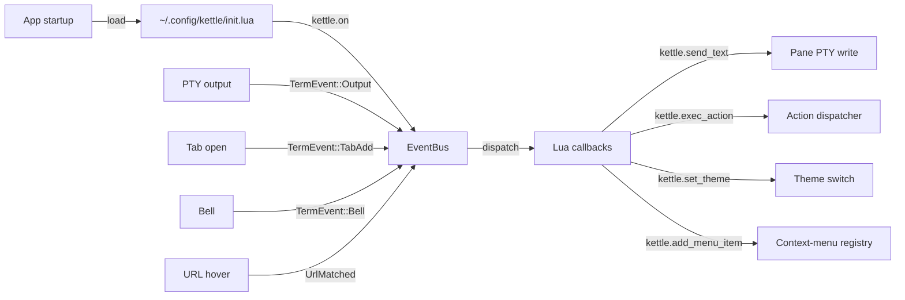

# Terminator plugin system — design

> Status: design only (cycle 361). The implementation pairs naturally with
> the cycle-324 Lua scripting foundation; this doc lays out the
> architecture + sub-cycle roadmap so the work lands as a series of small,
> testable cycles instead of one heroic push.

## What it is

Terminator's `terminatorlib/plugin.py` ships a capability-based plugin
registry. Plugins discover themselves at startup from two paths:

  - `terminatorlib/plugins/*.py` (built-in)
  - `~/.config/terminator/plugins/*.py` (user)

Each plugin subclasses one of three abstract bases:

  - `Plugin`        — general lifecycle hooks (load, unload, settings).
  - `MenuItem`      — adds an entry to the right-click context menu.
  - `URLHandler`    — claims a regex + an open-action for URL matches.

Bundled plugins kettle should replicate:

| Terminator plugin            | Capability        | kettle equivalent |
|------------------------------|-------------------|-------------------|
| `activitywatch.py`           | MenuItem + watch  | ✅ cycle-246 tab-bar activity dot |
| `inactivitywatch.py`         | MenuItem + watch  | ✅ cycle-X silence-watcher dot |
| `command_notify.py`          | watch             | partial via cycle-289 triggers |
| `save_last_session_layout.py`| Plugin            | ✅ cycle-X session.json |
| `save_user_session_layout.py`| MenuItem          | ✅ cycle-291 `--layout NAME` |
| `url_handlers.py` (Launchpad)| URLHandler        | partial via cycle-218 hint mode |
| `mousefree_url_handler.py`   | Plugin            | ✅ cycle-218 hint mode |
| `run_cmd_on_match.py`        | URLHandler        | partial via cycle-289 triggers |
| `custom_commands.py`         | MenuItem          | NEW — needs plugin system |
| `remote.py`                  | watch             | NEW — needs plugin system |
| `logger.py`                  | MenuItem          | NEW — needs plugin system |
| `terminalshot.py`            | MenuItem          | ✅ cycle-294 `--screenshot --annotate` |
| `dir_open.py`                | MenuItem          | NEW — needs plugin system |
| `insert_term_name.py`        | MenuItem          | partial via cycle-345 `InsertPaneNumber` |
| `auto_theme.py`              | MenuItem          | NEW — needs plugin system |
| `maven.py`                   | URLHandler        | E (domain-specific; user-supplied) |

## Why kettle uses Lua instead of Python

Terminator plugins are Python modules; kettle's runtime is Rust + a
vendored Lua 5.4 (cycle 324). Reasons:

  - **No Python dependency.** Shipping a Python interpreter to every
    kettle user (~30 MB on Linux, more on macOS/Windows) doubles the
    install footprint. Lua adds ~250 KB vendored.
  - **Single-threaded ergonomics.** Lua's coroutines + mlua's `Send`
    feature handle the kettle event loop's threading model cleanly.
    Python's GIL + asyncio would be a constant friction.
  - **kettle already has Lua.** Cycle 324 vendored mlua + a `kettle.*`
    namespace; cycles 325-326 added `send_text` + `exec_action`.
    Extending that surface is incremental.

## End-state UX

```lua
-- ~/.config/kettle/init.lua

-- Replicate Terminator's activitywatch plugin: notify on burst output
kettle.on('output', function(pane_id, bytes)
  if #bytes > 4096 then
    kettle.notify(string.format('Pane %d: %d bytes', pane_id, #bytes))
  end
end)

-- Replicate custom_commands: add right-click menu items
kettle.add_menu_item('Open in Vim', function(pane_id)
  kettle.send_text(pane_id, 'vim .\n')
end)

-- Replicate url_handlers: claim a URL pattern
kettle.add_url_handler('github_pr',
  'https://github.com/[^/]+/[^/]+/pull/(%d+)',
  function(url, captures)
    kettle.notify('PR #' .. captures[1])
    os.execute('xdg-open ' .. url)
  end
)

-- Replicate auto_theme: switch theme by time of day
kettle.on('startup', function()
  local hour = tonumber(os.date('%H'))
  if hour < 6 or hour >= 18 then
    kettle.set_theme('Solarized Dark')
  else
    kettle.set_theme('Solarized Light')
  end
end)
```

Discovery: `~/.config/kettle/init.lua` is auto-loaded at startup if
present, complementing the existing `--lua-script PATH` CLI flag.

## Architecture



Where today's code lives:

  - `crates/kettle-ui/src/lua.rs`: `LuaEngine` + `LuaCommand` queue
    (cycles 324-326). The event-hook registry lives here.
  - `crates/kettle-ui/src/app.rs`: `App::pending_lua_actions` /
    `App::pending_lua_send` drain (cycles 325-326). Event dispatch
    extends this.

## Sub-cycle roadmap

| # | Scope | Status |
|---|------|--------|
| 1 | This doc (361). Design + roadmap. No code. | ✅ |
| 2 | `kettle.on(event, callback)` foundation. New `LuaEvent` enum with one variant: `Startup`. Registry on `LuaEngine`; dispatch on App resumed. | pending |
| 3 | `LuaEvent::Output(pane_id, bytes)` — wire the existing PTY-output loop to fire this event after each chunk drained. Throttle: max 100 fires/sec to bound Lua-callback overhead. | pending |
| 4 | `LuaEvent::TabAdd/TabClose/PaneAdd/PaneClose` — fire from Mux mutations. | ✅ `tab_add` / `tab_close` (cycle 424), `pane_close` (cycle 750 — `kettle.on('pane_close', function(pane_id) … end)`, fires from every ClosePane path before the pane's PTY teardown); `pane_add` still pending |
| 5 | `LuaEvent::Bell(pane_id)` — fire when TermEvent::Bell arrives. | pending |
| 6 | `LuaEvent::UrlMatched(url, captures)` — fire from cycle-218 hint mode + cycle-X Ctrl-click path. | pending |
| 7 | `kettle.notify(text)` — desktop notification via `notify-rust` crate. | pending |
| 8 | `kettle.add_menu_item(label, callback)` — extend cycle-245 context menu with Lua-supplied entries. New menu state field; menu render appends after the default entries. | pending |
| 9 | `kettle.add_url_handler(name, pattern, callback)` — extend cycle-218 hint mode + Ctrl-click to consult registered handlers before falling through to system open. | pending |
| 10 | `kettle.set_theme(name)` — runtime theme switch via existing `NextTheme` infrastructure. | pending |
| 11 | Per-plugin porting: rewrite each of the 6 NEW plugins (custom_commands, remote, logger, dir_open, auto_theme, command_notify) as Lua modules shipped under `~/.config/kettle/plugins/*.lua` template files. Auto-load alongside `init.lua`. | pending |
| 12 | Sandboxing decisions: which Lua stdlib bindings are exposed (os.execute? io.open?), error containment (one plugin's runtime error doesn't crash kettle), config-knob to disable plugins entirely. | pending |
| 13 | End-to-end acceptance test: ship a fixture `init.lua` that exercises every hook; integration test verifies all hooks fired. | pending |

## Architecture choices (rationale)

### Why event hooks, not subclass-style plugins

Terminator's `Plugin`/`MenuItem`/`URLHandler` base classes are an OO
fit for Python. In Lua, event hooks (callbacks keyed by event name)
are idiomatic + zero-boilerplate. Same model as Neovim's `vim.api.
nvim_create_autocmd`, WezTerm's `wezterm.on`, Awesome WM's
`client.connect_signal`.

### Why coalesce Output events (throttle 100 fires/sec)

A busy build can emit thousands of TermEvent::Output chunks per second.
Firing a Lua callback for each would either swamp the VM or starve
PTY reads. Bound the rate at the dispatch site; Lua callbacks see a
coalesced chunk-of-bytes since last fire.

### Why `notify-rust` instead of writing to stderr

Terminator's `Notify` action issues a libnotify message via
`pynotify`. The Rust equivalent is `notify-rust`, which uses
libnotify on Linux + NSUserNotification on macOS + Toast on
Windows. Cross-platform out of the box.

### Sandbox decisions: what's exposed

  - **Always exposed**: `kettle.*` namespace + the standard Lua
    `string`, `table`, `math`, `os.date`, `os.time` modules.
  - **Optionally exposed (default off)**: `os.execute`, `io.open`,
    `io.popen`, `os.exit`. User opts in via config:
    `lua-sandbox = trusted` (default `safe`).
  - **Never exposed**: `package.loadlib` (loads native shared
    libraries — would let a malicious plugin take over the process).

## Acceptance test

End-to-end ship-criteria:

```bash
# Fixture init.lua:
cat > ~/.config/kettle/init.lua <<'EOF'
local fired = {}
kettle.on('startup', function() fired.startup = true end)
kettle.on('tab_add', function(id) fired.tab_add = id end)
kettle.on('output', function(id, bytes)
  fired.output = (fired.output or 0) + #bytes
end)
kettle.on('bell', function(id) fired.bell = id end)

kettle.add_menu_item('Test', function(pane_id)
  fired.menu_item = pane_id
end)

kettle.add_url_handler('test_url', 'https?://test%.example/.+',
  function(url) fired.url_handler = url end)
EOF

# Test:
kettle --check-config && kettle &
# Open a tab, run `printf 'hi'`, ring the bell, click a test URL,
# pick the "Test" menu item, assert fired table is fully populated.
```

## See also

- Terminator's plugin.py: <https://github.com/gnome-terminator/terminator/blob/master/terminatorlib/plugin.py>
- WezTerm's lua config: <https://wezterm.org/config/lua/intro.html>
- Neovim's autocmd API: <https://neovim.io/doc/user/autocmd.html>
