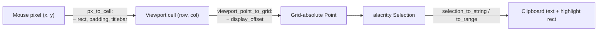
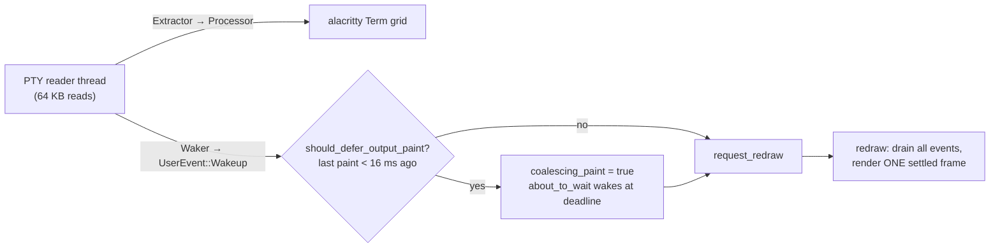

# Testing

kettle is verified by a fast, deterministic test suite plus CI smoke runs on
all three OSes. No GPU or PTY is required for the unit suite, so it runs
everywhere including CI.

## Run it

```sh
cargo fmt --all --check
cargo clippy --workspace --all-targets -- -D warnings
cargo test --workspace
```

Performance changes that claim cross-terminal movement should also run the
Windows harness and score gate:

```pwsh
cargo build --release -p kettle
pwsh -File scripts/perf/perf-all.ps1 -Label after
pwsh -File scripts/perf/score.ps1 -ResultsDir target/perf-results/after
```

For before/after work on the same machine, pass
`-BaselineResultsDir target/perf-results/before` so regressions beyond the
allowed threshold fail the gate.

## What's covered (automated)

**900+ tests across the workspace** — see
[CHANGELOG.md](../CHANGELOG.md) for the full history of additions
(feature sweeps, Terminator-parity work, production-polish passes,
resource-cap defense-in-depth sweeps, etc.). The workspace grows by 1–3
tests per feature landed, so per-crate counts below are
range-stable phrasings rather than exact figures — run
`cargo test --workspace` for today's number. The
`user_facing_docs_have_no_internal_cycle_refs` drift
guard scans user-facing docs for hardcoded "N workspace tests"
claims that go stale; TESTING.md is exempt from that scan
(contributor-leaning doc) but follows the same range-stable
discipline here.

- **kettle-vt** (80+ tests): plain-text passthrough is byte-exact;
  iTerm2 / Sixel / kitty (incl. zlib-less RGBA + chunked reassembly)
  decode to the right pixels; OSC 7 / OSC 133 are consumed and
  surrounding text still passes; OSC 1 → OSC 2 rewrite so
  vim/tmux/ranger short-titles set the tab title; a sequence delivered
  one byte at a time still yields exactly one image; an ~8 MiB
  interleaved stream passes through intact in well under 5 s
  (linear-time / bounded-memory guard). Limit and limit-plus-one tests cover
  sequence/transmission, decoded-image, animation, placement, and CPU/GPU RAII
  accounting without allocating host-scale adversarial buffers. Oversized OSC
  and DCS tests also cover real-terminator recovery, bounded recovery when no
  terminator arrives, and an `ESC` split exactly across the recovery boundary.

- **kettle-config** (190+ tests): TokyoNight Night is the verified shipped
  default theme (the self-contained `Theme::default()` fallback palette is
  Catppuccin Mocha); Ghostty `key = value` overrides, repeats, `palette`
  (0..=15 + out-of-range diagnostic), `infinite` scrollback,
  `ssh-host`; the bundled theme set has >400 entries incl. "TokyoNight
  Night"; Terminator default keybinds and trigger parsing; the
  `from_name` ↔ `action_names` round-trip drift guard; the
  `defaults_has_no_shadow_collisions` audit (no
  HashMap-shadowed bindings); the palette-completeness drift
  guard (now also covering `OpenContextMenu` / `UndoCloseTab` /
  `DuplicateTab` / `DuplicatePane` from v1.3.0); the
  example-config drift guard; the README-keybind regression guard;
  persistence preserves encoding, newline convention, comments, permissions,
  first-write backups, and symlinked dotfile targets while refusing
  non-regular/oversized files, newly malformed edits, and external changes
  observed by the final pre-stage comparison;
  session load/save atomic + corruption-backup contracts;
  empty-value resets for every string-config key;
  `clamp_font_size` bounds.

- **kettle-state**: creates and replaces private state without leaving staging
  files, preserves an existing destination's permissions, rejects symlink
  destinations, and proves exclusive advisory locks block competing handles
  and release on drop. Configuration, session, and updater tests separately pin
  each caller's validation and recovery policy on top of these primitives.

- **kettle-core VT conformance** (150+ tests): drives the *real*
  vte + alacritty_terminal path used by the PTY reader and asserts
  grid/cursor/SGR/mode state across a broad `vttest`-style sweep —
  text + `\r\n` + CUP addressing, erase-line/erase-display, SGR
  truecolor + bold + reset + dim/underline (4:3) + strikeout +
  double-underline + curly + dashed + dotted (plus the
  SGR individual attribute-off codes 22/23/24/27/29), tab stops +
  carriage return, alt-screen + bracketed-paste private modes,
  DECSTBM scroll region, DEC special-graphics line-drawing charset,
  ICH/DCH, IL/DL, DECSC/DECRC save-restore, DECAWM autowrap, DECOM
  origin mode, device responses via the real EventProxy PTY
  write-back (DSR 6n cursor-position, primary + secondary device
  attributes, DECRQM mode report, DECALN screen alignment, REP, G1
  via SO/SI, RIS, EL/ED/ECH, CHA/HPA/VPA, DECSC-restores-SGR, SU/SD,
  DECSCUSR cursor shape, NEL/IND/RI, DECID, cursor-blink mode ?12,
  CHT/CBT tab nav, DECSET 1049 alt-screen, DECSET 2026 sync output),
  OSC 4 palette query + 104 reset, OSC 10/11/12 default
  fg/bg/cursor set + 110/111/112 reset siblings, OSC 8
  hyperlink cell-carry, OSC 52 clipboard copy + paste policies,
  wide CJK (2 cells + spacer) + wide-char wrap, combining-mark
  zero-width.

- **kettle-render** (110+ unit tests + visual integration tests):
  truncate respects display columns (not chars), the
  `clamp_font_size` floor/ceiling/NaN/∞ contract, the
  `cap_axis_cells` GPU-texture safety guard, color
  resolve / dim / minimum-contrast WCAG math, the offscreen GPU
  pipeline self-test (real wgpu pipelines compile + render through
  Vulkan/Metal/DX12), shared-image source-rectangle UV validation,
  independent inline/wallpaper instance limits, and same-texture draw batching.
  The v2.25.1 grid-regression guard renders
  zsh-style `➜  ~`, POSIX, lambda/starship-style, git-status, and
  PowerShell-style prompt lines through the cell-locked glyph pipeline,
  toggles only the block cursor between two offscreen frames, and
  asserts every non-cursor prompt pixel remains unchanged. The
  `tests/menu_visual.rs`
  integration test renders both `DebugScene::Default` and
  `DebugScene::ContextMenu` PNGs via `capture_png_with`, then
  asserts ≥ 1000 pixels differ between the two AND ≥ 200 fg-leaning
  pixels appear in the menu area — catches the v1.3.0/v1.3.1
  blank-menu render-pass-order regression class that bare logic
  tests can't see. Live-screenshot unit coverage verifies whole-frame
  preservation, exact row/column cropping, out-of-surface rejection, and
  truncated-source rejection; the native live smoke exercises the asynchronous
  readback path.

- **kettle-ui** (290+ tests): split-tree layout tiles with no
  gaps/overlap, `remove_leaf` collapses to the sibling, nested
  splits keep every leaf; `Node::leaf_ids` DFS-order +
  `nth_leaf`/`leaf_index_of` symmetry; `close_tab_at` and
  `close_window` tab-reaping with active-index
  bookkeeping; `reap_tabs` keeps focus on the same tab
  after a pane death; `close_focused_promotes_sibling_in_two_pane_split`
  (the v1.3.0 fix for `Ctrl+Shift+W` closing whole tabs);
  `next_context_menu_highlight_skips_separators_and_disabled`
  + `clamp_context_menu_anchor_keeps_panel_on_screen`;
  `classify_tab_activity_picks_the_right_indicator`
  + `classify_tab_activity_transitions_to_silent_after_threshold`;
  `closed_tab_ring_bounded_and_lifo`;
  `tab_drag_target_index_clamps_to_strip`;
  `hovered_close_button_finds_only_the_close_rect_hits`
  + `tab_close_hover_icon_overrides_chrome_default`;
  selection-autoscroll ladder; cwd-basename tab-title fallback;
  the SSH and `-e PROG` initial-pane-title heuristics;
  session JSON round-trips, durable private save,
  symlink refusal, permission tightening, and corruption/oversize backup
  contracts; xterm modifier encoding + paste payload bracketing +
  injection-guard.
  Runtime-diagnostic tests verify control-character stripping, message bounds,
  private Unix directory/file modes, and ten-record rotation without needing a
  live event loop. Idle-loop regressions pin the cursor-blink truth table,
  require the phase timestamp to advance before a redraw request, and normalize
  repeated empty IME preedit notifications to the same absent state.

- **kettle-remote** (30+ tests): injected process-tree fixtures cover SSH and
  container detection, deterministic breadth-first selection, cwd/shell clone
  behavior, cycles, missing roots, and injection-safe reconnect commands. The
  portable proc parsers reject invalid/overflowed PIDs and preserve lossy argv;
  Linux CI additionally builds a synthetic proc tree and proves the rooted
  scanner finds the requested SSH descendant and cwd without reading an
  unrelated process.

- **Multi-window (v2.18.0, cross-crate)**: the tab tear-off drag is a
  pure FSM (`DragState` in `kettle-ui/src/detach.rs`) tested with no
  window or GPU — idle→armed→dragging threshold, mouse-up/Esc-cancel
  returning the dragged tab, cursor leave/re-enter, plus an
  end-to-end drag walkthrough; the per-window accent **presence
  registry** (`kettle-ctl/src/presence.rs`) pins claim/release
  round-trips, private directory/file modes, dead-PID pruning, bounded and
  no-follow reads, filename/payload validation, rejected hue updates, and
  in-place valid hue updates against a temp dir; **shell detection**
  (`detect_shells_windows`/`_unix`,
  kettle-core) is pure over injected closures (PATH lookup, WSL
  enumeration, vswhere, Git Bash probe), so the Windows-Terminal
  ordering / skip-when-absent / never-empty cases run on every OS;
  **session v2** round-trips multi-window saves with geometry
  (`session_v2_windows_round_trip_with_geometry`) and still loads
  legacy single-window files; and the **exit-allowlist drift guard**
  (`event_loop_exit_sites_are_allowlisted`, kettle-ui) pins the only
  code paths allowed to terminate the process, now that closing one
  window must leave the others running. Bare-launch activation tests cover
  private lock/socket permissions, first-process election, matching handoff,
  incompatible recorder identity, bounded request validation, UI rejection
  fallback, and the `--new-process`/explicit-argument bypass contract.
  Live-reload regressions additionally pin the filesystem event-kind matrix:
  opens, reads, closes, unrelated paths, and backend-specific `Other` events do
  not reload; create/modify/remove and imprecise `Any` changes to the exact file
  do. Concurrent notifications prove the one-in-flight latch, failed sends
  prove re-arming, and process-level source guards require one config load
  followed by application to every mapped window while preserving per-window
  runtime zoom on a no-op reload.

- **kettle** (binary, 50+ tests): clap argv parsing for the
  `-e` + `-d` + `--config` combination; the
  `format_ssh_hosts` table renderer (sort + column alignment +
  empty fallback); the
  `cli_help_text_has_no_internal_cycle_refs` audit-trail leak
  guard; the
  `cli_help_preserves_indented_code_examples` drift guard that
  pins `verbatim_doc_comment` on every flag with an indented
  example block (the bug the v1.2.1 patch landed against).

## End-to-end harness: selection, copy & `.cast` replay

The no-PTY conformance harness in `kettle-core/src/term.rs` (`harness()` +
`feed_ex()`) builds a real `Term` and drives the **same Extractor → Processor →
grid pipeline the PTY reader uses**, with no PTY and no child process — so a
whole interactive session (Claude Code, Codex CLI, AstroNvim, tmux) can be
replayed deterministically in CI.

**Selection / copy across scrollback.** Mouse selection involves three
coordinate spaces; the bug here was a missing `− display_offset`
when converting a click to the grid-absolute point alacritty's `Selection`
expects, so copying an earlier chunk *while scrolled up* (the constant motion in
a long Claude Code conversation) read the wrong rows:



Guarded by `selection_while_scrolled_reads_visible_row_not_active_screen`,
`simple_drag_selection_while_scrolled_copies_visible_rows` (kettle-core) and the
pure `viewport_point_to_grid_applies_display_offset` (kettle-ui). The same
conversion now also feeds smart double-click selection and its grid-row text
read, so word-select works while scrolled too. The live interaction harness
also generates 140 numbered history lines and reproduces the complete
Shift+Home → first-line click → Shift+End → Shift+click-last-character flow.
It asserts the exact selected text through the additive `read_screen.selection`
field and dispatches Copy. The test also guards that no-op action resizes do not
erase the selection.

**Agent/editor file links.** `links_with_cwd_detects_file_paths_without_splitting_urls`
drives the same grid harness with Codex/Claude-style `path/to/file.rs:line:col`
output and verifies that pane-cwd-relative paths become local `file://` links
without splitting URL text into extra file links.

**Output coalescing.** Apps that repaint without DEC 2026
synchronized output (Claude Code toggles `?25l/?25h` ~1750×/session and never
opens 2026) can be snapshot mid-repaint under load — the transient "cursor above
the prompt". kettle caps PTY-output paints to one per `OUTPUT_FRAME_BUDGET`
(~16 ms — a 60 fps cap) so a multi-read burst settles into one frame; input/cursor
paints bypass the cap so typing stays instant:



Guarded by the pure `output_paint_coalesces_within_frame_budget` (kettle-ui).

**Frame presentation transaction.** A successful Rust return from surface
acquisition does not always mean pixels reached the compositor. The
`output_generations_commit_only_after_presentation` regression drives
`Presented`, `RetryLater`, `Occluded`, and `SurfaceLost` through the same commit
helper used by the live UI and proves that only `Presented` advances the
window's consumed output map.

The pure `FrameRecoveryState` regressions
`frame_timeout_retries_are_one_shot_deadlines_with_a_cap`,
`frame_retry_stays_armed_but_quiescent_while_hidden_minimized_or_occluded`,
`renderer_rebuilds_back_off_until_a_frame_presents`, and
`renderer_rebuild_supersedes_a_pending_surface_retry` verify capped timeout
pacing, hidden/minimized/occluded quiescence, stronger-repair precedence, and
the rule that only presentation resets renderer-rebuild history. Renderer and
UI compilation keeps the public `FrameOutcome` contract exhaustive; native
live-render smoke remains responsible for actual window-system presentation
and wgpu surface recreation.

**Context-menu frame fast path.**
`pane_snapshot_reuse_fails_closed_on_output_layout_or_order_changes`
exercises the snapshot identity/generation/dimension gate, and
`context_menu_hover_changes_only_quad_damage` proves the menu text-damage key
ignores highlight motion but changes for scrolling and enabled text color.
`capture_carries_cursor_blink_state_for_lock_free_ui_redraws` keeps the cached
blink bit wired through `PaneSnapshot::capture`, while
`cursor_glyph_damage_key_reuses_only_identical_vertices` covers the retained
cursor-glyph vertices. These structural tests prove the no-lock/no-reshape
route; native interaction capture remains the evidence for input-to-present
latency and frame pacing.

**`.cast` replay.** `replays_asciicast_v2_output_into_grid` parses an asciicast
v2 trace — the exact format [`docs/RECORDING.md`](RECORDING.md)'s recorder
writes — and feeds its `o` (output) events through the harness, asserting grid
text + SGR state. A scrubbed recording of a real agent session can therefore be
committed as a regression fixture and re-fed without a PTY or auth.

**Recorder boundaries.** `kettle-core` tests exact-limit and limit-plus-one
events, UTF-8 splits, the visible limit marker, unique private directory files,
exclusive-writer refusal, link rejection, locked-file retention, and pruning by
both count and bytes without touching unrelated names. `kettle-ui` pins the
`[REC]` / `[REC LIMIT]` / `[REC ERROR]` title states and lossless redraw/close
fan-out. `kettle exec` integration tests prove an unavailable recording path
prevents child startup with status 125 and that cancellation promptly closes a
replayable trace.

**Windows Codex footer cursor.** Native Windows Codex goes through ConPTY. Its
active repaint can finish with a visible cursor on the status row and then move
the cursor over the DIM empty composer placeholder in a separate PTY read.
`kettle-render` keeps parsed visibility, shape, and blink state intact, but
suppresses those two renderer-only artifacts when the surrounding active Codex
footer proves the context. A non-DIM queued-input caret remains visible. A
scrubbed two-read Codex/ConPTY replay and negative fixtures cover the policy
without committing a private recording.

**Synchronized-update timeout and PTY bounds.** The reader tests open a real DEC
2026 synchronized update, omit its close sequence, wait through the parser's
deadline, and assert one forced flush/wakeup. A split close sequence arriving
before the deadline must not force-flush. Ready data queued after expiry must be
preserved but only returned after the buffered update is applied, while EOF
before expiry flushes immediately. A separate capacity assertion pins the
four-slot PTY pump queue; recycled 64 KiB buffers bound flood memory instead of
growing an unbounded channel. The raw-output sender tests separately prove a
full best-effort plugin queue drops without blocking and a full lossless queue
backpressures only until its receiver drains. `kettle exec` uses the latter with
a four-slot queue.

**Tracked-file ledger.** `just tracked-audit` walks `git ls-files --stage` and
audits every entry for path/case collisions, index/worktree hashes, UTF-8 and LF
hygiene, parseable TOML/JSON, local Markdown link targets, and bounded SFNT/PNG
tables. It writes the full per-file SHA-256 ledger to
`target/diagnostics/tracked-files-audit.json`. Add `--require-clean-index` when
auditing a staged release tree.

**Search regressions.** Search changes need focused tests at all three owning
boundaries:

- `kettle-core`: `regex-automata` meta-engine behavior; distinct invalid,
  too-complex, and 4096-byte query errors; 512 KiB NFA, 256 KiB one-pass,
  256 KiB hybrid-cache, and 40 KiB DFA ceilings; implicit whole-match-only
  captures; Smart/Match/Ignore; Unicode word boundaries; forward/reverse and
  wrapped outcomes; signed history coordinates; one-pass zero-width suppression
  and nullable-alternative priority; soft wraps, wide characters, combining
  marks, variation selectors, and ZWJ graphemes; scan cancellation; and the
  65,536-span cap;
- `kettle-core` work limits: each engine invocation and aggregate bounded call
  is <=64 KiB UTF-8; an aggregate call is also <=262,144 inspected cells and
  <=256 complete logical haystacks; a single haystack is <=256 physical rows
  and <=262,144 inspected cells. Tests must distinguish an exact continuation
  between complete hard logical lines from an immediate Results-limited barrier
  inside an over-capacity logical line, and prove neither direction skips;
- `kettle-ui`: grapheme-aware edit/selection/delete/copy/cut/paste, per-window
  state, per-pane remembered queries, the nominal 1000-line nearby/idle ranges
  with one core slice per turn, continuous-output progress, the
  non-navigation-only quiet retry, output-interrupted explicit-navigation
  Results-limited state, output/layout/query invalidation, direction shortcuts,
  result anchoring, and the invariant that UI-dispatched keys never reach the
  PTY;
- `kettle-render`: one row on wide surfaces and as many additional rows as
  needed on narrow surfaces, all control hit targets, reserved content rows,
  signed multi-line projection, active/inactive colors, every bounded status
  including Pattern too complex, and linear visible-cell/span traversal.

For a deterministic live check, start a disposable full control server, emit
repeated history markers into its focused pane, then use Kettle-owned input:

```sh
kettle ctl perform_action --text start_search
kettle ctl dispatch_ui_key --keys "n,e,e,d,l,e"
kettle ctl ui_geometry --raw
kettle ctl dispatch_ui_key --keys "enter,shift+enter,f3,shift+f3,escape"
```

`ui_geometry.search` must report the bar/control rectangles, target pane,
status, `has_match`, truncation, Wrap, Case, and Invert states. The Search
object must not contain the raw query or matched terminal text. Use `kettle ctl screenshot --json
'{"full_window":true,"path":"/tmp/kettle-search.png"}'` plus `read_cells` to
verify historical and soft-wrapped highlight pixels. Do not substitute
`send_keys` in this test:
`send_keys` intentionally targets the PTY; `dispatch_ui_key` is the bounded
modal-only path and must fail when no supported modal is open.

**Search engine-budget performance probe.** This is a local diagnostic, not a
CI pass/fail benchmark. On the 2026-07-22 audit machine (i7-1165G7, Rust 1.96.0,
`regex-automata` 0.4.14, optimized `rustc -O`, pinned to CPU 3), the worst
accepted adversarial family `(?:\w?){8}\P{Letter}\b` took a three-sample median
17.8 ms for a no-match 64 KiB haystack. That is the production single-call
ceiling. Larger diagnostic inputs scaled to 35.8/71.3/143.6/288.5 ms at
128 KiB/256 KiB/512 KiB/1 MiB respectively, but production never passes those
sizes to one invocation. N=10 needs 543,244 NFA bytes and must compile as
Pattern too complex; N=200 needs 10,050,980 bytes and demonstrates the prior
unbounded risk (1.56 s per 256 KiB no-match and about 11.3 MiB static memory).

The ignored probe lives at `target/diagnostics/regex_limits.rs`; build and run
it against the checkout's `regex-automata` target rlib:

```sh
rustc -O --edition=2024 target/diagnostics/regex_limits.rs \
  -L dependency=target/debug/deps \
  --extern regex_automata=target/debug/deps/libregex_automata-c458cab110e7d576.rlib \
  -o target/diagnostics/regex_limits
taskset -c 3 target/diagnostics/regex_limits extra
taskset -c 3 target/diagnostics/regex_limits engines
taskset -c 3 target/diagnostics/regex_limits cachefamilies
```

The rlib fingerprint is specific to that recorded checkout and changes after a
dependency rebuild. Preserve raw results with the release audit; do not promote
this host-specific median to a cross-platform CI threshold. Full details and
the evidence boundary are in
[AUDIT-2026-07-22-SEARCH.md](AUDIT-2026-07-22-SEARCH.md).

The settled local checkpoint also passed the core search tests (27/27), full
core library tests (179/179), UI library tests (320/320), the renderer bounded
status test (1/1), warnings-denied all-target clippy for all three owning
crates, `cargo fmt --all --check`, `git diff --check`, and
`just live-ui-helper-selftest`. The post-hardening Xvfb history E2E is retained
at
`target/diagnostics/search-history-e2e-settled/search-history-20260722-164503/`;
its navigation statuses were Wrapped/Match/Match/Match. These are local Linux
artifacts, not substitutes for the still-pending workspace/strict gates,
GitHub CI, or native Windows/macOS checks.

## Manual / interactive checks

These need a real display and are run by hand (or on real hardware):

- **VT conformance**: run [`vttest`](https://invisible-island.net/vttest/)
  and walk the cursor/erase/SGR/mode screens.
- **TUIs**: `nvim`/AstroNvim (icons, undercurl, truecolor, mouse), `tmux`,
  `htop`, `fzf`, `less`.
- **Images**: `img2sixel`/`chafa -f sixel`, `kitten icat`, iTerm2 `imgcat`.
- **Shell integration**: enable the snippet from
  [SHELL-INTEGRATION.md](SHELL-INTEGRATION.md), then `Ctrl+Up`/`Ctrl+Down`
  to jump between prompt marks.
- **Perf**: `cat` a ~100 MB file / fast `yes` stays responsive.
- **Platform compatibility**: before a release, verify the shipped binary on
  Ubuntu, native Windows 11, and Windows 11 WSL. Windows 11 is a known-good
  baseline for v2.25.0 behavior, so renderer fixes must not regress ConPTY,
  PowerShell/cmd startup, GUI-subsystem piped stdout, shell integration, or the
  installer. WSL verification should cover Linux shells and the same CLI/agent
  flows launched from inside a WSL pane.
- **Agent gauntlet** (run on **Windows + WSL**; see [AGENT.md](AGENT.md)):
  - **Local agent/TUI CLIs**: `scripts/check-agent-cli-smoke.sh` launches any
    installed Codex CLI, Claude Code CLI, tmux, and Neovim/AstroNvim through
    `kettle exec --strip-ansi` and verifies they print/paint and exit cleanly.
    Before those optional probes, it always verifies Kettle's own PTY env,
    a real Kitty keyboard capability-query round trip, `kettle exec --json`
    output events, and `kettle mcp --self-test`. The tmux probe verifies
    `tmux-256color`, progressive extended keys, and Kettle's additive terminal
    feature declaration. Missing
    optional tools are reported as skips, so this is a real-machine smoke rather
    than a portable CI gate.
  - **Live agent/TUI window**: `just agent-tui-smoke` opens a real
    grid-renderer Kettle window, drives a shell marker, a prompt-shaped `➜  ~`
    marker, deterministic Windows Codex active-placeholder and queued-input
    cursor fixtures with cell-level pixel assertions, optional
    Codex/Claude CLI version probes plus `codex exec --help` /
    `claude --print --help` output captures, tmux attach/send/capture and a
    tmux-managed horizontal split workflow when `tmux` is installed,
    clean/configured Neovim marker buffers, and clean/configured
    Neovim/AstroNvim vertical-split workflow states through `kettle ctl`, then
    saves PNG, `read_screen`, `read_cells`, and
    `analysis.json` artifacts under `target/diagnostics/agent-tui-*`. It fails
    if a captured state is blank or lacks visible terminal cells. When tmux is
    present, the run includes `tmux.png`, `tmux-split.png`, matching screen
    JSON, and matching cells JSON. When Neovim is present, it includes both
    `nvim-split-clean` and `nvim-split-configured` states.
    `KETTLE_AGENT_AUTH_SMOKE=1 just agent-tui-smoke` additionally runs real
    serialized authenticated `codex exec` / `claude --print` marker prompts
    inside the Kettle pane and records `*-auth-session` probes. Success requires
    an exit code of zero **and** an exact response marker between a generated
    output boundary and the emitted `DONE:<exit-code>` token; prompt text echoed
    by the shell is outside that frame and cannot satisfy the probe. The helper
    self-test runs in the normal CI matrix and pins this distinction, including
    a failed-command/stale-exit-code transcript. External auth failures are
    captured as `auth_failed`; set `KETTLE_AGENT_AUTH_SMOKE=strict` when missing
    credentials should fail the run.
  - **Live interaction window**: `just interaction-smoke` opens a real
    grid-renderer Kettle window and drives multiline text entry, scrollback
    mouse wheel movement, local selection drag, the exact keyboard/Shift-click
    whole-history selection workflow, tab-bar `+` tab creation,
    right-click context-menu opening, Settings modal open/close from that menu,
    context-menu `Split Right` dispatch, split-window resize, and Command
    palette opening from the new-tab dropdown through `kettle ctl`, plus Search
    opening through `perform_action start_search`, editing/stepping through
    `dispatch_ui_key`, and control/status assertions through `ui_geometry`.
    The Search probe must include a negative-line history result, a soft-wrapped
    result, invalid/too-complex/too-long patterns, an exact resumable work yield,
    an in-line capacity Results-limited barrier, no-wrap boundaries,
    continuous-output progress, non-navigation quiet verification, an
    output-interrupted explicit navigation that remains Results limited until
    retry, close anchoring, and a PTY sentinel proving modal input was not
    forwarded. It also drives the SSH
    launcher, layout picker, quick-select hint mode, and window/tab/pane
    title-edit overlays through `perform_action`, with a visible URL fixture for
    hint mode. It emits OSC 777 from inside the live pane and asserts the
    subscribed control event stream receives a `protocol_notification` event
    with the expected title/body. It writes PNG, `read_screen`, `read_cells`,
    `ui_geometry`,
    `notification-events.jsonl`, and `analysis.json` artifacts under
    `target/diagnostics/interaction-*`, and asserts default `read_screen`
    follows the visible scrolled viewport, modal state is reported by
    `ui_geometry`, title-edit chrome does not intersect the terminal content
    rect, and resize updates the focused pane grid.
  - **`kettle exec`**: `kettle exec -- echo ok` — output is piped to stdout and
    the child's exit code propagates (`kettle exec -- sh -c 'exit 7'` → 7).
    On Unix/WSL, also verify stdin-driven one-shots:
    `printf 'ok\n' | kettle exec --strip-ansi -- sh -c 'read x; echo "got:$x"'`.
  - **Control server + `kettle ctl`**: launch `kettle --agent-server full`, then
    cross-process `kettle ctl get_state` / `list_panes` / `send_text` /
    `read_screen`. For UI regressions, also use `ui_geometry`, `read_cells`,
    `send_mouse`, and `screenshot` to drive/capture deterministic tab and
    underline states. On Windows the GUI first-paint can take a few seconds —
    poll the discovery registry until the entry appears before issuing `ctl`,
    and capture `kettle ctl` output via a programmatic spawn (the GUI-subsystem
    binary auto-detaches stdout from an interactive shell, so a piped invocation
    from the same console shows nothing).
  - **`kettle mcp`**: `kettle mcp --self-test` (in-process handshake +
    `tools/list` + one `kettle_run`). CI also runs
    `crates/kettle/tests/mcp_stdio.rs`, which spawns the real `kettle mcp`
    process and speaks newline-delimited JSON-RPC over stdio — the boundary
    Claude Code / Codex use when the server is registered as an MCP. Protocol
    tests must cover both supported revisions, the exact initialized
    notification, initialization-time ping, notification silence, malformed or
    unknown tool envelopes, encoded-response truncation, 1 MiB/768 KiB framing
    limits, queue saturation, duplicate ids, and cancellation. `kettle-ctl`
    loopback tests separately pin response deadlines, cancellation, strict
    frame/id validation, and preservation of events that precede a response.
  - **Live MCP**: `claude --mcp-config .mcp.json --strict-mcp-config -p "use
    kettle_run to echo a marker"` — Claude Code drives the MCP tools end-to-end.
  - **Live renderer/UI diagnostics**: on a Linux desktop run
    `just live-render-smoke`, `just interaction-smoke`, `just tabbar-click-smoke`,
    `just tearoff-smoke`, `just tab-title-smoke`, `just split-titlebar-smoke`,
    `just zoom-keybind-smoke`, and `just underline-scroll-smoke`. Artifacts land under `target/diagnostics/*`
    for frame-by-frame review. The tearoff recipe is two-tier: a portable
    ctl tier proves the mouseless `move_tab_to_new_window` tear +
    `tab_moved` broadcast (plus the `tear_lift`/`dock_highlighted`/`band`
    diagnostics in `ui_geometry`), and an X11-desktop tier
    (`scripts/check-tearoff-live-smoke.sh`) drives xdotool REAL pointer
    input through the full gesture — tear, freeze-guarded follow, re-dock
    merge, Esc cancel — once per carry path (native `_NET_WM_MOVERESIZE`,
    then `KETTLE_TEAR_MANUAL_FOLLOW=1` forcing the manual-follow/rescue-
    tick fallback). Real input is load-bearing: `maybe_tear_off` and
    re-dock respond only to native winit pointer events, so ctl
    `send_mouse` cannot reach them by design; the dock-highlight visuals
    are verified by recorded-frame analysis rather than this smoke (the
    ctl geometry endpoint only addresses the focused window mid-drag). Tabbar runs write `analysis.json` with the
    old/new active tab rects and outside-rect pixel-change counts; tab-title
    and split-titlebar runs assert cwd-derived labels use the available title
    budget before ellipsizing. Underline runs write
    `analysis.json` with the visible underlined sentinel sequence across down/up
    scrolling plus per-row SGR underline, plain-row, and autodetected `/` and
    `\` path-overlay pixel hit counts from the PNG frames. The underline probe
    uses the renderer cell metrics from per-frame `ui_geometry` rather than
    deriving cell size from the full screenshot, so unused bottom/right surface
    pixels cannot masquerade as row drift.
    `delta_fixtures` records whether the git and SVN `diff | delta` fixtures
    were active. Interaction runs include
    `notification-events.jsonl` and `notification-event.json` for the OSC 777
    event-feed assertion. Native
    Windows runs the tabbar/underline recipes through
    `scripts/check-live-ui-smoke.py`; WSL uses the Unix shell scripts. Run those
    platform-local recipes before changing renderer defaults or tab/underline
    interaction code.

Search release evidence is platform-scoped. Run the live interaction/search
probe on an Ubuntu Wayland or X11 desktop and on native Windows 11; exercise the
same pane under tmux, clean Neovim, configured AstroNvim, Codex CLI, and Claude
Code CLI where installed. macOS and Windows/WSL results remain separate checks:
never infer them from a Linux unit test or an offscreen renderer pass. Record
missing tools and unrun platforms as explicit skips in the release audit.

## Pattern: audit-driven hardening

kettle's test count grows mostly through targeted bug hunts — each pass
finds a silent-fallback bug, parity gap, or docs-drift on a specific surface,
extracts a pure helper if applicable, wires it in, and pins the contract
with a test. See [CHANGELOG.md](../CHANGELOG.md) for the full list;
the pattern is documented in `### Tests` and `### Fixed` entries that
name the shape of bug each pass caught.

## CI

`.github/workflows/ci.yml` runs on **ubuntu/macos/windows**:

- `fmt --check`, `build --all-targets`, `clippy -D warnings`,
  `cargo test --workspace` on every OS.
- `cargo doc --no-deps` with `RUSTDOCFLAGS=-D warnings` (Linux only —
  catches broken intra-doc-links, malformed examples; rustdoc is
  platform-agnostic so one runner suffices).
- A **headless GPU smoke** under Xvfb + software Vulkan on Linux.
- The **`--screenshot` end-to-end** +
  **`--screenshot-menu` visual regression** smokes on Linux
  (both run the release binary under `LIBGL_ALWAYS_SOFTWARE=1`).
- A CLI smoke on every OS: `--version` SHA-regex,
  `--check-config` lead line, `--config-path`, `--list-themes`
  > 400, `--list-actions` > 50, `--list-keybinds` > 40,
  `--list-ssh-hosts` empty fallback, `--print-default-config`
  round-trip, `--shell-integration <bash|zsh|fish>` snippets,
  `--print-completions <bash|zsh|fish>` scripts,
  `--config /<typo>` + `--working-directory /<typo>` hard-fail
  exit codes, happy-path basename round-trip
  (Windows path-translation parity).
- The **MSRV verification job** — pinned `dtolnay/rust-
  toolchain@1.89` builds + tests the workspace at the declared
  floor, catches a future transitive-dep MSRV bump at PR time
  instead of release time.
- The **iconutil / ico packaging smoke** on macOS and
  Windows runners — verifies the .icns / .ico build assets stay
  intact on every push (not just release tags).
- The Windows installer smoke covers both portable install/uninstall and an
  isolated default install. It seeds a pre-existing Start shortcut with stale
  PowerShell launcher arguments, upgrades it, and verifies the shortcut target,
  empty argument list, working directory, registry entry, and cleanup. Sentinel
  state also verifies a portable uninstall cannot remove default-install
  shortcut, registry, PATH, or PowerShell profile state.
- **Session recording** — recording is a runtime toggle (`record = on` /
  `--record`) compiled into every build, so the default build/clippy/test
  exercise the GUI recording flags, input tokens, markers, and status UI
  directly (no separate feature leg). See [RECORDING.md](RECORDING.md).

Separate workflows:

- `.github/workflows/audit.yml` — `rustsec/audit-
  check` on every Cargo.lock change + daily 06:00 UTC cron.
- `.github/workflows/release.yml` — mandatory Windows, macOS, Linux x86_64,
  and Linux aarch64 packaging on every verified `v*` tag. One protected
  finalizer validates all archives and sidecars, signs the update manifest,
  renders Homebrew/AUR metadata from the archive bytes, verifies the exact
  14-asset draft, and publishes it once.
- `scripts/check-package-templates.sh` — tests deterministic Homebrew/AUR
  rendering from source `.in` files and, once the matching release exists,
  checks its generated `kettle.rb` and `PKGBUILD` against the published
  `.sha256` sidecars. CI runs it on Linux.
- `scripts/check-linux-installers.sh` — starts from the release binary produced
  by CI, installs into throwaway custom prefixes, and verifies desktop, man,
  icon, helper, and `local-dev` ownership state. It proves that this normal
  binary is refused for `--record-dir`, builds the `dev-record` variant, and
  repeats with prefix/record paths containing every Desktop Entry quoting edge
  (`\\`, `%`, `$`, `"`, and backtick), plus private mode and symlink-refusal
  checks. The original normal binary is restored for a simulated stable
  release-tarball install. When the matching release tag and platform asset are
  both published, the script also runs `install-online.sh` and verifies SHA-256
  and prefix-local uninstall behavior. A tag whose asset still returns 404 is
  treated as an in-progress release; other asset-probe failures remain fatal.
- `scripts/check-windows-installer.ps1` — runs on Windows CI after the release
  binary is built, installs to a throwaway custom prefix, verifies the portable
  install payload, then uninstalls through the saved helper without repeating
  `-Prefix`.
