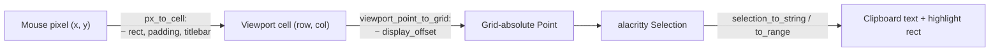

# Testing

kettle is verified by a fast, deterministic test suite plus CI smoke runs on
all three OSes. Most parser, state, and UI-decision tests need neither a GPU
nor a PTY. The full workspace suite intentionally also opens an offscreen wgpu
device and runs a small number of native PTY/ConPTY lifecycle tests. An
adapter-less host can soft-skip the GPU test and a restricted sandbox can
soft-skip the PTY tests, but that is reduced coverage and must not be reported
as a native GPU or PTY pass.

## Run it

```sh
cargo fmt --all --check
just gauntlet
```

### Strict and full gates

Before a release or supply-chain change, also run:

```sh
just gauntlet-strict
```

The strict gate includes the normal gauntlet, direct patched-crate validation,
RustSec advisory scans of the product and vendor lock graphs, the scoped
`ttf-parser` and `lru` exception guards, dependency-policy checks,
unused-dependency checks, and the tracked-file ledger. Both guards fail when
their reviewed inverse path changes; the `lru` guard also pins the upstream
crates.io sources and versions whose API reachability was reviewed for
RUSTSEC-2026-0253. It reads
locked Cargo metadata without a platform filter, so target-specific Windows
and macOS consumers remain visible when the guard runs on Linux CI. Install
`cargo-audit`, `cargo-deny`, and
`cargo-machete` locally first; a missing tool fails the recipe. `cargo-audit`
fetches into ignored `target/advisory-db` rather than trusting a stale global
cache.

`just gauntlet-full` adds every required native check supported by the current
OS. Its platform dependency lists contain real checks rather than successful
stubs. It prints other-OS legs as explicitly not applicable and claims only a
current-OS pass; cross-platform release evidence still requires the native CI
matrix.

### macOS appearance and icon gates

The macOS AppIcon gate runs twice on pull requests. The normal `macos-latest`
leg covers the current host, while `macOS 26 release icon toolchain` runs the
exact release host. `scripts/compile-macos-app-icon.sh` selects the newest
installed Xcode 26.x toolchain before invoking `actool`. The major pin keeps a
future Xcode preview from silently changing release assets. Both CI and the
release workflow use the same helper so a runner/toolchain mismatch cannot
first appear after a tag.

The macOS material policy has portable tests for opaque, plain-alpha, blurred,
and Reduce Transparency states. A source guard pins the AppKit-only seam: the
effect is initialized from the content frame, constrains all four edges to the
Winit content view, stays below its Metal layer, stops below an opaque native
titlebar, and has no competing geometry setter. Portable policy tests keep the effect out of
borderless windows, where it would cover the Metal view, and out of an otherwise
opaque window, where it would create a titlebar-only seam. Windows tests pin DWM
color byte order and minimum caption-text contrast. Linux tests require both a
Wayland handle and the KWin blur global, cache that registry probe per process,
and prove the 99% fallback is Linux-only; renderer tests prove the fallback
survives the replacing pane-base pass in the live window but does not change
screenshots. Those checks cannot prove native presentation. The release
appearance gate therefore records
a native decorated window with blur on and off, checks resize and full-screen on
the blurred window, repeats the style transition while borderless, and toggles
Reduce Transparency live. It verifies the titlebar seam, rounded corners,
traffic lights, drag region, and first content row by sight.

### Shell integration and completion

Shell-integration changes also run `just shell-integration-check`. Unlike the
CLI smoke's source-text checks, this executes the shipped snippets: macOS uses
interactive `zsh -f` with `PROMPT_SUBST` off and its system Bash 3.2, while
Linux CI installs Fish and executes its OSC 133 event hooks and OSC 7 cwd report.
A separate Ubuntu 24.04 job asserts Fish 3.7.x before running the same suite, so
the oldest supported completion binding cannot drift with `ubuntu-latest`.
Windows runs the PowerShell prompt-status and PSReadLine binding fixture
under each installed PowerShell host. Other hosts run the interpreters they have
and print explicit skips for native legs that belong to the CI matrix.

The same gate exercises completion metadata. Portable fixtures pin UTF-8-safe
field truncation and custom-binding preservation in all four snippets. The Zsh
fixture also emits the maximum 64-row payload under a time bound, catching a
per-byte subshell regression; Bash also proves a full non-ASCII label is not
shortened by locale-sensitive character counts. A real interactive Fish PTY
proves default and Vi-insert Tab behavior, keymap ownership changes, reverse
cycling, cursor-move invalidation, paging beyond 64 candidates, and that Fish's
pager stays closed.
It also pins the count, per-field, and aggregate retained-state caps and keeps
the selected row in a bounded wide-character wire page. Ordinary and
bounded-prefix singletons are inserted from the captured result without a
second provider query, proving neither path can re-open the stock pager. A real
Fish editor round trip pins the ordinary singleton's trailing space and an
expandable, unquoted `~user` completion. It also proves protocol v4 retains the
original typed token and current-line input prefix across forward and reverse
cycling. The PowerShell fixture pins the same replacement-span retention.
Parser tests keep v1 through v3 compatible, require both v4 presentation fields,
and degrade unsafe or oversized hint values without hiding safe candidates.
Terminal and renderer tests pin one stable command-column anchor across
candidate insertion, UI-only dismissal, Ctrl-L redraw, focus loss, Unicode
display-width math, and right-edge clamping. A same-prefix reply after the card
was hidden must retain the cursor captured with that prefix; a changed prefix
must replace both halves, and real editor input must clear them. The
deterministic fixture keeps native no-space results open, treats leading-dash
candidates as data, and counts exactly one provider call. Request-numbered
parser/state tests cover prompt sessions, duplicate same-row Fish prompt marks,
the reader-thread prompt-ring bridge, screen-clearing commands that reuse a
prompt row, a transient startup resize that preserves a single-row active
prompt, clear, re-arm, delayed old replies, rejected queue admission, Kitty
key releases, rejection of Alt/Ctrl/Super Tab, custom Tab directions, counter
exhaustion, pump-buffered prompt boundaries, and multi-key remote batches; only
an admitted current Tab may restore the card. UI guards keep DEC focus reports
in the chronological input lane without consuming that admission. A real Fish
Ctrl-L round trip
proves a moved prompt keeps publishing on its current session, while terminal
state tests prove that session remains accepted and a fresh sync may replace
it. PowerShell pins both stock-direction bindings, its quoted-directory edit,
multi-page absolute positions, the 64 KiB wire cap, and the same source-memory
limits. Its prefix and replacement token are rejected before grapheme indexing
when an editor line exceeds their presentation bounds. Native Windows runs
that fixture with PSReadLine. Parser and terminal tests bound malformed control strings,
compare every split of private metadata through the screen and raw-output
filters, sweep private-message starts around the exact recovery boundary, keep
absolute positions when unsafe rows are skipped, and reject stale replies after
unrelated input or focus loss.

Modified-Enter auto detection has an additional native Unix PTY regression. It
starts stock `zsh -f` on macOS or unconfigured Bash on Linux, proves the shell
editor's prompt is noncanonical while the shell's own process group still owns
the PTY, then starts a raw child and proves job control transfers the foreground
group through the same `foreground_process_group` API the UI samples. Portable
tests separately pin the recognized-composer allowlist, reject stale Unix pid
snapshots, prove the Windows breadth-first scan chooses a composer before its
forked helpers, and cover the policy matrix. A live `kettle ctl send_keys` check
remains useful because it exercises the GUI/control encoding path against the
actual pane.

### Vendored parser crates

The three patched crates under `vendor/` are explicitly excluded from the
product workspace, so the root gates exercise their public Kettle integration
but do not run package-owned unit targets. A separate validation workspace and
committed `vendor/Cargo.lock` pin the direct-test dependency graph.
`just deny` checks licenses, sources, and banned crates in both lock graphs;
the Audit workflow scans both for RustSec advisories. Run all retained unit
targets, doctests, and warnings-denied clippy targets with:

```sh
just vendor-check
```

CI runs `vte` plus its `alacritty_terminal` consumer on Linux. It runs
`portable-pty` on Linux and Windows because only the Windows runner compiles
and executes the `PIPE_NOWAIT` ConPTY regression. A local non-Windows
`just vendor-check` is therefore not evidence that the native Windows patch
passed.

The vendored trees intentionally preserve their upstream release formatting so
the retained patch remains reviewable against the published source. Do not run
workspace-wide `cargo fmt` against `vendor/Cargo.toml`: unchanged upstream files
are not a rustfmt gate. Keep Kettle-owned edits narrowly styled to their
surroundings; direct tests, doctests, warnings-denied clippy, audit, and deny are
the validation contract for the vendor workspace.

### Platform coverage

For full Linux coverage, install the source-build dependencies from
[INSTALL.md](INSTALL.md#from-source-all-platforms) plus `libvulkan1` and
`mesa-vulkan-drivers`. No graphical session is needed for
`gpu_pipelines_compile_and_render_offscreen`, but a working Vulkan loader and
hardware or software adapter are. Windows uses DX12/WARP or another available
wgpu backend; macOS uses Metal. The native PTY checks also need permission to
create `/dev/ptmx` children on Unix or a ConPTY on Windows.

Native ARM guest checks complement, but do not replace, the hosted release
matrix. The Parallels Ubuntu ARM guest can build and run the aarch64 product,
its PTY tests, and live Wayland scenarios. The Parallels Windows 11 ARM guest
can build the complete workspace natively once its Visual Studio ARM64 MSVC and
LLVM/Clang components are loaded with `VsDevCmd.bat -arch=arm64
-host_arch=amd64` (or `Launch-VsDevShell.ps1 -Arch arm64 -HostArch amd64`).
Visual Studio currently supplies an x64-hosted ARM64 compiler, so `cl.exe`
runs through Windows ARM's x64 compatibility layer while its objects and the
Rust target remain native `aarch64-pc-windows-msvc`.

The renderer unit fixtures force Windows ARM's DX12/WARP software adapter.
Parallels Desktop 26.4.1's ARM64 WDDM adapter faults during a headless wgpu
device request even when a single test runs, whereas the same compiled
pipelines and pixel readbacks pass under WARP. This exception is deliberately
scoped: the Windows GPU and live-UI smoke harnesses detect that exact Parallels
ARM guest and use WARP, while physical Windows machines and ordinary Kettle
launches keep hardware-first adapter selection. A Parallels guest therefore
proves the complete renderer and pixel pipeline through WARP, not the virtual
WDDM driver. The guest still
exercises native ARM64 ConPTY and every portable renderer path, but it does not
produce or validate the shipped x86_64 Windows archive; that remains the job of
hosted Windows CI and the physical x86_64 Windows machine. Record the exact
commit and adapter for each guest run, then stop the guest when the batch is
complete.

Run Windows tests as the ordinary signed-in user, not from an elevated shell.
The `kettle-update` unit-test harness deliberately embeds an `asInvoker`
manifest: without it, Windows installer detection sees `update` in the
generated executable name and refuses to start it with error 740. This is a
build-policy regression if it returns, not a reason to make Cargo
administrator-only. Because no native Windows ARM archive is published, its
unit-test build explicitly exercises the shipped x86_64 update/package
contract; the production ARM library continues to report the managed updater
as unsupported.

Read test output for `no GPU adapter ... skipped` and `no PTY ...` messages.
Those messages leave the portable suite green by design; record the missing
coverage instead of treating the exit code alone as platform validation.

### GPU devices in tests

The `kettle-render` tests that stand up a real GPU device hold a process-wide
lock so only one of them runs at a time. libtest is otherwise free to run them
in parallel, and creating and tearing down several wgpu devices at once on a
host whose only adapter is a software or basic display driver has taken the
whole test binary down with `STATUS_ACCESS_VIOLATION` — reported against
`kettle-render` with no test having failed, because the fault is in the driver
rather than in Rust. A new test that creates an adapter, device, or surface
belongs behind the same guard.

Every renderer-owned device request uses the same limit policy as the live
window. Kettle requests the adapter's full 2D texture dimension so a large
high-DPI surface remains legal, but clamps every other WebGPU default to the
adapter's advertised value. This matters on virtual GLES adapters which expose
graphics and presentation while advertising zero compute workgroups: Kettle
has no compute pipelines, so a default request for 65,535 workgroups must not
reject an otherwise usable device. The pure limit regression is portable; a
Parallels guest run is still required to prove the guest pipeline creates a
WARP device and renders. The known-bad virtual WDDM adapter is not claimed as
covered.

### Performance harness

Performance-harness changes first run GUI-free fixtures under both supported
PowerShell hosts:

```pwsh
pwsh.exe -NoLogo -NoProfile -File scripts/perf/self-test.ps1
powershell.exe -NoLogo -NoProfile -File scripts/perf/self-test.ps1
```

The Windows PowerShell 5.1 entry point reconstructs `PSModulePath` from that
engine's native machine roots and imports its engine-owned Utility manifest.
This keeps the documented command deterministic even when it is launched from
PowerShell 7 and would otherwise inherit incompatible PowerShell 7 modules.

These tests cover strict schemas, the immutable release acquisition/scoring
profiles, deterministic Williams schedules and bootstrap output, config
generation, startup and throughput marker tampering, drift and non-inferiority
policy, evidence snapshots, harness provenance, schema-2 sanitization,
synthetic EDID/CCD display-identity resolution, and complete schema-4
release-scorer rejection paths. The PS5/PS7 display fixtures cover strict
same-instance WMI connections, same-source CCD fallback, signed/unsigned
INTERNAL and physical USB-tunnel normalization, Miracast/indirect rejection,
connection removal/mismatch, checksum, product, and path tampering. The
sanitizer fixtures prove numeric, Boolean, and complex display-routing values
cannot bypass tokenization while safe build/config hashes remain public.
These remain synthetic checks: no terminal window, GPU adapter, input
injection, live monitor registry entry, or monitor transition is exercised.

Use smoke mode to inspect live discovery without claiming a benchmark:

```pwsh
pwsh -NoLogo -NoProfile -File scripts/perf/perf-all.ps1 `
  -Mode smoke -ManifestOnly -AllowUnidentifiedDisplay `
  -Label ("topology-" + (Get-Date -Format 'yyyyMMdd-HHmmss'))
```

### Cross-terminal comparison

Performance changes that claim cross-terminal movement must run the full
PowerShell 7 suite with the exact GUI binary from a verified signed prior
release and again with the clean current checkout, then run the score gate.
The following assumes the prior archive has already been signature-verified
and extracted:

```pwsh
$baselineExe = (Resolve-Path 'C:\path\to\previous-release\kettle.exe').Path
$baselineTag = (git describe --tags --abbrev=0).Trim()
$baselineCommit = (git rev-parse "$baselineTag^{commit}").Trim()
$baselineSha = (Get-FileHash -LiteralPath $baselineExe -Algorithm SHA256).Hash
$baselineLabel = "baseline-$baselineTag"
$baselineDir = Join-Path 'target/perf-results' $baselineLabel

pwsh -NoLogo -NoProfile -File scripts/perf/perf-all.ps1 `
  -Mode release -KettleCandidate baseline -KettleExe $baselineExe `
  -SkipKettleBuild -ExpectedKettleCommit $baselineCommit `
  -ExpectedKettleSha256 $baselineSha -Label $baselineLabel
pwsh -NoLogo -NoProfile -File scripts/perf/perf-all.ps1 `
  -Mode release -KettleCandidate current -Label release-candidate
pwsh -NoLogo -NoProfile -File scripts/perf/score.ps1 `
  -Mode release `
  -ResultsDir target/perf-results/release-candidate `
  -BaselineResultsDir $baselineDir `
  -RequireLatency -RequireMenuHover -RequireVtebench `
  -RequireMonitorTransition
```

The baseline requires both pins, a full commit that is an ancestor of the
current checkout, the exact GUI hash, and the colocated CLI's embedded clean
commit. The generated configuration paths may differ between the two labels,
but their bytes and hashes, all comparator terminal binaries, schedules,
toolchain and harness hashes, and every material environment field must match.
The Kettle executable identities differ by design. Result labels must be new:
an existing label directory is rejected even when empty.

Release mode requires all six named terminals in the canonical order, seed
`kettle-windows-release-v1`, offset 3, a 15-second probe cooldown, a 1280×800
comparator client, and the pinned 12 startup, 6 idle, 60 latency, 6 throughput,
10-per-transition-state, and 200-per-hover-leg samples in 20-sample blocks. The
scorer rejects every noncanonical release policy override, including dirty
manifests, looser menu/transition limits, and misleading legacy advisory
thresholds. It generates
isolated configs for Kettle, Alacritty, WezTerm, Rio, and Tabby. Windows
Terminal has no per-launch config-file switch, so it remains descriptive and
cannot contribute a confirmed win or loss.

Before live acquisition, run
`scripts/perf/setup-comparator-campaign.ps1` once with network access. The
release producer then permits only offline reuse of the exact campaign pinned
by `release-contract.ps1`: every asset, expanded tree, executable, version,
role, and Authenticode identity is verified, all confirmed-tree files remain
read-leased, and Windows Terminal must match the pinned installed Appx package.
Explicit comparator parameters and `KETTLE_PERF_*_EXE` environment overrides
are smoke-only. The schema-4 scorer independently requires the exact campaign
projection and peer identities in both current and baseline manifests.

The confirmed comparison uses raw Williams-balanced clusters, deterministic
10,000-resample 90% paired bootstrap intervals, practical margins, and 10%
trend/20% peak-to-peak drift limits. Kettle needs confirmed primary wins
against at least three of the four isolated peers with at most one confirmed
loss. Uncertainty never establishes a metric or peer win, but the authoritative
3-of-4 metric rule can confirm a peer with one uncertain metric, and the
3-of-4-peer rule can pass with one uncertain peer. Throughput additionally
requires all six paired round composites to remain positive after its 5%
margin.

The release baseline is mandatory. It must match OS, machine, CPU/GPU and
drivers, power scheme, comparator terminal binaries, isolated config bytes,
schedules, PowerShell and harness identities, and display topology. Every
required Kettle metric must pass paired non-inferiority and drift; a missing or
uncertain result fails.

The release desktop must expose the target as exactly one EDID-backed physical
monitor and must expose a second eligible physical screen for the mandatory
monitor-transition probe. Both screens must fit the 1280×800 physical-pixel
client. The fixed and native-display context-menu ROI legs are mandatory. The
transition probe chooses the maximum-contrast eligible pair deterministically
across DPI, refresh, and screen/working-area size, then intentionally moves
Kettle between those pinned monitors. The scorer independently reconstructs
that choice and every closed/open sample, direction, capture, DPI, refresh,
menu, geometry, and summary invariant. Combined and per-state p95 must be at
most 1000 ms and maximum at most 2000 ms; all six p95/max summaries must also
stay within `max(100 ms, 25% of baseline)`. Any other switch or topology change
invalidates the result.

The identity resolver prefers a unique active `WmiMonitorID`. Its fallback
requires exactly one active physical CCD path for the desktop source, requires
the returned path's exact `GUID_DEVINTERFACE_MONITOR` class, and reads EDID only
from the registry key derived from that path. Header, length, extension count,
per-block checksums, manufacturer, and product must agree; the harness never
scans registry instances by monitor model.
Unavailable, ambiguous, or inconsistent evidence stays unidentified and fails
the release gate.

CI runs the PowerShell 7 and Windows PowerShell 5.1 performance suites as
separate Windows jobs with independent 30-minute limits. This keeps each
10,000-resample release-scorer fixture bounded without consuming the
45-minute Rust/OS matrix budget.

Vtebench validation also requires the pinned WSL launcher and exact registered
distribution, clean before/after source-state signatures for every terminal
leg, and canonical path/SHA-256/version identities for Rustup, Cargo,
`timeout`, `setsid`, and `script`. Its generator and preflight run in a fixed
pseudo-TTY, all phases are bounded, and timeout cleanup is confined to the
nonce-marked Linux process group. The typed-latency fixture verifies that raw
rows match the manifest's exact `cmd.exe` path and hash. The release-score
self-test includes negative cases for each contract; those remain synthetic
tests and do not claim a live WSL terminal, GPU, or display pass.

Publish only sanitized JSON evidence:

```pwsh
pwsh -NoLogo -NoProfile -File scripts/perf/sanitize-results.ps1 `
  -ResultsDir target/perf-results/release-candidate `
  -OutputDir target/perf-public-release-candidate
```

The raw result directory remains private because it contains paths, commands,
device identifiers, and helper artifacts. See
[the harness README](../scripts/perf/README.md) for the exact timing boundaries,
sample design, margins, and limitations.

## What's covered (automated)

**2000+ tests across the workspace.** Run `cargo test --workspace` for today's
number; it was 2071 on 2026-08-22. The per-section counts below are
deliberately range-stable rather than exact, because the workspace grows by one
to three tests per feature landed and an exact figure is wrong again within a
release. [CHANGELOG.md](../CHANGELOG.md) records what was added when.

The `user_facing_docs_have_no_internal_cycle_refs` drift guard scans
user-facing docs for hardcoded "N workspace tests" claims that go stale. This
file is exempt, being contributor-facing, but follows the same discipline.

### kettle-vt (80+ tests)

Plain-text passthrough is byte-exact;
iTerm2 / Sixel / kitty (incl. zlib-less RGBA + chunked reassembly)
decode to the right pixels; OSC 7 / OSC 133 are consumed and
surrounding text still passes; OSC 1 → OSC 2 rewrite so
vim/tmux/ranger short-titles set the tab title; a sequence delivered
one byte at a time still yields exactly one image; an ~8 MiB
interleaved stream passes through intact in well under 5 s
(linear-time / bounded-memory guard). Limit and limit-plus-one tests cover
sequence/transmission, decoded-image, animation, placement, and CPU/GPU RAII
accounting without allocating host-scale adversarial buffers. Oversized OSC
and DCS tests also cover real-terminator recovery, bounded recovery when no
terminator arrives, and an `ESC` split exactly across the recovery boundary.
Kitty deletion fixtures cover visible, image/placement, cursor, cell,
cell-plus-z, id-range, column, row, z-index, and frame selectors; lowercase
retain-data versus uppercase free-data; independent named virtual
placements; interrupted image/frame uploads; and delete-before-replace
ordering within one extractor feed. Placement fixtures preserve
`x/y/w/h`, `c/r`, `X/Y`, and `C` across transmit, put, and relative commands.
Screen-lifecycle fixtures prove that primary and alternate Kitty stores can
reuse one image id without collision; mode 47 preserves the alternate store
across both boundaries; mode 1047 preserves it on entry and clears it on
exit; mode 1049 clears it on entry and preserves it on exit. ED 2 is
active-buffer-only and RIS clears both stores. Saturation fixtures pin that a
transmission the full image store refuses still draws but advertises no image
id (and that its `U=1` virtual form is refused outright), and compositing
fixtures pin straight-alpha source-over against a transparent and a partly
transparent destination, not only an opaque one, plus the zero-alpha
short-circuit the blend's divisor depends on.

### kettle-core image lifecycle

The terminal engine's authoritative journal
preserves parser execution order for RIS, ED 2, DECSET/DECRST 47/1047/1049,
and DECSTBM scrolls. Direct vendored-crate tests pin its 256-event bound,
compatible-scroll coalescing with the complete monotonic screen delta,
sticky overflow/current-screen snapshot, recovery after drain, and exact
47/1047/1049 text-buffer behavior. Core registry tests pin mode 47
preservation, 1047 exit clearing, 1049 entry clearing plus exit preservation,
primary-store restoration, ED 2 active-only clearing, RIS clearing of both
stores, and fail-safe two-buffer clearing/resynchronization after overflow or
an inconsistent sequence. Direct VTE tests pin unforgeable marker ordering at
exact byte offsets, nested synchronized-update boundaries, and the 256-marker
cap. Extractor tests prove Sixel, Kitty, and iTerm2 controls retain their
exact terminators while deferred and that a deferred Kitty transmit does not
mutate decoder state before replay. Core DEC 2026 regressions interleave
images with 1049 enter/leave in both orders, prove image cursor movement
precedes later buffered text, keep text/images and the output generation/wake
invisible before close, fail closed on deferred-queue overflow, and prove the
shared deadline/EOF force-flush path replays buffered graphics before its
single paint publication.
Partial-scroll regressions prove that wholly contained placements move, crop
at the top/bottom margin, compose repeated normalized source ranges, retain
raw Kitty DPI intent after permanent cropping, leave margin-crossing images
fixed, retain history document ids, and reanchor rows fixed outside
the region. Natural-size and one-axis-auto monitor-change regressions verify
that recomputation preserves the composed crop, document anchor, and
post-scroll fractional y offset while updating horizontal geometry and the
cropped occupied-row count. A greater-than-page-height coalescing case guards
the complete screen-top delta. Column reflow clears regular/relative anchors while
retaining virtual prototypes in both active and parked state.

### kettle-config (190+ tests)

TokyoNight Night is the verified shipped
default theme (the self-contained `Theme::default()` fallback palette is
Catppuccin Mocha); `key = value` overrides, repeats, `palette`
(0..=15 + out-of-range diagnostic), `infinite` scrollback,
`ssh-host`; the bundled theme set has >400 entries incl. "TokyoNight
Night"; default keybinds and trigger parsing; the
`from_name` ↔ `action_names` round-trip drift guard; the
`defaults_has_no_shadow_collisions` audit (no
HashMap-shadowed bindings); the palette-completeness drift
guard (now also covering `OpenContextMenu` / `UndoCloseTab` /
`DuplicateTab` / `DuplicatePane` from v1.3.0); the
example-config drift guard; the README-keybind regression guard;
persistence preserves encoding, newline convention, comments, permissions,
first-write backups, and symlinked dotfile targets while refusing
non-regular/oversized files, newly malformed edits, and external changes
observed by the final pre-stage comparison;
implicit config provenance tests reject group-writable requested and symlink
target directories, pin trusted ownership and a single name for the requested
link itself, and retain a legitimate user-owned dotfile link while the
explicit-path mode loads the same bounded regular files; the corresponding
Lua tests prove automatic `init.lua` uses the trusted path, explicit
`--lua-script` keeps its escape hatch, and a dotfile-manager symlink loads only
through a trusted link and resolved target;
CLI `--check-config` exercises the same bounded reader against a resolved
default-path FIFO and oversized file, and verifies UTF-16LE/BE BOM decoding;
session load/save atomic + corruption-backup contracts;
empty-value resets for every string-config key;
`clamp_font_size` bounds.

### kettle-state

Creates and replaces private state without leaving staging
files on handled outcomes, safely reclaims exact dead-creator crash remnants,
preserves an existing destination's permissions, rejects symlink
destinations, and proves exclusive advisory locks block competing handles
and release on drop. Reaping tests preserve live-PID, noncanonical,
multi-link, and nonregular lookalikes. Scheduler regressions pin in-flight
coalescing, the five-minute completion cooldown, eviction rather than
permanent saturation after 256 tracked destinations, and completion after a
worker guard failure; the live queue is bounded at 32 destinations. Native
Unix tests assert mode `0600`; native Windows
tests require an effective-user owner and exactly one zero-flag full-access
ACE for that user under `SE_DACL_PROTECTED`. Policy tests reject a
group-valued or different owner as provenance even when a DACL looks exact.
Reparse leaf/parent tests use symbolic links when
permitted and an unprivileged directory-junction fallback otherwise. Private
replacement publishes the secured staged file itself, leaving no ACL
or mode hardening step after publication. Native tests also prove
failed-create cleanup deletes the created object through its handle and that
Win32 trailing-dot aliases and NTFS alternate-data-stream leaf names are
rejected without changing the intended file.
User-selected-output tests keep that private-state policy intact while
allowing a new `0600`/current-user-only leaf beneath an existing public
parent. Native Unix displaces the parent after it is opened and proves the
helper fails without writing into the replacement; macOS seeds an inheritable
read ACL and proves atomic publication from an ACL-free staging directory
leaves the new leaf with no extended ACL. Native Windows pins the
parent against rename, verifies the protected DACL, and rejects alternate
streams, trailing-dot aliases, and embedded NULs before path normalization.
The missing-parent and existing-leaf cases fail without creating or changing
anything on every platform. Streaming-publication tests prove the requested
destination stays absent while bytes are written to its owner-only sibling,
publication creates the complete inode with a no-replace hard link or atomic
rename fallback, and no staging name remains. A platform seam forces only the
hard-link syscall to fail, then exercises the real `renameat2`,
`renameatx_np`, or `FILE_RENAME_INFO` path and its racing-destination refusal.
Deterministic nonce injection
proves random staging collisions stop after 32 attempts without touching the
destination. Injected PNG encoder and flush failures prove both
output policies remove their exact unpublished sibling. A racing destination
wins unchanged; primary and cleanup errors are reported together instead of
silently claiming retry is available. An injected post-publication failure
separately proves the result says the destination may exist.
Windows test scratch files live under the current profile rather than the
process temp directory because a machine policy may intentionally grant
sandbox principals delete-child access there; the production policy rejects
such an ancestor instead of weakening its trust requirements.
Trusted-read tests keep verified parent handles through the leaf open, reject
writable/multiply-linked Unix leaves, and on native Windows reject an
otherwise valid config whose protected DACL grants `GENERIC_WRITE` to
Everyone without rewriting that ACL. A re-executed Unix test lowers
`RLIMIT_NOFILE` and holds forty parent guards at once, proving steady guard
descriptor use stays O(1) rather than growing with path depth.
Configuration, session, diagnostics, screenshots, pasted images, recording,
remote-command, and updater callers fail closed when the shared primitive
fails.
Remote-command parser regressions also pin the 1,024-operation exact boundary,
whole-batch rejection at 1,025, coalesced unknown-line diagnostics, and
command ordering below the cap. Versioned `send-text-json` tests round-trip
literal backslash+n, actual LF, CR, NUL, and command-looking text byte for
byte, assert the payload occupies one physical spool line, retain legacy
`send-text` coverage, and treat malformed JSON only as coalesced unknown
lines.

### kettle-ctl transport and server liveness

The split-handle loopback and
same-user kernel credential path run on every native CI OS. A deterministic
failed-identity injection proves clients reject before sending protocol
bytes. Stalled readers prove deadline and cancellation exits from both a
client handle and an accepted server handle with an 8 MiB write. Windows
therefore exercises the formerly synchronous server-side arm on a real
overlapped named-pipe handle. Unix additionally asserts the shared open-file
description remains stably nonblocking while a cloned reader retains
blocking semantics. Control-server regressions occupy all eight slots with
idle peers, slow-drip an incomplete frame, and stop reading a subscribed
stream; each waits for reclamation and then completes an independent fresh
request. Activation starts an incomplete client in its own worker and proves
a second launch is activated without waiting for that worker's deadline.
Bounded-JSON, incremental newline scan-offset, lazy inventory-stop, and key
batch/byte tests pin cap-before-work behavior. These regressions must run on a
real macOS runner because AF_UNIX full-buffer behavior cannot be claimed from
Linux alone.

### kettle-update archive boundary

Linux and Windows tests parse one bounded,
digest-verified archive into immutable member buffers, destroy or overwrite
the former archive storage, and prove transaction publication still consumes
only the verified bytes. Hash mismatch, entry count, unpacked bytes, path,
link/special/sparse-file, mode, and exact package-manifest failures remain
fail-closed. Windows separately proves a held archive blocks overwrite and
rename, a forged pending capsule with correct local archive/helper hashes but
no valid Ed25519 signature is rejected, and a correctly authenticated pending
version cannot downgrade the installed version. Timestamp regressions cover
expired/future signed metadata and strict RFC 3339 parsing. Post-update
integration tests require the installed script to match the verified archive
bytes and retain it against replacement through execution. Transaction tests
interrupt backup streaming, backup sync, prepared-entry persistence, and
replacement publication after an earlier destination was installed. They
prove every boundary rolls back, foreign unjournaled evidence still fails
closed, Linux startup and explicit update recover before provenance checking,
rollback preserves a post-update conflicting write and its recovery evidence,
and committed last-known-good bytes remain until the target version reaches
managed startup.

### kettle-core VT conformance (150+ tests)

Drives the *real*
vte + alacritty_terminal path used by the PTY reader and asserts
grid/cursor/SGR/mode state across a broad `vttest`-style sweep —
text + `\r\n` + CUP addressing, erase-line/erase-display, SGR
truecolor + bold + reset + dim/underline (4:3) + strikeout +
double-underline + curly + dashed + dotted (plus the
SGR individual attribute-off codes 22/23/24/27/29), tab stops +
carriage return, alt-screen + bracketed-paste private modes,
DECSTBM scroll region, DEC special-graphics line-drawing charset,
ICH/DCH, IL/DL, DECSC/DECRC save-restore, DECAWM autowrap, DECOM
origin mode, device responses via the real EventProxy PTY
write-back (DSR 6n cursor-position, primary + secondary device
attributes, DECRQM mode report, DECALN screen alignment, REP, G1
via SO/SI, RIS, EL/ED/ECH, CHA/HPA/VPA, DECSC-restores-SGR, SU/SD,
DECSCUSR cursor shape, NEL/IND/RI, DECID, cursor-blink mode ?12,
CHT/CBT tab nav, DECSET 1049 alt-screen, DECSET 2026 sync output),
OSC 4 palette query + 104 reset, OSC 10/11/12 default
fg/bg/cursor set + 110/111/112 reset siblings, OSC 8
hyperlink cell-carry, OSC 52 clipboard copy + paste policies,
DA1 clipboard-extension advertisement toggled by the live write policy,
wide CJK (2 cells + spacer) + wide-char wrap, combining-mark
zero-width. Native vi-mode regressions drive Alacritty's own cursor and
selection through scrollback rotation and reflow, proving the cursor remains
bounded and evicted selections are invalidated. OSC 133 tests pin monotonic
`history_origin` row ids, prompt navigation offsets, pruning after eviction
or reset, normal-screen retention across the alternate screen, and prompt
capture from the writing cursor rather than the vi cursor. Image regressions
use the same monotonic row domain, exercise half-open pruning at the retained
history boundary (including `u64` overflow), and prove placeholder projection
does not apply `display_offset` twice.

### kettle-render (110+ unit tests + visual integration tests)

Truncate respects display columns (not chars), the
`clamp_font_size` floor/ceiling/NaN/∞ contract, the
`cap_axis_cells` GPU-texture safety guard, color
resolve / dim / minimum-contrast WCAG math, the offscreen GPU
pipeline self-test (real wgpu pipelines compile + render through
Vulkan/Metal/DX12/GLES), pure native-backend-order/fallback tests, uniform
device-limit clamping for virtual graphics adapters with no compute queues,
and isolated
native Windows checks: the Auto test selects DX12 without first constructing
an all-backend/Vulkan instance, the DX12-only stale-pin test preserves the
platform-preferred adapter, and the explicit-Vulkan test works without a
physical GPU pin. Screenshots use the loaded configuration; the CI
self-test uses the same resolver with `Config::default()` to stay independent
of developer state. Shared-image UV validation composes source rectangles
with permanent vertical crops; independent inline/wallpaper instance limits
and same-texture draw batching are also covered.
Pane-clipping regressions crop destination geometry and source UVs by the
same fractions, reject fully outside/degenerate/non-finite instances, admit
no placement for a zero-line viewport, and prove the pane-interior/grid
intersection excludes padding, top/bottom titlebars, borders, and pane edges.
Titlebar-origin parity also verifies that bottom titles move row zero back to
ordinary pane padding while selection/link/mouse hit testing and the native
IME anchor consume that same renderer-owned origin.
The wallpaper no-clip test and zero-sized skipped slots pin the independent
background contract and indexed batching.
The v2.25.1 grid-regression guard renders
zsh-style `➜  ~`, POSIX, lambda/starship-style, git-status, and
PowerShell-style prompt lines through the cell-locked glyph pipeline,
toggles only the block cursor between two offscreen frames, and
asserts every non-cursor prompt pixel remains unchanged. The
`tests/menu_visual.rs`
integration test renders both `DebugScene::Default` and
`DebugScene::ContextMenu` PNGs via `capture_png_with`, then
asserts ≥ 1000 pixels differ between the two AND ≥ 200 fg-leaning
pixels appear in the menu area — catches the v1.3.0/v1.3.1
blank-menu render-pass-order regression class that bare logic
tests can't see. Live-screenshot unit coverage verifies whole-frame
preservation, exact row/column cropping, out-of-surface rejection, and
truncated-source rejection. Separate file-policy regressions prove an
explicit output succeeds beneath a public existing parent while the default
private-state policy rejects the same tree. The native live smoke exercises
the asynchronous readback path.

### kettle-ui (290+ tests)

Split-tree layout tiles with no
gaps/overlap, `remove_leaf` collapses to the sibling, nested
splits keep every leaf; `Node::leaf_ids` DFS-order +
`nth_leaf`/`leaf_index_of` symmetry; `close_tab_at` and
`close_window` tab-reaping with active-index
bookkeeping; `reap_tabs` keeps focus on the same tab
after a pane death; `close_focused_promotes_sibling_in_two_pane_split`
(the v1.3.0 fix for `Ctrl+Shift+W` closing whole tabs);
`next_context_menu_highlight_skips_separators_and_disabled`
+ `clamp_context_menu_anchor_keeps_panel_on_screen`;
`classify_tab_activity_picks_the_right_indicator`
+ `classify_tab_activity_transitions_to_silent_after_threshold`;
`closed_tab_ring_bounded_and_lifo`;
`tab_drag_target_index_clamps_to_strip`;
`hovered_close_button_finds_only_the_close_rect_hits`
+ `tab_close_hover_icon_overrides_chrome_default`;
`split_new_tab_button_places_arrow_left_of_plus` also pins independent
dropdown/`+` hover hit targets;
`new_tab_glyphs_are_unpadded_and_centered_in_their_own_hit_rects` prevents
artificial text padding from shifting either symbol, while
`pane_window_corner_tests` proves only panes touching a rounded surface bottom
receive left/right corner masks.
selection-autoscroll inner edge and overshoot ladder; cwd-basename tab-title fallback;
the SSH and `-e PROG` initial-pane-title heuristics;
session JSON round-trips, durable private save,
symlink refusal, permission tightening, and corruption/oversize backup
contracts; xterm modifier encoding + paste payload bracketing +
injection-guard.
Session restore preflight accepts the exact 16-window/256-pane boundary,
rejects either limit plus one before fan-out, clamps saved rectangles to the
live monitor set, accepts 16 1080p surfaces, and rejects 16 4K surfaces over
the 64-Mi-pixel aggregate budget. Input-queue regressions fill both the
64-message channel and user byte reservation, verify reservation release,
enforce reply-lane failure on overflow, and pin the precedence of
`failed > oversize > backpressured > read_only > queued`. RPC mapping tests
require `read_only`, `busy`, `bad_params`, and `internal` to remain distinct;
local-paste coverage requires 4 MiB to pass and one byte more to be rejected
with visible feedback.
Lua tests preserve exact mixed-command FIFO order, separate large sends,
enforce the 1 MiB call/8 MiB aggregate/1,024-entry limits, latch a retry's
target pane, and retain a backpressured head until its deadline. Registry
tests allowlist all nine emitted event names, reject unknown names without
creating registry state, accept exactly 256 callbacks/menu items/URL
handlers and reject the next, and exercise the 1-KiB menu-label,
256-byte URL-name, and 4-KiB URL-pattern boundaries before UTF-8 conversion.
Remote-file
tests hold the shared lock while a claim is attempted, prove the spool is
unchanged on contention, accept exactly 1 MiB, reject limit plus one without
mutation, and dispatch a claimed batch in file order.
Pasted-image tests encode/decode a real PNG, cap declared RGBA input, fill
the 64-file allowance, place the aggregate one byte below 256 MiB and prove
the final PNG is refused without leaving a partial file, and pin the bounded
writer's exact accepted-byte count. Open-handle identity fixtures require a
retained handle to match its creator and distinguish a different private
object. Name-parser fixtures reject
noncanonical/overflowed creator, nonce, and sequence aliases. The stale
sweep preserves an older-than-24-hour live PID, reaps the same verified tree
only under an injected dead-PID verdict, and fails closed for unknown and
multi-link children; the production liveness probe must report the current
process as live, while native Windows also pins an impossible PID as
definitively dead. Native Windows exercises protected file handles plus
name-pinned, volume/file-ID-verified empty-directory deletion; native Unix
additionally displaces the held directory before child creation and proves
screenshot bytes still land only beneath that descriptor, then replaces a
saved pathname while retaining the original handle and proves
descriptor-relative cleanup leaves the replacement untouched.
Receipt regressions derive a bounded aspect-preserving thumbnail only from
the exact retained image path and require the initiating pane to accept its
own paste before showing it. A broadcast accepted only elsewhere cannot put
success chrome over a rejecting initiating pane. Geometry stays inside the
owning pane and left of its scrollbar, avoids a completion card, budgets the
real chrome line height, degrades to a compact chip with a local-path label in
short remote panes, and disappears when even that chip cannot fit. Timer
tests pin the four-second expansion, 30-second lifetime, and hover pause;
paint, pointer, and
accessibility all consume the same geometry function. Live UI diagnostics
expose the safe geometry and state but not the retained path or thumbnail
pixels.
Crash sweeping is dispatched off the startup thread and independently capped
by elapsed time, stale attempts, successful removals, root entries, and
per-session children.
Runtime-diagnostic tests verify control-character stripping, message bounds,
private Unix directory/file modes, and ten-record rotation without needing a
live event loop. Idle-loop regressions pin the cursor-blink truth table,
require the phase timestamp to advance before a redraw request, and normalize
repeated empty IME preedit notifications to the same absent state.

### kettle-remote (50+ tests)

Injected process-tree fixtures cover SSH and
container detection, deterministic breadth-first selection, cwd/shell clone
behavior, cycles, missing roots, and injection-safe reconnect commands.
Endpoint fidelity has its own set: the options that decide which machine a
host or container name reaches (ssh port / ProxyJump / identity / config
file, Docker and Podman context, daemon address, kubectl namespace and in-pod
container, lxc container root) must survive into the reconnect command in
both their separated and joined spellings, an option value must never be read
as the host or container, and an option that cannot be reproduced — a
ProxyCommand, a stdio forward, a bearer token, a credential or identity
selector — must yield no reconnect command at all while leaving the remote
title intact. Each suppression set is paired with positive controls, so
"suppressed" cannot pass by suppressing everything; `--` is asserted per CLI
(docker/podman keep naming the container after it, kubectl and `podman exec
--latest` never do); ordinary Windows and POSIX paths must KEEP the entry; and
a structural guard walks both option tables against the emit tables so an
option can never be captured into a slot the reconnect command would drop. The
portable proc parsers reject invalid/overflowed PIDs and preserve lossy argv;
Linux CI additionally builds a synthetic proc tree and proves the rooted
scanner finds the requested SSH descendant and cwd without reading an
unrelated process.

### Multi-window (v2.18.0, cross-crate)

The tab tear-off drag is a
pure FSM (`DragState` in `kettle-ui/src/detach.rs`) tested with no
window or GPU — idle→armed→dragging threshold, mouse-up/Esc-cancel
returning the dragged tab, cursor leave/re-enter, plus an
end-to-end drag walkthrough; the per-window accent **presence
registry** (`kettle-ctl/src/presence.rs`) pins claim/release
round-trips, private directory/file modes, dead-PID pruning, bounded and
no-follow reads, filename/payload validation, rejected hue updates, and
in-place valid hue updates against a temp dir — plus pid reuse, where a
record naming a live pid but a different process instance is pruned while
this instance's own record survives, and the reverse: a delete aimed at a
record judged stale does nothing once the file on disk is a *newer* record
that took the same name (the same two rules are pinned for the ctl discovery
registry, once through the injected predicate and once through the real
one); **shell detection**
(`detect_shells_windows`/`_unix`,
kettle-core) is pure over injected closures (PATH lookup, WSL
enumeration, vswhere, Git Bash probe), so the Windows-Terminal
ordering / skip-when-absent / never-empty cases run on every OS;
**session v2** round-trips multi-window saves with geometry
(`session_v2_windows_round_trip_with_geometry`) and still loads
legacy single-window files; and the **exit-allowlist drift guard**
(`event_loop_exit_sites_are_allowlisted`, kettle-ui) pins the only
code paths allowed to terminate the process, now that closing one
window must leave the others running. Bare-launch activation tests cover
private lock/socket permissions, first-process election, matching handoff,
incompatible recorder identity, bounded request validation, UI rejection
fallback, and the `--new-process`/explicit-argument bypass contract. Retry
idempotency is pinned three times: re-sending one launch's request opens a
single window while a separate launch still opens its own; a retry that lands
while the first attempt is inside the handler waits for that attempt's
outcome instead of opening a window beside it; and a duplicate of a launch
whose first attempt never finishes still receives a status inside its own
read deadline rather than waiting out the request and getting nothing. A
ledger-level test pins that a full ledger evicts only settled launches, never
one still inside the handler. Test-only activation servers carry a
stop/wake/join guard; dropping it releases the listener and election lock
before the scratch directory, which is asserted on native Windows as well as
Unix.
Live-reload regressions additionally pin the filesystem event-kind matrix:
opens, reads, closes, unrelated paths, and backend-specific `Other` events do
not reload; create/modify/remove and imprecise `Any` changes to the exact file
do. Concurrent notifications prove the one-in-flight latch, failed sends
prove re-arming, and a behavioral registration helper proves a rejected
subscription cannot retain its candidate handle. Re-executed cache-resolver
tests exercise each platform environment branch without mutating the shared
test process. Trust fixtures reproduce mode-bit mutation on Unix, extended
ACL mutation on macOS, and both generic-write and generic-all DACL grants on
Windows; the latter remains a native-runner gate. Diagnostics fixtures use
explicit private creation so `umask 002` still reaches the parser/size
assertions they exist to test. Process-level guards require one config load
followed by application to every mapped window while preserving per-window
runtime zoom on a no-op reload.

### kettle (binary, 50+ tests)

Clap argv parsing for the
`-e` + `-d` + `--config` combination; the
`format_ssh_hosts` table renderer (sort + column alignment +
empty fallback); the
`cli_help_text_has_no_internal_cycle_refs` audit-trail leak
guard; the
`cli_help_preserves_indented_code_examples` drift guard that
pins `verbatim_doc_comment` on every flag with an indented
example block (the bug the v1.2.1 patch landed against).

## End-to-end harness: selection, copy & `.cast` replay

The no-PTY conformance harness in `kettle-core/src/term.rs` (`harness()` +
`feed_ex()`) builds a real `Term` and drives the **same Extractor → Processor →
grid pipeline the PTY reader uses**, with no PTY and no child process — so a
whole interactive session (Claude Code, Codex CLI, AstroNvim, tmux) can be
replayed deterministically in CI.

**Selection / copy across scrollback.** Mouse selection involves three
coordinate spaces; the bug here was a missing `− display_offset`
when converting a click to the grid-absolute point alacritty's `Selection`
expects, so copying an earlier chunk *while scrolled up* (the constant motion in
a long Claude Code conversation) read the wrong rows:



Guarded by `selection_while_scrolled_reads_visible_row_not_active_screen`,
`simple_drag_selection_while_scrolled_copies_visible_rows` (kettle-core) and the
pure `viewport_point_to_grid_applies_display_offset` (kettle-ui). The same
conversion now also feeds smart double-click selection and its grid-row text
read, so word-select works while scrolled too. The live interaction harness
also generates 140 numbered history lines and reproduces the complete
Shift+Home → first-line click → Shift+End → Shift+click-last-character flow.
It asserts the exact selected text through the additive `read_screen.selection`
field and dispatches Copy. The test also guards that no-op action resizes do not
erase the selection.

**Agent/editor file links.** `links_with_cwd_detects_file_paths_without_splitting_urls`
drives the same grid harness with Codex/Claude-style `path/to/file.rs:line:col`
output and verifies that pane-cwd-relative paths become local `file://` links
without splitting URL text into extra file links.

**Output coalescing.** Apps that repaint without DEC 2026
synchronized output (Claude Code toggles `?25l/?25h` ~1750×/session and never
opens 2026) can be snapshot mid-repaint under load — the transient "cursor above
the prompt". Kettle paces PTY-output paints against the active monitor's refresh
period (bounded to 4–33.333 ms, with a 16.667 ms fallback) so a multi-read burst
settles into one frame; sustained floods back off further to a bounded 50 ms.
Input/cursor paints bypass the cap so typing stays immediate:

```mermaid
flowchart LR
    PTY["blocking PTY pump<br/>(64 KiB reads)"] --> Parser["parser worker"]
    Parser --> Grid["grid + bounded side channels"]
    Grid -->|"Release generation increment"| Gate["per-pane OutputWakeGate"]
    Gate -->|"one pending wake"| Diff{"generation newer<br/>than presented?"}
    Diff -->|"stale: acknowledge + resample"| Gate
    Diff -->|"yes"| Coal{"typed recently or<br/>frame budget elapsed?"}
    Coal -->|"yes"| RR["queue one redraw"]
    Coal -->|"no"| Pend["pacer: deferred<br/>about_to_wait owns deadline"]
    Pend --> RR
    RR --> Guards["visibility / recovery / renderer guards"]
    Guards -->|"renderable: acknowledge gate,<br/>snapshot generations"| Frame["pacer: presenting"]
    Frame -->|"Presented"| Commit["commit generations + paint time"]
    Frame -->|"Retry / lost / occluded"| Pend
```



The pure `output_paint_coalesces_within_frame_budget`,
`output_frame_budget_tracks_monitor_refresh_with_safe_bounds`,
`output_coalescer_retains_flood_signal_without_busy_waiting`, and
`output_frame_transition_follows_every_renderability_guard` regressions cover
the pacing state machine. `reader_sidechannels_share_the_generation_ordered_output_gate`,
`stale_presented_output_wakeup_rearms_without_losing_a_race`, and
`dirty_output_wakeup_keeps_latch_closed_until_frame_snapshot` pin the
generation-before-wake ordering and both sides of the latch race.

**Frame presentation transaction.** A successful Rust return from surface
acquisition does not always mean pixels reached the compositor. The
`output_generations_commit_only_after_presentation` regression drives
`Presented`, `RetryLater`, `Occluded`, and `SurfaceLost` through the same commit
helper used by the live UI and proves that only `Presented` advances the
window's consumed output map.

The pure `FrameRecoveryState` regressions
`frame_timeout_retries_are_one_shot_deadlines_with_a_cap`,
`frame_retry_stays_armed_but_quiescent_while_hidden_minimized_or_occluded`,
`renderer_rebuilds_back_off_until_a_frame_presents`, and
`renderer_rebuild_supersedes_a_pending_surface_retry` verify capped timeout
pacing, hidden/minimized/occluded quiescence, stronger-repair precedence, and
the rule that only presentation resets renderer-rebuild history. Renderer and
UI compilation keeps the public `FrameOutcome` contract exhaustive; native
live-render smoke remains responsible for actual window-system presentation
and wgpu surface recreation.

Process-wide recovery adds
`gpu_recovery_snapshot_survives_failed_attempts_until_commit` and
`gpu_recovery_set_is_all_or_nothing_with_injected_factory` for retained runtime
state and atomic multi-window commit. The renderer-side
`clone_retains_live_overrides_and_screenshot_completion` regression pins font,
cell-scale, accent, and queued ctl screenshot-completion ownership.
`output_wakeup_quiesces_for_every_render_hidden_state_and_repair` covers
occluded, minimized, explicitly invisible, and repair-pending paint
suppression; the consumed output generation remains unchanged until a restored
frame is presented.
`an_explicit_screenshot_overrides_only_transient_surface_guards` pins the
narrow exception: a queued live screenshot may bypass compositor occlusion and
an already-armed transient surface retry only when the window is shown and the
backend does not report it hidden/minimized. Wayland reports neither state, so
the test also pins its explicit `Unknown` path and bounded-timeout fallback.
Renderer rebuilds remain a hard gate. The renderer creates a process-budgeted
transient scene texture, encodes the render and copy before swapchain
acquisition, and allocates any presentation-only texture afterwards. Separate
target and staging reservations are both admitted before encoding and remain
charged through submission completion or device loss; one timeout cannot retire
them, while two repeated timeouts prove the wedged device is reset rather than
stranding worker admission. A loss flag raised during a successful poll still
wakes recovery. After mapped bytes reach CPU memory, a source-order guard proves
GPU admission clears before the process-wide bounded two-worker persistence
pool can block; multiple renderer generations share the same admission counter;
permit tests cap that pool and prove slots reopen on every drop.
The 6K/256 MiB and source-order regressions distinguish that path from the 64
MiB retained-image limit and require every no-drawable/presentation-failure
outcome to submit the capture. Known hidden/minimized control targets fail
before queueing; deliberately blocked encoder and durability-flush steps prove
timeout cancellation wins before atomic no-replace sibling publication,
leaving the requested leaf absent throughout. Once publication begins, a
second finite wait produces either the real result or an explicit
destination-may-exist error, never an unbounded control thread. A repeated GPU
wait timeout must destroy the device and wake the event loop. A racing
destination is preserved. The native `agent-tui-smoke`
screenshot sequence is the render/readback boundary; a focused macOS check
additionally activates Finder and requires two consecutive non-empty
`ctl screenshot` results.
`hidden_output_sidechannels_keep_transport_wakes_without_enabling_paints`
separately proves an opt-in recorder/Lua sidechannel keeps the transport gate
serviceable while hidden without bypassing the paint guards.

The pure per-window DPI coalescer regressions
`dpi_scale_then_resize_commits_exactly_one_layout`,
`dpi_resize_stays_pending_while_minimized_or_renderer_unavailable`, and
`dpi_about_to_wait_is_only_a_pending_scale_fallback` pin the
`ScaleFactorChanged` → `Resized` ordering, the single PTY/grid resize
invariant, and the no-resize backend fallback. A mixed-DPI native Windows move
is still required before claiming the compositor, wgpu surface, or ConPTY path
passed.

**Context-menu frame fast path.**
`pane_snapshot_reuse_fails_closed_on_output_layout_or_order_changes`
exercises the snapshot identity/generation/dimension gate, and
`hover_generation_candidate_preserves_racing_output_as_pending` verifies that
cached visible-pane and background-pane generations retain damage that races a
hover frame until a later presentation.
`context_menu_snapshot_reuse_rejects_live_pointer_gestures` covers UI-side
selection/scroll/layout invalidation.
`context_menu_hover_preserves_text_damage_key` proves the menu text-damage key
ignores highlight motion but changes for scrolling, enabled state, and theme
colors.
`hover_updates_menu_highlight_skipping_separators` also proves that the blank
partial-row strip at a clamped panel edge is not a visible row, while
`clicks_share_the_fully_visible_hover_row_contract` pins the click dispatcher to
that same resolver. Renderer test `scroll_indicators_follow_the_remaining_suffix`
checks the top, middle, and final scroll windows.
`count_rows_fitting_respects_panel_height_and_separator_height` and
`theme_submenu_with_512_entries_clamps_panel_to_surface_height` pin the
single-pass scroll clamp for ordinary and maximum-size menus.
`capture_carries_cursor_blink_state_for_lock_free_ui_redraws` keeps the cached
blink bit wired through `PaneSnapshot::capture`, and
`cached_cursor_blink_lookup_tracks_the_active_snapshot` verifies a validated
lookup never falls through to the live terminal.
`cursor_glyph_damage_key_reuses_only_identical_vertices` covers the retained
cursor-glyph vertices; `failed_text_prepare_keeps_the_retry_latch_armed` guards
the fallible shared-atlas preparation transaction. These are focused structural
invariants; native interaction capture remains the evidence for end-to-end
input-to-present latency, lock contention, and frame pacing.

**`.cast` replay.** `replays_asciicast_v2_output_into_grid` parses an asciicast
v2 trace — the exact format [`docs/RECORDING.md`](RECORDING.md)'s recorder
writes — and feeds its `o` (output) events through the harness, asserting grid
text + SGR state. A scrubbed recording of a real agent session can therefore be
committed as a regression fixture and re-fed without a PTY or auth.

**Recorder boundaries.** `kettle-core` tests exact-limit and limit-plus-one
events, UTF-8 splits, the visible limit marker, unique private directory files,
exclusive-writer refusal, link rejection, locked-file retention, and pruning by
both count and bytes without touching unrelated names. Injected writer tests
hold a sink inside `write`, force a one-slot overload, and return a write error;
they prove producer admission and asynchronous drop remain prompt, pre-overload
events drain, failure states are observable, and every retained cast line parses
as JSON. A zero-bound finish test proves imposed exec stops detach a stalled
sink without waiting. The ordinary asynchronous-target test proves output and
resize events remain lossless and replayable. A session-log test proves secure
target creation does not occur until its persistence worker receives data.
`kettle-ui` pins the `[REC]` / `[REC LIMIT]` /
`[REC INCOMPLETE]` / `[REC ERROR]` title states and lossless redraw/close fan-out.
`kettle exec` integration tests prove an unavailable recording path prevents
child startup with status 125, a normal run writes replayable output, and
cancellation promptly closes a replayable trace.

**Windows Codex footer cursor.** Native Windows Codex goes through ConPTY. Its
active repaint can finish with a visible cursor on the status row and then move
the cursor over the DIM empty composer placeholder in a separate PTY read.
`kettle-render` keeps parsed visibility, shape, and blink state intact, but
suppresses those two renderer-only artifacts when the surrounding active Codex
footer proves the context. A non-DIM queued-input caret remains visible. A
scrubbed two-read Codex/ConPTY replay and negative fixtures cover the policy
without committing a private recording.

**Synchronized-update timeout and PTY bounds.** The reader tests open a real DEC
2026 synchronized update, omit its close sequence, wait through the parser's
deadline, and assert one forced flush/wakeup. A split close sequence arriving
before the deadline must not force-flush. Ready data queued after expiry must be
preserved but only returned after the buffered update is applied, while EOF
before expiry flushes immediately. Pending updates suppress ordinary output
generation increments and wakes; natural close and forced EOF fixtures require
the buffered text plus marker-ordered graphics to become visible before the
single publication. A separate capacity assertion pins the four-slot PTY pump
queue; recycled 64 KiB buffers bound flood memory instead of growing an
unbounded channel.
`pty_pump_spawn_failure_is_observable_and_closes_the_pane` proves a failed pump
creation logs the cause and follows the normal pane-exit path rather than
parking the parser on a senderless channel. The raw-output sender tests
separately prove a full best-effort plugin queue drops without blocking and a
full lossless queue backpressures only until its receiver drains. `kettle exec`
uses the latter with a four-slot queue.
`the_pty_reader_owns_the_startup_slave_before_the_parent_releases_it` pins the
complementary startup invariant: the constructor receives the pump's runtime
readiness signal before `spawn_command`, then transfers its Unix slave
descriptor to that pump while the spawned-child rollback guard is still armed.
The pump releases the descriptor only after a successful read or a child-only
exit observed without reaping it. A macOS `openpty` fixture queues readability
and `NOTE_EXIT` together and proves the tail is read before the retained slave
is dropped; the opposite order loses those bytes. That same watcher remains active after
startup: Linux exercises a master-plus-pidfd wait, macOS a
master-plus-process kqueue, and the portable fallback backs off from one
millisecond to one second rather than polling every frame. The Linux
`leaked_slave_cannot_hold_the_terminal_exit_event_forever` test launches a
`setsid()` descendant that retains the slave and proves the ordered exit marker
still arrives at the five-second bound. The detached child reports its own PID
after installing its HUP policy, signals readiness to the parent, and remains
alive with that PID after `exec sleep`. The test also verifies
`/proc/<pid>/fd/1` still names the PTY slave before accepting `EofTimeout`; a
timed parent-side `$!` report can otherwise turn a fixture startup race into a
false product failure. The source guard also pins that
`Mux::reap` keys on the UI-consumed exit event, not `child_exited()`, and that
an earlier `ChildExit(status)` notification cannot apply exit policy, so neither
can get ahead of the reader's final output; a held pane whose status lags EOF
remains on a one-second status-collection deadline. Windows interactive panes
wait on a duplicated child handle that exits after one semantic wake. Source
and pure-state tests prove that wake drains lifecycle events before output-
generation gating (including a hidden/quiet window), a delayed first wake still
begins close, the second bound starts from successful close-worker creation, and
worker-start failure retries instead of applying Hold to a live master.

The first negative control inserts a two-second pause into the old post-spawn
setup window on the pre-fix tree; the real integration test then exits 0 with
empty output on both its normal run and raw diagnostic retry. The adversarial
review found that a readiness signal by itself still preceded the actual read,
so a second two-second pause immediately
after that signal reproduced the same failure. With the slave-ownership guard,
the second mutant passes because the delayed reader still receives the retained
output.

`kettle exec` also has platform-specific completion policy tests. Unix may
report success only after the raw channel disconnects and the core reader
publishes an orderly EOF; the former 810-ms cross-platform fallback is a failing
mutant because silence can mean the reader has not been scheduled yet. An
unexpected reader error and a five-second Unix no-EOF bound return explicit
internal failures, but the bound does not override queued raw bytes or
downstream stdout backpressure. A Linux self-reexec fixture exits its direct
child while a `setsid()` descendant retains the slave, proving non-reaping child
status—not the unavailable parser Exit event—starts that bound. A failed-reader
model separately keeps multiple admitted parser chunks and an occupied stdout
worker ahead of the final 125; a disconnected parser with an irreducible
pending count must fail rather than deadlock. Windows ConPTY retains a bounded quiet interval
because its pseudoconsole output handle can legitimately outlive the child and
final repaint, but quiet now only starts an off-thread pseudoconsole close.
Completion still requires the real EOF and reader disconnect, and a stuck close
fails explicitly. A native close-ownership model proves a `Terminal` dropped
during that stuck close cannot publish reader stop before the close worker
returns. A single-word source-progress test pins the atomic
status/generation/pending snapshot, while an accepted stdout command stays
non-idle until its worker write returns. The native platform seam is tested
directly, so changing production's selection back to ConPTY semantics fails on
Unix rather than passing helper-only tests.

The operation timeout covers lossless output delivery as well as the direct
child. A short-deadline test pins exit 124 when the child already reported 0 but
its PTY sender remains live. Linux coverage lets the root exit and a background
session member be reparented, then proves deadline teardown reaches a
descriptor-free worker without relying on vanished ancestry. Another test
blocks the stdout worker after PTY EOF and lets the operation deadline win,
proving the unreaped root anchor survives until lossless delivery completes. An
active-fork fixture moves its worker into a different process group in the same
session and keeps creating members as timeout begins; the PTY group fallback
cannot satisfy it, so deleting the procfs scan makes the test fail. It also
proves the freeze phase observes stopped states before its final scan. Separate Linux unit
coverage pins `/proc/stat` parsing, pidfd-backed identities, rejection of a
vanished or start-time-mismatched leader before numeric targeting, and reports a
local or shared procfs work bound instead of silently truncating cleanup. Native
Windows vendor coverage opens a real ConPTY, services its startup DSR,
re-executes the small native test helper whose first action creates a descendant,
retains that process handle before teardown, and proves the pre-resume Job
Object kill reaches it. A product integration fixture then lets the direct
child exit while its same-console descendant waits two seconds before writing,
proving Job accounting postpones quiet close until that tail is delivered. A
real native process exit of 259 separately pins handle-signalled liveness rather
than the ambiguous `STILL_ACTIVE` value. The vendored gate enables `serde_support`, so both a
serialized builder from before the containment field and a true containment
round trip are compiled on Linux and Windows.
The native integration
suites continue to cover streamed stdout, replayable asciicast output, explicit
raw-mode EOF, query replies, and child status propagation through the real
PTY/ConPTY.

Native lifecycle coverage also parks a child in a quiet PTY and requires
`Terminal::Drop` to return promptly while pseudoconsole destruction and child
reaping continue on the detached teardown worker. A cross-platform source guard
rejects reader joins or moving master destruction back onto the UI path.

**Pane-input backpressure.** The GUI queue tests are intentionally separate
from `kettle exec`'s writer-arbiter tests. Each pane has a 64-message user lane
and a 64-message reply lane, 8 KiB write steps, and independent byte
reservations. A saturated user lane must return `Backpressured` without marking
the pane failed; an oversized user message must return `Oversize` before
allocating a shared payload; a rejected protocol reply must mark the transport
failed because silent reply loss is not recoverable. Broadcast tests require
the strongest aggregate outcome and scroll only panes whose enqueue succeeded.
The App-facing tests also pin the three-second notification throttle so held
key repeat cannot create a toast/log storm.

**Tracked-file ledger.** `just tracked-audit` walks `git ls-files --stage` and
audits every entry for path/case collisions, index/worktree hashes, UTF-8 and LF
hygiene, parseable TOML/JSON, local Markdown link targets, and bounded SFNT/PNG
tables. It writes the full per-file SHA-256 ledger to
`target/diagnostics/tracked-files-audit.json`. Add `--require-clean-index` when
auditing a staged release tree.

**Search regressions.** Search changes need focused tests at all three owning
boundaries:

- `kettle-core`: `regex-automata` meta-engine behavior; distinct invalid,
  too-complex, and 4096-byte query errors; 512 KiB NFA, 256 KiB one-pass,
  256 KiB hybrid-cache, and 40 KiB DFA ceilings; implicit whole-match-only
  captures; Smart/Match/Ignore; Unicode word boundaries; forward/reverse and
  wrapped outcomes; signed history coordinates; one-pass zero-width suppression
  and nullable-alternative priority; soft wraps, wide characters, combining
  marks, variation selectors, and ZWJ graphemes; scan cancellation; and the
  65,536-span cap;
- `kettle-core` work limits: each engine invocation and aggregate bounded call
  is <=64 KiB UTF-8; an aggregate call is also <=262,144 inspected cells and
  <=256 complete logical haystacks; a single haystack is <=256 physical rows
  and <=262,144 inspected cells. Tests must distinguish an exact continuation
  between complete hard logical lines from an immediate Results-limited barrier
  inside an over-capacity logical line, and prove neither direction skips;
- `kettle-ui`: grapheme-aware edit/selection/delete/copy/cut/paste, per-window
  state, per-pane remembered queries, the nominal 1000-line nearby/idle ranges
  with one core slice per turn, continuous-output progress, the
  non-navigation-only quiet retry, output-interrupted explicit-navigation
  Results-limited state, output/layout/query invalidation, direction shortcuts,
  result anchoring, and the invariant that UI-dispatched keys never reach the
  PTY;
- `kettle-render`: one row on wide surfaces and as many additional rows as
  needed on narrow surfaces, all control hit targets, reserved content rows,
  signed multi-line projection, active/inactive colors, every bounded status
  including Pattern too complex, and linear visible-cell/span traversal.

For a deterministic live check, start a disposable full control server, emit
repeated history markers into its focused pane, then use Kettle-owned input:

```sh
kettle ctl perform_action --text start_search
kettle ctl dispatch_ui_key --keys "n,e,e,d,l,e"
kettle ctl ui_geometry --raw
kettle ctl dispatch_ui_key --keys "enter,shift+enter,f3,shift+f3,escape"
```

`ui_geometry.search` must report the bar/control rectangles, target pane,
status, `has_match`, truncation, Wrap, Case, and Invert states. The Search
object must not contain the raw query or matched terminal text. Use `kettle ctl screenshot --json
'{"full_window":true,"path":"/tmp/kettle-search.png"}'` plus `read_cells` to
verify historical and soft-wrapped highlight pixels. Do not substitute
`send_keys` in this test:
`send_keys` intentionally targets the PTY; `dispatch_ui_key` is the bounded
modal-only path and must fail when no supported modal is open.

Media-receipt visual smokes pass the receipt bounds back through the four
`crop_*` screenshot fields. The renderer crops the GPU readback before it opens
the output file, and the receipt surface is opaque, so the private command-line
path never enters the retained PNG.

**Search engine-budget performance probe.** This is a local diagnostic, not a
CI pass/fail benchmark. On the 2026-07-22 audit machine (i7-1165G7, Rust 1.96.0,
`regex-automata` 0.4.14, optimized `rustc -O`, pinned to CPU 3), the worst
accepted adversarial family `(?:\w?){8}\P{Letter}\b` took a three-sample median
17.8 ms for a no-match 64 KiB haystack. That is the production single-call
ceiling. Larger diagnostic inputs scaled to 35.8/71.3/143.6/288.5 ms at
128 KiB/256 KiB/512 KiB/1 MiB respectively, but production never passes those
sizes to one invocation. N=10 needs 543,244 NFA bytes and must compile as
Pattern too complex; N=200 needs 10,050,980 bytes and demonstrates the prior
unbounded risk (1.56 s per 256 KiB no-match and about 11.3 MiB static memory).

The ignored probe lives at `target/diagnostics/regex_limits.rs`; build and run
it against the checkout's `regex-automata` target rlib:

```sh
rustc -O --edition=2024 target/diagnostics/regex_limits.rs \
  -L dependency=target/debug/deps \
  --extern regex_automata=target/debug/deps/libregex_automata-c458cab110e7d576.rlib \
  -o target/diagnostics/regex_limits
taskset -c 3 target/diagnostics/regex_limits extra
taskset -c 3 target/diagnostics/regex_limits engines
taskset -c 3 target/diagnostics/regex_limits cachefamilies
```

The rlib fingerprint is specific to that recorded checkout and changes after a
dependency rebuild. Preserve raw results with the release audit; do not promote
this host-specific median to a cross-platform CI threshold. Full details and
the evidence boundary are in
[AUDIT-2026-07-22-SEARCH.md](AUDIT-2026-07-22-SEARCH.md).

The settled local checkpoint also passed the core search tests (27/27), full
core library tests (179/179), UI library tests (320/320), the renderer bounded
status test (1/1), warnings-denied all-target clippy for all three owning
crates, `cargo fmt --all --check`, `git diff --check`, and
`just live-ui-helper-selftest`. The post-hardening Xvfb history E2E is retained
at
`target/diagnostics/search-history-e2e-settled/search-history-20260722-164503/`;
its navigation statuses were Wrapped/Match/Match/Match. These are local Linux
artifacts, not substitutes for the still-pending workspace/strict gates,
GitHub CI, or native Windows/macOS checks.

## Diagram gate

`just mermaid-check` compiles every ```` ```mermaid ```` block in tracked
Markdown with the mermaid CLI. A diagram that does not parse is replaced by a
red "Unable to render rich display" panel on GitHub, which reads as a broken
document rather than a broken snippet — and one had shipped that way, a node
label containing backslash-escaped quotes, because nothing looked.

It skips when there is no Node toolchain or no Chrome/Chromium, so the suite
still runs on a machine without them. CI sets `KETTLE_MERMAID_REQUIRED=1`,
which turns that skip into a failure: a gate that silently stops running is the
failure mode this one exists to prevent.

Two mermaid traps it catches, both found by writing it:

- `;` separates statements in a sequence diagram, so a literal semicolon in
  message text (`OSC 133;A`) truncates the line. Write `#59;`.
- Quotes inside a node label must be `&quot;`, not `\"`.

## Supply-chain fixture gates

Release and installer changes have hermetic regression suites in addition to
the Rust updater tests:

```sh
python3 scripts/test-update-manifest.py
python3 scripts/test-verify-release-assets.py
python3 scripts/test-package-manifest.py
python3 scripts/test-install-online.py
```

The current suites cover nine signed-update-manifest cases, six exact
draft-release cases, seventeen package-manifest cases (with platform-dependent
skips), and fifteen POSIX online-installer cases. They pin the checked-in Ed25519
trust root, canonical manifest bytes and sidecars, no-follow same-handle
artifact hashing, exact local-to-GitHub name/size/SHA-256 binding, bounded
archive structure and extraction, modern no-downgrade behavior, compatible
legacy sidecars, and hostile archive/network/parser fixtures.
On macOS the signed-update suite also opens disposable keychains whose paths
contain quotes and backslashes, then proves the native Security.framework
helper's prepend, de-duplication, removal, and empty-list transformations
losslessly. The test never writes the developer's user search list, so a killed
test process cannot strand it in a cleared or partially mutated state. Other
platforms skip only that native case.
The online-installer transport cases route the installed curl through a
hermetic local HTTPS server: transient manifest failures recover or stop after
exactly three total attempts, while a permanent HTTP refusal and an
unknown-length response stopped by the kernel file limit remain single-attempt
failures. The size case deliberately removes curl's userspace
`--max-filesize` inside the test proxy and requires the real process to die with
`SIGXFSZ`, proving the kernel guard independently. A hostile `.curlrc` enables
`retry-all-errors` from an isolated `CURL_HOME`, so the request counts also
prove that first-argument `-q` keeps user configuration out of the policy. A
60-second `Retry-After` is refused by the 30-second retry-admission timer without
sleeping. The fake-curl cases pin the common flags on every fetch, including
`--retry-connrefused` and curl's exponential-backoff mode; resilience cannot
drift into an unbounded loop or a retry of security limits.
Extraction canonicalizes its already-existing output parent before the
no-link walk. This intentionally accepts an alias anywhere in that existing
parent chain—including macOS `/var` to `/private/var`—then pins the canonical
directory identity once so later writes never traverse the alias. The absent
output root itself is still created as a new real directory and cannot be a
pre-planted link or junction. A separate case-alias regression drives the
portable path registry directly, independent
of whether the host filesystem permits case-distinct directory entries.

Release CI keeps the two capabilities separate: the protected signer has the
Ed25519 secret and read-only repository permission, while the publisher has
repository write permission and no signing secret. The publisher must
re-verify the signature, bind every local archive back to the canonical signed
manifest, regenerate package metadata, and verify the exact remote draft before
making it public. Run all four fixture suites after changing either job,
installer parsing, archive handling, or release metadata.

## Manual / interactive checks

These need a real display and are run by hand (or on real hardware):

- **VT conformance**: run [`vttest`](https://invisible-island.net/vttest/)
  and walk the cursor/erase/SGR/mode screens.
- **TUIs**: `nvim`/AstroNvim (icons, undercurl, truecolor, mouse), `tmux`,
  `htop`, `fzf`, `less`.
- **Images**: in split panes with both top and bottom pane titlebars, exercise
  `img2sixel`/`chafa -f sixel`, `kitten icat`, and iTerm2 `imgcat`. Include
  negative-offset and oversized placements, resize/DPI changes, scrollback,
  partial DECSTBM scroll regions in both directions, mode 47/1047/1049
  transitions, ED 2, and RIS; verify pixels crop with the page margins and
  never cross padding, borders, titlebars, sibling panes, or window chrome. The
  automated tests pin geometry/UV and lifecycle state, but this real-display
  check is still required before claiming GPU pixel output passed.
- **Shell integration**: enable the snippet from
  [SHELL-INTEGRATION.md](SHELL-INTEGRATION.md), then `Ctrl+Up`/`Ctrl+Down`
  to jump between prompt marks.
- **Perf**: `cat` a ~100 MB file / fast `yes` stays responsive.
- **Platform compatibility**: before a release, verify the shipped binary on
  Ubuntu, native Windows 11, and Windows 11 WSL. Windows 11 is a known-good
  baseline for v2.25.0 behavior, so renderer fixes must not regress ConPTY,
  PowerShell/cmd startup, GUI-subsystem piped stdout, shell integration, or the
  installer. WSL verification should cover Linux shells and the same CLI/agent
  flows launched from inside a WSL pane.

### Agent gauntlet

Run these on Windows and WSL. [AGENT.md](AGENT.md) has the full surface.

#### Local agent/TUI CLIs

`scripts/check-agent-cli-smoke.sh` launches any
installed Codex CLI, Claude Code CLI, tmux, and Neovim/AstroNvim through
`kettle exec --strip-ansi` and matches their bounded version, help, or
command-path output. Before those optional probes, it always verifies
Kettle's own PTY env, `kettle exec --json` output events, and
`kettle mcp --self-test`. When Unix Python with `termios` is available, it
also performs a real Kitty keyboard capability-query round trip. The Codex
top-level help probe requires its `--image <FILE>` initial-attachment
option. Exact input-encoder regressions require Enter, Shift+Enter,
Ctrl+Enter, and Alt+Enter to be pairwise distinct in both legacy xterm and
negotiated Kitty modes while plain Enter remains CR. The smoke script does
not drive an interactive Codex/Claude composer, populate a
clipboard, inject paste keys, or assert an image attachment. The tmux probe
verifies `tmux-256color`, progressive extended keys, and Kettle's additive
terminal feature declaration. Missing
optional tools are reported as skips. `just agent-cli-smoke` runs the
mandatory Kettle-owned probes plus every available optional probe; macOS CI
requires the mandatory portion while a fully populated real-machine run is
still needed to claim the optional clients. On Windows Git Bash, npm-style
extensionless POSIX shims are resolved to their adjacent `.cmd` launchers
and executed through `cmd.exe /d /s /c`;
`scripts/check-agent-cli-smoke.sh --self-test` pins the resolver and quoting
with hostile shadow fixtures.
#### Live agent/TUI window

`just agent-tui-smoke` opens a real
grid-renderer Kettle window in explicit native-shell mode: PowerShell on
Windows and deterministic non-rc Bash on Unix/macOS. The recipe consumes
Cargo's JSON build artifact to select the current checkout's exact release
executable, including custom target directories and configured target
triples. Its graphical-session preflight fails nonzero rather than turning
an unavailable display into a successful skip; on macOS it requires an
unlocked Aqua console and wakes the display before launch. It then drives a
shell marker,
a prompt-shaped `➜  ~`
marker, deterministic Windows Codex active-placeholder and queued-input
cursor fixtures with cell-level pixel assertions, optional
Codex/Claude CLI version probes plus `codex exec --help` /
`claude --print --help` output captures, tmux attach/send/capture and a
tmux-managed horizontal split workflow when `tmux` is installed,
clean/configured Neovim marker buffers, and clean/configured
Neovim/AstroNvim vertical-split workflow states through `kettle ctl`, then
saves PNG, `read_screen`, `read_cells`, and
`analysis.json` artifacts under `target/diagnostics/agent-tui-*` on Unix.
Windows defaults to an unpredictable
`%LOCALAPPDATA%\kettle\kettle-live-ui-diagnostics-*\agent-tui-*` tree with
a protected DACL granting only the current user and SYSTEM full control;
its full ancestry is checked for reparse points before use. It fails if a
captured state is blank or lacks visible terminal cells. The
Codex/Claude legs still cover only version/help output or opt-in
noninteractive authenticated prompts, not interactive attachment keys or
image state. When tmux is present, the run includes `tmux.png`,
`tmux-split.png`, matching screen JSON, and matching cells JSON. For tmux
3.4 or newer, the helper queries
tmux's inner DA1 response rather than trusting its version to determine
whether the build enabled SIXEL; tmux 3.6 or newer is cross-checked against
`#{sixel_support}`. A confirmed-capable build is launched with the `sixel`
outer-terminal feature, then queried for runtime pixel cell size. Nonzero
geometry must render a generated 24x12 magenta SIXEL, producing
`tmux-sixel.png` plus bounded pixel evidence. Zero geometry must expose
tmux's `SIXEL IMAGE (WxH)` text fallback and produces
`tmux-sixel-fallback.png`; this remains a render skip. Older, disabled,
malformed, and unverified capability probes are also explicit skips and
are never reported as render passes. A portable `kettle-vt` regression
fixture separately decodes the exact raster attributes, palette, scaling,
and empty columns emitted by the locally verified tmux 3.4 path. When
Neovim is present, the run includes both `nvim-split-clean` and
`nvim-split-configured` states plus a configured LazyVCS sidebar over a
disposable repository with a real unstaged change. The LazyVCS marker is
conditional on completed discovery, the disposable repository's exact
canonical root in both the active state and discovered repository specs,
its per-run unique rendered sidebar row, and the matching `tracked.txt`
buffer. The captured screen is split at the visible pane
divider: marker/change-count/repository evidence must be on the sidebar
side, while the unique changed-row gutter and committed-row blame must be
on the tracked-file side. The divider is one consistent column taken from
the cell grid, and the exact cell snapshot being validated is the one
retained in the artifact. Generic, misplaced, or independently
sampled tokens cannot satisfy the probe. Those visible checks deliberately
do not depend on LazyVCS's private caches or extmark namespace names.
Because that plugin buffer is normally non-modifiable, the helper inserts
one persistent marker line under a
temporary option toggle and restores the option; it also dismisses an exact
Neovim hit-enter prompt if an unrelated configured plugin warning covers
the grid. The sandbox forces the C message locale and the LazyVCS launch
repeats that choice inside Neovim, so prompt recognition is not tied to the
developer's language. Editor markers are assembled without occurring
literally in the typed launch command, so shell echo cannot satisfy the
editor-state waits.
On native Unix, a same-basename shell wrapper runs as portable-pty's session
leader under the host's absolute Python interpreter with isolated, no-site
startup (`-I -S`). User `sitecustomize` and `.pth` hooks therefore cannot run
before it records its id or starts the real shell/explicit command, while the
basename still preserves Kettle's shell-integration selection. The wrapper returns the
payload's exit status as soon as its session is otherwise empty, or
terminates itself with the payload's signal, preserving pane-exit behavior.
A pipe barrier holds the payload before exec until the session leader has
placed its new process group in the foreground; only the parent calls
`tcsetpgrp`, so restoring `SIGTTOU` cannot stop the child in a handoff race.
A failed foreground handoff closes the barrier and kills/reaps the child
instead of releasing it in the background. The self-test repeats the success
transition through a real controlling PTY and injects the failed handoff.
It remains alive while a same-session background job still needs an
identity-stable cleanup anchor. A reported leader is accepted only after a
stable handle is retained and while it is a live direct child of the
launched Kettle; Linux retains a pidfd and macOS a process audit token at
that point. Control inventories may associate panes only with those
independently retained anchors, while a transient unavailable child id
retains the last value for that pane rather than erasing it. A hung control
request is best-effort and cannot skip the retained PTY sessions or the
outer Kettle group. Failed cleanup transfers every acquired process handle
to one finalizer-owned set before it closes a duplicate or signals any of
them, then freezes every process instance in each anchored session until
enumeration is stable, kills foreground Neovim/plugin jobs without resuming
their signal handlers, and kills the wrapper anchor last before stopping
Kettle. Every signal uses the retained pidfd/audit token rather than the
reusable PID printed by `ps`. The self-test covers a separate job group, its
descendant, a payload that exits while its background job remains, and a
TERM handler that would spawn a new group if resumed; a separate-session
decoy survives. Duplicate and final handle-close failures are aggregated
after every later target is killed and closed. A second exact-environment
pass catches configured-editor daemons that intentionally detach from the
PTY session. It reads the actual NUL-delimited environment rather than
`ps`'s combined argv/environment rendering, so whitespace in a sandbox path
remains exact and command-line decoys survive; a matching process for which
no stable handle can be acquired fails the drain closed. Linux
configured-editor containment uses the child-subreaper contract before
Neovim starts. A helper that detaches, reparents, hides its environment, or
outlives Kettle is therefore adopted by the harness instead of PID 1. New
direct children are compared to a stable-identity baseline. The self-test
models a reused numeric PID with two distinct retained identities, so reuse
cannot redirect ownership. The complete acquired batch is stopped before a
linear parent-to-children walk and rescanned until the tree is quiescent;
handle exhaustion and other non-disappearance errors fail closed, and the
absolute eight-second drain deadline also bounds every process-table query.
A TERM handler never resumes to fork a late escape. Nested scopes leave the
process-global subreaper state enabled until the last close, and a failed
restoration remains retryable. Unrelated same-user services with protected
`/proc/<pid>/environ` entries remain outside that owned tree and are ignored,
which keeps hardened hosted runners and desktop sessions usable. Readable
exact-marker matches are still found regardless of ancestry, including
detached plugin daemons. WSL retains its narrow, nonblocking regular-file
PID-record path because the Windows host cannot become a Linux subreaper;
Linux fixtures present a FIFO, symlink, and Unix socket and require each to
be rejected within the bounded subprocess deadline.
After a successful drain,
Unix identity and removal walk from retained directory descriptors. Child
opens are relative and no-follow; permission restoration uses `fchmod` only
after the opened inode is validated; unlink/rmdir stay relative. An ancestor
swap therefore cannot redirect an operation outside the sandbox. Sabotage
fixtures replace a checked directory with a link or hard link immediately
before open. A nonzero or
malformed ownership query and a retained identity that cannot be reopened
are uncertainty, not absence: startup aborts through full process and path
cleanup while every already-retained handle remains owned. The self-test
injects those failures and a `KeyboardInterrupt` across the actual
post-launch startup boundary, models identity reuse across two stable
identities, and proves an internal member-recheck failure closes its
complete partial handle batch. A preliminary session-query failure after
earlier handles were acquired closes that partial batch as well. Native
Windows creates the unpredictable named kill-on-close Job before creating
the sandbox, registers cleanup immediately after creation, and makes the
exact PowerShell pane self-assign before sandboxed Neovim starts. A real
native regression holds a sandbox file without delete sharing, proves the
OS refuses an actual pre-drain tree deletion, terminates the Job, requires
zero active processes, and only then accepts deletion. The
separate Job close-only test proves the configured limit kills both a
process and its child even without explicit termination. The
tmux server uses an unpredictable private socket, the target-resolved Bash
path, and checked cleanup on every Kettle exit path.
`KETTLE_AGENT_AUTH_SMOKE=1 just agent-tui-smoke` additionally runs real
serialized authenticated `codex exec` / `claude --print` marker prompts
inside the Kettle pane and records `*-auth-session` probes. Success requires
an exit code of zero **and** an exact response marker between a generated
output boundary and the emitted `DONE:<exit-code>` token; prompt text echoed
by the shell is outside that frame and cannot satisfy the probe. The helper
self-test runs in the normal CI matrix and pins this distinction, including
a failed-command/stale-exit-code transcript. External auth failures are
captured as `auth_failed`; set `KETTLE_AGENT_AUTH_SMOKE=strict` when missing
credentials should fail the run.
On Windows, `just agent-tui-wsl-smoke` builds and selects the current
checkout's `kettle.exe`, keeps its ConPTY/render path, and launches non-rc
Bash through
`wsl.exe`; `KETTLE_SMOKE_WSL_DISTRO` selects a distro. Tool detection,
tmux control, Neovim/AstroNvim, and agent commands then run inside that
distro. The harness removes `/mnt/<drive>` entries from WSL `PATH`, resolves
candidate executables canonically, and reports Windows-host shims as skips
rather than treating them as Linux coverage. WSL failure cleanup opens a
pidfd before inspecting each exact `XDG_CONFIG_HOME` environment entry,
rechecks that the held process is still live, signals through the pidfd,
closes every retained descriptor even when another signal fails, and
rescans until the sandbox process set stays empty. An unreadable same-user
environment is an unsafe unknown rather than an absent match. The sandbox
is removed only after that drain succeeds; the prerequisite fixture also
leaves its tree in place if its final drain fails. Before creating the
sandbox it requires target-side Python/kernel `pidfd_open` and
`pidfd_send_signal`, then runs a real selected-distro check in which a
signalled process spawns one final matching child while an environment
decoy must survive. The ordinary helper self-test compiles that exact
assembled WSL exercise, not only the cleanup fragments embedded inside it.
Neovim writes its own PID during a pre-init `--cmd`, so
emergency cleanup is independent of launcher or AppImage process names.
The normal pane command emits only a release marker and deliberately leaves
the tree in place; a portable detached-daemon test proves the host cleanup
retains and drains that process, while a shared lifecycle guard fails if
removal is moved before the drain.
Every signal uses a held pidfd; an unanchored numeric PID is never retained
across a grace period, including in the self-test.
`KETTLE_SMOKE_ASTRO_CONFIG` can select the target-shell config directory.
`KETTLE_SMOKE_NVIM_DATA` can select its installed plugin data. The helper
creates an unpredictable owner-private directory inside the target distro,
copies only regular files from the config and existing `lazy`/`site`
runtime while dereferencing symlinks. Plugin Git refs are retained for
lazy.nvim checkout recognition, but non-runtime Git object databases are
excluded. It redirects `HOME` plus every Neovim XDG
config/data/state/cache/runtime path to that snapshot before removing it.
The streaming copy rejects cycles and special files and caps the snapshot at
100,000 entries, 64 directory levels, 256 MiB per file, and 2 GiB total.
Ordinary writes that honor those paths cannot edit live configuration.
This is not an OS security sandbox; config code that deliberately uses a
hard-coded absolute path can still reach that path.
The artifact directory writes its initial `provenance.json` before Kettle
launches. After configured Neovim has completed any first-run bootstrap,
it adds a bounded, no-follow content hash of the copied LazyVCS tree and
the canonical source plus hash of the LazyVCS module Neovim actually loaded
from that tree. It counts each directory entry before retaining it for the
deterministic sort, and rejects links, junctions, special files, oversized
files, deep trees, and mutations during hashing. Sentinel-iterator tests for
both native and generated WSL implementations prove traversal stops at the
cap rather than merely rejecting after materializing the directory. Typed
directory and file path records are part of the digest, so adding an empty
directory changes the identity without inflating file or byte counts. The
exact target Neovim executable bytes, copied tree, loaded module, Kettle executable, and harness
are re-hashed after the run. Repository identity first streams exact
NUL-delimited porcelain status under pathname-byte and record caps, then
counts every indexed path and streams textconv-disabled staged/worktree
diffs and untracked regular-file contents under one 100,000-file, 2-GiB
aggregate budget,
rather than buffering binary patches or hashing only porcelain path names.
The entire filesystem pass runs in a child process under one absolute,
parent-enforced 120-second launch-and-run deadline. On Unix the worker and
ordinary descendants share a private process group, and configured Git
fsmonitor processes are disabled. A pipe-free silent member ignores the
leader-exit hangup and retains that group until controller cleanup, so
`communicate()` cannot make the numeric PGID reusable before the final
`killpg`. This cleanup boundary does not claim to
sandbox a helper that deliberately calls `setsid`. On Windows the complete
tree is assigned to a kill-on-close Job Object. Internal workers start with
Python isolated and site-disabled (`-I -S`), so environment/user-site
`sitecustomize` and `.pth` code cannot execute in the CreateProcess-to-Job
assignment window. The worker then waits for a parent handshake before it
can launch Git, so no descendant can escape during Job assignment. Timeout
returns at the deadline while an asynchronous reaper owns any process whose
filesystem state delays exit. A sabotage test spawns a child and blocks,
then verifies the error, deadline, tree death, and successful process reap;
a failed `communicate` plus failed `wait` must leave the completion event
unset. Completed Unix workers also prove the anchor still reserves their
process group, then kill it before a result is accepted, covering ordinary
inherited-group helpers from failed Git operations without adding a new
post-deadline reap wait. Windows runs a
close-only case only after atomically reading both worker and child PIDs,
proving the configured Job limit, rather than `TerminateJobObject`, kills
the whole tree. Unexpected pipe errors take the same containment and
asynchronous-reaping path. Thus
even a blocked open/read/stat cannot extend the caller's wait. A
separate 200,000-entry streaming worktree scan rejects untracked
links, junctions, FIFOs, sockets, and devices; every directory chain remains
held while its leaf is opened, and traversal errors fail closed. The smoke
fails if any of those inputs or the target Neovim identity changed while it
ran; a successful `analysis.json` carries the verified pre-run identity rather
than describing whatever happened to be on disk after the UI checks.
#### Live interaction window

`just interaction-smoke` opens a real
grid-renderer Kettle window and drives multiline text entry, scrollback
mouse wheel movement, local selection drag, the exact keyboard/Shift-click
whole-history selection workflow, tab-bar `+` tab creation,
right-click context-menu opening, Settings modal open/close from that menu,
context-menu `Split Right` dispatch, split-window resize, and Command
palette opening from the new-tab dropdown through `kettle ctl`, plus Search
opening through `perform_action start_search`, editing/stepping through
`dispatch_ui_key`, and control/status assertions through `ui_geometry`.
The Search probe must include a negative-line history result, a soft-wrapped
result, invalid/too-complex/too-long patterns, an exact resumable work yield,
an in-line capacity Results-limited barrier, no-wrap boundaries,
continuous-output progress, non-navigation quiet verification, an
output-interrupted explicit navigation that remains Results limited until
retry, close anchoring, and a PTY sentinel proving modal input was not
forwarded. It also drives the SSH
launcher, layout picker, quick-select hint mode, and window/tab/pane
title-edit overlays through `perform_action`, with a visible URL fixture for
hint mode. It emits OSC 777 from inside the live pane and asserts the
subscribed control event stream receives a `protocol_notification` event
with the expected title/body. It writes PNG, `read_screen`, `read_cells`,
`ui_geometry`,
`notification-events.jsonl`, and `analysis.json` artifacts under
`target/diagnostics/interaction-*`, and asserts default `read_screen`
follows the visible scrolled viewport, modal state is reported by
`ui_geometry`, title-edit chrome does not intersect the terminal content
rect, and resize updates the focused pane grid.
Shell completion tokens are split across two separately quoted arguments in
every typed fixture. The contiguous token therefore appears only after the
shell executes the command, not in terminal-driver echo; this is especially
important for scrollback builders, where accepting echo inspects an empty
history and misdiagnoses a working touchpad accumulator. `just
touchpad-scroll-smoke` drives 60 raw 0.08-detent events through the live
accumulator, requires about 14 lines of movement, mirrors the gesture back
to the live bottom, and then checks one whole detent still moves three lines.
Its control-plane screen JSON is the assertion surface. Supporting PNGs are
captured when the window is mapped; a Kettle launched through Windows SSH
can remain fully controllable while its window is intentionally unmapped,
so only that precise state skips the optional images. The exception requires
Windows, an `SSH_CONNECTION` or `SSH_CLIENT` marker, and the exact structured
`busy` server error stating that the target is hidden, minimized, or not yet
shown, including the CLI's one expected terminal newline and no other
output. The same text on a local session, a different code or message,
leading/trailing blank lines, stdout output, and every renderer, control, or
filesystem failure still fail the scenario.
The same interaction scenario emits OSC 777 and waits for both its executed
completion token and the control event. This is also the live regression for
desktop-notification dispatch: the OS backend runs on a bounded worker, so a
slow notification service cannot make `wait_for` lose the UI thread. A
deterministic injected backend blocks inside the real dispatcher worker
while the caller continues to admit/drop messages immediately and bounded
shutdown returns on deadline. Separate admission tests fill and disconnect
a one-slot queue, and normal GUI shutdown gives admitted messages a bounded
drain without joining a platform call that may never return.
`just hover-wheel-smoke` extracts the split-wheel portion as a focused
control-plane scenario: it fills two independent panes, keeps keyboard
focus on the left, hovers the right, and proves only the right viewport
moves. It deliberately requires no screenshot so pointer routing remains a
focused assertion independent of PNG encoding; the broad interaction
scenario retains its strict screenshot checks. Live captures themselves no
longer require swapchain `COPY_SRC`, because they read Kettle's offscreen
scene target. This removes the known capability blocker for RDP/virtual
adapters, but native capture completion on those backends is not claimed
until it is exercised there.
`just window-close-isolation-smoke` detaches a tab into a second native
window, exits only that window's shell, requires the logical map to fall to
one, rejects an exact geometry query for the detached id, and independently
requires the OS-native visible-window inventory to return to the original
single id. The original pane must still accept terminal input. Linux runs
this scenario through winit's X11 backend by removing the Wayland selectors
from only the child environment, and requires `DISPLAY` plus
`xdotool`; native Wayland surfaces expose no portable independent window
inventory, so this focused proof does not claim Wayland coverage. Windows
excludes winit's named 16x16 thread-event helper, which Win32 reports as a
visible top-level handle even though it owns no user surface. On Unix the
smoke waits for each new PTY wrapper's stable cleanup handle before it can
trigger the exit and uses a non-reaping leader probe so failure cleanup
retains the outer process group's numeric anchor; a portable regression
proves an outliving group child is still killed. The child program is deliberately the
native shell: Kettle receives the same PTY exit/reap event whether the child
was a shell, Codex, or another TUI, while the shell keeps the check
deterministic and credential-independent. Commands are typed literally and
submitted with `send_keys enter`; a raw `\n` is not an Enter key on ConPTY
and would leave the Windows child alive without testing the reap path.
#### Selection drag at pane edges

`just selection-autoscroll-smoke` uses
the native macOS pointer and Kettle's portable control driver on Linux and
Windows. It selects terminal text, holds at the upper edge until the
viewport enters scrollback, then drags to the last pane pixel and requires
the viewport to return to the live bottom. After waiting for the shell's
fresh prompt, the smoke proves an edge press, a duplicate move, small inward
jitter, and a short crossing above the client area create a selection
anchor without scrolling. The scenario puts its tab bar at the bottom and
asserts terminal content begins at client Y=0, so the macOS probe sends an
explicit out-of-client drag coordinate rather than moving into chrome.
Native capture may report that as an out-of-client `CursorMoved` instead of
`CursorLeft`; the latter path has focused unit coverage. Native macOS derives
probe coordinates from CoreGraphics and requires the Swift toolchain. Its
probes remain within the two-logical-point threshold; the portable hosted
legs exercise their scale >= 1 coordinates, while focused behavior tests
cover representative positive and invalid display scales.
It then requires non-empty selected text after the drag. Missing
Accessibility permission therefore cannot look like an application
failure. Portable behavioral tests cover the DPI-scaled movement threshold,
latched drag state, owning-button matching, window-leave latch, edge zones,
and both rate directions. Source drift guards pin copy-before-clear ordering
across modal, confirmation, focus-loss, pane invalidation, and
native/control release paths.
#### `kettle exec`

`kettle exec -- echo ok` — output is piped to stdout and
the child's exit code propagates (`kettle exec -- sh -c 'exit 7'` → 7).
On Unix/WSL, also verify stdin-driven one-shots:
`printf 'ok\n' | kettle exec --strip-ansi -- sh -c 'read x; echo "got:$x"'`.
The `crates/kettle/tests/exec.rs` native PTY regression also sends empty,
line-terminated, and unterminated piped input through canonical EOF, then
requires ordered DSR, DA1, and Kitty capability replies over the still-open
master. Its synchronized raw-mode fixture requires Kettle to inject no
guessed EOF byte, preserve DSR replies and ordinary child exit, and emit the
documented noncanonical-EOF diagnostic. Portable planner tests separately
pin live `IGNCR`/`ICRNL`/`INLCR`, VEOF, VEOL, and VEOL2 boundary semantics,
Linux-versus-BSD VWERASE rules, `EXTPROC` refusal, bounded 64 KiB tracking
of oversized records, and fail-closed termios races. A native Linux N_TTY
fixture verifies punctuation-sensitive VWERASE followed by a complete EOF
sequence; native `EXTPROC` coverage requires explicit refusal while DSR,
DA1, and Kitty replies remain usable.
Unread-stdout coverage has two distinct child states. The infinite-flood
helper stays alive and must return 124 at its deadline. The Linux
finite-burst helper exits 23 after 64–128 KiB; its parent shrinks and
preloads Kettle's stdout pipe before spawn, then confirms the helper is a
zombie or gone through `/proc`. It must terminate at the deadline and
preserve 23. Do not replace those state assertions with a sleep or a guessed
burst threshold.
A separate Windows/Linux broken-pipe fixture reads one line and closes the
only stdout reader while the child keeps producing output. It requires the
dedicated exit 74 diagnostic and verifies the child no longer runs. This is
intentionally separate from the unread-pipe deadline fixtures, which must
retain the `stdout was not fully delivered` warning. Another native test
supplies a nonexistent explicit `--cwd`, requires exit 125, and proves a
child-side marker was never created.
Backpressure regressions must cover both piped stdin and `/dev/null`: a
query-flooding child that never reads replies must hit the bounded
64-message reply queue promptly rather than defeating timeout. A separate
semantic OSC-event flood must trip the 1024-event parser queue.
`admitted_reply_preempts_a_pending_eof_retry` stages a mock first VEOF step
returning `Pending`, records the arbiter's stale empty-channel fast-path
observation, admits a DSR reply through the publication gate, and proves
the final recheck writes the reply bytes before attempting the next VEOF.
Native canonical-EOF cases separately read through real N_TTY EOF and then
issue DSR, DA1, and Kitty queries to prove reply liveness. They deliberately
do not claim that a future query can overtake a VEOF byte the kernel already
accepted. Portable lease-state tests reject overlapping Unix stdin handles,
release a failed setup reservation, and latch a failed status restoration
closed; the Unix-native pipe fixture additionally proves `O_NONBLOCK` is
shared, exclusive, restored exactly, and reusable only after restoration.
On native Windows, pipe a delimited payload through ConPTY and assert every
byte reaches the child; do not claim an EOF half-close. An EOF-waiting
Windows fixture must carry an explicit delimiter or finite `--timeout`.
`windows_pipe_nowait_never_blocks_at_capacity` fills a `PIPE_NOWAIT`
anonymous pipe to zero progress without a blocking call and proves progress
resumes when the reader drains. Its vendored `portable-pty` mirror pins the
backend-local helper. The native `kettle exec` regression waits for a real
ConPTY child, loads forwarded input with a fixed 64 KiB, emits a terminal
query, and still requires timeout code 124 and prompt process closure. That
load is deliberately a fixed volume rather than a full input queue: ConPTY
buffers input without a bound a test can exhaust, so "the pipe stays full"
is not an achievable Windows precondition, and because ConPTY echoes the
input back, a variable volume makes the child's query marker race the
caller's bounded wait for it. Do not reintroduce either. PTY teardown has
three complementary guards: portable close-order and full-queue models
prove the pump stays live and can bypass parser backpressure through
platform close, a deterministic source check rejects UI-thread joins and
pre-close stop publication, and
`high_output_drop_returns_promptly_and_reaper_finishes` runs a real Windows
ConPTY producer to require both prompt caller-side `Drop` and eventual
detached-reaper completion. The native test exercises the legacy-safe
ordering on every Windows build, though only a pre-24H2 runner can reproduce
the historical blocking `ClosePseudoConsole` implementation itself.
#### Control server + `kettle ctl`

Launch `kettle --agent-server full`, then
cross-process `kettle ctl get_state` / `list_panes` / `send_text` /
`read_screen`. For UI regressions, also use `ui_geometry`, `read_cells`,
`send_mouse`, and `screenshot` to drive/capture deterministic tab and
underline states. On Windows the GUI first-paint can take a few seconds —
poll the discovery registry until the entry appears before issuing `ctl`,
and capture `kettle ctl` output via a programmatic spawn (the GUI-subsystem
binary auto-detaches stdout from an interactive shell, so a piped invocation
from the same console shows nothing).
#### `kettle mcp`

`kettle mcp --self-test` (in-process handshake +
`tools/list` + one `kettle_run`). CI also runs
`crates/kettle/tests/mcp_stdio.rs`, which spawns the real `kettle mcp`
process and speaks newline-delimited JSON-RPC over stdio — the boundary
Claude Code / Codex use when the server is registered as an MCP. Protocol
tests must cover both supported revisions, the exact initialized
notification, initialization-time ping, notification silence, malformed or
unknown tool envelopes, encoded-response truncation, 1 MiB/768 KiB framing
limits, queue saturation, duplicate ids, and cancellation. `kettle-ctl`
loopback tests separately pin response deadlines, cancellation,
authenticated peers, strict frame/id validation, concurrent activation,
and preservation of events that precede a response. They also pin that a
client retires itself after any request that ended without its response —
a timeout, a cancellation, a breached event bound, a malformed frame — so a
late response cannot answer the next call and no further request reaches
that stream, while a structured server error (a real response) leaves the
client serving calls. Retirement is checked at the *server* end too: the
peer observes exactly one request and sees the connection close while the
retired client is still alive, and the abandoned exchange's buffered events
and unparsed bytes are released with it. The complementary case — a
deadline that expires before the first byte goes out — leaves the
connection usable and serving the next call.
#### Live MCP

`claude --mcp-config .mcp.json --strict-mcp-config -p "use
kettle_run to echo a marker"` — Claude Code drives the MCP tools end-to-end.
#### Live renderer/UI diagnostics

On a Linux desktop or unlocked macOS Aqua
session run
`just live-render-smoke`, `just interaction-smoke`, `just hover-wheel-smoke`,
`just image-paste-receipt-smoke`, `just video-paste-receipt-smoke`,
`just tabbar-click-smoke`,
`just pane-drag-smoke`, `just tearoff-smoke`, `just tab-title-smoke`,
`just split-titlebar-smoke`,
`just zoom-keybind-smoke`, and `just underline-scroll-smoke`. Artifacts land under `target/diagnostics/*`
for frame-by-frame review. The tearoff recipe is two-tier: a portable
ctl tier proves the mouseless `move_tab_to_new_window` tear +
`tab_moved` broadcast (plus the `tear_lift`/`dock_highlighted`/`band`
diagnostics in `ui_geometry`), and an X11-desktop-only tier
(`scripts/check-tearoff-live-smoke.sh`) drives xdotool REAL pointer
input through the full gesture — tear, freeze-guarded follow, re-dock
merge, Esc cancel — once per carry path (native `_NET_WM_MOVERESIZE`,
then `KETTLE_TEAR_MANUAL_FOLLOW=1` forcing the manual-follow/rescue-
tick fallback). Real input is load-bearing: `maybe_tear_off` and
re-dock respond only to native winit pointer events, so ctl
`send_mouse` cannot reach them by design; the dock-highlight visuals
are verified by recorded-frame analysis rather than this smoke (the
ctl geometry endpoint only addresses the focused window mid-drag). Tabbar runs write `analysis.json` with the
old/new active tab rects and outside-rect pixel-change counts; tab-title
and split-titlebar runs assert cwd-derived labels use the available title
budget before ellipsizing. The split-titlebar run launches independent
top/bottom-title windows and captures broadcast-off plus broadcast-on
frames. It combines `ui_geometry` with exact PNG samples to prove the
titlebar/grid edge and focused/transmit, inactive, and receiving colors;
the sample gutter excludes title glyphs, icons, and pane accents.
`analysis.json` records every sample coordinate and grid boundary.
The pane-drag run builds a three-pane tab, grabs the focused pane by its own
titlebar, and walks press -> jitter inside the slop radius -> move onto a
neighbour's right quarter -> release, asserting the `pane_drag_armed` /
`pane_drag_live` / `pane_drag_target` triple at each step and that the drop
reorders `ui_geometry`'s `panes` without gaining or losing one. The drop-zone
geometry itself is unit-tested (`pane_drop_zone`, `pane_drop_preview` in
`mux.rs`, including a case that fails under the rejected pixel-distance
model); this smoke proves a titlebar press actually reaches it.
Underline runs write
`analysis.json` with the visible underlined sentinel sequence across down/up
scrolling plus per-row SGR underline, plain-row, and autodetected `/` and
`\` path-overlay pixel hit counts from the PNG frames. The underline probe
uses the renderer cell metrics from per-frame `ui_geometry` rather than
deriving cell size from the full screenshot, so unused bottom/right surface
pixels cannot masquerade as row drift.
`delta_fixtures` records whether the git and SVN `diff | delta` fixtures
were active. Interaction runs include
`notification-events.jsonl` and `notification-event.json` for the OSC 777
event-feed assertion. Native
Windows runs the tabbar/underline recipes through
`scripts/check-live-ui-smoke.py`; WSL uses the Unix shell scripts. Run those
platform-local recipes before changing renderer defaults or tab/underline
interaction code.

The image-paste receipt run intentionally replaces the desktop clipboard
with a generated 640 by 360 bitmap. It requires `wl-copy` on Wayland or
`xclip` on X11; macOS and Windows use native clipboard APIs. The run proves
the exact source dimensions reach the receipt, the pane receives a managed
temporary path, expanded and compact frames differ, hover restores the
thumbnail, and `ui_geometry` exposes neither that path nor image pixels.
The path is verified in memory and redacted from `screen.json`; saved PNGs
are cropped to the receipt lane so the private command-line path never
enters the visual artifact. After the visual states are captured, a second
paste proves that later key input clears both the shell line and its
now-stale receipt.

`just video-paste-receipt-smoke` copies two generated videos, invokes the
real Paste action, and captures the receipt lane in expanded, compact,
hover, and dismiss states. It requires `ffmpeg` plus a graphical session, Swift on macOS, and
`wl-copy` on Wayland or `xclip` on X11. Windows needs no extra clipboard
helper. macOS and Windows exercise their native poster providers. The Linux
run seeds a private, metadata-matched Freedesktop cache PNG so the same
worker path is covered without adding a video decoder. The smoke rejects
leaked paths or pixels, a path-based open action, a lost batch count, a
missing poster, unchanged card states, or a dismiss target that does not
close the receipt. A final re-paste proves later key input clears both the
file-list text and its stale receipt.

Native CI also runs `video_preview_native`. Every platform leaves worker
stdin open and proves the child exits at its own deadline. macOS requires a
bounded opaque poster from the checked-in MP4. Windows retries only an
explicit first-worker timeout, matching production's cold-provider retry.
Quick Look can cold-return a valid empty poster before its deadline, so the
macOS provider-capability test also gets one warm attempt for that response;
production keeps the empty result as a valid generic receipt. Neither path
retries malformed output, read errors, or trust failures. Windows validates
the response when its shell thumbnail provider supports that fixture; set
`KETTLE_REQUIRE_NATIVE_VIDEO_POSTER=1` on a capable Windows host to make a
missing poster fail. Linux unit coverage invokes its complete Freedesktop
cache resolver in an isolated child environment. Portable state tests also
prove that a missing worker response expires and that the event loop
schedules the cleanup deadline instead of retaining a pending path forever.

Search release evidence is platform-scoped. Run the live interaction/search
probe on an Ubuntu Wayland or X11 desktop, an unlocked macOS Aqua session, and
native Windows 11; exercise the same pane under tmux, clean Neovim, configured
AstroNvim, Codex CLI, and Claude Code CLI where installed. macOS and Windows/WSL
results remain separate checks: never infer them from a Linux unit test or an
offscreen renderer pass. Record missing tools and unrun platforms as explicit
skips in the release audit.

## Pattern: audit-driven hardening

kettle's test count grows mostly through targeted bug hunts — each pass
finds a silent-fallback bug, parity gap, or docs-drift on a specific surface,
extracts a pure helper if applicable, wires it in, and pins the contract
with a test. See [CHANGELOG.md](../CHANGELOG.md) for the full list;
the pattern is documented in `### Tests` and `### Fixed` entries that
name the shape of bug each pass caught.

## CI

`.github/workflows/ci.yml` runs on **ubuntu/macos/windows**:

- `fmt --check`, `build --all-targets`, `clippy -D warnings`,
  `cargo test --workspace` on every OS.
- `cargo doc --no-deps` with `RUSTDOCFLAGS=-D warnings` (Linux only —
  catches broken intra-doc-links, malformed examples; rustdoc is
  platform-agnostic so one runner suffices).
- A **headless GPU smoke** under Xvfb + software Vulkan on Linux.
- A quarantined Linux **live-UI `search-history` smoke** launches the release
  binary under Xvfb, drives ctl, validates search state, and compares controlled
  screenshots against reported geometry. Query/status pixels must change inside
  an unchanged search rectangle; then a focused match is compared with a
  no-match capture at the identical row count and display offset, and pixels
  must change inside the exact active match-cell rectangles reported by
  `ui_geometry`. PNG/screen/cell/geometry evidence is uploaded for
  seven days. It remains
  `continue-on-error` only during its initial one-week flake-rate observation;
  do not count it as a required gate until that quarantine is removed.
- The **`--screenshot` end-to-end** +
  **`--screenshot-menu` visual regression** smokes on Linux
  (both run the release binary under `LIBGL_ALWAYS_SOFTWARE=1`).
- Native shell-integration fixtures: stock interactive `zsh -f` and system
  Bash 3.2 on macOS, Fish 3.7/4.2/4.8 behavior on Linux, plus PowerShell
  prompt/Enter behavior on Windows. The Fish leg drives real Emacs and Vi key
  maps, requires the private completion OSC within 750 ms, and pins release
  archives by SHA-256. Geometry and renderer tests cover prompt-relative
  anchoring to the editable command column, right-edge clamping, the header
  lane, lookahead, scroll math, content-fit width,
  middle-ellipsized paths, readable theme colors, and bounded token emphasis;
  pointer hit tests ensure a click dismisses it instead of acting on obscured
  terminal content. Parser coverage also pins selection when an otherwise safe
  PowerShell row carries a multiline tooltip. Fish fixtures require ambiguous
  leading-dash candidates to publish without option-parser noise, re-page from
  a selected row that crosses the wire budget, and preserve absolute positions
  across an omitted unsafe label. This shell fixture does not claim a live card
  was drawn.
- The tracked-file integrity audit on Linux, including UTF-8/LF hygiene,
  Markdown targets, and PNG/SFNT structural checks.
- The macOS comparator score self-test and the mandatory Kettle-owned portion of
  `just agent-cli-smoke` on macOS; unavailable third-party clients are recorded
  as skips rather than claimed as covered.
- A CLI smoke on every OS: locked rebuild plus exact 12-character Git/dirty
  identity matching, `--version` shape,
  `--check-config` lead line, `--config-path`, `--list-themes`
  > 400, `--list-actions` > 50, `--list-keybinds` > 40,
  `--list-ssh-hosts` empty fallback, `--print-default-config`
  round-trip, `--shell-integration <bash|zsh|fish|powershell>` snippets,
  `--print-completions <bash|zsh|fish|powershell>` scripts,
  malformed-profile diagnostics from an owner-private fixture created under a
  deliberate Unix `002` umask (every directory/file mode is named explicitly),
  `--config /<typo>` + `--working-directory /<typo>` hard-fail
  exit codes, happy-path basename round-trip
  (Windows path-translation parity).
- The **MSRV verification job** — pinned `dtolnay/rust-
  toolchain@1.89` builds + tests the workspace at the declared
  floor, catches a future transitive-dep MSRV bump at PR time
  instead of release time.
- The **icon raster, actool, and ico packaging smokes** — the cross-platform
  generator gate compares the Linux SVG, `AppIcon.icon`, every PNG, and
  all seven ICO resolutions. The macOS leg compiles the Icon Composer document
  and requires `Assets.car`, `AppIcon.icns`, `CFBundleIconName`, and
  `CFBundleIconFile`; the Windows leg validates and embeds the existing `.ico`.
  Source guards pin that window creation plus palette changes synchronize the
  native titlebar and Windows/X11 icon. These checks prove wiring and input
  assets; they pin the two strokes of `>_` at 16 and 24 px, exact dark/light
  palette inversion, separate adaptive Icon Composer sources, and the inset
  face geometry. These checks
  do not prove AppKit's visual treatment. Before release, compile the asset with
  Xcode 26 and inspect both 256 px appearances plus a normal-size Dock item:
  the system mask and inset face should remain parallel with clear rim space.
  Then run the native
  macOS Dock and rounded-window check in
  [RELEASING.md](RELEASING.md#macos-appearance-gate).
- The adaptive directional-focus matrix pins all four exact
  `Alt+Arrow`/`Focus*` pairs, rejects extra modifiers and mismatched customized
  actions, and keeps the macOS policy disabled. Mux geometry tests separately
  prove both real-neighbour selection and each outside-edge no-op; together
  they cover the two branches in the physical keyboard route without making a
  synthetic window event the source of pane geometry. A zoom hiding sibling
  panes is pinned to the consumed/no-op branch, while a one-leaf tab with the
  zoom bit set still falls through. Key-release state tests reproduce
  auto-repeat in both directions across the consume/pass-through boundary; the
  eventual release must follow the terminal-owned repeat rather than a stale
  consumed press, and a later UI-owned repeat cannot reclaim it.
- The legacy modifier sweep walks all 16 subsets of Shift/Alt/Control/Super
  across arrows, navigation, function, editing, keypad and character keys, in
  legacy, DECCKM, DECKPAM, both `modifyOtherKeys` levels and five Kitty flag
  combinations. It asserts a shape property rather than a byte table: output is
  always `None`, plain text/C0, one ESC prefix plus such a payload, a
  well-formed SS3, or a well-formed CSI whose legacy modifier parameter is
  exactly `1 + shift + 2*alt + 4*ctrl`. Be precise about its reach: the shape
  and parameter properties catch any Super bit or any modifier folded into a
  parameterized sequence, which is the class the Command bug belonged to. They
  do **not** catch a modifier dropped from a payload that carries no parameter
  — encoding `Ctrl+A` as a plain `a` still satisfies them — so the per-chord
  exact-byte tests remain load-bearing rather than decorative. `Alt` implying
  an ESC prefix holds for every legacy chord it emits, with plain Enter as the
  one recorded exception. Source
  drift guards pin that each legacy entry point consults the Super predicate
  and that the Kitty path still reports Super, so a later cleanup cannot
  "fix" the protocol that is entitled to it.
- Confirm-bar contrast is checked against every bundled theme rather than
  spot-checked, because the failure is per-theme: the bar paints `palette[1]`
  and the shipped default's foreground sits at roughly 1.6:1 on it. A second
  test pins that regression directly — the raw foreground fails and the
  helper's output passes — so the guard cannot be satisfied by a helper that
  quietly stops lifting.
- **Cross-platform record for the Super/Command encoder change (2026-08-21).**
  macOS: `just gauntlet`, plus a live `kettle ctl send_keys` sweep before and
  after against an isolated debug instance. Linux: the encoder suite was run in
  a local Ubuntu 26.04 aarch64 VM (48 → 59 tests, all passing); the 34 unrelated
  failures there are filesystem/XDG tests that fail identically on `main` in the
  same VM (`session::` 6 failed on both, `paste_image::` 13 failed on both),
  because the VM runs them as root on tmpfs. Windows: **not run locally** — the
  Windows 11 VM could not build `ring`'s custom build script for lack of a C/asm
  toolchain. Windows coverage for this change comes from
  `build (windows-latest)` in `ci.yml`, not from a local run.
- The modified-Enter matrix pairs the live line-discipline result with a
  recognized foreground composer, rejects nested/raw shell and readline cases,
  and exercises direct versus shell-hosted Windows clients. Process-snapshot
  tests prove the Windows breadth-first scan selects the closest recognized
  composer before its helper children even when that subtree forks, and rejects
  ambiguous sibling branches directly under the shell. Native PTY readiness
  markers are assembled from separate shell words so the shell's own input echo
  cannot satisfy the assertion before the child actually prints them.
- The Windows installer smoke covers both portable install/uninstall and an
  isolated default install. It seeds a pre-existing Start shortcut with stale
  PowerShell launcher arguments, upgrades it, and verifies the shortcut target,
  empty argument list, working directory, registry entry, and cleanup. Sentinel
  state also verifies a portable uninstall cannot remove default-install
  shortcut, registry, PATH, or PowerShell profile state. Adversarial cases
  reject Win32 device/ADS/control/trailing/traversal path aliases, a junction in
  the prefix chain or managed shell directory, duplicate/extra/wrong-type
  ownership JSON fields, and unmanaged root or nested files. Every rejection
  asserts the unrelated sentinel survives. A hard-link upgrade fixture also
  proves atomic publication replaces the managed directory entry without
  overwriting the unrelated backing file. The smoke additionally exercises an
  exact interrupted stage/journal/hash-bound backup, a post-commit orphan
  backup, a real schema-3 pending capsule with archive/helper, signed-asset, and
  package-manifest identities,
  rejection of legacy-schema and unknown-field pending records, the narrowly
  supported legacy binary-backup names, and rejection of a near-miss backup
  name. It proves uninstall can finish after its first updater artifact has
  already been removed. It rejects alternate data streams and `SUBST` mappings
  before prefix mutation. The package leg validates exact stable provenance,
  saved-helper channel retention, write-ahead rollback coverage before each
  destination mutation, rollback after every publication checkpoint for both
  new installs and upgrades, and next-run recovery of intentionally abandoned
  pre- and post-publication transactions. It also rejects broad-ACL and
  junction-preseeded sibling transaction roots while checking that a real
  abandoned transaction has the exact protected ACL. The broad sibling fixture
  adds an explicit Everyone/Modify ACE instead of depending on the runner's
  temporary-directory inheritance, so a private LocalAppData temp root cannot
  make the negative test pass for an unrelated journal-entry error. Eight subprocess
  `TerminateProcess` checkpoints cover the initial journal temporary, created
  shell directory, staged payload temporary, write-ahead publication journal,
  destination temporary, each ownership marker immediately after its atomic
  publication, and the post-package commit boundary. Recovery-only assertions
  prove every interrupted first install has no managed payload; separate marker
  upgrade fixtures byte-compare the restored README and ownership record with
  their pre-upgrade state. Exact orphan cleanup tests accept the maximum
  canonical Rust `u128` epoch and `u64` sequence, reject either value plus one,
  delete only a dead-PID ordinary leaf, and preserve live-PID, hard-link, and
  junction sentinels. The Windows PowerShell leg compiles a disposable child
  that independently proves the installed version probe rejects output beyond
  its combined 4 KiB bound and terminates at its deadline. The default-install
  leg rejects an unbalanced profile block before copying files and covers UTF-8
  (with/without BOM), UTF-16LE, UTF-16BE, CR/LF/CRLF, and
  trailing/non-trailing newline combinations. It also pins concurrent-write
  exclusion, alternate-stream rejection, appended-suffix separation, and DACL,
  attribute, timestamp, BOM, newline, and outside-block preservation. A
  pre-replacement fault proves the original profile name and bytes remain
  present without retired-name or temporary artifacts. CI runs the whole
  script separately under Windows PowerShell 5.1 and PowerShell 7. The same
  smoke rejects an `Everyone:Modify` ancestor before prefix creation, verifies
  every permanent managed object has the exact protected ACL, refuses a legacy
  broad root without opt-in, and proves trusted `-MigrateLegacyPermissions`
  repairs both root and file ACLs. `just windows-installer-smoke` runs both
  PowerShell engines locally.

  These subprocess terminations bypass PowerShell `finally` blocks and model a
  hard process stop after explicit file flushes. They do not claim resilience
  to physical power loss before storage-device cache persistence. The local
  smoke also does not substitute for elevated cross-user recovery, EFS,
  compressed/offline profile storage, UNC/network filesystems, or a real
  machine restart; those unsupported paths are rejected or remain explicit
  native-environment checks.
- **Session recording** — recording is a runtime toggle (`record = on` /
  `--record`) compiled into every build, so the default build/clippy/test
  exercise the GUI recording flags, input tokens, markers, and status UI
  directly (no separate feature leg). See [RECORDING.md](RECORDING.md).

Separate workflows:

- `.github/workflows/audit.yml` — pull requests run the editable scope guard
  and both `cargo audit` scans in a read-only job whose checkout does not
  persist credentials. Pushes to `main` and the daily 06:00 UTC schedule run
  `rustsec/audit-check` in a separate trusted job; Checks/issues writes are
  job-scoped and the token is passed only to the RustSec action step.
- `.github/workflows/nix.yml` — on every pull request and push to `main`,
  installs upstream Nix, rejects lock-file drift, evaluates every supported
  system, builds the x86_64 Linux cargo-test check, launches the installed
  package under Xvfb with Mesa software Vulkan and no `LD_LIBRARY_PATH`, then
  explicitly builds the package without creating a result symlink. A separate
  Linux-only package-content derivation byte-compares the installed Desktop
  Entry, scalable and raster hicolor icons, man page, and shell-integration
  snippets with their checked-in sources; it also verifies their store modes
  and exact `share/` file count. The Nix
  derivation executes tests only for the root-independent `kettle-vt` and
  `kettle-remote` crates: its Linux sandbox presents `/` as uid 65534 while the
  builder is uid 1000, so Kettle's private-path policy intentionally rejects
  positive private-file operations beneath that ancestry. Native Linux, macOS,
  and Windows CI plus the Linux Rust 1.89 MSRV job remain authoritative for the
  complete workspace, including private-state, configuration persistence,
  screenshots, recording, local IPC, and updater tests. The separately named
  launch check proves the appended
  RUNPATH retains Nix's glibc/libgcc paths and contains the dynamically loaded
  GUI dependencies rather than borrowing them from the runner. ARM Linux and
  Apple Silicon outputs are evaluation-only in this workflow and are not
  reported as native Nix build/runtime passes.
- `.github/workflows/release.yml` — mandatory Windows, macOS, Linux x86_64,
  and Linux aarch64 packaging on every verified `v*` tag. One protected
  Linux packaging baseline builds both GNU targets on Ubuntu 22.04 and rejects
  any binary whose `readelf --version-info` requirements exceed glibc 2.35.
  This keeps the one-line installer compatible with the documented ABI floor.
  The
  finalizer validates all archives and sidecars, requires the signing secret
  to match the checked-in production trust root, signs and verifies the update
  manifest with that root, renders Homebrew/AUR metadata from the archive
  bytes, verifies the exact 14-asset draft, and publishes it once.
- `scripts/check-macos-update-smoke.sh` — downloads a published
  `kettle-macos-universal.zip`, checks it against its sidecar, and runs the
  macOS bundle updater over it with the real `codesign` and `spctl`. Unit tests
  cover staging, refusal, and the swap against a stub verifier, because no
  synthesized bundle can be notarized; this is the only check that proves a
  real archive keeps its seal through plain zip extraction and an atomic
  directory swap. `KETTLE_MACOS_ARCHIVE_REQUIRED=1` turns a missing archive
  into a failure so the check cannot quietly stop running. macOS only, and a
  documented release gate rather than a `gauntlet-full` dependency, since it
  needs the network.
- `scripts/check-package-templates.sh` — tests deterministic Homebrew/AUR
  rendering from source `.in` files. At an exact clean release tag, auto mode
  also checks its generated `kettle.rb` and `PKGBUILD` against the published
  `.sha256` sidecars; `--require-release` makes that publication check
  unconditional. CI runs auto mode on Linux.
- `scripts/check-linux-installers.sh` — starts from the release binary produced
  by CI, installs into throwaway custom prefixes, and verifies desktop, man,
  icon, no-follow helper, provenance, and `local-dev` ownership state. It
  preserves unrelated shared-prefix content and reproduces the audited
  `share/kettle` symlink replacement, proving uninstall refuses before mutation
  and the external victim sentinel survives. It proves that this normal
  binary is refused for `--record-dir`, builds the `dev-record` variant, and
  repeats with prefix/record paths containing every Desktop Entry quoting edge
  (`\\`, `%`, `$`, `"`, and backtick), plus private mode and symlink-refusal
  checks. The original normal binary is restored for a simulated stable
  release-tarball install. When the matching release tag and platform asset are
  both published, the script also runs `install-online.sh` and verifies SHA-256
  and prefix-local uninstall behavior. A tag whose asset still returns 404 is
  treated as an in-progress release; other asset-probe failures remain fatal.
- `scripts/check-windows-installer.ps1` — runs on Windows CI after the release
  binary is built, installs to a throwaway custom prefix, verifies the portable
  install payload, then uninstalls through the saved helper without repeating
  `-Prefix`. Windows CI runs the complete script once under PowerShell 7 and
  once under Windows PowerShell 5.1; `just windows-installer-smoke` runs both
  engines locally. Installer fault-injection
  environment variables are honored only with the isolated
  `-IntegrationTestRoot` test boundary.
