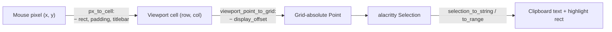

# Testing

kettle is verified by a fast, deterministic test suite plus native CI smoke
runs on Linux and macOS. A Windows CI leg retains compile and regression
coverage for conditional code, but it does not represent a supported package or
installer. Most parser, state, and UI-decision tests need neither a GPU nor a
PTY. The full workspace suite intentionally also opens an offscreen wgpu
device and runs a small number of native PTY/ConPTY lifecycle tests. An
adapter-less host can soft-skip the GPU test and a restricted sandbox can
soft-skip the PTY tests, but that is reduced coverage and must not be reported
as a native GPU or PTY pass.

## Run it

```sh
cargo fmt --all --check
just gauntlet
```

### Strict and full gates

Before a release or supply-chain change, also run:

```sh
just gauntlet-strict
```

The strict gate includes the normal gauntlet, direct patched-crate validation,
RustSec advisory scans of the product and vendor lock graphs, the scoped
`ttf-parser` and `lru` exception guards, dependency-policy checks,
unused-dependency checks, and the tracked-file ledger. Both guards fail when
their reviewed inverse path changes; the `lru` guard also pins the upstream
crates.io sources and versions whose API reachability was reviewed for
RUSTSEC-2026-0253. It reads
locked Cargo metadata without a platform filter, so target-specific Windows
and macOS consumers remain visible when the guard runs on Linux CI. Install
`cargo-audit`, `cargo-deny`, and
`cargo-machete` locally first; a missing tool fails the recipe. `cargo-audit`
fetches into ignored `target/advisory-db` rather than trusting a stale global
cache.

`just gauntlet-full` adds every required native check supported by the current
OS. Its platform dependency lists contain real checks rather than successful
stubs. It prints other-OS legs as explicitly not applicable and claims only a
current-OS pass; cross-platform release evidence still requires the native CI
matrix.

### macOS appearance and icon gates

The macOS AppIcon gate runs twice on pull requests. The normal `macos-latest`
leg covers the current host, while `macOS 26 release icon toolchain` runs the
exact release host. `scripts/compile-macos-app-icon.sh` selects the newest
installed Xcode 26.x toolchain before invoking `actool`. The major pin keeps a
future Xcode preview from silently changing release assets. Both CI and the
release workflow use the same helper so a runner/toolchain mismatch cannot
first appear after a tag.

The macOS 26 job retains `macos-release-icon-<sha>-<run>-<attempt>` artifacts for seven days.
Use only matching-commit assets for local bundle checks when Xcode 26 is absent;
this does not count as a local icon-compilation pass.

The macOS material policy has portable tests for opaque, plain-alpha, blurred,
and Reduce Transparency states. A source guard pins the AppKit-only seam: the
effect is initialized from the content frame, constrains all four edges to the
Winit content view, stays below its Metal layer, stops below an opaque native
titlebar, and has no competing geometry setter. Portable policy tests keep the effect out of
borderless windows, where it would cover the Metal view, and out of an otherwise
opaque window, where it would create a titlebar-only seam. Windows tests pin DWM
color byte order and minimum caption-text contrast. Linux tests require both a
Wayland handle and the KWin blur global, cache that registry probe per process,
and prove the 99% fallback is Linux-only; renderer tests prove the fallback
survives the replacing pane-base pass in the live window but does not change
screenshots. Those checks cannot prove native presentation. The release
appearance gate therefore records
a native decorated window with blur on and off, checks resize and full-screen on
the blurred window, repeats the style transition while borderless, and toggles
Reduce Transparency live. It verifies the titlebar seam, rounded corners,
traffic lights, drag region, and first content row by sight.

### Unix suspend/resume compatibility

`just job-control-smoke` builds Kettle and checks shell editing before a client
starts, while it is suspended, after `bg` and `fg`, and after it exits. It covers
Ctrl+Backspace, Alt+Backspace, ordinary Backspace, arrows, Ctrl+C, and Enter.
The offline fixture negotiates Kitty keyboard reporting on both the main and
alternate screen. Linux and macOS CI run it without accounts or network calls.
`--negative-controls` requires the test to reject clients that deliberately
leak keyboard modes on suspension or background resume; CI runs both controls.
The test uses the normal PTY and `send_keys` encoder; it does not inject physical
desktop events. Windows has no Unix job control and retains its normal CI gates.

For the real Codex TUI, explicitly choose the executable:

```sh
python3 scripts/check-job-control-smoke.py --kettle ./target/release/kettle \
  --codex /absolute/path/to/codex --shell zsh --configured-shell --cycles 100
```

Codex 0.155.1 can fail shell editing while suspended, before `fg`; see
[upstream #26564](https://github.com/openai/codex/issues/26564). CI uses the
offline fixture.

This opt-in check uses that client's local configuration and authentication,
starts an idle session, and never submits a model prompt. A trust or login dialog
fails readiness rather than receiving an automatic confirmation. Use a trusted
working directory. Add `--codex-yolo` only to reproduce `codex-yolo`; it explicitly
disables Codex approvals and sandboxing. Add `--background`, `--alternate`, or
`--split` to exercise those paths. Standalone Codex development builds can use
`--codex-no-daemon` when they lack a packaged daemon. `--external-editor` checks a temporary editor's
draft handoff before suspending; `--transcript` suspends from the transcript
overlay. `--columns` and `--rows` control the startup size; `--maximized` opens a
maximized window.
The harness owns its isolated window and cleans up its PTY sessions, including
stopped jobs. It does not operate existing user windows.

Artifacts retain exact binary versions and launch settings even on failure.
Successful runs also save final window geometry and pane grids. Failed tests
retain local screen text for diagnosis; review it before sharing. CI uploads
failure diagnostics only from the offline fixtures. No screenshots or recordings
are published by this test.

### Shell integration and completion

Shell-integration changes also run `just shell-integration-check`. Unlike the
CLI smoke's source-text checks, this executes the shipped snippets: macOS uses
interactive `zsh -f` with `PROMPT_SUBST` off and its system Bash 3.2, while
Linux CI installs Fish and executes its OSC 133 event hooks and OSC 7 cwd report.
A separate Ubuntu 24.04 job asserts Fish 3.7.x before running the same suite, so
the oldest supported completion binding cannot drift with `ubuntu-latest`.
Windows runs the PowerShell prompt-status and PSReadLine binding fixture
under each installed PowerShell host. Other hosts run the interpreters they have
and print explicit skips for native legs that belong to the CI matrix.

The same gate exercises completion metadata. Portable fixtures pin UTF-8-safe
field truncation and custom-binding preservation in all four snippets. The Zsh
fixture also emits the maximum 64-row payload under a time bound, catching a
per-byte subshell regression; Bash also proves a full non-ASCII label is not
shortened by locale-sensitive character counts. A real interactive Fish PTY
proves default and Vi-insert Tab behavior, keymap ownership changes, reverse
cycling, cursor-move invalidation, paging beyond 64 candidates, and that Fish's
pager stays closed.
It also pins the count, per-field, and aggregate retained-state caps and keeps
the selected row in a bounded wide-character wire page. Ordinary and
bounded-prefix singletons are inserted from the captured result without a
second provider query, proving neither path can re-open the stock pager. A real
Fish editor round trip pins the ordinary singleton's trailing space and an
expandable, unquoted `~user` completion. It also proves protocol v4 retains the
original typed token and current-line input prefix across forward and reverse
cycling. The PowerShell fixture pins the same replacement-span retention.
Parser tests keep v1 through v3 compatible, require both v4 presentation fields,
and degrade unsafe or oversized hint values without hiding safe candidates.
Terminal and renderer tests pin one stable command-column anchor across
candidate insertion, UI-only dismissal, Ctrl-L redraw, focus loss, Unicode
display-width math, and right-edge clamping. A same-prefix reply after the card
was hidden must retain the cursor captured with that prefix; a changed prefix
must replace both halves, and real editor input must clear them. The
deterministic fixture keeps native no-space results open, treats leading-dash
candidates as data, and counts exactly one provider call. Request-numbered
parser/state tests cover prompt sessions, duplicate same-row Fish prompt marks,
the reader-thread prompt-ring bridge, screen-clearing commands that reuse a
prompt row, a transient startup resize that preserves a single-row active
prompt, clear, re-arm, delayed old replies, rejected queue admission, Kitty
key releases, rejection of Alt/Ctrl/Super Tab, custom Tab directions, counter
exhaustion, pump-buffered prompt boundaries, and multi-key remote batches; only
an admitted current Tab may restore the card. UI guards keep DEC focus reports
in the chronological input lane without consuming that admission. A real Fish
Ctrl-L round trip
proves a moved prompt keeps publishing on its current session, while terminal
state tests prove that session remains accepted and a fresh sync may replace
it. PowerShell pins both stock-direction bindings, its quoted-directory edit,
multi-page absolute positions, the 64 KiB wire cap, and the same source-memory
limits. Its prefix and replacement token are rejected before grapheme indexing
when an editor line exceeds their presentation bounds. Native Windows runs
that fixture with PSReadLine. Parser and terminal tests bound malformed control strings,
compare every split of private metadata through the screen and raw-output
filters, sweep private-message starts around the exact recovery boundary, keep
absolute positions when unsafe rows are skipped, and reject stale replies after
unrelated input or focus loss.

Modified-Enter auto detection has an additional native Unix PTY regression. It
starts stock `zsh -f` on macOS or unconfigured Bash on Linux, proves the shell
editor's prompt is noncanonical while the shell's own process group still owns
the PTY, then starts a raw child and proves job control transfers the foreground
group through the same `foreground_process_group` API the UI samples. Portable
tests separately pin the recognized-composer allowlist, reject stale Unix pid
snapshots, prove the Windows breadth-first scan chooses a composer before its
forked helpers, and cover the policy matrix. A live `kettle ctl send_keys` check
remains useful because it exercises the GUI/control encoding path against the
actual pane.

### Vendored parser crates

The patched crates under `vendor/` are explicitly excluded from the product
workspace, so the root gates exercise their public Kettle integration but do
not run package-owned unit targets. A separate validation workspace and
committed `vendor/Cargo.lock` pin the direct-test dependency graph for `vte`,
`alacritty_terminal`, and `portable-pty`.

`cosmic-text` is the exception: it stays outside that workspace, because its
optional editor features and `fontdb`'s `ttf-parser` would put unmaintained
crates into a graph whose audit admits no exceptions. The product build compiles
it, the product audit covers it under the scoped `ttf-parser` exception, and
`kettle-render`'s `paragraph_separator_shaping_tests` exercise its patch on every
CI platform. `vendor/README.md` records how its upstream unit tests were run.
`just deny` checks licenses, sources, and banned crates in both lock graphs;
the Audit workflow scans both for RustSec advisories. Run all retained unit
targets, doctests, and warnings-denied clippy targets with:

```sh
just vendor-check
```

The terminal-query replies are tested at both levels. The vendored units pin
each reply byte for byte: XTVERSION, DSR and DECXCPR under origin mode,
DECRQSS for every SGR form (including Neovim's exact undercurl and truecolor
probes), the scroll region and every cursor style, XTGETTCAP for every
capability with hex-only echoes, and DECRQM for modes 47 and 1047. They also
pin that an unknown or oversized request is never echoed, and that a string
cut off before ST is not answered. `kettle-core`'s
`terminal_queries_get_their_replies_through_a_pty` sends XTVERSION, DECXCPR,
DECRQSS and XTGETTCAP from a real PTY child through the kettle-vt extractor,
so `cargo test --workspace` catches a reply lost on the product path.

CI runs `vte` plus its `alacritty_terminal` consumer on Linux. It runs
`portable-pty` on Linux, macOS, and Windows because each compiles its own
descriptor or pipe code: Linux uses `close_range`, macOS lists open
descriptors through `proc_pidinfo`, and only the Windows runner executes the
`PIPE_NOWAIT` ConPTY regression. The `require_cwd` opt-in has a Unix test that
spawns into a missing directory and must fail, and a Windows test of the
directory handed to `CreateProcessW`. A local `just vendor-check` is therefore
evidence only for the platform it ran on.

The vendored trees intentionally preserve their upstream release formatting so
the retained patch remains reviewable against the published source. Do not run
workspace-wide `cargo fmt` against `vendor/Cargo.toml`: unchanged upstream files
are not a rustfmt gate. Keep Kettle-owned edits narrowly styled to their
surroundings; direct tests, doctests, warnings-denied clippy, audit, and deny are
the validation contract for the vendor workspace.

### Platform coverage

For full Linux coverage, install the source-build dependencies from
[INSTALL.md](INSTALL.md#from-source) plus `libvulkan1` and
`mesa-vulkan-drivers`. No graphical session is needed for
`gpu_pipelines_compile_and_render_offscreen`, but a working Vulkan loader and
hardware or software adapter are. Windows uses DX12/WARP or another available
wgpu backend; macOS uses Metal. The native PTY checks also need permission to
create `/dev/ptmx` children on Unix or a ConPTY on Windows.

Native ARM guest checks complement, but do not replace, the hosted release
matrix. The maintained guest is the migrated Ubuntu 26.04 aarch64 installation
running directly under QEMU with Apple's HVF accelerator. Start it with
`scripts/vm/run-ubuntu-arm.sh`; the launcher pins the CPU, memory, disk, EFI,
network, display, and guest-agent channels while keeping disk and EFI state
private to the owner.

The private qcow2 and mutable EFI variables live outside the checkout under
`~/VMs` and must never be committed. The default mode is headless and forwards
guest SSH to `127.0.0.1:2222`; `scripts/vm/run-ubuntu-arm.sh gui` adds the Cocoa
virtio framebuffer for desktop checks. Use the pinned `kettle-vm` SSH host for
automation. Shut down with `ssh kettle-vm 'sudo systemctl poweroff'`, wait for
QEMU to exit, and run `qemu-img check ~/VMs/ubuntu-arm.qcow2` only while the
image is offline. An in-guest `sudo fstrim -av` before shutdown returns freed
blocks to the sparse qcow2 because the launcher enables discard.

The 2026-08-23 migration kept the guest OS, user, tools, credentials, and
repository state, and grew the root disk to 256 GiB. A full workspace run then
completed 2,131 tests across 45 binaries with zero failures, and the release
binary linked. The native aarch64 `search-history` live-window smoke passed
once under Xvfb and once in the real GNOME Wayland session. Both runs selected
Vulkan through Mesa llvmpipe and reported `Adapter type: Cpu`. This proves the
software-rendered Vulkan and Wayland paths. It does not prove accelerated
virtio GPU rendering.

The retained Windows CI runner compiles and tests portable and conditional
Windows code, including native ConPTY and PowerShell fixtures. Kettle 4.0 does
not publish or support a Windows package, installer, GPU smoke, or live-window
harness. Historical native Windows and Parallels ARM evidence belongs to the
3.3.0-and-earlier record, not to current release coverage.
The runner does not use `--ignored`. Its required evidence is the PowerShell
script fixtures, workspace tests, CLI smoke, and vendored ConPTY regression.

Read test output for `no GPU adapter ... skipped` and `no PTY ...` messages.
Those messages leave the portable suite green by design; record the missing
coverage instead of treating the exit code alone as platform validation.

### GPU devices in tests

The `kettle-render` tests that stand up a real GPU device hold a process-wide
lock so only one of them runs at a time. Without it, libtest runs them in
parallel. On a host whose only adapter is a software or basic display driver,
creating and tearing down several wgpu devices at once can take the whole test
binary down with `STATUS_ACCESS_VIOLATION`. Cargo reports that against
`kettle-render` with no failed test, because the fault is in the driver rather
than in Rust. A new test that creates an adapter, device, or surface belongs
behind the same guard.

Every renderer-owned device request uses the same limit policy as the live
window. Kettle requests the adapter's full 2D texture dimension so a large
high-DPI surface remains legal, but clamps every other WebGPU default to the
adapter's advertised value. This matters on virtual GLES adapters which expose
graphics and presentation while advertising zero compute workgroups: Kettle
has no compute pipelines, so a default request for 65,535 workgroups must not
reject an otherwise usable device. The pure limit regression is portable. The
QEMU Ubuntu ARM smokes prove Vulkan through llvmpipe on Xvfb and real Wayland;
they do not claim accelerated virtual-GPU rendering.

### Performance evidence

Current performance automation is native to the supported platforms:

```sh
just macos-perf
just macos-standing
just linux-perf
```

The macOS comparator measures the maintained multi-terminal campaign and its
top-half gate. Its timings land on 100 ms polling steps and its memory figure
is resident set size, so published standings and before/after numbers come
from `just macos-standing`: exact launch timing, Activity Monitor memory,
idle CPU and wakeups, and vtebench, or a paired A/B of two Kettle builds with
`--kettle-b`. Keystroke-to-screen latency is opt-in (`--workloads latency`,
after `--latency-check`), since it posts keys and needs its probe's grants. A published rank combines 3 countable sessions on 3 dates with
`--combine`, and a session is countable only when its preflight found the
machine quiet. See [scripts/perf/README.md](../scripts/perf/README.md). The Linux
comparator remains a narrower diagnostic gate and requires the documented peer
terminals and a real X11 or Wayland session.

The standing self-test also checks schema-1 `.dat` reconstruction, schema-2
reads and schema-3 absence rules; typed MiB/rate/signed comparisons; metric
failure isolation; interrupted sessions and first countable dates; finite
inputs; warmup exclusion; legacy zero-containing A/A gates and verdicts;
scientific-notation flood offsets; fixed-set vtebench aggregates with invalid
members; and latency censoring. The date-selection fixture has one invalid
optional round out of five, leaving four paired comparisons. It must reject
the actual `countable: counts and covered` revert. The latency fixture rejects
negative keys and negative, fractional or boolean censor counts, and must fail
with the original latency-key decoder restored. Kettle's launch argv ends with
AppKit's `-ApplePersistenceIgnoreState YES` after the payload, and no peer's
does, so a 4.7.0 baseline cannot stall at AppKit's "reopen windows?" alert.
Adjacent peer fixtures check the current log-ratio and launch-difference
Student-t intervals and require all ranked pairwise comparisons, including
peer pairs that omit Kettle. Analysis, combine and Markdown checks reject
supplemental estimators. Markdown checks require adjacent labels after the
completed tables and no labels without new metrics. The existing Student-t
coverage simulations still run. A change to the harness's analysis must also
keep every existing output file (`summary.md`, `combined.md`, `combined.json`
and `results.json`) byte-identical for schema-1/2 sessions, compared as whole
files rather than prefixes or selected JSON fields.

The portable `NativeEvidence` tests cover retained startup child/native
policies, both delayed-child grid corrections, provisional recorder completeness,
failed/no-op resizes, event loss, wrong identities and overflow. Startup fixtures
pin the S1 format and the S2 font-thread format separately. They check raw stamps,
thread/path attribution, signed slack, per-round GPU/font intervals, missing and
reversed endpoints, duplicate conflicts and diagnostic-only unknown stamps.
A malformed stamp (negative, non-numeric, missing or over 20 digits)
invalidates its phase rather than leaving an earlier stamp in force, and a
malformed path line voids font attribution. Native geometry components must lie
in 1-65,535, the range of `struct winsize`; an isolated fixture checks the
initial-grid refusal alone. First output stays unavailable. Private trace tests
refuse to infer echo joins from unemitted data. CLI fixtures mock every spawn and helper build, exercise the
actual entry point and check private input redaction.

`LegacyOutputBytes` compares all bytes of `results.json`, `summary.md`,
`combined.json` and `combined.md` against fixed baseline outputs for schema 1,
2 and 3, in both standing and A/B layouts. The schema-1 cases include `.dat`
reconstruction. The checks use unittest equality, which remains active under
`python3 -O`. `startup-phases-s1.fixture` is a frozen S1-era capture and
`startup-font-phases.fixture` a frozen font preload capture, while
`startup-phases.fixture` follows the live producer, which `startup_trace.rs`
tests against. Fixtures are inert harness-version inputs.

`CursorLayerEvidence` uses `cursor-layer.fixture`, a full synthetic export of the
cursor layer smoke's `run_contract`, including its raw monotonic stamps,
rusage samples, geometry reads and selected cursor states. The positive case
checks independently known peak, median, real span and counter rates. Refusal
cases cover short span, a missing sample gap, samples outside the handoff/timeout
interval, nonmonotonic sample/stamp times, changed geometry exits or renderer,
aggregate mismatches, every missing stamp and aggregate-only legacy input.
Additional cases cover geometry ordering/counts, hides/handoffs, declared
cadence, counter regression/balance, exit-history counts, rested/reload/key
states, invalid numeric types,
clock mismatch, partial exports, threshold boundaries and CLI overrides.
CLI checks forbid helper builds and process creation and check private-field
redaction. These unittest checks, including whole-file comparisons, remain
active with optimization:

```sh
python3 scripts/perf/macos-standing-self-test.py CursorLayerEvidence NativeEvidence LegacyOutputBytes CursorLatency.test_existing_output_files_match_bytes_under_optimization
python3 -O scripts/perf/macos-standing-self-test.py CursorLayerEvidence NativeEvidence LegacyOutputBytes CursorLatency.test_existing_output_files_match_bytes_under_optimization
TZ=Pacific/Kiritimati python3 -O scripts/perf/macos-standing-self-test.py CursorLayerEvidence NativeEvidence LegacyOutputBytes CursorLatency.test_existing_output_files_match_bytes_under_optimization
```

Per-file snapshots use the same directory layout, with `snapshot.gitignore`
beside the self-test. The test runner places temporary files and compiler
caches inside that snapshot. Targeted production reverts must make each
refusal regression fail while the unchanged production candidate passes.

These tests launch no GUI application. Synthetic raw samples prove parser
behavior, not a real layer's footprint or observer cost. Native PTY recording,
an actual delayed-child startup barrier, live layer measurement and harmless
geometry polling still require separate native acceptance on an authorized
runner. The row-shaping source exports no private echo trace, so that capability
remains unavailable. See the retained diagnostic formats in
[scripts/perf/README.md](../scripts/perf/README.md#retained-startup-and-native-diagnostics).

For per-file review snapshots, put `macos-standing-self-test.py` beside the
patched harness, retain the helper source snapshots under `macos-standing/`,
and place the repository ignore-rule snapshot at `snapshot.gitignore`. Run
`python3 macos-standing-self-test.py` in that directory. That file marks the
snapshot layout, which keeps temporary files and compiler caches inside the
snapshot directory. It skips
the host user-default tests, four tests requiring the real repository or its
packaging plist, and two controlling-terminal/`ps` tests requiring an
unrestricted native runner. A snapshot pass does not certify those checks.
In a checkout, `scripts/perf` has no `snapshot.gitignore`, so every test
runs, and a stray one makes the harness version dirty. No GUI measurements or
A/A are part of this self-test.

PR 3 closure fixtures audit the canonical key registry against the config
parser and cover changed wallpaper bytes at a stable path, intentional B-only
changes, A/A baseline rejection, generated-path normalization, aliases and
last assignment, empty references, quotes, home and cwd resolution, unknown
references, unsafe and unstable reads, include cycles and isolated `init.lua`.
They check source mutation against the bytes actually launched, public/private
privacy, retained private snapshots, peer config bypasses and launch environment,
and row-boundary mutation at the real campaign entry point with mocked apps.
The closure reads managed configs exactly as kettle-config does: only `\n`
ends a line, trimming uses Unicode White_Space, keys lowercase ASCII letters
only, a value is unquoted once, and `background-image` is then trimmed again.
Fixtures pin each difference from Python's own line splitting, stripping and
lowercasing (U+2028, vertical tab, U+0085, a lone `\r`, U+001C, the Kelvin sign
and padding inside quotes) and require the captured bytes to be the file Kettle
reads.
The session directory is claimed once and used by its canonical path, so a
retargeted parent symlink cannot send a launch to an unsealed config.
A mid-row mutation must preserve earlier raw rows, retain the invalid row and
leave the session incomplete and uncountable. The public session loader never
reads the adjacent local manifest.

The registry audit uses the checked-out parser in a real repository. In the
standard snapshot layout it uses `base/crates/kettle-config/src/lib.rs`, obtained
from the pinned base with `git show`. If that supporting snapshot is absent,
only that audit skips. It does not launch Kettle or infer rendered behavior.
All other closure fixtures use temporary files and mocked terminal launches.
Configs without file-valued settings keep their generated bytes, legacy
fingerprints and report outputs byte-identical across schemas 1, 2 and 3.

Printing and blink fixtures drive the collectors with synthetic timelines,
including stale or nonmonotonic focus checks, notification races, missing or
stale frame arrivals, invalid evidence linkage and missing trace files.
Native helpers have GUI-free self-test entries. The printing fixture executes
the production loop with a fake monotonic clock, short sleep returns and 30 ms
write costs; it checks every deadline, byte and completion timestamp. The
observer decision takes synthetic front-to-back window dictionaries and tests
same-process dialogs, covering alerts, transparent or distant windows and
unknown state. The probe self-test exercises the production routing decision
with capture and posting counters, exact-window selection, and complete, idle,
missing and incomplete pixel updates. These entries run before any permission
or application initialization and never post input.

Native scratch tests retain spawned target handles through the observer's last
query, then reap observers before targets. Each fixture retains its spawn
handles and signals only its own children. A native scratch pass proves query,
scheduling and ownership behavior. It does not certify live visibility or
cursor capture.

On an authorized native runner, run the self-test without `snapshot.gitignore`.
The four real-repository checks are live harness identity, two packaging
Info.plist/bundle tests, and Cargo workspace exclusion of the vtebench checkout.
The snapshot also skips the host user-default recovery suite and the two native
controlling-terminal/ps tests. Record these separately from a snapshot pass;
a snapshot pass certifies no repository gate.

The excluded functional pilot uses an explicit app bundle, a known still image
and a known animated image. Compare the rendered background with the intended
asset for an absolute reference, `~/` and a relative reference in the invocation
cwd. Confirm the managed file points to retained bytes, then change the original
source and verify rendering still uses the capture. Check each installed peer
with an adversarial user config and a sentinel Lua/include under its usual root;
the managed launch must ignore it. Do not run these pilots in the developer's
existing terminal windows or count them as standings or A/A evidence. Keep the
pilot artifacts private and settle any resolver mismatch before method freeze.

The optional printing/blink fixtures also pin the unchanged default workload
list, complete printable payload bytes, absolute line schedule, designated
query selection, current versus lifetime memory, timestamped focus races,
wrong windows and covering/unknown states. They reject short, stalled or
incomplete payloads, late/missing endpoints, malformed/native-error records,
changed process identities and nonmonotonic counters. Blink fixtures check
launch anchoring, readiness cutoff, actual counter span, current interval peak,
activity eligibility and binary/config/display/crop/origin evidence matching.
Validation-only capture posts no input. Exception, timeout and cancellation
fixtures verify observer-first cleanup and reaping.

macOS scratch tests compile the new helpers locally, observe only spawned
command-line fixtures, compare all 80 native printing writes, and prove the
launch helper retains an exited target until observer drain. They do not open
GUI apps or grant permissions. Live pilots on installed 4.8.0 and one peer
remain required for focus association, exact sample timing, cursor capture and
probe grant attribution. Observer-on/off equivalence remains an owner pilot;
no standing or A/A acceptance follows from these tests. Run the repository
format, standing self-test, gauntlet and tracked-audit gates in an authorized
checkout before merge, then freeze the combined HC method before calibration.

The portable typing-memory fixtures pin measured-epoch selection, both
boundary-straddling queries, asymmetric current-footprint medians and lifetime
maxima. Calibration, warmup and hold samples cannot change the median.
Censored keys remain at their bound in timing statistics and inside the epoch.
Coverage failures preserve latency and leave only memory unavailable. Tests
check the five-sample, 80% coverage and 250 ms gap rules independently, reject
clock/cadence/bundle mismatches as calibration evidence, and retain scalar MiB
ratios and differences through summary and combined publication input. Floors
have no typing-memory row; opaque remains unranked.

Mocked capture, calibration failure, timeout and cancellation verify observer
reaping before target cleanup and retention of probe, timeline, key log and
launch context. Retained artifacts have relative names and SHA-256 digests.
Native synthetic probe tests run the shared calibration and measured-key loops
with virtual time and frames. They check six calibration posts, 20 warmups,
seeded gaps, the 95% classifier, final censoring and the guarded epoch bounds.
The `--self-test-typing` entry runs before AppKit setup or permission checks;
`--fail-guard` verifies refusal after synthetic focus loss. A native payload
fixture executes the unchanged block main with fake terminal I/O and checks
initialization bytes, all three toggles and log records. These tests require
macOS compilers and never capture a screen or post input. Malformed launch
context fixtures verify that valid timing survives with memory unavailable. Whole-file output
compatibility should compare results, analysis, summary and combined JSON and
Markdown across schemas 1, 2 and 3 when typing memory is absent, with explicit
checks that still run under `python3 -O`.

The excluded observer pilot is described in the standing README.
`--observer-pilot typing|printing|blink --observer-pairs 10` rotates peers and
balances consecutive arm order. Typing off starts no observer; printing off
uses readiness, a 5900..6500 ms burst and one query after done; blink off uses
only boundary queries.
Off arms alone waive timeline coverage. Equivalence is the two one-sided
tests at 5% each: the paired Student-t 90% interval must lie within +/-1 ms
typing, +/-0.5 MiB printing, and both +/-0.01 percentage points CPU and
+/-0.1/s wakeups for blink. Up to 5% of the declared pairs may be invalid, only
for focus, visibility or the probe's cover and foreign-input guards, and every
terminal must pass. `--observer-control` reports pilots; combine and A/A
refuse them.

`ObserverPilot` fixtures check CLI conflicts, rotation/order/seeds, real
entry-point metadata with mocked collectors, retained failures/cancellation
without retries, missing-observer on-arm refusal,
typing observer omission, sparse observer requests, boundary/query focus and
lateness, numeric self-cost allowlists, the 90% interval against its bounds,
the desktop-only 5% allowance (a pair with any other failure never counts as
the desktop's), typing observer focus reasons counted as the desktop's, a
failed probe round that keeps its unclean stop, its target pid, its
`shutdown` provenance and its observer's readiness, trace and coverage up to
the probe's end, a probe failure off the session grid or naming no other
process (pid 0 included) or, other than foreign input, unproven by the
round's own observer (an off arm's cover included), a hidden window or activation counted as the
desktop's only when another process is named while the measured window is
still the target's, one verdict that no proven activation can let mask the
terminal's own dialog, rows without `attribution_contract` never carrying the
desktop, unreadable focus evidence judged ahead of a focus change, an off-arm
printing row whose hidden window cannot mask its missing post-done query, the
native observer's `top_owner`/`cover_owners`/`target_owner` decisions (a
foreign cover beside the terminal's own panel included), activations that
must each be explained, malformed reasons read as invalid evidence, the
launch helper's records of a child that exited apart from one it stopped (the
race its exit-before-stop check closes cannot be forced from outside),
incomplete pairs, failed arms, report dispatch and privacy. The native offset parser fixture
compiles `observer.m` using the existing macOS skip policy and runs only its
pure `--self-test-offsets` entry. Owned native scratch fixtures also verify
the pilot self-cost sidecar and sparse launch requests. The parser checks
strict increasing integers, count
agreement, the 60000 ms limit and the 64-entry limit.
`GhosttyUserConfig` checks absent/empty Application Support files, nonempty
files, symlinks/specials, sealed-state changes, unmeasured peers and fixed
public refusals. Local paths and content sentinels cannot reach results,
summary or equivalence output. The Kettle runtime-spool fixture allows only
empty regular `remote.cmd` and `remote.cmd.lock` files, and empty peer config
directories only for kitty, WezTerm and Alacritty. Two native tests run the
cursor payload on a real controlling terminal from `pty.fork()`: it waits,
enables and parks the cursor, and it refuses a standard input that is not its
terminal. The socket handshake fixture stubs the terminal calls instead.

For live acceptance, reserve an owner measurement window; it uses balanced on/off pairs per terminal, sized for
90% power, with the same verified artifact, sealed config and seeds. Both arms
are diagnostic. The entire 90% paired launch-mean difference interval must fit
within +/-1 ms.
Retain observer/target counters, query durations and every failed attempt. A
zero-containing interval alone does not pass equivalence. This pilot, native
focus/capture acceptance and the ordinary shared A/A remain separate from the
GUI-free suite. Repository-wide gates still run in an authorized checkout.

See [the standing analysis schema](perf-standing-schema.md) for the current
statistical contract, units, eligibility fields and preserved legacy reads.

The portable `ProbeIntegrity` fixtures use mocked compiler, signing and launch
commands with real scratch files. They check source-only bogus caches,
executable edits, validly signed substitutions with the same identifier,
plist/entitlement/resource/extra-file changes, malformed and partial receipts,
interrupted builds and publication, reuse without signing, artifact identity,
compiler/SDK contract drift, receipt permissions, symlinks/FIFOs (including a
plist swapped for a FIFO after the snapshot, which must refuse rather than
block), hashing races, replacement during use, lock contention and
cancellation cleanup. Every probe
entry point must refuse an invalid cache before the launch mock is called.
The success path verifies before and after invocation and passes the private
lease; timeout/cancellation reaps only the child returned by its own spawn,
and a second cancellation during that cleanup still reaps it.

Receipt version 2 has `version`, `contract`, `artifact` and `local` objects.
`contract` carries source/plist SHA-256, normalized command, compiler path and
version, SDK path/version and the private signing choice. `artifact` carries
executable and full bundle SHA-256, exact file hash/mode maps and verified
signature metadata/requirements. `local` retains build source and app paths.
The external receipt is mode 0600 and never becomes public report input.
Public artifact objects contain only hashes, identifier, CDHash and signing
mode. Receipt files are bounded regular files; bundle links and special files
are rejected. A missing receipt after interrupted publication requires an
explicit rebuild, not promotion of the partially published app.

The native macOS scratch test needs `swiftc`, `xcrun` and `codesign`. It builds
a fresh probe with explicit preparation, verifies the seal and receipt, runs
only its pure synthetic self-test, reuses it without rebuilding, substitutes
a different validly ad-hoc-signed bundle with the same identifier and confirms
refusal, then rebuilds explicitly and tampers with executable bytes to confirm
that preparation and the launch path both refuse it before spawning `open`. The pure Swift self-test also checks locked, unlocked and
removed invocation leases. It opens no GUI app, posts no keys, calls no TCC
API and never uses the real probe cache. The test does not certify owner
grants, a native latency pilot, method calibration or a freeze.

The PowerShell performance campaign and its self-tests retired with the final
Windows-supported 3.3.0 line. The measurements and methodology remain in
[PERFORMANCE.md](PERFORMANCE.md) as historical evidence. To reproduce that
historical campaign, use the scripts from the `v3.3.0` tag. Deleted PowerShell
commands are not part of the 4.0 test or release gate.

## What's covered (automated)

**2000+ tests across the workspace.** Run `cargo test --workspace` for today's
number; it was 2,131 on native Ubuntu ARM on 2026-08-23. The per-section counts
below are
deliberately range-stable rather than exact, because the workspace grows by one
to three tests per feature landed and an exact figure is wrong again within a
release. [CHANGELOG.md](../CHANGELOG.md) records what was added when.

The `user_facing_docs_have_no_internal_cycle_refs` drift guard scans
user-facing docs for hardcoded "N workspace tests" claims that go stale. This
file is exempt, being contributor-facing, but follows the same discipline.

### kettle-vt (80+ tests)

Plain-text passthrough is byte-exact;
iTerm2 / Sixel / kitty (incl. zlib-less RGBA + chunked reassembly)
decode to the right pixels; OSC 7 / OSC 133 are consumed and
surrounding text still passes; OSC 1 → OSC 2 rewrite so
vim/tmux/ranger short-titles set the tab title; a sequence delivered
one byte at a time still yields exactly one image; an ~8 MiB
interleaved stream passes through intact in well under 5 s
(linear-time / bounded-memory guard). Limit and limit-plus-one tests cover
sequence/transmission, decoded-image, animation, placement, and CPU/GPU RAII
accounting without allocating host-scale adversarial buffers. Oversized OSC
and DCS tests also cover real-terminator recovery, bounded recovery when no
terminator arrives, and an `ESC` split exactly across the recovery boundary.
Kitty deletion fixtures cover visible, image/placement, cursor, cell,
cell-plus-z, id-range, column, row, z-index, and frame selectors; lowercase
retain-data versus uppercase free-data; independent named virtual
placements; interrupted image/frame uploads; and delete-before-replace
ordering within one extractor feed. Placement fixtures preserve
`x/y/w/h`, `c/r`, `X/Y`, and `C` across transmit, put, and relative commands.
Screen-lifecycle fixtures prove that primary and alternate Kitty stores can
reuse one image id without collision; mode 47 preserves the alternate store
across both boundaries; mode 1047 preserves it on entry and clears it on
exit; mode 1049 clears it on entry and preserves it on exit. ED 2 is
active-buffer-only and RIS clears both stores. Saturation fixtures pin that a
transmission the full image store refuses still draws but advertises no image
id (and that its `U=1` virtual form is refused outright), and compositing
fixtures pin straight-alpha source-over against a transparent and a partly
transparent destination, not only an opaque one, plus the zero-alpha
short-circuit the blend's divisor depends on.

### kettle-core image lifecycle

The terminal engine's authoritative journal
preserves parser execution order for RIS, ED 2, DECSET/DECRST 47/1047/1049,
and DECSTBM scrolls. Direct vendored-crate tests pin its 256-event bound,
compatible-scroll coalescing with the complete monotonic screen delta,
sticky overflow/current-screen snapshot, recovery after drain, and exact
47/1047/1049 text-buffer behavior. Core registry tests pin mode 47
preservation, 1047 exit clearing, 1049 entry clearing plus exit preservation,
primary-store restoration, ED 2 active-only clearing, RIS clearing of both
stores, and fail-safe two-buffer clearing/resynchronization after overflow or
an inconsistent sequence. A full-budget Kitty chain regression crosses the
terminal graphics interface and deletes all 256 relative placements from one
root. `cargo bench -p kettle-core --bench relative_delete` measures that core
registry path separately from kettle-vt's decoder benchmark. Direct VTE tests
pin unforgeable marker ordering at exact byte offsets, nested synchronized-update
boundaries, and the 256-marker cap. Extractor tests prove Sixel, Kitty, and
iTerm2 controls retain their
exact terminators while deferred and that a deferred Kitty transmit does not
mutate decoder state before replay. Core DEC 2026 regressions interleave
images with 1049 enter/leave in both orders, prove image cursor movement
precedes later buffered text, keep text/images and the output generation/wake
invisible before close, fail closed on deferred-queue overflow, and prove the
shared deadline/EOF force-flush path replays buffered graphics before its
single paint publication.
Partial-scroll regressions prove that wholly contained placements move, crop
at the top/bottom margin, compose repeated normalized source ranges, retain
raw Kitty DPI intent after permanent cropping, leave margin-crossing images
fixed, retain history document ids, and reanchor rows fixed outside
the region. Natural-size and one-axis-auto monitor-change regressions verify
that recomputation preserves the composed crop, document anchor, and
post-scroll fractional y offset while updating horizontal geometry and the
cropped occupied-row count. A greater-than-page-height coalescing case guards
the complete screen-top delta. Column reflow clears regular/relative anchors while
retaining virtual prototypes in both active and parked state.

### kettle-config (190+ tests)

TokyoNight Night is the verified shipped
default theme (the self-contained `Theme::default()` fallback palette is
Catppuccin Mocha); `key = value` overrides, repeats, `palette`
(0..=15 + out-of-range diagnostic), `infinite` scrollback,
`ssh-host`; the bundled theme set has >400 entries incl. "TokyoNight
Night"; default keybinds and trigger parsing; the
`from_name` ↔ `action_names` round-trip drift guard; the
`defaults_has_no_shadow_collisions` audit (no
HashMap-shadowed bindings); the palette-completeness drift
guard (including `OpenContextMenu` / `UndoCloseTab` /
`DuplicateTab` / `DuplicatePane`); theme look order (the dark and light orders
split the bundle, stepping never crosses appearance and reverses cleanly, and
neighbours are at least twice as similar as in name order); the
`open_theme_picker` action and its palette entry; palette ranking in
English and Spanish, English names still matching a Spanish palette, stable
empty-query order and distinct labels in each language; the
example-config drift guard; the README-keybind regression guard;
persistence preserves encoding, newline convention, comments, permissions,
first-write backups, and symlinked dotfile targets while refusing
non-regular/oversized files, newly malformed edits, and external changes
observed by the final pre-stage comparison;
implicit config provenance tests reject group-writable requested and symlink
target directories, pin trusted ownership and a single name for the requested
link itself, and retain a legitimate user-owned dotfile link while the
explicit-path mode loads the same bounded regular files; the corresponding
Lua tests prove automatic `init.lua` uses the trusted path, explicit
`--lua-script` keeps its escape hatch, and a dotfile-manager symlink loads only
through a trusted link and resolved target;
CLI `--check-config` exercises the same bounded reader against a resolved
default-path FIFO and oversized file, and verifies UTF-16LE/BE BOM decoding;
session load/save atomic + corruption-backup contracts;
empty-value resets for every string-config key;
`clamp_font_size` bounds.

### kettle-media

`tests/protocol.rs` pins the protocol in [MEDIA-PROTOCOL.md](MEDIA-PROTOCOL.md):
golden bytes for every frame kind; round trips of every job, source, theme,
target and result; an external request can never decode as a GUI user pull;
handshake mismatch and reverse skew stay distinct; path guards; checked RGBA
and crop products; an RGBA mismatch, an oversize frame header, hostile counts
and unknown nested enums are refused before any payload allocation; fence
indices and every metadata bound; input caps, fonts and video options; the
content digest changes with the content and each identity field (its framing
is pinned against a value computed independently); build ID bounds and wire
direction; the largest reply and its allocation budget; and streaming at exact
boundaries and through interrupted reads. `tests/worker.rs` drives a
feature-gated stub worker (`media-test-worker`, a fixture, never shipped)
through exact replies and reaping, handshake mismatch, an oversize frame,
trailing payload bytes, a fence index out of range and truncation. The
workspace commands do not build the stub, so `just media-protocol-test` (also
in `just gauntlet` and ci.yml) runs it with `--features test-worker`.

The availability client's unit tests (`src/client.rs`) run it against a
scripted platform: a missing worker is typed and never verified; an
unsupported platform is never inspected; a worker that passes every check
still reads `incomplete`; verification is cached by file identity and repeated
for a replaced file; a file replaced during verification is refused; a failed
verification is not cached; and asking never waits on a held check and never
starts a second one. `BuildId::from_embedded` refuses empty, non-hex and
formatted (`<version> (<hash>)`) identities.

### kettle-media-worker

Unit tests (`src/early_unix.rs`) run in a child of the test binary, so
changing limits and descriptors disturbs nothing else: the early sweep closes
inherited pipe ends at 3, 17 and 200 and keeps stdio, sets the core limit to
0 and, on Linux, clears the dumpable flag; the Linux fallback sweep closes
below the hard descriptor limit, and an unlimited or over-2^20 limit refuses
it; and the resource limits land at their values while an inherited hard
limit below one stays (never raised). `worker_early_setup_precedes_all_reads`
reads `main`'s production source: the sweep is its first statement, then the
panic hook, the limits, the watchdog, the one stdout writer and `serve`, and
no source prints, reads arguments, the environment or files, or touches
stderr outside the fixed panic line.

`tests/process_boundary.rs` drives the built binary: Ready carries this
build's identity and a job is answered `WorkerUnavailable`, with nothing else
on stdout or stderr; a Hello from another source hash or version, and a
header of another protocol version, are `RestartRequired` with exit 9;
garbage, a job before Hello and a second Hello are `BadParams` with exit 2; a
parent that closes stdin before Hello or after Ready ends the worker quietly;
the watchdog exits 4 after five silent seconds before Hello and after Ready;
a slow parent within each phase still gets its answer, so Ready starts a new
deadline; and a pipe left open at fd 40 by the parent is closed by the time
Ready arrives. On Linux, `/proc/<pid>/limits` shows the CPU, file-size, core,
address-space and descriptor limits, and the worker's `/proc` entries are
owned by root, so it is not dumpable (checked when not running as root). With
`--features test-faults`, a job that panics leaves exactly
`media worker panic` on stderr and no reply. The workspace commands do not
enable that feature, so `just media-protocol-test` and ci.yml run it.

Red checks: no sweep, a sweep after the hook, a sweep that closes nothing,
core dumps left on, a non-dumpable flag left set, no CPU or address-space
limit, limits that raise, a cut-short descriptor list, a fallback sweep that
closes nothing, an unlimited ceiling accepted, a watchdog that never fires,
phases sharing one deadline, a panic line with the payload, an uncompared
build, frame skew read as garbage, and a second frame accepted each fail a
test above.

### kettle-i18n

The build script validates the catalogue, and `tests/build_gates.rs` runs it
against broken inputs: a key missing from or extra in one language, duplicate
TOML keys, a wrong entry shape, a missing plural branch, placeholder sets that
differ between languages, invalid placeholder syntax and unescaped literals.
`compile_fail` doctests prove an unknown key and a missing, extra or wrongly
typed argument do not compile. `tests/catalogue.rs` checks that every message
has clean text in both languages, that Spanish is never left as English except
for listed cognates, and that arguments pass through verbatim. Unit tests prove
a missing Spanish entry falls back to English for every message and that the
pseudo-locale lengthens text by 35–40% while keeping arguments intact; a release
build has no pseudo state at all. Run it in debug, `--release` and
`--features dev-pseudo`.

Each surface on the catalogue tests its English text against the old strings
and its Spanish text: Settings, the palette and pickers, the context menu, the
new-tab dropdown, the About panel, the remote reconnect row, the confirmations
the title editors, the search bar, the completion card, the paste receipts,
the screen-reader names and the notifications;
a rejected input's notification follows the UI's language while its log line
stays English, and config lines, paths and line breaks pass through
notifications unchanged. Counted messages are
tested at 0, 1, 2, 1000, one million and `u64::MAX`; only 1 reads as singular.
Every line of a paste receipt shows whole at the standard size in English and
Spanish, and an expanded remote card is admitted only when its translated
warning fits (`remote_warning_columns`, 18 columns in English).

Pseudo-locale layout checks run the same layouts against text about 38%
longer, in debug test builds only: the Settings rows, category tabs and key
hints fit the 144 columns of a default window on a 1366 px laptop; a 2400 px
search bar shows every label whole, and from 300 to 2400 px its controls
never overlap or leave the bar; every compact receipt title shows whole, the
card widening for it; a widened compact card stays inside the expanded card
it shares a lane with and gives its title every column it was sized for, with
chrome and terminal cells of different widths; and an admitted expanded remote
card shows its warning whole at every pane width from 140 to 600 px with 6 and
8 px cells, which English and Spanish must exercise (the pseudo-locale's
warning never fits the expanded detail box, so it keeps the compact card);
Dock titles carry no ellipsis. Informational receipt lines may be cut with an
ellipsis in a longer language; the remote warning may not where the card has
room. The `ui_text_sinks_never_take_literal_text` drift guard scans the
production source of kettle-ui and kettle-render for prose literals given to a
screen-reader label or description, a window title, a desktop notification, a
menu or picker row's label or hint, a prompt or a painted label: in any
argument, inside `format!` and in raw strings. Prose is two words, a
capitalised word or a non-ASCII letter outside `{…}` placeholders, so GPU
debug labels and config keys pass; key names and the layout picker's shell
command are listed as language-neutral. Its scanner has its own test, and
reintroducing one literal label fails it.
The search bar's control widths equal the old fixed widths in English, and a
Spanish bar shows every word whole with no ellipsis. The renderer's `Overlay`
and `SearchOverlay` implement `Default` only for tests (kettle-render's
`test-defaults` feature, enabled by kettle-ui's dev-dependency): a default
overlay speaks English, so a plain or release build, which CI runs, rejects
production code that builds one from a default. The context
menu's Terminator-row guard pairs each row's catalogue key with its action and
checks the key's English is still Terminator's row name.

### kettle-state

Creates and replaces private state without leaving staging
files on handled outcomes, safely reclaims exact dead-creator crash remnants,
preserves an existing destination's permissions, rejects symlink
destinations, and proves exclusive advisory locks block competing handles
and release on drop. Reaping tests preserve live-PID, noncanonical,
multi-link, and nonregular lookalikes. Scheduler regressions pin in-flight
coalescing, the five-minute completion cooldown, eviction rather than
permanent saturation after 256 tracked destinations, and completion after a
worker guard failure; the live queue is bounded at 32 destinations. Native
Unix tests assert mode `0600`; native Windows
tests require an effective-user owner and exactly one zero-flag full-access
ACE for that user under `SE_DACL_PROTECTED`. Policy tests reject a
group-valued or different owner as provenance even when a DACL looks exact.
Reparse leaf/parent tests use symbolic links when
permitted and an unprivileged directory-junction fallback otherwise. Private
replacement publishes the secured staged file itself, leaving no ACL
or mode hardening step after publication. Native tests also prove
failed-create cleanup deletes the created object through its handle and that
Win32 trailing-dot aliases and NTFS alternate-data-stream leaf names are
rejected without changing the intended file.
User-selected-output tests keep that private-state policy intact while
allowing a new `0600`/current-user-only leaf beneath an existing public
parent. Native Unix displaces the parent after it is opened and proves the
helper fails without writing into the replacement; macOS seeds an inheritable
read ACL and proves atomic publication from an ACL-free staging directory
leaves the new leaf with no extended ACL. Native Windows pins the
parent against rename, verifies the protected DACL, and rejects alternate
streams, trailing-dot aliases, and embedded NULs before path normalization.
The missing-parent and existing-leaf cases fail without creating or changing
anything on every platform. Streaming-publication tests prove the requested
destination stays absent while bytes are written to its owner-only sibling,
publication creates the complete inode with a no-replace hard link or atomic
rename fallback, and no staging name remains. A platform seam forces only the
hard-link syscall to fail, then exercises the real `renameat2`,
`renameatx_np`, or `FILE_RENAME_INFO` path and its racing-destination refusal.
Deterministic nonce injection
proves random staging collisions stop after 32 attempts without touching the
destination. Injected PNG encoder and flush failures prove both
output policies remove their exact unpublished sibling. A racing destination
wins unchanged; primary and cleanup errors are reported together instead of
silently claiming retry is available. An injected post-publication failure
separately proves the result says the destination may exist.
Windows test scratch files live under the current profile rather than the
process temp directory because a machine policy may intentionally grant
sandbox principals delete-child access there; the production policy rejects
such an ancestor instead of weakening its trust requirements.
Trusted-read tests keep verified parent handles through the leaf open, reject
writable/multiply-linked Unix leaves, and on native Windows reject an
otherwise valid config whose protected DACL grants `GENERIC_WRITE` to
Everyone without rewriting that ACL. A re-executed Unix test lowers
`RLIMIT_NOFILE` and holds forty parent guards at once, proving steady guard
descriptor use stays O(1) rather than growing with path depth.
Configuration, session, diagnostics, screenshots, pasted images, recording,
remote-command, and updater callers fail closed when the shared primitive
fails.
Remote-command parser regressions also pin the 1,024-operation exact boundary,
whole-batch rejection at 1,025, coalesced unknown-line diagnostics, and
command ordering below the cap. Versioned `send-text-json` tests round-trip
literal backslash+n, actual LF, CR, NUL, and command-looking text byte for
byte, assert the payload occupies one physical spool line, retain legacy
`send-text` coverage, and treat malformed JSON only as coalesced unknown
lines.

### kettle-ctl transport and server liveness

The split-handle loopback and
same-user kernel credential path run on every native CI OS. A deterministic
failed-identity injection proves clients reject before sending protocol
bytes. Stalled readers prove deadline and cancellation exits from both a
client handle and an accepted server handle with an 8 MiB write. Windows
therefore exercises the server-side arm on a real overlapped named-pipe
handle. Unix additionally asserts the shared open-file
description remains stably nonblocking while a cloned reader retains
blocking semantics. Control-server regressions occupy all eight slots with
idle peers, slow-drip an incomplete frame, and stop reading a subscribed
stream; each waits for reclamation and then completes an independent fresh
request. Activation starts an incomplete client in its own worker and proves
a second launch is activated without waiting for that worker's deadline.
Bounded-JSON, incremental newline scan-offset, lazy inventory-stop, and key
batch/byte tests pin cap-before-work behavior. These regressions must run on a
real macOS runner because AF_UNIX full-buffer behavior cannot be claimed from
Linux alone.

### kettle-update archive boundary

Linux and Windows tests parse one bounded,
digest-verified archive into immutable member buffers, destroy or overwrite
the former archive storage, and prove transaction publication still consumes
only the verified bytes. Hash mismatch, entry count, unpacked bytes, path,
link/special/sparse-file, mode, and exact package-manifest failures remain
fail-closed. Windows separately proves a held archive blocks overwrite and
rename, a forged pending capsule with correct local archive/helper hashes but
no valid Ed25519 signature is rejected, and a correctly authenticated pending
version cannot downgrade the installed version. Timestamp regressions cover
expired/future signed metadata and strict RFC 3339 parsing. Post-update
integration tests require the installed script to match the verified archive
bytes and retain it against replacement through execution. Transaction tests
interrupt backup streaming, backup sync, prepared-entry persistence, and
replacement publication after an earlier destination was installed. They
prove every boundary rolls back, foreign unjournaled evidence still fails
closed, Linux startup and explicit update recover before provenance checking,
rollback preserves a post-update conflicting write and its recovery evidence,
and committed last-known-good bytes remain until the target version reaches
managed startup.

### kettle-core VT conformance (150+ tests)

Drives the *real*
vte + alacritty_terminal path used by the PTY reader and asserts
grid/cursor/SGR/mode state across a broad `vttest`-style sweep —
text + `\r\n` + CUP addressing, erase-line/erase-display, SGR
truecolor + bold + reset + dim/underline (4:3) + strikeout +
double-underline + curly + dashed + dotted (plus the
SGR individual attribute-off codes 22/23/24/27/29), tab stops +
carriage return, alt-screen + bracketed-paste private modes,
DECSTBM scroll region, DEC special-graphics line-drawing charset,
ICH/DCH, IL/DL, DECSC/DECRC save-restore, DECAWM autowrap, DECOM
origin mode, device responses via the real EventProxy PTY
write-back (DSR 6n cursor-position, primary + secondary device
attributes, DECRQM mode report, DECALN screen alignment, REP, G1
via SO/SI, RIS, EL/ED/ECH, CHA/HPA/VPA, DECSC-restores-SGR, SU/SD,
DECSCUSR cursor shape, NEL/IND/RI, DECID, cursor-blink mode ?12,
CHT/CBT tab nav, DECSET 1049 alt-screen, DECSET 2026 sync output),
OSC 4 palette query + 104 reset, OSC 10/11/12 default
fg/bg/cursor set + 110/111/112 reset siblings, OSC 8
hyperlink cell-carry, OSC 52 clipboard copy + paste policies,
DA1 clipboard-extension advertisement toggled by the live write policy,
wide CJK (2 cells + spacer) + wide-char wrap, combining-mark
zero-width. Native vi-mode regressions drive Alacritty's own cursor and
selection through scrollback rotation and reflow, proving the cursor remains
bounded and evicted selections are invalidated. OSC 133 tests pin monotonic
`history_origin` row ids, prompt navigation offsets, pruning after eviction
or reset, normal-screen retention across the alternate screen, and prompt
capture from the writing cursor rather than the vi cursor. Image regressions
use the same monotonic row domain, exercise half-open pruning at the retained
history boundary (including `u64` overflow), and prove placeholder projection
does not apply `display_offset` twice.

### kettle-render (110+ unit tests + visual integration tests)

Truncate respects display columns (not chars), the
`clamp_font_size` floor/ceiling/NaN/∞ contract, the
`cap_axis_cells` GPU-texture safety guard, color
resolve / dim / minimum-contrast WCAG math, the offscreen GPU
pipeline self-test (real wgpu pipelines compile + render through
Vulkan/Metal/DX12/GLES), pure native-backend-order/fallback tests, uniform
device-limit clamping for virtual graphics adapters with no compute queues,
and isolated
native Windows checks: the Auto test selects DX12 without first constructing
an all-backend/Vulkan instance, the DX12-only stale-pin test preserves the
platform-preferred adapter, and the explicit-Vulkan test works without a
physical GPU pin. Screenshots use the loaded configuration; the CI
self-test uses the same resolver with `Config::default()` to stay independent
of developer state. Shared-image UV validation composes source rectangles
with permanent vertical crops; independent inline/wallpaper instance limits
and same-texture draw batching are also covered.
Pane-clipping regressions crop destination geometry and source UVs by the
same fractions, reject fully outside/degenerate/non-finite instances, admit
no placement for a zero-line viewport, and prove the pane-interior/grid
intersection excludes padding, top/bottom titlebars, borders, and pane edges.
Titlebar-origin parity also verifies that bottom titles move row zero back to
ordinary pane padding while selection/link/mouse hit testing and the native
IME anchor consume that same renderer-owned origin.
The wallpaper no-clip test and zero-sized skipped slots pin the independent
background contract and indexed batching.
Startup fonts prepared before the scale is known measure what a direct load
measures at 1x and 2x, for the default family and one the system lacks,
whichever families were warmed first; warming a family a second time does
nothing, and a remeasure at a new scale or size equals a fresh load there.
Source guards prove only `PreparedFonts::enumerate` builds a font system, and a
renderer given fonts measured for another scale remeasures them instead of
loading them again.
The grid-regression guard renders
zsh-style `➜  ~`, POSIX, lambda/starship-style, git-status, and
PowerShell-style prompt lines through the cell-locked glyph pipeline,
toggles only the block cursor between two offscreen frames, and
asserts every non-cursor prompt pixel remains unchanged. The
`tests/menu_visual.rs`
integration test renders both `DebugScene::Default` and
`DebugScene::ContextMenu` PNGs via `capture_png_with`, then
asserts ≥ 1000 pixels differ between the two AND ≥ 200 fg-leaning
pixels appear in the menu area. It catches the blank-menu render-pass-order
regression class that bare logic
tests can't see. `tests/bell_visual.rs` renders `DebugScene::Default` and
`DebugScene::BellFlash` for the default dark theme and a bundled light theme,
measures the mean CIE L\* of a background patch in each, and asserts the
flash moves it by exactly the configured `bell-flash-intensity` step (+3 L\*
on dark, −3 L\* on light, within 8-bit rounding) through the real linear-light
quad pipeline; `color::tests` pins `perceptual_wash_alpha` itself (endpoints,
monotonicity, the order-of-magnitude alpha gap between dark and light
themes, and the same-luminance fallback), and `kettle-ui` pins the ease-out
ramp, the per-pane stamping, and the expiry/erase pacing. The
`just bell-flash-smoke` live check rings BEL in one pane of a split and
proves only that pane's body lightens while the sibling pane and tab bar
stay byte-identical, then fades back to the baseline. Live-screenshot unit coverage verifies whole-frame
preservation, exact row/column cropping, out-of-surface rejection, and
truncated-source rejection. Separate file-policy regressions prove an
explicit output succeeds beneath a public existing parent while the default
private-state policy rejects the same tree. The native live smoke exercises
the asynchronous readback path.
A headless renderer holds exactly two distinct quad pipelines, one replacing
and one blending, and one image pipeline; a source guard keeps `with_gpu`
building its layers only from `SharedPipelines`, and replacing and blending
layers draw the same pixels through shared and standalone pipelines. A
latency A/B (`--kettle-b --workloads latency --rounds 5 --latency-keys 100`,
difference CI upper bound at most +1 ms) is optional: 4.9.0 merged this change
on tests and reviews, without its measurement gates, by the owner's decision.

### kettle-ui (290+ tests)

Split-tree layout tiles with no
gaps/overlap, `remove_leaf` collapses to the sibling, nested
splits keep every leaf; `Node::leaf_ids` DFS-order +
`nth_leaf`/`leaf_index_of` symmetry; `close_tab_at` and
`close_window` tab-reaping with active-index
bookkeeping; `reap_tabs` keeps focus on the same tab
after a pane death; `close_focused_promotes_sibling_in_two_pane_split`
(`Ctrl+Shift+W` in a split closes the focused pane, not the whole tab);
`reap_reports_whether_it_removed_a_pane` plus the
`every_reap_site_schedules_the_survivor_resize` source guard pin that a pane
dying on its own resizes whatever inherits its rectangle, and that an idle
reap does not, so the flag cannot re-drive `resize_all` every frame;
`next_context_menu_highlight_skips_separators_and_disabled`
+ `clamp_context_menu_anchor_keeps_panel_on_screen`;
`classify_tab_activity_picks_the_right_indicator`
+ `classify_tab_activity_transitions_to_silent_after_threshold`;
`closed_tab_ring_bounded_and_lifo`;
`tab_drag_target_index_clamps_to_strip`;
`hovered_close_button_finds_only_the_close_rect_hits`
+ `tab_close_hover_icon_overrides_chrome_default`;
`split_new_tab_button_places_arrow_left_of_plus` also pins independent
dropdown/`+` hover hit targets;
`new_tab_glyphs_are_unpadded_and_centered_in_their_own_hit_rects` prevents
artificial text padding from shifting either symbol, while
`pane_window_corner_tests` proves only panes touching a rounded surface bottom
receive left/right corner masks.
selection-autoscroll inner edge and overshoot ladder; cwd-basename tab-title fallback;
the SSH and `-e PROG` initial-pane-title heuristics;
session JSON round-trips, durable private save,
symlink refusal, permission tightening, and corruption/oversize backup
contracts; xterm modifier encoding + paste payload bracketing +
injection-guard.
Session restore preflight accepts the exact 16-window/256-pane boundary,
rejects either limit plus one before fan-out, clamps saved rectangles to the
live monitor set, accepts 16 1080p surfaces, and rejects 16 4K surfaces over
the 64-Mi-pixel aggregate budget. Startup sizing is pinned in logical
pixels: `startup_geometry_cells_convert_to_inner_size` covers explicit and
half-specified `window-width`/`window-height` (the missing axis comes from the
160×45 default grid), `default_startup_size_targets_the_agent_grid_and_fits_the_monitor`
pins the fresh-window rule on 1080p, 1366×768, ultrawide, a tiny monitor (no
floor), a 2× HiDPI monitor (same grid as 1×), and that an explicit size is
never monitor-fitted, and a source guard proves both window constructors use
the shared rule as a `LogicalSize` and that the restore planner's fallback
surface is the same rule in physical pixels. The startup phase stamps keep the first mark,
leave unmarked phases out, print in time order, and match the fixture the
macOS standing harness parses (`startup-phases.fixture`); a source guard
proves every phase is marked, only the reveal and the spawn at more than one
site, and in startup order, the font phases in `font_preload.rs`. The same
guard proves the font thread warms the compiled-in family before it waits for
the config, and that measurement finishes before `fonts_joined`, so the stamped
wait includes the fallback's cold matches and face loading. The font preload
measures what a direct load measures, whether the family arrived
early or only when the first window joined it, and without its thread the first
window loads the fonts itself; a preload dropped before its first window ends
its thread instead of waiting for a family, and on macOS the thread runs at the
user-initiated QoS class. A source guard proves `run_with` starts the preload
right after the trace guard, before the event loop is built and before any
config read, sends the family after the command-line overrides, and that
the first window joins it and keeps the fonts for the renderer before its
pane spawns. On macOS `load_window_icon` returns `None`
without decoding (`macos_skips_the_window_icon_decode`). The existing palette
guard retains both icon assets and the Windows/X11 call sites.
Input-queue regressions fill both the
64-message channel and user byte reservation, verify reservation release,
enforce reply-lane failure on overflow, and pin the precedence of
`failed > oversize > backpressured > read_only > queued`. RPC mapping tests
require `read_only`, `busy`, `bad_params`, and `internal` to remain distinct;
local-paste coverage requires 4 MiB to pass and one byte more to be rejected
with visible feedback.
S3 startup tests cover the command/directory override and every combination
of session, layout and tab-handoff restore intent, window state and configured
position. Display arithmetic and the shared monitor-fit boundary are checked
at 1x, 2x and 3x, including odd point sizes. A real PTY child must exit within
two seconds of `Mux::kill_children`; environments unable to open a PTY print
an explicit skip, which is not native acceptance. Source guards keep the
pre-launch spawn between App construction and `run_app`, preserve the override
after its arguments are consumed, reuse the sizing/fonts, and hang up children
on window/renderer failure. The #379 guard now requires three callers of the
shared startup surface rule. Its fallback spawn/window/GPU order and #388's
ApplePersistence registration order remain guarded.

The optional native PTY recorder tests preserve an initial 99x30 observation
across a correction to 100x30, read kernel geometry before correction, and
keep errors, no-ops, overflow and incomplete intervals explicit. Source guards
cover creation, both resize branches, pane linkage and early teardown.
The production-capture regression opens a real PTY with deterministic opt-in,
records a correction and finishes the trace. PTY creation failure fails that
test. Separate zero-start and inverted-initial fixtures pin the completeness
conjuncts. The macOS display test drives a missing screen match without AppKit.
The provisional native_pty_v1 wire contract and bounded private collector are
documented in `scripts/perf/README.md`.
On a single-display Mac, `default-window-size` compiles a private SHELL
observer and runs it through LiveKettle's owned tracker. Its explicit-size leg
enables startup and native logs, uses a scratch XDG_CONFIG_HOME, and checks
the collector's process/pane/session join. The default leg keeps the monitor-fit
and 1296-pixel guards. The explicit leg requires settled and child 100x30, `path=pre_launch`,
`monitor_match=true`, and zero SIGWINCH for two seconds. Native evidence must
also start at 100x30, cover that child interval and contain no changing resize.
A delayed-child control deliberately creates 99x30 then corrects to 100x30
before the child installs its trap; the strict native policy must fail even
when the child reports 100x30 and zero signals. Use 119x36 then 120x36 for the
standing-size control. Missing, failed, dropped or mismatched evidence fails
closed. Geometry diagnostics require a separate observer-equivalence check
before use in measurements.

Run the repository gates, the macOS hidden job-control CI smoke with
`path=pre_launch`, `monitor_match=true` and ordered phases for each successful
launch through `--expect-startup-path pre_launch`. Negative controls are exempt.
CI runs these at 100 columns so the grid fits the 1024x768 runner display and
the early path is exercised. It also passes `--allow-fit-decline`: a runner
display too small for the grid
may decline the early spawn, but only with Kettle's `startup pre_launch
declined=fit` line giving the surface and monitor sizes, after the display
read. Any other decline, or none, fails. Kettle prints a declined line for
every reason (`ineligible`, `display`, `window`, `fit`), so a fallback is
never silent. The live default-window-size smoke stays strict.
Run the live default-window-size, split-exit-resize,
dock-menu, window-close-isolation and tab-title smokes. Record command exit,
directory override, multi-window restore, named-layout preservation, malformed
config fallback, hidden launch and Cmd+N checks with an isolated
`XDG_CONFIG_HOME`. Mixed-scale displays are an explicit skip if unavailable.
Portable code also requires Docker Linux build/tests and an Xvfb launch with
`path=resumed_early`. S3's paired 30-launch gate compares against S2: shell
improvement at least 20 ms or B/A <= 0.92, with window time not worse. Stop on
any wrong initial grid, single-display SIGWINCH or monitor disagreement.

Lua tests preserve exact mixed-command FIFO order, separate large sends,
enforce the 1 MiB call/8 MiB aggregate/1,024-entry limits, latch a retry's
target pane, and retain a backpressured head until its deadline. Registry
tests allowlist all nine emitted event names, reject unknown names without
creating registry state, accept exactly 256 callbacks/menu items/URL
handlers and reject the next, and exercise the 1-KiB menu-label,
256-byte URL-name, and 4-KiB URL-pattern boundaries before UTF-8 conversion.
Remote-file
tests hold the shared lock while a claim is attempted, prove the spool is
unchanged on contention, accept exactly 1 MiB, reject limit plus one without
mutation, and dispatch a claimed batch in file order.
Pasted-image tests encode/decode a real PNG, cap declared RGBA input, fill
the 64-file allowance, place the aggregate one byte below 256 MiB and prove
the final PNG is refused without leaving a partial file, and pin the bounded
writer's exact accepted-byte count. Open-handle identity fixtures require a
retained handle to match its creator and distinguish a different private
object. Name-parser fixtures reject
noncanonical/overflowed creator, nonce, and sequence aliases. The stale
sweep preserves an older-than-24-hour live PID, reaps the same verified tree
only under an injected dead-PID verdict, and fails closed for unknown and
multi-link children; the production liveness probe must report the current
process as live, while native Windows also pins an impossible PID as
definitively dead. Native Windows exercises protected file handles plus
name-pinned, volume/file-ID-verified empty-directory deletion; native Unix
additionally displaces the held directory before child creation and proves
screenshot bytes still land only beneath that descriptor, then replaces a
saved pathname while retaining the original handle and proves
descriptor-relative cleanup leaves the replacement untouched.
Receipt regressions derive a bounded aspect-preserving thumbnail only from
the exact retained image path and require the initiating pane to accept its
own paste before showing it. A broadcast accepted only elsewhere cannot put
success chrome over a rejecting initiating pane. Geometry stays inside the
owning pane and left of its scrollbar, avoids a completion card, budgets the
real chrome line height, degrades to a compact chip with a local-path label in
short remote panes, and disappears when even that chip cannot fit. Timer
tests pin the four-second expansion, 30-second lifetime, and hover pause;
paint, pointer, and
accessibility all consume the same geometry function. Live UI diagnostics
expose the safe geometry and state but not the retained path or thumbnail
pixels.
Crash sweeping is dispatched off the startup thread and independently capped
by elapsed time, stale attempts, successful removals, root entries, and
per-session children.
Runtime-diagnostic tests verify control-character stripping, message bounds,
private Unix directory/file modes, and ten-record rotation without needing a
live event loop. Idle-loop regressions pin the cursor-blink truth table,
require the phase timestamp to advance before a redraw request, simulate an
idle blink to prove it stops on its visible phase within one half-period of
`cursor-blink-timeout`, and normalize repeated empty IME preedit notifications
to the same absent state. `check-live-render-smoke.sh` sets
`cursor-blink-timeout = 0` so the blink keeps running for its whole capture;
its `ctl screenshot` captures are frames, so on macOS they end any Core
Animation blink and show the app's phase, not the window server's.
`kettle-ui`'s `cursor_blink` tests prove on every platform that the macOS
layer's plan shows exactly what the GPU scheduler would draw at every
millisecond, for intervals across 50-5000 ms, timeouts of 0 or 1-60 s and random
activity times; that materializing the phase after any gap matches stepping the
scheduler and composes; the hand-off truth table (each condition alone blocks
it); the quiet half-period rule; and layer frames for flipped and unflipped
roots at 1x and 2x. On macOS, CA tests on a windowless layer tree check that the
layer sits directly above the topmost Metal layer, that `show` installs one
discrete opacity keyframe animation with the planned timing and a visible model
opacity, that `hide` leaves no animation, and that an exit frame restores
`presentsWithTransaction`; they take turns, since one thread's commit can drop
another's finished animation. Source guards keep every layer mutation inside a
transaction with implicit actions off, hide the layer in `redraw` only for a
presented frame inside the exit transaction, hide it without a frame when the
window changes size or scale, loses focus or is occluded, hand off only at an
edge that hid the cursor, and keep `ui_geometry` reads frameless. The writer-wins check calls the
production anchor decision; refused hand-offs wait for a non-blink frame.
Exit durations include transaction begin, render, commit and flush; logs also
carry render-only durations. The cursor-latency measurement is optional: 4.9.0
merged this change on tests and reviews, without its measurement gates, by
the owner's decision, so no latency result is claimed. When it is run, it uses
the harness's `--latency-payload cursor` on a frozen harness. C2's smoke and
helper checks run independently of it.
`cargo test -p kettle-ui cursor_exit_log` exercises strict context parsing,
private-file metadata rules, exact capability/input/exit bytes, the 4096-byte
limit, calibration and extra-key counting, modifier/release/window exclusions,
input-to-exit joins, retry/hide handling, duplicate preservation, and an
`input` record for every counted key that ends no layer blink: calibration
keys, a key after the final exit, coalesced and hide-cancelled keys, untimed
frames and eligible keys that ask for no frame. Source
guards pin the native routing hook, startup binding and timestamps around
scene preparation, rendering, layer hide, transaction commit and flush.
These pure tests run on Linux and Windows too; protocol activation stays
macOS-only. They do not establish native handoffs or clock/input correlation.

For an optional native measurement, use the frozen cursor harness with a private
context and `kettle::cursor_blink` info enabled. Require one capability even
for a zero-exit launch, `input` records for keys 1-6 and no other key, exactly
one exit for every warmup/measured key, actual
initial pane/native-window identity, ordered raw-clock endpoints and byte
agreement with its `cursor-exits.fixture`. The legacy duration line is
suppressed only in this opt-in stream because HC refuses legacy records.
Do not poll geometry during the campaign. Missing handoffs or coalesced,
extra, duplicate or wrong-pane keys must fail coverage, never become synthetic
zero-cost records. The harness reports complete-frame p95 against its 4000 us
threshold.

`just cursor-blink-layer-self-test` checks the wire geometry object, refuses
idle samples shorter than 3 s, and verifies private capture cleanup on success
and failure. It also checks delayed diagnostic replies, captures spanning two
edges, exhaustion of the capture retry deadline, captures that the expected
renderer did not draw throughout, and blank or unblinking captures. The live
smoke runs these checks before launching a window.
`just cursor-blink-layer-smoke` (macOS) checks the same in a live window through
`ui_geometry.cursor_blink`: the hand-off over the cursor cell, footprint, wakeups
and CPU while the layer blinks, the visible rest at the timeout, and the exit a
reload and a key cause. Its `analysis.json` keeps the raw evidence beside the
aggregates: every rusage sample, the phase stamps (hand-off, measurement window,
rest, reload, key) and each of the 20 geometry reads, all on one monotonic
clock. `--pixels` compares `screencapture -l` frames with the key on and off
and needs Screen Recording. Pixel sampling bounds each capture
command using timed diagnostic reads and millisecond truncation, with 20 ms
margins at both phase edges. It re-reads after sleeping, deletes ambiguous
captures and retries within 10 s. The reads before and after a capture must
show the expected renderer, the same phase and the same hand-off, exit and hide
counts. Each run's on and off captures must differ at the cursor before the
layer and GPU runs are compared. These helper checks use a simulated clock; native pixel parity must
still verify compositor behavior, including delayed captures.
`kettle-render`'s headless tests render real panes from a real `Term` through
the live frame path into the offscreen capture target, with no window. They
prove a blink uploads the same quads in both phases and prepares no text, that
the off phase is byte-identical to a cursor hidden with DECTCEM for the block,
beam and underline shapes, and that a block over a wide glyph restores the
glyph when it goes off; a source guard keeps the blink phase out of
`build_pane`. They also prove an unchanged frame and a blink edge write nothing
to the GPU while a changed frame writes only its difference, and each pipeline
skips an unchanged upload; a source guard fails on any `write_buffer` or
`write_texture` outside `upload.rs`, and `just steady-uploads-smoke` checks the
same through `ui_geometry.render_uploads` in a live window: unchanged
screenshots, a blinking window, and a blinking window after 2 MiB of output.
The window runs a plain `/bin/sh` with a fixed prompt, since a user's shell can
redraw its prompt after the smoke has decided the window is steady.
On a host whose adapter gets mapped uploads (Apple silicon, lavapipe), the
headless tests also prove that a visible cursor glyph whose key changes
(another character, emoji presentation or cell, even the same character one
cell over) prepares the chrome with it, while a blank-cell cursor and a blink
do not, that printing a line adds no queue write, that the
quad ring draws each frame's own data (a short frame between two longer ones
must not leave a stale tail) with only the screen uniform through the queue,
and that the glyph ring outgrows its first buffer. The direct ring tests run
on any adapter supporting the feature, including discrete test devices.
The live-path printing test uses the production adapter policy. Blink and
steady-frame tests run with both that policy and an explicitly featureless
device, so shared-memory hosts also cover queue uploads. Hosts without an
adapter skip GPU tests. Unit
tests pin which platform, backend and adapter type get the feature (never
Windows, a discrete GPU or GL) and the ring's choice between a mapped spare, a new buffer and the
queue, and source guards keep `MAP_WRITE`, the feature and every write in
`upload.rs` and the live device's feature request behind that check. Grid-mode
output prepares no glyphon text, while legacy-mode output still does. The
smoke's fourth phase prints 30 lines twice where uploads are mapped and
requires the second round to add mapped writes with flat buffer writes,
texture writes and main/menu `chrome_prepares`. Cursor-only prepares are
excluded because a blank-cell cursor prepares no vertices. Older builds
without mapping diagnostics run phases A-C and skip D. A mapped build must
supply `chrome_prepares`. GL backend rendering still needs the native check.

The cursor patch tests composite the patch over the off frame and require the
on frame byte for byte, both rendered as the window shows them: an `Opaque`
surface ignores alpha, a `PreMultiplied` one presents the scene's bytes, and a
`PostMultiplied` one presents its straight-alpha pass. The matrix crosses block, beam and underline with
opaque and 0.86 opacity with blur, scale 1 and 2, and cell widths 1.0 and
1.07, with a glyph under the cursor. It also covers a blank block, wide CJK,
OSC 12, cursor text equal to the background, opaque overhang at cell width
0.6, a split with padding and a real scrollbar overlapping the cursor.
Fixtures choose padding from font metrics and assert that cursor edges stay
at least 1/64 px from pixel centres. Crop comparisons run on Apple Metal and
lavapipe; WARP and other unmeasured adapters still run portable eligibility
and combine tests, and cannot present cursor layers in production.

A patch target must equal the crop of the full frame, compared in the full
frame's straight-alpha screenshot convention, and the combine must return
every byte for RGBA and BGRA. To make the combine test red, temporarily
replace its shader's `return vec4<f32>(on.rgb, 1.0);` with
`return vec4<f32>(on.rgb * 0.99, 1.0);`. Require a byte-equality assertion
failure, then restore the shader and rerun green. Multiplying by `0.999`
rounds back to the original bytes and cannot establish this red check.
An adapter skip is not a passing run or red evidence.

Translucent overhang (on `PreMultiplied` and `PostMultiplied` surfaces), an
`Auto` or `Inherit` surface alpha convention, a convention changed since the
frame, vi mode, the on phase, a snap-band edge, starfield and image overlap
each report their ineligibility. Image overlap deliberately falls back to GPU blink rather
than being an eligible parity case. Tests also cover missing or invalidated
frame records, config changes, empty and oversized patches, rejected
submissions and missing combine pipelines. Source guards protect the frame
record and validation ordering. On Apple Metal a standalone `CAMetalLayer`
takes one patch frame sized to the patch. That test runs in a child process
with a 30-second deadline, since Metal drawable acquisition can block
indefinitely. A timeout fails the test and reaps the child; it is not a pass.

Trailing-blank shaping tests compare row keys directly when prompt padding
or a reverse-video block on a blank row changes colour. The headless test
also checks text prepares, the changed background pixels, and retained
interior spaces. GPU-independent tests cover the inked extent, row keys,
and a pad blank for each cut bold/italic face. A cosmic-text layout test
compares full and cut rows with `font-family-bold = "Courier New"`, which
has different metrics from the bundled regular family; it skips when that
family is absent. A source guard checks that `build_pane` uses the same
`ShapedRow` for its key and text. Red checks revert only production code
and retain every test, including after rebasing onto changes to preparation.

The theme picker lists the opening theme's appearance first in look order and
the other appearance after it, so its rows partition the bundle; a blank query
is no query; a query keeps only fuzzy matches and puts the theme it names
exactly first (`dracula` scores the same against "Dracula+"); an unmatched
query shows a disabled row in English and Spanish and selects nothing; only
the opening theme is ticked and every row names its appearance; and the
previewed and kept theme is the highlighted row even past the end of a
narrowed list. The preview lifecycle runs on a bare `WindowState`: a step
previews the next theme, reopening over a running preview opens on and ticks
the theme from before it, an unmatched query shows the opening theme and keeps
it as the baseline even when something else changes the theme, Esc restores
it once, and a kept theme stays. Screen readers hear each row's appearance
and the opening theme's tick in English and Spanish. A key that closes or
replaces any modal ends its input-method composition (the closing-key test
drives it on a bare `WindowState`), on the keyboard path and, by source guard,
on the control plane's. Source guards keep the picker ahead of every Settings
branch in the key handler and the control plane's modal order, gate its
auto-repeat like the palette's, record its closing key, suppress its bar under
a confirm dialog, and close it with every other modal. Only the Settings Theme row opens it. `just theme-picker-smoke` drives the
picker live: it opens on the current theme, Down previews the next theme, Esc
restores the first, a typed name previews and Enter keeps it in the config
file, the Settings Theme row opens it over a hidden panel that Esc brings
back, and the right-click menu shows "Theme…".

Links and hints are found per soft-wrapped logical line (`grid_text::logical_line_into`):
a URL wrapped onto the next row is one link with a segment per row, sharing
its URI and hover group, and one hint labelled where it starts; a hard line
break never joins; the join stops at a gap in the visible lines and at
`MAX_LOGICAL_ROWS`, and a match touching an edge where the line was cut (it
runs on below the viewport or the bound, or began above the first visible row)
is no link and no hint, rather than a fragment. Parser-fed tests scroll a
wrapped URL across both viewport edges (no link, not even a path link to its
tail, until all of it shows) and wrap a wide character that did not fit on the
last column (its spacer cell does not cut the URL). A path cannot start inside a longer token, for links and hints alike
(`path_may_start_after`): `foo(1)/bar.png` and `x]/etc/hosts` hold no path,
while paths after a space, a bracket, `=`, or a list, chain or redirect
separator (`PATH=/usr/bin:/bin`, `>/tmp/out.log`, `a|/usr/bin/sort`,
`true&&/usr/bin/printf`) stay. Quick-select hints (kettle-core `hints`) take a relative path whole from its
first segment (`out/diagram.png`, `./`, `../`, `~/`, `C:/`, Unicode segments),
keep a URL's path inside the URL, trim trailing punctuation and leave
`10.0.0.1/24` an address; double-click smart selection follows the same spans.
Each span says whether it meets a boundary on both sides. `out/report#1.pdf`,
`out/report,1.pdf`, `out/report(1).pdf`, `foo(1)/bar.png`,
`user@host:dir/file.txt`, `out/a.png?raw=1`, an unclosed `"docs/annual report.pdf`,
`./docs/it's.md`, and every name in `out/report,dir/file.txt` or
`./user's/report.pdf` give partial matches. Whole: `out/a.png, b`,
`"src/main.rs:12"`, `[src/main.rs:12]`, `See src/main.rs:12.`,
`src/main.cpp(12,5):`, grep's `src/main.rs:12:text`, `**docs/README.md**`,
`'out/a.png'`, `out/a.png? yes` and `"inspect out/a.png," she said`. A quote
or `*` before a path must close right after it. In kettle-ui, a plain label opens a URL and copies
anything else, and Shift (the modifier, not Caps Lock) copies a URL and opens
a path, only when the span is bounded and its own pane, looked up by id, is
not remote (behind a multiplexer it asks, as below). A path hint resolves against that pane's directory or
home into a percent-encoded `file://` URL that passes the same open check as
a clicked link, without touching the filesystem: a source guard keeps stats
and `canonicalize` out, so a printed `/net/host/…` path cannot mount a share
from the UI thread. A climb with `..`, a base that is unknown or not local
(`//host/share` from OSC 7), or a drive path off Windows opens nothing, and on
Windows no path hint opens. Red checks: the old pattern detects
`/diagram.png`, dropping the CIDR rule makes `10.0.0.1/24` a path, and
a comma treated as a boundary in every position lets `out/report,1.pdf` open.
File URLs and reported working directories are checked after decoding
(kettle-core `decoded_file_url_path`, used by `is_safe_url` and
`local_file_path`; kettle-vt `plain_cwd` for OSC 7): `.%2e`, `%2E.`,
`%2F%2Fhost/share`, `%2F..%2F`, an encoded `/` (and `\` on Windows),
`%00`, `%0A`, `%1B`, `file:////host` and `kitty-shell-cwd` reports with `..`,
`//` or a control character are refused, while `%20`, `%C3%A9`, `%25` and
`a%2eb` decode as before, a POSIX name may hold a backslash (`a%5Cb`), and a
local WSL share (`//wsl.localhost/Ubuntu/…`) stays a cwd. A link's escapes must be valid hex; an OSC 7 report keeps a stray `%`
as literal text, as shells that do not encode it send. Red checks: dropping
the decoded check in `is_safe_url`, the OSC 7 cwd check, or the OSC 7
separator rule each fail a test. "Open cwd in file manager" builds its URL
with `file_url_for_path`, so a folder named `a b` or `x#1` opens; a source
guard keeps the cwd from being formatted into a URL.

Links from terminal output open through `open_pane_link`, which gates a
`file://` link by its pane (`link_gate`, `pane_path_origin`): from a local pane
it opens, behind tmux, screen or zellij it asks with a confirmation naming the
file and the multiplexer, and from a remote pane, or one that has gone, it is
refused with a notification, since the path names a file on that machine. Web
and mail links are never gated. A pane is remote with a detected remote
session, a remote or container client as the command it was launched with, or
one in the foreground program, also through a shell's `-c` script (only the
foreground's: a launch script that ran ssh and then `exec bash`, wrapped or
not, leaves the pane local once bash runs), every command in it and its
command substitutions (quoted parentheses inside them do not count), past
leading or glued redirections (`2>/dev/null tmux`, `>log 2>&1 ssh`,
`tmux</dev/tty`), quotes and backslash-newlines removed (`sh
-c 'cd ~ && "tmux" attach'`, `echo hi | ssh host`), or a wrapper with its own
value-taking options (`env TERM=xterm ssh host`, `sudo -n tmux`, `time -p ssh
host`, `sshpass -p … ssh`, `sudo --user alice tmux`, and a client one word
after an option the table does not know, but not a wrapper's plain arguments
such as `env less /tmp/ssh`), past shell keywords (`if … then tmux`, `while
…; do ssh`, `! {`, fish's `not`, `and`, `or`, `begin`) and precommand words with their options (`command -p
tmux`, `exec -a work tmux`, `noglob ssh`; `command -v ssh` runs nothing); a
command the parser cannot name
(`$EDITOR`, `` `cmd` ``, `eval`), a script past 4 KiB or 16 commands and
nesting past four levels fail closed as remote, and a remote client wins over
a multiplexer. A Lua URL handler's rewritten
target meets the same gate, as does a rewrite of a link the user confirmed
behind a multiplexer: only the confirmed link opens unasked. The name a prompt or notification shows has
bidirectional and format characters replaced and a long name shortened around
an ellipsis, by display width. The confirmation ("Open report.pdf? tmux may
be remote.") sizes the name to the window's bar (`confirm_name_columns`, from
the renderer's `confirm_prompt_columns`), so the warning stays whole; a test
checks it in an 80-column window in English and Spanish with `zellij` and a
long name, a narrower window shrinks the name below twelve columns (to five at
least) while the rest fits, and the dialog asks for a frame when a click
installs it. Source guards keep every
`open_url` call inside `open_pane_link`, its confirmation and the release
page, route Cmd-click, the right-click "Open link" (which captures the link's
pane with its address), quick-select hints and "open cwd in file manager"
through it, and confirm through the shared confirmation transition. Red
checks: opening from a remote or gone pane, a hint ignoring the origin,
Cmd-click bypassing the gate, dropping the shell unwrap, a multiplexer
outranking a remote client, the menu dropping the pane, and a confirmation
that opens nothing each fail a test. `just remote-links-smoke` checks it live,
with a missing file so nothing opens: in a bare `/bin/sh` a Shift-picked path
hint opens without asking, and under a private tmux server (an explicit `-S`
socket in a temporary directory, killed and removed afterwards) it asks and Esc
cancels. The smoke picks only
once the path is the one target on screen, so it never copies to the
clipboard. Red check: with the multiplexer gate opening directly, the smoke
fails ("behind tmux, a Shift-picked path opened without asking").

A local link that names a program or shortcut is refused (kettle-core
`names_program_or_shortcut`, kettle-ui `check_file_link`): Windows, macOS and
Linux program, script and shortcut extensions, read as Windows reads a name
(`payload.exe.`, `a.exe::$DATA`, `notes.txt:payload.exe`); a folder only as a
bundle (`.app`, or `Contents/Info.plist`), so a folder named `archive.sh`
opens; a macOS alias by its Finder flag (a classic alias with an empty data
fork) or its bookmark data, even renamed `report.pdf`; a Linux launcher whose
first group, past a byte-order mark, comments and blank lines, is `[Desktop
Entry]` (a config file starting `# Config File` opens); and an executable file
without a document extension (`tool`, `a.out`). A document with its executable bits set (as on exFAT)
opens, as does a non-executable file with an unknown extension, and a missing
file resolves to nothing. Symlinks are resolved
first: `notes.md` linking to an executable or a bundle is refused, and a link
to a document opens the document. `local_file_path` decodes a `file://` URI
strictly, up to its `?` or `#` as a URL parser reads it, and refuses a bad
escape, an encoded separator (`%2F`, `%5C`: `file:///%2Fhost/share` would be a
share on Windows), a decoded `//` start, control character or `..` segment;
`file_url_for_path` encodes the URL a custom handler gets, rewriting `\` only
on Windows. Source guards keep the check ahead of
the custom handler and the system opener, on a spawned thread, refuse an
undecodable file link instead of passing it on, and hand openers the
resolved path only; at most four openers run at once. On Windows a resolved
verbatim path is kept only when Win32 reads it the same without `\\?\`: no
name ending in a dot or a space, no reserved device name (`CON`, `nul.txt`,
`COM1`). Red checks: each of
these rules, removed on its own, fails a test.

Quoted paths (kettle-core `hints::quoted_paths`, shared by hints and links)
take a path between matching `"`, `'` or `` ` `` whole, spaces and `#`, `,` or
`( )` included, and names in decomposed Unicode (`cafe\u{301}`): `"docs/annual report.pdf"`, Python's `File "/my app/x.py",
line 12`, `` `out/report #1.pdf` ``, `"src/my file.rs:12"` (the location stays
out of the hint and in the link), `"~/Library/Application Support"`,
`"C:\Program Files\…"` on Windows (elsewhere a one-letter prefix is a remote
host, as in `scp "h:/srv/a b.pdf" .`, and stays partial), and a quoted path
the terminal wrapped. The contents
must read as a path, with no filesystem lookup: quoted prose such as
`"see src/main.rs"` keeps only its bare path, as do `"/model sonnet"`,
`"and/or more words"`, a relative path whose first segment holds a space
(`'My Files/a b.txt'`), segments that start or end with a space, empty
segments, a backslash outside a drive path, a quoted URL and an overlong run.
An unclosed, mismatched or glued quote (`"a/b c.pdf'`, `"a/b c.pdf"x`,
`x"a/b c.pdf"`) leaves the bare match, as does any quote after a `:` (`scp
user@host:"/srv/my report.pdf"` and `'user@host':"…"` name remote files, so
compact JSON's `"file":"…"` is read the same way), after an escaped space
(`host:dir\ "…"`), or inside a quote that opened but did not close on a
boundary (`ssh host "cat '/srv/a b.pdf'"&&…`) or within reach, while pretty-printed JSON
(`"file": "/my app/x.py", "line": 3`) and `["a/b c.txt","d/e f.txt"]` take
each path whole. The boundary check reads at most 16 characters ahead, so a
line of repeated `;""` stays linear (it took 2.8 s at 40,000 bytes before),
and overlap checks against earlier matches use an ordered map (`Taken`), so
neither looking up nor inserting depends on how many matches came before, and inside quoted text a bare path that
stops before the closing quote is not whole (`Files/a`, `src/main.rs` in
`"cannot open src/main.rs now"`). A quoted network (`"10.0.0.1/24/"`) stays an address, and a link or hint
ending in a wide character covers its spacer cell too. A quoted link encodes
its spaces, and one
refused for a `..` climb also keeps any piece of it from linking. Red checks:
each rule above, removed on its own, fails a test.

URL tails (kettle-core `url_trim`, shared by links and hints) drop trailing
prose punctuation, Markdown backticks and `*` emphasis, and closing brackets
only when unbalanced, while the same characters inside a URL stay; a backtick-
or asterisk-wrapped URL is detected without its marks.

### kettle-remote (50+ tests)

Injected process-tree fixtures cover SSH and
container detection, deterministic breadth-first selection, cwd/shell clone
behavior, cycles, missing roots, and injection-safe reconnect commands.
Endpoint fidelity has its own set: the options that decide which machine a
host or container name reaches (ssh port / ProxyJump / identity / config
file, Docker and Podman context, daemon address, kubectl namespace and in-pod
container, lxc container root) must survive into the reconnect command in
both their separated and joined spellings, an option value must never be read
as the host or container, and an option that cannot be reproduced — a
ProxyCommand, a stdio forward, a bearer token, a credential or identity
selector — must yield no reconnect command at all while leaving the remote
title intact. Each suppression set is paired with positive controls, so
"suppressed" cannot pass by suppressing everything; `--` is asserted per CLI
(docker/podman keep naming the container after it, kubectl and `podman exec
--latest` never do); ordinary Windows and POSIX paths must KEEP the entry; and
a structural guard walks both option tables against the emit tables so an
option can never be captured into a slot the reconnect command would drop. The
portable proc parsers reject invalid/overflowed PIDs and preserve lossy argv;
Linux CI additionally builds a synthetic proc tree and proves the rooted
scanner finds the requested SSH descendant and cwd without reading an
unrelated process.

### Multi-window (v2.18.0, cross-crate)

The tab tear-off drag is a
pure FSM (`DragState` in `kettle-ui/src/detach.rs`) tested with no
window or GPU — idle→armed→dragging threshold, mouse-up/Esc-cancel
returning the dragged tab, cursor leave/re-enter, plus an
end-to-end drag walkthrough; the per-window accent **presence
registry** (`kettle-ctl/src/presence.rs`) pins claim/release
round-trips, private directory/file modes, dead-PID pruning, bounded and
no-follow reads, filename/payload validation, rejected hue updates, and
in-place valid hue updates against a temp dir — plus pid reuse, where a
record naming a live pid but a different process instance is pruned while
this instance's own record survives, and the reverse: a delete aimed at a
record judged stale does nothing once the file on disk is a *newer* record
that took the same name (the same two rules are pinned for the ctl discovery
registry, once through the injected predicate and once through the real
one); **shell detection**
(`detect_shells_windows`/`_unix`,
kettle-core) is pure over injected closures (PATH lookup, WSL
enumeration, vswhere, Git Bash probe), so the Windows-Terminal
ordering / skip-when-absent / never-empty cases run on every OS;
**session v2** round-trips multi-window saves with geometry
(`session_v2_windows_round_trip_with_geometry`) and still loads
legacy single-window files; and the **exit-allowlist drift guard**
(`event_loop_exit_sites_are_allowlisted`, kettle-ui) pins the only
code paths allowed to terminate the process, now that closing one
window must leave the others running. Bare-launch activation tests cover
private lock/socket permissions, first-process election, matching handoff,
incompatible recorder identity, bounded request validation, UI rejection
fallback, and the `--new-process`/explicit-argument bypass contract. Retry
idempotency is pinned three times: re-sending one launch's request opens a
single window while a separate launch still opens its own; a retry that lands
while the first attempt is inside the handler waits for that attempt's
outcome instead of opening a window beside it; and a duplicate of a launch
whose first attempt never finishes still receives a status inside its own
read deadline rather than waiting out the request and getting nothing. A
ledger-level test pins that a full ledger evicts only settled launches, never
one still inside the handler. Test-only activation servers carry a
stop/wake/join guard; dropping it releases the listener and election lock
before the scratch directory, which is asserted on native Windows as well as
Unix.
Live-reload regressions additionally pin the filesystem event-kind matrix:
opens, reads, closes, unrelated paths, and backend-specific `Other` events do
not reload; create/modify/remove and imprecise `Any` changes to the exact file
do. Concurrent notifications prove the one-in-flight latch, failed sends
prove re-arming, and a behavioral registration helper proves a rejected
subscription cannot retain its candidate handle. Re-executed cache-resolver
tests exercise each platform environment branch without mutating the shared
test process. Trust fixtures reproduce mode-bit mutation on Unix, extended
ACL mutation on macOS, and both generic-write and generic-all DACL grants on
Windows; the latter remains a native-runner gate. Diagnostics fixtures use
explicit private creation so `umask 002` still reaches the parser/size
assertions they exist to test. Process-level guards require one config load
followed by application to every mapped window while preserving per-window
runtime zoom on a no-op reload.

### kettle (binary, 50+ tests)

Clap argv parsing for the
`-e` + `-d` + `--config` combination; the
`format_ssh_hosts` table renderer (sort + column alignment +
empty fallback); the
`cli_help_text_has_no_internal_cycle_refs` audit-trail leak
guard; the
`cli_help_preserves_indented_code_examples` drift guard that
pins `verbatim_doc_comment` on every flag with an indented
example block (without it, clap flattens the example into prose).

`tests/source_id.rs` includes the shared build helper
(`build_support/source_id.rs`) and checks the source hash on scratch
workspaces: a checkout with git files, build output and docs matches an
exported tree; an edit to a source, the shared helper, `Cargo.lock` or
`Cargo.toml`, or a rename, changes it; rewriting identical bytes or building
in another directory keeps it; a linked source counts by its contents; and
this build's `KETTLE_SOURCE_ID` is its version and `KETTLE_SOURCE_HASH`.
`embedded_build_id_uses_source_hash_not_git_sha` pins the media build
identity to that hash. `media_platform`'s tests resolve the worker beside the
executable (a later rename does not move it, a linked executable finds its
install, a deleted or unreadable one has none), and in a child process whose
`PATH` or working directory holds a decoy worker, still beside the test
binary, where none is installed. Its file checks refuse a missing worker as
missing, and a non-executable, group- or world-writable or set-id worker, a
directory writable by others, a directory in its place and a link to a real
worker as unsafe; a same-size rewrite that restores the modification time
still changes the identity. On macOS a copy of `/usr/bin/true` signed ad hoc
as the worker, with the hardened runtime, passes a requirement pinned to each
architecture's cdhash (the control), and fails Kettle's official requirement,
as the unchanged Apple-signed copy does; with its signature removed, one byte
of its code flipped or the hardened runtime left out, it fails the pinned
requirement too. A universal copy rebuilt from separately signed
architectures fails when either one lacks the hardened runtime, and passes
when both have it; architectures are read from the universal header (thin
files, masked subtypes, refusing empty, oversized, repeated or truncated
lists). An ACL entry that lets anyone write, append or change the security
of the worker, or add or delete files in its directory, makes it unsafe;
read-only and deny entries do not, and the ACL text parser counts any entry
in another shape as allowing. `csreq` compiles the official requirement,
and the CodeDirectory flags parser reads only the CodeDirectory line. A
`codesign` run is bounded: a stuck command is killed and reaped at its
deadline (`check_failed`); a child still running after its grace leaves the
guard set, no run starts (a marker command never runs) until a reaper
collects it, and then runs start again; and a finished one reports its exit
status and stderr. In kettle-ui,
`get_state_reports_media_availability_without_waiting` checks that
`get_state` carries `media`, that an unconfigured GUI reports
`not_configured`, that a held check answers `checking` at once, and that a
missing worker then reads `worker_missing`.

Red checks for this slice: ignoring the file identity in the cache, dropping
the cache, skipping the re-inspection after verification, reporting a
verified worker as anything but `incomplete`, each file-mode, owner, link and
directory check, dropping the status time from the identity, leaving the
executable's links unresolved, resolving from the working directory, dropping
the requirement or the hardened-runtime check, a requirement without the
team, no deadline or no kill at it, ignoring `codesign`'s exit status,
checking the runtime on the host architecture only, either ACL check, deny
entries with flags or any allow entry read as safe, an unbounded reap,
ignoring the reap guard, unmasked subtypes, repeated architectures, a build
identity from the git commit, `get_state` without `media`, an
unconfigured client read as checking, hashing absolute paths, not following
links and leaving `Cargo.lock` out each fail a test above.

## End-to-end harness: selection, copy & `.cast` replay

The no-PTY conformance harness in `kettle-core/src/term.rs` (`harness()` +
`feed_ex()`) builds a real `Term` and drives the **same Extractor → Processor →
grid pipeline the PTY reader uses**, with no PTY and no child process — so a
whole interactive session (Claude Code, Codex CLI, AstroNvim, tmux) can be
replayed deterministically in CI.

**Selection / copy across scrollback.** Mouse selection involves three
coordinate spaces. Converting a click to the grid-absolute point alacritty's
`Selection` expects must apply `− display_offset`; without it, copying an
earlier chunk *while scrolled up* (the constant motion in a long Claude Code
conversation) reads the wrong rows:


```mermaid
flowchart LR
    M["Mouse pixel (x, y)"] -->|"px_to_cell:<br/>− rect, padding, titlebar"| V["Viewport cell (row, col)"]
    V -->|"viewport_point_to_grid:<br/>− display_offset"| G["Grid-absolute Point"]
    G --> S["alacritty Selection"]
    S -->|"selection_to_string / to_range"| C["Clipboard text + highlight rect"]
```

Guarded by `selection_while_scrolled_reads_visible_row_not_active_screen`,
`simple_drag_selection_while_scrolled_copies_visible_rows` (kettle-core) and the
pure `viewport_point_to_grid_applies_display_offset` (kettle-ui). The same
conversion now also feeds smart double-click selection and its grid-row text
read, so word-select works while scrolled too. The live interaction harness
also generates 140 numbered history lines and reproduces the complete
Shift+Home → first-line click → Shift+End → Shift+click-last-character flow.
It asserts the exact selected text through the additive `read_screen.selection`
field and dispatches Copy. The test also guards that no-op action resizes do not
erase the selection.

**Agent/editor file links.** `links_with_cwd_detects_file_paths_without_splitting_urls`
drives the same grid harness with Codex/Claude-style `path/to/file.rs:line:col`
output and verifies that pane-cwd-relative paths become local `file://` links
without splitting URL text into extra file links.
`detected_links_follow_a_resize_that_reflows_the_text` (kettle-ui) prints
grep-style paths in a real pane, scans its links, narrows the pane with no
further output and requires the scan to match the reflowed grid: the link
cache keys on the pane's geometry generation as well as its output, which
`the_geometry_generation_counts_resizes_not_output` (kettle-core) pins.

**Output coalescing.** Apps that repaint without DEC 2026
synchronized output (Claude Code toggles `?25l/?25h` ~1750×/session and never
opens 2026) can be snapshot mid-repaint under load — the transient "cursor above
the prompt". Kettle paces PTY-output paints against the active monitor's refresh
period (bounded to 4–33.333 ms, with a 16.667 ms fallback) so a multi-read burst
settles into one frame; sustained floods back off further to a bounded 50 ms.
Input/cursor paints bypass the cap so typing stays immediate:


```mermaid
flowchart LR
    PTY["blocking PTY pump<br/>(64 KiB reads)"] --> Parser["parser worker"]
    Parser --> Grid["grid + bounded side channels"]
    Grid -->|"Release generation increment"| Gate["per-pane OutputWakeGate"]
    Gate -->|"one pending wake"| Diff{"generation newer<br/>than presented?"}
    Diff -->|"stale: acknowledge + resample"| Gate
    Diff -->|"yes"| Coal{"typed recently or<br/>frame budget elapsed?"}
    Coal -->|"yes"| RR["queue one redraw"]
    Coal -->|"no"| Pend["pacer: deferred<br/>about_to_wait owns deadline"]
    Pend --> RR
    RR --> Guards["visibility / recovery / renderer guards"]
    Guards -->|"renderable: acknowledge gate,<br/>snapshot generations"| Frame["pacer: presenting"]
    Frame -->|"Presented"| Commit["commit generations + paint time"]
    Frame -->|"Retry / lost / occluded"| Pend
```

The pure `output_paint_coalesces_within_frame_budget`,
`output_frame_budget_tracks_monitor_refresh_with_safe_bounds`,
`output_coalescer_retains_flood_signal_without_busy_waiting`, and
`output_frame_transition_follows_every_renderability_guard` regressions cover
the pacing state machine. `reader_sidechannels_share_the_generation_ordered_output_gate`,
`stale_presented_output_wakeup_rearms_without_losing_a_race`, and
`dirty_output_wakeup_keeps_latch_closed_until_frame_snapshot` pin the
generation-before-wake ordering and both sides of the latch race.

**Frame presentation transaction.** A successful Rust return from surface
acquisition does not always mean pixels reached the compositor. The
`output_generations_commit_only_after_presentation` regression drives
`Presented`, `RetryLater`, `Occluded`, and `SurfaceLost` through the same commit
helper used by the live UI and proves that only `Presented` advances the
window's consumed output map.

The pure `FrameRecoveryState` regressions
`frame_timeout_retries_are_one_shot_deadlines_with_a_cap`,
`frame_retry_stays_armed_but_quiescent_while_hidden_minimized_or_occluded`,
`renderer_rebuilds_back_off_until_a_frame_presents`, and
`renderer_rebuild_supersedes_a_pending_surface_retry` verify capped timeout
pacing, hidden/minimized/occluded quiescence, stronger-repair precedence, and
the rule that only presentation resets renderer-rebuild history. Renderer and
UI compilation keeps the public `FrameOutcome` contract exhaustive; native
live-render smoke remains responsible for actual window-system presentation
and wgpu surface recreation.

Process-wide recovery adds
`gpu_recovery_snapshot_survives_failed_attempts_until_commit` and
`gpu_recovery_set_is_all_or_nothing_with_injected_factory` for retained runtime
state and atomic multi-window commit. The renderer-side
`clone_retains_live_overrides_and_screenshot_completion` regression pins font,
cell-scale, accent, and queued ctl screenshot-completion ownership.
`output_wakeup_quiesces_for_every_render_hidden_state_and_repair` covers
occluded, minimized, explicitly invisible, and repair-pending paint
suppression; the consumed output generation remains unchanged until a restored
frame is presented.
`an_explicit_screenshot_overrides_only_transient_surface_guards` pins the
narrow exception: a queued live screenshot may bypass compositor occlusion and
an already-armed transient surface retry only when the window is shown and the
backend does not report it hidden/minimized. Wayland reports neither state, so
the test also pins its explicit `Unknown` path and bounded-timeout fallback.
Renderer rebuilds remain a hard gate. The renderer creates a process-budgeted
transient scene texture, encodes the render and copy before swapchain
acquisition, and allocates any presentation-only texture afterwards. Separate
target and staging reservations are both admitted before encoding and remain
charged through submission completion or device loss; one timeout cannot retire
them, while two repeated timeouts prove the wedged device is reset rather than
stranding worker admission. A loss flag raised during a successful poll still
wakes recovery. After mapped bytes reach CPU memory, a source-order guard proves
GPU admission clears before the process-wide bounded two-worker persistence
pool can block; multiple renderer generations share the same admission counter;
permit tests cap that pool and prove slots reopen on every drop.
The 6K/256 MiB and source-order regressions distinguish that path from the 64
MiB retained-image limit and require every no-drawable/presentation-failure
outcome to submit the capture. Known hidden/minimized control targets fail
before queueing; deliberately blocked encoder and durability-flush steps prove
timeout cancellation wins before atomic no-replace sibling publication,
leaving the requested leaf absent throughout. Once publication begins, a
second finite wait produces either the real result or an explicit
destination-may-exist error, never an unbounded control thread. A repeated GPU
wait timeout must destroy the device and wake the event loop. A racing
destination is preserved. The native `agent-tui-smoke`
screenshot sequence is the render/readback boundary; a focused macOS check
additionally activates Finder and requires two consecutive non-empty
`ctl screenshot` results.
`hidden_output_sidechannels_keep_transport_wakes_without_enabling_paints`
separately proves an opt-in recorder/Lua sidechannel keeps the transport gate
serviceable while hidden without bypassing the paint guards.

The pure per-window DPI coalescer regressions
`dpi_scale_then_resize_commits_exactly_one_layout`,
`dpi_resize_stays_pending_while_minimized_or_renderer_unavailable`, and
`dpi_about_to_wait_is_only_a_pending_scale_fallback` pin the
`ScaleFactorChanged` → `Resized` ordering, the single PTY/grid resize
invariant, and the no-resize backend fallback. A mixed-DPI native Windows move
is still required before claiming the compositor, wgpu surface, or ConPTY path
passed.

**Context-menu frame fast path.**
`pane_snapshot_reuse_fails_closed_on_output_layout_or_order_changes`
exercises the snapshot identity/generation/dimension gate, and
`hover_generation_candidate_preserves_racing_output_as_pending` verifies that
cached visible-pane and background-pane generations retain damage that races a
hover frame until a later presentation.
`context_menu_snapshot_reuse_rejects_live_pointer_gestures` covers UI-side
selection/scroll/layout invalidation.
`context_menu_hover_preserves_text_damage_key` proves the menu text-damage key
ignores highlight motion but changes for scrolling, enabled state, and theme
colors.
`hover_updates_menu_highlight_skipping_separators` also proves that the blank
partial-row strip at a clamped panel edge is not a visible row, while
`clicks_share_the_fully_visible_hover_row_contract` pins the click dispatcher to
that same resolver. Renderer test `scroll_indicators_follow_the_remaining_suffix`
checks the top, middle, and final scroll windows.
`count_rows_fitting_respects_panel_height_and_separator_height` and
`theme_submenu_with_512_entries_clamps_panel_to_surface_height` pin the
single-pass scroll clamp for ordinary and maximum-size menus.
`picker_candidates_are_vertical_rows_and_selection_scrolls_into_view` pins the
command palette's reuse of that panel: one row per ranked result, live keybind
hints, a visible selected row, and no overlap with the bottom input lane.
`layout_and_ssh_pickers_keep_ranked_candidates_on_separate_rows` covers the
other two projections and SSH target dispatch; the regression fails when the
projection is collapsed to the former flattened strip.
`picker_scroll_offset_handles_tiny_and_invalid_geometry` keeps malformed or
too-small geometry from producing an invalid row window.
`capture_carries_cursor_blink_state_for_lock_free_ui_redraws` keeps the cached
blink bit wired through `PaneSnapshot::capture`, and
`cached_cursor_blink_lookup_tracks_the_active_snapshot` verifies a validated
lookup never falls through to the live terminal.
`cursor_glyph_damage_key_reuses_only_identical_vertices` covers the retained
cursor-glyph vertices; `failed_text_prepare_keeps_the_retry_latch_armed` guards
the fallible shared-atlas preparation transaction. These are focused structural
invariants; native interaction capture remains the evidence for end-to-end
input-to-present latency, lock contention, and frame pacing.

**`.cast` replay.** `replays_asciicast_v2_output_into_grid` parses an asciicast
v2 trace — the exact format [`docs/RECORDING.md`](RECORDING.md)'s recorder
writes — and feeds its `o` (output) events through the harness, asserting grid
text + SGR state. A scrubbed recording of a real agent session can therefore be
committed as a regression fixture and re-fed without a PTY or auth.

**Recorder boundaries.** `kettle-core` tests exact-limit and limit-plus-one
events, UTF-8 splits, the visible limit marker, unique private directory files,
exclusive-writer refusal, link rejection, locked-file retention, and pruning by
both count and bytes without touching unrelated names. Injected writer tests
hold a sink inside `write`, force a one-slot overload, and return a write error;
they prove producer admission and asynchronous drop remain prompt, pre-overload
events drain, failure states are observable, and every retained cast line parses
as JSON. A zero-bound finish test proves imposed exec stops detach a stalled
sink without waiting. The ordinary asynchronous-target test proves output and
resize events remain lossless and replayable. A session-log test proves secure
target creation does not occur until its persistence worker receives data.
`kettle-ui` pins the `[REC]` / `[REC LIMIT]` /
`[REC INCOMPLETE]` / `[REC ERROR]` title states and lossless redraw/close fan-out.
`kettle exec` integration tests prove an unavailable recording path prevents
child startup with status 125, a normal run writes replayable output, and
cancellation promptly closes a replayable trace.

**Windows Codex footer cursor.** Native Windows Codex goes through ConPTY. Its
active repaint can finish with a visible cursor on the status row and then move
the cursor over the DIM empty composer placeholder in a separate PTY read.
`kettle-render` keeps parsed visibility, shape, and blink state intact, but
suppresses those two renderer-only artifacts when the surrounding active Codex
footer proves the context. A non-DIM queued-input caret remains visible. A
scrubbed two-read Codex/ConPTY replay and negative fixtures cover the policy
without committing a private recording.

**Synchronized-update timeout and PTY bounds.** The reader tests open a real DEC
2026 synchronized update, omit its close sequence, wait through the parser's
deadline, and assert one forced flush/wakeup. A split close sequence arriving
before the deadline must not force-flush. Ready data queued after expiry must be
preserved but only returned after the buffered update is applied, while EOF
before expiry flushes immediately. Pending updates suppress ordinary output
generation increments and wakes; natural close and forced EOF fixtures require
the buffered text plus marker-ordered graphics to become visible before the
single publication. A separate capacity assertion pins the four-slot PTY pump
queue; recycled 64 KiB buffers bound flood memory instead of growing an
unbounded channel.
`pty_pump_spawn_failure_is_observable_and_closes_the_pane` proves a failed pump
creation logs the cause and follows the normal pane-exit path rather than
parking the parser on a senderless channel. The raw-output sender tests
separately prove a full best-effort plugin queue drops without blocking and a
full lossless queue backpressures only until its receiver drains. `kettle exec`
uses the latter with a four-slot queue.
`the_pty_reader_owns_the_startup_slave_before_the_parent_releases_it` pins the
complementary startup invariant: the constructor receives the pump's runtime
readiness signal before `spawn_command`, then transfers its Unix slave
descriptor to that pump while the spawned-child rollback guard is still armed.
The pump releases the descriptor only after a successful read or a child-only
exit observed without reaping it. A macOS `openpty` fixture queues readability
and `NOTE_EXIT` together and proves the tail is read before the retained slave
is dropped; the opposite order loses those bytes. That same watcher remains active after
startup: Linux exercises a master-plus-pidfd wait, macOS a
master-plus-process kqueue, and the portable fallback backs off from one
millisecond to one second rather than polling every frame. The Linux
`leaked_slave_cannot_hold_the_terminal_exit_event_forever` test launches a
`setsid()` descendant that retains the slave and proves the ordered exit marker
still arrives at the five-second bound. The detached child reports its own PID
after installing its HUP policy, signals readiness to the parent, and remains
alive with that PID after `exec sleep`. The test also verifies
`/proc/<pid>/fd/1` still names the PTY slave before accepting `EofTimeout`; a
timed parent-side `$!` report can otherwise turn a fixture startup race into a
false product failure. The source guard also pins that
`Mux::reap` keys on the UI-consumed exit event, not `child_exited()`, and that
an earlier `ChildExit(status)` notification cannot apply exit policy, so neither
can get ahead of the reader's final output; a held pane whose status lags EOF
remains on a one-second status-collection deadline. Windows interactive panes
wait on a duplicated child handle that exits after one semantic wake. Source
and pure-state tests prove that wake drains lifecycle events before output-
generation gating (including a hidden/quiet window), a delayed first wake still
begins close, the second bound starts from successful close-worker creation, and
worker-start failure retries instead of applying Hold to a live master.

Two negative controls pin the startup slave handoff. Starting the reader after
spawn, with a two-second pause between them, makes the real integration test
exit 0 with empty output on both its normal run and raw diagnostic retry. A
readiness signal before spawn is not enough, since it still precedes the actual
read; a two-second pause right after the signal fails the same way. With the
slave-ownership guard, that second mutant passes because the delayed reader
still receives the retained output.

`kettle exec` also has platform-specific completion policy tests. Unix may
report success only after the raw channel disconnects and the core reader
publishes an orderly EOF; an 810-ms cross-platform fallback is a failing
mutant because silence can mean the reader has not been scheduled yet. An
unexpected reader error and a five-second Unix no-EOF bound return explicit
internal failures, but the bound does not override queued raw bytes or
downstream stdout backpressure. A Linux self-reexec fixture exits its direct
child while a `setsid()` descendant retains the slave, proving non-reaping child
status—not the unavailable parser Exit event—starts that bound. A failed-reader
model separately keeps multiple admitted parser chunks and an occupied stdout
worker ahead of the final 125; a disconnected parser with an irreducible
pending count must fail rather than deadlock. Windows ConPTY retains a bounded quiet interval
because its pseudoconsole output handle can legitimately outlive the child and
final repaint, but quiet now only starts an off-thread pseudoconsole close.
Completion still requires the real EOF and reader disconnect, and a stuck close
fails explicitly. A native close-ownership model proves a `Terminal` dropped
during that stuck close cannot publish reader stop before the close worker
returns. A single-word source-progress test pins the atomic
status/generation/pending snapshot, while an accepted stdout command stays
non-idle until its worker write returns. The native platform seam is tested
directly, so changing production's selection back to ConPTY semantics fails on
Unix rather than passing helper-only tests.

The operation timeout covers lossless output delivery as well as the direct
child. A short-deadline test pins exit 124 when the child already reported 0 but
its PTY sender remains live. Linux coverage lets the root exit and a background
session member be reparented, then proves deadline teardown reaches a
descriptor-free worker without relying on vanished ancestry. Another test
blocks the stdout worker after PTY EOF and lets the operation deadline win,
proving the unreaped root anchor survives until lossless delivery completes. An
active-fork fixture moves its worker into a different process group in the same
session and keeps creating members as timeout begins; the PTY group fallback
cannot satisfy it, so deleting the procfs scan makes the test fail. It also
proves the freeze phase observes stopped states before its final scan. A delayed
stop regression verifies that acknowledgement shares the 500 ms cleanup budget.
Separate Linux unit coverage pins `/proc/stat` parsing, pidfd-backed identities,
rejection of a vanished or start-time-mismatched leader before numeric targeting,
and reports a
local or shared procfs work bound instead of silently truncating cleanup. Native
Windows vendor coverage opens a real ConPTY, services its startup DSR,
re-executes the small native test helper whose first action creates a descendant,
retains that process handle before teardown, and proves the pre-resume Job
Object kill reaches it. A product integration fixture then lets the direct
child exit while its same-console descendant waits two seconds before writing,
proving Job accounting postpones quiet close until that tail is delivered. A
real native process exit of 259 separately pins handle-signalled liveness rather
than the ambiguous `STILL_ACTIVE` value. The vendored gate enables `serde_support`, so both a
serialized builder from before the containment field and a true containment
round trip are compiled on Linux and Windows.
The native integration
suites continue to cover streamed stdout, replayable asciicast output, explicit
raw-mode EOF, query replies, and child status propagation through the real
PTY/ConPTY.

Native lifecycle coverage also parks a child in a quiet PTY and requires
`Terminal::Drop` to return promptly while pseudoconsole destruction and child
reaping continue on the detached teardown worker. A cross-platform source guard
rejects reader joins or moving master destruction back onto the UI path.

**Pane-input backpressure.** The GUI queue tests are intentionally separate
from `kettle exec`'s writer-arbiter tests. Each pane has a 64-message user lane
and a 64-message reply lane, 8 KiB write steps, and independent byte
reservations. A saturated user lane must return `Backpressured` without marking
the pane failed; an oversized user message must return `Oversize` before
allocating a shared payload; a rejected protocol reply must mark the transport
failed because silent reply loss is not recoverable. Broadcast tests require
the strongest aggregate outcome and scroll only panes whose enqueue succeeded.
The App-facing tests also pin the three-second notification throttle so held
key repeat cannot create a toast/log storm.

**Tracked-file ledger.** `just tracked-audit` walks `git ls-files --stage` and
audits every entry for path/case collisions, index/worktree hashes, UTF-8 and LF
hygiene, parseable TOML/JSON, local Markdown link targets, and bounded SFNT/PNG
tables. It writes the full per-file SHA-256 ledger to
`target/diagnostics/tracked-files-audit.json`. Add `--require-clean-index` when
auditing a staged release tree. The Markdown scan masks fenced and inline code,
but retains the link delimiters around inline-code labels so those links cannot
bypass target validation.

**Search regressions.** Search changes need focused tests at all three owning
boundaries:

- `kettle-core`: `regex-automata` meta-engine behavior; distinct invalid,
  too-complex, and 4096-byte query errors; 512 KiB NFA, 256 KiB one-pass,
  256 KiB hybrid-cache, and 40 KiB DFA ceilings; implicit whole-match-only
  captures; Smart/Match/Ignore; Unicode word boundaries; forward/reverse and
  wrapped outcomes; signed history coordinates; one-pass zero-width suppression
  and nullable-alternative priority; soft wraps, wide characters, combining
  marks, variation selectors, and ZWJ graphemes; scan cancellation; and the
  65,536-span cap;
- `kettle-core` work limits: each engine invocation and aggregate bounded call
  is <=64 KiB UTF-8; an aggregate call is also <=262,144 inspected cells and
  <=256 complete logical haystacks; a single haystack is <=256 physical rows
  and <=262,144 inspected cells. Tests must distinguish an exact continuation
  between complete hard logical lines from an immediate Results-limited barrier
  inside an over-capacity logical line, and prove neither direction skips;
- `kettle-ui`: grapheme-aware edit/selection/delete/copy/cut/paste, per-window
  state, per-pane remembered queries, the nominal 1000-line nearby/idle ranges
  with one core slice per turn, continuous-output progress, the
  non-navigation-only quiet retry, output-interrupted explicit-navigation
  Results-limited state, output/layout/query invalidation, direction shortcuts,
  result anchoring, and the invariant that UI-dispatched keys never reach the
  PTY. Pointer routing is pinned separately: `search_pointer_route` decides by
  the bar's rectangle for a press and by the live editor drag for motion and
  release, and a source guard proves every native and control-plane mouse arm
  consults it, that the pointer gate (`pointer_modal_open`) excludes the bar
  while the keyboard, file-drop, and focus-follows-mouse gates keep it, that a
  grid press clears the editor selection so the bar's Copy reaches the grid,
  that the right-click menu leaves the bar open, and that focus changes call
  `retarget_search_to_focus`. `fresh_search_state` is tested for the carried
  query and toggles and an immediate scan on the new pane;
- `kettle-render`: one row on wide surfaces and as many additional rows as
  needed on narrow surfaces, all control hit targets, reserved content rows,
  signed multi-line projection, active/inactive colors, every bounded status
  including Pattern too complex, and linear visible-cell/span traversal.

For a deterministic live check, start a disposable full control server, emit
repeated history markers into its focused pane, then use Kettle-owned input:

```sh
kettle ctl perform_action --text start_search
kettle ctl dispatch_ui_key --keys "n,e,e,d,l,e"
kettle ctl ui_geometry --raw
kettle ctl dispatch_ui_key --keys "enter,shift+enter,f3,shift+f3,escape"
```

`ui_geometry.scale_factor` converts physical surface/cell dimensions to logical
pixels. `monitor` reports logical dimensions, or null when unavailable.

`ui_geometry.search` must report the bar/control rectangles, target pane,
status, `has_match`, truncation, Wrap, Case, and Invert states. The Search
object must not contain the raw query or matched terminal text. Use `kettle ctl screenshot --json
'{"full_window":true,"path":"/tmp/kettle-search.png"}'` plus `read_cells` to
verify historical and soft-wrapped highlight pixels. Do not substitute
`send_keys` in this test:
`send_keys` intentionally targets the PTY; `dispatch_ui_key` is the bounded
modal-only path and must fail when no supported modal is open.

`just search-selection-smoke` drives the grid under an open bar with
`send_mouse`: a drag selects a fixture row (read back through
`read_screen.selection`), a click on the Wrap control toggles it without
disturbing the selection, the bar's Copy chord puts the grid selection on the
clipboard (proven by pasting it back into the shell), a right-click opens the
menu with the bar still open and its Copy row closes only the menu, a click on
another split moves focus and `ui_geometry.search.target_pane` together and a
query then matches text that exists only in that pane, Kettle's shortcuts run
with the bar open (`Ctrl+=` and `Ctrl+0` change the cell size, `Ctrl+Shift+N`
moves focus and the bar), and Esc closes the bar with the last selection
intact. A press on Case, moved off before the release, leaves it unchanged;
a press and release on it cycles it.

Media-receipt visual smokes pass the receipt bounds back through the four
`crop_*` screenshot fields. The renderer crops the GPU readback before it opens
the output file, and the receipt surface is opaque, so the private command-line
path never enters the retained PNG.

**Search engine-budget performance probe.** This is a local diagnostic, not a
CI pass/fail benchmark. On the 2026-07-22 audit machine (i7-1165G7, Rust 1.96.0,
`regex-automata` 0.4.14, optimized `rustc -O`, pinned to CPU 3), the worst
accepted adversarial family `(?:\w?){8}\P{Letter}\b` took a three-sample median
17.8 ms for a no-match 64 KiB haystack. That is the production single-call
ceiling. Larger diagnostic inputs scaled to 35.8/71.3/143.6/288.5 ms at
128 KiB/256 KiB/512 KiB/1 MiB respectively, but production never passes those
sizes to one invocation. N=10 needs 543,244 NFA bytes and must compile as
Pattern too complex; N=200 needs 10,050,980 bytes and demonstrates the prior
unbounded risk (1.56 s per 256 KiB no-match and about 11.3 MiB static memory).

The ignored probe lives at `target/diagnostics/regex_limits.rs`; build and run
it against the checkout's `regex-automata` target rlib:

```sh
rustc -O --edition=2024 target/diagnostics/regex_limits.rs \
  -L dependency=target/debug/deps \
  --extern regex_automata=target/debug/deps/libregex_automata-c458cab110e7d576.rlib \
  -o target/diagnostics/regex_limits
taskset -c 3 target/diagnostics/regex_limits extra
taskset -c 3 target/diagnostics/regex_limits engines
taskset -c 3 target/diagnostics/regex_limits cachefamilies
```

The rlib fingerprint is specific to that recorded checkout and changes after a
dependency rebuild. Preserve raw results with the release audit; do not promote
this host-specific median to a cross-platform CI threshold. Full details and
the evidence boundary are in
[AUDIT-2026-07-22-SEARCH.md](AUDIT-2026-07-22-SEARCH.md).

The settled local checkpoint also passed the core search tests (27/27), full
core library tests (179/179), UI library tests (320/320), the renderer bounded
status test (1/1), warnings-denied all-target clippy for all three owning
crates, `cargo fmt --all --check`, `git diff --check`, and
`just live-ui-helper-selftest`. The post-hardening Xvfb history E2E is retained
at
`target/diagnostics/search-history-e2e-settled/search-history-20260722-164503/`;
its navigation statuses were Wrapped/Match/Match/Match. These are local Linux
artifacts, not substitutes for the still-pending workspace/strict gates,
GitHub CI, or native Windows/macOS checks.

## Diagram gate

`just mermaid-check` compiles every ```` ```mermaid ```` block in tracked
Markdown with the mermaid CLI. A diagram that does not parse is replaced by a
red "Unable to render rich display" panel on GitHub, which reads as a broken
document rather than a broken snippet.

It skips when there is no Node toolchain or no Chrome/Chromium, so the suite
still runs on a machine without them. CI sets `KETTLE_MERMAID_REQUIRED=1`,
which turns that skip into a failure: a gate that silently stops running is the
failure mode this one exists to prevent.

Two mermaid traps it catches:

- `;` separates statements in a sequence diagram, so a literal semicolon in
  message text (`OSC 133;A`) truncates the line. Write `#59;`.
- Quotes inside a node label must be `&quot;`, not `\"`.

## Supply-chain fixture gates

Release and installer changes have hermetic regression suites in addition to
the Rust updater tests:

```sh
python3 scripts/test-update-manifest.py
python3 scripts/test-verify-release-assets.py
python3 scripts/test-release.py
python3 scripts/test-package-manifest.py
python3 scripts/test-install-online.py
```

The current suites cover fourteen signed-update-manifest cases, six exact
draft-release cases, two release-preparation cases, seventeen package-manifest
cases (with platform-dependent skips), and seventeen POSIX online-installer
cases. They pin the checked-in Ed25519 trust root, canonical manifest bytes and
sidecars, no-follow same-handle artifact hashing, exact local-to-GitHub
name/size/SHA-256 binding, bounded release-document updates, immutable archive
references, bounded archive structure and extraction, modern no-downgrade
behavior, compatible legacy sidecars, and hostile archive/network/parser
fixtures.
On macOS the signed-update suite also opens disposable keychains whose paths
contain quotes and backslashes, then proves the native Security.framework
helper's prepend, de-duplication, removal, and empty-list transformations
losslessly. The test never writes the developer's user search list, so a killed
test process cannot strand it in a cleared or partially mutated state. Other
platforms skip only that native case.
The online-installer transport cases route the installed curl through a
hermetic local HTTPS server: transient manifest failures recover or stop after
exactly three total attempts, while a permanent HTTP refusal and an
unknown-length response stopped by the kernel file limit remain single-attempt
failures. The size case deliberately removes curl's userspace
`--max-filesize` inside the test proxy and requires the real process to die with
`SIGXFSZ`, proving the kernel guard independently. A hostile `.curlrc` enables
`retry-all-errors` from an isolated `CURL_HOME`, so the request counts also
prove that first-argument `-q` keeps user configuration out of the policy. A
60-second `Retry-After` is refused by the 30-second retry-admission timer without
sleeping. The fake-curl cases pin the common flags on every fetch, including
`--retry-connrefused` and curl's exponential-backoff mode; resilience cannot
drift into an unbounded loop or a retry of security limits.
Extraction canonicalizes its already-existing output parent before the
no-link walk. This intentionally accepts an alias anywhere in that existing
parent chain—including macOS `/var` to `/private/var`—then pins the canonical
directory identity once so later writes never traverse the alias. The absent
output root itself is still created as a new real directory and cannot be a
pre-planted link or junction. A separate case-alias regression drives the
portable path registry directly, independent
of whether the host filesystem permits case-distinct directory entries.

Release CI keeps the two capabilities separate: the protected signer has the
Ed25519 secret and read-only repository permission, while the publisher has
repository write permission and no signing secret. The publisher must
re-verify the signature, bind every local archive back to the canonical signed
manifest, regenerate package metadata, and verify the exact remote draft before
making it public. Run all five fixture suites after changing either job,
installer parsing, archive handling, or release metadata.

## Manual / interactive checks

These need a real display and are run by hand (or on real hardware):

- **VT conformance**: run [`vttest`](https://invisible-island.net/vttest/)
  and walk the cursor/erase/SGR/mode screens.
- **TUIs**: `nvim`/AstroNvim (icons, undercurl, truecolor, mouse), `tmux`,
  `htop`, `fzf`, `less`.
- **Images**: in split panes with both top and bottom pane titlebars, exercise
  `img2sixel`/`chafa -f sixel`, `kitten icat`, and iTerm2 `imgcat`. Include
  negative-offset and oversized placements, resize/DPI changes, scrollback,
  partial DECSTBM scroll regions in both directions, mode 47/1047/1049
  transitions, ED 2, and RIS; verify pixels crop with the page margins and
  never cross padding, borders, titlebars, sibling panes, or window chrome. The
  automated tests pin geometry/UV and lifecycle state, but this real-display
  check is still required before claiming GPU pixel output passed.
- **Shell integration**: enable the snippet from
  [SHELL-INTEGRATION.md](SHELL-INTEGRATION.md), then `Ctrl+Up`/`Ctrl+Down`
  to jump between prompt marks.
- **Perf**: `cat` a ~100 MB file / fast `yes` stays responsive.
- **Platform compatibility**: before a release, verify the shipped binaries on
  Ubuntu and macOS. Windows 11 and WSL were release checks through 3.3.0; in
  4.0 they remain historical baselines and compile/regression CI coverage, not
  required live evidence for a supported package.

### Agent gauntlet

Run these on supported Linux and macOS desktops. [AGENT.md](AGENT.md) has the
full surface. Windows and WSL behavior mentioned below records the final 3.3.0
line and retained conditional tests.

#### Local agent/TUI CLIs

`scripts/check-agent-cli-smoke.sh` launches any
installed Codex CLI, Claude Code CLI, tmux, and Neovim/AstroNvim through
`kettle exec --strip-ansi` and matches their bounded version, help, or
command-path output. Before those optional probes, it always verifies
Kettle's own PTY env, `kettle exec --json` output events, and
`kettle mcp --self-test`. When Unix Python with `termios` is available, it
also performs a real Kitty keyboard capability-query round trip. The Codex
top-level help probe requires its `--image <FILE>` initial-attachment
option. Exact input-encoder regressions require Enter, Shift+Enter,
Ctrl+Enter, and Alt+Enter to be pairwise distinct in both legacy xterm and
negotiated Kitty modes while plain Enter remains CR. The smoke script does
not drive an interactive Codex/Claude composer, populate a
clipboard, inject paste keys, or assert an image attachment. The tmux probe
verifies `tmux-256color`, progressive extended keys, and Kettle's additive
terminal feature declaration. Missing
optional tools are reported as skips. `just agent-cli-smoke` runs the
mandatory Kettle-owned probes plus every available optional probe; macOS CI
requires the mandatory portion while a fully populated real-machine run is
still needed to claim the optional clients. On Windows Git Bash, npm-style
extensionless POSIX shims are resolved to their adjacent `.cmd` launchers
and executed through `cmd.exe /d /s /c`;
`scripts/check-agent-cli-smoke.sh --self-test` pins the resolver and quoting
with hostile shadow fixtures.
#### Live agent/TUI window

`just agent-tui-smoke` opens a real
grid-renderer Kettle window in explicit native-shell mode: PowerShell on
Windows and deterministic non-rc Bash on Unix/macOS. The recipe consumes
Cargo's JSON build artifact to select the current checkout's exact release
executable, including custom target directories and configured target
triples. Its graphical-session preflight fails nonzero rather than turning
an unavailable display into a successful skip; on macOS it requires an
unlocked Aqua console and wakes the display before launch. It then drives a
shell marker,
a prompt-shaped `➜  ~`
marker, deterministic Windows Codex active-placeholder and queued-input
cursor fixtures with cell-level pixel assertions, optional
Codex/Claude CLI version probes plus `codex exec --help` /
`claude --print --help` output captures, tmux attach/send/capture and a
tmux-managed horizontal split workflow when `tmux` is installed,
clean/configured Neovim marker buffers, and clean/configured
Neovim/AstroNvim vertical-split workflow states through `kettle ctl`, then
saves PNG, `read_screen`, `read_cells`, and
`analysis.json` artifacts under `target/diagnostics/agent-tui-*` on Unix.
Windows defaults to an unpredictable
`%LOCALAPPDATA%\kettle\kettle-live-ui-diagnostics-*\agent-tui-*` tree with
a protected DACL granting only the current user and SYSTEM full control;
its full ancestry is checked for reparse points before use. It fails if a
captured state is blank or lacks visible terminal cells. The
Codex/Claude legs still cover only version/help output or opt-in
noninteractive authenticated prompts, not interactive attachment keys or
image state. When tmux is present, the run includes `tmux.png`,
`tmux-split.png`, matching screen JSON, and matching cells JSON. For tmux
3.4 or newer, the helper queries
tmux's inner DA1 response rather than trusting its version to determine
whether the build enabled SIXEL; tmux 3.6 or newer is cross-checked against
`#{sixel_support}`. A confirmed-capable build is launched with the `sixel`
outer-terminal feature, then queried for runtime pixel cell size. Nonzero
geometry must render a generated 24x12 magenta SIXEL, producing
`tmux-sixel.png` plus bounded pixel evidence. Zero geometry must expose
tmux's `SIXEL IMAGE (WxH)` text fallback and produces
`tmux-sixel-fallback.png`; this remains a render skip. Older, disabled,
malformed, and unverified capability probes are also explicit skips and
are never reported as render passes. A portable `kettle-vt` regression
fixture separately decodes the exact raster attributes, palette, scaling,
and empty columns emitted by the locally verified tmux 3.4 path. When
Neovim is present, the run includes both `nvim-split-clean` and
`nvim-split-configured` states plus a configured LazyVCS sidebar over a
disposable repository with a real unstaged change. The LazyVCS marker is
conditional on completed discovery, the disposable repository's exact
canonical root in both the active state and discovered repository specs,
its per-run unique rendered sidebar row, and the matching `tracked.txt`
buffer. The captured screen is split at the visible pane
divider: marker/change-count/repository evidence must be on the sidebar
side, while the unique changed-row gutter and committed-row blame must be
on the tracked-file side. The divider is one consistent column taken from
the cell grid, and the exact cell snapshot being validated is the one
retained in the artifact. Generic, misplaced, or independently
sampled tokens cannot satisfy the probe. Those visible checks deliberately
do not depend on LazyVCS's private caches or extmark namespace names.
Because that plugin buffer is normally non-modifiable, the helper inserts
one persistent marker line under a
temporary option toggle and restores the option; it also dismisses an exact
Neovim hit-enter prompt if an unrelated configured plugin warning covers
the grid. The sandbox forces the C message locale and the LazyVCS launch
repeats that choice inside Neovim, so prompt recognition is not tied to the
developer's language. Editor markers are assembled without occurring
literally in the typed launch command, so shell echo cannot satisfy the
editor-state waits.
On native Unix, a same-basename shell wrapper runs as portable-pty's session
leader under the host's absolute Python interpreter with isolated, no-site
startup (`-I -S`). User `sitecustomize` and `.pth` hooks therefore cannot run
before it records its id or starts the real shell/explicit command, while the
basename still preserves Kettle's shell-integration selection. The wrapper returns the
payload's exit status as soon as its session is otherwise empty, or
terminates itself with the payload's signal, preserving pane-exit behavior.
A pipe barrier holds the payload before exec until the session leader has
placed its new process group in the foreground; only the parent calls
`tcsetpgrp`, so restoring `SIGTTOU` cannot stop the child in a handoff race.
A failed foreground handoff closes the barrier and kills/reaps the child
instead of releasing it in the background. The self-test repeats the success
transition through a real controlling PTY and injects the failed handoff.
The wrapper remains alive while a same-session background job still needs an
identity-stable cleanup anchor. A reported leader is accepted only after a
stable handle is retained and while it is a live direct child of the
launched Kettle; Linux retains a pidfd and macOS a process audit token at
that point. Control inventories may associate panes only with those
independently retained anchors, while a transient unavailable child id
retains the last value for that pane rather than erasing it. A hung control
request is best-effort and cannot skip the retained PTY sessions or the
outer Kettle group. Failed cleanup transfers every acquired process handle
to one finalizer-owned set before it closes a duplicate or signals any of
them, then freezes every process instance in each anchored session until
enumeration is stable, kills foreground Neovim/plugin jobs without resuming
their signal handlers, and kills the wrapper anchor last before stopping
Kettle. Every signal uses the retained pidfd/audit token rather than the
reusable PID printed by `ps`. The self-test covers a separate job group, its
descendant, a payload that exits while its background job remains, and a
TERM handler that would spawn a new group if resumed; a separate-session
decoy survives. Duplicate and final handle-close failures are aggregated
after every later target is killed and closed. A second exact-environment
pass catches configured-editor daemons that intentionally detach from the
PTY session. It reads the actual NUL-delimited environment rather than
`ps`'s combined argv/environment rendering, so whitespace in a sandbox path
remains exact and command-line decoys survive; a matching process for which
no stable handle can be acquired fails the drain closed. Linux
configured-editor containment uses the child-subreaper contract before
Neovim starts. A helper that detaches, reparents, hides its environment, or
outlives Kettle is therefore adopted by the harness instead of PID 1. New
direct children are compared to a stable-identity baseline. The self-test
models a reused numeric PID with two distinct retained identities, so reuse
cannot redirect ownership. The complete acquired batch is stopped before a
linear parent-to-children walk and rescanned until the tree is quiescent;
handle exhaustion and other non-disappearance errors fail closed, and the
absolute eight-second drain deadline also bounds every process-table query.
A TERM handler never resumes to fork a late escape. Nested scopes leave the
process-global subreaper state enabled until the last close, and a failed
restoration remains retryable. Unrelated same-user services with protected
`/proc/<pid>/environ` entries remain outside that owned tree and are ignored,
which keeps hardened hosted runners and desktop sessions usable. Readable
exact-marker matches are still found regardless of ancestry, including
detached plugin daemons. WSL retains its narrow, nonblocking regular-file
PID-record path because the Windows host cannot become a Linux subreaper;
Linux fixtures present a FIFO, symlink, and Unix socket and require each to
be rejected within the bounded subprocess deadline.
After a successful drain,
Unix identity and removal walk from retained directory descriptors. Child
opens are relative and no-follow; permission restoration uses `fchmod` only
after the opened inode is validated; unlink/rmdir stay relative. An ancestor
swap therefore cannot redirect an operation outside the sandbox. Sabotage
fixtures replace a checked directory with a link or hard link immediately
before open. A nonzero or
malformed ownership query and a retained identity that cannot be reopened
are uncertainty, not absence: startup aborts through full process and path
cleanup while every already-retained handle remains owned. The self-test
injects those failures and a `KeyboardInterrupt` across the actual
post-launch startup boundary, models identity reuse across two stable
identities, and proves an internal member-recheck failure closes its
complete partial handle batch. A preliminary session-query failure after
earlier handles were acquired closes that partial batch as well.

That fail-closed rule has one narrow exception, and it is the exit-teardown
window rather than a tolerance. macOS destroys a process's Mach task while
its BSD proc entry is still in the session, so a dying member briefly
answers `kill(pid, 0)` and `getsid` as a live member that
`task_name_for_pid` refuses to retain with `kern_return=5`. Forking 54,000
children on an M-series Mac hit that window 24 times; the four timed hits
spanned 29 to 49 microseconds and one retry settled every one of them, and
all 18 hits whose resolution was classified ended with the proc entry
disappearing rather than with a change of session. A loaded runner widens
the window enough that one instantaneous recheck can abort a whole scan on
`could not retain PTY session member <pid>` with `kern_return=5`. The scan
therefore rechecks membership under a one-second deadline scoped to exactly
that window. A pid still reporting this session when the deadline expires
fails the scan closed, and so does one that reports a different live session
mid-retry, because that is a detach under the scan rather than a teardown.
Only the proc entry disappearing ends a retry quietly. Waiting therefore
cannot turn any outcome into a skip that was not already one, so the retry
is no weaker than a single recheck. Four self-test injections pin
it, each verified to fail on its own mutation: the teardown member must be
skipped without aborting, an unretainable live member must still abort, a
mid-retry detach must abort, and both aborts must close every handle they
acquired. The injections replace the retention primitive outright, so Linux
CI runs them too.

Native
Windows creates the unpredictable named kill-on-close Job before creating
the sandbox, registers cleanup immediately after creation, and makes the
exact PowerShell pane self-assign before sandboxed Neovim starts. A real
native regression holds a sandbox file without delete sharing, proves the
OS refuses an actual pre-drain tree deletion, terminates the Job, requires
zero active processes, and only then accepts deletion. The
separate Job close-only test proves the configured limit kills both a
process and its child even without explicit termination. The
tmux server uses an unpredictable private socket, the target-resolved Bash
path, and checked cleanup on every Kettle exit path.
`KETTLE_AGENT_AUTH_SMOKE=1 just agent-tui-smoke` additionally runs real
serialized authenticated `codex exec` / `claude --print` marker prompts
inside the Kettle pane and records `*-auth-session` probes. Success requires
an exit code of zero **and** an exact response marker between a generated
output boundary and the emitted `DONE:<exit-code>` token; prompt text echoed
by the shell is outside that frame and cannot satisfy the probe. The helper
self-test runs in the normal CI matrix and pins this distinction, including
a failed-command/stale-exit-code transcript. External auth failures are
captured as `auth_failed`; set `KETTLE_AGENT_AUTH_SMOKE=strict` when missing
credentials should fail the run.
After a successful Claude probe the same flag drives a `claude-diff-panel`
probe: an interactive `CLAUDE_CODE_NO_FLICKER=1 claude` REPL in the pane is
resized to ~93 columns, where `/diff` must answer "Resize your terminal to at
least 110 columns", then to 160 columns, where `/diff` must answer "Diff panel
shown"; both screens are captured. This proves the columns Kettle reports are
what the client's fullscreen diff panel (Claude Code 2.1.260+) acts on. A REPL
that never shows its prompt (login, first-run dialog) is recorded as
`skipped` with the reason, fatal only under `strict`.
The Windows/WSL live-agent recipe retired with the final
Windows-supported 3.3.0 line. Its prior contract remains in the `v3.3.0`
documentation and source history. The portable helper self-tests still protect
retained parsing and cleanup code on the Windows CI runner, but no current
release claims a Windows or WSL live-window pass.

The artifact directory writes its initial `provenance.json` before Kettle
launches. After configured Neovim has completed any first-run bootstrap,
it adds a bounded, no-follow content hash of the copied LazyVCS tree and
the canonical source plus hash of the LazyVCS module Neovim actually loaded
from that tree. It counts each directory entry before retaining it for the
deterministic sort, and rejects links, junctions, special files, oversized
files, deep trees, and mutations during hashing. Sentinel-iterator tests for
both native and generated WSL implementations prove traversal stops at the
cap rather than merely rejecting after materializing the directory. Typed
directory and file path records are part of the digest, so adding an empty
directory changes the identity without inflating file or byte counts. The
exact target Neovim executable bytes, copied tree, loaded module, Kettle executable, and harness
are re-hashed after the run. Repository identity first streams exact
NUL-delimited porcelain status under pathname-byte and record caps, then
counts every indexed path and streams textconv-disabled staged/worktree
diffs and untracked regular-file contents under one 100,000-file, 2-GiB
aggregate budget,
rather than buffering binary patches or hashing only porcelain path names.
The entire filesystem pass runs in a child process under one absolute,
parent-enforced 120-second launch-and-run deadline. On Unix the worker and
ordinary descendants share a private process group, and configured Git
fsmonitor processes are disabled. A pipe-free silent member ignores the
leader-exit hangup and retains that group until controller cleanup, so
`communicate()` cannot make the numeric PGID reusable before the final
`killpg`. This cleanup boundary does not claim to
sandbox a helper that deliberately calls `setsid`. On Windows the complete
tree is assigned to a kill-on-close Job Object. Internal workers start with
Python isolated and site-disabled (`-I -S`), so environment/user-site
`sitecustomize` and `.pth` code cannot execute in the CreateProcess-to-Job
assignment window. The worker then waits for a parent handshake before it
can launch Git, so no descendant can escape during Job assignment. Timeout
returns at the deadline while an asynchronous reaper owns any process whose
filesystem state delays exit. A sabotage test spawns a child and blocks,
then verifies the error, deadline, tree death, and successful process reap;
a failed `communicate` plus failed `wait` must leave the completion event
unset. Completed Unix workers also prove the anchor still reserves their
process group, then kill it before a result is accepted, covering ordinary
inherited-group helpers from failed Git operations without adding a new
post-deadline reap wait. Windows runs a
close-only case only after atomically reading both worker and child PIDs,
proving the configured Job limit, rather than `TerminateJobObject`, kills
the whole tree. Unexpected pipe errors take the same containment and
asynchronous-reaping path. Thus
even a blocked open/read/stat cannot extend the caller's wait. A
separate 200,000-entry streaming worktree scan rejects untracked
links, junctions, FIFOs, sockets, and devices; every directory chain remains
held while its leaf is opened, and traversal errors fail closed. The smoke
fails if any of those inputs or the target Neovim identity changed while it
ran; a successful `analysis.json` carries the verified pre-run identity rather
than describing whatever happened to be on disk after the UI checks.
#### Live interaction window

`just interaction-smoke` opens a real
grid-renderer Kettle window and drives multiline text entry, scrollback
mouse wheel movement, local selection drag, the exact keyboard/Shift-click
whole-history selection workflow, tab-bar `+` tab creation,
right-click context-menu opening, Settings modal open/close from that menu,
context-menu `Split Right` dispatch, split-window resize, and Command
palette opening from the new-tab dropdown through `kettle ctl`, plus Search
opening through `perform_action start_search`, editing/stepping through
`dispatch_ui_key`, and control/status assertions through `ui_geometry`.
The Search probe must include a negative-line history result, a soft-wrapped
result, invalid/too-complex/too-long patterns, an exact resumable work yield,
an in-line capacity Results-limited barrier, no-wrap boundaries,
continuous-output progress, non-navigation quiet verification, an
output-interrupted explicit navigation that remains Results limited until
retry, close anchoring, and a PTY sentinel proving modal input was not
forwarded. It also drives the SSH
launcher, layout picker, quick-select hint mode, and window/tab/pane
title-edit overlays through `perform_action`, with a visible URL fixture for
hint mode. It emits OSC 777 from inside the live pane and asserts the
subscribed control event stream receives a `protocol_notification` event
with the expected title/body. It writes PNG, `read_screen`, `read_cells`,
`ui_geometry`,
`notification-events.jsonl`, and `analysis.json` artifacts under
`target/diagnostics/interaction-*`, and asserts default `read_screen`
follows the visible scrolled viewport, modal state is reported by
`ui_geometry`, title-edit chrome does not intersect the terminal content
rect, and resize updates the focused pane grid.
Shell completion tokens are split across two separately quoted arguments in
every typed fixture. The contiguous token therefore appears only after the
shell executes the command, not in terminal-driver echo; this is especially
important for scrollback builders, where accepting echo inspects an empty
history and misdiagnoses a working touchpad accumulator. `just
touchpad-scroll-smoke` drives 60 raw 0.08-detent events through the live
accumulator, requires about 14 lines of movement, mirrors the gesture back
to the live bottom, and then checks one whole detent still moves three lines.
Its control-plane screen JSON is the assertion surface. Supporting PNGs are
captured when the window is mapped; a Kettle launched through Windows SSH
can remain fully controllable while its window is intentionally unmapped,
so only that precise state skips the optional images. The exception requires
Windows, an `SSH_CONNECTION` or `SSH_CLIENT` marker, and the exact structured
`busy` server error stating that the target is hidden, minimized, or not yet
shown, including the CLI's one expected terminal newline and no other
output. The same text on a local session, a different code or message,
leading/trailing blank lines, stdout output, and every renderer, control, or
filesystem failure still fail the scenario.
The same interaction scenario emits OSC 777 and waits for both its executed
completion token and the control event. This is also the live regression for
desktop-notification dispatch: the OS backend runs on a bounded worker, so a
slow notification service cannot make `wait_for` lose the UI thread. A
deterministic injected backend blocks inside the real dispatcher worker
while the caller continues to admit/drop messages immediately and bounded
shutdown returns on deadline. Separate admission tests fill and disconnect
a one-slot queue, and normal GUI shutdown gives admitted messages a bounded
drain without joining a platform call that may never return.
`just hover-wheel-smoke` extracts the split-wheel portion as a focused
control-plane scenario: it fills two independent panes, keeps keyboard
focus on the left, hovers the right, and proves only the right viewport
moves. It deliberately requires no screenshot so pointer routing remains a
focused assertion independent of PNG encoding; the broad interaction
scenario retains its strict screenshot checks. Live captures read Kettle's
offscreen scene target, so they do not need swapchain `COPY_SRC`, which
RDP/virtual adapters may not advertise. Native capture completion on those
backends is not claimed until it is exercised there.
`just window-close-isolation-smoke` detaches a tab into a second native
window, exits only that window's shell, requires the logical map to fall to
one, rejects an exact geometry query for the detached id, and independently
requires the OS-native visible-window inventory to return to the original
single id. The original pane must still accept terminal input. Linux runs
this scenario through winit's X11 backend by removing the Wayland selectors
from only the child environment, and requires `DISPLAY` plus
`xdotool`; native Wayland surfaces expose no portable independent window
inventory, so this focused proof does not claim Wayland coverage. Windows
excludes winit's named 16x16 thread-event helper, which Win32 reports as a
visible top-level handle even though it owns no user surface. On Unix the
smoke waits for each new PTY wrapper's stable cleanup handle before it can
trigger the exit and uses a non-reaping leader probe so failure cleanup
retains the outer process group's numeric anchor; a portable regression
proves an outliving group child is still killed. The child program is deliberately the
native shell: Kettle receives the same PTY exit/reap event whether the child
was a shell, Codex, or another TUI, while the shell keeps the check
deterministic and credential-independent. Commands are typed literally and
submitted with `send_keys enter`; a raw `\n` is not an Enter key on ConPTY
and would leave the Windows child alive without testing the reap path.
#### macOS Dock menu

`just dock-menu-smoke` drives the real Dock. It reads the menu back through
accessibility, requires the New Window and New Tab rows plus at least one
open-window title above them, then clicks New Window and requires the window
count to reach two over the control plane. Screenshots play no part: the Dock
is filtered out of automation captures at the allowlist level, which is why
five release runs recorded in `APPEARANCE-GATE.md` could not judge the Dock
from a screen capture. Accessibility enumeration is a different surface and
does reach it, though it returns empty often enough that both phases retry;
an empty read fails rather than passing. The tile is selected by
`AXIsApplicationRunning`, never by name or index, because a
pinned-but-not-running `kettle.app` owns a second identically named tile and
Dock indices shift as apps come and go; two *running* kettles would defeat
even that, so the smoke refuses to start while another kettle is up. It needs
an unlocked Aqua session, so it is macOS-only, excluded from `all`, wired into
the macOS `full-native-gates`, and never a required CI check. The menu model,
the command-to-action mapping, and the platform split carry portable unit
coverage that runs on every target.

#### Selection drag at pane edges

`just selection-autoscroll-smoke` uses
the native macOS pointer and Kettle's portable control driver on Linux and
Windows. It selects terminal text, holds at the upper edge until the
viewport enters scrollback, then drags to the last pane pixel and requires
the viewport to return to the live bottom. After waiting for the shell's
fresh prompt, the smoke proves an edge press, a duplicate move, small inward
jitter, and a short crossing above the client area create a selection
anchor without scrolling. The scenario puts its tab bar at the bottom and
asserts terminal content begins at client Y=0, so the macOS probe sends an
explicit out-of-client drag coordinate rather than moving into chrome.
Native capture may report that as an out-of-client `CursorMoved` instead of
`CursorLeft`; the latter path has focused unit coverage. Native macOS derives
probe coordinates from CoreGraphics and requires the Swift toolchain. Its
probes remain within the two-logical-point threshold; the portable hosted
legs exercise their scale >= 1 coordinates, while focused behavior tests
cover representative positive and invalid display scales.
It then requires non-empty selected text after the drag. Native macOS
checks Accessibility permission before posting events, so a missing grant
cannot look like an application failure. Portable behavioral tests cover
the DPI-scaled movement threshold,
latched drag state, owning-button matching, window-leave latch, edge zones,
and both rate directions. Source drift guards pin copy-before-clear ordering
across modal, confirmation, focus-loss, pane invalidation, and
native/control release paths.
#### `kettle exec`

`kettle exec -- echo ok` — output is piped to stdout and
the child's exit code propagates (`kettle exec -- sh -c 'exit 7'` → 7).
On Unix/WSL, also verify stdin-driven one-shots:
`printf 'ok\n' | kettle exec --strip-ansi -- sh -c 'read x; echo "got:$x"'`.
The `crates/kettle/tests/exec.rs` native PTY regression also sends empty,
line-terminated, and unterminated piped input through canonical EOF, then
requires ordered DSR, DA1, and Kitty capability replies over the still-open
master. Its synchronized raw-mode fixture requires Kettle to inject no
guessed EOF byte, preserve DSR replies and ordinary child exit, and emit the
documented noncanonical-EOF diagnostic. Portable planner tests separately
pin live `IGNCR`/`ICRNL`/`INLCR`, VEOF, VEOL, and VEOL2 boundary semantics,
Linux-versus-BSD VWERASE rules, `EXTPROC` refusal, bounded 64 KiB tracking
of oversized records, and fail-closed termios races. A native Linux N_TTY
fixture verifies punctuation-sensitive VWERASE followed by a complete EOF
sequence; native `EXTPROC` coverage requires explicit refusal while DSR,
DA1, and Kitty replies remain usable.
Unread-stdout coverage has two distinct child states. The infinite-flood
helper stays alive and must return 124 at its deadline. The Linux
finite-burst helper exits 23 after 64–128 KiB; its parent shrinks and
preloads Kettle's stdout pipe before spawn, then confirms the helper is a
zombie or gone through `/proc`. It must terminate at the deadline and
preserve 23. Do not replace those state assertions with a sleep or a guessed
burst threshold.
A separate Windows/Linux broken-pipe fixture reads one line and closes the
only stdout reader while the child keeps producing output. It requires the
dedicated exit 74 diagnostic and verifies the child no longer runs. This is
intentionally separate from the unread-pipe deadline fixtures, which must
retain the `stdout was not fully delivered` warning. The quiet
`exec_timeout_returns_124` must not print it. Unit tests pin the final-write
wait: a stopped JSON run hands a slow but reading consumer its exit event
before returning, a write blocked in the OS is reported once the grace ends,
and a command still held on the lifecycle thread is reported without waiting. Another native test
supplies a nonexistent explicit `--cwd`, requires exit 125, and proves a
child-side marker was never created. Two more pin the default: a child started
without `--cwd` must report `kettle exec`'s own directory, not HOME, and on
Unix a deleted current directory must return 125 before spawn. On Linux, a
directory whose name is not UTF-8 must work as the starting directory.
Backpressure regressions must cover both piped stdin and `/dev/null`: a
query-flooding child that never reads replies must hit the bounded
64-message reply queue promptly rather than defeating timeout. A separate
semantic OSC-event flood must trip the 1024-event parser queue.
Unit tests pin `--json` rendering. A golden test compares every event kind
against the bytes equivalent `serde_json::Value` maps produce. It covers escapes,
invalid bytes, split and carried codepoints, and the lossy tail at exit. A
counting sink requires exactly one `write` per event, with the carried tail and
the exit event sharing one. A sink that takes seven bytes per call proves each
event is still written in full.
`admitted_reply_preempts_a_pending_eof_retry` stages a mock first VEOF step
returning `Pending`, records the arbiter's stale empty-channel fast-path
observation, admits a DSR reply through the publication gate, and proves
the final recheck writes the reply bytes before attempting the next VEOF.
Native canonical-EOF cases separately read through real N_TTY EOF and then
issue DSR, DA1, and Kitty queries to prove reply liveness. They deliberately
do not claim that a future query can overtake a VEOF byte the kernel already
accepted. Portable lease-state tests reject overlapping Unix stdin handles,
release a failed setup reservation, and latch a failed status restoration
closed; the Unix-native pipe fixture additionally proves `O_NONBLOCK` is
shared, exclusive, restored exactly, and reusable only after restoration.
On native Windows, pipe a delimited payload through ConPTY and assert every
byte reaches the child; do not claim an EOF half-close. An EOF-waiting
Windows fixture must carry an explicit delimiter or finite `--timeout`.
`windows_pipe_nowait_never_blocks_at_capacity` fills a `PIPE_NOWAIT`
anonymous pipe to zero progress without a blocking call and proves progress
resumes when the reader drains. Its vendored `portable-pty` mirror pins the
backend-local helper. The native `kettle exec` regression waits for a real
ConPTY child, loads forwarded input with a fixed 64 KiB, emits a terminal
query, and still requires timeout code 124 and prompt process closure. That
load is deliberately a fixed volume rather than a full input queue: ConPTY
buffers input without a bound a test can exhaust, so "the pipe stays full"
is not an achievable Windows precondition, and because ConPTY echoes the
input back, a variable volume makes the child's query marker race the
caller's bounded wait for it. Do not reintroduce either. PTY teardown has
three complementary guards: portable close-order and full-queue models
prove the pump stays live and can bypass parser backpressure through
platform close, a deterministic source check rejects UI-thread joins and
pre-close stop publication, and
`high_output_drop_returns_promptly_and_reaper_finishes` runs a real Windows
ConPTY producer to require both prompt caller-side `Drop` and eventual
detached-reaper completion. The native test exercises the legacy-safe
ordering on every Windows build, though only a pre-24H2 runner can reproduce
the historical blocking `ClosePseudoConsole` implementation itself.
#### Control server + `kettle ctl`

Launch `kettle --agent-server full`, then
cross-process `kettle ctl get_state` / `list_panes` / `send_text` /
`read_screen`. For UI regressions, also use `ui_geometry`, `read_cells`,
`send_mouse`, and `screenshot` to drive/capture deterministic tab and
underline states. On Windows the GUI first-paint can take a few seconds —
poll the discovery registry until the entry appears before issuing `ctl`,
and capture `kettle ctl` output via a programmatic spawn (the GUI-subsystem
binary auto-detaches stdout from an interactive shell, so a piped invocation
from the same console shows nothing).
#### `kettle mcp`

`kettle mcp --self-test` (in-process handshake +
`tools/list` + one `kettle_run`). CI also runs
`crates/kettle/tests/mcp_stdio.rs`, which spawns the real `kettle mcp`
process and speaks newline-delimited JSON-RPC over stdio — the boundary
Claude Code / Codex use when the server is registered as an MCP. Protocol
tests must cover both supported revisions, the exact initialized
notification, initialization-time ping, notification silence, malformed or
unknown tool envelopes, encoded-response truncation, 1 MiB/768 KiB framing
limits, queue saturation, duplicate ids, and cancellation. `kettle-ctl`
loopback tests separately pin response deadlines, cancellation,
authenticated peers, strict frame/id validation, concurrent activation,
and preservation of events that precede a response. They also pin that a
client retires itself after any request that ended without its response —
a timeout, a cancellation, a breached event bound, a malformed frame — so a
late response cannot answer the next call and no further request reaches
that stream, while a structured server error (a real response) leaves the
client serving calls. Retirement is checked at the *server* end too: the
peer observes exactly one request and sees the connection close while the
retired client is still alive, and the abandoned exchange's buffered events
and unparsed bytes are released with it. The complementary case — a
deadline that expires before the first byte goes out — leaves the
connection usable and serving the next call.
#### Live MCP

`claude --mcp-config .mcp.json --strict-mcp-config -p "use
kettle_run to echo a marker"` — Claude Code drives the MCP tools end-to-end.
#### Live renderer/UI diagnostics

On a Linux desktop or unlocked macOS Aqua
session run
`just live-render-smoke`, `just interaction-smoke`, `just hover-wheel-smoke`,
`just image-paste-receipt-smoke`, `just video-paste-receipt-smoke`,
`just tabbar-click-smoke`,
`just pane-drag-smoke`, `just tearoff-smoke`, `just tab-title-smoke`,
`just split-titlebar-smoke`, `just split-exit-resize-smoke`,
`just steady-uploads-smoke`, `just cursor-blink-layer-smoke` (macOS),
`just text-presentation-smoke`,
`just zoom-keybind-smoke`, `just alt-arrow-zoom-smoke`, `just program-keys-smoke`,
`just color-scheme-smoke`, `just theme-picker-smoke`,
`just search-selection-smoke`, `just bell-flash-smoke`,
`just default-window-size-smoke`, and
`just underline-scroll-smoke`. Artifacts land under `target/diagnostics/*`
for frame-by-frame review. The tearoff recipe is two-tier: a portable
ctl tier proves the mouseless `move_tab_to_new_window` tear +
`tab_moved` broadcast (plus the `tear_lift`/`dock_highlighted`/`band`
diagnostics in `ui_geometry`), and an X11-desktop-only tier
(`scripts/check-tearoff-live-smoke.sh`) drives xdotool REAL pointer
input through the full gesture — tear, freeze-guarded follow, re-dock
merge, Esc cancel — once per carry path (native `_NET_WM_MOVERESIZE`,
then `KETTLE_TEAR_MANUAL_FOLLOW=1` forcing the manual-follow/rescue-
tick fallback). Real input is load-bearing: `maybe_tear_off` and
re-dock respond only to native winit pointer events, so ctl
`send_mouse` cannot reach them by design; the dock-highlight visuals
are verified by recorded-frame analysis rather than this smoke (the
ctl geometry endpoint only addresses the focused window mid-drag). Tabbar runs write `analysis.json` with the
old/new active tab rects and outside-rect pixel-change counts; tab-title
and split-titlebar runs assert cwd-derived labels use the available title
budget before ellipsizing. The split-titlebar run launches independent
top/bottom-title windows and captures broadcast-off plus broadcast-on
frames. It combines `ui_geometry` with exact PNG samples to prove the
titlebar/grid edge and focused/transmit, inactive, and receiving colors;
the sample gutter excludes title glyphs, icons, and pane accents.
`analysis.json` records every sample coordinate and grid boundary. The
split-exit-resize run covers the other half of a split's life: it lets the new
pane's shell exit on its own, which is the path that goes through `Mux::reap`
rather than a close action, and asserts the survivor's grid returns to its
exact pre-split size before reading the same numbers back out of the tty with
`stty size`. Both numbers matter. The grid commits local geometry even when the
native resize fails, so the grid alone would not prove the child was told.
Before closing, it waits for the source grid to shrink; pane creation precedes
the redraw that applies that resize.

`just pane-drag-smoke` does not currently pass anywhere. The gesture arms only
in the native winit pointer path; `ctl_mouse_press` never sets `ws.pane_drag`,
so the control plane cannot reach it and the script stops at "press on a pane
titlebar did not arm the gesture". That is the same native-only property the
tearoff smoke documents for `maybe_tear_off`, which is why the tearoff recipe
carries a separate xdotool tier. Closing it needs either an arming path in
`ctl_mouse_press` or an xdotool tier here, and the script header records both.

`crates/kettle-config/tests/harness_action_names_resolve.rs` feeds every action
name these scripts hand to `perform_action` through the real parser. The
scenarios are manual rather than gated, so a dead name would otherwise stay
invisible until someone runs them.

`just split-repro` is a hunt rather than a gate and runs in no recipe chain. It
splits and closes in a loop against a pane whose foreground process keeps
spawning short-lived `bash <script>` helpers. A split must never clone that
shape, because the clone dies on arrival. Exit 2 means it reproduced and printed
a capture directory holding the doomed pane's argv, its child pid, a process
tree rooted at the source pane, and any swallowed split error.
`just split-repro --claude` drives a real Claude Code pane instead of the
fixture and skips cleanly when `claude` is not installed.
The pane-drag run builds a three-pane tab, grabs the focused pane by its own
titlebar, and walks press -> jitter inside the slop radius -> move onto a
neighbour's right quarter -> release, asserting the `pane_drag_armed` /
`pane_drag_live` / `pane_drag_target` triple at each step and that the drop
reorders `ui_geometry`'s `panes` without gaining or losing one. The drop-zone
geometry itself is unit-tested (`pane_drop_zone`, `pane_drop_preview` in
`mux.rs`, including a case that fails under the rejected pixel-distance
model); this smoke proves a titlebar press actually reaches it.
Underline runs write
`analysis.json` with the visible underlined sentinel sequence across down/up
scrolling plus per-row SGR underline, plain-row, and autodetected `/` and
`\` path-overlay pixel hit counts from the PNG frames. The underline probe
uses the renderer cell metrics from per-frame `ui_geometry` rather than
deriving cell size from the full screenshot, so unused bottom/right surface
pixels cannot masquerade as row drift.
`delta_fixtures` records whether the git and SVN `diff | delta` fixtures
were active. Interaction runs include
`notification-events.jsonl` and `notification-event.json` for the OSC 777
event-feed assertion. Native
Windows runs the tabbar/underline recipes through
`scripts/check-live-ui-smoke.py`; WSL uses the Unix shell scripts. Run those
platform-local recipes before changing renderer defaults or tab/underline
interaction code.

The image-paste receipt run intentionally replaces the desktop clipboard
with a generated 640 by 360 bitmap. It requires `wl-copy` on Wayland or
`xclip` on X11; macOS and Windows use native clipboard APIs. The run proves
the exact source dimensions reach the receipt, the pane receives a managed
temporary path, expanded and compact frames differ, hover restores the
thumbnail, and `ui_geometry` exposes neither that path nor image pixels.
The path is verified in memory and redacted from `screen.json`; saved PNGs
are cropped to the receipt lane so the private command-line path never
enters the visual artifact. After the visual states are captured, a second
paste proves that later key input clears both the shell line and its
now-stale receipt.

`just video-paste-receipt-smoke` copies two generated videos, invokes the
real Paste action, and captures the receipt lane in expanded, compact,
hover, and dismiss states. It requires `ffmpeg` plus a graphical session, Swift on macOS, and
`wl-copy` on Wayland or `xclip` on X11. Windows needs no extra clipboard
helper. macOS and Windows exercise their native poster providers. The Linux
run seeds a private, metadata-matched Freedesktop cache PNG so the same
worker path is covered without adding a video decoder. The smoke rejects
leaked paths or pixels, a path-based open action, a lost batch count, a
missing poster, unchanged card states, or a dismiss target that does not
close the receipt. A final re-paste proves later key input clears both the
file-list text and its stale receipt.

Native CI also runs `video_preview_native`. Every platform leaves worker
stdin open and proves the child exits at its own deadline. macOS requires a
bounded opaque poster from the checked-in MP4. Windows retries only an
explicit first-worker timeout, matching production's cold-provider retry.
Quick Look can cold-return a valid empty poster before its deadline, so the
macOS provider-capability test also gets one warm attempt for that response;
production keeps the empty result as a valid generic receipt. Neither path
retries malformed output, read errors, or trust failures. Windows validates
the response when its shell thumbnail provider supports that fixture; set
`KETTLE_REQUIRE_NATIVE_VIDEO_POSTER=1` on a capable Windows host to make a
missing poster fail. Worker identity: the
identity is `KETTLE_SOURCE_ID` (the version and a hash of the Rust sources),
bounded; a request
from another build, by frame version or identity, is skew, which the worker
reports with its own exit code and the parent neither retries nor treats as
an ordinary failure; on Linux the worker program is `/proc/self/exe`, and a
copy of the test binary that deletes its own file can still start it; a
source guard keeps `main` setting the identity before the worker dispatch.
On every native runner `video_preview_native` sends the shipped binary a
request from another build and an old-frame request (both exit with the skew
code, stdout empty) and one from its own build (not skew).
Red checks: ignoring the identity, reading an older frame as garbage,
retrying skew, and dropping the skew exit mapping each fail a test.
A cached Linux poster's `Thumb::MTime` matches in whole seconds or with
tumbler's fraction when it agrees with the file's nanoseconds to its own
precision, truncated or rounded, a rounding that carries into the next second
included (`thumbnail_mtime_matches`); another second, another fraction,
signs, exponents, spaces, leading zeros, over nine digits and a fraction
before 1970 (where the sign makes it ambiguous) do not, and the Linux cache test accepts a tumbler-style poster while
rejecting a stale time and another URI.
Linux unit coverage invokes its complete Freedesktop
cache resolver in an isolated child environment. Portable state tests also
prove that a missing worker response expires and that the event loop
schedules the cleanup deadline instead of retaining a pending path forever.

Search release evidence is platform-scoped. Run the live interaction/search
probe on an Ubuntu Wayland or X11 desktop and an unlocked macOS Aqua session;
exercise the same pane under tmux, clean Neovim, configured AstroNvim, Codex
CLI, and Claude Code CLI where installed. Never infer one supported platform's
result from another platform's unit test or offscreen renderer pass. Record
missing tools and unrun platforms as explicit skips in the release audit.

## Pattern: audit-driven hardening

kettle's test count grows mostly through targeted bug hunts — each pass
finds a silent-fallback bug, parity gap, or docs-drift on a specific surface,
extracts a pure helper if applicable, wires it in, and pins the contract
with a test. See [CHANGELOG.md](../CHANGELOG.md) for the full list;
the pattern is documented in `### Tests` and `### Fixed` entries that
name the shape of bug each pass caught.

## CI

`.github/workflows/ci.yml` runs supported runtime checks on **ubuntu/macos** and
retained compile/regression checks on **windows**:

- `fmt --check`, `build --all-targets`, `clippy -D warnings`,
  `cargo test --workspace` on every OS.
- `cargo doc --no-deps` with `RUSTDOCFLAGS=-D warnings` (Linux only —
  catches broken intra-doc-links, malformed examples; rustdoc is
  platform-agnostic so one runner suffices).
- A **headless GPU smoke** under Xvfb + software Vulkan on Linux.
- A quarantined Linux **live-UI `search-history` smoke** launches the release
  binary under Xvfb, drives ctl, validates search state, and compares controlled
  screenshots against reported geometry. Query/status pixels must change inside
  an unchanged search rectangle; then a focused match is compared with a
  no-match capture at the identical row count and display offset, and pixels
  must change inside the exact active match-cell rectangles reported by
  `ui_geometry`. PNG/screen/cell/geometry evidence is uploaded for
  seven days. It remains
  `continue-on-error` only during its initial one-week flake-rate observation;
  do not count it as a required gate until that quarantine is removed.
- A quarantined Linux **live-UI `text-presentation` smoke** prints `⏺` U+23FA
  alone in a pane and asserts every pixel in that glyph's own cell is a blend of
  one ink and the background. A monochrome glyph stays on that line; a colour
  glyph carries more than one hue and leaves it. Both reference colours are read
  out of the screenshot, so the oracle does not depend on the theme. It **skips**
  when `ui_geometry` reports a null `text_presentation_face`, as on a host with
  no monochrome font carrying U+23FA (GitHub's Linux runner included). Kettle
  leaves such a host on the platform cascade, so there is nothing to assert. A
  missing field is a hard failure, so the skip cannot quietly become
  unconditional.
- A quarantined Linux **live-UI `split-exit-resize` smoke** splits a pane,
  lets the new pane's own shell exit, and asserts the survivor returns to its
  exact pre-split columns and rows, then reads the tty winsize back with
  `stty size` because the grid commits even when the native resize fails.
  Quarantined for the same reason as `search-history`: creating a window under
  Xvfb on a hosted runner is the flake source, not the assertion.
- A quarantined Linux **live-UI `color-scheme` smoke** runs a recorder that
  turns on DEC mode 2031 and asks for the scheme once, then flips the theme
  with `toggle_light_dark` twice and asserts exactly one report per flip.
- A quarantined Linux **live-UI `program-keys` smoke** gives a split pane to a
  byte recorder that holds the alternate screen and kitty flags, and asserts
  through `dispatch_keybind` that `Shift+Left` falls through to it and resizes
  the split again once it lets go. Only the macOS run presses real keys,
  because Xvfb without a window manager cannot focus the window.
- The **`--screenshot` end-to-end** +
  **`--screenshot-menu` visual regression** smokes on Linux
  (both run the release binary under `LIBGL_ALWAYS_SOFTWARE=1`).
- Native shell-integration fixtures: stock interactive `zsh -f` and system
  Bash 3.2 on macOS, Fish 3.7/4.2/4.8 behavior on Linux, plus PowerShell
  prompt/Enter behavior on Windows. The Fish leg drives real Emacs and Vi key
  maps, requires the private completion OSC within 750 ms, and pins release
  archives by SHA-256. Geometry and renderer tests cover prompt-relative
  anchoring to the editable command column, right-edge clamping, the header
  lane, lookahead, scroll math, content-fit width,
  middle-ellipsized paths, readable theme colors, and bounded token emphasis;
  pointer hit tests ensure a click dismisses it instead of acting on obscured
  terminal content. Parser coverage also pins selection when an otherwise safe
  PowerShell row carries a multiline tooltip. Fish fixtures require ambiguous
  leading-dash candidates to publish without option-parser noise, re-page from
  a selected row that crosses the wire budget, and preserve absolute positions
  across an omitted unsafe label. This shell fixture does not claim a live card
  was drawn.
- The tracked-file integrity audit on Linux, including UTF-8/LF hygiene,
  Markdown targets, and PNG/SFNT structural checks.
- The macOS comparator score self-test, the macOS standing self-test, and the
  mandatory Kettle-owned portion of
  `just agent-cli-smoke` on macOS; unavailable third-party clients are recorded
  as skips rather than claimed as covered.
- A CLI smoke on every OS: locked rebuild plus exact 12-character Git/dirty
  identity matching, `--version` shape,
  `--check-config` lead line, `--config-path`, `--list-themes`
  > 400, `--list-actions` > 50, `--list-keybinds` > 40,
  `--list-ssh-hosts` empty fallback, `--print-default-config`
  round-trip, `--shell-integration <bash|zsh|fish|powershell>` snippets,
  `--print-completions <bash|zsh|fish|powershell>` scripts,
  malformed-profile diagnostics from an owner-private fixture created under a
  deliberate Unix `002` umask (every directory/file mode is named explicitly),
  `--config /<typo>` + `--working-directory /<typo>` hard-fail
  exit codes, happy-path basename round-trip
  (Windows path-translation parity).
- The **MSRV verification job** builds and tests the workspace on the
  declared Rust 1.89 floor (`dtolnay/rust-toolchain` with `toolchain: "1.89"`),
  so a transitive-dep MSRV bump fails at PR time instead of release time.
- The **icon raster, actool, and ico packaging smokes** — the cross-platform
  generator gate compares the Linux SVG, `AppIcon.icon`, every PNG, and
  all seven ICO resolutions. The macOS leg compiles the Icon Composer document
  and requires `Assets.car`, `AppIcon.icns`, `CFBundleIconName`, and
  `CFBundleIconFile`; the Windows leg validates and embeds the existing `.ico`.
  Source guards pin that window creation plus palette changes synchronize the
  native titlebar and Windows/X11 icon. These checks prove wiring and input
  assets; they pin the two strokes of `>_` at 16 and 24 px, exact dark/light
  palette inversion, separate adaptive Icon Composer sources, and the inset
  face geometry. These checks
  do not prove AppKit's visual treatment. Before release, compile the asset with
  Xcode 26 and inspect both 256 px appearances plus a normal-size Dock item:
  the system mask and inset face should remain parallel with clear rim space.
  Then run the native
  macOS Dock and rounded-window check in
  [RELEASING.md](RELEASING.md#macos-appearance-gate).
- The adaptive directional-focus matrix pins all four exact
  `Alt+Arrow`/`Focus*` pairs, rejects extra modifiers and mismatched customized
  actions, and keeps the macOS policy disabled. Mux geometry tests separately
  prove both real-neighbour selection and each outside-edge no-op; together
  they cover the two branches in the physical keyboard route without making a
  synthetic window event the source of pane geometry. Zoom is pinned from both
  sides: the mux test proves `pane_in_direction` answers `None` in every
  direction while a multi-leaf tab is zoomed (and for a one-leaf tab with the
  zoom bit set), and the App-level test drives the real predicate through a
  two-pane `Mux` across `toggle_zoom` to prove the chord falls through while
  the siblings are hidden and returns to a focus move afterwards. The
  `alt-arrow-zoom` live smoke exercises the same decision through the
  `dispatch_keybind` control route. Key-release state tests reproduce
  auto-repeat in both directions across the consume/pass-through boundary; the
  eventual release must follow the terminal-owned repeat rather than a stale
  consumed press, and a later UI-owned repeat cannot reclaim it.
  Every modal branch of the keyboard path records the key whose press closed
  the modal, so its repeats are dropped rather than reaching the terminal
  (a source guard counts the branches), and a truth table pins which keys
  act once per press in each modal. A HID-level check holding Enter in the
  command palette recorded no stray Enter behind it, where main sent one per
  repeat.
- The legacy modifier sweep walks all 16 subsets of Shift/Alt/Control/Super
  across arrows, navigation, function, editing, keypad and character keys, in
  legacy, DECCKM, DECKPAM, both `modifyOtherKeys` levels and five Kitty flag
  combinations. It asserts a shape property rather than a byte table: output is
  always `None`, plain text/C0, one ESC prefix plus such a payload, a
  well-formed SS3, or a well-formed CSI whose legacy modifier parameter is
  exactly `1 + shift + 2*alt + 4*ctrl`. The shape and parameter properties
  catch any Super bit or any modifier folded into a parameterized sequence, the
  class of the Command bug. They do **not** catch a modifier dropped from a
  payload with no parameter (encoding `Ctrl+A` as a plain `a` still satisfies
  them), so the per-chord exact-byte tests are still required. `Alt` implying
  an ESC prefix holds for every legacy chord it emits, Enter included. Source
  drift guards pin that each legacy entry point consults the Super predicate
  and that the Kitty path still reports Super, so a later cleanup cannot
  "fix" the protocol that is entitled to it.
- Confirm-bar contrast is checked against every bundled theme rather than
  spot-checked, because the failure is per-theme: the bar paints `palette[1]`
  and the shipped default's foreground sits at roughly 1.6:1 on it. A second
  test pins that regression directly — the raw foreground fails and the
  helper's output passes — so the guard cannot be satisfied by a helper that
  quietly stops lifting.
- **Cross-platform record for the Super/Command encoder change (2026-08-21).**
  macOS: `just gauntlet`, plus a live `kettle ctl send_keys` sweep before and
  after against an isolated debug instance. Linux: the encoder suite was run in
  a local Ubuntu 26.04 aarch64 VM (48 → 59 tests, all passing); the 34 unrelated
  failures there are filesystem/XDG tests that fail identically on `main` in the
  same VM (`session::` 6 failed on both, `paste_image::` 13 failed on both),
  because the VM runs them as root on tmpfs. Windows: **not run locally** — the
  Windows 11 VM could not build `ring`'s custom build script for lack of a C/asm
  toolchain. Windows coverage for this change comes from
  `build (windows-latest)` in `ci.yml`, not from a local run.
- The modified-Enter matrix pairs the live line-discipline result with a
  recognized foreground composer, rejects nested/raw shell and readline cases,
  and exercises direct versus shell-hosted Windows clients. Process-snapshot
  tests prove the Windows breadth-first scan selects the closest recognized
  composer before its helper children even when that subtree forks, and rejects
  ambiguous sibling branches directly under the shell. Native PTY readiness
  markers are assembled from separate shell words so the shell's own input echo
  cannot satisfy the assertion before the child actually prints them.
- The Windows CI leg does not install, upgrade, uninstall, or package Kettle.
  The retired Windows installer and fault-injection smoke remain in the
  `v3.3.0` source and documentation.
- **Session recording** — recording is a runtime toggle (`record = on` /
  `--record`) compiled into every build, so the default build/clippy/test
  exercise the GUI recording flags, input tokens, markers, and status UI
  directly (no separate feature leg). See [RECORDING.md](RECORDING.md).

Separate workflows:

- `.github/workflows/audit.yml` — pull requests run the editable ttf-parser and
  lru scope guards and both `cargo audit` scans in a read-only job whose
  checkout does not persist credentials. Pushes to `main` and the daily
  06:00 UTC schedule run `rustsec/audit-check` in a separate trusted job;
  Checks/issues writes are job-scoped and the token is passed only to the
  RustSec action step.
- `.github/workflows/nix.yml` — on every pull request and push to `main`,
  installs upstream Nix, rejects lock-file drift, evaluates every supported
  system, builds the x86_64 Linux cargo-test check, launches the installed
  package under Xvfb with Mesa software Vulkan and no `LD_LIBRARY_PATH`, then
  explicitly builds the package without creating a result symlink. A separate
  Linux-only package-content derivation byte-compares the installed Desktop
  Entry, scalable and raster hicolor icons, man page, and shell-integration
  snippets with their checked-in sources; it also verifies their store modes
  and exact `share/` file count. The Nix
  derivation executes tests only for the root-independent `kettle-vt` and
  `kettle-remote` crates: its Linux sandbox presents `/` as uid 65534 while the
  builder is uid 1000, so Kettle's private-path policy intentionally rejects
  positive private-file operations beneath that ancestry. Native Linux, macOS,
  and Windows CI plus the Linux Rust 1.89 MSRV job remain authoritative for the
  complete workspace, including private-state, configuration persistence,
  screenshots, recording, local IPC, and updater tests. The separately named
  launch check proves the appended
  RUNPATH retains Nix's glibc/libgcc paths and contains the dynamically loaded
  GUI dependencies rather than borrowing them from the runner. ARM Linux and
  Apple Silicon outputs are evaluation-only in this workflow and are not
  reported as native Nix build/runtime passes.
- `.github/workflows/release.yml` — mandatory macOS, Linux x86_64, and Linux
  aarch64 packaging on every verified `v*` tag. One protected
  Linux packaging baseline builds both GNU targets on Ubuntu 22.04 and rejects
  any binary whose `readelf --version-info` requirements exceed glibc 2.35.
  This keeps the one-line installer compatible with the documented ABI floor.
  Each Linux tarball and the macOS app resources include the root
  `CHANGELOG.md` plus `docs/changelog/`, so the root changelog's archive links
  keep the same paths in the packaged documentation. Linux updater coverage
  adds a synthetic `CHANGELOG-4.x.md`, then checks deterministic publication,
  mode normalization, invalid names, nested entries, collisions, and a
  symlinked destination with rollback.
  The
  finalizer validates all archives and sidecars, requires the signing secret
  to match the checked-in production trust root, signs and verifies the update
  manifest with that root, renders Homebrew/AUR metadata from the archive
  bytes, verifies the exact twelve-file draft, and publishes it once. Those
  files are three packages and sidecars, the manifest and signature with their
  sidecars, plus the rendered Homebrew formula and Arch `PKGBUILD`.
- `scripts/check-macos-update-smoke.sh` — downloads a published
  `kettle-macos-universal.zip`, checks it against its sidecar, and runs the
  macOS bundle updater over it with the real `codesign` and `spctl`. Unit tests
  cover staging, refusal, and the swap against a stub verifier, because no
  synthesized bundle can be notarized; this is the only check that proves a
  real archive keeps its seal through plain zip extraction and an atomic
  directory swap. `KETTLE_MACOS_ARCHIVE_REQUIRED=1` turns a missing archive
  into a failure so the check cannot quietly stop running. macOS only, and a
  documented release gate rather than a `gauntlet-full` dependency, since it
  needs the network.
- `scripts/check-package-templates.sh` — tests deterministic Homebrew/AUR
  rendering from source `.in` files. At an exact clean release tag, auto mode
  also checks its generated `kettle.rb` and `PKGBUILD` against the published
  `.sha256` sidecars; `--require-release` makes that publication check
  unconditional. CI runs auto mode on Linux.
- `scripts/check-linux-installers.sh` — starts from the release binary produced
  by CI, installs into throwaway custom prefixes, and verifies desktop, man,
  icon, no-follow helper, provenance, and `local-dev` ownership state. It
  preserves unrelated shared-prefix content and reproduces the audited
  `share/kettle` symlink replacement, proving uninstall refuses before mutation
  and the external victim sentinel survives. It then installs the same binary
  with `--record-dir` into prefix/record paths containing every Desktop Entry
  quoting edge (`\\`, `%`, `$`, `"`, and backtick), plus private mode and
  symlink-refusal checks. A simulated stable release-tarball install refuses
  `--record-dir`, then installs and uninstalls with the `stable` marker. When
  the matching release tag and platform asset are
  both published, the script also runs `install-online.sh` and verifies SHA-256
  and prefix-local uninstall behavior. A tag whose asset still returns 404 is
  treated as an in-progress release; other asset-probe failures remain fatal.

### Native image paste routes

`python3 scripts/check-image-paste-parity.py --kettle ./target/release/kettle`
replaces the desktop clipboard with generated test pixels. Run it in an isolated
Xvfb display on Linux (`env -u WAYLAND_DISPLAY xvfb-run -a python3
scripts/check-image-paste-parity.py --kettle ./target/release/kettle`) or on a
dedicated macOS runner. Linux needs `xclip`,
`xwininfo`, `xprop`, and libXtst; macOS needs native event-posting permission.
The required native CI steps run it after building the release binary.

The test checks regular paste, native Ctrl+Shift+V, macOS Cmd+V, PRIMARY fallback,
and middle-click. It verifies a delivered managed PNG path, thumbnail dimensions,
and receipt survival after key release. Bare Ctrl+V must reach the client through
Kitty keyboard encoding and dismiss the previous receipt. This offline client
proves terminal routing. Optional `--codex /path/to/codex` also tests Codex
0.155.1's real composer with an empty private profile, a trusted empty directory,
and an offline provider. It pastes only once the screen names the model: Codex
first draws a startup draft with the same placeholder, whose composer inserts a
pasted image path as text, and the draft names no model. Each shortcut must add
a new numbered attachment; Kettle thumbnails must follow the documented
shortcut policy. No prompt is
submitted and no credentials are needed. CI downloads the fixed official release
and checks its pinned SHA-256 before execution. `results.json` records the actual
OS, render surface, grid, and outcomes; `codex-results.json` records the client
version and attachment outcomes.

## Settings text and column layout

Settings text comes from the `kettle-i18n` catalogue. Run
`cargo test -p kettle-ui settings` and `cargo test -p kettle-render settings`
in a normal checkout. Column widths are measured in the panel's language, and
the footer hints, notes and GPU kinds are tested in English and Spanish. The
regressions
cover sentence case, unchanged config serialization, all-category column widths,
long GPU names, a two-cell label/value gap, separate ellipsizing with wide
characters, stable category text, and hit testing of clipped category names.
Footer tests check that ordinary rows have no note, completion mentions new
shells, blur mentions its opacity dependency, and pending wording stays neutral
when Graphics is selected. Renderer regressions check the painted line selection
and text bounds at a 284-pixel surface height with four Graphics rows and at a
200-pixel height with scrolling fields. Pending and contextual notes must stay
visible, footer clicks must be inert, and the focused field must remain visible.

For live acceptance, open Settings on Linux with the Intel Iris Xe Vulkan
adapter. Check Appearance, Behavior, and Graphics at a wide and a narrow window
size. Confirm **Completion overlay** has a gap before **Automatic**, the value
column stays aligned across categories, and an underline marks the active
category. Set a long image path and inspect both its stored value and inline
editor. Confirm `13 pt`, `6 px`, `120 MB`, `24 h`, `10 s`, and `99%` formatting.
Check the **Window blur** row's dependency note, then move to **Font size** and
confirm the dependency note disappears. Change a GPU setting and confirm the
active adapter remains visible alongside "Restart Kettle or open a new window
to apply pending changes." Change only opacity or blur, then switch to Graphics
and confirm the notice uses the same neutral wording. Reduce the surface height
to 284 pixels, focus each Graphics row, and check that the notice remains painted.
In a 200-pixel-tall window, scroll Appearance fields and check that the blur and
pending notes stay below them. Check arrow keys, Tab, Shift+Tab, mouse clicks,
and Vim navigation.

The 4.9.0 cut's appearance gate must inspect this new Settings text and layout
in the exact release bundle. Existing appearance captures do not verify these
changes. Historical appearance, audit, and changelog records remain as written.
Run the normal format and gauntlet gates before merging.

### Cursor latency and exit evidence

The standing self-test covers both latency namespaces, Kettle-only cursor
rotation, long-gap budgets at maximum key counts, duplicate CLI selection,
and separate cursor A/A method identity. Native synthetic campaigns use the
production calibration and measurement loops with virtual frames and time.
They check the acknowledgment-based initial delay, seeded long gaps, typing
epoch boundaries and post-query lease/deadline refusal. Cursor frames have
independent byte hashes. Block payload bytes and the classifier retain their
existing regression checks.

`cursor-exits.fixture` documents the `cursor_exit_v1` capability and per-key
JSONL format. Tests join launch, pane, window, sequence and clock-converted
key intervals. They reject missing/excess/duplicate/shifted/calibration exits,
wrong identities, inactive layers, negative or nonfinite costs, inconsistent
endpoints, torn JSONL and torn/duplicate payload records. A mocked complete
cursor round verifies retained artifact names and digests, catches changed raw
bytes, and clears an interrupted acknowledgment before reuse. Tests distinguish
legacy absence from capable empty evidence, exclude only warmup keys, pool
measured durations and test both sides of the 4000 us limit. Every counted
round must have complete exits before a pooled exit gate is available.

Native macOS scratch tests compile `keyblock.c` and exercise its real control,
poll, read and binary-log loop on a private socket replacing the tty device.
They check all six hidden calibration frames, ENABLE without a key or sequence,
ack timing, parked cursor bytes, early/duplicate/torn requests and bounded
missing control. Every spawned child is reaped. These tests use no GUI or
input-event posting. The dedicated probe's pure `--self-test` checks gap parsing,
ack validation and the existing synthetic capture classifier without grants.
`--self-test-cursor OUTPUT SCENARIO LEASE` exercises the shared cursor loops and
posting gate before AppKit or permission checks. Its lease belongs to a separate
owned test process; a lock held by the probe itself cannot model that lifetime.

The `compatibility/` fixtures pin complete schema-1/2/3 result, analysis,
summary and combined output files with cursor latency absent. Comparisons use
explicit unittest checks, including under `python3 -O`; optimization cannot
remove them. Stored expectations contain exact output plus one LF, and the
comparison appends that LF to generated output. Markdown expectations use
JSON strings to retain output trailing LFs while the tracked fixture itself
ends with exactly one LF. Schema-1 mtime dates are pinned to local noon. Fixture data is method-neutral and excluded from the runtime
hash by the existing `.fixture` rule. Snapshot tests use `snapshot.gitignore`
beside the self-test and keep temporary files inside that snapshot.

Live acceptance remains separate. The owner runs an excluded 4.8.0 cursor
pilot for calibration, focus guards and completion, then a C2 integration for
actual layer handoffs and exactly one complete exit frame per stream key.
Do not infer native capability, permissions, an A/A pass or numeric acceptance
from the parser fixtures.

## Standing publication contract

Run `just macos-standing-self-test` for the repository's portable parser,
statistical, identity, coverage and publication fixtures. Run it under
`TZ=Pacific/Kiritimati` as well. Whole-file schema-1/2 compatibility checks use
explicit unittest comparisons and remain active with `python3 -O`.

`PublicationFreeze` exercises all workload/control rows, scalar MiB dispatch,
distribution exclusions, block/cursor method matching, referenced config assets,
missing artifacts, complete pairs/keys, first dates, stamp observer equivalence,
all-zero controls, strict fill IDs/units, transcription errors, privacy and
owned caffeinate cancellation. Its fixed JSON fixture contains synthetic
values; it is not measurement or acceptance evidence. The separate factcheck
arithmetic recomputes typing sample intervals and pooled block/cursor key
percentiles. Publication retains only the current PR #409 statistics, checked
against raw-session analysis. Cursor method matching includes exit logging
and the wire contract. The exit publication fixture parses all six calibration
input records and every warmup/measured exit before pooling measured frames.

The format and complete owner A/A protocol are documented in
[scripts/perf/standing-method.md](../scripts/perf/standing-method.md).
`macos-standing-publication.py` has fill and factcheck modes. Both require
original session directories and one matching ordinary shared control and
regenerate the typed extraction before using it. The fixture template is
`macos-standing/publication-template.fixture`. No preview waiver is supported.

Native CI must also cover the launch helper, observer, printing/keyblock
payloads and the probe's permission-free self-test, seal, reuse and tamper
refusal. Controlling-tty, defaults, packaging and workspace checks require an
authorized repository runner. Functional/TCC, before/after blink, timestamp,
observer-cost and real C2 exit-producer pilots run only in an owner measurement
window. A parser fixture cannot establish those gates.

Before freeze, run `cargo fmt --all --check`, `just macos-standing-self-test`,
`just gauntlet`, `just tracked-audit` and the integrity `just gauntlet-strict`
gate, plus native/portable CI and independent review. Check every owned child
is reaped. Do not start the owner control in CI or from a default recipe.
