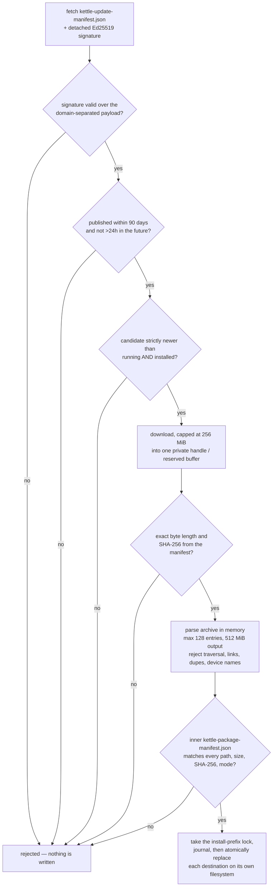
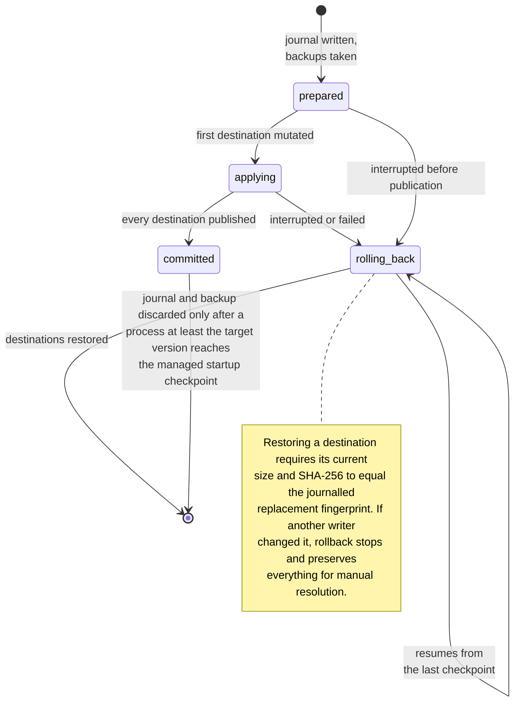

# Updating Kettle

## Commands

```text
kettle --check-update     Check the authenticated stable feed without installing
kettle update             Check, prompt, download, verify, and install
kettle update --yes       Confirm non-interactively for scripts
kettle --update           Convenience alias for interactive `kettle update`
```

On Windows, use the bare `kettle` command after installation. The installed
`kettle.com` console launcher makes PowerShell/cmd wait for prompts and return
the updater's exit code; the Start Menu points directly at no-console
`kettle.exe`.

There is intentionally no `-u` shorthand: short flags are easy to trigger by
mistake and are difficult to reserve permanently. Updates never restart running
windows. Linux commits the replacement immediately and existing processes keep
their mapped image. Windows retains the authenticated archive and applies it
from a helper only after every Kettle process has exited.

> **Windows bootstrap for v2.35:** releases before v2.35 did not include the
> out-of-process helper/run-lock protocol and could not reliably replace a
> mapped `kettle.exe`. Install v2.35 once with the bundled `install.ps1`; later
> releases can use `kettle update` without that manual bootstrap.

## Supported self-update layouts

| Running Kettle | Self-update behavior |
|---|---|
| Windows 11 x86_64 installed by the bundled `install.ps1` | Supported |
| The same Windows executable launched from WSL | Supported through Windows interop |
| Ubuntu/Linux x86_64 installed by the bundled `install.sh` or online installer | Supported |
| Ubuntu/Linux aarch64 installed by the bundled installer | Supported |
| Local source build (`local-dev` marker) | Refused; rebuild and reinstall from that checkout |
| Cargo, distro package, Nix, a future Homebrew/AUR package, or manually copied binary | Refused; update with its owner |
| macOS `kettle.app` from the release page | Supported from 3.2.0 onward. Replacing a 3.1.1 app is a one-time manual step — see below |
| macOS app installed by Homebrew | Refused; run `brew upgrade` |
| macOS app running translocated from Downloads | Refused; move it to Applications and open it once from there |

Updating **to** 3.2.0 on macOS has to be done by hand, once. The updater is
part of 3.2.0, so a 3.1.1 app has no code to run it: it still notices a new
release and still offers the release page, but it cannot install one. Download
`kettle-macos-universal.zip`, unzip it, and replace the app in `/Applications`.
Every release after that updates itself. First exercised against the real feed
on 2026-08-24: an installed 3.2.0 `kettle.app` fetched 3.2.1, replaced its own
bundle, and still assessed as `source=Notarized Developer ID` afterwards, with
no staging or previous-bundle directories left in `/Applications`. Until 3.2.1
existed there was no published macOS target newer than the installed one, so
this path could be designed and unit-tested but not demonstrated.

Official installers write a small ownership marker beside the managed layout.
The updater derives the install prefix from the running executable and requires
that marker to match Kettle, the stable channel, and the current Rust target.
It never searches `PATH` for another copy and never elevates privileges.

macOS has no installer to write a marker, and a marker cannot be added inside
`kettle.app` without breaking its code signature. Ownership is proven from the
signature instead: the bundle must be laid out as
`kettle.app/Contents/MacOS/kettle`, signed with Kettle's bundle identifier and
team, and sitting in a directory this user can write. A locally built app is
ad-hoc signed and is therefore refused, which is the same answer a `local-dev`
marker gets elsewhere.
Repository installs deliberately use a `local-dev` marker (recording no longer
affects the channel — it is a runtime toggle in every build; the legacy
`local-dev-record` marker is still recognized and refused for older installs).
Refusing those channels prevents the stable updater from replacing a
source-built binary or rewriting its launcher. Only an extracted release
tarball or the online installer writes a `stable` marker.

On Windows, the updater writes a schema-3 bounded pending capsule inside the
installer-owned prefix. It contains the exact signed release manifest and
detached Ed25519 signature, selected asset identity and digest, exact inner
package manifest, target version, retained archive identity, and copied-helper
identity. Local helper/archive hashes are only object-retention checks; they are
not an authenticity boundary. Before it can delay startup or launch, and again
inside the helper after the update and running locks are held, Kettle verifies
the signature with its compiled public key, checks manifest freshness, proves
the selected version and asset match the signed document, and requires a strict
upgrade. The helper obtains the actually installed version from the held
`kettle.exe` Windows version resource, so a stale pending capsule cannot
downgrade a newer manually installed binary.

The archive is one ordinary, single-link file named from the transaction id.
The helper retains a no-write/no-delete-sharing handle while it rechecks the
signed size and SHA-256, parses the ZIP directly from that handle, and
materializes each manifest-verified member into immutable memory. Transaction
replacement consumes only those verified byte buffers; it never reopens an
extracted staging pathname. The transaction id is exactly a canonical decimal
staging-process `u32` PID, a hyphen, and canonical decimal Unix-epoch
nanoseconds bounded to `u128`; a valid transaction's archive, helper, backup
marker, journal, pending record, and quarantine evidence must agree on that id
(unparseable pending evidence receives a fresh bounded quarantine id).
The saved PowerShell uninstaller understands this same schema-3 record and
validates its exact field set, nested signed-asset and package identities,
scalar types, counters, hashes, managed relative paths, and aggregate byte
limit. It does not require a named helper or archive to remain present after
controlled removal or a crash; any extant object still passes the independent
managed-tree checks before it can be deleted.
The install prefix must be a dedicated directory named `kettle`; the installer
rejects shared or broad prefixes and validates the managed tree and transaction
ACL before recovery or mutation. Every managed Kettle process
holds a shared run lock; the helper takes it exclusively, also waits until the
installed `.exe` and `.com` are no longer mapped, authenticates and consumes the
retained archive, and then commits the transaction. The helper acquires the update lock before
the running lock, releases the running lock and then the update lock after the
commit and pending-record removal are durable, and only then launches the saved
installer's integration refresh. That launch uses a fully qualified system
PowerShell path and keeps the exact manifest-verified `install.ps1` object
retained against writes and replacement for the entire child process. A launch
that sees valid pending state starts the helper and exits rather than prolonging
the old version. Failed attempts retain the pending record, archive, helper, and a bounded error message for the next
launch to retry. Automatic retry stops after three failed helper attempts. An
actual transaction attempt resets the independent handoff-timeout counter.
Timeouts waiting for still-running Kettle processes do not consume transaction
attempts during the first five minutes; after that grace period, three timed-out
handoffs stop automatic retry instead of allowing every future launch to hang.
An invalid or exhausted regular pending record is atomically quarantined as
`.kettle-update-failed-*.json`; Kettle also writes a bounded `.txt` diagnostic
when the prefix permits it. Quarantine itself is best-effort so a read-only
prefix or antivirus sharing denial cannot block the intact old binary from
starting. A nonregular pending path is never renamed into trusted evidence.
Startup emits a stderr message. A GUI launch also attempts a desktop recovery
notification; a secondary launch queues and gives that warning a bounded flush
before handing off to the existing window. Notification failure is logged.
Evidence that could be preserved remains in
the install prefix for diagnosis instead of trapping every future launch in a
handoff loop. At most eight failed transaction pairs are retained; older exact
records are pruned by transaction timestamp and then PID while the update lock
is held.

## Automatic policy

The default is `auto`: Kettle keeps itself current in the background,
oh-my-zsh style. It checks at most once per day (tunable), and when a newer
signed release is found it installs it — applied on Linux immediately (running
windows keep the old mapped image until they exit) and staged on Windows until
every Kettle window closes, then used on the next launch. The first launch only
creates the throttle state and performs no network request; the first automatic
install shows a one-time notification explaining how to opt out.

```ini
# default: install in the background, use after next restart
update-policy = auto
# only show a passive new-version banner
update-policy = notify
# no automatic network request
update-policy = off

# How often the background check may contact the feed, in hours (default 24 =
# daily; floored at 1). `update-policy = off` disables checking regardless.
update-check-interval-hours = 24
```

A window left open for many days is re-checked on an hourly in-session timer
(still bounded by the configured interval), so it stays current without a
restart. The legacy `update-check = true|false` setting remains compatible and
maps to `notify|off`. If both settings exist, `update-policy` wins regardless of
order. Builds produced with `KETTLE_PACKAGED` disable automatic checks so a
downstream distribution can own update policy. Explicit CLI checks still work.

## Verification and recovery

Every gate below rejects rather than repairs: the update either survives the
whole chain or does not happen. Nothing writable exists between verification
and application.



Each stable release publishes `kettle-update-manifest.json` and a detached
Ed25519 signature. Kettle embeds only the dedicated public key. Before parsing
or using metadata it verifies the signature over a domain-separated payload.
The signed manifest binds each supported target to an exact archive name, byte
length, and SHA-256 digest. It also binds the stable version/tag and an RFC 3339
publication time. A manifest more than 90 days old or more than 24 hours in the
future is rejected, and installation always requires the candidate version to
be strictly newer than the running or actually installed version. A previously
valid signed document therefore cannot be replayed indefinitely or used for a
downgrade.

Downloads are capped at 256 MiB. On Linux, the downloader reserves one buffer
from the signed artifact size, rejects allocation failure explicitly, hashes
that exact buffer, and parses the tar stream from a `Cursor` over the same
bytes. On Windows, the updater downloads to one private archive handle that
denies write/delete sharing, then retains that handle through digest checking
and ZIP parsing. Both paths copy accepted members into immutable in-memory
buffers and the transaction applies those buffers directly. No writable
archive or extracted pathname exists between verification and application.
Archive parsing accepts at most 128 entries and 512 MiB of actual output.
Absolute paths, traversal, duplicates and case aliases,
file/directory prefix conflicts, encrypted entries, links, special/sparse
files, Windows device names, and declared/actual size mismatches are rejected.
Updates acquire an install-prefix lock and atomically replace each destination
on its own filesystem.

Linux and Windows update archives contain
`kettle-package-manifest.json`. Kettle binds its product/version/target and
every regular file to an exact relative path, size, SHA-256, and Unix mode where
applicable before any replacement is accepted. On Windows, the pending capsule
also stores the exact package-manifest bytes and the helper requires the held
archive's embedded copy to match them byte for byte. Release CI generates this
inner manifest before packaging, then extracts the final downloaded artifact
and verifies it again with `scripts/package-manifest.py` before signing or
publication. The macOS `.app` does not carry this inner manifest, because any
file inside `Contents/` that the signature does not cover would invalidate it.
Its equivalent is Apple's own seal, checked after extraction and before the
bundle is swapped in.

The transaction journal is what makes an interrupted update recoverable rather
than a broken install. Its durable phase is the only thing a restarted process
trusts:



The schema-2 transaction journal records a transaction id, target version,
durable phase (`prepared`, `applying`, `rolling_back`, or `committed`), and each
destination's previous/replacement size and SHA-256. Recovery verifies backup
integrity, an id-bound marker, and the exact absence of unjournaled backup files
or directories, then checkpoints every restored entry, so a second interruption
simply resumes rollback. Before restoring or deleting a destination, recovery
requires its current size and SHA-256 to equal the replacement fingerprint in
the journal. If another writer changed it after the update, rollback stops with
an explicit conflict and preserves the destination, journal, and backup for
manual resolution. A `prepared` entry also recognizes the exact prior
fingerprint, covering a crash before publication without treating it as a
conflict.

A durable commit retains the journal and last-known-good backup. They are
discarded only after a process running at least the target version reaches the
managed startup checkpoint; an older binary or a loader/start failure cannot
confirm the transaction. The journal is then deleted and its parent synced before
exact leaf-by-leaf backup cleanup, so recovery never points at data it already
removed. A crash after that durable boundary can leave only a bounded,
marker-bound orphan backup; startup removes it under the update lock and refuses
unknown names, reparse points, or payload paths. Schema-1 journals left by v2.34
remain recoverable in the corrected order, but cleanup still requires their
exact journaled tree and never removes an unjournaled sentinel. Before the first
destination mutation, both new transactions and recovery preflight the aggregate
backup set against the 512 MiB limit. Backup copies stream through a bounded
64 KiB buffer rather than allocating each destination in memory.
Replacement bytes, the final preserved security descriptor, and the final Unix
mode are applied and synced on the staged inode before its atomic publication.
An interrupted executable update therefore cannot expose the staging mode
`0600` at the installed path while its journal still says `prepared`.
Linux keeps the descriptor-relative parent alive until the destination snapshot
file is open, so an existing install leaf cannot be mistaken for a new file
through a dangling `/proc/self/fd` path. Exact same-destination atomic-write
temps from a definitively dead creator are reclaimed with owner, type,
single-link, and identity checks; bounded cleanup ignores live or malformed
lookalikes.

The Windows installer uses the same update-then-running lock order and retains a
no-follow handle chain from the drive root through the install prefix while it
validates or mutates managed state. Lock files use the sharing and whole-file
byte range expected by Kettle's Rust lock implementation. The accepted tree is
limited to 128 entries and 512 MiB, with exact release-root and
`shell-integration/kettle.{bash,fish,ps1,zsh}` names. For upgrade compatibility,
historical binary-backup forms are recognized narrowly:
`kettle.{exe,com}.bak-MAJOR.MINOR.PATCH-YYYYMMDD`,
`kettle.{exe,com}.bak-YYYY-MM-DD`, and
`kettle.{exe,com}.bak-N-N`. They are preserved by an upgrade and removed as
ordinary leaves by uninstall; arbitrary `.bak-*` names remain unmanaged and
fail closed.

Release CI accepts only a GitHub-verified annotated tag. All required platform
artifacts must finish before the signing job can access its environment secret.
The release jobs use pinned runner images and an exact Rust toolchain, and every
Cargo invocation is lock-file constrained. The protected signer has read-only
repository permission: it reopens each archive through the bounded
package-manifest extractor, signs the feed, and passes only the exact finalized
asset set across an Actions-artifact boundary. A separate publisher has
repository write permission but no signing secret. It re-verifies the
signature, canonical sidecars, archives, and package metadata before uploading
a draft. The GitHub API response must then identify the exact draft tag and
contain one uploaded asset per expected name with the exact local byte length
and streamed SHA-256 before the release becomes public. This prevents a
partial or substituted update feed without exposing the signing key and
publication credential to the same job.

The macOS universal archive joined the signed manifest in 3.2.0, under the
target name `universal-apple-darwin`. That is not a Rust triple: one
`lipo`-merged binary serves both architectures, and the manifest needs one
filename per target. Older clients are unaffected, because each one looks up
only its own target and ignores every other entry.

macOS replaces the whole bundle rather than files inside it. The code signature
seals `kettle.app` as a unit, so a bundle caught part-way through a file-by-file
update is one Gatekeeper rejects. The updater extracts the verified archive into
a private `0700` directory beside the live bundle, checks it with `codesign` and
`spctl`, and only then exchanges the two in a single atomic operation. Both
tools ship with macOS; `stapler` does not, so it is not used.

That staging directory is held open from the moment it is created, and every
write during extraction is made relative to that descriptor with `O_NOFOLLOW`
and `O_EXCL`. The exchange names its source relative to the same descriptor.
This matters because `/Applications` is `drwxrwxr-x root:admin`, so any
administrator on the machine can rename entries in it. Resolving by descriptor
rather than by pathname means renaming the staging directory cannot redirect a
write or substitute what gets installed, and the `0700` mode means nobody else
can reach inside it between verification and installation.

The `spctl` check is the one that matters, and the reason is easy to miss:
re-signing a bundle changes its cdhash, which orphans the stapled notarization
ticket while leaving `codesign --verify` perfectly satisfied. Only the
assessment notices, so a signature check alone would happily install a build
that Gatekeeper then blocks.

The displaced bundle is kept until the next run rather than deleted at once. A
running Kettle reads its icon and asset catalog out of the bundle it launched
from, and pulling that directory away from a live app buys nothing. The next
start removes it, so a launch cannot delete files an update in another window
is still using. Two things stop that: the sweep takes the same update lock, and
a staging directory holds an advisory lock on itself for as long as it exists.
The second is the one to rely on, because two processes can disagree about
where a lock file lives if they inherited different environments, and cannot
disagree about the directory in front of them.

Kettle writes no lock or bookkeeping file into `/Applications`. The update lock
lives under `$XDG_STATE_HOME/kettle` (or `~/.local/state/kettle`), one per
install. That is partly hygiene and partly necessity: `/Applications` is
group-writable, and Kettle refuses to create a private file in a directory an
untrusted principal can write.

## Signing-key rotation

The stable manifest currently has one active Ed25519 trust root and no key
identifier. That makes an unannounced key replacement intentionally fail closed
in every installed client. Do not rotate the release-environment secret by
itself: the finalizer compares its derived public key with
`packaging/update-public.pem` and will reject the release.

A planned rotation must use a bridge release:

1. Generate the successor key under the release key-custody process; never add
   its private key to the repository or a developer workstation.
2. Add multi-key verification and an explicit key identifier to the updater,
   online installer, manifest generator, checked-in public-key set, and
   cross-consumer tests. Continue signing the bridge release with the old key.
3. After the bridge release has been distributed through every supported
   installer and package channel, select the successor key in the protected
   release environment and publish a release signed by it.
4. Retain the old public key for a documented migration window. Remove it only
   after the supported upgrade floor can verify the successor key.

If the active private key is suspected compromised, disable the release
environment and updater publication immediately. Existing signatures can no
longer establish authenticity; recovery must use independently authenticated
OS/package-manager distribution and a reviewed bridge build, not a manifest
signed by either the suspected key or a silent replacement.
