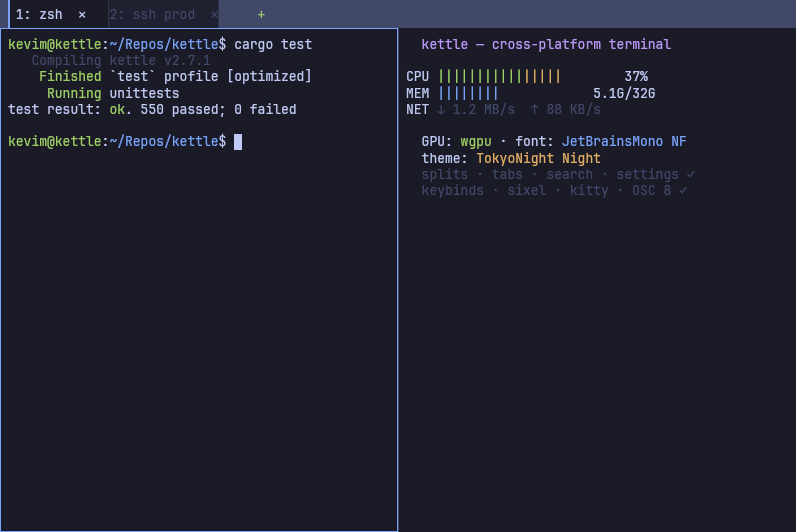
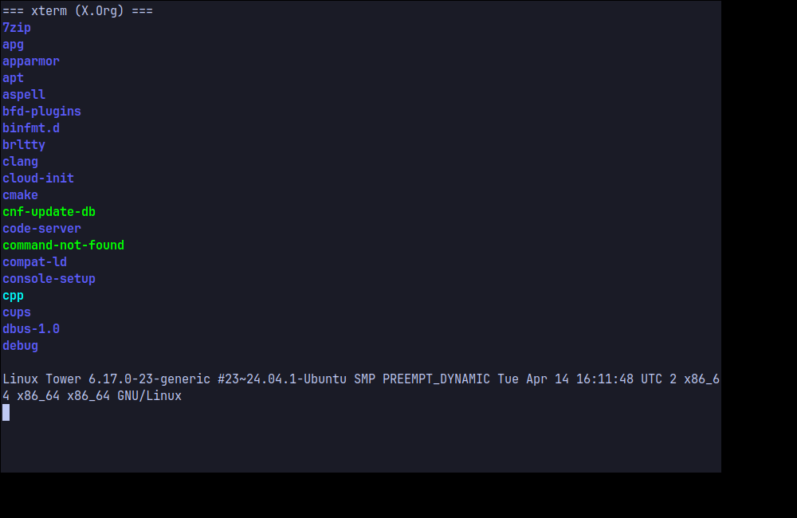
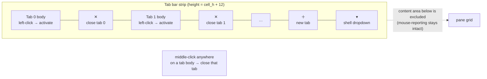

# kettle — terminal UI/UX comparison & backlog

How kettle's interaction model compares to the five terminals we cloned and
mined under `/tmp/term-research/`, what we adopted (with citations), and the
prioritized backlog with status. Every borrowed behavior cites the upstream
source file and line it came from — kettle borrows liberally and credits.

> Research method: each project cloned to `/tmp/term-research/<name>/`;
> behaviors verified against the named source file. kettle's own states are
> rendered through its real GPU path by `kettle --screenshot` (no mockups —
> same `wgpu`/`glyphon`/quad pipeline as the live app).

## kettle today (rendered offscreen via `kettle --screenshot`)



The frame above is produced by `kettle --screenshot docs/images/kettle-showcase.png
--cols 100 --rows 30`, driving the **actual** renderer: bundled JetBrains
Mono Nerd Font, the TokyoNight Night theme, the redesigned tab bar (active-tab
accent bar, per-tab `✕`, trailing `+`), and a focus-bordered vertical split.

### Reference terminals (best-effort, this CI image)

| Terminal | Screenshot | Notes |
|---|---|---|
| xterm (X.Org) |  | Installed via `apt`, captured under `Xvfb`+`import`. Baseline VT behavior, no chrome. |
| Alacritty | _n/a_ | `cargo install alacritty` not run on this headless image (heavy native deps, time-boxed); architecture mined from source instead. |
| kitty / WezTerm / Ghostty / Terminator | _n/a_ | Not installed on the CI image; behavior verified from cloned source (cited below) rather than a live capture. |

Reference captures are best-effort: where a terminal could not be installed
or run headlessly here, its UX is documented from the cloned source with
file:line citations — which is the authoritative comparison anyway.

## Comparison matrix

Legend: ✅ implemented · 🟡 partial · ⛔ not yet · — n/a.

| Area | kettle | Ghostty | kitty | WezTerm | Terminator | Alacritty |
|---|---|---|---|---|---|---|
| **Tabs** | ✅ tree of splits per tab | ✅ | ✅ | ✅ | ✅ | ⛔ (no tabs) |
| Per-tab close `✕` | ✅ always-on chip + hover red + pointer cursor (v1.3.2) | 🟡 | ✅ | ✅ `show_close_tab_button_in_tabs` | ✅ notebook close btn | — |
| New-tab `+` button | ✅ trailing segment | ✅ | ✅ | ✅ `show_new_tab_button_in_tab_bar` | ✅ | — |
| **New-tab `▾` shell dropdown** | ✅ WT-order shells + WSL distros + VS 2022 dev shells + Git Bash, `Ctrl+Shift+1..9`, live keybind hints (v2.18.0) | ⛔ | ⛔ | 🟡 `ShowLauncher` | ⛔ | — |
| Tab bar position | ✅ `tab-bar-position=top\|bottom` | ✅ | ✅ | ✅ `tab_bar_at_bottom` | ✅ `tab_position` | — |
| Tab title eliding | ✅ `truncate()` | ✅ | ✅ | ✅ `tab_max_width` | ✅ | — |
| **Drag-to-reorder tabs** | ✅ + ghost segment (v1.3.0 / v1.3.5) | ✅ | ✅ | ✅ | ✅ (GTK) | — |
| **Tab tear-off → new window (drag)** | ✅ Chromium model (v2.19.0): tears AT the strip threshold into a live window riding the OS move loop (Snap Layouts mid-drag); inherits source size, pointer holds the tab; Esc-before-tear cancels; `move_tab_to_new_window` keybind variant; Wayland = at-release fallback | ⛔ | 🟡 (`detach_tab`, keyboard) | ⛔ | ⛔ | — |
| **Tab re-dock (drag window→strip)** | ✅ (v2.19.0): drop a torn window on any kettle strip — dragged window goes translucent, accent insertion line marks the slot, lone-tab windows re-dock by their tab; live PTYs move both ways | ⛔ | ⛔ | ⛔ | ⛔ | — |
| **Multi-window (one process)** | ✅ N OS windows, shared GPU device, per-window accent hue (v2.18.0) | ✅ | ✅ | ✅ | ✅ | ✅ |
| **Activity / bell tab dots** | ✅ palette[6] / palette[3] (v1.3.0) | ⛔ | 🟡 | ✅ `tab_bar.bell` | ✅ (Activity / Urgent Watcher) | — |
| **Silence-watcher dot** | ✅ palette[8] dim, `tab-silence-threshold-ms` (v1.3.3) | ⛔ | ⛔ | ⛔ | ✅ (Silence Watcher origin) | — |
| **Undo-close tab** | ✅ ring-of-10, `undo_close_tab` (v1.3.0) | ⛔ | 🟡 | ✅ origin | ⛔ | — |
| **Duplicate tab / pane** | ✅ clone argv + cwd (v1.3.0) | ⛔ | ⛔ | ✅ | ⛔ | — |
| **Splits/panes** | ✅ binary tree | ✅ | ✅ (layouts) | ✅ | ✅ | ⛔ |
| Split keybinds | ✅ Terminator-exact | ✅ | ✅ | ✅ | ✅ (origin) | — |
| Unfocused-pane dimming | ✅ `unfocused-split-opacity` 0.7 | ✅ (origin) | 🟡 | 🟡 | ⛔ | — |
| Pane zoom/maximize | ✅ `Ctrl+Shift+X` | ✅ | ✅ | ✅ `is_zoomed` | ✅ | — |
| Configurable divider color | ✅ `split-divider-color` | 🟡 | 🟡 | ✅ `split` color | 🟡 (GTK theme) | — |
| Broadcast / group input | ✅ `Super+G` (tab bar + pane border tint warn) | ⛔ | ✅ `multi-input` | ✅ `ActivateKeyTable` | ✅ `broadcast_all` (origin) | ⛔ |
| **Right-click context menu** | ✅ floating panel, 8 entries (v1.3.0/v1.3.2) | ⛔ | ⛔ | 🟡 | ✅ origin | ⛔ |
| **Smart selection (regex double-click)** | ✅ URL / path / IPv4 / git SHA | ⛔ | ⛔ | 🟡 `pattern` | ⛔ | ⛔ (iTerm2 origin) |
| **Command palette** | ✅ `Ctrl+Shift+K`, fuzzy, 41 commands | ✅ origin | 🟡 (`kitten hints`) | 🟡 (Lua) | ⛔ | ⛔ |
| **Quick-select / URL hints** | ✅ `Ctrl+Shift+H` (v1.0) | ⛔ | ✅ `kitten hints` origin | ✅ `QuickSelect` | ⛔ | ⛔ |
| **Search overlay** | ✅ `Ctrl+Shift+F`; Terminator-style bottom bar; strict regex; Smart/Match/Ignore; wrap/invert; signed history + bounded soft-wrap highlights; incremental scan + Results limited | ✅ | ✅ | ✅ | ✅ | ✅ |
| **Shell integration (OSC 133)** | ✅ bundled `kettle --shell-integration <shell>` + `Ctrl+Up/Down` jump | ✅ | ✅ | ✅ | ⛔ | 🟡 |
| **Kitty keyboard protocol** | ✅ progressive CSI-u negotiation + press/repeat/release encoder | ✅ | ✅ (origin) | ✅ | 🟡 (version/config dependent) | 🟡 |
| **SSH launcher** | ✅ `Ctrl+Shift+S` fuzzy, configured + freeform | ⛔ | ⛔ | ⛔ | 🟡 (`ssh-host` plugin) | ⛔ |
| **Vi-mode for scrollback** | ✅ `Ctrl+Shift+Space`; native Alacritty cursor/selection/viewport state | ⛔ | ⛔ | ⛔ | ⛔ | ✅ origin |
| **Remote-control IPC** | ✅ acknowledged `kettle ctl`; legacy bounded at-most-once `--remote-send` spool | ⛔ | ✅ `kitty @` origin | 🟡 (Lua API) | ⛔ | ⛔ |
| **Lua scripting** | ✅ sandboxed `init.lua`, nine event hooks, ordered bounded side effects, menu + URL extensions | 🟡 | ✅ kittens | ✅ origin | ✅ Python plugins | ⛔ |
| **Quake / dropdown toggle** | ✅ `kettle --toggle` | ✅ quick-terminal origin | ⛔ | ⛔ | ⛔ | ⛔ |
| **Triggers (regex → urgency)** | ✅ `trigger = REGEX` | ⛔ | ⛔ | 🟡 (Lua) | ⛔ | ⛔ (iTerm2 origin) |
| **Named layout / profile** | ✅ `--layout NAME` + `--profile NAME` | 🟡 | 🟡 | 🟡 (workspace via Lua) | ✅ (origin) | ⛔ |
| **Session restore (multi-window)** | ✅ opt-in; preflight-bounded windows/panes/surface pixels, geometry clamped before native creation | 🟡 | 🟡 (`--session` startup file) | 🟡 (Lua/plugin) | ✅ (layouts origin) | ⛔ |
| **Peacock accent-color** | ✅ per-window auto hue, on by default (v2.18.0); pin with `accent-color`/`--accent`, opt out via `accent-color = theme` | ⛔ | ⛔ | ⛔ | ⛔ | ⛔ (Peacock-for-VSC origin) |
| **Annotated screenshots** | ✅ `--annotate TEXT` (caption variant) | ⛔ | ⛔ | ⛔ | ⛔ | ⛔ |
| **Status bar widget** | ✅ `status-bar = top\|bottom` | ⛔ | ✅ origin | ✅ Lua | ⛔ | ⛔ |
| **Cursor** | ✅ block/bar/underline | ✅ | ✅ | ✅ | ✅ | ✅ |
| Cursor when unfocused | ✅ hidden; exact child-selected shape restored on refocus | 🟡 hollow | ✅ hollow | ✅ hollow | 🟡 | ✅ hollow (origin) |
| Blink interval config | ✅ `cursor-blink-interval` ms | ✅ | ✅ | ✅ | ✅ | ✅ (origin, 750) |
| **Selection** | ✅ word/line/drag | ✅ | ✅ | ✅ | ✅ | ✅ |
| Copy-on-select toggle | ✅ `copy-on-select` | ✅ | ✅ | ✅ | ✅ | ✅ (origin) |
| Drag-and-drop file paths | ✅ shell-quoted, bracketed-paste-safe, broadcast-aware | ✅ | ✅ `paste_from_drop` | ✅ configurable | 🟡 (GTK builtin) | ⛔ |
| **Scrollback** | ✅ infinite option | ✅ | ✅ | ✅ | ✅ | ✅ |
| Scrollbar indicator | ✅ `scrollbar=never\|auto\|always` | 🟡 | ⛔ | ✅ `enable_scroll_bar` | ✅ `scrollbar_position` | ⛔ |
| **GPU rendering** | ✅ wgpu | ✅ (custom) | ✅ (OpenGL) | ✅ (wgpu) | ⛔ (GTK/VTE) | ✅ (OpenGL) |
| Ligatures | ✅ toggle | ✅ | ✅ | ✅ | 🟡 | ⛔ |
| Inline images | ✅ sixel+kitty+iTerm2; buffer-local, margin-scrolled, pane/grid-clipped | ✅ | ✅ (origin kitty) | ✅ | ⛔ | ⛔ |
| Hyperlinks (OSC 8) | ✅ + URL and cwd-aware file-path autodetect | ✅ | ✅ | ✅ | ✅ | ✅ |

### Citations (upstream source we verified / borrowed from)

- **Split keybinds** — Terminator `terminatorlib/config.py:144-145`:
  `split_horiz = '<Shift><Control>o'`, `split_vert = '<Shift><Control>e'`.
  kettle now matches exactly (`Ctrl+Shift+O` → top/bottom, `Ctrl+Shift+E`
  → left/right) — see `kettle-config/src/keybinds.rs`.
- **Unfocused-split dimming** — Ghostty `src/config/Config.zig:1071`
  (`@"unfocused-split-opacity": f64 = 0.7`) and the clamp at
  `Config.zig:4676` (`@min(1.0, @max(0.15, …))`). kettle: same key, default
  0.7, clamp 0.1–1.0.
- **Tab bar buttons / position / width** — WezTerm `config/src/config.rs:496`
  `show_new_tab_button_in_tab_bar`, `:499` `show_close_tab_button_in_tabs`,
  `:483` `tab_bar_at_bottom`, `:509` `tab_max_width`. kettle has trailing
  new-tab / close buttons plus top/bottom/left/right positions; horizontal
  tabs always divide the available strip evenly and use the full segment for
  active fill, hit testing, dragging, and title budget.
- **Scrollbar** — WezTerm `config/src/config.rs:516` `enable_scroll_bar`;
  Terminator `terminatorlib/config.py:238` `scrollbar_position = "right"`.
- **Hollow unfocused cursor & copy-on-select & blink default** — Alacritty
  `alacritty/src/config/cursor.rs:21` `unfocused_hollow`, `:24/:33`
  `blink_interval` (default 750 ms), `alacritty/src/config/selection.rs:9`
  `save_to_clipboard`.
- **Pane zoom** — WezTerm `wezterm-gui/src/termwindow/mod.rs:264`
  `pub is_zoomed: bool`. kettle: `Tab.zoomed` + `Mux::toggle_zoom`,
  `Ctrl+Shift+X`.
- **Tab title eliding** — WezTerm `tab_max_width`; kettle reuses its own
  `truncate()` helper in `kettle-render/src/lib.rs` instead of exposing a
  horizontal tab-width cap.
- **Broadcast / group input** — Terminator `terminatorlib/terminator.py`
  `broadcast_all` group action (origin of the "send keystrokes to every
  pane in this tab" affordance); kitty `multi-input.py` extension. kettle's
  variant: `Mux::broadcast_write_with_scroll` + `broadcast_paste`
  scope to the active tab's leaves only (per-window-per-tab, not every
  pane in every tab — matches Terminator's intent). Visual indicator
  uses theme `palette[3]` (yellow) on both the active tab segment's
  accent and the focused-pane border, so the user can see broadcast is
  on regardless of `tab-bar` mode.
- **Drag-and-drop file paths** — iTerm2 (long history; macOS-conventional);
  kitty `paste_from_drop` config; WezTerm `WindowEvent::DroppedFile` handler;
  GTK provides this builtin for Terminator. kettle's variant in
  `kettle-ui/src/app.rs` `WindowEvent::DroppedFile`: shell-quote the path
  via the pure helper `shell_quote_path` (POSIX single-quote escape,
  `'\''` for embedded apostrophes — works on bash/zsh/fish/pwsh-7+),
  append a trailing space so `cat ` + drop + Enter Just Works, then route
  through `input::paste_payload(text, bracketed)` so vim / fzf / mc with
  bracketed paste enabled get the bytes wrapped in `\e[200~ … \e[201~`
  (no per-char normal-mode interpretation). Broadcast-aware: with group
  input on, the path goes to every pane in the active tab using
  `broadcast_paste`, which reads each pane's `BRACKETED_PASTE` mode
  separately for the wrap (a broadcast set containing one shell + one
  vim doesn't break either of them).

## Tab-bar hit regions

The tab-bar geometry is computed **once** in the UI (`App::tab_bar()` in
`kettle-ui/src/app.rs`) and is the single source of truth shared by both the
renderer (drawing) and mouse hit-testing (clicks) — no duplicated `x / (w/n)`
math. Each segment carries its own rect plus a trailing `✕` close rect; the
bar ends with a `+` new-tab rect.



Resolution order on `MouseInput::Pressed` (left button): `✕` rect → `+`
rect → tab body (→ set active). Middle button on any tab body → close that
tab. Closing the last tab exits the app.

Since v2.18.0 the `+` is followed by the Windows-Terminal-style `▾` shell
dropdown — always visible on every platform (it previously hid on
single-shell Unix hosts) — listing the detected shells, then Settings… /
Command palette / About kettle, each row with a right-aligned dimmed hint
computed from the **live** keybind map (rebinds show the user's actual
chord).

Since v2.19.0 a left-drag that pulls a tab **1.5 bar-heights past the tab
band** (any direction; pure-distance hysteresis, so dragging along the
strip still reorders) **tears the tab off instantly** into a live window
that inherits the source window's size and is positioned so the pointer
keeps holding the tab. The window is immediately handed to the OS's
native move loop (`drag_window()`: `WM_NCLBUTTONDOWN`/`HTCAPTION` on
Windows — Snap Layouts and FancyZones engage mid-drag —
`_NET_WM_MOVERESIZE` on X11, `performWindowDragWithEvent` on macOS), the
same handoff Chromium uses; PTYs, scrollback and running programs move
untouched and pane ids stay stable. Dragging it over another kettle
window's tab band turns the dragged window translucent (Windows), shows
an accent insertion line at the landing slot in the target strip —
materializing the strip on a single-tab `tab-bar = auto` window — and a
release there merges the tab at that slot and closes the emptied window.
A **lone-tab** window's tab drags the whole window (Chromium semantics),
which is how a torn-off window re-docks. `Esc` before the tear cancels;
within-slop releases never tear. On Wayland — no client-side window
positioning — the tear falls back to happening at release.

## Backlog status

**Shipped through v1.3.5** (the chronological list of "moved from
Future → Done since the v1.0 cut of this matrix"):

- Split-key Terminator parity (`Ctrl+Shift+O`/`E`), tab bar redesign,
  unfocused-pane dimming, pane zoom, per-pane scrollbar, split-
  divider color, cursor-blink interval, copy-on-select, tab-bar
  position, `--screenshot` offscreen capture — the original v1.0
  batch.
- Command palette (`Ctrl+Shift+K`) — Ghostty/kitty parity.
- Quick-select hint mode (`Ctrl+Shift+H`) — kitty / WezTerm parity.
- SSH launcher (`Ctrl+Shift+S`) — kettle-original fuzzy launcher.
- Search overlay (`Ctrl+Shift+F`) with a responsive Terminator-style bottom bar,
  strict Rust regex, Smart/Match/Ignore, Wrap/Invert, Unicode editing, and
  bounded reveal/highlighting across signed scrollback and soft wraps. It uses
  status-only progress, including Results limited at safety boundaries, rather
  than an eager global count.
- Tab-bar mouse-wheel cycling.
- Minimum-contrast adjustment (`minimum-contrast`, WezTerm parity).
- Background opacity + transparent rendering.
- Shell integration / OSC 133 jump-to-prompt (`Ctrl+Up`/`Down`) +
  bundled `kettle --shell-integration <bash|zsh|fish>` snippets.
- Drag-and-drop file paths (shell-quoted, bracketed-paste-safe,
  broadcast-aware) — kitty/WezTerm/iTerm2 parity.
- Block (rectangular) selection — iTerm2/Alacritty/WezTerm parity.
- v1.3.0 batch: `Ctrl+Shift+W` close-pane fix, tab `✕`
  hover affordance, right-click context menu (Terminator/GNOME/
  iTerm2), tab-bar activity / bell dots (Terminator), undo-close-
  tab (WezTerm), duplicate tab / pane (iTerm2), mouse-drag tab
  reorder (kitty/iTerm2/Ghostty).
- v1.3.3+ refinements: per-tab silence watcher (Terminator
  Silence Watcher), ghost-render of the dragged tab during reorder
  (v1.3.5), generated Homebrew formula and AUR PKGBUILD **release
  assets** plus a directly usable Nix flake, and SHA-256 sidecars on
  every release artifact. The formula/AUR templates did not by
  themselves publish a Homebrew tap or AUR package.

**Shipped in v1.4.0 → v1.7.0** (all in `main`):

- **Smart selection** (iTerm2 parity) — double-click
  expands to URL / file path / IPv4 / git SHA.
- **Triggers** (iTerm2 parity) — `trigger = REGEX`
  fires `window.request_user_attention(Critical)`.
- **`--layout NAME`** (Terminator parity) — named-
  workspace session restore.
- **`--profile NAME`** (Terminator + iTerm2 parity) —
  named-config split.
- **`accent-color`** (Peacock-for-VS-Code parity) —
  multi-window visual ID via one config knob.
- **`--annotate TEXT`** (iTerm2 caption variant) —
  bottom-strip overlay on `--screenshot` output.
- **Status bar** (iTerm2 / kitty parity) — clock ·
  theme · pane title.
- **Vi-mode for the scrollback** (Alacritty parity) —
  `Ctrl+Shift+Space` enters; h/j/k/l/0/$/g/G/H/M/L +
  arrows; `v` visual selection; `y` yank; Esc exit. Motion, cursor,
  selection, viewport following, reflow, and history eviction are the native
  Alacritty terminal state rather than a parallel UI model.
- **Remote-control IPC** (kitty `@` parity) —
  acknowledged `kettle ctl` plus a compatibility
  `kettle --remote-send TEXT` path whose locked 1 MiB file spool is explicitly
  at-most-once after claim and rejects claimed batches over 1,024 operations
  before dispatch.
- **Quake dropdown** (Yakuake / Tilda / Ghostty quick-terminal
  parity) — `kettle --toggle` flips window visibility
  via the remote-control IPC; users bind their OS / DE / compositor
  global hotkey.

**Shipped in v2.18.0** (multi-window + Windows Terminal parity):

- **In-process multi-window** — one kettle process hosts N OS
  windows; `new_window` (`Ctrl+Shift+I`) no longer spawns a second
  process. The GPU device/queue is shared across windows; the
  process exits when the last window closes. Bare desktop/Super-key launches
  activate that primary and open another in-process window after a confirmed
  bounded local-IPC handoff; explicit CLI launches stay isolated, and
  `--new-process` forces isolation for an otherwise default launch.
- **Live tab tear-off** (Windows Terminal parity) — drag a tab
  outside the window and release: the tab moves *live* into a new
  window at the drop point — PTYs, scrollback and running programs
  untouched, pane ids stable; `Esc` or focus loss cancels. The
  `move_tab_to_new_window` keybind action is the same live in-process
  move (no respawn), which is also the path on Wayland, where the WM
  decides drop position.
- **Session v2** — `session.json` records every window (tabs +
  active + outer position/size); restore reopens each window at its
  saved position, clamped to the live monitor layout. Legacy
  single-window files still load, and new files mirror the legacy
  top-level fields to window 1 so older kettles can read them.
- **Per-window Peacock accents, on by default** — every window
  claims a distinct accent hue from the theme's pool (same
  project/cwd → same starting hue; cross-process coordination via a
  presence registry under `<runtime>/kettle/instances`). Opt out
  with `accent-color = theme`; pin a color with a hex or `--accent`.
- **WT-parity new-tab `▾` dropdown** — PowerShell / Windows
  PowerShell / Command Prompt / WSL distros / VS 2022 developer
  shells (vswhere) / Git Bash in Windows Terminal's order, plus
  Settings… / Command palette / About rows; `Ctrl+Shift+1..9`
  (`new_tab_shell_N`) opens the Nth entry; menu rows show live
  keybind hints.
- **About panel** — new `about` action (dropdown bottom row +
  command palette): version + git hash (exactly what `--version`
  prints), update status, copy-version / open-GitHub / open-release
  rows.

**Future** (intentionally deferred — large or out-of-scope):

- **Detachable mux server / remote attach** (WezTerm, tmux-style).
  Multi-week scope; touches the PTY abstraction, the session
  protocol, and the auth surface.
- **tmux `-CC` passthrough** (iTerm2 parity). Large; embeds the
  tmux control protocol inside kettle. XL effort.
- **Persistent in-terminal annotations** (iTerm2 — distinct from
  the v1.4.0 screenshot caption). Scrollback-position metadata +
  sticky-note overlay + search-jump-to. L effort.
- **Native macOS menu bar**. Needs macOS to test interactively;
  a separate effort once a maintainer with macOS commits to drive it.
- **Code-signed / notarized macOS build; Windows MSI installer.**
  Needs Apple Developer / Windows code-signing certificates; not
  doable from the public CI matrix.
- **Background blur / translucency on macOS / Windows** — kettle
  already honors `background-opacity` on Linux;
  the per-OS Vibrancy / DWM blur extension is desktop-shell-
  specific and not yet wired through winit.
- **Source-build AUR companion** (`kettle`, no `-bin` suffix) and
  upstream nixpkgs submission (so `nix-env -iA nixpkgs.kettle`
  works without the flake-input dance).

## Reproducing the captures

```sh
# kettle's own showcase (real GPU path, no window):
cargo run -p kettle -- --screenshot docs/images/kettle-showcase.png \
    --cols 100 --rows 30

# Reference terminal (best-effort, headless):
apt-get install -y xterm imagemagick
Xvfb :97 -screen 0 1000x650x24 & DISPLAY=:97 \
  xterm -e bash -c 'ls --color=always; sleep 6' &
DISPLAY=:97 import -window root docs/images/refs/xterm.png
```

## Historical v2.20.0 Terminator + Ghostty decision record

An 11-agent source-level analysis walked the **full Terminator
(`terminatorlib/`) and Ghostty (`src/`) trees** against kettle's codebase:
130 features inventoried with value/effort scoring, and the 42
highest-relevance claims **adversarially cross-checked against kettle source
with file:line evidence** (the cross-check corrected 11 inventory statuses —
see the note at the end). Verdicts below; the six "now" picks that fit the
v2.20.0 decision gate shipped, the rest are tracked.

> This section preserves the v2.20.0 point-in-time inventory and its original
> prioritization. Its ⛔/backlog cells are not a current capability matrix;
> later releases shipped some of them. Use the current matrix above and
> [TERMINAL-CLIENT-COMPATIBILITY.md](TERMINAL-CLIENT-COMPATIBILITY.md) for
> current behavior.

### Shipped in v2.20.0

| Feature | Source | What it is | Value · Effort |
|---|---|---|---|
| Resize overlay | Ghostty `resize-overlay` | Transient `cols×rows` popup during live resize (`always\|never\|after-first` mode key only; `-position`/`-duration` not adopted — chip centered, 750 ms fixed) | high · S |
| OSC 7 cwd emission in kettle's own shell-integration snippets (incl. PowerShell) | Ghostty shell-integration | Every prompt reports cwd, activating the cwd-inherit pipeline (new tab/split in same dir) kettle had already built | high · S |
| `kitty-shell-cwd://` OSC 7 scheme + hostname validation | Ghostty | Accept kitty's verbatim-path OSC 7 flavor and reject reports from non-local hostnames (ssh safety) | high · S |
| Prompt-aware close confirmation | Ghostty `confirm-close-surface` | Ask before closing a pane/window with a command running — skip silently when idle at a prompt (OSC 133 prompt state) | high · M |
| Regex capture-group substitution in `trigger = REGEX :: cmd` | Terminator `run_cmd_on_match` parity completion | `{n}` tokens (`{0}` = whole match) substitute match groups per argv element — open-file-at-line style automation, command stays data not shell | high · S |
| `equalize_splits` action | Ghostty / Terminator | One action rebalances every split in the tab to equal ratios | low · S |

### Deferred at the v2.20.0 decision gate

- **Kitty keyboard protocol (CSI-u progressive enhancement)** — the single
  biggest TUI-compat unlock then left. It was deliberately not landed beside
  v2.20's render refactors and therefore appears missing in the historical
  table below. It shipped in a later release with capability replies,
  set/push/pop mode handling, and the CSI-u event encoder.
- **Terminal-reply layer cluster** — XTGETTCAP, DECRQSS, structured DA1
  advertisement (sixel=4, clipboard=52), kitty graphics `a=q` query replies:
  one shared pre-engine plumbing effort in `kettle-vt` (the `extract.rs`
  interception seam) over the existing `PtyWrite` reply channel. Four
  features, roughly one plumbing pass.
- **Clipboard paste-protection bundle** — confirm pastes with embedded
  newlines (copy-paste command injection), bracketed pastes safe by default;
  packaged with the existing OSC 52 deny-read posture as a coherent
  "kettle clipboard protections" story.
- **Native global hotkey** — `global:`-prefix keybinds, `RegisterHotKey` on
  Windows first. Ghostty has no Windows port at all — kettle can leapfrog
  upstream on its primary platform.
- **Row-level damage tracking + persistent GPU cell buffers** — the natural
  successor to v2.20.0's per-line shaping cache: persist last frame's quads
  per row, splice only dirty rows.
- **Byte-budget scrollback** — Ghostty's `scrollback-limit` is byte-based.
  kettle now exposes `scrollback-bytes` as a separate per-pane memory cap while
  keeping the existing `scrollback` / `scrollback-limit` line-count semantics
  for compatibility.

### Full matrix — all 130 features

Status: ✅ have · 🟡 partial · ⛔ missing · ❔ unverified. Statuses reflect
the adversarial cross-check where one exists (11 rows differ from the raw
inventory). Two features were independently inventoried twice by different
area agents (resize overlay; prompt-aware close confirm) — duplicate rows
are marked, so the 11 shipped features occupy 13 "now" rows.

#### Verdict: now — 39 rows (11 features shipped; the rest capped by the v2.20.0 decision gate)

| Feature | Source | kettle | Value | Effort | Verdict | Rationale |
|---|---|---|---|---|---|---|
| System-appearance theme following (`theme = light:X,dark:Y`) | Ghostty | ✅ | high | M | ✅ shipped v2.25.1 | `theme-mode = auto` / `system` / `follow-system` applies the platform's current winit window theme at startup and handles live `ThemeChanged` events; `theme-schedule` remains an explicit time-based override. |
| `clipboard-paste-protection` + `clipboard-paste-bracketed-safe` | Ghostty | ✅ | high | M | ✅ shipped v2.25.1 | `clipboard-paste-protection = true` confirms multi-line clipboard/PRIMARY/PuTTY-style pastes only when a writable target lacks bracketed paste; bracketed editor/agent targets paste immediately with the existing injection guard. |
| `confirm-close-surface` (prompt-aware close confirmation) | Ghostty | 🟡 | high | M | ✅ shipped v2.20.0 | Data-loss guard every mainstream terminal has; kettle already had the confirm dialog and OSC 133 prompt state. |
| `window-width`/`window-height` (grid cells) + position | Ghostty | ✅ | medium | S | ✅ shipped v2.25.1 | Fresh-window startup geometry now accepts cell-based size plus physical-pixel position; restored sessions and explicit new-window geometry remain authoritative. |
| `env` (repeatable KEY=VALUE injection) | Ghostty | ✅ | medium | S | ✅ shipped v2.25.1 | `env = KEY=VALUE` is repeatable for every spawned GUI pane, validates portable env names, allows empty values, preserves deterministic process-env override behavior, and forwards user vars across Windows → WSL via `WSLENV`. |
| `resize-overlay` (+ `-position`, `-duration`) | Ghostty | ⛔ | medium | S | ✅ shipped v2.20.0 (mode key only; `-position`/`-duration` not adopted — chip centered, 750 ms fixed) | Isolated render feature on existing overlay machinery; pairs with `geometry-hinting`. |
| Custom theme files + user theme directory | Ghostty | ⛔ | medium | S | → backlog (capped by the v2.20.0 decision gate) | A theme file is a constrained reuse of the existing key=value parser; unlocks the iTerm2/Gogh ecosystem. |
| `command-palette-entry` (user-defined palette commands) | Ghostty | ⛔ | medium | S | → backlog (capped by the v2.20.0 decision gate) | Palette and parsed action grammar both exist; mirrors `menu-item`, compounds with the agent server. |
| Kitty keyboard protocol (CSI-u progressive enhancement) | Ghostty | ⛔ at v2.20 | high | M | → backlog at the v2.20.0 decision gate; shipped later | At this historical gate the engine flag existed but the encoder did not. Current Kettle answers capability queries and emits negotiated CSI-u events. |
| Kitty graphics query replies (`a=q` OK/error + quiet flags) | Ghostty | ⛔ | high | S | → backlog (capped by the v2.20.0 decision gate) | kitten-icat-style probing cannot see kettle's shipped graphics; the PtyWrite reply channel already exists. |
| XTGETTCAP (DCS `+q`) capability queries | Ghostty | ⛔ | medium | M | → backlog (capped by the v2.20.0 decision gate) | TUIs probe capabilities via DCS; a small static cap table on the existing pre-engine interception. |
| DA1 feature advertisement (sixel=4, clipboard=52) | Ghostty | ✅ | medium | S | ✅ shipped v2.25.1; policy truthfulness hardened next release | Primary DA reports `CSI ? 6 ; 4 ; 52 c` when OSC 52 writes are actually available and `CSI ? 6 ; 4 c` otherwise, so capability probers discover the sixel decoder without being misled about clipboard policy. |
| Protocol desktop notifications (OSC 9 / OSC 777) | Ghostty | ✅ | medium | S | ✅ shipped v2.25.1 | `OSC 9 ; message` and `OSC 777 ; notify ; title ; body` now parse into bounded desktop notifications through the existing notification dispatcher; `OSC 9;4` remains taskbar progress. |
| Hardened shell-integration scripts (robust OSC 133 marking) | Ghostty | 🟡 | high | M | → backlog (capped by the v2.20.0 decision gate) | Pure script work improving shipped jump-to-prompt; re-implement from spec — Ghostty's scripts are GPLv3. |
| OSC 7 cwd emission in kettle snippets (incl. PowerShell) | Ghostty | ⛔ | high | S | ✅ shipped v2.20.0 | One emission per prompt activates the cwd-inherit pipeline kettle already built; best cost/value in the inventory. |
| OSC 7 `kitty-shell-cwd://` scheme + hostname validation | Ghostty | ⛔ | high | S | ✅ shipped v2.20.0 | Interop bug-fix: docs already claimed kitty integration is picked up — untrue for this scheme until now. |
| Prompt-aware close confirmation (skip when idle at prompt) | Ghostty | ⛔ | medium | S | ✅ shipped v2.20.0 (dup of the `confirm-close-surface` row) | The signal already exists in term.rs; a small command-running predicate, big perceived polish. |
| `KETTLE_SHELL_FEATURES` env contract | Ghostty | ⛔ | medium | S | → backlog (capped by the v2.20.0 decision gate) | Cheap contract making snippet features config-controllable; crosses WSL via the existing WSLENV handling. |
| Title reporting from shell (cwd at prompt, command while running) | Ghostty | ⛔ | medium | S | → backlog (capped by the v2.20.0 decision gate) | Script-only, feature-gated; the tab strip shows live command names. |
| Cursor shape at prompt (bar at prompt, reset for commands) | Ghostty | ⛔ | medium | S | → backlog (capped by the v2.20.0 decision gate) | Script-only DECSCUSR emission; the engine already renders the shapes. |
| Resize overlay (transient cols×rows popup) | Ghostty | ⛔ | high | S | ✅ shipped v2.20.0 (dup of the `resize-overlay` row) | Same feature inventoried by the UX-area agent, which scored it high. |
| File-path linkification (URL-detection regex parity) | Ghostty | ✅ | high | M | ✅ shipped v2.25.1 | Local absolute, Windows drive, and pane-cwd-relative paths now feed the same link-open pipeline as URLs while preserving the local-only `file://` safety gate. Ghostty's larger url.zig corpus remains useful for future regex expansion. |
| System dark/light appearance following | Ghostty | ✅ | high | S | ✅ shipped v2.25.1 | Duplicate of the theme-following row; the `system` alias now routes through winit OS appearance changes. |
| Native global hotkey (`global:` keybinds) for quake mode | Ghostty | 🟡 | high | M | → backlog (capped by the v2.20.0 decision gate) | Removes quake-mode's biggest friction; Windows-first RegisterHotKey — Ghostty has no Windows port to copy. |
| Link previews (hover destination strip) | Ghostty | ⛔ | medium | S | → backlog (capped by the v2.20.0 decision gate) | Anti-spoofing win for OSC 8; a status-strip preview gets most of the value cheaply. |
| User theme directory (custom theme files) | Ghostty | ⛔ | medium | S | → backlog (capped by the v2.20.0 decision gate) | Duplicate of the theme-files row; user-over-bundled precedence is hours of loader work. |
| `equalize_splits` action | Ghostty | ⛔ | low | S | ✅ shipped v2.20.0 | Walk the split tree, reset ratios, one resize; rounds out split parity nearly free. |
| Row-level damage tracking + persistent GPU cell buffers | Ghostty | 🟡 | high | M | → backlog (capped by the v2.20.0 decision gate) | Natural successor to the new per-line content keys: persist quads per row, splice only dirty rows. |
| Distinct curly/dotted/dashed underline rendering | Ghostty | 🟡 | high | M | → backlog (capped by the v2.20.0 decision gate) | Neovim/helix squiggles are currently indistinguishable from plain underline; render-side only, flags already plumbed. |
| Font-metric modifier knobs (`adjust-cell-width/height`, underline pos/thickness) | Ghostty | 🟡 | medium | S | → backlog (capped by the v2.20.0 decision gate) | Pure arithmetic at existing quad call sites; underline thickness should scale with font size anyway. |
| Minimum-contrast exemption for box/powerline glyphs | Ghostty | ⛔ | low | S | → backlog (capped by the v2.20.0 decision gate) | One codepoint-range check in the CPU contrast-lift path; prevents seam artifacts. |
| Cross-window broadcast scope (`broadcast_all` + named groups span windows) | Terminator | 🟡 | high | M | → backlog (capped by the v2.20.0 decision gate) | Multi-window removed the old IPC blocker; an App-level target loop makes groups window-spanning — the marquee Terminator use case. |
| Remotinator-parity structural agent API (new_tab/split/set_title via ctl) | Terminator | 🟡 | high | M | → backlog (capped by the v2.20.0 decision gate) | Additive ctl methods on the existing dispatch/drift-guard scaffolding; directly serves the agent-first direction. |
| Broadcast-aware `insert_number` / `insert_padded` | Terminator | 🟡 | medium | S | → backlog (capped by the v2.20.0 decision gate) | Converts a hollow parity row into the real feature: each broadcast pane types its own fleet index. |
| Vertical tab-bar drag-reorder (y-axis) | Terminator | ⛔ | medium | S | → backlog (capped by the v2.20.0 decision gate) | Twice-deferred follow-up; the tear-off work made the drag FSM axis-aware, the y-flip is identical-shape work. |
| Auto-theme: follow OS dark/light (`auto_theme.py`) | Terminator | 🟡 | high | M | → backlog (capped by the v2.20.0 decision gate) | Terminator flavor of the same theme-following gap; skip the sunrise/sunset half — the OS schedules dark mode. |
| Capture-group substitution in `trigger = REGEX :: cmd` | Terminator | ⛔ | high | S | ✅ shipped v2.20.0 | Turns triggers from notify-only into automation; per-argv `{n}` substitution (`{0}` = whole match) keeps the command-as-data security posture. |
| Lua plugins directory auto-load (`<config-dir>/plugins/*.lua`) | Terminator | ⛔ | medium | S | → backlog (capped by the v2.20.0 decision gate) | Drop-in .lua files = a plugin distribution story; every safety rail exists, this is a loader loop. |
| `kettle.on('remote_detect')` Lua event + per-host profiles | Terminator | ⛔ | medium | S | → backlog (capped by the v2.20.0 decision gate) | Completes a documented design promise; nine events already follow the same emission pattern. |

#### Verdict: backlog — 54 rows

| Feature | Source | kettle | Value | Effort | Verdict | Rationale |
|---|---|---|---|---|---|---|
| Quick-terminal option suite (position/size/screen/animation) | Ghostty | 🟡 | medium | L | backlog | Per-platform global-hotkey and edge-anchoring stories differ; `--toggle` covers the core need today. |
| `window-padding-balance` + `window-padding-color=extend` | Ghostty | ⛔ | medium | M | backlog | `extend` is Ghostty's most-praised cosmetic (full-bleed TUIs); the heuristics need OSC 133 marks, which exist. |
| `custom-shader` + `custom-shader-animation` | Ghostty | ⛔ | medium | XL | backlog | Community magnet, but touches the whole present path mid perf-hardening. |
| Shell-integration auto-injection + feature flags | Ghostty | 🟡 | medium | L | backlog | Zero-rc-edit setup is great UX but per-shell fragile; pwsh is not covered by the mechanism at all. |
| `font-codepoint-map` (per-codepoint font pinning) | Ghostty | ⛔ | medium | M | backlog | The standard fix for wrong-fallback icons; the bundled Nerd Font mutes the pain today. |
| `adjust-*` font-metric modifiers (13 keys) | Ghostty | 🟡 | medium | M | backlog | Line-height adjustment alone is a top-requested knob; the percent-or-int MetricModifier design is worth copying. |
| `clipboard-read = ask` (interactive OSC 52 consent) | Ghostty | 🟡 | medium | M | backlog | Adds flexibility, not safety — the static deny already blocks exfil; the PTY reply must defer during the dialog. |
| `link-previews` (OSC 8 destination reveal) | Ghostty | ⛔ | medium | M | backlog | Dup of the now-table link-previews row (UX agent scored it S); OSC 8 spoofing countermeasure either way. |
| `osc-color-report-format` | Ghostty | 🟡 | low | S | backlog | Only legacy apps care; bundle into a future VT-compat sweep. |
| `mouse-shift-capture` (XTSHIFTESCAPE) + reporting switch | Ghostty | 🟡 | low | M | backlog | Defaults already match Ghostty's; a `toggle_mouse_reporting` action is the useful slice. |
| Audible bell (`bell-features` audio + path + volume) | Ghostty | 🟡 | low | M | backlog | Visual/attention bell coverage is already rich; pulling an audio stack in for BEL is a dependency decision. |
| `palette-generate` + `palette-harmonious` | Ghostty | ⛔ | low | M | backlog | Theme-author tool, off by default even upstream; wait for custom theme files. |
| `clipboard-codepoint-map` (copy-time rewriting) | Ghostty | ⛔ | low | S | backlog | Cheap char-map pass in the copy helper; few users discover they want it. |
| DECRQSS (DCS `$q`) status-string reports | Ghostty | ⛔ | low | S | backlog | Rides the XTGETTCAP DCS-reply plumbing; vim cursor-shape restore is the classic consumer. |
| Mode 2048 in-band window size reports | Ghostty | ⛔ | medium | M | backlog | Neovim 0.10+ and modern tmux consume it; needs kettle-vt mode tracking once the DCS layer exists. |
| Kitty graphics `t=f/t/s` transmission mediums | Ghostty | ⛔ | medium | M | backlog | Faster local images, but terminal-reads-client-paths is security-sensitive; deserves its own careful pass. |
| Mode 2031 color-scheme change reports | Ghostty | ⛔ | low | M | backlog | Only meaningful once kettle follows the OS theme; bundle with that feature. |
| Automatic shell-integration injection (no rc-file edit) | Ghostty | ⛔ | high | L | backlog | Ghostty's most fragile integration code, and pwsh is uncovered — script-quality and OSC 7 wins come first. |
| Full OSC 133 kind/option parser (k=, cl=, redraw, cmdline) | Ghostty | 🟡 | medium | M | backlog | Substrate for click-to-move and prompt-redraw; implement when a tier-2 consumer is selected. |
| Per-row reflow-safe semantic-prompt state | Ghostty | 🟡 | medium | L | backlog | The single engine investment unlocking the whole tier-2 cluster; right-sized as its own effort. |
| Prompt redraw on resize (`redraw`/`redraw=last`) | Ghostty | ⛔ | medium | L | backlog | Real polish for powerline prompts; gated on per-row semantic state. |
| Cursor click-to-move at prompt | Ghostty | ⛔ | medium | L | backlog | Large edge-case surface; depends on input-area tracking from per-row state. |
| Selection respects prompt boundaries | Ghostty | ⛔ | medium | M | backlog | Blocked on per-row state; an interim `copy_last_output` from the existing prompt ring is cheaper. |
| Nushell (and elvish) integration snippets | Ghostty | ⛔ | low | S | backlog | Easy add when touching snippets; newer nushell emits some marks natively — verify first. |
| `jump_to_prompt` with signed count (±N) | Ghostty | 🟡 | low | S | backlog | Pressing the key N times is equivalent; wait for numeric keybind args. |
| Keybind trigger sequences (`a>b` multi-key chords) | Ghostty | ⛔ | medium | M | backlog | Loved by tmux refugees; needs a pending-leader input state plus hint rendering for two-step chords. |
| `performable:`/`unconsumed:`/`all:` keybind flags | Ghostty | ⛔ | medium | M | backlog | `performable:` generalizes smart-copy but needs a can-perform predicate across all 110 actions; adopt with sequences. |
| Custom shaders (Shadertoy-compatible GLSL post-processing) | Ghostty | ⛔ | medium | L | backlog | Dup of the `custom-shader` row; strong next-release headline, wrong scope for days. |
| Quick-terminal window dressing (position/size/autohide) | Ghostty | 🟡 | medium | M | backlog | Completes the quake story; geometry first, slide animation is garnish. |
| Terminal inspector (in-app debugger) | Ghostty | 🟡 | medium | XL | backlog | Reject the ImGui route; the kettle-native version is ctl/MCP cell-style queries plus a VT-sequence tap. |
| Undo/redo of surface lifecycle with live-process preservation | Ghostty | 🟡 | medium | L | backlog | A limbo pool keeping PTYs alive beats respawn; interacts with the hardened close funnel — careful refactor. |
| `copy-on-select` clipboard-target tri-state | Ghostty | 🟡 | low | S | backlog | Linux middle-click-paste nicety; back-compat parse in the existing key. |
| `selection-clear-on-typing` | Ghostty | ❔ | low | S | backlog | Verify current behavior first; minutes-to-hours either way. |
| Built-in sprite renderer (box/blocks/braille/powerline/legacy) | Ghostty | ⛔ | high | L | backlog | Highest visual-quality win for TUI users; a box+block+powerline subset is an M-sized first slice. |
| Glyph constraint system for unpatched Nerd Font icons | Ghostty | 🟡 | medium | L | backlog | Only matters with non-bundled fonts; the generated table is portable, the raster hook is not kettle's today. |
| Linear-corrected alpha blending (gamma-aware glyph weight) | Ghostty | 🟡 | medium | L | backlog | The most important render-correctness idea here, but it means forking glyphon's pipeline; cheap partial possible. |
| Documented font-fallback algorithm + size normalization | Ghostty | 🟡 | medium | L | backlog | cosmic-text covers the 90% case; ordered multi-family `font-family` is the stealable standalone slice. |
| `font-codepoint-map` (per-range font overrides) | Ghostty | ⛔ | medium | M | backlog | Dup of the pinning row; mechanical span-splitting in kettle's own rich-text builder. |
| Synthetic bold/italic faces with per-style opt-out | Ghostty | ⛔ | medium | M | backlog | Faux-bold/italic gets 90% of the benefit in days if demanded; the bundled font has true styles. |
| Emoji presentation (VS15/VS16 + UCD default) | Ghostty | ❔ | low | M | backlog | A 30-minute live verification first; width is entangled with the engine's wcwidth. |
| Background-color padding extension heuristics | Ghostty | ❔ | low | S | backlog | Pure polish; the skip-prompt/powerline heuristic list is the stealable part if padding extension lands. |
| Custom post-process shaders with cursor uniforms | Ghostty | ⛔ | medium | XL | backlog | Third shader row; architecturally clean for kettle (one extra post pass) but release-sized. |
| Shared font grid across windows + atlas generation counters | Ghostty | ⛔ | medium | L | backlog | Real memory win now that multi-window is core; `FontSystem` is not Sync — a deliberate refactor. |
| Pane drag-and-drop re-splitting with quadrant drop | Terminator | ⛔ | high | L | backlog | THE missed Terminator feature; the tear-off work built every prerequisite and the 25-line diagonal classifier ports verbatim. Needs a design doc. |
| Transmit/receive broadcast color coding on pane titlebars | Terminator | 🟡 | medium | S | backlog | Safety affordance against typing a password into 8 panes; ship with cross-window broadcast. |
| Single-instance CLI routing (`--new-tab` into the running kettle) | Terminator | ⛔ | medium | M | backlog | Nearly free after the ctl structural methods; the presence registry already discovers the instance. |
| Full preferences-editor coverage (prefseditor inventory) | Terminator | 🟡 | medium | M | backlog | Grow the settings catalogue opportunistically; add a "Save current layout as…" field. |
| Random/Greek default group names + titlebar group UX | Terminator | 🟡 | low | S | backlog | Friction-removal polish; bundle with a groups release. |
| Confirm-close dialog mouse hit-test | Terminator | 🟡 | low | S | backlog | kettle's own tracked deferral; waits on the centered-panel renderer per its own sequencing. |
| Auto-clone remote session on split (`auto_clone`) | Terminator | 🟡 | medium | S | backlog | Auto behavior surprises (split into a dying container); manual duplicate covers the workflow — ship on request. |
| Silence-notification escalation (InactivityWatch notify) | Terminator | 🟡 | medium | S | backlog | Covers the no-shell-integration case; the silence timer already runs for the dot. command-notify handles the 80%. |
| Lua timer primitive `kettle.every(ms, fn)` | Terminator | ⛔ | medium | M | backlog | The missing primitive for watch-style plugin ports; interacts with the instruction-budget watchdog — needs care. |
| Lua keybind registration `kettle.bind_key(chord, fn)` | Terminator | ⛔ | medium | M | backlog | Multiplies every other Lua hook; defer until the plugins dir lands and conflict policy is designed. |
| `pane_add` Lua event (event-surface completeness) | Terminator | ⛔ | low | S | backlog | Pure symmetry fix on the established emission pattern; bundle with the next Lua work. |

#### Verdict: reject — 37 rows

| Feature | Source | kettle | Value | Effort | Verdict | Rationale |
|---|---|---|---|---|---|---|
| `font-thicken` + `font-thicken-strength` | Ghostty | ⛔ | low | L | reject | CoreText-specific; `minimum-contrast` and a future gamma fix serve the need at the right layer. |
| `key-remap` (in-terminal modifier remapping) | Ghostty | ⛔ | low | M | reject | PowerToys/Karabiner/keyd solve it OS-wide; app-scoped remapping invites confusion for near-zero demand. |
| Grapheme clustering / mode 2027 | Ghostty | ⛔ | medium | XL | reject | Requires forking the engine's per-cell storage; advertising 2027 without real clustering is worse than absence. |
| Kitty color protocol (OSC 21) + kitty clipboard (OSC 5522) | Ghostty | ⛔ | low | M | reject | Kitty-ecosystem-only with near-zero outside adoption; the standard OSC variants cover the same needs. |
| Kitty text-sizing protocol (OSC 66) | Ghostty | ⛔ | low | XL | reject | Bleeding-edge, essentially one client; would force variable-height cells through the grid pipeline. Watch adoption. |
| Synchronized output (DEC mode 2026) | Ghostty | ✅ | high | S | reject | Already at parity, including the freeze/flush/DECRPM report paths. Nothing to adopt. |
| OSC 8 hyperlinks | Ghostty | ✅ | high | S | reject | Parity; kettle's autodetect is a superset of Ghostty's explicit-only handling. |
| OSC 52 clipboard (write + policy-gated read) | Ghostty | ✅ | high | S | reject | Parity including the deny-read security posture with protocol-valid empty reply. |
| OSC 133 semantic prompts / shell integration | Ghostty | ✅ | high | S | reject | Parity-plus: kettle also derives command-finished notifications and output timing from the marks. |
| Bracketed paste (2004) + focus reporting (1004) | Ghostty | ✅ | medium | S | reject | Parity; sanitize-on-paste addresses the same threat as Ghostty's confirmation flow. |
| Sixel graphics | Ghostty | ✅ | medium | S | reject | Reversal row: Ghostty has no sixel decoder; kettle leads — which strengthens the DA1-advertisement item. |
| Sudo terminfo wrapper | Ghostty | ⛔ | low | S | reject | Exists to compensate for Ghostty's custom TERM; kettle ships xterm-256color, so it is moot by design. |
| SSH integration (ssh-env / ssh-terminfo / `+ssh` wrapper) | Ghostty | ⛔ | low | M | reject | Solves the custom-TERM problem kettle does not have; COLORTERM forwarding is blocked by sshd AcceptEnv anyway. |
| Command-finished events: exit code + duration | both | ✅ | high | S | reject | Anchor row: kettle already exceeds both upstreams; snippet upgrades compound this strength. |
| Scrollback search (Ghostty parity check) | Ghostty | ✅ | low | S | reject | Kettle has strict regex plus bounded incremental signed-history scans; moving matching off the UI thread remains a measure-first option, not an unverified win. |
| Rectangle selection + `window-save-state` | Ghostty | ✅ | low | S | reject | Both at or beyond parity; recorded so the matrix shows the areas were audited, not skipped. |
| Position-independent shaped-run cache | Ghostty | 🟡 | low | M | reject | The new per-line skip already eliminates the steady-state cost; a run-level cache would fight cosmic-text. |
| Renderer thread with draw timers (120fps tick, blink timer) | Ghostty | 🟡 | low | XL | reject | The single-event-loop model is load-bearing for tear-off; off-thread wgpu reintroduces the race class just eliminated. |
| Layouts: save/restore incl. commands, geometry, ratios | Terminator | ✅ | low | S | reject | Parity for everything users notice; per-pane profile/group fields fold into a future groups release. |
| Profiles system (named profiles, cycling, split inheritance) | Terminator | ✅ | low | S | reject | Done; confirms the earlier parity claim holds. |
| Zoom/maximize (incl. scaled zoom) + rotate splits | Terminator | ✅ | low | S | reject | Confirmed shipped, including the obscure scaled variant. |
| Custom commands menu + URL handlers + plugin system | Terminator | ✅ | low | S | reject | The Lua hook surface structurally covers the plugin system. Nothing to take. |
| Search overlay (case toggle, invert/backward) | Terminator | ✅ | low | S | adopt | Terminator-style bottom controls landed with persistent Smart/Match/Ignore, Wrap, Invert, Previous/Next, and Close; Kettle deliberately omits an eager global count. |
| Window behavior flags (sticky / hide_from_taskbar / etc.) | Terminator | 🟡 | low | M | reject | Blocked on winit; documented accepted divergence — re-check on winit upgrades. |
| `http_proxy` per-profile wiring | Terminator | 🟡 | low | S | reject | Semantically void in kettle's architecture; the parse-only stub is the correct end state. |
| Per-handler context-menu verbs (nameopen/namecopy) | Terminator | ⛔ | low | M | reject | Polish on a power-user niche of a power-user feature; poor value/effort ratio. |
| ActivityWatch per-pane notify toggle | Terminator | ✅ | low | S | reject | Three overlapping mechanisms cover it; notify-on-any-output is the spammiest variant. |
| `command_notify.py` (long-command-finished notification) | Terminator | ✅ | low | S | reject | kettle is a superset: OSC 133 + duration threshold vs a distro-patched-VTE-only signal. |
| `logger.py` (per-terminal output logging) | Terminator | ✅ | low | S | reject | Superset: raw replayable bytes or ANSI-stripped text; dev-record covers the deep-trace case. |
| `terminalshot.py` (screenshot focused terminal) | Terminator | ✅ | low | S | reject | Strict superset: chord-triggered, headless offscreen, and caption-annotated screenshots. |
| `custom_commands.py` remainder (GUI editor, Alt+b bookmark) | Terminator | ✅ | low | L | reject | Config + Lua is kettle's idiom; bookmark-last-command relies on an `fc` hack that breaks on pwsh/cmd. |
| `dir_open.py` (open cwd in file manager) | Terminator | ✅ | low | S | reject | Shipped, cross-platform, menu-exposed. Nothing left. |
| `insert_term_name.py` (type pane title into input) | Terminator | ✅ | low | S | reject | Shipped. Done. |
| `url_handlers.py` defaults (Launchpad / APT patterns) | Terminator | ✅ | low | S | reject | Ported as opt-in Lua recipes — Ubuntu-specific patterns should not be default-on cross-platform. |
| `mousefree_url_handler.py` (keyboard URL selection) | Terminator | ✅ | low | S | reject | Hint mode (labeled hints) is strictly better UX than sequential Alt+j/k cycling. |
| `save_last/user_session_layout.py` (layout persistence) | Terminator | ✅ | low | S | reject | Session v2 is a generation ahead of the SIGTERM-handler plugin, which races by its own comments. |
| `maven.py` (Maven plugin-name → docs URL) | Terminator | ⛔ | low | S | reject | Domain-specific and bit-rotted upstream (dead Codehaus URLs); fully expressible as a user Lua handler. |

### Architecture observations

Condensed from the seven per-area architecture notes — the ideas worth
stealing (or explicitly avoiding) independent of any single feature pick:

- **Byte-budget scrollback** — Ghostty's `scrollback-limit` is byte-based.
  kettle now uses `scrollback-bytes` for the same deterministic worst-case
  memory-bound goal and keeps `scrollback` as the line-count cap.
- **Config-as-docs** — Ghostty's entire config reference site is generated
  from `Config.zig` doc comments. kettle already lives this philosophy for
  actions (`--list-actions` prints straight from the parser); extending it
  to config keys would stop CONFIG.md drift (~120 hand-maintained rows).
- **Conditional config / theme-as-config** — theme files are just config
  files, and a conditional-config engine re-resolves the conditional key set
  when the system light/dark state flips. Kettle now handles the direct
  light/dark theme-pair case through winit; conditional config remains the
  larger future shape for arbitrary per-theme config.
- **Typed Duration values** — `750ms`, `1h30m`, max-clamped, vs kettle's
  growing pile of `*-ms` integer keys. A one-time Duration parser cleans up
  existing and future keys with old spellings kept as aliases.
- **Keybind grammar prefixes** — `global:` (system-wide), `all:` (every
  surface), `performable:` (consume only if actionable), `unconsumed:`
  (also forward), plus multi-chord sequences, all parsed outside the config
  core. `global:` is the enabler for a real quick terminal; `performable:`
  generalizes kettle's bespoke smart-copy bool to every action.
- **Mechanism vs policy in shell integration** — a tiny engine-side parser
  with all behavior in feature-gated scripts behind one env contract.
  kettle's pre-engine extractor seam is already the cleaner half; exporting
  `KETTLE_SHELL_FEATURES` at PTY spawn (next to TERM_PROGRAM, crossing the
  WSL boundary via the existing WSLENV handling) adds the policy lever in
  ~20 lines.
- **Per-row semantic-prompt state is the tier-2 unlock** — storing
  prompt/input/output classification on every grid row (reflow-safe) is the
  single engine investment behind click-to-move, prompt redraw, selection
  boundaries and precision close-confirm. Do it once, as its own effort; the
  existing command-running signal suffices for smart close-confirm today.
- **Table-driven mode registry** — Ghostty's modes are one comptime table
  generating the struct, reset logic, and DECRQM/DECRPM reporting. If kettle
  intercepts engine-unknown modes (2048, 2031), a small table-driven
  registry in kettle-vt prevents drift.
- **Device attributes as data** — DA1 advertises Kettle's shipped sixel
  support and conditionally includes OSC 52 according to live policy/platform
  availability; a future DA2/DA3 table should still model identity and feature
  bits as data rather than scattered hardcoded strings.
- **One pre-engine reply layer** — kettle-vt's extractor is the proven
  interception point and the PtyWrite reply channel already exists; the
  protocol cluster (XTGETTCAP, DECRQSS, DA1, graphics `a=q`, OSC 9 notify)
  collapses into roughly two plumbing efforts instead of five features.
- **Row-wise GPU data model for damage** — persist per-row instance lists
  and splice only dirty rows (cursor at a reserved index for under/over-text
  ordering); dirty bits should originate from the terminal write path (the
  engine's damage API) with the renderer only consuming them.
- **Broadcast chokepoint + created-pane detection** — Terminator answers
  "who receives this input" in one global function; lifting kettle's
  per-window equivalent to App level makes every broadcast feature
  window-spanning at once. Its before/after set-difference trick is the
  robust pattern for ctl methods that must return new pane ids.
- **Windows is greenfield** — Ghostty has no Windows port; every adopted
  feature is unconstrained by upstream on kettle's primary platform, and
  several (RegisterHotKey global hotkey, pwsh integration) can exceed
  Ghostty's own coverage.
- **Linear-corrected alpha blending** — gamma-correct glyph blending with a
  luminance-based correction that keeps traditional stroke weight; the best
  concise reference for the trick anywhere. Adopting it means owning the
  text pipeline — note for if kettle ever outgrows glyphon.
- **GPLv3 warning** — Ghostty's bash and zsh shell-integration scripts are
  kitty-derived and carry GPLv3 headers; kettle is MIT. Borrow techniques
  and re-implement from the published OSC 133/7 specs (plus MIT-licensed
  bash-preexec) — never copy the script text.

**Cross-check note:** all 42 high-relevance claims were adversarially
re-verified against kettle source with file:line evidence; the cross-check
**corrected 11 of the inventory's status claims** (e.g. paste-protection and
close-confirm were *partial*, not missing — the confirm primitive exists;
DA1 advertisement, shell title reporting, the Lua plugins dir, trigger
capture-groups and vertical-bar drag-reorder were *missing*, not partial).
The matrix above prints the corrected statuses. Row count: 39 now + 54
backlog + 37 reject = 130.
