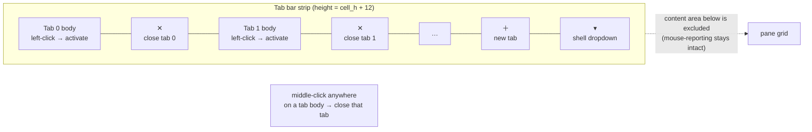

# kettle — terminal UI/UX comparison & backlog

How kettle's interaction model compares to the five terminals we cloned and
mined under `/tmp/term-research/`, what we adopted (with citations), and the
prioritized backlog with status. Every borrowed behavior cites the upstream
source file and line it came from — kettle borrows liberally and credits.

> Research method: each project cloned to `/tmp/term-research/<name>/`;
> behaviors verified against the named source file. kettle's own states are
> rendered through its real GPU path by `kettle --screenshot` (no mockups —
> same `wgpu`/`glyphon`/quad pipeline as the live app).

## kettle today (rendered offscreen via `kettle --screenshot`)


The frame above is produced by `kettle --screenshot docs/images/kettle-showcase.png
--cols 100 --rows 30`, driving the **actual** renderer: bundled JetBrains
Mono Nerd Font, the Catppuccin Mocha theme, the redesigned tab bar (active-tab
accent bar, per-tab `✕`, trailing `+`), and a focus-bordered vertical split.

### Reference terminals (best-effort, this CI image)

| Terminal | Screenshot | Notes |
|---|---|---|
| xterm (X.Org) |  | Installed via `apt`, captured under `Xvfb`+`import`. Baseline VT behavior, no chrome. |
| Alacritty | _n/a_ | `cargo install alacritty` not run on this headless image (heavy native deps, time-boxed); architecture mined from source instead. |
| kitty / WezTerm / Ghostty / Terminator | _n/a_ | Not installed on the CI image; behavior verified from cloned source (cited below) rather than a live capture. |

Reference captures are best-effort: where a terminal could not be installed
or run headlessly here, its UX is documented from the cloned source with
file:line citations — which is the authoritative comparison anyway.

## Comparison matrix

Legend: ✅ implemented · 🟡 partial · ⛔ not yet · — n/a.

| Area | kettle | Ghostty | kitty | WezTerm | Terminator | Alacritty |
|---|---|---|---|---|---|---|
| **Tabs** | ✅ tree of splits per tab | ✅ | ✅ | ✅ | ✅ | ⛔ (no tabs) |
| Per-tab close `✕` | ✅ always-on chip + hover red + pointer cursor (v1.3.2) | 🟡 | ✅ | ✅ `show_close_tab_button_in_tabs` | ✅ notebook close btn | — |
| New-tab `+` button | ✅ trailing segment | ✅ | ✅ | ✅ `show_new_tab_button_in_tab_bar` | ✅ | — |
| **New-tab `▾` shell dropdown** | ✅ WT-order shells + WSL distros + VS 2022 dev shells + Git Bash, `Ctrl+Shift+1..9`, live keybind hints (v2.18.0) | ⛔ | ⛔ | 🟡 `ShowLauncher` | ⛔ | — |
| Tab bar position | ✅ `tab-bar-position=top\|bottom` | ✅ | ✅ | ✅ `tab_bar_at_bottom` | ✅ `tab_position` | — |
| Tab title eliding | ✅ `truncate()` | ✅ | ✅ | ✅ `tab_max_width` | ✅ | — |
| **Drag-to-reorder tabs** | ✅ + ghost segment (v1.3.0 / v1.3.5) | ✅ | ✅ | ✅ | ✅ (GTK) | — |
| **Tab tear-off → new window (drag)** | ✅ Chromium model (v2.19.0): tears AT the strip threshold into a live window riding the OS move loop (Snap Layouts mid-drag); inherits source size, pointer holds the tab; Esc-before-tear cancels; `move_tab_to_new_window` keybind variant; Wayland = at-release fallback | ⛔ | 🟡 (`detach_tab`, keyboard) | ⛔ | ⛔ | — |
| **Tab re-dock (drag window→strip)** | ✅ (v2.19.0): drop a torn window on any kettle strip — dragged window goes translucent, accent insertion line marks the slot, lone-tab windows re-dock by their tab; live PTYs move both ways | ⛔ | ⛔ | ⛔ | ⛔ | — |
| **Multi-window (one process)** | ✅ N OS windows, shared GPU device, per-window accent hue (v2.18.0) | ✅ | ✅ | ✅ | ✅ | ✅ |
| **Activity / bell tab dots** | ✅ palette[6] / palette[3] (v1.3.0) | ⛔ | 🟡 | ✅ `tab_bar.bell` | ✅ (Activity / Urgent Watcher) | — |
| **Silence-watcher dot** | ✅ palette[8] dim, `tab-silence-threshold-ms` (v1.3.3) | ⛔ | ⛔ | ⛔ | ✅ (Silence Watcher origin) | — |
| **Undo-close tab** | ✅ ring-of-10, `undo_close_tab` (v1.3.0) | ⛔ | 🟡 | ✅ origin | ⛔ | — |
| **Duplicate tab / pane** | ✅ clone argv + cwd (v1.3.0) | ⛔ | ⛔ | ✅ | ⛔ | — |
| **Splits/panes** | ✅ binary tree | ✅ | ✅ (layouts) | ✅ | ✅ | ⛔ |
| Split keybinds | ✅ Terminator-exact | ✅ | ✅ | ✅ | ✅ (origin) | — |
| Unfocused-pane dimming | ✅ `unfocused-split-opacity` 0.7 | ✅ (origin) | 🟡 | 🟡 | ⛔ | — |
| Pane zoom/maximize | ✅ `Ctrl+Shift+X` | ✅ | ✅ | ✅ `is_zoomed` | ✅ | — |
| Configurable divider color | ✅ `split-divider-color` | 🟡 | 🟡 | ✅ `split` color | 🟡 (GTK theme) | — |
| Broadcast / group input | ✅ `Super+G` (tab bar + pane border tint warn) | ⛔ | ✅ `multi-input` | ✅ `ActivateKeyTable` | ✅ `broadcast_all` (origin) | ⛔ |
| **Right-click context menu** | ✅ floating panel, 8 entries (v1.3.0/v1.3.2) | ⛔ | ⛔ | 🟡 | ✅ origin | ⛔ |
| **Smart selection (regex double-click)** | ✅ URL / path / IPv4 / git SHA (cycle 288) | ⛔ | ⛔ | 🟡 `pattern` | ⛔ | ⛔ (iTerm2 origin) |
| **Command palette** | ✅ `Ctrl+Shift+K`, fuzzy, 41 commands | ✅ origin | 🟡 (`kitten hints`) | 🟡 (Lua) | ⛔ | ⛔ |
| **Quick-select / URL hints** | ✅ `Ctrl+Shift+H` (v1.0) | ⛔ | ✅ `kitten hints` origin | ✅ `QuickSelect` | ⛔ | ⛔ |
| **Search overlay** | ✅ `Ctrl+Shift+F`, regex + smart-case + reveal-into-scrollback | ✅ | ✅ | ✅ | ✅ | ✅ |
| **Shell integration (OSC 133)** | ✅ bundled `kettle --shell-integration <shell>` + `Ctrl+Up/Down` jump | ✅ | ✅ | ✅ | ⛔ | 🟡 |
| **SSH launcher** | ✅ `Ctrl+Shift+S` fuzzy, configured + freeform | ⛔ | ⛔ | ⛔ | 🟡 (`ssh-host` plugin) | ⛔ |
| **Vi-mode for scrollback** | ✅ `Ctrl+Shift+Space` (cycles 298-301) | ⛔ | ⛔ | ⛔ | ⛔ | ✅ origin |
| **Remote-control IPC** | ✅ `kettle --remote-send TEXT` (cycle 302) | ⛔ | ✅ `kitty @` origin | 🟡 (Lua API) | ⛔ | ⛔ |
| **Quake / dropdown toggle** | ✅ `kettle --toggle` (cycle 303) | ✅ quick-terminal origin | ⛔ | ⛔ | ⛔ | ⛔ |
| **Triggers (regex → urgency)** | ✅ `trigger = REGEX` (cycles 289-290) | ⛔ | ⛔ | 🟡 (Lua) | ⛔ | ⛔ (iTerm2 origin) |
| **Named layout / profile** | ✅ `--layout NAME` + `--profile NAME` (291-292) | 🟡 | 🟡 | 🟡 (workspace via Lua) | ✅ (origin) | ⛔ |
| **Session restore (multi-window)** | ✅ opt-in; every window's tabs + outer geometry, clamped to the live monitor layout (v2.18.0) | 🟡 | 🟡 (`--session` startup file) | 🟡 (Lua/plugin) | ✅ (layouts origin) | ⛔ |
| **Peacock accent-color** | ✅ per-window auto hue, on by default (v2.18.0); pin with `accent-color`/`--accent`, opt out via `accent-color = theme` | ⛔ | ⛔ | ⛔ | ⛔ | ⛔ (Peacock-for-VSC origin) |
| **Annotated screenshots** | ✅ `--annotate TEXT` (cycle 294, caption variant) | ⛔ | ⛔ | ⛔ | ⛔ | ⛔ |
| **Status bar widget** | ✅ `status-bar = top\|bottom` (cycles 295-296) | ⛔ | ✅ origin | ✅ Lua | ⛔ | ⛔ |
| **Cursor** | ✅ block/bar/underline | ✅ | ✅ | ✅ | ✅ | ✅ |
| Hollow when unfocused | ✅ | 🟡 | ✅ | ✅ | 🟡 | ✅ (origin) |
| Blink interval config | ✅ `cursor-blink-interval` ms | ✅ | ✅ | ✅ | ✅ | ✅ (origin, 750) |
| **Selection** | ✅ word/line/drag | ✅ | ✅ | ✅ | ✅ | ✅ |
| Copy-on-select toggle | ✅ `copy-on-select` | ✅ | ✅ | ✅ | ✅ | ✅ (origin) |
| Drag-and-drop file paths | ✅ shell-quoted, bracketed-paste-safe, broadcast-aware | ✅ | ✅ `paste_from_drop` | ✅ configurable | 🟡 (GTK builtin) | ⛔ |
| **Scrollback** | ✅ infinite option | ✅ | ✅ | ✅ | ✅ | ✅ |
| Scrollbar indicator | ✅ `scrollbar=never\|auto\|always` | 🟡 | ⛔ | ✅ `enable_scroll_bar` | ✅ `scrollbar_position` | ⛔ |
| **GPU rendering** | ✅ wgpu | ✅ (custom) | ✅ (OpenGL) | ✅ (wgpu) | ⛔ (GTK/VTE) | ✅ (OpenGL) |
| Ligatures | ✅ toggle | ✅ | ✅ | ✅ | 🟡 | ⛔ |
| Inline images | ✅ sixel+kitty+iTerm2 | ✅ | ✅ (origin kitty) | ✅ | ⛔ | ⛔ |
| Hyperlinks (OSC 8) | ✅ +autodetect | ✅ | ✅ | ✅ | ✅ | ✅ |

### Citations (upstream source we verified / borrowed from)

- **Split keybinds** — Terminator `terminatorlib/config.py:144-145`:
  `split_horiz = '<Shift><Control>o'`, `split_vert = '<Shift><Control>e'`.
  kettle now matches exactly (`Ctrl+Shift+O` → top/bottom, `Ctrl+Shift+E`
  → left/right) — see `kettle-config/src/keybinds.rs`.
- **Unfocused-split dimming** — Ghostty `src/config/Config.zig:1071`
  (`@"unfocused-split-opacity": f64 = 0.7`) and the clamp at
  `Config.zig:4676` (`@min(1.0, @max(0.15, …))`). kettle: same key, default
  0.7, clamp 0.1–1.0.
- **Tab bar buttons / position / width** — WezTerm `config/src/config.rs:496`
  `show_new_tab_button_in_tab_bar`, `:499` `show_close_tab_button_in_tabs`,
  `:483` `tab_bar_at_bottom`, `:509` `tab_max_width`.
- **Scrollbar** — WezTerm `config/src/config.rs:516` `enable_scroll_bar`;
  Terminator `terminatorlib/config.py:238` `scrollbar_position = "right"`.
- **Hollow unfocused cursor & copy-on-select & blink default** — Alacritty
  `alacritty/src/config/cursor.rs:21` `unfocused_hollow`, `:24/:33`
  `blink_interval` (default 750 ms), `alacritty/src/config/selection.rs:9`
  `save_to_clipboard`.
- **Pane zoom** — WezTerm `wezterm-gui/src/termwindow/mod.rs:264`
  `pub is_zoomed: bool`. kettle: `Tab.zoomed` + `Mux::toggle_zoom`,
  `Ctrl+Shift+X`.
- **Tab title eliding** — WezTerm `tab_max_width`; kettle reuses its own
  `truncate()` helper in `kettle-render/src/lib.rs`.
- **Broadcast / group input** — Terminator `terminatorlib/terminator.py`
  `broadcast_all` group action (origin of the "send keystrokes to every
  pane in this tab" affordance); kitty `multi-input.py` extension. kettle's
  variant: `Mux::broadcast_write` + `broadcast_paste` + `broadcast_scroll_to_bottom`
  scope to the active tab's leaves only (per-window-per-tab, not every
  pane in every tab — matches Terminator's intent). Visual indicator
  uses theme `palette[3]` (yellow) on both the active tab segment's
  accent and the focused-pane border, so the user can see broadcast is
  on regardless of `tab-bar` mode.
- **Drag-and-drop file paths** — iTerm2 (long history; macOS-conventional);
  kitty `paste_from_drop` config; WezTerm `WindowEvent::DroppedFile` handler;
  GTK provides this builtin for Terminator. kettle's variant in
  `kettle-ui/src/app.rs` `WindowEvent::DroppedFile`: shell-quote the path
  via the pure helper `shell_quote_path` (POSIX single-quote escape,
  `'\''` for embedded apostrophes — works on bash/zsh/fish/pwsh-7+),
  append a trailing space so `cat ` + drop + Enter Just Works, then route
  through `input::paste_payload(text, bracketed)` so vim / fzf / mc with
  bracketed paste enabled get the bytes wrapped in `\e[200~ … \e[201~`
  (no per-char normal-mode interpretation). Broadcast-aware: with group
  input on, the path goes to every pane in the active tab using
  `broadcast_paste`, which reads each pane's `BRACKETED_PASTE` mode
  separately for the wrap (a broadcast set containing one shell + one
  vim doesn't break either of them).

## Tab-bar hit regions

The tab-bar geometry is computed **once** in the UI (`App::tab_bar()` in
`kettle-ui/src/app.rs`) and is the single source of truth shared by both the
renderer (drawing) and mouse hit-testing (clicks) — no duplicated `x / (w/n)`
math. Each segment carries its own rect plus a trailing `✕` close rect; the
bar ends with a `+` new-tab rect.



Resolution order on `MouseInput::Pressed` (left button): `✕` rect → `+`
rect → tab body (→ set active). Middle button on any tab body → close that
tab. Closing the last tab exits the app.

Since v2.18.0 the `+` is followed by the Windows-Terminal-style `▾` shell
dropdown — always visible on every platform (it previously hid on
single-shell Unix hosts) — listing the detected shells, then Settings… /
Command palette / About kettle, each row with a right-aligned dimmed hint
computed from the **live** keybind map (rebinds show the user's actual
chord).

Since v2.19.0 a left-drag that pulls a tab **1.5 bar-heights past the tab
band** (any direction; pure-distance hysteresis, so dragging along the
strip still reorders) **tears the tab off instantly** into a live window
that inherits the source window's size and is positioned so the pointer
keeps holding the tab. The window is immediately handed to the OS's
native move loop (`drag_window()`: `WM_NCLBUTTONDOWN`/`HTCAPTION` on
Windows — Snap Layouts and FancyZones engage mid-drag —
`_NET_WM_MOVERESIZE` on X11, `performWindowDragWithEvent` on macOS), the
same handoff Chromium uses; PTYs, scrollback and running programs move
untouched and pane ids stay stable. Dragging it over another kettle
window's tab band turns the dragged window translucent (Windows), shows
an accent insertion line at the landing slot in the target strip —
materializing the strip on a single-tab `tab-bar = auto` window — and a
release there merges the tab at that slot and closes the emptied window.
A **lone-tab** window's tab drags the whole window (Chromium semantics),
which is how a torn-off window re-docks. `Esc` before the tear cancels;
within-slop releases never tear. On Wayland — no client-side window
positioning — the tear falls back to happening at release.

## Backlog status

**Shipped through v1.3.5** (the chronological list of "moved from
Future → Done since the v1.0 cut of this matrix"):

- Split-key Terminator parity (`Ctrl+Shift+O`/`E`), tab bar redesign,
  unfocused-pane dimming, pane zoom, per-pane scrollbar, split-
  divider color, cursor-blink interval, copy-on-select, tab-bar
  position, `--screenshot` offscreen capture — the original v1.0
  cycle.
- Command palette (`Ctrl+Shift+K`) — Ghostty/kitty parity.
- Quick-select hint mode (`Ctrl+Shift+H`) — kitty / WezTerm parity.
- SSH launcher (`Ctrl+Shift+S`) — kettle-original fuzzy launcher.
- Search overlay (`Ctrl+Shift+F`) with regex + smart-case +
  reveal-into-scrollback.
- Tab-bar mouse-wheel cycling (cycle ~135).
- Minimum-contrast adjustment (`minimum-contrast`, WezTerm parity).
- Background opacity + transparent rendering (cycle 148/149).
- Shell integration / OSC 133 jump-to-prompt (`Ctrl+Up`/`Down`) +
  bundled `kettle --shell-integration <bash|zsh|fish>` snippets.
- Drag-and-drop file paths (shell-quoted, bracketed-paste-safe,
  broadcast-aware) — kitty/WezTerm/iTerm2 parity.
- Block (rectangular) selection — iTerm2/Alacritty/WezTerm parity.
- v1.3.0 batch (UX cycle): `Ctrl+Shift+W` close-pane fix, tab `✕`
  hover affordance, right-click context menu (Terminator/GNOME/
  iTerm2), tab-bar activity / bell dots (Terminator), undo-close-
  tab (WezTerm), duplicate tab / pane (iTerm2), mouse-drag tab
  reorder (kitty/iTerm2/Ghostty).
- v1.3.3+ refinements: per-tab silence watcher (Terminator
  Silence Watcher), ghost-render of the dragged tab during reorder
  (v1.3.5), Homebrew formula template + AUR PKGBUILD + Nix flake
  for the install paths, SHA-256 sidecars on every release artifact
  for supply-chain integrity.

**Shipped in v1.4.0 → v1.7.0** (cycles 288–303, all in `main`):

- **Smart selection** (iTerm2 parity, cycle 288) — double-click
  expands to URL / file path / IPv4 / git SHA.
- **Triggers** (iTerm2 parity, cycles 289–290) — `trigger = REGEX`
  fires `window.request_user_attention(Critical)`.
- **`--layout NAME`** (Terminator parity, cycle 291) — named-
  workspace session restore.
- **`--profile NAME`** (Terminator + iTerm2 parity, cycle 292) —
  named-config split.
- **`accent-color`** (Peacock-for-VS-Code parity, cycle 293) —
  multi-window visual ID via one config knob.
- **`--annotate TEXT`** (iTerm2 caption variant, cycle 294) —
  bottom-strip overlay on `--screenshot` output.
- **Status bar** (iTerm2 / kitty parity, cycles 295–296) — clock ·
  theme · pane title.
- **Vi-mode for the scrollback** (Alacritty parity, cycles
  298–301) — `Ctrl+Shift+Space` enters; h/j/k/l/0/$/g/G/H/M/L +
  arrows; `v` visual selection; `y` yank; Esc exit.
- **Remote-control IPC** (kitty `@` parity, cycle 302) —
  `kettle --remote-send TEXT` via notify-watched command file.
- **Quake dropdown** (Yakuake / Tilda / Ghostty quick-terminal
  parity, cycle 303) — `kettle --toggle` flips window visibility
  via the cycle-302 IPC; users bind their OS / DE / compositor
  global hotkey.

**Shipped in v2.18.0** (multi-window + Windows Terminal parity):

- **In-process multi-window** — one kettle process hosts N OS
  windows; `new_window` (`Ctrl+Shift+I`) no longer spawns a second
  process. The GPU device/queue is shared across windows; the
  process exits when the last window closes.
- **Live tab tear-off** (Windows Terminal parity) — drag a tab
  outside the window and release: the tab moves *live* into a new
  window at the drop point — PTYs, scrollback and running programs
  untouched, pane ids stable; `Esc` or focus loss cancels. The
  `move_tab_to_new_window` keybind action is the same live in-process
  move (no respawn), which is also the path on Wayland, where the WM
  decides drop position.
- **Session v2** — `session.json` records every window (tabs +
  active + outer position/size); restore reopens each window at its
  saved position, clamped to the live monitor layout. Legacy
  single-window files still load, and new files mirror the legacy
  top-level fields to window 1 so older kettles can read them.
- **Per-window Peacock accents, on by default** — every window
  claims a distinct accent hue from the theme's pool (same
  project/cwd → same starting hue; cross-process coordination via a
  presence registry under `<runtime>/kettle/instances`). Opt out
  with `accent-color = theme`; pin a color with a hex or `--accent`.
- **WT-parity new-tab `▾` dropdown** — PowerShell / Windows
  PowerShell / Command Prompt / WSL distros / VS 2022 developer
  shells (vswhere) / Git Bash in Windows Terminal's order, plus
  Settings… / Command palette / About rows; `Ctrl+Shift+1..9`
  (`new_tab_shell_N`) opens the Nth entry; menu rows show live
  keybind hints.
- **About panel** — new `about` action (dropdown bottom row +
  command palette): version + git hash (exactly what `--version`
  prints), update status, copy-version / open-GitHub / open-release
  rows.

**Future** (intentionally deferred — large or out-of-scope):

- **Detachable mux server / remote attach** (WezTerm, tmux-style).
  Multi-week scope; touches the PTY abstraction, the session
  protocol, and the auth surface.
- **tmux `-CC` passthrough** (iTerm2 parity). Large; embeds the
  tmux control protocol inside kettle. ~5 cycles.
- **Lua scripting** (WezTerm parity). Embed `mlua`, expose a
  `kettle` API table (`send_text`, `set_tab_title`, event hooks).
  ~4-6 cycles.
- **Persistent in-terminal annotations** (iTerm2 — distinct from
  the v1.4.0 screenshot caption). Scrollback-position metadata +
  sticky-note overlay + search-jump-to. ~4 cycles.
- **Native macOS menu bar**. Needs macOS to test interactively;
  separate cycle once a maintainer with macOS commits to drive it.
- **Code-signed / notarized macOS build; Windows MSI installer.**
  Needs Apple Developer / Windows code-signing certificates; not
  doable from the public CI matrix.
- **Background blur / translucency on macOS / Windows** — kettle
  already honors `background-opacity` on Linux (cycle 148/149);
  the per-OS Vibrancy / DWM blur extension is desktop-shell-
  specific and not yet wired through winit.
- **Source-build AUR companion** (`kettle`, no `-bin` suffix) and
  upstream nixpkgs submission (so `nix-env -iA nixpkgs.kettle`
  works without the flake-input dance).

## Reproducing the captures

```sh
# kettle's own showcase (real GPU path, no window):
cargo run -p kettle -- --screenshot docs/images/kettle-showcase.png \
    --cols 100 --rows 30

# Reference terminal (best-effort, headless):
apt-get install -y xterm imagemagick
Xvfb :97 -screen 0 1000x650x24 & DISPLAY=:97 \
  xterm -e bash -c 'ls --color=always; sleep 6' &
DISPLAY=:97 import -window root docs/images/refs/xterm.png
```
