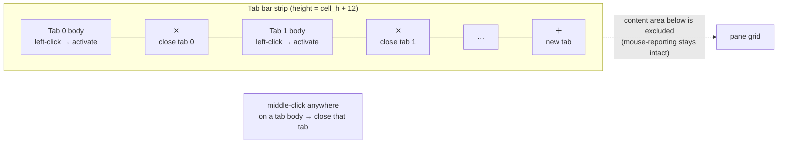

# kettle — terminal UI/UX comparison & backlog

How kettle's interaction model compares to the five terminals we cloned and
mined under `/tmp/term-research/`, what we adopted (with citations), and the
prioritized backlog with status. Every borrowed behavior cites the upstream
source file and line it came from — kettle borrows liberally and credits.

> Research method: each project cloned to `/tmp/term-research/<name>/`;
> behaviors verified against the named source file. kettle's own states are
> rendered through its real GPU path by `kettle --screenshot` (no mockups —
> same `wgpu`/`glyphon`/quad pipeline as the live app).

## kettle today (rendered offscreen via `kettle --screenshot`)


The frame above is produced by `kettle --screenshot docs/images/kettle-showcase.png
--cols 100 --rows 30`, driving the **actual** renderer: bundled JetBrains
Mono Nerd Font, the TokyoNight Night theme, the redesigned tab bar (active-tab
accent bar, per-tab `✕`, trailing `+`), and a focus-bordered vertical split.

### Reference terminals (best-effort, this CI image)

| Terminal | Screenshot | Notes |
|---|---|---|
| xterm (X.Org) |  | Installed via `apt`, captured under `Xvfb`+`import`. Baseline VT behavior, no chrome. |
| Alacritty | _n/a_ | `cargo install alacritty` not run on this headless image (heavy native deps, time-boxed); architecture mined from source instead. |
| kitty / WezTerm / Ghostty / Terminator | _n/a_ | Not installed on the CI image; behavior verified from cloned source (cited below) rather than a live capture. |

Reference captures are best-effort: where a terminal could not be installed
or run headlessly here, its UX is documented from the cloned source with
file:line citations — which is the authoritative comparison anyway.

## Comparison matrix

Legend: ✅ implemented · 🟡 partial · ⛔ not yet · — n/a.

| Area | kettle | Ghostty | kitty | WezTerm | Terminator | Alacritty |
|---|---|---|---|---|---|---|
| **Tabs** | ✅ tree of splits per tab | ✅ | ✅ | ✅ | ✅ | ⛔ (no tabs) |
| Per-tab close `✕` | ✅ click / middle-click | 🟡 | ✅ | ✅ `show_close_tab_button_in_tabs` | ✅ notebook close btn | — |
| New-tab `+` button | ✅ trailing segment | ✅ | ✅ | ✅ `show_new_tab_button_in_tab_bar` | ✅ | — |
| Tab bar position | ✅ `tab-bar-position=top\|bottom` | ✅ | ✅ | ✅ `tab_bar_at_bottom` | ✅ `tab_position` | — |
| Tab title eliding | ✅ `truncate()` | ✅ | ✅ | ✅ `tab_max_width` | ✅ | — |
| **Splits/panes** | ✅ binary tree | ✅ | ✅ (layouts) | ✅ | ✅ | ⛔ |
| Split keybinds | ✅ Terminator-exact | ✅ | ✅ | ✅ | ✅ (origin) | — |
| Unfocused-pane dimming | ✅ `unfocused-split-opacity` 0.7 | ✅ (origin) | 🟡 | 🟡 | ⛔ | — |
| Pane zoom/maximize | ✅ `Ctrl+Shift+X` | ✅ | ✅ | ✅ `is_zoomed` | ✅ | — |
| Configurable divider color | ✅ `split-divider-color` | 🟡 | 🟡 | ✅ `split` color | 🟡 (GTK theme) | — |
| **Cursor** | ✅ block/bar/underline | ✅ | ✅ | ✅ | ✅ | ✅ |
| Hollow when unfocused | ✅ | 🟡 | ✅ | ✅ | 🟡 | ✅ (origin) |
| Blink interval config | ✅ `cursor-blink-interval` ms | ✅ | ✅ | ✅ | ✅ | ✅ (origin, 750) |
| **Selection** | ✅ word/line/drag | ✅ | ✅ | ✅ | ✅ | ✅ |
| Copy-on-select toggle | ✅ `copy-on-select` | ✅ | ✅ | ✅ | ✅ | ✅ (origin) |
| **Scrollback** | ✅ infinite option | ✅ | ✅ | ✅ | ✅ | ✅ |
| Scrollbar indicator | ✅ `scrollbar=never\|auto\|always` | 🟡 | ⛔ | ✅ `enable_scroll_bar` | ✅ `scrollbar_position` | ⛔ |
| **GPU rendering** | ✅ wgpu | ✅ (custom) | ✅ (OpenGL) | ✅ (wgpu) | ⛔ (GTK/VTE) | ✅ (OpenGL) |
| Ligatures | ✅ toggle | ✅ | ✅ | ✅ | 🟡 | ⛔ |
| Inline images | ✅ sixel+kitty+iTerm2 | ✅ | ✅ (origin kitty) | ✅ | ⛔ | ⛔ |
| Hyperlinks (OSC 8) | ✅ +autodetect | ✅ | ✅ | ✅ | ✅ | ✅ |

### Citations (upstream source we verified / borrowed from)

- **Split keybinds** — Terminator `terminatorlib/config.py:144-145`:
  `split_horiz = '<Shift><Control>o'`, `split_vert = '<Shift><Control>e'`.
  kettle now matches exactly (`Ctrl+Shift+O` → top/bottom, `Ctrl+Shift+E`
  → left/right) — see `kettle-config/src/keybinds.rs`.
- **Unfocused-split dimming** — Ghostty `src/config/Config.zig:1071`
  (`@"unfocused-split-opacity": f64 = 0.7`) and the clamp at
  `Config.zig:4676` (`@min(1.0, @max(0.15, …))`). kettle: same key, default
  0.7, clamp 0.1–1.0.
- **Tab bar buttons / position / width** — WezTerm `config/src/config.rs:496`
  `show_new_tab_button_in_tab_bar`, `:499` `show_close_tab_button_in_tabs`,
  `:483` `tab_bar_at_bottom`, `:509` `tab_max_width`.
- **Scrollbar** — WezTerm `config/src/config.rs:516` `enable_scroll_bar`;
  Terminator `terminatorlib/config.py:238` `scrollbar_position = "right"`.
- **Hollow unfocused cursor & copy-on-select & blink default** — Alacritty
  `alacritty/src/config/cursor.rs:21` `unfocused_hollow`, `:24/:33`
  `blink_interval` (default 750 ms), `alacritty/src/config/selection.rs:9`
  `save_to_clipboard`.
- **Pane zoom** — WezTerm `wezterm-gui/src/termwindow/mod.rs:264`
  `pub is_zoomed: bool`. kettle: `Tab.zoomed` + `Mux::toggle_zoom`,
  `Ctrl+Shift+X`.
- **Tab title eliding** — WezTerm `tab_max_width`; kettle reuses its own
  `truncate()` helper in `kettle-render/src/lib.rs`.

## Tab-bar hit regions

The tab-bar geometry is computed **once** in the UI (`App::tab_bar()` in
`kettle-ui/src/app.rs`) and is the single source of truth shared by both the
renderer (drawing) and mouse hit-testing (clicks) — no duplicated `x / (w/n)`
math. Each segment carries its own rect plus a trailing `✕` close rect; the
bar ends with a `+` new-tab rect.



Resolution order on `MouseInput::Pressed` (left button): `✕` rect → `+`
rect → tab body (→ set active). Middle button on any tab body → close that
tab. Closing the last tab exits the app.

## Backlog status

**Done this cycle** (commits on `main`, behind the full gate):

1. Split-key Terminator parity (`Ctrl+Shift+O`/`E`).
2. Tab bar redesign: per-tab `✕`, `+`, middle-click close, always-show,
   `tab-bar`/`tab-bar-position` config, active accent, title eliding.
3. Unfocused-pane dimming (`unfocused-split-opacity`, default 0.7).
4. Pane zoom/maximize (`Ctrl+Shift+X`, `Tab.zoomed` + `Mux::toggle_zoom`).
5. Per-pane scrollbar (`scrollbar = never|auto|always`).
6. Configurable split-divider color (`split-divider-color`).
7. Cursor-blink interval config (`cursor-blink-interval`, ms).
8. Copy-on-select toggle (`copy-on-select`).
9. Tab-bar position (`tab-bar-position = top|bottom`).
10. `kettle --screenshot` offscreen capture (this document's images).

**Already shipped earlier** (verified, not re-built): hollow unfocused
cursor, selection colors, double/triple-click word/line select with
auto-copy, visual bell.

**Future** (documented, intentionally deferred — not built now):

- Command palette / fuzzy action launcher (Ghostty, kitty).
- Quick-select / URL hint mode (kitty `kitten hints`, WezTerm `QuickSelect`).
- Background blur / translucency tuning (Ghostty, kitty).
- Minimum-contrast adjustment (WezTerm `minimum_contrast`).
- Tab-bar mouse-wheel cycling; drag-to-reorder tabs.
- Detachable mux server / remote attach (WezTerm, tmux-style).

## Reproducing the captures

```sh
# kettle's own showcase (real GPU path, no window):
cargo run -p kettle -- --screenshot docs/images/kettle-showcase.png \
    --cols 100 --rows 30

# Reference terminal (best-effort, headless):
apt-get install -y xterm imagemagick
Xvfb :97 -screen 0 1000x650x24 & DISPLAY=:97 \
  xterm -e bash -c 'ls --color=always; sleep 6' &
DISPLAY=:97 import -window root docs/images/refs/xterm.png
```
